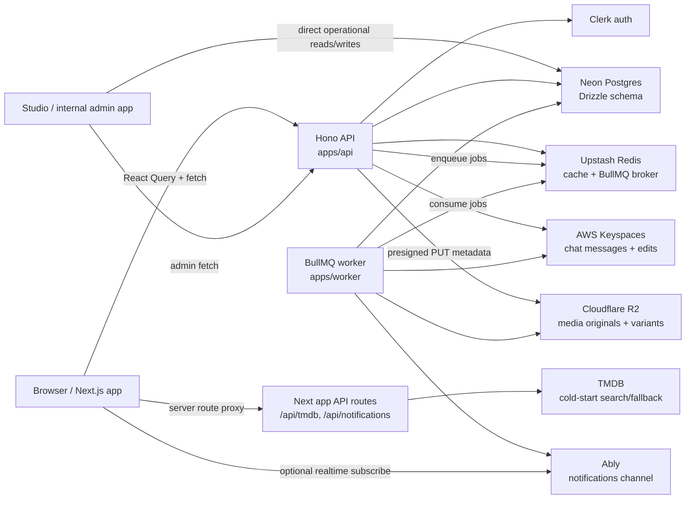

# 35mm Platform Codebase Knowledge

Generated from a direct repository inspection on 2026-06-23. Last refreshed for full content moderation backend on 2026-07-11 and mobile shell navigation behavior on 2026-07-17.

This is a working knowledge base for onboarding engineers and future AI sessions. It reflects the code currently present in the repo, not only the older architecture plan in `docs/architecture.md`.

## Executive Summary

35mm is a social film platform: a conversation-first film network with feed posts, film logging/reviews, comments, follows, notifications, profiles, lists/watchlists, discovery surfaces, and media uploads. The product direction is "Letterboxd x Twitter" with a target scale of 35M+ users.

The repository is a pnpm/Turborepo monorepo:

- `apps/web`: Next.js 15 App Router frontend.
- `apps/studio`: internal Next.js platform/content operations app.
- `apps/api`: Hono REST API.
- `apps/worker`: long-running BullMQ worker.
- `apps/ios`: SwiftUI iOS app.
- `packages/db`: Drizzle schema and Neon client.
- `packages/types`: shared TypeScript contracts.
- `packages/validators`: shared Zod validators.
- `packages/ui`: small shared UI primitive package.
- `packages/config`: shared TypeScript config.

Current implementation is beyond parts of the older architecture plan. The code now has canonical `films`, the new `catalog_` database core, catalog read APIs, catalog mutation APIs/helpers, Studio catalog-title API wiring, `post_bookmarks`, follows, comments, notifications, feed items, post edits, user blocks/mutes, film lists, watchlists, polls, contribution submissions, and chat thread metadata in the Drizzle schema. Chat message persistence uses AWS Keyspaces. Contribution rewiring, Meilisearch, Cloudflare Stream, and notification digest email remain partial, planned, or mock-heavy.

## High-Level Architecture

See `assets/architecture.mmd` for the Mermaid source.



Runtime flow:

- The browser uses Clerk for session state, React Query for server state, and Zustand for local UI state.
- The web app calls `NEXT_PUBLIC_API_URL` through feature API clients under `apps/web/features/*/api`.
- Hono verifies Clerk bearer tokens with `requireAuth`, bootstraps missing local users/profiles/settings/watchlists, and attaches `c.var.user`.
- Drizzle talks to Neon through `@neondatabase/serverless` HTTP.
- Upstash Redis is used for feed cache, catalog public read cache, rate limits, BullMQ broker URLs, suggestion cache, chat unread counters, chat typing TTLs, and chat presence TTLs.
- AWS Keyspaces stores chat message rows and message edit history in `thirtyFiveMM.messages` and `thirtyFiveMM.message_edits`.
- R2 presigned upload endpoints return the original public URL plus deterministic future variant URLs. New post creation stores the original URL/object key until `media.process` creates variants; the worker later writes WebP variants and blurhash for post media, plus avatar/cover variants for profile media.
- Notification creation writes DB rows and enqueues `notification.publish`; the worker publishes Ably `notification.new` events when `ABLY_API_KEY` exists.
- Chat send/read-state/typing/edit/reaction routes publish latency-sensitive Ably events directly from the API after durable state is written, with BullMQ worker jobs retained as fallback/asynchronous paths for publish failures, large inbox fanout, and delete/update recovery.

## Repository Map

### Root

- `package.json`: root scripts. `pnpm dev` runs web + API only to avoid idle BullMQ polling against shared Upstash Redis; `pnpm dev:all` runs web + Studio + API + worker; `pnpm dev:studio` runs only Studio. Node engine is `>=22.0.0`.
- `pnpm-workspace.yaml`: workspace boundary.
- `AGENTS.md`: project-critical rules. Film IDs must be 35mm ULIDs, not TMDB IDs.
- `README.md`: setup and runtime overview.
- `docs/architecture.md`: valuable design reference, but parts are stale against current schema.

### `apps/web`

Primary user-facing Next.js app.

Important files:

- `app/layout.tsx`: global metadata, Clerk provider, Query provider, fonts, analytics, service worker, offline status.
- `app/providers.tsx`: React Query client and persisted query cache, theme/accent providers, Suspense-backed dynamic notification/chat realtime providers, chat auth/current-user wiring, global new-chat provider, desktop floating chat inbox, notification title/sound side effects, toast host.
- `middleware.ts`: Clerk route protection. `/landing` redirects to `/`; guest-only auth pages (`/login`, `/signup`, `/forgot`, `/reset`, `/verify`) redirect authenticated sessions in middleware before page render.
- `app/(shell)/layout.tsx`: authenticated app shell with scroll restore, auth bootstrap, onboarding gate, and `ShellGrid`.
- `app/(shell)/page.tsx`: home feed, renders `PostComposer` and `InfinitePostList`.
- `app/api/tmdb/[...path]/route.ts`: TMDB proxy using server-side `TMDB_API_KEY`; used for cold-start/discover/autocomplete surfaces; protected by Upstash Redis REST response cache plus IP rate limit.
- `app/api/notifications/route.ts`: legacy/mock notifications endpoint.

Feature folders:

- `features/feed`: core post composer, feed list, post cards, comments, post mutations, poll UI, rich text, media handling.
- `features/profile`: public profile, follow state, edit profile, avatar/cover upload, connections, blocks/mutes. Mobile web and iOS share an X-style two-tier header action layout: 44px/44pt circular share/overflow controls beside the overlapping avatar, then wide message/follow/edit capsules below identity details; larger web breakpoints retain the existing desktop action row.
- `features/notifications`: notification list/dropdown, mark-read flows, realtime provider. Freshness comes from realtime plus a 30-second no-Ably fallback invalidator; badge/title/sound components do not each self-poll every 5 seconds.
- `features/moderation`: report flow, personal report history, and owner-only report detail. Detail presents a plain-language safety outcome, uses `PostCardHeader` / `CommentCardHeader` for captured author and posting-time context, and reuses the feed rich-text renderer instead of exposing stored document JSON. Snapshot cards are intentionally read-only.
- `features/lists`: film lists, watchlists, list detail/editor, list entry notes.
- `features/onboarding`: role/favorite films/genres/follow suggestions flow.
- `features/discover`: TMDB-backed discovery and search views.
- `features/settings`: account/privacy/notification/appearance/media/data-security settings with URL-backed section routes.
- `features/bookmarks`: two-column bookmark page, folder management, and post-to-folder flow backed by feed bookmark endpoints.
- `features/contribute`: contributor hub, config-driven contribution forms, Zod preflight validation, idempotent submit client, and personal submission tracker backed by `/v1/contributions/submissions`.
- `features/chat`: rich chat frontend with App Router chat pages, remote client backed by `/v1/chat`, optional mock mode for demos/tests, realtime cache application, and bounded persisted cache for inbox/recent messages.
- `features/short-films`, `features/festivals`, `features/communities`, `features/videos`: mostly product surfaces using mock/static data or future-oriented code.
- `features/title`: title detail pages, largely TMDB/discover oriented.
- `features/letterboxd-import`: local import parsing/storage UI.
- `PRODUCT.md`: product-register context for user-facing design work; `.impeccable/live/config.json` configures optional local visual iteration without changing runtime behavior.

### `apps/studio`

Internal platform/content operations app built with Next.js App Router. It is a separate workspace from the public web app and uses its own Clerk configuration.

Important areas:

- `app/api/studio/usernames/*`: username lock listing and mutation routes.
- `app/api/catalog/external/*`: external catalog lookup helpers.
- `components/films/*`: catalog title search, table, detail, and form surfaces backed by `/v1/catalog`.
- `components/shelves/*`: shelf list/editor/new-shelf flows.
- `components/layout/*`: Studio shell, sidebar, command palette, mobile nav, and theme controls.
- `lib/studio/db.ts`: Studio database connection helper.
- `lib/studio/usernameLocks.ts`: migration-missing detection helper for username lock operations.
- `lib/catalog/api.ts`: typed Studio client for Hono catalog read/mutation APIs, including title/media/external-ID edit staging with idempotency keys. Local browser calls on `localhost:3001` use `http://localhost:4000` directly; deployed/no-env browser calls use the Studio `/api/platform/*` server proxy before reaching the platform API. The proxy rejects self-targeting Studio URLs and converts upstream non-JSON failures into JSON diagnostics.
- `lib/studio/platformClient.ts`: shared base-URL resolver (`resolvePlatformApiUrl`), `platformRequest`, and `PlatformApiError` used by both catalog and moderation clients so they share one proxy contract.
- `lib/moderation/api.ts` + `lib/moderation/constants.ts`: typed client for `/v1/admin/moderation/*` (queue, content detail with independent `reportCursor`/`actionCursor`/`strikeCursor`, apply, dismiss) plus per-attempt `Idempotency-Key` generation, reason/status/action label maps, snapshot preview/body helpers, and enforcement-action metadata (destructive/duration/strike flags).
- `hooks/useModerationQueue.ts`, `hooks/useModerationQueueFilters.ts` (nuqs URL-backed status/contentType/reason), `hooks/useModerationContent.ts` (detail + independent load-more + apply/dismiss mutations with `503` same-key retry).
- `components/moderation/*` and `app/moderation/*`: queue list (grouped rows, filters, cursor pagination) and content detail (per-type snapshot render, staff-only reporter list, author strike context, enforcement action panel with confirm dialog + distinct Dismiss, read-only audit trail). Gated on `moderation` / `moderation_admin` Studio roles (nav hidden + `proxy.ts` redirect; API enforces). `lib/auth/accessControl.ts` carries the `moderation_admin` role and `moderation:admin` permission.
- `lib/data/*`: external source lookup and remaining local operational helpers for non-catalog-title surfaces.

### `apps/ios`

Native SwiftUI app target `ThirtyFiveMM` (`com.35mm.app`) with ClerkKit auth, the shared REST `APIClient`, Kingfisher image loading, and optional Ably realtime.

Debug device signing intentionally omits `ThirtyFiveMM.entitlements` so Apple Personal Teams can provision physical devices. Release signing retains Clerk's Associated Domains `webcredentials` entitlement and requires a paid Apple Developer Program team. `com.35mm.app` is only the reverse-DNS bundle identifier, not the public website origin.

Important files:

- `ThirtyFiveMM.xcodeproj`: app target plus `ThirtyFiveMMTests` XCTest target.
- `ThirtyFiveMM/App/AppConstants.swift`: API and web base URLs, Clerk publishable key, and optional Ably API key loaded from `ThirtyFiveMM.xcconfig` / Info.plist. The configurable web origin lets native Discover share the Next `/api/tmdb` proxy in local and deployed environments.
- `ThirtyFiveMM/Core/Auth/AuthManager.swift` and `ThirtyFiveMM/App/RootView.swift`: Clerk session restoration, API bootstrap/onboarding gate, and retry/sign-out recovery when Clerk is signed in but app bootstrap is unavailable.
- `ThirtyFiveMM/Core/Networking/APIClient.swift`: async/await REST client with Clerk bearer auth, standard `{code,message}` errors, and typed `KEYSPACES_UNAVAILABLE` mapping.
- `ThirtyFiveMM/Core/Networking/APIEndpoint.swift` and `ThirtyFiveMM/Core/PostInteracting.swift`: typed native endpoints and interaction protocol for feed likes, reposts, bookmarks, poll votes, comments, onboarding, and chat-adjacent app flows.
- `ThirtyFiveMM/Core/BottomActionSheet.swift`: shared action-sheet surface plus Boolean/item presentation modifiers. Surface mirrors mobile web's `PortalDropdown` bottom sheet through its title-free 32pt shell, neutral 38% dark backdrop, sunken/elevated color layers, 22pt grouped cards, 58pt rows, inset dividers, safe-area spacing, and 80pt drag-to-dismiss threshold. Native backdrop uses direct translucency instead of SwiftUI light material, which can become an opaque white wash inside transparent covers. Presenter suppresses system cover choreography, then drives backdrop fade and bottom-panel movement in one 300 ms smooth transaction for synchronized entry/exit. Reduce Motion uses an immediate path. Feed, comments, image viewer, bookmarks, profiles, titles, reviews, and credits use this presenter.
- `ThirtyFiveMM/Core/Models/FeedPost.swift`, `RepostContext.swift`, and `QuotedFeedPost.swift`: native Codable mirror of feed post payloads, including canonical film refs, author role context, media/link previews, viewer interaction flags, ranking/image poll state, bounded aggregated repost proof, and non-recursive quote previews/tombstones.
- `ThirtyFiveMM/Core/Models/Catalog.swift` and `ThirtyFiveMM/Features/Discover`: native catalog/TMDB discovery DTOs and service boundaries, debounced multi-search, and web-equivalent popular hero, streaming-provider, trending, ranked, current-release, popular, mood, TV, and Now Playing shelves. Discovery reads reuse web's cached/rate-limited `/api/tmdb` proxy; selection performs an indexed external-ID lookup through `/v1/catalog/titles` and uses only the returned canonical catalog ID for native navigation. Provider changes reload only the streaming shelf.
- `ThirtyFiveMM/Features/Title`: catalog-backed title hero/metadata, overview/reviews tabs, lazy cursor-paged social reviews, complete cursor-paged cast/crew, live watchlist state, and title/credit/review bottom action sheets. Catalog title IDs remain navigation identity; social review/watchlist calls use only nullable `legacyFilmId` canonical film bridges.
- `ThirtyFiveMM/Features/Feed/FeedViewModel.swift`, `PostDetailViewModel.swift`, and `PostCard.swift`: native home/detail post interaction state with optimistic likes/reposts/bookmarks/poll votes, comment navigation, rich text, media grids, link previews, web-aligned poll result UI, and cinematic film-log cards whose poster-derived glow uses a bounded on-device color cache. Feed cards clamp long bodies while detail cards render them completely; TipTap paragraphs use one line break. Post detail keeps the reply trigger/composer inline above cursor-paged comments, and comment cards expose compact like/reply-count/reply actions over existing interaction endpoints. Post and comment identity stacks share compact role/context/films-logged presentation; their avatar/name/username controls emit typed `AppRoute.profile` destinations to the shared native profile screen. Shared `FeedAuthorIdentityLabel`/`FeedTimestampLabel` views match web's inline 13.5pt identity and 12pt muted timestamp treatment, while `feedRelativeShort` matches web's `now`/minute/hour/unbounded-day values without switching older feed items to calendar dates. `Core/ShareModal.swift` replaces the generic activity controller for the branded post/profile share path and reproduces mobile web's preview, 5x2 destination grid, copy control, 32pt sheet geometry, and coordinated backdrop motion using already-loaded content only. The regular-height shell has no height frame and hugs content directly; bounded scrolling exists only inside the compact-height body. The sheet is precomposed offscreen and animates as one container, with an eager fixed grid preventing staged child insertion.
- `ThirtyFiveMM/Features/Feed/PostRepostContextView.swift`, `QuotedPostCard.swift`, and the app composer provide native parity for expanded repost/quote flows. Repost buttons open Repost/Undo + Quote actions on cards and image viewers; viewer-aware social proof uses at most two named actors; feed/profile/bookmark loaded pages merge normalized duplicate source IDs in bounded memory. Quote embeds render source content or tombstones and navigate through one bounded detail read. `PostMediaGrid.swift` and `PostMediaGridItem.swift` centralize responsive one-to-four-image presentation for both normal and quoted cards, preventing multi-image quote previews from collapsing into one image plus a count badge. Quote submission sends `quotedPostId` through existing `POST /v1/feed`, blocks duplicate taps, reports failures, and prepends the returned post.
- `ThirtyFiveMM/Features/Bookmarks`: native All/Unsorted/folder bookmark pages over the existing cursor API, with denormalized folder counts, create/rename/delete and move/remove flows, bottom action sheets, localized loaded-page search, explicit next-page search, stale-response protection, duplicate-mutation guards, and optimistic rollback. The tab supplies the collection heading; per-post folder badges appear only in All for assigned folders, folder actions live beside the add control, and move/copy/remove reuse `PostCard`'s existing overflow instead of adding a standalone row. The create/rename editor uses an opaque grouped-system surface with a compact 230pt standard detent and a 330pt accessibility Dynamic Type detent. Reads stay bounded at 20 posts per cursor page; no bookmark-specific API or index was added.
- `ThirtyFiveMM/Core/Models/PublicProfile.swift`, `ProfileStatsSummary.swift`, `FilmListSummary.swift`, and `ProfileMutation.swift`: native profile read/edit contracts, including explicit-null PATCH encoding for cleared optional fields and profile media.
- `ThirtyFiveMM/Features/Profile`: native mobile-web-aligned profile screen with cover/avatar identity, accessible full-screen avatar/cover previews through shared `Core/ImageViewerView.swift`, a role/context identity chip separate from denormalized inline counts, web-matched adaptive regular/strong header-action borders, equal-width Posts/Diary/Lists/Stats tabs, independent 20-item post/list cursor streams, lazy list and cached-stats reads, optimistic post actions, app-standard bottom sheets for overflow/unfollow/block actions, share/copy actions, and validated edit-profile/media flows over existing REST endpoints. Profile media presentation disables system cover choreography, centers circular profile photos, preserves fitted rectangular covers, and labels both with `@username` below. Preview delivery uses existing Kingfisher caching and bounded retry behavior; it adds no API, schema, worker, or index.
- `ThirtyFiveMM/Core/Models/Chat.swift`: native Codable mirror of shared chat contracts. Message IDs are opaque TIMEUUID strings.
- `ThirtyFiveMM/Features/Chat/ChatAPIClient.swift`: every `/v1/chat` endpoint, including `before` cursor message paging, reactions, read state, archive/mute/delete, typing, and presence.
- `ThirtyFiveMM/Features/Chat/ChatRealtimeClient.swift`: optional Ably transport for `user:{userId}:inbox` and `thread:{threadId}` lifecycle subscriptions, with noop fallback when Ably config is missing.
- `ThirtyFiveMM/Features/Chat/ChatBlurhash.swift`: native blurhash placeholder decoding for chat media thumbnails before Kingfisher fade-in.
- `ThirtyFiveMM/Features/Chat/ChatComposerModels.swift`: local composer, staged attachment, and optimistic delivery-state models for native chat writes.
- `ThirtyFiveMM/Core/Networking/MediaUploadClient.swift` and `ThirtyFiveMM/Features/Chat/ChatMediaUploadClient.swift`: shared native presigned uploader plus API wrapper for `POST /v1/media/presign` and direct R2 PUT, used by chat attachments and profile avatar/cover uploads.
- `ThirtyFiveMM/Features/Chat/ChatInboxViewModel.swift`: native inbox state coordinator for cursor paging, refresh/reconnect reconciliation, in-place `thread.updated` realtime row updates, visible-row presence batching, visible-thread typing TTLs, swipe mutations, profile search, and DM thread creation.
- `ThirtyFiveMM/Features/Chat/ChatInboxView.swift`: SwiftUI native messages inbox module with DM/group rows, skeleton/error/empty states, archived/default views, native swipe actions, unread badges, presence dots, typing previews, and minimal DM compose flow. It is mounted from the app shell header as a `NavigationStack` push, not as a bottom-tab destination.
- `ThirtyFiveMM/Features/Chat/ChatThreadViewModel.swift`: native thread coordinator for newest-at-bottom display, `before` pagination, Ably message/reaction/read/typing updates, read receipt summaries, reaction toggles, optimistic send/retry, edit/delete, throttled typing, foreground-only read dispatch, reconnect reconciliation, reply highlighting, and non-disruptive new-message state while scrolled up.
- `ThirtyFiveMM/Features/Chat/ChatThreadView.swift`: SwiftUI thread screen with grouped bubbles, date separators, deleted/edited/reply rendering, image/GIF/file/link content, reaction pills/picker, read receipts, typing bubbles, skeleton/error/empty states, full-screen chat image viewer, growing composer, photo/file pickers, staged attachment previews, reply/edit bars, and sender-only message actions.
- `ThirtyFiveMMTests/ChatDecodingTests.swift`: fixture decoding coverage for text/image/reply/reaction/deleted messages plus DM/group inbox pages.
- `ThirtyFiveMMTests/FeedPostDecodingTests.swift`: fixture coverage for film-log presentation metadata and author role fields in the shared feed payload.
- `ThirtyFiveMMTests/BookmarksViewModelTests.swift`: native bookmark coverage for initial folder/count state, cursor deduplication, localized search, move success/rollback, and folder-name normalization.
- `ThirtyFiveMMTests/CatalogDecodingTests.swift` and `DiscoverViewModelTests.swift`: fixture decoding for title/credit contracts and view-model coverage for trimmed search, result deduplication, tab request caching, and isolated streaming-provider refresh.
- `ThirtyFiveMMTests/ProfileFeatureTests.swift`: profile/stats/list fixture decoding, edit validation and explicit-null mutation encoding, cursor deduplication, lazy tab loading, and optimistic interaction rollback.

### `apps/api`

Hono REST API.

Important files:

- `src/index.ts`: bootstraps env, DB, CORS, error handling, and route mounts. Non-production CORS augments configured origins with `http://localhost:3000` and `http://localhost:3001` so local web and Studio can both call protected API routes.
- `src/lib/middleware.ts`: Clerk auth, local user bootstrap, watchlist bootstrap, `requireAuth`. API auth accepts the primary Clerk secret plus optional Studio Clerk secrets (`STUDIO_CLERK_SECRET_KEY`, `CLERK_STUDIO_SECRET_KEY`, or comma-separated `CLERK_SECRET_KEYS`) so internal Studio can use a separate Clerk application while preserving bearer-token verification. Verified token metadata is attached to `AuthUser` for Studio role checks before catalog auth falls back across configured Clerk secrets for user metadata.
- `src/lib/db.ts`: singleton Drizzle DB access; `getDb()` uses Neon HTTP, while `getWriteDb()` uses the pooled Neon driver for transaction-capable multi-table write paths.
- `src/lib/cursor.ts`: base64 JSON `(createdAt,id)` cursor encoding.
- `src/lib/ulid.ts`: local ULID generator and validator.
- `src/lib/feedCache.ts`: Upstash-backed feed page cache and index-based invalidation.
- `src/modules/catalog/readCache.ts`: Upstash-backed public catalog GET cache with normalized path/query keys, 45-second TTL, and index-based invalidation after applied catalog mutations.
- `src/lib/rateLimit.ts`: Redis fixed-window rate limiting; allowed requests avoid per-request `TTL` reads and only fetch TTL for blocked responses. Missing identity always fails closed with `503`. Missing/unreachable Redis fails closed in production, while non-production uses a bounded process-local fixed-window fallback unless `RATE_LIMIT_DISABLED=true` or tests disable limiting.
- `src/lib/moderation.ts`: block/mute filters and feed item purge helpers.
- `src/lib/studioAuth.ts`: shared Clerk Studio role normalization/metadata fallback used by catalog and moderation; includes `moderation_admin` plus catalog-write, moderation, and cross-staff reversal predicates.
- `src/lib/notifications.ts`: API binding for shared preference-aware, moderation-aware notification creation and bundling in `@35mm/db/notification-service`.
- `src/lib/filmLists.ts`: watchlist bootstrap and film ID resolution from existing ULID, TMDB metadata, or catalog metadata.
- `src/lib/jobs.ts`: BullMQ producer for media, notification, counter, feed, moderation, and chat jobs.
- `src/lib/keyspaces.ts`: Cassandra driver client for AWS Keyspaces using SigV4 IAM auth, warmed connection pools, prepared statements by default, and `chat-read`/`chat-write` execution profiles.
- `src/modules/catalog/readService.ts`: public catalog read/search service for title/person/company detail, compact search cards, credits, media, external IDs, aliases, relations, awards, company titles, edit queue, and public history. Reads use cursor pagination and DB-backed `sort_title` / `sort_name` prefix search.
- `src/modules/catalog/mutations.ts`: production catalog mutation helper for stage/apply/reject/revert/merge/batch. It uses shared validators, pooled Drizzle transactions, transaction-local `SET LOCAL lock_timeout`, deterministic current-row locks, advisory-lock idempotency, same-transaction `catalog_index_jobs`, field-level supersede detection, hard-delete restore support for relation-style current-state tables, and structured catalog mutation/metric logs.
- `src/modules/catalog/routes.ts`: `/v1/catalog` read routes plus mutation routes for titles, people, credits, media, external IDs, aliases, title relations, title companies, title genres, companies, awards/events/nominations, merge, edit queue, approve/reject/revert, and title/person/company history. Public read routes use the catalog read cache. Public mutation routes derive source server-side from Clerk Studio role, rate-limit write requests, require idempotency keys, and ignore client-supplied `source`; workflow actions require existing Studio Clerk catalog-write roles.
- `src/modules/chat/routes.ts`: authenticated chat inbox, thread creation, message read/write/edit/delete, reactions, read receipts, archive/mute/delete, typing, and presence routes.
- `src/modules/contributions/routes.ts`: authenticated contribution submission queue routes. `POST /submissions` requires `Idempotency-Key`, validates with shared Zod schemas, applies user rate limiting, and writes review-state rows. `GET /submissions` returns cursor-paged viewer submissions.
- `src/modules/moderation/reports.ts`: transactional report creation, server-side post/comment/profile snapshot capture, unresolved-report dedupe, denormalized content-state count updates, public report serialization, and per-reporter cursor history.
- `src/modules/moderation/routes.ts`: authenticated `POST /v1/reports`, cursor-paginated `GET /v1/me/reports`, and owner-only `GET /v1/me/reports/:reportId`; creation is limited to 20/hour/user. List DTOs exclude snapshots, while detail returns a reporter-safe submission snapshot without author IDs, reporter identity, staff notes, or exact enforcement internals.
- `src/modules/moderation/adminReadService.ts`: indexed grouped queue, bounded staff detail pages, and subject-user strike/action history. Queue candidates come from denormalized content state before bounded reason/snapshot hydration.
- `src/modules/moderation/actions.ts`: advisory-key idempotent, lock-bounded staff action/dismiss transactions covering audit rows, content state, report resolution, strike/account enforcement, and durable notification outbox.
- `src/modules/chat/chatRedis.ts`: unread counters, sorted-set typing indicators, and presence over Upstash Redis REST. Inbox unread and presence batch endpoints use Redis `MGET`.
- `src/modules/chat/chatUtils.ts`: chat message bucket and preview helpers.

Mounted routes:

- `/health`
- `/poster-proxy`
- `/v1/webhooks/clerk`
- `/v1/usernames/:username/available`
- `/v1/me`
- `/v1/me/onboarding-status`
- `/v1/onboarding/films/resolve`
- `/v1/me/onboarding`
- `/v1/onboarding/suggestions`
- `/v1/profiles/*`
- `/v1/follows/*`
- `/v1/suggestions/users`
- `/v1/me/notifications*`
- `/v1/lists*`
- `/v1/me/settings*`
- `/v1/media*`
- `/v1/contributions/submissions`
- `POST /v1/reports`
- `GET /v1/me/reports`
- `GET /v1/me/reports/:reportId`
- `/v1/admin/moderation/queue`
- `/v1/admin/moderation/content/:contentType/:contentId`
- `/v1/admin/moderation/content/:contentType/:contentId/action`
- `/v1/admin/moderation/content/:contentType/:contentId/dismiss`
- `/v1/admin/moderation/users/:userId/strikes`
- `/v1/catalog/titles` and `/v1/catalog/titles/:id`
- `/v1/catalog/titles/:id/credits`, `/media`, `/external-ids`, `/aliases`, `/relations`, `/awards`, `/history`
- `/v1/catalog/people` and `/v1/catalog/people/:id`
- `/v1/catalog/people/:id/credits`, `/media`, `/external-ids`, `/aliases`, `/history`
- `/v1/catalog/companies` and `/v1/catalog/companies/:id`
- `/v1/catalog/companies/:id/titles`, `/external-ids`, `/history`
- `POST/PATCH/DELETE /v1/catalog/titles`, `/people`, `/credits`, `/media`, `/external-ids`, `/aliases`, `/title-relations`, `/title-companies`, `/title-genres`, `/companies`, `/awards`, `/award-events`, `/award-nominations`
- `/v1/catalog/merge`
- `/v1/catalog/edits`
- `/v1/catalog/edits/:id`
- `/v1/catalog/edits/:id/approve`
- `/v1/catalog/edits/:id/reject`
- `/v1/catalog/edits/:id/revert`
- `/v1/users/*`
- `/v1/feed*`
- `/v1/chat*`

### `apps/worker`

Long-running BullMQ consumer.

Important files:

- `src/index.ts`: exits early when `WORKER_ENABLED=false`; otherwise resolves Redis URL, creates BullMQ `Worker` and `QueueEvents`, and dispatches jobs by name.
- `src/jobs/mediaProcess.ts`: pulls originals from R2; generates post thumb/feed/full WebP variants and blurhash; generates avatar sm/lg and cover default variants; optionally uploads post media to Cloudflare Images with R2 fallback; updates `posts.media` / `posts.media_urls` or profile variant JSONB fields.
- `src/jobs/notificationPublish.ts`: reads notification details and publishes Ably `notification.new` to `user:{recipientId}:notifications`.
- `src/workers/suggestionWorker.ts`: computes friend-of-friend suggestions and writes UUID-backed `follow_suggestions` rows plus Redis cache.
- `src/jobs/feedFanout.ts`: materializes accepted-follower `feed_items` below the high-follower threshold and skips high-follower authors for live read merge.
- `src/jobs/feedRescore.ts`: recomputes recent materialized feed scores from denormalized post counters.
- `src/jobs/catalogIndex.ts`: drains `catalog_index_jobs` through the partial unprocessed index with `FOR UPDATE SKIP LOCKED`, enqueues idempotent BullMQ `catalog.index` jobs, marks rows processed, samples pending-review queue depth outside the mutation path, and emits index-job lag logs. The `catalog.index` handler logs unconfigured search target until Meilisearch document writes are wired.
- `src/jobs/notificationDigest.ts`: currently logs readiness only.
- `src/jobs/chatDeliver.ts`: fetches Keyspaces message rows and publishes new-message + inbox update events.
- `src/jobs/chatMessageUpdated.ts`: publishes edit/delete/reaction updates from Keyspaces message rows.
- `src/jobs/chatReadReceipt.ts`: publishes thread read receipts.
- `src/jobs/chatTyping.ts`: publishes typing state.
- `src/lib/keyspaces.ts`: worker-side AWS Keyspaces client using SigV4 IAM auth, warmed connection pools, prepared statements by default, and `chat-read`/`chat-write` execution profiles.
- `src/jobs/moderationAutoHide.ts`: idempotent threshold/window/trusted-follower auto-hide transaction, cache synchronization, and under-review notification.
- `src/jobs/moderationNotifyReporters.ts`: reclaimable durable outbox drain with bounded reporter batches, idempotent notification source keys, author enforcement notices, and reporter outcome notices.
- `src/scripts/backfillMedia.ts`: idempotent post media backfill runner.
- `src/scripts/backfillProfileMedia.ts`: idempotent avatar/cover variant backfill runner exposed as `pnpm --filter @35mm/worker backfill:avatars`.

## Data Model

See `assets/data-model.mmd` for the Mermaid source.

```mermaid
erDiagram
  users ||--|| profiles : owns
  users ||--|| user_settings : configures
  users ||--o{ posts : authors
  films ||--o{ posts : referenced_by
  posts o|--o{ posts : quoted_by
  posts ||--o{ post_likes : receives
  posts ||--o{ post_reposts : receives
  posts ||--o{ post_bookmarks : receives
  users ||--o{ bookmark_folders : owns
  bookmark_folders ||--o{ post_bookmarks : groups
  posts ||--o{ post_polls : has
  post_polls ||--o{ poll_options : has
  post_polls ||--o{ poll_votes : receives
  posts ||--o{ comments : has
  comments ||--o{ comments : replies
  comments ||--o{ comment_likes : receives
  users ||--o{ follows : follower
  users ||--o{ follows : following
  users ||--o{ notifications : recipient
  users ||--o{ notifications : actor
  users ||--o{ feed_items : owns
  posts ||--o{ feed_items : materialized_into
  posts ||--o{ post_edits : history
  users ||--o{ film_lists : owns
  film_lists ||--o{ film_list_entries : contains
  films ||--o{ film_list_entries : listed
  film_lists ||--o{ film_list_likes : receives
  users ||--o{ user_blocks : blocker
  users ||--o{ user_mutes : muter
  users ||--o{ contribution_submissions : submits
  films ||--o| catalog_titles : legacy_bridge
  catalog_titles ||--o{ catalog_title_relations : relates_from
  catalog_titles ||--o{ catalog_title_relations : relates_to
  catalog_titles ||--o{ catalog_title_genres : tagged
  catalog_genres ||--o{ catalog_title_genres : classifies
  catalog_titles ||--o{ catalog_credits : has
  catalog_people ||--o{ catalog_credits : credited
  catalog_titles ||--o{ catalog_title_companies : company_role
  catalog_companies ||--o{ catalog_title_companies : works_on
  catalog_awards ||--o{ catalog_award_events : hosts
  catalog_award_events ||--o{ catalog_award_nominations : includes
  catalog_edits ||--o{ catalog_revisions : records
  catalog_edits ||--o{ catalog_sources : cites
  users ||--o{ chat_threads : creates
  chat_threads ||--o{ chat_participants : has
  users ||--o{ chat_participants : joins
  chat_threads ||--o{ chat_member_state : has
  users ||--o{ chat_member_state : configures
  chat_threads ||--|| chat_thread_meta : summarizes
  username_locks {
    string username PK
    string state
    string owner
    string reason
    timestamp created_at
    timestamp updated_at
  }
  contribution_submissions {
    string id PK
    string user_id FK
    string kind
    string status
    string title
    string summary
    json payload
    string idempotency_key
    boolean is_deleted
    timestamp created_at
    timestamp updated_at
  }
  catalog_titles {
    string id PK
    string legacy_film_id FK
    string type
    string lifecycle
    string status
    string primary_title
    string slug
    int start_year
    string parent_title_id FK
    timestamp updated_at
  }
  catalog_people {
    string id PK
    string primary_name
    string slug
    string status
    timestamp updated_at
  }
  catalog_credits {
    string id PK
    string title_id FK
    string person_id FK
    string department
    string job
    int billing_order
  }
  catalog_genres {
    string id PK
    string slug
    string name
    boolean is_active
  }
  catalog_title_genres {
    string title_id FK
    string genre_id FK
    int sort_order
  }
  catalog_edits {
    string id PK
    string source
    string status
    string actor_user_id FK
    string summary
    string idempotency_key
    timestamp created_at
  }
  catalog_revisions {
    string id PK
    string edit_id FK
    string entity_type
    string entity_id
    string action
    json before_data
    json after_data
  }
```



Current Drizzle schema highlights:

- `users`: UUID primary key, Clerk ID, email, age verification, account status.
- `profiles`: username, display name, bio/media, nullable `avatar_variants` / `cover_variants` JSONB, privacy, onboarding fields, favorite film/genre IDs, role/headline, films logged count, moderation strike count, follower count, unsorted bookmark count, and following count.
- `username_locks`: Studio-managed lowercase username lock/reservation table with `locked | reserved` state, owner/reason metadata, timestamps, and DB checks for lowercase usernames plus allowed state values. API username availability and profile updates consult this table before allowing a username.
- `films`: text primary key intended to be a 35mm ULID, optional unique `tmdb_id` and `imdb_id`, source enum `35mm | tmdb_import | user_contributed`.
- `catalog_titles`: long-term IMDb-like title records for movies, short films, documentaries, TV/web series, seasons, episodes, specials, videos, and other title types. It bridges to existing `films` through nullable unique `legacy_film_id`, stores lifecycle/status/title/release/runtime/language/country facts, hierarchy fields, lock/merge metadata, and current-state read indexes.
- `catalog_people`: cast/crew profile records with primary/sort names, slug, biography, birth/death facts, professions, verification, lock/merge metadata, and person-list indexes.
- `catalog_companies`: studios, production companies, distributors, networks, streamers, sales agents, festivals, schools, collectives, and other organizations. Public company search uses `(sort_name, id)`.
- `catalog_credits`: normalized title/person credits by department, job, character, credited-as name, billing order, episode scope, and status. Title pages use `(title_id, department, billing_order, id)`; person pages use `(person_id, title_id, id)`.
- `catalog_title_relations` and `catalog_title_companies`: non-hierarchical title graph edges plus title/company roles for sequels/remakes/adaptations and production/distribution/network/streaming relationships. Series/season/episode hierarchy is canonical on `catalog_titles.parent_title_id`, `season_number`, `episode_number`, and `absolute_episode_number`. Public relation reads use `(from_title_id, sort_order, id)`.
- `catalog_genres`, `catalog_title_genres`: first-class genre taxonomy and title/genre join table for Discover filtering, faceting, and search indexing. `catalog_title_genres` has an `id` primary key and `catalog_entity_type = 'title_genre'` for shared mutation/revision support. `catalog_titles.facts` genre values are import/display fallback only.
- `catalog_awards`, `catalog_award_events`, `catalog_award_nominations`: award/festival organizations, yearly events, and nominations/wins/selections tied to titles, people, or companies.
- `catalog_media_assets`, `catalog_external_ids`, `catalog_aliases`: polymorphic current-state media, external identifiers, and alternate/localized/search names for catalog entities. Public alias reads use `(entity_type, entity_id, sort_value, id)`.
- `catalog_edits`, `catalog_revisions`, `catalog_sources`: append-only catalog edit groups, per-entity before/after snapshots, changed field lists, public visibility flags, revert links, idempotency keys, archive-ready revision pointers, and citations. Rollback creates a new edit/revision instead of mutating history. Pending-review moderation queues use a partial `(status, created_at, id)` index.
- `catalog_index_jobs`: transactional outbox for catalog search/index work. Rows are written in the same transaction as applied/reverted edits; relay workers poll the partial `processed_at IS NULL` index. Processed rows can remain as an operational log without slowing the hot poll path.
- `contribution_submissions`: authenticated review queue for public catalog contributions. Kinds cover missing titles, title edits, credits, person updates, media, awards/events, duplicate titles, merge people, and split person. Rows store JSONB payloads, moderation status, title/summary, optional entity reference, soft-delete flag, and a unique per-user idempotency key.
- `posts`: UUID primary key, author, type, headline/body, `film_id` FK to `films`, `film_rating`, visibility, reply/repost flags, nullable `quoted_post_id` self-reference, denormalized counters, soft delete, edit timestamp, JSONB media, media URL array, link preview. Quote reverse lookups have a partial `(quoted_post_id, created_at DESC, id DESC)` index over non-deleted rows.
- `bookmark_folders`: per-user bookmark folders with denormalized `item_count` per folder.
- `post_bookmarks`: current bookmark table. The older `post_saves` rename appears completed in code; `folder_id` optionally points at `bookmark_folders` and falls back to unsorted on folder delete. User-first indexes support per-user bookmark cursor listing and folder-filtered bookmark pages.
- Folder counts are written synchronously in bookmark add/move/remove handlers with bounded updates to `bookmark_folders.item_count`; `/v1/feed/bookmarks/folders` avoids heavy `GROUP BY` scans and uses denormalized `profiles.unsorted_bookmark_count` for unsorted count.
- `post_polls`, `poll_options`, `poll_votes`: ranking/image polls, results visibility, end time, votes.
- `follows`: composite PK `(follower_id, following_id)`, status `pending | accepted`.
- `comments`: post/user/parent, body, like count, soft delete, edit timestamp. App code enforces nesting rules.
- `notifications`: recipient, actor, actor ID bundle array, type, entity, read state, bundle count. Notification types include `follow_request_approved` for accepted private-account requests and `chat_reaction` for first-time message reaction adds.
- `feed_items`: materialized feed rows for fanout/backfill.
- `post_edits`: post body/headline edit history.
- `user_blocks`, `user_mutes`: moderation relationship tables.
- `reports`: ULID-keyed user reports for post/comment/profile targets, including server-captured JSONB snapshots, reason/details, review status, and resolved-action linkage. Partial uniqueness enforces one unresolved report per reporter/content pair; grouping, queue, and per-reporter indexes are cursor-ready.
- `moderation_actions`: append-only ULID audit trail for staff/system enforcement with content/actor history indexes, optional source report, internal notes, JSONB metadata, denormalized `subject_user_id` for indexed cross-content strike history, and staff idempotency keys under a unique actor/key index.
- `moderation_content_state`: denormalized per-content visible/hidden/removed state, report count, and enforcement timestamps keyed by `(content_type, content_id)` so future public reads do not aggregate reports; queue ordering has a report-count/latest-report composite index.
- `moderation_notification_outbox`: durable notification intent keyed uniquely by action, committed atomically with staff enforcement and scanned through a partial unprocessed index. `report_cursor` advances bounded reporter batches without `OFFSET`.
- `notifications`: existing notification table now carries moderation notification types, JSONB copy metadata, and nullable unique `source_key` for retry-safe worker creation.
- `film_lists`, `film_list_entries`, `film_list_likes`: custom lists and one private watchlist per user. `film_list_entries` has a list-entry cursor pagination index on `(list_id, COALESCE(position, -1), added_at, id)` for `/v1/lists/:listId` keyset scans.
- `follow_suggestions`: suggestion table populated by worker. `user_id` and `suggested_user_id` are UUID FKs to `users.id`, with `(user_id, score desc, suggested_user_id)` for bounded top-suggestion reads.
- `user_settings`: privacy, notification, theme/accent, and media playback settings.
- `chat_threads`, `chat_participants`, `chat_member_state`, `chat_thread_meta`: Postgres chat metadata, membership, per-user read/archive/mute/delete state plus activity timestamps, and last-message summaries. `chat_threads` now stores deterministic DM pair identity (`dm_member_low`, `dm_member_high`) with a partial unique pair index.
- AWS Keyspaces `thirtyFiveMM.messages`: message body/media/reply/reaction rows, partitioned by `(thread_id, bucket)` and clustered by descending `message_id` TIMEUUID.
- AWS Keyspaces `thirtyFiveMM.message_edits`: edit history partitioned by `(thread_id, message_id)` and clustered by descending `edit_id` TIMEUUID.
- AWS Keyspaces `thirtyFiveMM.message_reactions`: sharded reaction fact table partitioned by `(thread_id, bucket, message_id, emoji, shard)` to avoid hot collection updates on viral messages.

Important data invariants:

- Film identity must be the 35mm ULID in app/API payloads. TMDB is metadata/fallback only.
- Long-term title identity should move to `catalog_titles.id`; current social APIs still use `films.id` until migration/backfill work is complete.
- Existing contributor submission UI still writes to the legacy review queue, but the API catalog mutation path now exists for typed writes that update current-state `catalog_` tables and write `catalog_edits`, `catalog_revisions`, `catalog_sources`, and `catalog_index_jobs` in the same transaction.
- Public catalog read APIs now expose active title/person/company detail, DB-backed search, credits, media, external IDs, aliases, relations, awards, company title roles, and public revision history.
- DB-backed catalog read tests now seed real Postgres catalog rows, call Hono `/v1/catalog` routes, assert active-only filtering, merged canonical responses, external ID lookup, cursor stability, invalid cursor `400`, public-history visibility, and `EXPLAIN (FORMAT JSON)` index usage/no sequential scans on hot read paths.
- Public catalog mutation endpoints do not trust client-supplied source/trust claims: Studio catalog writers become `studio`; other authenticated users become `contribution`.
- Pending-review catalog edits stage proposed revisions and sources without touching current-state tables. Only `applied` edits mutate live catalog rows and write `catalog_index_jobs`.
- `packages/validators` enforces ULID shape for post film IDs, list film IDs, and favorite film IDs in many write paths.
- The database itself uses `text` for film/list IDs, so app-layer validation is currently the real guard.
- Catalog rollback must be additive: create a new `catalog_edits` row and new `catalog_revisions` rows that restore previous data. Do not delete or rewrite revision history.
- Pagination is cursor-based using base64 encoded `(createdAt,id)` or route-specific cursor objects.
- Denormalized counters exist on posts, comments, lists, polls, and profile activity/follow counts. Hot API action paths write durable `counter_jobs` rows in the same transaction as fact-row changes; the worker drains those rows and updates both base counters and `counter_job_deltas` aggregates so feed overlays stay on active keys only. BullMQ `counter.outbox` only wakes the worker and is not the durability boundary.
- Post interactions invalidate only bounded feed caches: the actor viewer cache, the post owner's viewer cache, and the post owner's profile-feed cache. Follower-wide interaction invalidation is intentionally avoided; follower feeds rely on short TTLs plus async counter/rescore jobs.
- Transaction-capable write units currently use `getWriteDb().transaction(...)` for post+poll+own-feed-item create, poll votes, post/comment/list interaction facts plus counter outbox rows, follow/unfollow/accept plus profile counter outbox rows, onboarding profile+follow writes, user/profile/settings creation, block+follow cleanup+mute, repost fact+repost-post+own-feed-item create, repost delete+soft-delete, list clone (first chunk + queue enqueue), and chat thread Postgres metadata creation.

## Shared Contracts and Validation

### `packages/types`

Key exports:

- Scalar aliases: `UserId`, `PostId`, `ConversationId`, `MessageId`.
- Public profile/user contracts.
- `FeedPost`, `FeedPage`.
- Film list/watchlist contracts.
- Notification contracts.
- Chat inbox/thread/member/message/reaction contracts.
- Health response.
- Moderation content/report/action/status types plus `ReportDto`, `ReportPage`, `ModerationActionDto`, and grouped moderation queue contracts.

Current `FeedPost` already uses `bookmarkCount` and `isBookmarked`; the old `saveCount/isSaved` naming has been removed from shared types.

### `packages/validators`

Key schemas/utilities:

- `cursorPaginationSchema`: max `limit` 100.
- Rich text schema and helpers: `parseRichTextBody`, `richTextBodyToVisibleText`, `richTextMentionIds`, `validateRichTextBody`.
- `createPostSchema`: validates body, film ULID, media, poll rules, and poll option constraints.
- Notification schemas.
- Username and profile update schemas, plus the shared reserved-username list and `isReservedUsername` helper used by auth/settings APIs.
- Settings update schemas.
- Onboarding schemas.
- Film list/watchlist schemas.
- Contribution submission schemas and contribution kind/status enums.
- Chat thread, inbox cursor, message cursor, send/edit message, reaction, and typing schemas.
- Moderation report creation/history, queue filters, content/user params, bounded action metadata, enforcement action, and dismissal schemas.

Rich text bodies use a sentinel prefix `__35MM_RICH_TEXT_V1__` followed by TipTap-like JSON. Mentions carry user IDs and are used to create mention notifications.

## Frontend Runtime Patterns

State split:

- React Query owns server data: feed pages, post detail, comments, profiles, notifications, settings, lists, onboarding, discovery, suggestions.
- Zustand owns UI-only state: composer modal state and mobile bottom chrome visibility.
- Local component state owns transient UI interactions: dialogs, active tabs, menus, draft input, reply targets.

Query key conventions:

- Feed keys live in `features/feed/hooks/queryKeys.ts`.
- Profiles, notifications, lists, settings, onboarding, suggestions, bookmarks, and chat also have local key factories.
- Mutations invalidate feature-level key roots or set targeted query data for optimistic updates.

Shell and navigation:

- Root layout wraps everything with Clerk, React Query, theme/accent providers, service worker registration, offline status, analytics, speed insights.
- Middleware protects all non-public routes and prevents authenticated users from rendering guest-only auth pages.
- Shell layout adds auth bootstrap, onboarding gate, scroll restoration, skip link, and the shared `ShellGrid`.
- Mobile `ShellGrid` keeps `MobileSidebar` fixed underneath the app page. Opening the menu translates route content right by `min(82vw, 320px)` and applies the same X offset directly to viewport-fixed `MobileHeader`, `MobileTabBar`, and scrim, avoiding a transformed containing block that would break fixed positioning. The content clip follows the captured scroll offset and `100dvh`, so top-left and bottom-left radii stay pinned to visible viewport corners for long feeds. No element shifts vertically or scales during sidebar reveal; a dimmed surface tap, Escape, or navigation closes the menu. Outside that state, the shared mobile scroll-direction listener hides `MobileHeader` and `MobileTabBar` on downward scroll and restores them on upward scroll or near page top, while an open sidebar pins the header visible. Background page content becomes inert while dialog focus stays trapped in the sidebar. Drawer content follows native iOS `ProfileSidebar`: static profile identity, seven regular primary rows, divider, and four compact secondary rows; web routes provide Lists, Diary, Drafts, Help, and the other native destinations without mock navigation. Existing sidebar destinations retain the established shared `Icon` glyphs (`user`, `search`, `frames`, `bookmark`, `chat`, `bell`, and `settings`); only newly introduced destinations use additional Lucide glyphs.
- Home route renders composer and infinite feed.

Design system:

- Default light tokens in `globals.css`; optional themes include dark, Matinee, matrix, and other cinematic themes.
- Tailwind aliases map to CSS variables: `bg`, `fg`, `accent`, `border`, `elevated`, `sunken`, social/action/domain tokens. Matinee maps shared elevated panels/dropdowns plus composer and floating chat CSS variables to its warm editorial palette.
- Fonts: Playfair variable, DM Serif Display, DM Sans, DM Mono.
- `--shell-main-max-width` defaults to `640px`, matching feed max-width convention.

## Major Features

### Auth and User Bootstrap

Business purpose: create a consistent local user/profile/settings identity for Clerk-authenticated users.

How it works:

- Web uses Clerk middleware and `ClerkProvider`.
- API protected routes call `requireAuth`.
- `requireAuth` verifies `Authorization: Bearer <token>` using Clerk.
- If the Clerk user is missing locally, API creates `users`, `profiles`, and `user_settings`.
- `tryEnsureWatchlistForUser` creates a private watchlist where schema exists.
- Suspended/deactivated users are rejected.

Interaction points:

- `apps/web/features/auth/components/AuthBootstrap.tsx`
- `apps/api/src/lib/middleware.ts`
- `apps/api/src/modules/auth/routes.ts`
- `apps/api/src/modules/webhooks/routes.ts`

### Feed and Posts

Business purpose: primary social timeline for film discussion, logs, reviews, media posts, polls, and interactions.

Frontend:

- `PostComposer` creates posts with text/discussion/log modes, rich text, film selection, media, YouTube/link preview, polls, quote-source IDs, and editing support.
- `InfinitePostList` uses `useFeed`, React Query infinite pagination, prefetching, virtualization after larger list sizes, and memoized `PostCard`.
- `PostCard` is `React.memo` with a custom prop comparator.
- `CommentSection` loads and mutates comments under each post/detail.

API:

- `GET /v1/feed`: home feed, optional auth, Redis cache, rate limit.
- `POST /v1/feed`: create post, auth, rate limit, media process job, mention notifications.
- `GET /v1/feed/posts/:postId`: viewer-specific detail, served with `Cache-Control: no-store` because it includes interaction flags and bookmark folder state. Detail/action payload counters include pending `counter_job_deltas` for that one post, avoiding stale UI while the worker catches up without live fact-table counts. Feed/profile/bookmark pages apply the same pending-delta overlay in one grouped query for the visible page.
- `GET /v1/feed/profiles/:username/posts`: profile feed.
- `GET /v1/feed/bookmarks`: viewer bookmarks, optionally filtered by folder.
- `GET/POST/PATCH/DELETE /v1/feed/bookmarks/folders`: folder list/create/rename/delete. Folder totals now come from denormalized `bookmark_folders.item_count` to avoid full-history per-folder aggregation in the list path. Folder creation, rename, move between folders, and delete semantics keep counts aligned with `post_bookmarks` rows.
- `PATCH/DELETE /v1/feed/posts/:postId`: edit/soft-delete.
- Likes/reposts/bookmarks endpoints, including `PATCH /v1/feed/posts/:postId/bookmarks` for moving an existing bookmark between folders.
- Poll voting endpoint.
- Comment CRUD and comment like endpoints.

How it works:

- Home/profile feed queries use cursor pagination and moderation filters.
- Feed cache keys include viewer/cursor/limit; profile feed keys include username and viewer.
- Author writes invalidate author/profile/guest feed cache indexes. They do not load every follower for cache invalidation. Engagement writes invalidate only bounded actor viewer, post-owner viewer, and post-owner profile-feed caches; other viewers see denormalized counter changes through short feed TTLs and `feed.rescore`.
- The shared web API client also uses `cache: "no-store"` for app API calls so browser cache cannot resurrect stale viewer-specific interaction state after likes/bookmarks.
- Auth home feed reads materialized `feed_items` and merges live recent posts from followed high-follower accounts, ordered by score + post ID.
- Feed score formula is `1000 * exp(-ageHours / 36) + 120 * ln(1 + likes + comments*3 + reposts*4)`, using denormalized post counters only.
- Auth home feed cursors encode score, post ID, and ranking timestamp. Guest/profile/bookmark/comment feeds keep chronological cursors.
- High-follower live-merge auth feeds bypass Redis payload cache; materialized-only auth feeds still use targeted cache invalidation.
- Posts reference canonical `films.id` through `film_id`.
- Repost writes create an idempotent `post_reposts` fact plus a soft-deletable activity post used for fan-out/ranking/profile pagination. Read paths batch-load all original posts for the page by primary key, return original post identity/content/author/counters/interactions, then collapse normalized duplicates in one O(page-size) map. Nullable `repostContext` exposes at most two named `users`, denormalized `totalCount`, and original-row provenance; web and iOS render “You reposted” when the current viewer is a reposter, otherwise “x reposted”, “x and y reposted”, or “x, y and n others reposted” above one original card, and perform the same bounded deduplication across loaded cursor pages. No new query or index is required.
- Web feed post previews truncate only beyond a word-safe 400-grapheme content limit, producing the same cutoff on every viewport and leaving detail views complete. `Intl.Segmenter` keeps multi-code-point emoji intact, with a code-point fallback for older runtimes. This replaces per-card hidden DOM measurement and `ResizeObserver` work; comment cards keep their independent expandable line clamp.
- Quote creation persists a server-authorized canonical `quoted_post_id`. Feed/detail/profile/bookmark reads expose a bounded, non-recursive `quotedPost` preview with original identity, rich text, media, film, link preview, and poll; web `PostCardQuoteEmbed` and native `QuotedPostCard` render that source below quote commentary. Missing/deleted/inaccessible sources become `quotedPostUnavailable` tombstones. Repost and quote sources share one batched primary-key query plus batched rich-mention/poll hydration. Feed cache moderation filtering tombstones newly hidden quote sources and removes hidden identities from aggregated repost proof while preserving a separately visible original. The response-cache namespace is `feed-cache:v4`.
- API hydrates film, poll, viewer action flags, media variant URLs, author fields, and moderation state into feed payloads.
- Like/repost/comment/bookmark actions create notifications where appropriate.

Known gaps:

- Post like/comment/repost/bookmark counters, comment likes, poll vote counters, profile films/post/follower/following counters, and film list like/entry counters are async via `counter.increment`. `profiles.post_count` counts non-deleted authored posts and is updated transactionally through durable counter-outbox deltas on post/repost create/delete.
- `feed.fanout` reads `profiles.follower_count` and materializes new posts into followers' `feed_items` below `FEED_HIGH_FOLLOWER_THRESHOLD` (default `10000`) in cursor-paginated batches (`FEED_FANOUT_BATCH_SIZE`, default `500`).
- High-follower authors skip write fanout; home feed pulls their recent posts live and interleaves by score + post ID.
- Follow creation backfills recent posts into `feed_items` for normal public accounts, but skips high-follower accounts because live merge handles them.
- `feed_items.score` is populated on feed row writes/backfills/fanout and refreshed later by `feed.rescore`; `feed_items.score_refreshed_at` lets the worker process least-fresh retained rows first so time-decayed scores do not stay pinned at write-time values.

### Comments

Business purpose: threaded discussion around posts.

How it works:

- Comments table supports parent IDs and soft delete.
- API returns flat paginated rows; web builds a nested tree with `buildCommentTree`. List/create/edit responses include author role/context and denormalized films-logged count from the existing profile join/read.
- Comment body uses rich text validation.
- Replies are limited in app logic, not by DB constraint.
- Comment likes write `comment_likes`, enqueue async comment counter deltas, and can create notifications.
- Deleted comments return `body: null` style UI and preserve thread context.

### Films, Film Refs, Lists, and Watchlist

Business purpose: keep 35mm film identity canonical while allowing cold-start TMDB imports and user/catalog contributions.

How it works:

- `films.id` is a text ULID generated by `createUlid`.
- `catalog_titles` is the new long-term title database. `films` remains the active social FK bridge for posts, lists, watchlists, onboarding, and profile stats.
- TMDB imports are deduped by `tmdb_id`.
- Catalog films are deduped by source/title/year.
- Onboarding can resolve up to five TMDB films into 35mm film IDs.
- List/watchlist write APIs can accept an existing `filmId`, TMDB film payload, or catalog film payload, then resolve to a canonical film ID.
- Each user gets one private watchlist list, keyed by a unique partial index on `(user_id)` where `type='watchlist' and is_deleted=false`.
- Letterboxd exports do not include TMDB/IMDb IDs. Import resolution should dedupe unique Letterboxd film slugs first, resolve/crawl them asynchronously through BullMQ, cache `letterboxd` and resolved `tmdb` external IDs in `catalog_external_ids`, and fall back to fuzzy title/year matching only for unresolved slugs.
- Letterboxd/import writes should use `catalog_edits.source='import'` plus normal `catalog_revisions` and `catalog_sources`, so bad matches can be publicly inspected and reverted.

API:

- `/v1/lists/profile/:username`
- `/v1/lists/films/:filmId`
- `/v1/lists/me/watchlist`
- `/v1/lists/films/resolve`
- `/v1/lists/:listId`
- list create/update/delete
- entry create/update/reorder/delete
- list like/unlike/clone
- watchlist film status/add/remove

Known gaps:

- General catalog read/search APIs exist under `/v1/catalog`; `/v1/films/search` is still not a separate social film search route.
- Studio catalog title list/detail/form/import surfaces use typed catalog mutation APIs. Contributions still need mutation/revision pipeline wiring.
- Native iOS Discover/title surfaces use the canonical catalog API. Web Discover/title and composer paths still use TMDB proxy or local mock/static data in places.
- DB does not enforce ULID format for `films.id`.

### Profiles, Follows, Blocks, and Mutes

Business purpose: user identity, social graph, privacy, and moderation.

Profiles:

- Public profile route includes display fields, media URLs, role/headline, private status, counts, unified `followState`, incoming request state, and block/mute state.
- Profile stats route `/v1/profiles/:username/stats` backs the web Stats tab with real DB data: visible film count, runtime hours, average rating, review counts/likes, favorite films, genre breakdown, last-12-month activity, and recent diary rows. It enforces profile privacy, block state, and per-post visibility server-side.
- Profile media URLs are resolved through R2/public URL helpers.
- Profile edit APIs exist in both `/v1/profiles/me` and settings profile endpoints. Edit Profile writes role/headline metadata through `/v1/profiles/me` so the displayed profile/post byline follows role changes. Switching a profile from private to public now writes a `profile_follow_approval_outbox` row in the same DB transaction as visibility, and `counter.outbox` drains pending approval rows in bounded `profile.followApproval` batches.

Follows:

- `POST /v1/follows/:userId` creates `accepted` or `pending` follow depending on target privacy.
- Public accounts trigger recent-post backfill into `feed_items`.
- Follow/unfollow invalidates feed/profile caches and refreshes suggestions.
- Accept/decline endpoints handle private account requests; accept writes `follow_request_approved` for the requester, while decline hard-deletes the pending row without notifying.
- `GET /v1/follows/requests/received` returns the authenticated user's pending incoming requests with total count and mutual follower counts for the dedicated requests tray.
- Follow notifications are created on new follow/request.

Blocks/mutes:

- Blocking inserts `user_blocks`, deletes both follow directions, inserts a mute, purges feed items between users, and invalidates caches.
- Mutes filter feed/profile surfaces without removing follows.
- Settings privacy subroutes `/settings/privacy/blocked` and `/settings/privacy/muted` list profile picture, display name, username, and bio from `/v1/me/blocks` and `/v1/me/mutes`, with unblock/unmute actions.

### Notifications

Business purpose: alert users to social actions while avoiding noisy duplicate events.

How it works:

- API creates notifications through `createNotification`.
- Preferences and moderation checks decide whether to skip.
- Bundlable unread notifications for the same recipient/type/entity are merged with `bundle_count` and up to three recent `actor_ids`.
- Write path uses `notifications_unread_bundle_lookup_idx` on
  `(recipient_id, type, entity_type, entity_id, created_at) WHERE is_read = false` for bundle lookup.
- Chat reaction notifications use `type=chat_reaction`, `entityType=chat_thread`, and route back to the conversation thread.
- Publish jobs are delayed/enqueued through BullMQ; removing likes/reposts can remove pending publish jobs.
- Worker reads notification and actor profiles, then publishes an Ably event to `user:{recipientId}:notifications`.
- Moderation notifications use the same shared creation service, `notification.publish`, Ably channel, Resend path, and email unsubscribe preferences. Reporter copy exposes only action/no-violation outcome; author copy includes content type, action, and policy reason without reporter identity.

API:

- `GET /v1/me/notifications`
- `PATCH /v1/me/notifications/:notificationId/read`
- `PATCH /v1/me/notifications/:notificationId/unread`
- `POST /v1/me/notifications/read-all`
- `GET /v1/follows/requests/received` for the separate follow requests tray.

Frontend:

- Notification dropdown/content fetches paginated notifications.
- Notification entity payloads include a privacy-checked, 280-character plain-text `contentPreview` for post/comment cards. Resolution stays batched per page, and comment source reads are SQL-capped at 8 KiB before extraction so large stored rich-text bodies cannot inflate endpoint transfer. Deleted content is suppressed; current blocks, post/profile visibility, follow state, and moderation access gate previews.
- Read-all marks unread rows up to a fixed DB cutoff in bounded batches and returns only the aggregate `updatedCount`.
- `FollowRequestsTray` renders incoming private-account requests above the activity feed and contributes its total to the notification badge.
- Realtime provider is dynamically imported and can use Ably or noop transport.
- Title badge and sound player are installed globally.

Known gaps:

- Ably requires env configuration.
- Daily digest worker is a stub.
- A legacy Next mock notification route still exists at `/api/notifications`.

### Media Upload and Processing

Business purpose: fast media uploads with stable read URLs and later optimized variants.

How it works:

- API `POST /v1/media/presign` validates kind/content type/size and returns a presigned R2 PUT URL.
- Supported kinds: `avatar`, `cover`, `post_media`.
- Size limits: 12 MB image, 120 MB video.
- Returned response includes `publicUrl`, `objectKey`, content type, TTL, and deterministic variant URLs:
  - Post media: `thumb`, `feed`, `full`.
  - Avatar media: `sm`, `lg`.
  - Cover media: `default`.
- Post creation stores original post media URLs until `media.process` has written optimized variants, avoiding broken reads for future variant objects that do not exist yet.
- API `GET /v1/media/resolve-url` resolves public media URLs.
- API `GET /v1/media/oembed` returns link preview/oEmbed data.
- Worker `media.process` fetches originals, creates WebP variants, writes immutable R2 objects, and updates the owning DB row:
  - Post media: 320/640/2048 width variants, blurhash, `posts.media`, and `posts.media_urls`.
  - Avatar media: 64x64 `sm` and 320x320 `lg`, stored in `profiles.avatar_variants`.
  - Cover media: 1200x400 `default`, stored in `profiles.cover_variants`.
- Profile media URL resolvers prefer variants when present. API responses expose `avatarUrl` for small surfaces and `avatarUrlLg` for profile-header surfaces, falling back to the original stable R2 public URL when variants are missing.
- Existing profile media variants can be generated with `pnpm --filter @35mm/worker backfill:avatars`.
- R2 public profile media requires bucket CORS allowing `GET`/`HEAD` from the app origin.

Known gaps:

- Cloudflare Stream is not wired.
- Cloudflare Images is optional.
- AVIF generation is deferred.

### Onboarding and Suggestions

Business purpose: personalize profiles and seed the social graph quickly.

Flow:

1. Role picker.
2. Favorite films.
3. Favorite genres.
4. Follow suggestions.
5. Completion state.

API:

- Onboarding status.
- Resolve TMDB film payloads into canonical `films` rows.
- Submit role/headline/favorite film IDs/genre IDs/follow IDs.
- Suggestions endpoint and worker-backed friend-of-friend suggestions.
  `GET /v1/suggestions/users` reads a Redis-cached per-user ID list or the indexed `follow_suggestions` table; empty rows enqueue `compute-suggestions`.
- Onboarding follow suggestions use a bounded active-public-profile seed query, exclude already-followed/blocked/muted accounts, and avoid live follower-count aggregation on the read path.

Worker:

- `compute-suggestions` reads accepted follows, computes follows-of-follows candidates, stores UUID user IDs in `follow_suggestions`, and caches IDs in Redis.

### Settings

Business purpose: account preferences, privacy, notifications, appearance, media playback.

How it works:

- `GET /v1/me/settings` returns profile/privacy/notification/appearance/media grouped settings.
- Privacy update writes both `profiles.is_private` and `user_settings`.
- Notifications update booleans used by notification creation.
- Appearance supports theme and accent color. Accepted theme values are `auto`, `light`, `dark`, `matinee`, `matrix`, `oppenheimer-bw`, and `barbie`.
- Media supports video autoplay, default quality, always-show-captions, caption display style, and quiet mode via `PATCH /v1/me/settings/media`.
- API contains fallback logic for legacy DBs missing theme/autoplay/accent/media columns.

Frontend:

- Settings hooks use React Query with optimistic cache patching.
- Settings UI includes account, privacy, notification, appearance, media, and data/security panels. `/settings` renders a mobile settings index and the desktop account settings layout; section links go to `/settings/account`, `/settings/privacy`, `/settings/notifications`, `/settings/appearance`, `/settings/media`, and `/settings/data-security`. Mobile section pages use a back control instead of the old tab bar. Privacy has nested `/settings/privacy/blocked` and `/settings/privacy/muted` screens with a compact header that shows a back control plus `Blocked` or `Muted`.
- Account settings change-password flow is client-side UI that calls Clerk `user.updatePassword({ currentPassword, newPassword })`; no 35mm API route or DB write is involved. The modal includes show/hide password controls and a local strength indicator for the new password.

### Discovery, Title Pages, Short Films, Festivals, Communities

Business purpose: browsing and discovery beyond the social feed.

Current state:

- Discover uses TMDB-backed hooks through the Next `/api/tmdb` proxy, including provider-filtered streaming rows; local/static data remains in some shelves.
- Title pages live at `/title/[media]/[id]` and are still largely TMDB-oriented.
- Short films include catalog JSON, watch/upload UI, and upload form, but are out of V1 per architecture.
- Festivals and communities have rich UI/data mock surfaces but no complete backend wiring.
- Search bar has mock search API and component tests; Meilisearch is not wired.

### Chat

Business purpose: authenticated direct/group messaging.

Detailed backend reference: `docs/chat-backend.md`

Current state:

- The frontend chat feature is substantial: conversation list, conversation UI, composer, replies, reactions, GIFs, archive/delete flows, realtime cache event handling, mock store, and remote client abstraction.
- The web route tree contains `/chat` and `/chat/[chatId]`. Chat URLs render lowercase thread IDs, while route params are normalized back to canonical uppercase IDs before API/cache use. Desktop signed-in sessions also mount `FloatingChatInbox` globally from `app/providers.tsx` outside `/chat`, giving users an Instagram-style bottom-right searchable inbox with activity status, compact new-message contact search, clickable profile identity in thread headers, and inline thread composer without leaving the current route.
- Desktop new-message compose is ephemeral until recipient selection: `NewChatProvider` inserts a selected New Message row into `ChatList`, swaps `ChatConversation` header for `NewChatRecipientBar`, and only calls `POST /v1/chat/threads` after the user selects a contact.
- The remote chat client is aligned to the current backend routes and is the default; mock mode requires `NEXT_PUBLIC_CHAT_API_MODE=mock`.
- Chat uses React Query for server state. Conversation lists and the latest bounded message page are persisted in `localStorage` for faster reload/offline read access. Infinite/older-history message pages are not persisted, and persisted query cache is cleared on sign-out or user switch.
- Chat UI maps backend profile avatar URLs into chat list/header/message avatars, renders skeleton headers while thread metadata resolves, supports own-message edits through the chat edit route, and opens image/GIF message media with the shared `ImageViewer`.
- Chat sends optimistically patch both message caches and cached conversation previews, moving the active row to the top immediately; realtime inbox patches use the same row-ordering helper before background invalidation/refetch.
- The desktop site header Messages nav item and floating chat pill show unread state based on inbox/request preview unread counts and refresh through chat realtime conversation invalidation.
- Active chat threads render live typing bubbles from `typing.update` and seen indicators from `message.read`; composer input posts typing state through the chat typing route with frontend throttling/idle cleanup. Read receipt snapshots use stale React Query reads without an interval; typing snapshot fallback is development-only when realtime is not configured.
- The API is authenticated and exposes:
  - `GET /v1/chat/inbox`
  - `POST /v1/chat/threads`
  - `GET /v1/chat/threads/:threadId/messages`
  - `POST /v1/chat/threads/:threadId/messages`
  - `PATCH /v1/chat/messages/:messageId?threadId=:threadId`
  - `DELETE /v1/chat/messages/:messageId?threadId=:threadId`
  - `POST /v1/chat/messages/:messageId/reactions?threadId=:threadId`
  - `DELETE /v1/chat/messages/:messageId/reactions/:emoji?threadId=:threadId`
  - `PATCH /v1/chat/threads/:threadId/read`
  - `GET /v1/chat/threads/:threadId/read-receipts`
  - `PATCH /v1/chat/threads/:threadId/archive`
  - `PATCH /v1/chat/threads/:threadId/mute`
  - `DELETE /v1/chat/threads/:threadId`
  - `POST /v1/chat/threads/:threadId/typing`
  - `GET /v1/chat/threads/:threadId/typing`
  - `POST /v1/chat/presence/ping`
  - `POST /v1/chat/presence/batch`
- Persistence is wired with Postgres metadata tables plus AWS Keyspaces message/edit tables.
- Redis stores unread counts, typing state, 65 second online presence, 35 day last-seen presence markers, and cached `showActivityStatus` privacy flags. Chat unread/presence reads batch via `MGET`; typing membership uses a short-lived sorted set instead of scanning `chat:typing:*` keys.
- API routes publish low-latency chat delivery/read/typing/edit/reaction events through Ably directly after persistence. Message sends update `chat_thread_meta` and upsert `chat_member_state.last_message_at` for active participants; first-time reaction notifications update thread metadata and recipient member activity. Inbox preview responses display and sort by the latest available member/thread activity timestamp, and migration `0034_chat_member_activity_backfill` repairs existing stale member activity rows. First-time reaction adds also create `chat_reaction` notifications for the original message sender, increment that sender's chat unread count, update thread activity metadata, and publish an inbox `thread.updated` patch. Worker jobs still publish chat delivery/update/read/typing events as fallback/asynchronous paths, especially for large inbox fanout and delete/update recovery.
- The web chat realtime provider subscribes through `NEXT_PUBLIC_ABLY_API_KEY` to `thread:{threadId}` and `user:{userId}:inbox`, patches current messages and inbox unread rows, and sends throttled presence heartbeats while signed in. The active thread can come from the `/chat/[chatId]` route or the floating desktop inbox; route thread wins when both exist. Chat headers batch-read active thread member presence and render online, active-ago, and offline state; presence query cache is not persisted, and the API enforces `showActivityStatus` privacy server-side.
- The iOS messages module has a native inbox and core thread experience backed by the same chat contract. Messages is not mounted in the bottom tab bar; `MainTabView` pushes it from the header message icon using each tab's `NavigationStack`, while the header avatar opens a stationary left profile sidebar populated from `/v1/me`. That response includes denormalized follower/following counts used beneath the username in both iOS and mobile web, with no extra sidebar query. Opening the sidebar moves the full tab/header/bottom-bar page surface right by the drawer width without vertical movement, scaling, or clipping, using the mobile-web 300 ms timing curve, a dimmed close surface attached directly to the moving tab surface, a transparent native tab-bar backdrop, and a no-animation Reduce Motion path. The module supports cursor-paged inbox reads, realtime `thread.updated` row patching, visible-thread typing subscriptions, batched visible-row presence, archived/default lists, native swipe actions, minimal profile-search DM creation, reverse-display message history with `before` pagination, realtime message/reaction/read/typing patching, read receipts, reaction toggles, optimistic send/retry, image/file attachment uploads through `/v1/media/presign`, sender-only edit/delete, throttled typing dispatch, and foreground-only read dispatch. Native GIF sending, jump-to-unloaded replies, per-member group read receipts, and richer group creation remain staged separately.
- Remaining frontend gaps are now product-level: durable attachment upload policy and richer group management UX. Reporting surfaces, personal report history, moderation notifications, and the Studio review/enforcement console are implemented for posts, comments, and profiles.

## Backend API Surface

Route declarations inspected from `apps/api/src/modules` and `apps/api/src/routes`.

Public or optional-auth:

- `GET /health`
- `GET /poster-proxy`
- `GET /v1/usernames/:username/available`
- `GET /v1/profiles/:username`
- `GET /v1/profiles/:username/stats`
- `GET /v1/feed`
- `GET /v1/feed/posts/:postId`
- `GET /v1/feed/films/:filmId/reviews`
- `GET /v1/feed/profiles/:username/posts`
- `GET /v1/feed/posts/:postId/comments`
- `GET /v1/lists/profile/:username`
- `GET /v1/lists/films/:filmId`
- `GET /v1/lists/:listId`
- `GET /v1/media/resolve-url`
- `GET /v1/media/oembed`
- `POST /v1/webhooks/clerk`

Authenticated:

- `GET /v1/me`
- `GET /v1/profiles/search`
- `PATCH /v1/profiles/me`
- profile followers/following/follow request list endpoints.
- follow/unfollow/accept/decline.
- onboarding status, film resolution, submit, suggestions.
- suggestions users.
- notifications list/read/unread/read-all.
- lists create/update/delete, entries, reorder, like, clone, watchlist.
- settings get/update.
- media presign.
- user block/mute list and mutations.
- feed create/edit/delete/action/comment/poll endpoints.
- chat inbox/thread/message/read/archive/mute/delete/typing/presence endpoints.
- report creation and caller-owned report history.
- moderation-role grouped queue/detail/strike reads and idempotent action/dismiss mutations.

Error contract:

```json
{ "code": "SNAKE_CASE_ERROR_CODE", "message": "Human-readable message" }
```

Paginated envelope:

```json
{ "items": [], "nextCursor": null, "hasMore": false }
```

## Background Jobs

Queue name:

- API producer: `35mm-jobs`
- Worker uses `WORKER_QUEUE_NAME` from `apps/worker/src/lib/queue.ts`.

Implemented or partially implemented:

- `media.process`: implemented for post media and profile avatar/cover variants.
- `notification.publish`: implemented when `ABLY_API_KEY` exists.
- `compute-suggestions`: implemented; stores UUID-backed follow suggestion rows and refreshes Redis suggestion caches.
- `counter.increment`: implemented with 50ms default in-worker batching and BullMQ retries for legacy/direct jobs.
- `counter.outbox`: durable DB drain for `counter_jobs` and `profile_follow_approval_outbox`. API counter-touching mutations write `counter_jobs` rows in the same DB transaction as fact changes; follow-approval flips write `profile_follow_approval_outbox` in the visibility transaction. Worker drains both tables with row locks, applies batched counter updates in bounded time-budget loops, and deletes processed rows. `backlog` is returned from each run for observability. If a full batch drains and backlog remains, worker self-enqueues follow-up `counter.outbox` work. Repeatable worker schedule still drains pending rows if an API wake enqueue failed.
- `catalog.index.outbox`: implemented as the durable catalog index relay from Postgres outbox to BullMQ; also samples `catalog.pending_queue_depth` outside the mutation path.
- `catalog.index`: implemented as a BullMQ handler with explicit unconfigured-search logging; real Meilisearch writes remain unwired.
- `feed.fanout`: implemented for below-threshold authors with idempotent `feed_items(user_id, post_id)` writes, chunked follower pagination, score computation, and viewer cache invalidation.
- `feed.rescore`: implemented periodic pass for stale materialized feed rows; recomputes score from post denormalized counters, refreshes `score_refreshed_at`, and invalidates touched viewer caches.
- `chat.deliver`: implemented for new-message and inbox realtime publish.
- `chat.messageUpdated`: implemented for message edit/delete/reaction realtime publish.
- `chat.readReceipt`: implemented for read receipt realtime publish.
- `chat.typing`: implemented for typing realtime publish.
- `moderation.autoHideCheck`: implemented with deterministic per-report job IDs, bounded threshold probe, trusted-follower exemption, append-only system action, transactional denormalized hide, cache synchronization, and idempotent author notification.
- `moderation.notifyReporters`: implemented as wakeable plus repeat-scheduled durable outbox drain. It claims with `SKIP LOCKED`, batches reporters using `report_cursor`, writes unique-source notifications, and queues existing `notification.publish` jobs in bulk.
- `notification.digest`: stub.

Important operational detail:

- `QUEUE_REDIS_URL` is the BullMQ broker URL. Worker requires it (or queue REST credentials) and never falls back to cache Redis. `RATE_LIMIT_REDIS_URL` is used for rate limiting. `UPSTASH_REDIS_URL` is used for cache/chat Redis.
- Rate limiting uses split Upstash Redis and fails closed with `503 RATE_LIMIT_UNAVAILABLE` when Redis is absent or unreachable in production. Non-production uses a bounded process-local fixed-window fallback. Protected mutation routes in feed, follows, lists, onboarding, settings, profiles, users/moderation, notifications, chat, media presign, and contribution submissions have user-keyed route-family limiters. Public email unsubscribe POST is IP-limited.
- `DATABASE_POOL_MAX` controls pooled Neon transaction DB max connections for `createPooledDb()`; default is `10`.
- Worker reads env from `apps/api/.env` in dev by package script. Root `pnpm dev` does not start the worker; use `pnpm dev:worker` or `pnpm dev:all` only when queue jobs are needed.
- `WORKER_ENABLED=false` exits the worker before opening Redis connections, useful for quota-sensitive local Upstash sessions.
- Chat Keyspaces needs `AWS_ACCESS_KEY_ID`, `AWS_SECRET_ACCESS_KEY`, `AWS_REGION`, and `KEYSPACES_ENDPOINT`; AWS Keyspaces Cassandra driver traffic uses SigV4 auth on port 9142. Pool/timeout knobs: `KEYSPACES_CORE_CONNECTIONS`, `KEYSPACES_MAX_REQUESTS_PER_CONNECTION`, `KEYSPACES_CONNECT_TIMEOUT_MS`, `KEYSPACES_DEFAULT_TIMEOUT_MS`, `KEYSPACES_READ_TIMEOUT_MS`, `KEYSPACES_WRITE_TIMEOUT_MS`, `KEYSPACES_HEARTBEAT_MS`.
- iOS local config lives in `apps/ios/ThirtyFiveMM.xcconfig`: `API_BASE_URL`, `CLERK_PUBLISHABLE_KEY`, and optional `ABLY_API_KEY`.
- Feed fanout config: `FEED_HIGH_FOLLOWER_THRESHOLD` default `10000`; `FEED_FANOUT_BATCH_SIZE` default `500`, worker cap `2000`.
- Feed rescore config: `FEED_RESCORE_STALE_AFTER_MINUTES` default `60`; `FEED_RESCORE_INTERVAL_MINUTES` default `5`; `FEED_RESCORE_BATCH_SIZE` default `500`, worker cap `2000`. The worker schedules it on boot instead of recomputing scores on every read.
- Counter reconciliation safety net: `pnpm --filter @35mm/worker reconcile:counters -- --scope=<posts|comments|post_polls|poll_options|film_lists|profiles|all> --id=<optional-id>`.
- `COUNTER_BATCH_WINDOW_MS` can tune worker counter coalescing; default is 50ms.
- `COUNTER_OUTBOX_LOOP_BUDGET_MS` controls outbox drain batching runtime in one run; default is 750ms.

## Caching, Rate Limits, and Performance

Caching:

- Feed cache namespace: `feed-cache:v4`.
- Home feed key includes viewer, cursor, limit.
- Profile feed key includes username, viewer, cursor, limit.
- Index sets track cache keys by viewer and author for targeted invalidation.
- Cache auto-disables when Upstash REST env is missing.
- Profile stats cache namespace is `profile-stats:v1`; only public guest stats for public profiles are cached. Authenticated stats stay uncached because viewer relationship changes affect visibility. Author post mutations, post-owner interactions, and profile edits invalidate this cache, and stats scans use `posts_user_type_created_at_idx`.

Rate limits:

- Redis fixed-window limiter.
- Allowed requests avoid per-request `TTL`; `TTL` is fetched only for blocked responses that need `Retry-After`.
- Feed create: 20/min per user.
- Feed read: route-level rate limit exists in feed routes.
- Media presign: 20/min per user.
- Disabled when `NODE_ENV=test` or `RATE_LIMIT_DISABLED=true`.

Frontend performance:

- `PostCard` is memoized.
- Feed uses infinite queries and virtualization for larger lists.
- Heavy UI such as emoji picker, GIF picker, and film search are dynamically imported in relevant code.
- R2 image helpers choose connection-aware variants for post media and normalize profile media URLs.
- Service worker caches navigation/static/image assets and R2 media assets, not cross-origin API responses.

## Testing

Test files found:

- API:
  - media variants.
  - rich text validators.
  - feed rich mentions.
  - mention notifications e2e.
  - chat bucket/preview utilities.
  - moderation dedupe/action decisions, no-OFFSET guard, and DB-gated transaction workflow.
- Worker:
  - moderation auto-hide threshold/window/trusted-follower decisions.
- Web:
  - modal focus stack.
  - rich text renderer.
  - R2 media helpers.
  - post media utilities.
  - comment section.
  - search bar.
  - post composer.
  - settings notifications panel.
  - settings hooks.
  - settings schemas.

Root scripts:

- `pnpm build`
- `pnpm typecheck`
- `pnpm lint`

Per-app:

- `apps/web`: `pnpm test`
- `apps/api`: `pnpm test`, `pnpm typecheck`
- `apps/worker`: `pnpm typecheck`, `pnpm test`

## Current Reality vs Architecture Notes

Stale or superseded items in `docs/architecture.md` / older agent notes:

- `films` table exists.
- `post_saves` appears renamed to `post_bookmarks`.
- `FeedPost.saveCount/isSaved` appears renamed to `bookmarkCount/isBookmarked`.
- `posts.film` JSONB appears replaced by `film_id` plus `film_rating`; `PostFilm` type remains in schema source but the table uses `filmId`.
- Follows table exists.
- Comments table exists.
- Notifications table exists.
- Feed items table exists.
- Post visibility, denormalized post counters, soft delete, and edit history exist.
- Chat backend persistence, worker realtime jobs, and frontend remote route alignment are implemented.
- Moderation admin queue/detail/strike reads, transactional action/dismiss enforcement, public read filtering, automatic hiding, reporter notification batching, and author moderation notifications are implemented. Posts/comments/profiles carry indexed denormalized moderation status; direct reads enforce author/staff exceptions, cached feed pages use one batched Redis status check and DB fallback, and profile stats use a short dirty guard longer than cache TTL after enforcement.

Still true gaps:

- General catalog read/search module exists over DB current-state tables; Meilisearch is still unwired.
- Studio catalog title CRUD/import writes through the catalog mutation/revision pipeline; Contributions do not yet write through it.
- Meilisearch is not wired.
- Notification digest email is not implemented.
- Cloudflare Stream is not wired.
- Chat production rollout depends on keeping AWS Keyspaces and Postgres migrations applied in each environment.
- Communities/festivals/short films are not production backend features.
- DB-level ULID checks are missing for text IDs.

## Critical Engineering Rules

- Never use TMDB ID as primary film identity in app/API contracts.
- Keep `FilmRef.id` as a 35mm ULID.
- Use cursor pagination. Do not add OFFSET pagination.
- Prefer denormalized counters for reads. Avoid live `COUNT()` in hot feed/read paths.
- Keep user-generated content soft-deleted.
- Keep server state in React Query and UI-only state in Zustand/local state.
- Use query key factories, not ad hoc query key strings.
- Do not wire new film identity to TMDB URLs; title URLs should resolve through 35mm IDs.
- Keep Hono REST API contracts native-client friendly; this repo intentionally does not use tRPC.

## Onboarding Map for Future Agents

Read in this order for most changes:

1. `AGENTS.md`
2. `README.md`
3. `docs/architecture.md`, then compare against current schema.
4. `packages/db/src/schema/index.ts` and relevant schema file.
5. `packages/types/src/index.ts`
6. `packages/validators/src/index.ts`
7. Relevant API route under `apps/api/src/modules/*/routes.ts`.
8. Relevant web feature API/hook files.
9. Relevant web component files.
10. Worker job if the feature has async side effects.

Feature ownership quick map:

- Feed/post/comment/polls: `apps/api/src/modules/feed/routes.ts`, `apps/web/features/feed`.
- Profiles/follows/moderation: `profiles`, `follows`, `users` API modules, `apps/web/features/profile`.
- Lists/watchlist/films: `apps/api/src/modules/lists/routes.ts`, `apps/api/src/lib/filmLists.ts`, `apps/web/features/lists`.
- Notifications: `apps/api/src/lib/notifications.ts`, notifications route, worker publish job, web notifications feature.
- Media: API media module, worker media job, web profile/feed media helpers.
- Settings: API settings module, web settings feature.
- Onboarding: API onboarding module, web onboarding feature.
- Discovery/title: web discovery/title features and Next TMDB proxy.
- Chat: web chat feature plus API/worker persistence, remote backend alignment, and bounded persisted inbox/recent-message cache.

## State Block

Analysis completed:

- Repository topology mapped.
- Root/app/package manifests inspected.
- Architecture and README inspected.
- Current Drizzle schema inspected.
- Shared types and validators inspected.
- API entry point, middleware, core libs, route declarations, and key route bodies inspected.
- Worker entry point and job implementations inspected.
- Web root layout, providers, middleware, shell routes, feature APIs/hooks, state stores, styling, and Next API routes inspected.
- Test file inventory collected.

Generated artifacts:

- `codebase-analysis-docs/CODEBASE_KNOWLEDGE.md`
- `codebase-analysis-docs/assets/architecture.mmd`
- `codebase-analysis-docs/assets/data-model.mmd`

Recommended next analysis pass:

- Deep read the full `apps/api/src/modules/feed/routes.ts` implementation section by section before changing feed behavior.
- Run `pnpm typecheck` before trusting the current tree as build-clean.
- Validate migrations against schema because source schema and actual applied DB state may diverge in local/dev/prod environments.
