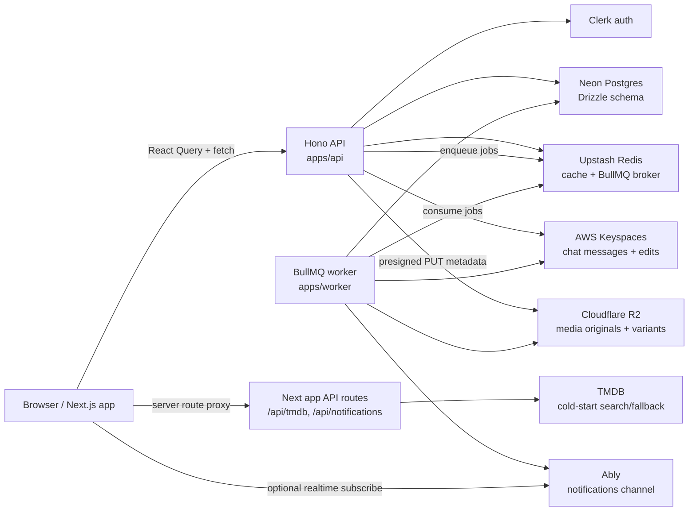
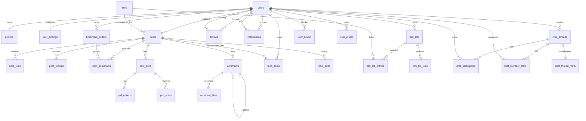

# 35mm Platform Codebase Knowledge

Generated from a direct repository inspection on 2026-06-23. Last refreshed for iOS chat core thread alignment on 2026-06-30.

This is a working knowledge base for onboarding engineers and future AI sessions. It reflects the code currently present in the repo, not only the older architecture plan in `docs/architecture.md`.

## Executive Summary

35mm is a social film platform: a conversation-first film network with feed posts, film logging/reviews, comments, follows, notifications, profiles, lists/watchlists, discovery surfaces, and media uploads. The product direction is "Letterboxd x Twitter" with a target scale of 35M+ users.

The repository is a pnpm/Turborepo monorepo:

- `apps/web`: Next.js 15 App Router frontend.
- `apps/api`: Hono REST API.
- `apps/worker`: long-running BullMQ worker.
- `apps/ios`: SwiftUI iOS app.
- `packages/db`: Drizzle schema and Neon client.
- `packages/types`: shared TypeScript contracts.
- `packages/validators`: shared Zod validators.
- `packages/ui`: small shared UI primitive package.
- `packages/config`: shared TypeScript config.

Current implementation is beyond parts of the older architecture plan. The code now has canonical `films`, `post_bookmarks`, follows, comments, notifications, feed items, post edits, user blocks/mutes, film lists, watchlists, polls, and chat thread metadata in the Drizzle schema. Chat message persistence uses AWS Keyspaces. Short films, festivals, communities, Meilisearch, Cloudflare Stream, and notification digest email remain partial, planned, or mock-heavy.

## High-Level Architecture

See `assets/architecture.mmd` for the Mermaid source.



Runtime flow:

- The browser uses Clerk for session state, React Query for server state, and Zustand for local UI state.
- The web app calls `NEXT_PUBLIC_API_URL` through feature API clients under `apps/web/features/*/api`.
- Hono verifies Clerk bearer tokens with `requireAuth`, bootstraps missing local users/profiles/settings/watchlists, and attaches `c.var.user`.
- Drizzle talks to Neon through `@neondatabase/serverless` HTTP.
- Upstash Redis is used for feed cache, rate limits, BullMQ broker URLs, suggestion cache, chat unread counters, chat typing TTLs, and chat presence TTLs.
- AWS Keyspaces stores chat message rows and message edit history in `thirtyFiveMM.messages` and `thirtyFiveMM.message_edits`.
- R2 presigned upload endpoints return deterministic future variant URLs; the worker later creates WebP variants and blurhash for post media, plus avatar/cover variants for profile media.
- Notification creation writes DB rows and enqueues `notification.publish`; the worker publishes Ably `notification.new` events when `ABLY_API_KEY` exists.
- Chat send/read-state/typing/edit/reaction routes publish latency-sensitive Ably events directly from the API after durable state is written, with BullMQ worker jobs retained as fallback/asynchronous paths for publish failures, large inbox fanout, and delete/update recovery.

## Repository Map

### Root

- `package.json`: root scripts. `pnpm dev` runs web + API only to avoid idle BullMQ polling against shared Upstash Redis; `pnpm dev:all` adds the worker. Node engine is `>=22.0.0`.
- `pnpm-workspace.yaml`: workspace boundary.
- `AGENTS.md`: project-critical rules. Film IDs must be 35mm ULIDs, not TMDB IDs.
- `README.md`: setup and runtime overview.
- `docs/architecture.md`: valuable design reference, but parts are stale against current schema.

### `apps/web`

Primary user-facing Next.js app.

Important files:

- `app/layout.tsx`: global metadata, Clerk provider, Query provider, fonts, analytics, service worker, offline status.
- `app/providers.tsx`: React Query client and persisted query cache, theme/accent providers, notification realtime provider, chat auth/current-user wiring, notification title/sound side effects, toast host.
- `middleware.ts`: Clerk route protection. `/landing` is signed-out entry; `/` redirects signed-out users to `/landing`.
- `app/(shell)/layout.tsx`: authenticated app shell with scroll restore, auth bootstrap, onboarding gate, and `ShellGrid`.
- `app/(shell)/page.tsx`: home feed, renders `PostComposer` and `InfinitePostList`.
- `app/api/tmdb/[...path]/route.ts`: TMDB proxy using server-side `TMDB_API_KEY`; used for cold-start/discover/autocomplete surfaces.
- `app/api/notifications/route.ts`: legacy/mock notifications endpoint.

Feature folders:

- `features/feed`: core post composer, feed list, post cards, comments, post mutations, poll UI, rich text, media handling.
- `features/profile`: public profile, follow state, edit profile, avatar/cover upload, connections, blocks/mutes.
- `features/notifications`: notification list/dropdown, mark-read flows, realtime provider. Freshness comes from realtime plus a 30-second no-Ably fallback invalidator; badge/title/sound components do not each self-poll every 5 seconds.
- `features/lists`: film lists, watchlists, list detail/editor, list entry notes.
- `features/onboarding`: role/favorite films/genres/follow suggestions flow.
- `features/discover`: TMDB-backed discovery and search views.
- `features/settings`: account/privacy/notification/appearance/data-security settings with URL-backed section routes.
- `features/bookmarks`: two-column bookmark page, folder management, and post-to-folder flow backed by feed bookmark endpoints.
- `features/chat`: rich chat frontend with App Router chat pages, remote client backed by `/v1/chat`, optional mock mode for demos/tests, realtime cache application, and bounded persisted cache for inbox/recent messages.
- `features/short-films`, `features/festivals`, `features/communities`, `features/videos`: mostly product surfaces using mock/static data or future-oriented code.
- `features/title`: title detail pages, largely TMDB/discover oriented.
- `features/letterboxd-import`: local import parsing/storage UI.

### `apps/ios`

Native SwiftUI app target `ThirtyFiveMM` (`com.35mm.app`) with ClerkKit auth, the shared REST `APIClient`, Kingfisher image loading, and optional Ably realtime.

Important files:

- `ThirtyFiveMM.xcodeproj`: app target plus `ThirtyFiveMMTests` XCTest target.
- `ThirtyFiveMM/App/AppConstants.swift`: API base URL, Clerk publishable key, and optional Ably API key loaded from `ThirtyFiveMM.xcconfig` / Info.plist.
- `ThirtyFiveMM/Core/Auth/AuthManager.swift` and `ThirtyFiveMM/App/RootView.swift`: Clerk session restoration, API bootstrap/onboarding gate, and retry/sign-out recovery when Clerk is signed in but app bootstrap is unavailable.
- `ThirtyFiveMM/Core/Networking/APIClient.swift`: async/await REST client with Clerk bearer auth, standard `{code,message}` errors, and typed `KEYSPACES_UNAVAILABLE` mapping.
- `ThirtyFiveMM/Core/Models/Chat.swift`: native Codable mirror of shared chat contracts. Message IDs are opaque TIMEUUID strings.
- `ThirtyFiveMM/Features/Chat/ChatAPIClient.swift`: every `/v1/chat` endpoint, including `before` cursor message paging, reactions, read state, archive/mute/delete, typing, and presence.
- `ThirtyFiveMM/Features/Chat/ChatRealtimeClient.swift`: optional Ably transport for `user:{userId}:inbox` and `thread:{threadId}` lifecycle subscriptions, with noop fallback when Ably config is missing.
- `ThirtyFiveMM/Features/Chat/ChatBlurhash.swift`: native blurhash placeholder decoding for chat media thumbnails before Kingfisher fade-in.
- `ThirtyFiveMM/Features/Chat/ChatComposerModels.swift`: local composer, staged attachment, and optimistic delivery-state models for native chat writes.
- `ThirtyFiveMM/Features/Chat/ChatMediaUploadClient.swift`: native wrapper for the existing media presign flow, `POST /v1/media/presign` plus direct R2 PUT, used by chat image/file attachments.
- `ThirtyFiveMM/Features/Chat/ChatInboxViewModel.swift`: native inbox state coordinator for cursor paging, refresh/reconnect reconciliation, in-place `thread.updated` realtime row updates, visible-row presence batching, visible-thread typing TTLs, swipe mutations, profile search, and DM thread creation.
- `ThirtyFiveMM/Features/Chat/ChatInboxView.swift`: SwiftUI Messages tab inbox with DM/group rows, skeleton/error/empty states, archived/default views, native swipe actions, unread badges, presence dots, typing previews, and minimal DM compose flow.
- `ThirtyFiveMM/Features/Chat/ChatThreadViewModel.swift`: native thread coordinator for newest-at-bottom display, `before` pagination, Ably message/reaction/read/typing updates, read receipt summaries, reaction toggles, optimistic send/retry, edit/delete, throttled typing, foreground-only read dispatch, reconnect reconciliation, reply highlighting, and non-disruptive new-message state while scrolled up.
- `ThirtyFiveMM/Features/Chat/ChatThreadView.swift`: SwiftUI thread screen with grouped bubbles, date separators, deleted/edited/reply rendering, image/GIF/file/link content, reaction pills/picker, read receipts, typing bubbles, skeleton/error/empty states, full-screen chat image viewer, growing composer, photo/file pickers, staged attachment previews, reply/edit bars, and sender-only message actions.
- `ThirtyFiveMMTests/ChatDecodingTests.swift`: fixture decoding coverage for text/image/reply/reaction/deleted messages plus DM/group inbox pages.

### `apps/api`

Hono REST API.

Important files:

- `src/index.ts`: bootstraps env, DB, CORS, error handling, and route mounts.
- `src/lib/middleware.ts`: Clerk auth, local user bootstrap, watchlist bootstrap, `requireAuth`.
- `src/lib/db.ts`: singleton Drizzle DB access.
- `src/lib/cursor.ts`: base64 JSON `(createdAt,id)` cursor encoding.
- `src/lib/ulid.ts`: local ULID generator and validator.
- `src/lib/feedCache.ts`: Upstash-backed feed page cache and index-based invalidation.
- `src/lib/rateLimit.ts`: Redis fixed-window rate limiting; allowed requests avoid per-request `TTL` reads and only fetch TTL for blocked responses.
- `src/lib/moderation.ts`: block/mute filters and feed item purge helpers.
- `src/lib/notifications.ts`: preference-aware, moderation-aware notification creation and bundling.
- `src/lib/filmLists.ts`: watchlist bootstrap and film ID resolution from existing ULID, TMDB metadata, or catalog metadata.
- `src/lib/jobs.ts`: BullMQ producer for media, notification, counter, feed, and chat jobs.
- `src/lib/keyspaces.ts`: Cassandra driver client for AWS Keyspaces using SigV4 IAM auth, warmed connection pools, prepared statements by default, and `chat-read`/`chat-write` execution profiles.
- `src/modules/chat/routes.ts`: authenticated chat inbox, thread creation, message read/write/edit/delete, reactions, read receipts, archive/mute/delete, typing, and presence routes.
- `src/modules/chat/chatRedis.ts`: unread counters, sorted-set typing indicators, and presence over Upstash Redis REST. Inbox unread and presence batch endpoints use Redis `MGET`.
- `src/modules/chat/chatUtils.ts`: chat message bucket and preview helpers.

Mounted routes:

- `/health`
- `/poster-proxy`
- `/v1/webhooks/clerk`
- `/v1/usernames/:username/available`
- `/v1/me`
- `/v1/me/onboarding-status`
- `/v1/onboarding/films/resolve`
- `/v1/me/onboarding`
- `/v1/onboarding/suggestions`
- `/v1/profiles/*`
- `/v1/follows/*`
- `/v1/suggestions/users`
- `/v1/me/notifications*`
- `/v1/lists*`
- `/v1/me/settings*`
- `/v1/media*`
- `/v1/users/*`
- `/v1/feed*`
- `/v1/chat*`

### `apps/worker`

Long-running BullMQ consumer.

Important files:

- `src/index.ts`: exits early when `WORKER_ENABLED=false`; otherwise resolves Redis URL, creates BullMQ `Worker` and `QueueEvents`, and dispatches jobs by name.
- `src/jobs/mediaProcess.ts`: pulls originals from R2; generates post thumb/feed/full WebP variants and blurhash; generates avatar sm/lg and cover default variants; optionally uploads post media to Cloudflare Images; updates `posts.media` / `posts.media_urls` or profile variant JSONB fields.
- `src/jobs/notificationPublish.ts`: reads notification details and publishes Ably `notification.new` to `user:{recipientId}:notifications`.
- `src/workers/suggestionWorker.ts`: computes friend-of-friend suggestions and writes `follow_suggestions` plus Redis cache.
- `src/jobs/feedFanout.ts`: materializes accepted-follower `feed_items` below the high-follower threshold and skips high-follower authors for live read merge.
- `src/jobs/feedRescore.ts`: recomputes recent materialized feed scores from denormalized post counters.
- `src/jobs/notificationDigest.ts`: currently logs readiness only.
- `src/jobs/chatDeliver.ts`: fetches Keyspaces message rows and publishes new-message + inbox update events.
- `src/jobs/chatMessageUpdated.ts`: publishes edit/delete/reaction updates from Keyspaces message rows.
- `src/jobs/chatReadReceipt.ts`: publishes thread read receipts.
- `src/jobs/chatTyping.ts`: publishes typing state.
- `src/lib/keyspaces.ts`: worker-side AWS Keyspaces client using SigV4 IAM auth, warmed connection pools, prepared statements by default, and `chat-read`/`chat-write` execution profiles.
- `src/scripts/backfillMedia.ts`: idempotent post media backfill runner.
- `src/scripts/backfillProfileMedia.ts`: idempotent avatar/cover variant backfill runner exposed as `pnpm --filter @35mm/worker backfill:avatars`.

## Data Model

See `assets/data-model.mmd` for the Mermaid source.



Current Drizzle schema highlights:

- `users`: UUID primary key, Clerk ID, email, age verification, account status.
- `profiles`: username, display name, bio/media, nullable `avatar_variants` / `cover_variants` JSONB, privacy, onboarding fields, favorite film/genre IDs, role/headline, films logged count.
- `films`: text primary key intended to be a 35mm ULID, optional unique `tmdb_id` and `imdb_id`, source enum `35mm | tmdb_import | user_contributed`.
- `posts`: UUID primary key, author, type, headline/body, `film_id` FK to `films`, `film_rating`, visibility, reply/repost flags, denormalized counters, soft delete, edit timestamp, JSONB media, media URL array, link preview.
- `bookmark_folders`: per-user bookmark folders.
- `post_bookmarks`: current bookmark table. The older `post_saves` rename appears completed in code; `folder_id` optionally points at `bookmark_folders` and falls back to unsorted on folder delete.
- `post_polls`, `poll_options`, `poll_votes`: ranking/image polls, results visibility, end time, votes.
- `follows`: composite PK `(follower_id, following_id)`, status `pending | accepted`.
- `comments`: post/user/parent, body, like count, soft delete, edit timestamp. App code enforces nesting rules.
- `notifications`: recipient, actor, actor ID bundle array, type, entity, read state, bundle count. Notification types include `follow_request_approved` for accepted private-account requests.
- `feed_items`: materialized feed rows for fanout/backfill.
- `post_edits`: post body/headline edit history.
- `user_blocks`, `user_mutes`: moderation relationship tables.
- `film_lists`, `film_list_entries`, `film_list_likes`: custom lists and one private watchlist per user.
- `follow_suggestions`: suggestion table populated by worker.
- `user_settings`: privacy, notification, theme/accent/autoplay settings.
- `chat_threads`, `chat_participants`, `chat_member_state`, `chat_thread_meta`: Postgres chat metadata, membership, per-user read/archive/mute/delete state, and last-message summaries.
- AWS Keyspaces `thirtyFiveMM.messages`: message body/media/reply/reaction rows, partitioned by `(thread_id, bucket)` and clustered by descending `message_id` TIMEUUID.
- AWS Keyspaces `thirtyFiveMM.message_edits`: edit history partitioned by `(thread_id, message_id)` and clustered by descending `edit_id` TIMEUUID.
- AWS Keyspaces `thirtyFiveMM.message_reactions`: sharded reaction fact table partitioned by `(thread_id, bucket, message_id, emoji, shard)` to avoid hot collection updates on viral messages.

Important data invariants:

- Film identity must be the 35mm ULID in app/API payloads. TMDB is metadata/fallback only.
- `packages/validators` enforces ULID shape for post film IDs, list film IDs, and favorite film IDs in many write paths.
- The database itself uses `text` for film/list IDs, so app-layer validation is currently the real guard.
- Pagination is cursor-based using base64 encoded `(createdAt,id)` or route-specific cursor objects.
- Denormalized counters exist on posts, comments, lists, and polls. Hot API action paths enqueue `counter.increment` after writing fact rows; the worker batches short-window deltas before updating counter columns.

## Shared Contracts and Validation

### `packages/types`

Key exports:

- Scalar aliases: `UserId`, `PostId`, `ConversationId`, `MessageId`.
- Public profile/user contracts.
- `FeedPost`, `FeedPage`.
- Film list/watchlist contracts.
- Notification contracts.
- Chat inbox/thread/member/message/reaction contracts.
- Health response.

Current `FeedPost` already uses `bookmarkCount` and `isBookmarked`; the old `saveCount/isSaved` naming has been removed from shared types.

### `packages/validators`

Key schemas/utilities:

- `cursorPaginationSchema`: max `limit` 100.
- Rich text schema and helpers: `parseRichTextBody`, `richTextBodyToVisibleText`, `richTextMentionIds`, `validateRichTextBody`.
- `createPostSchema`: validates body, film ULID, media, poll rules, and poll option constraints.
- Notification schemas.
- Username and profile update schemas.
- Settings update schemas.
- Onboarding schemas.
- Film list/watchlist schemas.
- Chat thread, inbox cursor, message cursor, send/edit message, reaction, and typing schemas.

Rich text bodies use a sentinel prefix `__35MM_RICH_TEXT_V1__` followed by TipTap-like JSON. Mentions carry user IDs and are used to create mention notifications.

## Frontend Runtime Patterns

State split:

- React Query owns server data: feed pages, post detail, comments, profiles, notifications, settings, lists, onboarding, discovery, suggestions.
- Zustand owns UI-only state: composer modal state and mobile bottom chrome visibility.
- Local component state owns transient UI interactions: dialogs, active tabs, menus, draft input, reply targets.

Query key conventions:

- Feed keys live in `features/feed/hooks/queryKeys.ts`.
- Profiles, notifications, lists, settings, onboarding, suggestions, bookmarks, and chat also have local key factories.
- Mutations invalidate feature-level key roots or set targeted query data for optimistic updates.

Shell and navigation:

- Root layout wraps everything with Clerk, React Query, theme/accent providers, service worker registration, offline status, analytics, speed insights.
- Middleware protects all non-public routes.
- Shell layout adds auth bootstrap, onboarding gate, scroll restoration, skip link, and the shared `ShellGrid`.
- Home route renders composer and infinite feed.

Design system:

- Default light tokens in `globals.css`; optional themes include dark, matrix, and other cinematic themes.
- Tailwind aliases map to CSS variables: `bg`, `fg`, `accent`, `border`, `elevated`, `sunken`, social/action/domain tokens.
- Fonts: Playfair variable, DM Serif Display, DM Sans, DM Mono.
- `--shell-main-max-width` defaults to `640px`, matching feed max-width convention.

## Major Features

### Auth and User Bootstrap

Business purpose: create a consistent local user/profile/settings identity for Clerk-authenticated users.

How it works:

- Web uses Clerk middleware and `ClerkProvider`.
- API protected routes call `requireAuth`.
- `requireAuth` verifies `Authorization: Bearer <token>` using Clerk.
- If the Clerk user is missing locally, API creates `users`, `profiles`, and `user_settings`.
- `tryEnsureWatchlistForUser` creates a private watchlist where schema exists.
- Suspended/deactivated users are rejected.

Interaction points:

- `apps/web/features/auth/components/AuthBootstrap.tsx`
- `apps/api/src/lib/middleware.ts`
- `apps/api/src/modules/auth/routes.ts`
- `apps/api/src/modules/webhooks/routes.ts`

### Feed and Posts

Business purpose: primary social timeline for film discussion, logs, reviews, media posts, polls, and interactions.

Frontend:

- `PostComposer` creates posts with text/discussion/log modes, rich text, film selection, media, YouTube/link preview, polls, and editing support.
- `InfinitePostList` uses `useFeed`, React Query infinite pagination, prefetching, virtualization after larger list sizes, and memoized `PostCard`.
- `PostCard` is `React.memo` with a custom prop comparator.
- `CommentSection` loads and mutates comments under each post/detail.

API:

- `GET /v1/feed`: home feed, optional auth, Redis cache, rate limit.
- `POST /v1/feed`: create post, auth, rate limit, media process job, mention notifications.
- `GET /v1/feed/posts/:postId`: detail.
- `GET /v1/feed/profiles/:username/posts`: profile feed.
- `GET /v1/feed/bookmarks`: viewer bookmarks, optionally filtered by folder.
- `GET/POST/PATCH/DELETE /v1/feed/bookmarks/folders`: folder list/create/rename/delete.
- `PATCH/DELETE /v1/feed/posts/:postId`: edit/soft-delete.
- Likes/reposts/bookmarks endpoints, including `PATCH /v1/feed/posts/:postId/bookmarks` for moving an existing bookmark between folders.
- Poll voting endpoint.
- Comment CRUD and comment like endpoints.

How it works:

- Home/profile feed queries use cursor pagination and moderation filters.
- Feed cache keys include viewer/cursor/limit; profile feed keys include username and viewer.
- Writes invalidate viewer/profile/guest feed cache indexes.
- Auth home feed reads materialized `feed_items` and merges live recent posts from followed high-follower accounts, ordered by score + post ID.
- Feed score formula is `1000 * exp(-ageHours / 36) + 120 * ln(1 + likes + comments*3 + reposts*4)`, using denormalized post counters only.
- Auth home feed cursors encode score, post ID, and ranking timestamp. Guest/profile/bookmark/comment feeds keep chronological cursors.
- High-follower live-merge auth feeds bypass Redis payload cache; materialized-only auth feeds still use targeted cache invalidation.
- Posts reference canonical `films.id` through `film_id`.
- Repost feed rows are filtered at query time against the original author's privacy. Viewers must follow the original private author to see another user's repost of that private author's post.
- API hydrates film, poll, viewer action flags, media variant URLs, author fields, and moderation state into feed payloads.
- Like/repost/comment/bookmark actions create notifications where appropriate.

Known gaps:

- Post like/comment/repost/bookmark counters, comment likes, poll vote counters, and film list like/entry counters are async via `counter.increment`.
- `feed.fanout` worker materializes new posts into accepted followers' `feed_items` below `FEED_HIGH_FOLLOWER_THRESHOLD` (default `10000`) in cursor-paginated batches (`FEED_FANOUT_BATCH_SIZE`, default `500`).
- High-follower authors skip write fanout; home feed pulls their recent posts live and interleaves by score + post ID.
- Follow creation backfills recent posts into `feed_items` for normal public accounts, but skips high-follower accounts because live merge handles them.
- `feed_items.score` is populated on feed row writes/backfills/fanout and refreshed later by `feed.rescore`.

### Comments

Business purpose: threaded discussion around posts.

How it works:

- Comments table supports parent IDs and soft delete.
- API returns flat paginated rows; web builds a nested tree with `buildCommentTree`.
- Comment body uses rich text validation.
- Replies are limited in app logic, not by DB constraint.
- Comment likes write `comment_likes`, enqueue async comment counter deltas, and can create notifications.
- Deleted comments return `body: null` style UI and preserve thread context.

### Films, Film Refs, Lists, and Watchlist

Business purpose: keep 35mm film identity canonical while allowing cold-start TMDB imports and user/catalog contributions.

How it works:

- `films.id` is a text ULID generated by `createUlid`.
- TMDB imports are deduped by `tmdb_id`.
- Catalog films are deduped by source/title/year.
- Onboarding can resolve up to five TMDB films into 35mm film IDs.
- List/watchlist write APIs can accept an existing `filmId`, TMDB film payload, or catalog film payload, then resolve to a canonical film ID.
- Each user gets one private watchlist list, keyed by a unique partial index on `(user_id)` where `type='watchlist' and is_deleted=false`.

API:

- `/v1/lists/profile/:username`
- `/v1/lists/films/:filmId`
- `/v1/lists/me/watchlist`
- `/v1/lists/films/resolve`
- `/v1/lists/:listId`
- list create/update/delete
- entry create/update/reorder/delete
- list like/unlike/clone
- watchlist film status/add/remove

Known gaps:

- There is no general `/v1/films/search` route yet.
- Discover/title surfaces still use TMDB proxy and local mock/static data in places.
- DB does not enforce ULID format for `films.id`.

### Profiles, Follows, Blocks, and Mutes

Business purpose: user identity, social graph, privacy, and moderation.

Profiles:

- Public profile route includes display fields, media URLs, role/headline, private status, counts, unified `followState`, incoming request state, and block/mute state.
- Profile media URLs are resolved through R2/public URL helpers.
- Profile edit APIs exist in both `/v1/profiles/me` and settings profile endpoints. Switching a profile from private to public bulk-approves pending requests and creates approval notifications in a single SQL statement because the Neon HTTP driver does not support interactive transactions.

Follows:

- `POST /v1/follows/:userId` creates `accepted` or `pending` follow depending on target privacy.
- Public accounts trigger recent-post backfill into `feed_items`.
- Follow/unfollow invalidates feed/profile caches and refreshes suggestions.
- Accept/decline endpoints handle private account requests; accept writes `follow_request_approved` for the requester, while decline hard-deletes the pending row without notifying.
- `GET /v1/follows/requests/received` returns the authenticated user's pending incoming requests with total count and mutual follower counts for the dedicated requests tray.
- Follow notifications are created on new follow/request.

Blocks/mutes:

- Blocking inserts `user_blocks`, deletes both follow directions, inserts a mute, purges feed items between users, and invalidates caches.
- Mutes filter feed/profile surfaces without removing follows.
- Settings privacy panel can list/unblock/unmute via `/v1/me/blocks` and `/v1/me/mutes`.

### Notifications

Business purpose: alert users to social actions while avoiding noisy duplicate events.

How it works:

- API creates notifications through `createNotification`.
- Preferences and moderation checks decide whether to skip.
- Bundlable unread notifications for the same recipient/type/entity are merged with `bundle_count` and up to three recent `actor_ids`.
- Publish jobs are delayed/enqueued through BullMQ; removing likes/reposts can remove pending publish jobs.
- Worker reads notification and actor profiles, then publishes an Ably event to `user:{recipientId}:notifications`.

API:

- `GET /v1/me/notifications`
- `PATCH /v1/me/notifications/:notificationId/read`
- `PATCH /v1/me/notifications/:notificationId/unread`
- `POST /v1/me/notifications/read-all`
- `GET /v1/follows/requests/received` for the separate follow requests tray.

Frontend:

- Notification dropdown/content fetches paginated notifications.
- `FollowRequestsTray` renders incoming private-account requests above the activity feed and contributes its total to the notification badge.
- Realtime provider is dynamically imported and can use Ably or noop transport.
- Title badge and sound player are installed globally.

Known gaps:

- Ably requires env configuration.
- Daily digest worker is a stub.
- A legacy Next mock notification route still exists at `/api/notifications`.

### Media Upload and Processing

Business purpose: fast media uploads with stable read URLs and later optimized variants.

How it works:

- API `POST /v1/media/presign` validates kind/content type/size and returns a presigned R2 PUT URL.
- Supported kinds: `avatar`, `cover`, `post_media`.
- Size limits: 12 MB image, 120 MB video.
- Returned response includes `publicUrl`, `objectKey`, content type, TTL, and deterministic variant URLs:
  - Post media: `thumb`, `feed`, `full`.
  - Avatar media: `sm`, `lg`.
  - Cover media: `default`.
- API `GET /v1/media/resolve-url` resolves public media URLs.
- API `GET /v1/media/oembed` returns link preview/oEmbed data.
- Worker `media.process` fetches originals, creates WebP variants, writes immutable R2 objects, and updates the owning DB row:
  - Post media: 320/640/2048 width variants, blurhash, `posts.media`, and `posts.media_urls`.
  - Avatar media: 64x64 `sm` and 320x320 `lg`, stored in `profiles.avatar_variants`.
  - Cover media: 1200x400 `default`, stored in `profiles.cover_variants`.
- Profile media URL resolvers prefer variants when present. API responses expose `avatarUrl` for small surfaces and `avatarUrlLg` for profile-header surfaces, falling back to the original stable R2 public URL when variants are missing.
- Existing profile media variants can be generated with `pnpm --filter @35mm/worker backfill:avatars`.
- R2 public profile media requires bucket CORS allowing `GET`/`HEAD` from the app origin.

Known gaps:

- Cloudflare Stream is not wired.
- Cloudflare Images is optional.
- AVIF generation is deferred.

### Onboarding and Suggestions

Business purpose: personalize profiles and seed the social graph quickly.

Flow:

1. Role picker.
2. Favorite films.
3. Favorite genres.
4. Follow suggestions.
5. Completion state.

API:

- Onboarding status.
- Resolve TMDB film payloads into canonical `films` rows.
- Submit role/headline/favorite film IDs/genre IDs/follow IDs.
- Suggestions endpoint and worker-backed friend-of-friend suggestions.

Worker:

- `compute-suggestions` reads accepted follows, computes follows-of-follows candidates, stores rows in `follow_suggestions`, and caches IDs in Redis.

### Settings

Business purpose: account preferences, privacy, notifications, appearance.

How it works:

- `GET /v1/me/settings` returns profile/privacy/notification/appearance grouped settings.
- Privacy update writes both `profiles.is_private` and `user_settings`.
- Notifications update booleans used by notification creation.
- Appearance supports theme, accent color, and video autoplay.
- API contains fallback logic for legacy DBs missing theme/autoplay/accent columns.

Frontend:

- Settings hooks use React Query with optimistic cache patching.
- Settings UI includes account, privacy, notification, appearance, and data/security panels. `/settings` redirects to `/settings/account`; tabs link to `/settings/account`, `/settings/privacy`, `/settings/notifications`, `/settings/appearance`, and `/settings/data-security`.
- Account settings change-password flow is client-side UI that calls Clerk `user.updatePassword({ currentPassword, newPassword })`; no 35mm API route or DB write is involved.

### Discovery, Title Pages, Short Films, Festivals, Communities

Business purpose: browsing and discovery beyond the social feed.

Current state:

- Discover uses TMDB-backed hooks through the Next `/api/tmdb` proxy and local/static data for some shelves.
- Title pages live at `/title/[media]/[id]` and are still largely TMDB-oriented.
- Short films include catalog JSON, watch/upload UI, and upload form, but are out of V1 per architecture.
- Festivals and communities have rich UI/data mock surfaces but no complete backend wiring.
- Search bar has mock search API and component tests; Meilisearch is not wired.

### Chat

Business purpose: authenticated direct/group messaging.

Detailed backend reference: `docs/chat-backend.md`

Current state:

- The frontend chat feature is substantial: conversation list, conversation UI, composer, replies, reactions, GIFs, archive/delete flows, realtime cache event handling, mock store, and remote client abstraction.
- The web route tree contains `/chat` and `/chat/[chatId]`. Chat URLs render lowercase thread IDs, while route params are normalized back to canonical uppercase IDs before API/cache use.
- The remote chat client is aligned to the current backend routes and is the default; mock mode requires `NEXT_PUBLIC_CHAT_API_MODE=mock`.
- Chat uses React Query for server state. Conversation lists and the latest bounded message page are persisted in `localStorage` for faster reload/offline read access. Infinite/older-history message pages are not persisted, and persisted query cache is cleared on sign-out or user switch.
- Chat UI maps backend profile avatar URLs into chat list/header/message avatars, renders skeleton headers while thread metadata resolves, supports own-message edits through the chat edit route, and opens image/GIF message media with the shared `ImageViewer`.
- The desktop site header Messages nav item shows an unread badge based on inbox/request preview unread counts and refreshes through chat realtime conversation invalidation.
- Active chat threads render live typing bubbles from `typing.update` and seen indicators from `message.read`; composer input posts typing state through the chat typing route with frontend throttling/idle cleanup. Read receipt snapshots use stale React Query reads without an interval; typing snapshot fallback is development-only when realtime is not configured.
- The API is authenticated and exposes:
  - `GET /v1/chat/inbox`
  - `POST /v1/chat/threads`
  - `GET /v1/chat/threads/:threadId/messages`
  - `POST /v1/chat/threads/:threadId/messages`
  - `PATCH /v1/chat/messages/:messageId?threadId=:threadId`
  - `DELETE /v1/chat/messages/:messageId?threadId=:threadId`
  - `POST /v1/chat/messages/:messageId/reactions?threadId=:threadId`
  - `DELETE /v1/chat/messages/:messageId/reactions/:emoji?threadId=:threadId`
  - `PATCH /v1/chat/threads/:threadId/read`
  - `GET /v1/chat/threads/:threadId/read-receipts`
  - `PATCH /v1/chat/threads/:threadId/archive`
  - `PATCH /v1/chat/threads/:threadId/mute`
  - `DELETE /v1/chat/threads/:threadId`
  - `POST /v1/chat/threads/:threadId/typing`
  - `GET /v1/chat/threads/:threadId/typing`
  - `POST /v1/chat/presence/ping`
  - `POST /v1/chat/presence/batch`
- Persistence is wired with Postgres metadata tables plus AWS Keyspaces message/edit tables.
- Redis stores unread counts, typing state, and presence state. Chat unread/presence reads batch via `MGET`; typing membership uses a short-lived sorted set instead of scanning `chat:typing:*` keys.
- API routes publish low-latency chat delivery/read/typing/edit/reaction events through Ably directly after persistence. Worker jobs still publish chat delivery/update/read/typing events as fallback/asynchronous paths, especially for large inbox fanout and delete/update recovery.
- The web chat realtime provider subscribes through `NEXT_PUBLIC_ABLY_API_KEY` to `thread:{threadId}` and `user:{userId}:inbox`, patching current messages and inbox unread rows while still invalidating conversation lists.
- The iOS Messages tab now has a native inbox and core thread experience backed by the same chat contract: cursor-paged inbox reads, realtime `thread.updated` row patching, visible-thread typing subscriptions, batched visible-row presence, archived/default lists, native swipe actions, minimal profile-search DM creation, reverse-display message history with `before` pagination, realtime message/reaction/read/typing patching, read receipts, reaction toggles, optimistic send/retry, image/file attachment uploads through `/v1/media/presign`, sender-only edit/delete, throttled typing dispatch, and foreground-only read dispatch. Native GIF sending, jump-to-unloaded replies, per-member group read receipts, and richer group creation remain staged separately.
- Remaining frontend gaps are now product-level: durable attachment upload policy, reporting/moderation flows, and richer group management UX.

## Backend API Surface

Route declarations inspected from `apps/api/src/modules` and `apps/api/src/routes`.

Public or optional-auth:

- `GET /health`
- `GET /poster-proxy`
- `GET /v1/usernames/:username/available`
- `GET /v1/profiles/:username`
- `GET /v1/feed`
- `GET /v1/feed/posts/:postId`
- `GET /v1/feed/profiles/:username/posts`
- `GET /v1/feed/posts/:postId/comments`
- `GET /v1/lists/profile/:username`
- `GET /v1/lists/films/:filmId`
- `GET /v1/lists/:listId`
- `GET /v1/media/resolve-url`
- `GET /v1/media/oembed`
- `POST /v1/webhooks/clerk`

Authenticated:

- `GET /v1/me`
- `GET /v1/profiles/search`
- `PATCH /v1/profiles/me`
- profile followers/following/follow request list endpoints.
- follow/unfollow/accept/decline.
- onboarding status, film resolution, submit, suggestions.
- suggestions users.
- notifications list/read/unread/read-all.
- lists create/update/delete, entries, reorder, like, clone, watchlist.
- settings get/update.
- media presign.
- user block/mute list and mutations.
- feed create/edit/delete/action/comment/poll endpoints.
- chat inbox/thread/message/read/archive/mute/delete/typing/presence endpoints.

Error contract:

```json
{ "code": "SNAKE_CASE_ERROR_CODE", "message": "Human-readable message" }
```

Paginated envelope:

```json
{ "items": [], "nextCursor": null, "hasMore": false }
```

## Background Jobs

Queue name:

- API producer: `35mm-jobs`
- Worker uses `WORKER_QUEUE_NAME` from `apps/worker/src/lib/queue.ts`.

Implemented or partially implemented:

- `media.process`: implemented for post media and profile avatar/cover variants.
- `notification.publish`: implemented when `ABLY_API_KEY` exists.
- `compute-suggestions`: implemented.
- `counter.increment`: implemented with 50ms default in-worker batching and BullMQ retries.
- `feed.fanout`: implemented for below-threshold authors with idempotent `feed_items(user_id, post_id)` writes, chunked follower pagination, score computation, and viewer cache invalidation.
- `feed.rescore`: implemented periodic pass for recent materialized feed rows; recomputes score from post denormalized counters and invalidates touched viewer caches.
- `chat.deliver`: implemented for new-message and inbox realtime publish.
- `chat.messageUpdated`: implemented for message edit/delete/reaction realtime publish.
- `chat.readReceipt`: implemented for read receipt realtime publish.
- `chat.typing`: implemented for typing realtime publish.
- `notification.digest`: stub.

Important operational detail:

- API can derive Redis protocol URL from Upstash REST URL/token, but BullMQ works best with `UPSTASH_REDIS_URL`.
- Worker reads env from `apps/api/.env` in dev by package script. Root `pnpm dev` does not start the worker; use `pnpm dev:worker` or `pnpm dev:all` only when queue jobs are needed.
- `WORKER_ENABLED=false` exits the worker before opening Redis connections, useful for quota-sensitive local Upstash sessions.
- Chat Keyspaces needs `AWS_ACCESS_KEY_ID`, `AWS_SECRET_ACCESS_KEY`, `AWS_REGION`, and `KEYSPACES_ENDPOINT`; AWS Keyspaces Cassandra driver traffic uses SigV4 auth on port 9142. Pool/timeout knobs: `KEYSPACES_CORE_CONNECTIONS`, `KEYSPACES_MAX_REQUESTS_PER_CONNECTION`, `KEYSPACES_CONNECT_TIMEOUT_MS`, `KEYSPACES_DEFAULT_TIMEOUT_MS`, `KEYSPACES_READ_TIMEOUT_MS`, `KEYSPACES_WRITE_TIMEOUT_MS`, `KEYSPACES_HEARTBEAT_MS`.
- iOS local config lives in `apps/ios/ThirtyFiveMM.xcconfig`: `API_BASE_URL`, `CLERK_PUBLISHABLE_KEY`, and optional `ABLY_API_KEY`.
- Feed fanout config: `FEED_HIGH_FOLLOWER_THRESHOLD` default `10000`; `FEED_FANOUT_BATCH_SIZE` default `500`, worker cap `2000`.
- Feed rescore config: `FEED_RESCORE_MAX_AGE_HOURS` default `72`; `FEED_RESCORE_BATCH_SIZE` default `500`, worker cap `2000`. Run periodically, for example every few minutes, instead of recomputing scores on every read.
- Counter reconciliation safety net: `pnpm --filter @35mm/worker reconcile:counters -- --scope=<posts|comments|post_polls|poll_options|film_lists|all> --id=<optional-id>`.
- `COUNTER_BATCH_WINDOW_MS` can tune worker counter coalescing; default is 50ms.

## Caching, Rate Limits, and Performance

Caching:

- Feed cache namespace: `feed-cache:v1`.
- Home feed key includes viewer, cursor, limit.
- Profile feed key includes username, viewer, cursor, limit.
- Index sets track cache keys by viewer and author for targeted invalidation.
- Cache auto-disables when Upstash REST env is missing.

Rate limits:

- Redis fixed-window limiter.
- Allowed requests avoid per-request `TTL`; `TTL` is fetched only for blocked responses that need `Retry-After`.
- Feed create: 20/min per user.
- Feed read: route-level rate limit exists in feed routes.
- Media presign: 20/min per user.
- Disabled when `NODE_ENV=test` or `RATE_LIMIT_DISABLED=true`.

Frontend performance:

- `PostCard` is memoized.
- Feed uses infinite queries and virtualization for larger lists.
- Heavy UI such as emoji picker, GIF picker, and film search are dynamically imported in relevant code.
- R2 image helpers choose connection-aware variants for post media and normalize profile media URLs.
- Service worker caches navigation/static/image assets and R2 media assets, not cross-origin API responses.

## Testing

Test files found:

- API:
  - media variants.
  - rich text validators.
  - feed rich mentions.
- mention notifications e2e.
- chat bucket/preview utilities.
- Web:
  - modal focus stack.
  - rich text renderer.
  - R2 media helpers.
  - post media utilities.
  - comment section.
  - search bar.
  - post composer.
  - settings notifications panel.
  - settings hooks.
  - settings schemas.

Root scripts:

- `pnpm build`
- `pnpm typecheck`
- `pnpm lint`

Per-app:

- `apps/web`: `pnpm test`
- `apps/api`: `pnpm test`, `pnpm typecheck`
- `apps/worker`: `pnpm typecheck`

## Current Reality vs Architecture Notes

Stale or superseded items in `docs/architecture.md` / older agent notes:

- `films` table exists.
- `post_saves` appears renamed to `post_bookmarks`.
- `FeedPost.saveCount/isSaved` appears renamed to `bookmarkCount/isBookmarked`.
- `posts.film` JSONB appears replaced by `film_id` plus `film_rating`; `PostFilm` type remains in schema source but the table uses `filmId`.
- Follows table exists.
- Comments table exists.
- Notifications table exists.
- Feed items table exists.
- Post visibility, denormalized post counters, soft delete, and edit history exist.
- Chat backend persistence, worker realtime jobs, and frontend remote route alignment are implemented.

Still true gaps:

- No general films API/search module.
- Meilisearch is not wired.
- Notification digest email is not implemented.
- Cloudflare Stream is not wired.
- Chat production rollout depends on keeping AWS Keyspaces and Postgres migrations applied in each environment.
- Communities/festivals/short films are not production backend features.
- DB-level ULID checks are missing for text IDs.

## Critical Engineering Rules

- Never use TMDB ID as primary film identity in app/API contracts.
- Keep `FilmRef.id` as a 35mm ULID.
- Use cursor pagination. Do not add OFFSET pagination.
- Prefer denormalized counters for reads. Avoid live `COUNT()` in hot feed/read paths.
- Keep user-generated content soft-deleted.
- Keep server state in React Query and UI-only state in Zustand/local state.
- Use query key factories, not ad hoc query key strings.
- Do not wire new film identity to TMDB URLs; title URLs should resolve through 35mm IDs.
- Keep Hono REST API contracts native-client friendly; this repo intentionally does not use tRPC.

## Onboarding Map for Future Agents

Read in this order for most changes:

1. `AGENTS.md`
2. `README.md`
3. `docs/architecture.md`, then compare against current schema.
4. `packages/db/src/schema/index.ts` and relevant schema file.
5. `packages/types/src/index.ts`
6. `packages/validators/src/index.ts`
7. Relevant API route under `apps/api/src/modules/*/routes.ts`.
8. Relevant web feature API/hook files.
9. Relevant web component files.
10. Worker job if the feature has async side effects.

Feature ownership quick map:

- Feed/post/comment/polls: `apps/api/src/modules/feed/routes.ts`, `apps/web/features/feed`.
- Profiles/follows/moderation: `profiles`, `follows`, `users` API modules, `apps/web/features/profile`.
- Lists/watchlist/films: `apps/api/src/modules/lists/routes.ts`, `apps/api/src/lib/filmLists.ts`, `apps/web/features/lists`.
- Notifications: `apps/api/src/lib/notifications.ts`, notifications route, worker publish job, web notifications feature.
- Media: API media module, worker media job, web profile/feed media helpers.
- Settings: API settings module, web settings feature.
- Onboarding: API onboarding module, web onboarding feature.
- Discovery/title: web discovery/title features and Next TMDB proxy.
- Chat: web chat feature plus API/worker persistence, remote backend alignment, and bounded persisted inbox/recent-message cache.

## State Block

Analysis completed:

- Repository topology mapped.
- Root/app/package manifests inspected.
- Architecture and README inspected.
- Current Drizzle schema inspected.
- Shared types and validators inspected.
- API entry point, middleware, core libs, route declarations, and key route bodies inspected.
- Worker entry point and job implementations inspected.
- Web root layout, providers, middleware, shell routes, feature APIs/hooks, state stores, styling, and Next API routes inspected.
- Test file inventory collected.

Generated artifacts:

- `codebase-analysis-docs/CODEBASE_KNOWLEDGE.md`
- `codebase-analysis-docs/assets/architecture.mmd`
- `codebase-analysis-docs/assets/data-model.mmd`

Recommended next analysis pass:

- Deep read the full `apps/api/src/modules/feed/routes.ts` implementation section by section before changing feed behavior.
- Run `pnpm typecheck` before trusting the current tree as build-clean.
- Validate migrations against schema because source schema and actual applied DB state may diverge in local/dev/prod environments.
