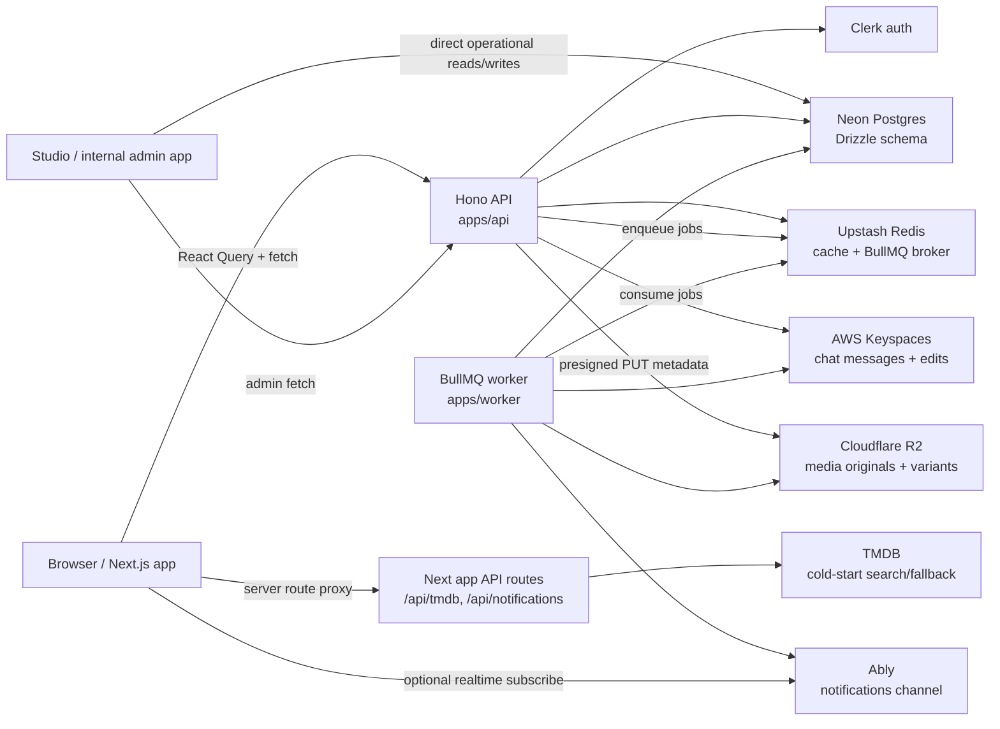

# 35mm Platform Codebase Knowledge

Generated from a direct repository inspection on 2026-06-23. Last refreshed for full content moderation backend on 2026-07-11, mobile shell navigation behavior on 2026-07-17, React Native email verification on 2026-07-24, NSFW classification plus web presentation on 2026-07-25, the signed-out web landing redesign on 2026-09-03, and React Native mixed posts/comments on 2026-09-06.

This is a working knowledge base for onboarding engineers and future AI sessions. It reflects the code currently present in the repo, not only the older architecture plan in `docs/architecture.md`.

## Executive Summary

35mm is a social film platform: a conversation-first film network with feed posts, film logging/reviews, comments, follows, notifications, profiles, lists/watchlists, discovery surfaces, and media uploads. The product direction is "Letterboxd x Twitter" with a target scale of 35M+ users.

The repository is a pnpm/Turborepo monorepo:

- `apps/web`: Next.js 15 App Router frontend.
- `apps/studio`: internal Next.js platform/content operations app.
- `apps/api`: Hono REST API.
- `apps/worker`: long-running BullMQ worker.
- `apps/ios`: SwiftUI iOS app.
- `apps/mobile`: Expo/React Native iOS and Android workspace; Phase 2 launch/auth/signup/password-Login and a user-prioritized Phase 4 production mixed-post feed/video-composer/comment-reader slice are implemented over the Phase 1 foundation. Canonical plan and continuation status live in `docs/react-native-mobile-development-plan.md`.
- `packages/api-client`: Platform-neutral mobile REST transport, standard errors, bounded retries/timeouts, and injected platform dependencies.
- `packages/db`: Drizzle schema and Neon client.
- `packages/design-tokens`: React-free mobile theme and foundation tokens with web/Swift parity fixtures.
- `packages/mobile-ui`: Shared React Native primitives, overlays, skeletons, and state surfaces.
- `packages/search`: dependency-free Meilisearch HTTP client, index contracts,
  document shapes, and deterministic index settings shared by API/worker.
- `packages/types`: shared TypeScript contracts.
- `packages/validators`: shared Zod validators.
- `packages/ui`: small shared UI primitive package.
- `packages/config`: shared TypeScript config.

Current implementation is beyond parts of the older architecture plan. The code now has canonical `films`, the new `catalog_` database core, catalog read APIs, catalog mutation APIs/helpers, Studio catalog-title API wiring, Meilisearch-backed site-header search for films/users/posts, `post_bookmarks`, follows, comments, notifications, feed items, post edits, user blocks/mutes, film lists, watchlists, polls, contribution submissions, and chat thread metadata in the Drizzle schema. Chat message persistence uses AWS Keyspaces. Contribution rewiring, normalized catalog people/company search, and notification digest email remain partial, planned, or mock-heavy.

React Native product direction is approved, including one shared visual system
for iOS and Android, preservation of `apps/ios`, Android API 24+ support, full
auth/password-recovery/onboarding flows, and screen-specific skeleton states.
Phase 1.8 now provides runtime/configuration, deterministic checks, isolated
development/preview build-profile infrastructure, and enforceable Expo CNG
policy plus shared design-token/theme fixtures, React Native UI primitives,
root provider composition, secure Clerk token wiring, bounded account-scoped
query persistence, UI-state ownership, lifecycle integration, error recovery,
and a platform-neutral API transport, plus accessibility, Maestro E2E,
fixed-profile screenshot-diff, and measured performance-evidence harnesses.
The authenticated mobile product surface now includes a real cursor feed, recycler-backed mixed post cards, native versioned-rich-text rendering, PostCard More actions, cursor-paged post comments, signed Bunny playback, account autoplay/sound policy, eager resumable direct uploads, processing states, visibility, optimistic interactions, share, and owner soft-delete. Remaining account and product flows remain planned. Future mobile sessions must read and maintain
`docs/react-native-mobile-development-plan.md`.

## High-Level Architecture

See `assets/architecture.mmd` for the Mermaid source.


```mermaid
flowchart LR
  Browser["Browser / Next.js app"]
  Studio["Studio / internal admin app"]
  NextApi["Next app API routes\n/api/tmdb, /api/notifications"]
  Hono["Hono API\napps/api"]
  Clerk["Clerk auth"]
  Neon["Neon Postgres\nDrizzle schema"]
  Redis["Upstash Redis\ncache + BullMQ broker"]
  Keyspaces["AWS Keyspaces\nchat messages + edits"]
  Worker["BullMQ worker\napps/worker"]
  R2["Cloudflare R2\nmedia originals + variants"]
  Ably["Ably\nnotifications channel"]
  TMDB["TMDB\ncold-start search/fallback"]

  Browser -->|React Query + fetch| Hono
  Studio -->|admin fetch| Hono
  Studio -->|direct operational reads/writes| Neon
  Browser -->|server route proxy| NextApi
  NextApi --> TMDB
  Hono --> Clerk
  Hono --> Neon
  Hono --> Redis
  Hono --> Keyspaces
  Hono -->|presigned PUT metadata| R2
  Hono -->|enqueue jobs| Redis
  Worker -->|consume jobs| Redis
  Worker --> Neon
  Worker --> Keyspaces
  Worker --> R2
  Worker --> Ably
  Browser -->|optional realtime subscribe| Ably
```

Runtime flow:

- The browser uses Clerk for session state, React Query for server state, and Zustand for local UI state.
- The web app calls `NEXT_PUBLIC_API_URL` through feature API clients under `apps/web/features/*/api`.
- Hono verifies Clerk bearer tokens with `requireAuth`, bootstraps missing local users/profiles/settings/watchlists, and attaches `c.var.user`.
- Drizzle talks to Neon through `@neondatabase/serverless` HTTP.
- Upstash Redis is used for feed cache, catalog public read cache, rate limits, BullMQ broker URLs, suggestion cache, chat unread counters, chat typing TTLs, and chat presence TTLs.
- AWS Keyspaces stores chat message rows and message edit history in `thirtyFiveMM.messages` and `thirtyFiveMM.message_edits`.
- R2 presigned upload endpoints return the original public URL plus deterministic future variant URLs. New post creation stores the original URL/object key until `media.process` creates variants; the worker later writes WebP variants and blurhash for post media, plus avatar/cover variants for profile media.
- Notification creation writes DB rows and enqueues `notification.publish`; the worker publishes Ably `notification.new` events when `ABLY_API_KEY` exists.
- Chat send/read-state/typing/edit/reaction routes publish latency-sensitive Ably events directly from the API after durable state is written, with BullMQ worker jobs retained as fallback/asynchronous paths for publish failures, large inbox fanout, and delete/update recovery.

## Repository Map

### Root

- `package.json`: root scripts. `pnpm dev` runs web + API only to avoid idle BullMQ polling against shared Upstash Redis; `pnpm dev:all` runs web + Studio + API + worker; `pnpm dev:studio` runs only Studio; mobile development/build launch uses `dev:mobile`, `mobile:ios`, and `mobile:android`, while package checks, `mobile:quality:check`, `mobile:e2e:foundation`, `mobile:visual:test`, `mobile:performance:verify`, and aggregate `mobile:check` provide deterministic and native-device verification. Node engine is `>=22.13.0`.
- `.npmrc` and root `pnpm.packageExtensions`: isolate React type packages across React 18 workspaces and the React 19 mobile workspace; existing React Email packages receive their missing React 18 type peers.
- `pnpm-workspace.yaml`: workspace boundary.
- `AGENTS.md`: project-critical rules. Film IDs must be 35mm ULIDs, not TMDB IDs.
- `README.md`: setup and runtime overview.
- `docs/architecture.md`: valuable design reference, but parts are stale against current schema.
- `docs/react-native-mobile-development-plan.md`: canonical React Native roadmap, progress ledger, decision/blocker log, and embedded continuation prompt; Phase 1.8 is complete, the corrected embedded-bundle iPhone build visibly renders with clean startup logs, and Phase 1.9 remains blocked only on a physical low/mid-range Android device.

### `apps/web`

Development runs `next dev`, using Next.js 15's webpack default to match production builds. `next.config.ts` transpiles shared types/validators and applies webpack extension aliases for their Node-compatible `.js`/`.mjs` source imports. Turbopack bypasses those aliases and cannot resolve imports such as `./dateOfBirth.js`; changing bundlers requires equivalent source resolution first.

Primary user-facing Next.js app.

Important files:

- `app/layout.tsx`: global metadata, Clerk provider, Query provider, fonts, analytics, service worker, offline status.
- `app/providers.tsx`: React Query client and persisted query cache, theme/accent providers, Suspense-backed dynamic notification/chat realtime providers, chat auth/current-user wiring, global new-chat provider, desktop floating chat inbox, notification title/sound side effects, toast host.
- `middleware.ts`: Clerk route protection. `/landing` redirects to `/`; guest-only auth pages (`/login`, `/signup`, `/forgot`, `/reset`, `/verify`) redirect authenticated sessions in middleware before page render.
- `app/page.tsx`: session-aware root. Signed-out visitors render `features/landing` as a restrained, single-field
  cinematic surface with original bundled artwork, centered product copy, one primary join action, minimal account
  navigation. Existing Clerk signup/login operations open in a centered two-column desktop modal and a responsive
  bottom action sheet on mobile web. Password login on both the landing modal and `/login` continues Clerk
  `needs_second_factor` / `needs_client_trust` challenges through the available email-code factor, including masked
  destination, resend, cancellation, and session activation after successful verification. The challenge adds only
  bounded Clerk requests for affected new-browser sign-ins and no 35mm API, database, cache, worker, schema, or index.
  No simulated feed,
  engagement data, ornamental content module, or initial media API request appears. Signed-in visitors render the feed. Initial rendering issues no
  TMDB poster-carousel or other media API request. Username availability remains a debounced, abortable API read
  after input.
- `app/(shell)/layout.tsx`: authenticated app shell with auth bootstrap, onboarding gate, and `ShellGrid`; root layout owns cross-route scroll behavior.
- `app/page.tsx` is the sole `/` route owner; authenticated rendering mounts the shared shell and home feed there, avoiding a conflicting `(shell)/page.tsx` route.
- `app/api/tmdb/[...path]/route.ts`: TMDB proxy using server-side `TMDB_API_KEY`; used for cold-start/discover/autocomplete surfaces; protected by Upstash Redis REST response cache plus IP rate limit.
- `app/api/notifications/route.ts`: legacy/mock notifications endpoint.

Feature folders:

- `features/feed`: core post composer, feed list, post cards, comments, post mutations, poll UI, rich text, media handling.
- `features/profile`: public profile, Posts/Reposts/Diary/Lists/Stats routing, follow state, edit profile, avatar/cover upload, connections, blocks/mutes. Web Reposts owns `/:username/reposts`, uses a separate React Query cursor cache, and passes `kind=reposts` to the profile feed API. Mobile web and iOS share an X-style two-tier header action layout: 44px/44pt circular share/overflow controls beside the overlapping avatar, then wide message/follow/edit capsules below identity details; larger web breakpoints retain the existing desktop action row.
- `features/notifications`: notification list/dropdown, mark-read flows, realtime provider. Freshness comes from realtime plus a 30-second no-Ably fallback invalidator; badge/title/sound components do not each self-poll every 5 seconds.
- `features/moderation`: report flow, personal report history, and owner-only report detail. Detail presents a plain-language safety outcome, uses `PostCardHeader` / `CommentCardHeader` for captured author and posting-time context, and reuses the feed rich-text renderer instead of exposing stored document JSON. Snapshot cards are intentionally read-only.
- `features/lists`: film lists, watchlists, list detail/editor, list entry notes, and standalone `/lists` public discovery. Public browse uses indexed popular/recent cursor pages from `GET /v1/lists`, softly rounded cards with DM Serif Display titles, subtle borders/shadows, and four-poster stacks, creator attribution, and optimistic likes. Compact cards place their layered poster thumbnail beside the title, with a full-width creator/like footer, and form three columns on wide screens, two on tablets, and one on phones, with a matching Create List card as the first grid item, 44px like targets, and reduced-motion-aware poster hover. Each card retains at most four lazy-loaded poster images; pagination and query behavior are unchanged. Discover, Lists, and Contribute share one sticky section nav below `SiteHeader`.
- `features/onboarding`: role/favorite films/genres/follow suggestions flow.
- `features/discover`: editorial TMDB-backed hero and aisle discovery. `/discover` intentionally exposes no catalog search, global filters, streaming-provider pills, or inline service editor; searchable/filterable browsing lives at `/films`. The streaming aisle still resolves the bounded saved-service preference into one provider-keyed TMDB request. Person filmography remains separate: it groups credits by department and exposes URL-backed media-format, decade, genre, and sort controls on person routes only. Studio pages at `/company/:id` are a bounded TMDB company catalog used by title-page production-company links.
- `features/settings`: account/privacy/notification/appearance/media/data-security settings with URL-backed section routes.
- `features/bookmarks`: two-column bookmark page, folder management, and post-to-folder flow backed by feed bookmark endpoints.
- `features/contribute`: contributor hub, config-driven contribution forms, Zod preflight validation, idempotent submit client, and personal submission tracker backed by `/v1/contributions/submissions`.
- `features/chat`: rich chat frontend with App Router chat pages, remote client backed by `/v1/chat`, optional mock mode for demos/tests, realtime cache application, and bounded persisted cache for inbox/recent messages.
- `features/70mm` and `features/videos` include real Bunny film/post uploads and playback; legacy discovery shelves remain mock/static. Festivals and communities remain future-oriented.
- `features/title`: title detail pages, largely TMDB/discover oriented. Hero director/creator names and About-tab director, writer, producer, and studio names are linked.
- `features/company`: TMDB-backed `/company/:id` studio pages for title-page production-company links.
- `features/letterboxd-import`: local import parsing/storage UI.
- `PRODUCT.md`: product-register context for user-facing design work; `.impeccable/live/config.json` configures optional local visual iteration without changing runtime behavior.

### `apps/studio`

Studio aligns on Zod 4 and `@hookform/resolvers` 5 with the public web workspace, avoiding cross-major schema/resolver types through pnpm's monorepo dependency resolution.

Internal platform/content operations app built with Next.js App Router. It is a separate workspace from the public web app and uses its own Clerk configuration. Its development and production scripts select Next's webpack path because shared workspace packages keep Node-compatible `.js` specifiers in TypeScript source; the webpack extension aliases resolve those specifiers to the transpiled `@35mm/types` and `@35mm/validators` sources.

Important areas:

- `app/api/studio/usernames/*`: username lock listing and mutation routes.
- `app/api/catalog/external/*`: external catalog lookup helpers.
- `components/films/*`: catalog title search, table, detail, and form surfaces backed by `/v1/catalog`.
- `components/shelves/*`: shelf list/editor/new-shelf flows.
- `components/layout/*`: Studio shell, sidebar, command palette, mobile nav, and theme controls.
- `lib/studio/db.ts`: Studio database connection helper.
- `lib/studio/usernameLocks.ts`: migration-missing detection helper for username lock operations.
- `lib/catalog/api.ts`: typed Studio client for Hono catalog read/mutation APIs, including title/media/external-ID edit staging with idempotency keys. Local browser calls on `localhost:3001` use `http://localhost:4000` directly; deployed/no-env browser calls use the Studio `/api/platform/*` server proxy before reaching the platform API. The proxy rejects self-targeting Studio URLs and converts upstream non-JSON failures into JSON diagnostics.
- `lib/studio/platformClient.ts`: shared base-URL resolver (`resolvePlatformApiUrl`), `platformRequest`, and `PlatformApiError` used by both catalog and moderation clients so they share one proxy contract.
- `lib/moderation/api.ts` + `lib/moderation/constants.ts`: typed client for `/v1/admin/moderation/*` (queue, content detail with independent `reportCursor`/`actionCursor`/`strikeCursor`, apply, dismiss) plus per-attempt `Idempotency-Key` generation, reason/status/action label maps, snapshot preview/body helpers, and enforcement-action metadata (destructive/duration/strike flags).
- `hooks/useModerationQueue.ts`, `hooks/useModerationQueueFilters.ts` (nuqs URL-backed status/contentType/reason), `hooks/useModerationContent.ts` (detail + independent load-more + apply/dismiss mutations with `503` same-key retry).
- `components/moderation/*` and `app/moderation/*`: queue list (grouped rows, filters, cursor pagination) and content detail (per-type snapshot render, staff-only reporter list, author strike context, enforcement action panel with confirm dialog + distinct Dismiss, read-only audit trail). Gated on `moderation` / `moderation_admin` Studio roles (nav hidden + `proxy.ts` redirect; API enforces). `lib/auth/accessControl.ts` carries the `moderation_admin` role and `moderation:admin` permission.
- `lib/data/*`: external source lookup and remaining local operational helpers for non-catalog-title surfaces.

### `apps/ios`

Native SwiftUI app target `ThirtyFiveMM` (`com.35mm.app`) with ClerkKit auth, the shared REST `APIClient`, Kingfisher image loading, and optional Ably realtime.

Debug device signing intentionally omits `ThirtyFiveMM.entitlements` so Apple Personal Teams can provision physical devices. Release signing retains Clerk's Associated Domains `webcredentials` entitlement and requires a paid Apple Developer Program team. `com.35mm.app` is only the reverse-DNS bundle identifier, not the public website origin.

Important files:

- `ThirtyFiveMM.xcodeproj`: app target plus `ThirtyFiveMMTests` XCTest target.
- `ThirtyFiveMM/Features/Intro/IntroView.swift` and `WelcomeHeroView.swift`: adaptive signed-out welcome surface with one account-creation CTA, secondary sign-in link, and locally rendered cinematic artwork. Launch adds no image fetch or authenticated API read before continuing into the existing Clerk-backed auth routes.
- `ThirtyFiveMM/App/AppConstants.swift`: API and web base URLs, Clerk publishable key, and optional Ably API key loaded from `ThirtyFiveMM.xcconfig` / Info.plist. The configurable web origin lets native Discover share the Next `/api/tmdb` proxy in local and deployed environments.
- `ThirtyFiveMM/Core/Auth/AuthManager.swift` and `ThirtyFiveMM/App/RootView.swift`: Clerk session restoration, API bootstrap/onboarding gate, and retry/sign-out recovery when Clerk is signed in but app bootstrap is unavailable.
- `ThirtyFiveMM/Core/DesignSystem.swift`: app-wide design tokens — brand accent `#c2473a` (also set in `AccentColor.colorset`), like/repost/bookmark action colors, 4pt spacing scale, corner-radius scale, canonical avatar sizes, and semantic Dynamic Type font aliases (`.appWordmark`, `.appScreenTitle`, `.appAuthorName`, `.appMetadata`, etc.). Shell chrome (tab bar, header, sidebar, composer), feed identity/timestamps, notifications, settings, and chat headers use these tokens or system text styles; the bottom tab bar uses selection-aware filled/outline SF Symbols. Auth/onboarding marketing screens intentionally keep their own display styling.
- `ThirtyFiveMM/Core/Theme.swift`: web-parity color themes (`auto | light | dark | matinee | matrix | oppenheimer-bw | barbie`) plus accent overrides. `ThemeManager` is local authority (UserDefaults); settings GET only hydrates when no persisted theme exists. `SettingsViewModel` lives on `AppEnvironment` so theme-driven view recreation cannot re-GET and flash a stale server theme; settings sections push via `AppRoute.settingsSection` on the tab stack path so theme rebuilds cannot pop Appearance. Switches snap `UIWindow.overrideUserInterfaceStyle` + opaque chrome (no `.preferredColorScheme`). Appearance saves are optimistic and merge over stale PATCH echoes. High-traffic surfaces read `@Environment(\.theme)`.
- `ThirtyFiveMM/Core/Networking/APIClient.swift`: async/await REST client with Clerk bearer auth, standard `{code,message}` errors, and typed `KEYSPACES_UNAVAILABLE` mapping.
- `ThirtyFiveMM/Core/Networking/APIEndpoint.swift` and `ThirtyFiveMM/Core/PostInteracting.swift`: typed native endpoints and interaction protocol for feed likes, reposts, bookmarks, poll votes, comments, onboarding, and chat-adjacent app flows.
- `ThirtyFiveMM/Core/BottomActionSheet.swift`: shared action-sheet surface plus Boolean/item presentation modifiers. Surface mirrors mobile web's `PortalDropdown` bottom sheet through its title-free 32pt shell, neutral 38% dark backdrop, sunken/elevated color layers, 22pt grouped cards, 58pt rows, inset dividers, safe-area spacing, and 80pt drag-to-dismiss threshold. Native backdrop uses direct translucency instead of SwiftUI light material, which can become an opaque white wash inside transparent covers. Presenter suppresses system cover choreography, then drives backdrop fade and bottom-panel movement in one 300 ms smooth transaction for synchronized entry/exit. Reduce Motion uses an immediate path. Feed, comments, image viewer, bookmarks, profiles, titles, reviews, and credits use this presenter.
- `ThirtyFiveMM/Core/Models/FeedPost.swift`, `RepostContext.swift`, and `QuotedFeedPost.swift`: native Codable mirror of feed post payloads, including canonical film refs, author role context, media/link previews, viewer interaction flags, ranking/image poll state, bounded aggregated repost proof, and non-recursive quote previews/tombstones.
- `ThirtyFiveMM/Core/Models/Catalog.swift` and `ThirtyFiveMM/Features/Discover`: native catalog/TMDB discovery DTOs and service boundaries, debounced multi-search, and web-equivalent popular hero, streaming-provider, trending, ranked, current-release, popular, mood, TV, and Now Playing shelves. Discovery reads reuse web's cached/rate-limited `/api/tmdb` proxy; selection performs an indexed external-ID lookup through `/v1/catalog/titles` and uses only the returned canonical catalog ID for native navigation. Provider changes reload only the streaming shelf.
- `ThirtyFiveMM/Features/Title`: catalog-backed title hero/metadata, overview/reviews tabs, lazy cursor-paged social reviews, complete cursor-paged cast/crew, live watchlist state, and title/credit/review bottom action sheets. Catalog title IDs remain navigation identity; social review/watchlist calls use only nullable `legacyFilmId` canonical film bridges.
- `ThirtyFiveMM/Features/Feed/FeedViewModel.swift`, `PostDetailViewModel.swift`, and `PostCard.swift`: native home/detail post interaction state with optimistic likes/reposts/bookmarks/poll votes, comment navigation, rich text, media grids, link previews, web-aligned poll result UI, and cinematic film-log cards whose poster-derived glow uses a bounded on-device color cache. Feed cards clamp long bodies while detail cards render them completely; TipTap paragraphs use one line break. `LinkPreviewCard`, `URLVideoPreview`, and `VideoURLPreview` give native post/comment URLs web-parity image-first, text-only, and provider-video treatments; per-body detection is bounded, de-duplicated, and performs no server read beyond existing remote thumbnail delivery. Post detail keeps the reply trigger/composer inline above cursor-paged comments, and comment cards expose compact like/reply-count/reply actions over existing interaction endpoints. Post and comment identity stacks share compact role/context/films-logged presentation; their avatar/name/username controls emit typed `AppRoute.profile` destinations to the shared native profile screen. Shared `FeedAuthorIdentityLabel`/`FeedTimestampLabel` views use `DesignSystem` Dynamic Type tokens (bold subheadline name, regular subheadline handle/timestamp on one line, Twitter-style), feed bodies use 15pt `.appBody` with 3pt line spacing (17pt `.appBodyLarge` on detail), while `feedRelativeShort` matches web's `now`/minute/hour/unbounded-day values without switching older feed items to calendar dates. `Core/ShareModal.swift` replaces the generic activity controller for the branded post/profile share path and reproduces mobile web's preview, 5x2 destination grid, copy control, 32pt sheet geometry, and coordinated backdrop motion using already-loaded content only. The regular-height shell has no height frame and hugs content directly; bounded scrolling exists only inside the compact-height body. The sheet is precomposed offscreen and animates as one container, with an eager fixed grid preventing staged child insertion.
- Native feed/profile/bookmark `PostCard` instances use a full-card background `Button` for non-control detail navigation. Author, media, quote, overflow, poll, and action-bar controls remain separate hit targets; detail cards omit the background button.
- `ThirtyFiveMM/Features/Feed/PostRepostContextView.swift`, `QuotedPostCard.swift`, and the app composer provide native parity for expanded repost/quote flows. Repost buttons open Repost/Undo + Quote actions on cards and image viewers; viewer-aware social proof uses at most two named actors; feed/profile/bookmark loaded pages merge normalized duplicate source IDs in bounded memory. Quote embeds render source content or tombstones and navigate through one bounded detail read. `PostMediaGrid.swift` and `PostMediaGridItem.swift` centralize responsive one-to-four-image presentation for both normal and quoted cards, preventing multi-image quote previews from collapsing into one image plus a count badge. Quote submission sends `quotedPostId` through existing `POST /v1/feed`, blocks duplicate taps, reports failures, and prepends the returned post.
- `ThirtyFiveMM/Features/Bookmarks`: native All/Unsorted/folder bookmark pages over the existing cursor API, with denormalized folder counts, create/rename/delete and move/remove flows, bottom action sheets, localized loaded-page search, explicit next-page search, stale-response protection, duplicate-mutation guards, and optimistic rollback. The tab supplies the collection heading; per-post folder badges appear only in All for assigned folders, folder actions live beside the add control, and move/copy/remove reuse `PostCard`'s existing overflow instead of adding a standalone row. The create/rename editor uses an opaque grouped-system surface with a compact 230pt standard detent and a 330pt accessibility Dynamic Type detent. Reads stay bounded at 20 posts per cursor page; no bookmark-specific API or index was added.
- `ThirtyFiveMM/Core/Models/PublicProfile.swift`, `ProfileStatsSummary.swift`, `FilmListSummary.swift`, and `ProfileMutation.swift`: native profile read/edit contracts, including explicit-null PATCH encoding for cleared optional fields and profile media.
- `ThirtyFiveMM/Features/Profile`: native mobile-web-aligned profile screen with cover/avatar identity, accessible full-screen avatar/cover previews through shared `Core/ImageViewerView.swift`, a role/context identity chip separate from denormalized inline counts, web-matched adaptive regular/strong header-action borders, and Posts/Reposts/Diary/Lists/Stats content. Horizontal paging keeps the stable outer vertical scroll: only the settled page participates in layout, while at most one destination page is mounted as a clipped overlay during drag/tap transition. `ProfilePagingPanGesture` uses a bounded `UIPanGestureRecognizer` bridge to confirm a 1.15 horizontal/vertical velocity ratio before paging and cancel a pending child-content tap only after that confirmation. Vertical scrolling remains simultaneous, nested horizontal shelves retain local priority, the system edge-back gesture wins, and VoiceOver disables touch paging while leaving the tab buttons available. Translation drives LTR/RTL page offsets and underline progress directly, and projected travel selects settle versus cancel. The tab bar is five equal-width cells within a 16-point lateral inset; `ViewThatFits` falls back from selected icon/title to icon-only without losing VoiceOver labels, so compact devices never hide Stats. Loaded payloads remain in `ProfileViewModel`, but offscreen feed view trees do not stay mounted; destination reads begin on first presentation, and active-gated lazy pagination prevents previews from draining cursors. Independent 20-item post/repost/list cursor streams, lazy repost/list and cached-stats reads, optimistic post actions, app-standard bottom sheets for overflow/unfollow/block actions, share/copy actions, and validated edit-profile/media flows continue over existing REST endpoints. Reposts calls the existing profile feed route with `kind=reposts`; server-side filtering retains privacy/moderation enforcement and uses `posts_user_repost_created_at_id_idx` for user/activity cursor order. No backend shape, write, cache, queue, rate-limit, soft-delete, schema, or index work is added. Reduce Motion commits tabs without spatial animation. Profile media presentation disables system cover choreography, centers circular profile photos, preserves fitted rectangular covers, and labels both with `@username` below. Preview delivery uses existing Kingfisher caching and bounded retry behavior.
- `ThirtyFiveMM/Core/Models/Chat.swift`: native Codable mirror of shared chat contracts. Message IDs are opaque TIMEUUID strings.
- `ThirtyFiveMM/Features/Chat/ChatAPIClient.swift`: every `/v1/chat` endpoint, including `before` cursor message paging, reactions, read state, archive/mute/delete, typing, and presence.
- `ThirtyFiveMM/Features/Chat/ChatRealtimeClient.swift`: optional Ably transport for `user:{userId}:inbox` and `thread:{threadId}` lifecycle subscriptions, with noop fallback when Ably config is missing.
- `ThirtyFiveMM/Features/Chat/ChatBlurhash.swift`: native blurhash placeholder decoding for chat media thumbnails before Kingfisher fade-in.
- `ThirtyFiveMM/Features/Chat/ChatComposerModels.swift`: local composer, staged attachment, and optimistic delivery-state models for native chat writes.
- `ThirtyFiveMM/Core/Networking/MediaUploadClient.swift` and `ThirtyFiveMM/Features/Chat/ChatMediaUploadClient.swift`: shared native presigned uploader plus API wrapper for `POST /v1/media/presign` and direct R2 PUT, used by chat attachments and profile avatar/cover uploads.
- `ThirtyFiveMM/Features/Chat/ChatInboxViewModel.swift`: native inbox state coordinator for cursor paging, refresh/reconnect reconciliation, in-place `thread.updated` realtime row updates, visible-row presence batching, visible-thread typing TTLs, swipe mutations, profile search, and DM thread creation.
- `ThirtyFiveMM/Features/Chat/ChatInboxView.swift`: SwiftUI native messages inbox module with DM/group rows, skeleton/error/empty states, archived/default views, native swipe actions, unread badges, presence dots, typing previews, and minimal DM compose flow. It is mounted from the app shell header as a `NavigationStack` push, not as a bottom-tab destination.
- `ThirtyFiveMM/Features/Chat/ChatThreadViewModel.swift`: native thread coordinator for newest-at-bottom display, `before` pagination, Ably message/reaction/read/typing updates, read receipt summaries, reaction toggles, optimistic send/retry, edit/delete, throttled typing, foreground-only read dispatch, reconnect reconciliation, reply highlighting, and non-disruptive new-message state while scrolled up.
- `ThirtyFiveMM/Features/Chat/ChatThreadView.swift`: SwiftUI thread screen with grouped bubbles, date separators, deleted/edited/reply rendering, image/GIF/file/link content, reaction pills/picker, read receipts, typing bubbles, skeleton/error/empty states, full-screen chat image viewer, growing composer, photo/file pickers, staged attachment previews, reply/edit bars, and sender-only message actions.
- `ThirtyFiveMMTests/ChatDecodingTests.swift`: fixture decoding coverage for text/image/reply/reaction/deleted messages plus DM/group inbox pages.
- `ThirtyFiveMMTests/FeedPostDecodingTests.swift`: fixture coverage for film-log presentation metadata and author role fields in the shared feed payload.
- `ThirtyFiveMMTests/BookmarksViewModelTests.swift`: native bookmark coverage for initial folder/count state, cursor deduplication, localized search, move success/rollback, and folder-name normalization.
- `ThirtyFiveMMTests/CatalogDecodingTests.swift` and `DiscoverViewModelTests.swift`: fixture decoding for title/credit contracts and view-model coverage for trimmed search, result deduplication, tab request caching, and isolated streaming-provider refresh.
- `ThirtyFiveMMTests/ProfileFeatureTests.swift`: profile/stats/list fixture decoding, edit validation and explicit-null mutation encoding, cursor deduplication, signed LTR/RTL pager progress, adjacent-page and settlement behavior, lazy tab request deduplication, and optimistic interaction rollback.

### `apps/mobile`

Phase 1.8 foundation for shared iOS/Android app. Package `@35mm/mobile` uses Expo SDK 57.0.20, React Native 0.86.3, React 19.2.3, Expo Router 57.0.19 typed routes, strict TypeScript, Expo flat-config ESLint, and pnpm workspace auto-resolution. Root pnpm settings keep React 19 type resolution local to mobile while existing web, Studio, and worker packages remain on React 18. SDK 57 is New Architecture/Fabric-only; generated Android configuration confirms New Architecture plus Hermes. Build properties enforce Android API 24 minimum and API 36 compile/target. The iOS deployment target is 17.0 because the selected Clerk Expo native SDK requires that floor.

Testing uses Jest 29.7 through `jest-expo` 57.0.5 and React Native Testing Library 14.0.1. Jest discovery is rooted at `src`, so ignored generated-native and local Expo cache artifacts cannot make test enumeration unbounded. Tests stay under `src/test`, outside the Expo Router route tree. Package commands separate non-watching local tests, explicit watch mode, and serialized CI coverage. Root `pnpm mobile:check` validates `@35mm/design-tokens`, `@35mm/api-client`, and `@35mm/mobile-ui`, then runs mobile typecheck, Expo lint, two-variant public config/profile validation, quality-harness contracts, native policy/isolated Prebuild checks, and tests as one CI-safe command. Current coverage includes 29 token invariants, 6 API-client cases, and 111 mobile app/UI cases, including Login/session challenges, mixed-post rich-text/action/comment behavior, canonical UUID post-detail routing, video upload/playback contract trust boundaries, plus fixed-slice and resumed TUS transfer.

Phase 1.8 introduced an internal foundation gallery, now retained at explicit route `/quality/foundation` after the production root became the Phase 2 auth gate, with fixed controls and loading/offline/error states, explicit light/dark rendering, Reduce Motion, and stable IDs. Maestro smoke and screenshot flows accept only approved internal app IDs and open that route explicitly. Visual capture crops OS variability and compares reviewed PNGs for fixed iPhone 15/iOS 17.5 and Pixel 6/API 36 profiles using equal-dimension, channel-threshold, and 0.1% changed-pixel gates. Missing baselines fail. Release performance results require named device/tool/commit metadata, Hermes bundle bytes, five or more runs, and cold/warm launch, steady-memory, and slow-frame samples; validator reports p50/p95 without claiming unmeasured budgets. Phase 1.9 now has Xcode 26.6, one valid Apple Development identity, CocoaPods, JDK 17, Android Studio/SDK/ADB/emulator, Maestro, EAS CLI, and a health-checked ignored LAN development API origin. The Android development binary builds, installs, bundles, and passes the development-client Maestro smoke flow on `35mm_Pixel_6_API_36`. EAS login is optional because local builds are approved. The Personal-Team-signed `com.thirtyfivemm.mobile.dev` Debug app builds and installs on the connected/trusted iPhone 13 Pro but reaches React Native with a null bundle URL before Expo launcher UI; no Continue or Local Network prompt exists. Physical-iOS smoke validation therefore uses the development identity in Release configuration with an embedded Hermes bundle. Device evidence exposed two independent Release startup failures: dead-code stripping removed the generated `ExpoModulesProvider`, then Expo's unquoted `PROJECT_DIR` handling under the space-containing repository path silently omitted `EXConstants.bundle/app.config`. Reviewed CNG plugins now lifetime-retain the provider and supply the application root before CocoaPods evaluates the podspec; the pinned Expo Constants patch preserves both shell arguments. The final signed app contains the provider, embedded JavaScript, and valid Expo config, visibly renders the Foundation gallery, remains alive, and has clean startup logs. Native verification executes real manifest generation for both variants through a synthetic path containing spaces; a separate macOS artifact verifier rejects missing embedded assets, identity drift, stripped provider linkage, or invalid signing. Maestro 2.7.0 cannot run locally against a physical iPhone, so no automated physical-iOS UI result is claimed. No physical low/mid-range Android device is available; reviewed fixed-profile baselines and release performance evidence remain unclaimed. Aggregate mobile native policy also intentionally fails while a separate user/Xcode edit leaves the retained SwiftUI product identifier at `com.35mm.com` rather than approved `com.35mm.app`; React Native work does not rewrite that project.

All Phase 1.8 data is fixed-size internal/test state. It adds no API request, DB/Redis/cache/queue/worker operation, schema, server mutation, or index; 1M+ DAU backend volume remains unchanged.

Phase 2 launch wiring adds SDK-matched `expo-splash-screen` as an explicit CNG plugin/native module. Both generated platforms use a white OS launch surface with a local 35mm wordmark rasterized from the retained SwiftUI launch asset. The root prevents automatic dismissal until the first React layout and hides the native surface once; the existing Clerk/query/font waits now render the same 151-by-56-point wordmark and white background, with no artificial delay, motion, remote media, API request, or personalized state. Exact plugin/autolinking policy and isolated two-variant Prebuild cover the native impact, so the change requires new binaries rather than a JavaScript-only OTA.

The Phase 2 root route now passes through `features/auth/bootstrap`. Clerk remains session authority; the gate keeps loading visible until Clerk restoration completes, runs cancellable `/v1/me` and `/v1/me/onboarding-status` reads in parallel for signed-in users, validates both responses, and resolves signed-out/onboarding/authenticated destinations. React Query owns the memory-only account-keyed result. A shared recovery surface distinguishes connection failures, suppresses raw error detail, blocks duplicate retry/sign-out, and clears bootstrap/transient UI state on successful Clerk sign-out. These are two bounded reads on unique `profiles.user_id` per signed-in bootstrap, with no new API route, mutation, server cache, worker, schema, or index.

The Phase 2 signed-out destination is a fixed-light Welcome screen based on the retained SwiftUI Intro behavior. It uses bundled cinematic artwork, performs no API or remote-media read before an account action, routes to canonical signup-name and Login paths, and limits legal opening to fixed 35mm HTTPS URLs with accessible failure feedback.

The Phase 2 `/login` route is a fixed-light Clerk password flow for username or email. It stores password and verification code only in component memory, blocks duplicate actions, maps credential errors without revealing account existence, requires a created Clerk session ID before activation, and routes successful sessions through the root bootstrap gate. Forward-compatible `needs_second_factor` and `needs_client_trust` states support only Clerk-advertised email-code factors with a 30-second resend cooldown; unsupported factor states remain explicit. Current Clerk configuration has no second factor. Apple and Google are enabled at the Clerk instance but remain separate native-provider work because the development entitlement/configuration is incomplete.

`features/auth/signup` owns production `/signup/name`, `/signup/email`, `/signup/password`, `/signup/dob`, and `/signup/verify` routes plus one shared fixed-light step scaffold for cinematic art, safe-area/keyboard handling, large-text layout, accessible five-step progress, and safe back behavior. Name collects full/display name and lowercase username; Email supplies normalized email keyboard, autofill, return-key, error-announcement, and duplicate-action semantics. Password supplies an 8-character minimum with exact-confirmation validation, independent accessible visibility controls, secure entry, password-manager/autofill metadata, and iOS password rules. DOB supplies locale-ordered numeric fields, timezone-free canonical `YYYY-MM-DD` validation, impossible/future-date rejection, back/process restoration, safe Clerk errors, and duplicate-action blocking. Verification supplies one-time-code paste/autofill, a persistent 30-second resend cooldown, safe incorrect/expired/throttled recovery, and Clerk-authoritative change-email behavior. Versioned Zustand/AsyncStorage draft schema 4 persists bounded name, username, email, DOB, code-send time, and matching verified Clerk user ID while passwords, codes, session tokens, Clerk resources, and server responses remain excluded. Clerk's returned `complete` status and created IDs are required; the session activates before protected `/v1/me`, naturally idempotent `PATCH /v1/profiles/me`, and `/v1/me/onboarding-status` calls. Exact DOB persistence is runtime-validated, failures keep an explicit retry state across process recreation, success clears the draft and returns through the root onboarding router, and only a matching signed-in user can enter recovery. Shared `@35mm/validators/date-of-birth` enforces real calendar/future-date checks on mobile and API, while existing owner-only projection, profile rate limit, unique `profiles.user_id` path, and public DOB redaction remain. This adds no API route, DB schema, Redis/cache, queue/worker job, or index.

`APP_VARIANT` is mandatory and accepts only `development` or `preview`. Development identity is `35mm Dev`, `thirtyfivemm-dev`, and `com.thirtyfivemm.mobile.dev`; preview identity is `35mm Preview`, `thirtyfivemm-preview`, and `com.thirtyfivemm.mobile.preview`; SwiftUI remains `com.35mm.app`. Internal EAS profiles select matching EAS environments and variant values. Expo Dev Client belongs to development, uses launcher mode to disable automatic recent-bundle launch, and retains its generated URL scheme; physical-iOS evidence proves that setting is not a null-bundle startup fix. Preview disables that scheme and does not inherit launcher behavior. Clerk's supported plugin option disables Sign in with Apple only for development so an Apple Personal Team can provision it; preview retains the entitlement for paid-team validation. Public `extra.appleSignInEnabled` exposes this build capability to future auth UI. Production profile/identity is deliberately absent pending product and signing decisions. Root bootstrap also requires `EXPO_PUBLIC_API_URL` and `EXPO_PUBLIC_CLERK_PUBLISHABLE_KEY`; preview rejects non-HTTPS and loopback API origins. Current source has launch, auth bootstrap/recovery, Welcome, signup through verified authenticated completion, password Login, and a video-post feed/composer vertical slice; password recovery, onboarding, and the complete authenticated shell remain pending. It contains no fake data or mock production screen and imports no `packages/ui`, Next.js, Radix, or DOM-dependent application source.

Expo CNG is the native source of truth. Generated `apps/mobile/ios` and `apps/mobile/android` are ignored, untracked, and disposable; retained native changes belong in explicit reviewed config plugins or native modules outside those trees. `apps/mobile/NATIVE_GENERATION.md` owns review and regeneration rules. `pnpm mobile:native:check` rejects tracked generated files/symbolic-link targets, preserves independently tracked SwiftUI `apps/ios` and `com.35mm.app`, baselines config-plugin/autolinking resolution, verifies the pinned space-safe Expo Constants CocoaPods patch, and clean-generates both internal variants in isolated OS scratch storage. Generated assertions cover distinct identifiers/names, New Architecture, Hermes, Clerk/SecureStore native integration, iOS 17.0, opposite Apple Sign-In entitlement states, the lifetime-held Expo modules provider, and the quoted React Native bundle-script phase without writing workspace native directories. `pnpm mobile:check` includes this policy/generation gate.

`packages/design-tokens` is the React-free Phase 1.5 source for semantic colors, all seven theme preferences, auto light/dark resolution, 4-point spacing, radii/sheet geometry, touch/avatar/icon/poster/media sizes, DM-family typography roles, motion/Reduce Motion behavior, and calibrated iOS/Android elevation recipes. Stable fixtures read and assert current mobile-web CSS and Swift `Theme.swift` palettes. Mobile reference hierarchy selects web behavior for recorded Matrix/Oppenheimer social-accent and Oppenheimer unread-badge conflicts while retaining both reference values in tests. Twenty-nine tests cover source parity, preference/auto resolution, four-point spacing, critical WCAG AA pairs, and Reduce Motion. Package has no React, React Native, DOM, UIKit, Android, API, DB, cache, queue, or network dependency; no production read/write path or index changes.

`packages/mobile-ui` is the Phase 1.6 React Native adapter over shared tokens. It contains a controlled fail-loud theme context; local DM Serif Display, DM Sans, and DM Mono assets; a tree-shakeable Lucide/`react-native-svg` icon map; safe-area screen/text/card/divider/button/icon-button/badge/chip/counter/field/password-field/avatar primitives; modal and confirmation surfaces; a web/Swift-aligned draggable action sheet; a provider-scoped four-item toast queue; bounded Reduce-Motion-aware skeletons; and distinct loading/empty/error/offline/unauthorized/private/deleted/permission-denied/pagination/notice states. Password fields reuse the shared text-field surface and expose controlled show/hide state with accessible action labels. Modal and sheet surfaces handle Android back and accessibility containment; buttons meet the 44-point target floor; skeleton content is hidden from assistive technology with one screen-level loading label. React Native Testing Library coverage spans theme, font, icon, control, field/password behavior, skeleton, state, confirmation, sheet, and toast behavior. Phase 1.7 root bootstrap loads local fonts and composes the package's safe-area, theme, and toast providers.

This UI package is local presentation only. It adds no API request, DB read/write, cache, worker, server mutation, schema, or index; toast and skeleton collections are bounded in client memory. Reanimated 4.5, Worklets 0.10, Gesture Handler, and SVG are native dependencies, so the change requires new binaries. Isolated development/preview CNG generation passed without touching `apps/ios` or either workspace generated-native directory.

Phase 1.7 root composition is error boundary → Clerk Expo/SecureStore → account-scoped React Query/lifecycle → injected API client → font/safe-area/theme/toast UI. React Query owns server state; Zustand owns transient drawer, bottom chrome, and composer presentation, persisting only validated theme preference. One explicit accessible 35mm loading surface covers Clerk, query-scope, and font initialization; theme restoration is asynchronous and non-blocking. Persisted queries are denied by default and require explicit successful/idle bounded non-sensitive classification; storage is capped at 32 entries, 256 KiB per entry, 1 MiB total, and six hours. User cache scopes are SHA-256-derived, scope transitions are serialized, and the prior account's cache is removed before the next session renders.

`packages/api-client` is a platform-neutral Phase 1.7 JSON REST transport. It has no React, React Native, storage, Clerk, or product-query-key dependency. Callers inject API origin, token provider, fetch, request-ID generation, abort signals, and platform metadata. The client owns bounded timeouts and responses, standard `{code,message}` errors, optional runtime parsing, privacy-safe diagnostics, cancellation, and at most three retries; non-GET retry requires an idempotency key. Provider bootstrap issues no endpoint request itself, so this phase adds no backend read/write, Redis/worker load, schema, or database index. At 1M+ DAU, feature requests remain the only network-volume source and all client retry/persistence behavior is bounded.

### `apps/api`

Hono REST API.

Important files:

- `src/index.ts`: bootstraps env, DB, CORS, error handling, and route mounts. Non-production CORS augments configured origins with `http://localhost:3000` and `http://localhost:3001` so local web and Studio can both call protected API routes.
- `src/lib/middleware.ts`: Clerk auth, local user bootstrap, watchlist bootstrap, `requireAuth`. API auth accepts the primary Clerk secret plus optional Studio Clerk secrets (`STUDIO_CLERK_SECRET_KEY`, `CLERK_STUDIO_SECRET_KEY`, or comma-separated `CLERK_SECRET_KEYS`) so internal Studio can use a separate Clerk application while preserving bearer-token verification. Verified token metadata is attached to `AuthUser` for Studio role checks before catalog auth falls back across configured Clerk secrets for user metadata.
- `src/lib/db.ts`: singleton Drizzle DB access; `getDb()` uses Neon HTTP, while `getWriteDb()` uses the pooled Neon driver for transaction-capable multi-table write paths.
- `src/lib/cursor.ts`: base64 JSON `(createdAt,id)` cursor encoding.
- `src/lib/ulid.ts`: local ULID generator and validator.
- `src/lib/feedCache.ts`: Upstash-backed feed page cache and index-based invalidation.
- `src/modules/catalog/readCache.ts`: Upstash-backed public catalog GET cache with normalized path/query keys, 45-second TTL, and index-based invalidation after applied catalog mutations.
- `src/lib/rateLimit.ts`: Redis fixed-window rate limiting; allowed requests avoid per-request `TTL` reads and only fetch TTL for blocked responses. Missing identity always fails closed with `503`. Missing/unreachable Redis fails closed in production, while non-production uses a bounded process-local fixed-window fallback unless `RATE_LIMIT_DISABLED=true` or tests disable limiting.
- `src/lib/moderation.ts`: block/mute filters and feed item purge helpers.
- `src/lib/studioAuth.ts`: shared Clerk Studio role normalization/metadata fallback used by catalog and moderation; includes `moderation_admin` plus catalog-write, moderation, and cross-staff reversal predicates.
- `src/lib/notifications.ts`: API binding for shared preference-aware, moderation-aware notification creation and bundling in `@35mm/db/notification-service`.
- `src/lib/filmLists.ts`: watchlist bootstrap and film ID resolution from existing ULID, TMDB metadata, or catalog metadata.
- `src/lib/jobs.ts`: BullMQ producer for media, notification, counter, feed, moderation, NSFW classification, and chat jobs.
- `src/lib/keyspaces.ts`: Cassandra driver client for AWS Keyspaces using SigV4 IAM auth, warmed connection pools, prepared statements by default, and `chat-read`/`chat-write` execution profiles.
- `src/modules/catalog/readService.ts`: public catalog read/search service for title/person/company detail, compact search cards, credits, media, external IDs, aliases, relations, awards, company titles, edit queue, and public history. Reads use cursor pagination and DB-backed `sort_title` / `sort_name` prefix search.
- `src/modules/catalog/mutations.ts`: production catalog mutation helper for stage/apply/reject/revert/merge/batch. It uses shared validators, pooled Drizzle transactions, transaction-local `SET LOCAL lock_timeout`, deterministic current-row locks, advisory-lock idempotency, same-transaction `catalog_index_jobs`, field-level supersede detection, hard-delete restore support for relation-style current-state tables, and structured catalog mutation/metric logs.
- `src/modules/catalog/routes.ts`: `/v1/catalog` read routes plus mutation routes for titles, people, credits, media, external IDs, aliases, title relations, title companies, title genres, companies, awards/events/nominations, merge, edit queue, approve/reject/revert, and title/person/company history. Public read routes use the catalog read cache. Public mutation routes derive source server-side from Clerk Studio role, rate-limit write requests, require idempotency keys, and ignore client-supplied `source`; workflow actions require existing Studio Clerk catalog-write roles.
- `src/modules/chat/routes.ts`: authenticated chat inbox, thread creation, message read/write/edit/delete, reactions, read receipts, archive/mute/delete, typing, and presence routes.
- `src/modules/contributions/routes.ts`: authenticated contribution submission queue routes. `POST /submissions` requires `Idempotency-Key`, validates with shared Zod schemas, applies user rate limiting, and writes review-state rows. `GET /submissions` returns cursor-paged viewer submissions.
- `src/modules/moderation/reports.ts`: transactional report creation, server-side post/comment/profile snapshot capture, unresolved-report dedupe, denormalized content-state count updates, public report serialization, and per-reporter cursor history.
- `src/modules/moderation/routes.ts`: authenticated `POST /v1/reports`, cursor-paginated `GET /v1/me/reports`, and owner-only `GET /v1/me/reports/:reportId`; creation is limited to 20/hour/user. List DTOs exclude snapshots, while detail returns a reporter-safe submission snapshot without author IDs, reporter identity, staff notes, or exact enforcement internals.
- `src/modules/moderation/adminReadService.ts`: indexed grouped queue, bounded staff detail pages, and subject-user strike/action history. Queue candidates come from denormalized content state before bounded reason/snapshot hydration.
- `src/modules/moderation/actions.ts`: advisory-key idempotent, lock-bounded staff action/dismiss transactions covering audit rows, content state, report resolution, strike/account enforcement, and durable notification outbox.
- `src/modules/chat/chatRedis.ts`: unread counters, sorted-set typing indicators, and presence over Upstash Redis REST. Inbox unread and presence batch endpoints use Redis `MGET`.
- `src/modules/chat/chatUtils.ts`: chat message bucket and preview helpers.

Mounted routes:

- `/health`
- `/poster-proxy`
- `/v1/webhooks/clerk`
- `/v1/usernames/:username/available`
- `/v1/me`
- `/v1/me/onboarding-status`
- `/v1/onboarding/films/resolve`
- `/v1/me/onboarding`
- `/v1/onboarding/suggestions`
- `/v1/profiles/*`
- `/v1/follows/*`
- `/v1/suggestions/users`
- `/v1/me/notifications*`
- `/v1/lists*`
- `/v1/me/settings*`
- `/v1/media*`
- `/v1/contributions/submissions`
- `POST /v1/reports`
- `GET /v1/me/reports`
- `GET /v1/me/reports/:reportId`
- `/v1/admin/moderation/queue`
- `/v1/admin/moderation/content/:contentType/:contentId`
- `/v1/admin/moderation/content/:contentType/:contentId/action`
- `/v1/admin/moderation/content/:contentType/:contentId/dismiss`
- `/v1/admin/moderation/users/:userId/strikes`
- `/v1/catalog/titles` and `/v1/catalog/titles/:id`
- `/v1/catalog/titles/:id/credits`, `/media`, `/external-ids`, `/aliases`, `/relations`, `/awards`, `/history`
- `/v1/catalog/people` and `/v1/catalog/people/:id`
- `/v1/catalog/people/:id/credits`, `/media`, `/external-ids`, `/aliases`, `/history`
- `/v1/catalog/companies` and `/v1/catalog/companies/:id`
- `/v1/catalog/companies/:id/titles`, `/external-ids`, `/history`
- `POST/PATCH/DELETE /v1/catalog/titles`, `/people`, `/credits`, `/media`, `/external-ids`, `/aliases`, `/title-relations`, `/title-companies`, `/title-genres`, `/companies`, `/awards`, `/award-events`, `/award-nominations`
- `/v1/catalog/merge`
- `/v1/catalog/edits`
- `/v1/catalog/edits/:id`
- `/v1/catalog/edits/:id/approve`
- `/v1/catalog/edits/:id/reject`
- `/v1/catalog/edits/:id/revert`
- `/v1/users/*`
- `/v1/feed*`
- `/v1/chat*`

### `apps/worker`

Long-running BullMQ consumer.

Important files:

- `src/index.ts`: exits early when `WORKER_ENABLED=false`; otherwise resolves Redis URL, creates BullMQ `Worker` and `QueueEvents`, and dispatches jobs by name.
- `src/jobs/mediaProcess.ts`: pulls originals from R2; generates post thumb/feed/full WebP variants and blurhash; generates avatar sm/lg and cover default variants; optionally uploads post media to Cloudflare Images with R2 fallback; updates `posts.media` / `posts.media_urls` or profile variant JSONB fields.
- `src/jobs/notificationPublish.ts`: reads notification details and publishes Ably `notification.new` to `user:{recipientId}:notifications`.
- `src/workers/suggestionWorker.ts`: computes friend-of-friend suggestions and writes UUID-backed `follow_suggestions` rows plus Redis cache.
- `src/jobs/feedFanout.ts`: materializes accepted-follower `feed_items` below the high-follower threshold and skips high-follower authors for live read merge.
- `src/jobs/feedRescore.ts`: recomputes recent materialized feed scores from denormalized post counters.
- `src/jobs/catalogIndex.ts`: drains `catalog_index_jobs` through the partial unprocessed index with `FOR UPDATE SKIP LOCKED`, enqueues idempotent BullMQ `catalog.index` jobs, marks rows processed, samples pending-review queue depth outside the mutation path, and emits index-job lag logs. The `catalog.index` handler logs unconfigured search target until Meilisearch document writes are wired.
- `src/jobs/searchIndex.ts`: drains trigger-backed `search_index_jobs` in bounded
  lock-safe batches, coalesces entity refs, batch-loads canonical films,
  profiles, and public posts, and waits for idempotent Meilisearch
  replacement/deletion tasks. `src/scripts/setupSearch.ts` configures indexes
  with a short-lived admin key; `backfillSearch.ts` uses resumable primary-key
  cursor scans.
- `src/jobs/notificationDigest.ts`: currently logs readiness only.
- `src/jobs/chatDeliver.ts`: fetches Keyspaces message rows and publishes new-message + inbox update events.
- `src/jobs/chatMessageUpdated.ts`: publishes edit/delete/reaction updates from Keyspaces message rows.
- `src/jobs/chatReadReceipt.ts`: publishes thread read receipts.
- `src/jobs/chatTyping.ts`: publishes typing state.
- `src/lib/keyspaces.ts`: worker-side AWS Keyspaces client using SigV4 IAM auth, warmed connection pools, prepared statements by default, and `chat-read`/`chat-write` execution profiles.
- `src/jobs/moderationAutoHide.ts`: idempotent threshold/window/trusted-follower auto-hide transaction, cache synchronization, and under-review notification.
- `src/jobs/moderationNotifyReporters.ts`: reclaimable durable outbox drain with bounded reporter batches, idempotent notification source keys, author enforcement notices, and reporter outcome notices.
- `src/jobs/nsfwScan.ts`: retry-safe post/comment sensitive-content classification,
  author-category preservation, per-image JSONB labels, and direct denormalized
  status update. `src/lib/nsfwClassifier.ts` is the pluggable internal HTTP
  provider adapter and reuses shared worker R2 client wiring.
- `src/scripts/backfillMedia.ts`: idempotent post media backfill runner.
- `src/scripts/backfillProfileMedia.ts`: idempotent avatar/cover variant backfill runner exposed as `pnpm --filter @35mm/worker backfill:avatars`.

## Data Model

See `assets/data-model.mmd` for the Mermaid source.


```mermaid
erDiagram
  users ||--|| profiles : owns
  users ||--|| user_settings : configures
  users ||--o{ posts : authors
  films ||--o{ posts : referenced_by
  posts o|--o{ posts : quoted_by
  posts ||--o{ post_likes : receives
  posts ||--o{ post_reposts : receives
  posts ||--o{ post_bookmarks : receives
  users ||--o{ bookmark_folders : owns
  bookmark_folders ||--o{ post_bookmarks : groups
  posts ||--o{ post_polls : has
  post_polls ||--o{ poll_options : has
  post_polls ||--o{ poll_votes : receives
  posts ||--o{ comments : has
  comments ||--o{ comments : replies
  comments ||--o{ comment_likes : receives
  users ||--o{ follows : follower
  users ||--o{ follows : following
  users ||--o{ notifications : recipient
  users ||--o{ notifications : actor
  users ||--o{ feed_items : owns
  posts ||--o{ feed_items : materialized_into
  posts ||--o{ post_edits : history
  users ||--o{ film_lists : owns
  film_lists ||--o{ film_list_entries : contains
  films ||--o{ film_list_entries : listed
  film_lists ||--o{ film_list_likes : receives
  users ||--o{ user_blocks : blocker
  users ||--o{ user_mutes : muter
  users ||--o{ contribution_submissions : submits
  films ||--o| catalog_titles : legacy_bridge
  catalog_titles ||--o{ catalog_title_relations : relates_from
  catalog_titles ||--o{ catalog_title_relations : relates_to
  catalog_titles ||--o{ catalog_title_genres : tagged
  catalog_genres ||--o{ catalog_title_genres : classifies
  catalog_titles ||--o{ catalog_credits : has
  catalog_people ||--o{ catalog_credits : credited
  catalog_titles ||--o{ catalog_title_companies : company_role
  catalog_companies ||--o{ catalog_title_companies : works_on
  catalog_awards ||--o{ catalog_award_events : hosts
  catalog_award_events ||--o{ catalog_award_nominations : includes
  catalog_edits ||--o{ catalog_revisions : records
  catalog_edits ||--o{ catalog_sources : cites
  users ||--o{ chat_threads : creates
  chat_threads ||--o{ chat_participants : has
  users ||--o{ chat_participants : joins
  chat_threads ||--o{ chat_member_state : has
  users ||--o{ chat_member_state : configures
  chat_threads ||--|| chat_thread_meta : summarizes
  username_locks {
    string username PK
    string state
    string owner
    string reason
    timestamp created_at
    timestamp updated_at
  }
  contribution_submissions {
    string id PK
    string user_id FK
    string kind
    string status
    string title
    string summary
    json payload
    string idempotency_key
    boolean is_deleted
    timestamp created_at
    timestamp updated_at
  }
  catalog_titles {
    string id PK
    string legacy_film_id FK
    string type
    string lifecycle
    string status
    string primary_title
    string slug
    int start_year
    string parent_title_id FK
    timestamp updated_at
  }
  catalog_people {
    string id PK
    string primary_name
    string slug
    string status
    timestamp updated_at
  }
  catalog_credits {
    string id PK
    string title_id FK
    string person_id FK
    string department
    string job
    int billing_order
  }
  catalog_genres {
    string id PK
    string slug
    string name
    boolean is_active
  }
  catalog_title_genres {
    string title_id FK
    string genre_id FK
    int sort_order
  }
  catalog_edits {
    string id PK
    string source
    string status
    string actor_user_id FK
    string summary
    string idempotency_key
    timestamp created_at
  }
  catalog_revisions {
    string id PK
    string edit_id FK
    string entity_type
    string entity_id
    string action
    json before_data
    json after_data
  }
```

Current Drizzle schema highlights:

- `users`: UUID primary key, Clerk ID, email, age verification, account status.
- `profiles`: username, display name, bio/media, nullable `avatar_variants` / `cover_variants` JSONB, privacy, onboarding fields, favorite film/genre IDs, role/headline, films logged count, moderation strike count, follower count, unsorted bookmark count, and following count. Username changes use `username_auth_synced_at`, `pending_username`, and `pending_username_requested_at` to coordinate Clerk login identity with public profile identity; a partial unique pending-name index prevents concurrent claims.
- `username_locks`: Studio-managed lowercase username lock/reservation table with `locked | reserved` state, owner/reason metadata, timestamps, and DB checks for lowercase usernames plus allowed state values. API username availability and profile updates consult this table before allowing a username, and availability also treats `profiles.pending_username` as occupied.
- `films`: text primary key intended to be a 35mm ULID, optional unique `tmdb_id` and `imdb_id`, source enum `35mm | tmdb_import | user_contributed`.
- `catalog_titles`: long-term IMDb-like title records for movies, short films, documentaries, TV/web series, seasons, episodes, specials, videos, and other title types. It bridges to existing `films` through nullable unique `legacy_film_id`, stores lifecycle/status/title/release/runtime/language/country facts, hierarchy fields, lock/merge metadata, and current-state read indexes.
- `catalog_people`: cast/crew profile records with primary/sort names, slug, biography, birth/death facts, professions, verification, lock/merge metadata, and person-list indexes.
- `catalog_companies`: studios, production companies, distributors, networks, streamers, sales agents, festivals, schools, collectives, and other organizations. Public company search uses `(sort_name, id)`.
- `catalog_credits`: normalized title/person credits by department, job, character, credited-as name, billing order, episode scope, and status. Title pages use `(title_id, department, billing_order, id)`; person pages use `(person_id, title_id, id)`.
- `catalog_title_relations` and `catalog_title_companies`: non-hierarchical title graph edges plus title/company roles for sequels/remakes/adaptations and production/distribution/network/streaming relationships. Series/season/episode hierarchy is canonical on `catalog_titles.parent_title_id`, `season_number`, `episode_number`, and `absolute_episode_number`. Public relation reads use `(from_title_id, sort_order, id)`.
- `catalog_genres`, `catalog_title_genres`: first-class genre taxonomy and title/genre join table for Discover filtering, faceting, and search indexing. `catalog_title_genres` has an `id` primary key and `catalog_entity_type = 'title_genre'` for shared mutation/revision support. `catalog_titles.facts` genre values are import/display fallback only.
- `catalog_awards`, `catalog_award_events`, `catalog_award_nominations`: award/festival organizations, yearly events, and nominations/wins/selections tied to titles, people, or companies.
- `catalog_media_assets`, `catalog_external_ids`, `catalog_aliases`: polymorphic current-state media, external identifiers, and alternate/localized/search names for catalog entities. Public alias reads use `(entity_type, entity_id, sort_value, id)`.
- `catalog_edits`, `catalog_revisions`, `catalog_sources`: append-only catalog edit groups, per-entity before/after snapshots, changed field lists, public visibility flags, revert links, idempotency keys, archive-ready revision pointers, and citations. Rollback creates a new edit/revision instead of mutating history. Pending-review moderation queues use a partial `(status, created_at, id)` index.
- `catalog_index_jobs`: transactional outbox for catalog search/index work. Rows are written in the same transaction as applied/reverted edits; relay workers poll the partial `processed_at IS NULL` index. Processed rows can remain as an operational log without slowing the hot poll path.
- `contribution_submissions`: authenticated review queue for public catalog contributions. Kinds cover missing titles, title edits, credits, person updates, media, awards/events, duplicate titles, merge people, and split person. Rows store JSONB payloads, moderation status, title/summary, optional entity reference, soft-delete flag, and a unique per-user idempotency key.
- `posts`: UUID primary key, author, type, headline/body, `film_id` FK to `films`, `film_rating`, visibility, reply/repost flags, nullable `quoted_post_id` self-reference, denormalized counters including `quote_count`, soft delete, edit timestamp, JSONB media, media URL array, link preview. Quote reverse lookups have a partial `(quoted_post_id, created_at DESC, id DESC)` index over non-deleted rows.
- `bookmark_folders`: per-user bookmark folders with denormalized `item_count` per folder.
- `post_bookmarks`: current bookmark table. The older `post_saves` rename appears completed in code; `folder_id` optionally points at `bookmark_folders` and falls back to unsorted on folder delete. User-first indexes support per-user bookmark cursor listing and folder-filtered bookmark pages.
- Folder counts are written synchronously in bookmark add/move/remove handlers with bounded updates to `bookmark_folders.item_count`; `/v1/feed/bookmarks/folders` avoids heavy `GROUP BY` scans and uses denormalized `profiles.unsorted_bookmark_count` for unsorted count.
- `post_polls`, `poll_options`, `poll_votes`: ranking/image polls, results visibility, end time, votes.
- `follows`: composite PK `(follower_id, following_id)`, status `pending | accepted`.
- `comments`: post/user/parent, body, like count, soft delete, edit timestamp. App code enforces nesting rules.
- `notifications`: recipient, actor, actor ID bundle array, type, entity, read state, bundle count. Notification types include `follow_request_approved` for accepted private-account requests. The schema retains legacy `chat_reaction` compatibility, but main notification writes, reads, mutations, email, and realtime reject chat activity.
- `feed_items`: materialized feed rows for fanout/backfill.
- `feed_fanout_outbox`: unique per-post durable fanout intent. Post/repost creation writes it transactionally; successful worker fanout deletes it, while a repeatable lock-safe relay re-enqueues stale work after Redis outages.
- `post_edits`: post body/headline edit history.
- `user_blocks`, `user_mutes`: moderation relationship tables.
- `reports`: ULID-keyed user reports for post/comment/profile targets, including server-captured JSONB snapshots, reason/details, review status, and resolved-action linkage. Partial uniqueness enforces one unresolved report per reporter/content pair; grouping, queue, and per-reporter indexes are cursor-ready.
- `moderation_actions`: append-only ULID audit trail for staff/system enforcement with content/actor history indexes, optional source report, internal notes, JSONB metadata, denormalized `subject_user_id` for indexed cross-content strike history, and staff idempotency keys under a unique actor/key index.
- `moderation_content_state`: denormalized per-content visible/hidden/removed state, report count, and enforcement timestamps keyed by `(content_type, content_id)` so future public reads do not aggregate reports; queue ordering has a report-count/latest-report composite index.
- `moderation_notification_outbox`: durable notification intent keyed uniquely by action, committed atomically with staff enforcement and scanned through a partial unprocessed index. `report_cursor` advances bounded reporter batches without `OFFSET`.
- `notifications`: existing notification table now carries moderation notification types, JSONB copy metadata, and nullable unique `source_key` for retry-safe worker creation.
- `film_lists`, `film_list_entries`, `film_list_likes`: custom lists and one private watchlist per user. `film_list_entries` has a list-entry cursor pagination index on `(list_id, COALESCE(position, -1), added_at, id)` for `/v1/lists/:listId` keyset scans.
- `follow_suggestions`: suggestion table populated by worker. `user_id` and `suggested_user_id` are UUID FKs to `users.id`, with `(user_id, score desc, suggested_user_id)` for bounded top-suggestion reads.
- `user_settings`: privacy, notification, theme/accent, media playback, and bounded Discover streaming-service ID settings.
- `chat_threads`, `chat_participants`, `chat_member_state`, `chat_thread_meta`: Postgres chat metadata, membership, per-user read/archive/mute/delete state plus activity timestamps, and last-message summaries. `chat_threads` now stores deterministic DM pair identity (`dm_member_low`, `dm_member_high`) with a partial unique pair index.
- AWS Keyspaces `thirtyFiveMM.messages`: message body/media/reply/reaction rows, partitioned by `(thread_id, bucket)` and clustered by descending `message_id` TIMEUUID.
- AWS Keyspaces `thirtyFiveMM.message_edits`: edit history partitioned by `(thread_id, message_id)` and clustered by descending `edit_id` TIMEUUID.
- AWS Keyspaces `thirtyFiveMM.message_reactions`: sharded reaction fact table partitioned by `(thread_id, bucket, message_id, emoji, shard)` to avoid hot collection updates on viral messages.

Important data invariants:

- Film identity must be the 35mm ULID in app/API payloads. TMDB is metadata/fallback only.
- Long-term title identity should move to `catalog_titles.id`; current social APIs still use `films.id` until migration/backfill work is complete.
- Existing contributor submission UI still writes to the legacy review queue, but the API catalog mutation path now exists for typed writes that update current-state `catalog_` tables and write `catalog_edits`, `catalog_revisions`, `catalog_sources`, and `catalog_index_jobs` in the same transaction.
- Public catalog read APIs now expose active title/person/company detail, DB-backed search, credits, media, external IDs, aliases, relations, awards, company title roles, and public revision history.
- DB-backed catalog read tests now seed real Postgres catalog rows, call Hono `/v1/catalog` routes, assert active-only filtering, merged canonical responses, external ID lookup, cursor stability, invalid cursor `400`, public-history visibility, and `EXPLAIN (FORMAT JSON)` index usage/no sequential scans on hot read paths.
- Public catalog mutation endpoints do not trust client-supplied source/trust claims: Studio catalog writers become `studio`; other authenticated users become `contribution`.
- Pending-review catalog edits stage proposed revisions and sources without touching current-state tables. Only `applied` edits mutate live catalog rows and write `catalog_index_jobs`.
- `packages/validators` enforces ULID shape for post film IDs, list film IDs, and favorite film IDs in many write paths.
- The database itself uses `text` for film/list IDs, so app-layer validation is currently the real guard.
- Catalog rollback must be additive: create a new `catalog_edits` row and new `catalog_revisions` rows that restore previous data. Do not delete or rewrite revision history.
- Pagination is cursor-based using base64 encoded `(createdAt,id)` or route-specific cursor objects.
- Denormalized counters exist on posts, comments, lists, polls, and profile activity/follow counts. Hot API action paths write durable `counter_jobs` rows in the same transaction as fact-row changes; the worker drains those rows and updates both base counters and `counter_job_deltas` aggregates so read overlays stay on active keys only. Canonical-film `log`/`review` create, film-attachment edit, and soft delete paths maintain `films_logged_count`; reposts are excluded. Public profile detail and authenticated `/v1/me` add indexed pending `filmsLoggedCount`, `followerCount`, and `followingCount` deltas to denormalized profile values. Film-list detail, watchlist, profile-list, film-list, and public-list reads likewise overlay indexed pending like/comment/entry deltas in one bounded query per response. Both preserve read-after-write accuracy without live fact-table counts or N+1 reads. Web diary and list mutations invalidate their active query keys so refreshed UI consumes pending deltas. Migration `0053_profile_films_logged_count` and profile counter reconciliation repair existing film-log values. BullMQ `counter.outbox` only wakes the worker and is not the durability boundary.
- Viewer-specific profile detail, follower/following lists, and `/v1/me` are `private, no-store`. Web uses one fixed-height Connections modal with independently cached Followers and Following tabs plus owner-only Requests, avoiding close/reopen navigation and keeping cursor state isolated by existing query-key factories. Connection pages include viewer follow state through one composite-key-indexed join and return server-authoritative `viewerOwnsProfile`; authenticated follower rows therefore render Follow, Follow back, Requested, or Unfollow even when transient page ownership state is stale, without N+1 reads. Unfollowing a mutual follower preserves the follower row, swaps its action to Follow back, removes the target from the viewer's cached Following list, and applies counter deltas only when the idempotent API reports `deleted: true`. Web profile detail always revalidates on mount so persisted React Query data can provide an immediate shell without defeating refresh. Suggestion and modal follows update cached actor/target counts only after a newly accepted response, represent private-account requests as `requested` with no count delta, and invalidate only the two affected profile details and connection lists.
- Post interactions invalidate only bounded feed caches: the actor viewer cache, the post owner's viewer cache, and the post owner's profile-feed cache. Follower-wide interaction invalidation is intentionally avoided; follower feeds rely on short TTLs plus async counter/rescore jobs.
- Transaction-capable write units currently use `getWriteDb().transaction(...)` for post+poll+own-feed-item create, post edit history+film-log counter changes, poll votes, post/comment/list interaction facts plus counter outbox rows, follow/unfollow/accept plus profile counter outbox rows, onboarding profile+follow writes, user/profile/settings creation, block+follow cleanup+mute, repost fact+repost-post+own-feed-item create, repost delete+soft-delete, list clone (first chunk + queue enqueue), and chat thread Postgres metadata creation.

## Shared Contracts and Validation

### `packages/types`

Key exports:

- Scalar aliases: `UserId`, `PostId`, `ConversationId`, `MessageId`.
- Public profile/user contracts.
- `FeedPost`, `FeedPage`.
- Film list/watchlist contracts.
- Notification contracts.
- Chat inbox/thread/member/message/reaction contracts.
- Health response.
- Moderation content/report/action/status types plus `ReportDto`, `ReportPage`, `ModerationActionDto`, and grouped moderation queue contracts.

Current `FeedPost` already uses `bookmarkCount` and `isBookmarked`; the old `saveCount/isSaved` naming has been removed from shared types. `quoteCount` is the denormalized count of non-deleted, non-repost quote posts pointing at this post.

### `packages/validators`

Key schemas/utilities:

- `cursorPaginationSchema`: max `limit` 100.
- Rich text schema and helpers: `parseRichTextBody`, `richTextBodyToVisibleText`, `richTextMentionIds`, `validateRichTextBody`.
- `createPostSchema`: validates body, film ULID, media, poll rules, and poll option constraints.
- Notification schemas.
- Username and profile update schemas, plus the shared reserved-username list and `isReservedUsername` helper used by auth/settings APIs.
- Settings update schemas.
- Onboarding schemas.
- Film list/watchlist schemas.
- Contribution submission schemas and contribution kind/status enums.
- Chat thread, inbox cursor, message cursor, send/edit message, reaction, and typing schemas.
- Moderation report creation/history, queue filters, content/user params, bounded action metadata, enforcement action, and dismissal schemas.

Rich text bodies use a sentinel prefix `__35MM_RICH_TEXT_V1__` followed by TipTap-like JSON. Mentions carry user IDs and are used to create mention notifications.

## Frontend Runtime Patterns

State split:

- React Query owns server data: feed pages, post detail, comments, profiles, notifications, settings, lists, onboarding, discovery, suggestions.
- Zustand owns UI-only state: composer modal state and mobile bottom chrome visibility.
- Local component state owns transient UI interactions: dialogs, active tabs, menus, draft input, reply targets.

Query key conventions:

- Feed keys live in `features/feed/hooks/queryKeys.ts`.
- Profiles, notifications, lists, settings, onboarding, suggestions, bookmarks, and chat also have local key factories.
- Mutations invalidate feature-level key roots or set targeted query data for optimistic updates.

Shell and navigation:

- Root layout wraps everything with Clerk, React Query, theme/accent providers, service worker registration, offline status, analytics, speed insights.
- Middleware protects all non-public routes and prevents authenticated users from rendering guest-only auth pages.
- `/waitlist` is explicitly public and renders a UI-only username/email reservation form with no action, API read/write, or persistence. Its reusable Three.js `ProjectionDeskScene` owns responsive WebGL rendering, bloom postprocessing, context fallback/recovery, reduced-motion handling, offscreen/tab pausing, and GPU cleanup. `ChatProviderShell` does not mount the dynamically loaded floating inbox on this route.
- Root layout owns pathname-aware scroll behavior: genuinely different pages start at the top, same-profile tab URLs retain their intentional shared sticky position, and post-detail back navigation restores only the recorded source feed path. Shell layout adds auth bootstrap, onboarding gate, skip link, and the shared `ShellGrid`.
- Mobile `ShellGrid` keeps `MobileSidebar` fixed underneath the app page. Opening the menu translates route content right by `min(82vw, 320px)` and applies the same X offset directly to viewport-fixed `MobileHeader`, `MobileTabBar`, and scrim, avoiding a transformed containing block that would break fixed positioning. The content clip follows the captured scroll offset and `100dvh`, so top-left and bottom-left radii stay pinned to visible viewport corners for long feeds. No element shifts vertically or scales during sidebar reveal; a dimmed surface tap, Escape, or navigation closes the menu. Outside that state, the shared mobile scroll-direction listener hides `MobileHeader` and `MobileTabBar` on downward scroll and restores them on upward scroll or near page top, while an open sidebar pins the header visible. Profile-tab routes instead replace the hidden standard controls with a fixed back-and-username profile header, keeping `ProfileTabs` anchored to the existing measured mobile-header offset. Background page content becomes inert while dialog focus stays trapped in the sidebar. Drawer content follows native iOS `ProfileSidebar`: static profile identity, seven regular primary rows, divider, and four compact secondary rows; web routes provide Lists, Diary, Drafts, Help, and the other native destinations without mock navigation. Existing sidebar destinations retain the established shared `Icon` glyphs (`user`, `search`, `frames`, `bookmark`, `chat`, `bell`, and `settings`); only newly introduced destinations use additional Lucide glyphs.
- Desktop home uses its reserved `xl` left rail for `ProfileCompletionWidget`. Its restrained four-detail progress card derives avatar/cover/bio/location completion from the existing cached `/v1/me` response, keeps completed details visible as subdued confirmation, hides the whole card at 100%, and deep-links each missing row to the owner profile edit dialog. Validated `editProfile` query targets open, scroll to, focus, and briefly highlight the requested control; compact `CoverPhoto` editor mode keeps cover upload/crop inside the same dialog. `/v1/me` computes four booleans from its existing bounded profile row and adds no second shell query, index, cache, queue job, or schema change.
- Desktop home right rail renders `The Lobby` from `features/audio-rooms` above people suggestions. It is a UI-only, bounded audio-room summary contract with an honest empty state while no production room API, signaling, media transport, or presence service exists. The rail caps output at four rooms; populated summaries show one host, at most three speaker avatars, a topic, and a denormalized listener count. No fake live data or inert join/create action ships.
- Home route renders composer and infinite feed.

Design system:

- Default light tokens in `globals.css`; optional themes include dark, Matinee, matrix, and other cinematic themes.
- Tailwind aliases map to CSS variables: `bg`, `fg`, `accent`, `border`, `elevated`, `sunken`, social/action/domain tokens. Matinee maps shared elevated panels/dropdowns plus composer and floating chat CSS variables to its warm editorial palette.
- Fonts: Playfair variable, DM Serif Display, DM Sans, DM Mono.
- `--shell-main-max-width` defaults to `640px`, matching feed max-width convention.

## Major Features

### Auth and User Bootstrap

Business purpose: create a consistent local user/profile/settings identity for Clerk-authenticated users.

How it works:

- Web uses Clerk middleware and `ClerkProvider`.
- API protected routes call `requireAuth`.
- `requireAuth` verifies `Authorization: Bearer <token>` using Clerk.
- If the Clerk user is missing locally, API creates `users`, `profiles`, and `user_settings`.
- `tryEnsureWatchlistForUser` creates a private watchlist where schema exists.
- Suspended/deactivated users are rejected.

Interaction points:

- `apps/web/features/auth/components/AuthBootstrap.tsx`
- `apps/api/src/lib/middleware.ts`
- `apps/api/src/modules/auth/routes.ts`
- `apps/api/src/modules/webhooks/routes.ts`

### Feed and Posts

Business purpose: primary social timeline for film discussion, logs, reviews, media posts, polls, and interactions.

Frontend:

- `PostComposer` creates posts with text/discussion/log modes, rich text, film selection, media, YouTube/link preview, polls, quote-source IDs, and editing support. Quote create is write-mode only: mode tabs hide while a quoted source is attached, the leftover tab-header gap collapses, and `createPostSchema` rejects `quotedPostId` on discussion/log/review types. Quote open copies source identity, body, native image/video media (including stored width/height), and YouTube/Vimeo preview metadata from the already-loaded card so the composer quote embed can show the same bounded media grid as `PostCardQuoteEmbed` without a second post fetch. A lone quoted video uses the source/playback aspect ratio instead of a 16:9 crop. TipTap `http`/`https` link marks pass the shared rich-text validator; create and edit submit the same bounded preview contract, and edit can replace or clear persisted `posts.link_preview`. Submit performs a final lookup if debounce has not completed, while lookup failures are surfaced without blocking the text post. Image previews use a shared image-first `LinkPreviewCard` with title overlay and quiet source line; missing-image previews retain a compact text treatment. YouTube/Vimeo metadata instead feeds one inline-playable `VideoUrlPreview`, including the fetched publisher title and image, preventing a second editorial card for the same video. Preview JSON also stores `presentation: card_only | url_and_card`. The authored URL remains in the canonical body, standalone URL lines default to card-only, inline URLs default to URL-plus-card, and the composer exposes a persistent author override for non-video link cards. Feed and quote renderers on web/iOS suppress only the matching URL for card-only posts; legacy rows default to URL-plus-card. The desktop composer modal uses its original 12vh top offset, sizes to content up to `min(680px, 80dvh)`, and has one internal content scroll region; mode and formatting/action chrome remain fixed while long text, polls, media, previews, and quotes scroll. Sensitive-content guidance is advisory: rich text is checked after a debounce, staged images are classified sequentially by a lazy-loaded, session-cached NSFWJS MobileNetV2 model, and enum-backed author categories are omitted from the request when none are selected. The category panel is absent at rest, opens from one compact `CW` toolbar action or a new advisory detection, and exposes the selected count on the trigger. The hints never block submit or upload media. The JSONB link-preview extension requires no migration or index.
- `NsfwMediaOverlay` screens the existing image/blurhash in place using theme tokens, with remount-scoped reveal state. Per-item media flags allow mixed galleries; `PostCard` owns the revealed index set so `ImageViewer` does not re-screen an image on zoom. Only confirmed or author-flagged posts/comments use disclosure; pending classification stays visible. These read paths add no request, query, cache, or aggregate.
- `InfinitePostList` uses React Query infinite pagination, velocity-aware prefetching, first-page-onward window virtualization, and memoized `PostCard`. Home/profile streams use `useFeed`; `/:username/post/:postId/quotes` uses its own post-and-sort-scoped query key while retaining the same 640px feed position. Keeping one render strategy avoids a structural layout swap when loaded history crosses a row threshold. Profile feed keys include `all | reposts`; Reposts sends `kind=reposts` so the server filters before cursor pagination.
- `PostCard` is `React.memo` with a custom prop comparator.
- `CommentSection` loads and mutates comments under each post/detail. Post, root-comment, nested-reply, and chat composers share one lazy-loaded GIPHY web picker backed by client-side Trending/Search calls, a PG-13 messaging rendition bundle, responsive portal positioning, and visible GIPHY attribution. Comment GIF URLs persist in nullable `comments.gif_url`; shared validation and a DB check accept only bounded HTTPS GIPHY media GIF URLs. GIF-only comments use an empty body, deleted DTOs suppress both body and GIF, and normal cursor reads gain one selected column with no additional query, cache, worker job, or index.

API:

- `GET /v1/feed`: home feed, optional auth, Redis cache, rate limit.
- `POST /v1/feed`: create post, auth, rate limit, media process job, mention notifications.
- `GET /v1/feed/posts/:postId`: viewer-specific detail, served with `Cache-Control: no-store` because it includes interaction flags and bookmark folder state. Detail/action payload counters include pending `counter_job_deltas` for that one post, avoiding stale UI while the worker catches up without live fact-table counts. Feed/profile/bookmark pages apply the same pending-delta overlay in one grouped query for the visible page.
- `GET /v1/feed/posts/:postId/quotes`: rate-limited quote index with `latest | top` server sorting, opaque cursor pagination, and the same visibility/moderation/block/mute plus batched hydration rules as feed reads. Simple repost activity is excluded. Latest order uses the existing quote chronology index; top order uses the partial `(quoted_post_id, like_count DESC, created_at DESC, id DESC)` index.
- `GET /v1/feed/profiles/:username/posts`: profile feed; optional `kind=reposts` returns only repost activity.
- `GET /v1/feed/bookmarks`: viewer bookmarks, optionally filtered by folder.
- `GET/POST/PATCH/DELETE /v1/feed/bookmarks/folders`: folder list/create/rename/delete. Folder totals now come from denormalized `bookmark_folders.item_count` to avoid full-history per-folder aggregation in the list path. Folder creation, rename, move between folders, and delete semantics keep counts aligned with `post_bookmarks` rows.
- `PATCH/DELETE /v1/feed/posts/:postId`: edit/soft-delete.
- Likes/reposts/bookmarks endpoints, including `PATCH /v1/feed/posts/:postId/bookmarks` for moving an existing bookmark between folders.
- Poll voting endpoint.
- Comment CRUD and comment like endpoints.

How it works:

- Home/profile feed queries use cursor pagination and moderation filters.
- Feed cache keys include viewer/cursor/limit; profile feed keys include username, viewer, and feed kind.
- Author writes invalidate author/profile/guest feed cache indexes. They do not load every follower for cache invalidation. Engagement writes invalidate only bounded actor viewer, post-owner viewer, and post-owner profile-feed caches; other viewers see denormalized counter changes through short feed TTLs and `feed.rescore`.
- The shared web API client also uses `cache: "no-store"` for app API calls so browser cache cannot resurrect stale viewer-specific interaction state after likes/bookmarks.
- Auth home feed reads materialized `feed_items` and merges live recent posts from followed high-follower accounts, ordered by score + post ID.
- Feed score formula is `1000 * exp(-ageHours / 36) + 120 * ln(1 + likes + comments*3 + reposts*4)`, using denormalized post counters only.
- Auth home feed cursors encode score, post ID, ranking timestamp, retention anchor, and an explicit hot/cold phase. A bounded existence probe runs only when the retained page is exhausted; remaining direct history receives a cold cursor, while an empty retained feed falls through to the direct query in the same request. Guest/profile/bookmark/comment feeds keep chronological cursors.
- High-follower live-merge auth feeds bypass Redis payload cache; materialized-only auth feeds still use targeted cache invalidation.
- Posts reference canonical `films.id` through `film_id`.
- Repost writes create an idempotent `post_reposts` fact plus a soft-deletable activity post used for fan-out/ranking/profile pagination. Read paths batch-load all original posts for the page by primary key, return original post identity/content/author/counters/interactions, then collapse normalized duplicates in one O(page-size) map. Nullable `repostContext` exposes at most two named `users`, denormalized `totalCount`, and original-row provenance; web and iOS render “You reposted” when the current viewer is a reposter, otherwise “x reposted”, “x and y reposted”, or “x, y and n others reposted” above one original card, and perform the same bounded deduplication across loaded cursor pages. No new query or index is required.
- Web feed post previews truncate only beyond a word-safe 400-grapheme content limit, producing the same cutoff on every viewport and leaving detail views complete. `Intl.Segmenter` keeps multi-code-point emoji intact, with a code-point fallback for older runtimes. This replaces per-card hidden DOM measurement and `ResizeObserver` work; comment cards keep their independent expandable line clamp.
- Quote creation persists a server-authorized canonical `quoted_post_id` on a regular `text`/`image` post and enqueues `posts.quoteCount` +1 on the source; quote soft-delete enqueues -1. Discussion, log, and review payloads cannot include `quotedPostId`. Feed/detail/profile/bookmark reads expose denormalized `quoteCount` plus a bounded, non-recursive `quotedPost` preview with original identity, rich text, media, film, link preview, and poll; web `PostCardQuoteEmbed` and native `QuotedPostCard` render that source below quote commentary. Missing/deleted/inaccessible sources become `quotedPostUnavailable` tombstones. The web repost menu shows `View quotes` only when `quoteCount > 0`. Repost and quote sources share one batched primary-key query plus batched rich-mention/poll hydration. Feed cache moderation filtering tombstones newly hidden quote sources and removes hidden identities from aggregated repost proof while preserving a separately visible original. API and worker import shared `FEED_CACHE_NAMESPACE` (`feed-cache:v5`) so worker invalidation targets current response keys.
- API hydrates film, poll, viewer action flags, media variant URLs, author fields,
  moderation state, and NSFW status/categories/source into feed payloads without
  another query. NSFW status never excludes rows.
- Like/repost/comment/bookmark actions create notifications where appropriate.

Known gaps:

- Post like/comment/repost/bookmark counters, comment likes, poll vote counters, profile films/post/follower/following counters, and film-list like/comment/entry counters are async via `counter.increment`. List reads overlay pending indexed deltas until worker application, so refreshed list counts remain read-after-write accurate. `profiles.post_count` counts non-deleted authored posts and is updated transactionally through durable counter-outbox deltas on post/repost create/delete.
- `feed.fanout` reads `profiles.follower_count` and materializes new posts into followers' `feed_items` below `FEED_HIGH_FOLLOWER_THRESHOLD` (default `10000`) in cursor-paginated batches (`FEED_FANOUT_BATCH_SIZE`, default `500`).
- Feed-eligible post/repost writes also insert `feed_fanout_outbox` in the same transaction with a five-minute normal-job grace period. Direct BullMQ enqueue remains the latency path; `feed.fanout.outbox` claims due Postgres rows with `FOR UPDATE SKIP LOCKED` every 15 seconds and emits unique recovery jobs. Successful fanout deletes the outbox row, so Redis absence cannot silently lose follower materialization.
- Operator repair command: `pnpm --filter @35mm/worker backfill:feed-fanout -- --from=<ISO> --to=<ISO> [--dry-run]`. Scan and inserts are bounded/idempotent; no posts-by-followers cross join runs in the script.
- High-follower authors skip write fanout; home feed pulls their recent posts live and interleaves by score + post ID.
- Follow creation backfills recent posts into `feed_items` for normal public accounts, but skips high-follower accounts because live merge handles them.
- `feed_items.score` is populated on feed row writes/backfills/fanout and refreshed later by `feed.rescore`; `feed_items.score_refreshed_at` lets the worker process least-fresh retained rows first so time-decayed scores do not stay pinned at write-time values.

### Comments

Business purpose: threaded discussion around posts.

How it works:

- Comments table supports parent IDs and soft delete.
- API returns flat paginated rows; web builds a nested tree with `buildCommentTree`. List/create/edit responses include author role/context and denormalized films-logged count from the existing profile join/read.
- Comment body uses rich text validation.
- Replies are limited in app logic, not by DB constraint.
- Comment likes write `comment_likes`, enqueue async comment counter deltas, and can create notifications.
- Deleted comments return `body: null` style UI and preserve thread context.

### Films, Film Refs, Lists, and Watchlist

Business purpose: keep 35mm film identity canonical while allowing cold-start TMDB imports and user/catalog contributions.

How it works:

- `films.id` is a text ULID generated by `createUlid`.
- `catalog_titles` is the new long-term title database. `films` remains the active social FK bridge for posts, lists, watchlists, onboarding, and profile stats.
- TMDB imports are deduped by `tmdb_id`.
- Catalog films are deduped by source/title/year.
- Onboarding can resolve up to five TMDB films into 35mm film IDs.
- List/watchlist write APIs can accept an existing `filmId`, TMDB film payload, or catalog film payload, then resolve to a canonical film ID.
- Each user gets one private watchlist list, keyed by a unique partial index on `(user_id)` where `type='watchlist' and is_deleted=false`.
- Letterboxd exports do not include TMDB/IMDb IDs. Import resolution should dedupe unique Letterboxd film slugs first, resolve/crawl them asynchronously through BullMQ, cache `letterboxd` and resolved `tmdb` external IDs in `catalog_external_ids`, and fall back to fuzzy title/year matching only for unresolved slugs.
- Letterboxd/import writes should use `catalog_edits.source='import'` plus normal `catalog_revisions` and `catalog_sources`, so bad matches can be publicly inspected and reverted.

API:

- `GET /v1/films` provides cursor-paginated 35mm movie browsing with search,
  sort, mood, type, genre, decade, language, and runtime filters. Web `/films`
  merges that stream with separately paginated TMDB movie/TV discovery; TV,
  miniseries, and keyword-classified web-series results currently come from the
  fallback stream because legacy `films` rows are movie records. Popularity is
  default; source identity does not change rank, and matching 35mm rows replace
  fallback display records in place so navigation stays canonical. Pagination
  is user-triggered and append-only; existing card positions stay stable.
- `/v1/lists/profile/:username`
- `/v1/lists/films/:filmId`
- `/v1/lists/me/watchlist`
- `/v1/lists/films/resolve`
- `/v1/lists/:listId`
- list create/update/delete
- entry create/update/reorder/delete
- list like/unlike/clone
- watchlist film status/add/remove

Known gaps:

- General normalized catalog read/search APIs exist under `/v1/catalog`.
  `/v1/films` now covers social movie browsing, but normalized TV/web-series
  browsing still needs integration with `catalog_titles`.
- Studio catalog title list/detail/form/import surfaces use typed catalog mutation APIs. Contributions still need mutation/revision pipeline wiring.
- Native iOS Discover/title surfaces use the canonical catalog API. Web Discover/title and composer paths still use TMDB proxy or local mock/static data in places.
- DB does not enforce ULID format for `films.id`.

### Profiles, Follows, Blocks, and Mutes

Business purpose: user identity, social graph, privacy, and moderation.

Profiles:

- Public profile route includes display fields, media URLs, role/headline, private status, counts, unified `followState`, incoming request state, and block/mute state.
- Profile stats route `/v1/profiles/:username/stats` backs the web Stats tab with all-time or validated calendar-year DB data: visible film/runtime totals and coverage, unique-film and rewatch counts, rating distribution, review counts/likes, favorite and most-watched films, release decades, genres, credited directors/cast/music people, countries, languages, and period activity. Runtime converts stored minutes to hours and falls back to active catalog-title runtime. Recent diary belongs only to the Diary tab. Stats enforces profile privacy, block state, and per-post visibility server-side.
- Profile media URLs are resolved through R2/public URL helpers.
- Authenticated `/v1/me` includes owner-only `profileCompletion.avatar|cover|bio|location` booleans for shell guidance. Values come from the same unique `profiles.user_id` point lookup as identity and denormalized counters; media URLs remain independently resolved only where displayed.
- Profile edit APIs exist in both `/v1/profiles/me` and settings profile endpoints. Web Edit Profile writes display/role/headline fields through `/v1/profiles/me`, then routes a changed username through `/v1/me/settings/profile` so the existing Clerk-first durable reservation/finalization and rename rate limit remain authoritative. Its username availability read is debounced with stale-result suppression and backed by unique profile/pending-name indexes; successful rename replaces the browser URL with the confirmed profile route. Cinephile saves may explicitly clear `headlineContext` with `null`, but a non-empty cinephile context remains invalid. Switching a profile from private to public now writes a `profile_follow_approval_outbox` row in the same DB transaction as visibility, and `counter.outbox` drains pending approval rows in bounded `profile.followApproval` batches.

Follows:

- `POST /v1/follows/:userId` creates `accepted` or `pending` follow depending on target privacy.
- Public accounts trigger recent-post backfill into `feed_items`.
- Follow/unfollow invalidates feed/profile caches and refreshes suggestions.
- Accept/decline endpoints handle private account requests; accept writes `follow_request_approved` for the requester, while decline hard-deletes the pending row without notifying.
- `GET /v1/follows/requests/received` returns the authenticated user's pending incoming requests with total count and mutual follower counts for the dedicated requests tray.
- Follow notifications are created on new follow/request.

Blocks/mutes:

- Blocking inserts `user_blocks`, deletes both follow directions, inserts a mute, purges feed items between users, and invalidates caches.
- Mutes filter feed/profile surfaces without removing follows.
- Settings privacy subroutes `/settings/privacy/blocked` and `/settings/privacy/muted` list profile picture, display name, username, and bio from `/v1/me/blocks` and `/v1/me/mutes`, with unblock/unmute actions.

### Notifications

Business purpose: alert users to social actions while avoiding noisy duplicate events.

How it works:

- API creates notifications through `createNotification`.
- Preferences and moderation checks decide whether to skip.
- Bundlable unread notifications for the same recipient/type/entity are merged with `bundle_count` and up to three recent `actor_ids`.
- Write path uses `notifications_unread_bundle_lookup_idx` on
  `(recipient_id, type, entity_type, entity_id, created_at) WHERE is_read = false` for bundle lookup.
- Chat reactions remain inside chat inbox metadata, chat unread counters, and chat realtime channels. They never enter the main notification surface; legacy `chat_reaction` rows are filtered from it.
- Publish jobs are delayed/enqueued through BullMQ; removing likes/reposts can remove pending publish jobs.
- Worker reads notification and actor profiles, then publishes an Ably event to `user:{recipientId}:notifications`.
- Moderation notifications use the same shared creation service, `notification.publish`, Ably channel, Resend path, and email unsubscribe preferences. Reporter copy exposes only action/no-violation outcome; author copy includes content type, action, and policy reason without reporter identity.

API:

- `GET /v1/me/notifications`
- `PATCH /v1/me/notifications/:notificationId/read`
- `PATCH /v1/me/notifications/:notificationId/unread`
- `POST /v1/me/notifications/read-all`
- `GET /v1/follows/requests/received` for the separate follow requests tray.

Frontend:

- Notification dropdown/content fetches paginated notifications.
- SiteHeader notification dropdown shows a Follow requests entry at the top when pending requests exist; click slides into an in-panel list with Accept/Decline (same `/v1/follows/requests/received` + accept/decline endpoints as the notifications page tray).
- Native iOS activity uses `NotificationsViewModel` for cursor paging/read state and dedicated `NotificationRow`, avatar-stack, plain content-preview, and trailing-thumbnail views for rendering. Full-width hairline borders separate rows; each row has an independent 44-point more-options control backed by the shared bottom sheet for existing post navigation and read/unread mutations. Actor, action, and relative time form one compact sentence, with secondary film/post context underneath and resolved media on the trailing edge. Kingfisher and existing bounded API payloads avoid per-row network or database fanout.
- Notification entity payloads include a privacy-checked, 280-character plain-text `contentPreview` for post/comment cards. Resolution stays batched per page, and comment source reads are SQL-capped at 8 KiB before extraction so large stored rich-text bodies cannot inflate endpoint transfer. Deleted content is suppressed; current blocks, post/profile visibility, follow state, and moderation access gate previews.
- Read-all marks unread rows up to a fixed DB cutoff in bounded batches and returns only the aggregate `updatedCount`.
- A compact `FollowRequestsSummaryRow` remains visible above the activity feed even when its denormalized total is zero; with pending requests it renders at most two incoming private-account profiles and contributes the total to the notification badge. It navigates to `FollowRequestsView`, where `FollowRequestsViewModel` uses the existing opaque cursor in pages of 24 and performs accept/decline optimistically with rollback. The flow reuses the existing rate-limited, idempotent endpoints and requires no new schema, index, cache, or queue.
- Realtime provider is dynamically imported and can use Ably or noop transport.
- Title badge and sound player are installed globally.

Known gaps:

- Ably requires env configuration.
- Daily digest worker is a stub.
- A legacy Next mock notification route still exists at `/api/notifications`.

### Media Upload and Processing

Business purpose: fast media uploads with stable read URLs and later optimized variants.

How it works:

- API `POST /v1/media/presign` validates kind/content type/size and returns a presigned R2 PUT URL.
- Supported kinds: `avatar`, `cover`, `post_media`.
- Size limits: 12 MB image, 120 MB video.
- Returned response includes `publicUrl`, `objectKey`, content type, TTL, and deterministic variant URLs:
  - Post media: `thumb`, `feed`, `full`.
  - Avatar media: `sm`, `lg`.
  - Cover media: `default`.
- Post creation stores original post media URLs until `media.process` has written optimized variants, avoiding broken reads for future variant objects that do not exist yet.
- Web post composer validates one MP4/WebM video against the 120 MB API limit, previews it through a lifecycle-managed local object URL, and shows byte-level progress while the browser uploads directly to the presigned R2 URL. The same upload helper retains its fetch path when progress is not requested, so profile image uploads are unchanged. This adds no API-bandwidth hot path, database query, cache, worker job, or index; dedicated adaptive streaming remains pending provider selection.
- API `GET /v1/media/resolve-url` resolves public media URLs.
- Authenticated API `GET /v1/media/oembed` returns normalized link preview/oEmbed data, is limited to 30 requests per user per minute, and shares results through a six-hour Redis TTL cache keyed by URL hash. TTL expiry is the cache invalidation path. Unfurls happen only during compose/edit; feed reads render stored post JSON without publisher fetches, DB queries, worker jobs, or a new index.
- Worker `media.process` fetches originals, creates WebP variants, writes immutable R2 objects, and updates the owning DB row:
  - Post media: 320/640/2048 width variants, blurhash, `posts.media`, and `posts.media_urls`.
  - Avatar media: 64x64 `sm` and 320x320 `lg`, stored in `profiles.avatar_variants`.
  - Cover media: 1200x400 `default`, stored in `profiles.cover_variants`.
- Profile media URL resolvers prefer variants when present. API responses expose `avatarUrl` for small surfaces and `avatarUrlLg` for profile-header surfaces, falling back to the original stable R2 public URL when variants are missing.
- Existing profile media variants can be generated with `pnpm --filter @35mm/worker backfill:avatars`.
- R2 public profile media requires bucket CORS allowing `GET`/`HEAD` from the app origin.

Known gaps:

- Uploaded film/post video uses Bunny Stream; Cloudflare Stream is not used. See the Bunny video integration section.
- Cloudflare Images is optional.
- AVIF generation is deferred.

### Onboarding and Suggestions

Business purpose: personalize profiles and seed the social graph quickly.

Flow:

1. Role picker.
2. Favorite films.
3. Favorite genres.
4. Follow suggestions.
5. Completion state.

API:

- Onboarding status.
- Resolve TMDB film payloads into canonical `films` rows.
- Submit role/headline/favorite film IDs/genre IDs/follow IDs.
- Suggestions endpoint and worker-backed friend-of-friend suggestions.
  `GET /v1/suggestions/users` reads a Redis-cached per-user ID list or the indexed `follow_suggestions` table; empty rows enqueue `compute-suggestions`.
- Onboarding follow suggestions use a bounded active-public-profile seed query, exclude already-followed/blocked/muted accounts, and avoid live follower-count aggregation on the read path.

Worker:

- `compute-suggestions` reads accepted follows, computes follows-of-follows candidates, stores UUID user IDs in `follow_suggestions`, and caches IDs in Redis.

### Settings

Business purpose: account preferences, privacy, notifications, appearance, media playback.

How it works:

- `GET /v1/me/settings` returns profile/privacy/notification/appearance/media/streaming-service grouped settings.
- `PATCH /v1/me/settings/profile` synchronizes username changes with Clerk using the secret that verified the
  session. A durable pending reservation, five-minute stale reconciliation, Clerk outcome reread, and matching
  `user.updated` webhook finalizer prevent public-profile/login split brain. Existing unsynchronized rows get one
  drift-healing check; completed sync timestamps skip Clerk reads on ordinary saves. Rename attempts are limited
  to six per user per hour in addition to the settings family limiter, and successful changes invalidate author
  profile-feed, high-follower, and profile-stats caches. Work stays bounded to indexed per-user/name point
  operations and adds no list, counter, UGC lifecycle, or worker path.
- Privacy update writes both `profiles.is_private` and `user_settings`.
- Notifications update booleans used by notification creation.
- Appearance supports theme and accent color. Accepted theme values are `auto`, `light`, `dark`, `matinee`, `matrix`, `oppenheimer-bw`, and `barbie`.
- Media supports video autoplay, default quality, always-show-captions, caption display style, and quiet mode via `PATCH /v1/me/settings/media`.
- Streaming services use the idempotent, settings-family-rate-limited `PATCH /v1/me/settings/streaming-services`. The API validates, deduplicates, and preserves user order for at most the fixed shared catalog size before one indexed per-user update; this remains a low-frequency O(1) preference write at 1M+ DAU and needs no new index, list pagination, counter, cache, or UGC lifecycle.
- API contains fallback logic for legacy DBs missing theme/autoplay/accent/media columns.

Frontend:

- Settings hooks use React Query with optimistic cache patching.
- Settings UI includes account, privacy, notification, appearance, media, and data/security panels. `/settings` renders a mobile settings index and the desktop account settings layout; section links go to `/settings/account`, `/settings/privacy`, `/settings/notifications`, `/settings/appearance`, `/settings/media`, and `/settings/data-security`. Mobile section pages use a back control instead of the old tab bar. Privacy has nested `/settings/privacy/blocked` and `/settings/privacy/muted` screens with a compact header that shows a back control plus `Blocked` or `Muted`.
- Account settings change-password flow is client-side UI that calls Clerk `user.updatePassword({ currentPassword, newPassword })`; no 35mm API route or DB write is involved. The modal includes show/hide password controls and a local strength indicator for the new password.

### Discovery, Title Pages, 70mm, Festivals, Communities

Business purpose: browsing and discovery beyond the social feed.

Current state:

- Discover uses TMDB-backed hooks through the Next `/api/tmdb` proxy for fixed editorial shelves. It has no search/filter UI. The streaming shelf combines the account's saved providers into one cached request; service editing remains in Settings. Local/static data remains in some shelves.
- Title pages live at `/title/[media]/[id]` and are still largely TMDB-oriented.
- 70mm (formerly short films) includes catalog JSON, watch/upload UI, and upload form, but is out of V1 per architecture.
- Festivals and communities have rich UI/data mock surfaces but no complete backend wiring.
- Site-header search uses authenticated `/v1/search`, server-side Meilisearch
  multi-search, bounded Postgres authorization hydration, canonical film links,
  and real API result component tests. Other mock-heavy discovery surfaces
  remain separate.

### Chat

Business purpose: authenticated direct/group messaging.

Detailed backend reference: `docs/chat-backend.md`

Current state:

- The frontend chat feature is substantial: conversation list, conversation UI, composer, replies, reactions, GIFs, archive/delete flows, realtime cache event handling, mock store, and remote client abstraction.
- The web route tree contains `/chat` and `/chat/[chatId]`. Chat URLs render lowercase thread IDs, while route params are normalized back to canonical uppercase IDs before API/cache use. Desktop signed-in sessions also mount `FloatingChatInbox` globally from `app/providers.tsx` outside `/chat`, giving users an Instagram-style bottom-right searchable inbox with activity status, compact new-message contact search, clickable profile identity in thread headers, and inline thread composer without leaving the current route.
- Desktop new-message compose is ephemeral until recipient selection: `NewChatProvider` inserts a selected New Message row into `ChatList`, swaps `ChatConversation` header for `NewChatRecipientBar`, and only calls `POST /v1/chat/threads` after the user selects a contact.
- The remote chat client is aligned to the current backend routes and is the default; mock mode requires `NEXT_PUBLIC_CHAT_API_MODE=mock`.
- Chat uses React Query for server state. Conversation lists and the latest bounded message page are persisted in `localStorage` for faster reload/offline read access. Infinite/older-history message pages are not persisted, and persisted query cache is cleared on sign-out or user switch.
- Chat UI maps backend profile avatar URLs into chat list/header/message avatars, renders skeleton headers while thread metadata resolves, supports own-message edits through the chat edit route, and opens image/GIF message media with the shared `ImageViewer`.
- Chat sends optimistically patch both message caches and cached conversation previews, moving the active row to the top immediately; realtime inbox patches use the same row-ordering helper before background invalidation/refetch.
- The desktop site header Messages nav item and floating chat pill show unread state based on inbox/request preview unread counts and refresh through chat realtime conversation invalidation.
- Active chat threads render live typing bubbles from `typing.update` and seen indicators from `message.read`; composer input posts typing state through the chat typing route with frontend throttling/idle cleanup. Read receipt snapshots use stale React Query reads without an interval; typing snapshot fallback is development-only when realtime is not configured.
- The API is authenticated and exposes:
  - `GET /v1/chat/inbox`
  - `POST /v1/chat/threads`
  - `GET /v1/chat/threads/:threadId/messages`
  - `POST /v1/chat/threads/:threadId/messages`
  - `PATCH /v1/chat/messages/:messageId?threadId=:threadId`
  - `DELETE /v1/chat/messages/:messageId?threadId=:threadId`
  - `POST /v1/chat/messages/:messageId/reactions?threadId=:threadId`
  - `DELETE /v1/chat/messages/:messageId/reactions/:emoji?threadId=:threadId`
  - `PATCH /v1/chat/threads/:threadId/read`
  - `GET /v1/chat/threads/:threadId/read-receipts`
  - `PATCH /v1/chat/threads/:threadId/archive`
  - `PATCH /v1/chat/threads/:threadId/mute`
  - `DELETE /v1/chat/threads/:threadId`
  - `POST /v1/chat/threads/:threadId/typing`
  - `GET /v1/chat/threads/:threadId/typing`
  - `POST /v1/chat/presence/ping`
  - `POST /v1/chat/presence/batch`
- Persistence is wired with Postgres metadata tables plus AWS Keyspaces message/edit tables.
- Redis stores unread counts, typing state, 65 second online presence, 35 day last-seen presence markers, and cached `showActivityStatus` privacy flags. Chat unread/presence reads batch via `MGET`; typing membership uses a short-lived sorted set instead of scanning `chat:typing:*` keys.
- API routes publish low-latency chat delivery/read/typing/edit/reaction events through Ably directly after persistence. Message sends update `chat_thread_meta` and upsert `chat_member_state.last_message_at` for active participants; first-time reaction activity updates thread metadata and recipient member activity. Inbox preview responses display and sort by the latest available member/thread activity timestamp, and migration `0034_chat_member_activity_backfill` repairs existing stale member activity rows. First-time reaction adds increment the original message sender's chat unread count, update thread activity metadata, and publish an inbox `thread.updated` patch without creating a main notification. Worker jobs still publish chat delivery/update/read/typing events as fallback/asynchronous paths, especially for large inbox fanout and delete/update recovery.
- The web chat realtime provider subscribes through `NEXT_PUBLIC_ABLY_API_KEY` to `thread:{threadId}` and `user:{userId}:inbox`, patches current messages and inbox unread rows, and sends throttled presence heartbeats while signed in. The active thread can come from the `/chat/[chatId]` route or the floating desktop inbox; route thread wins when both exist. Chat headers batch-read active thread member presence and render online, active-ago, and offline state; presence query cache is not persisted, and the API enforces `showActivityStatus` privacy server-side.
- The iOS messages module has a native inbox and core thread experience backed by the same chat contract. Messages is not mounted in the bottom tab bar; `MainTabView` pushes it from the header message icon using each tab's `NavigationStack`, while the header avatar opens a stationary left profile sidebar populated from `/v1/me`. That response includes denormalized follower/following counts used beneath the username in both iOS and mobile web, with no extra sidebar query. Opening the sidebar moves the full tab/header/bottom-bar page surface right by the drawer width without vertical movement, scaling, or clipping, using the mobile-web 300 ms timing curve, a dimmed close surface attached directly to the moving tab surface, a transparent native tab-bar backdrop, and a no-animation Reduce Motion path. The module supports cursor-paged inbox reads, realtime `thread.updated` row patching, visible-thread typing subscriptions, batched visible-row presence, archived/default lists, native swipe actions, minimal profile-search DM creation, reverse-display message history with `before` pagination, realtime message/reaction/read/typing patching, read receipts, reaction toggles, optimistic send/retry, image/file attachment uploads through `/v1/media/presign`, sender-only edit/delete, throttled typing dispatch, and foreground-only read dispatch. Native GIF sending, jump-to-unloaded replies, per-member group read receipts, and richer group creation remain staged separately.
- Remaining frontend gaps are now product-level: durable attachment upload policy and richer group management UX. Reporting surfaces, personal report history, moderation notifications, and the Studio review/enforcement console are implemented for posts, comments, and profiles.

## Backend API Surface

Route declarations inspected from `apps/api/src/modules` and `apps/api/src/routes`.

Public or optional-auth:

- `GET /health`
- `GET /poster-proxy`
- `GET /v1/usernames/:username/available`
- `GET /v1/profiles/:username`
- `GET /v1/profiles/:username/stats`
- `GET /v1/feed`
- `GET /v1/feed/posts/:postId`
- `GET /v1/feed/films/:filmId/reviews`
- `GET /v1/feed/profiles/:username/posts`
- `GET /v1/feed/posts/:postId/comments`
- `GET /v1/lists`
- `GET /v1/lists/profile/:username`
- `GET /v1/lists/films/:filmId`
- `GET /v1/lists/:listId`
- `GET /v1/media/resolve-url`
- `POST /v1/webhooks/clerk`

Authenticated:

- `GET /v1/me`
- `GET /v1/media/oembed`
- `GET /v1/profiles/search`
- `PATCH /v1/profiles/me`
- profile followers/following/follow request list endpoints.
- follow/unfollow/accept/decline.
- onboarding status, film resolution, submit, suggestions.
- suggestions users.
- notifications list/read/unread/read-all.
- lists create/update/delete, entries, reorder, like, clone, watchlist.
- settings get/update.
- media presign.
- user block/mute list and mutations.
- feed create/edit/delete/action/comment/poll endpoints.
- chat inbox/thread/message/read/archive/mute/delete/typing/presence endpoints.
- report creation and caller-owned report history.
- moderation-role grouped queue/detail/strike reads and idempotent action/dismiss mutations.

Error contract:

```json
{ "code": "SNAKE_CASE_ERROR_CODE", "message": "Human-readable message" }
```

Paginated envelope:

```json
{ "items": [], "nextCursor": null, "hasMore": false }
```

## Background Jobs

Queue name:

- API producer: `35mm-jobs`
- Worker uses `WORKER_QUEUE_NAME` from `apps/worker/src/lib/queue.ts`.

Implemented or partially implemented:

- `media.process`: implemented for post media and profile avatar/cover variants.
- `notification.publish`: implemented when `ABLY_API_KEY` exists.
- `compute-suggestions`: implemented; stores UUID-backed follow suggestion rows and refreshes Redis suggestion caches.
- `counter.increment`: implemented with 50ms default in-worker batching and BullMQ retries for legacy/direct jobs.
- `counter.outbox`: durable DB drain for `counter_jobs` and `profile_follow_approval_outbox`. API counter-touching mutations write `counter_jobs` rows in the same DB transaction as fact changes; follow-approval flips write `profile_follow_approval_outbox` in the visibility transaction. Worker drains both tables with row locks, applies batched counter updates in bounded time-budget loops, and deletes processed rows. `backlog` is returned from each run for observability. If a full batch drains and backlog remains, worker self-enqueues follow-up `counter.outbox` work. Repeatable worker schedule still drains pending rows if an API wake enqueue failed.
- `catalog.index.outbox`: implemented as the durable catalog index relay from Postgres outbox to BullMQ; also samples `catalog.pending_queue_depth` outside the mutation path.
- `catalog.index`: implemented as a BullMQ handler with explicit unconfigured-search logging; real Meilisearch writes remain unwired.
- `search.index.outbox` and `search.index`: implemented for canonical
  films/users/posts with transactional triggers, bounded coalescing, async task
  failure propagation, and cursor backfill.
- `feed.fanout`: implemented for below-threshold authors with idempotent `feed_items(user_id, post_id)` writes, chunked follower pagination, score computation, and viewer cache invalidation.
- `feed.fanout.outbox`: implemented durable Postgres relay for direct fanout enqueue failures, with stale-lock recovery, capped exponential retry, unique recovery job IDs, and bounded backlog follow-ups.
- `feed.rescore`: implemented periodic pass for stale materialized feed rows; recomputes score from post denormalized counters, refreshes `score_refreshed_at`, and invalidates touched viewer caches.
- `chat.deliver`: implemented for new-message and inbox realtime publish.
- `chat.messageUpdated`: implemented for message edit/delete/reaction realtime publish.
- `chat.readReceipt`: implemented for read receipt realtime publish.
- `chat.typing`: implemented for typing realtime publish.
- `moderation.autoHideCheck`: implemented with deterministic per-report job IDs, bounded threshold probe, trusted-follower exemption, append-only system action, transactional denormalized hide, cache synchronization, and idempotent author notification.
- `moderation.notifyReporters`: implemented as wakeable plus repeat-scheduled durable outbox drain. It claims with `SKIP LOCKED`, batches reporters using `report_cursor`, writes unique-source notifications, and queues existing `notification.publish` jobs in bulk.
- `notification.digest`: stub.

Important operational detail:

- `QUEUE_REDIS_URL` is the BullMQ broker URL. Worker requires it (or queue REST credentials) and never falls back to cache Redis. `RATE_LIMIT_REDIS_URL` is used for rate limiting. `UPSTASH_REDIS_URL` is used for cache/chat Redis.
- Rate limiting uses split Upstash Redis and fails closed with `503 RATE_LIMIT_UNAVAILABLE` when Redis is absent or unreachable in production. Non-production uses a bounded process-local fixed-window fallback. Protected mutation routes in feed, follows, lists, onboarding, settings, profiles, users/moderation, notifications, chat, media presign, and contribution submissions have user-keyed route-family limiters. Public email unsubscribe POST is IP-limited.
- `DATABASE_POOL_MAX` controls pooled Neon transaction DB max connections for `createPooledDb()`; default is `10`.
- Worker reads env from `apps/api/.env` in dev by package script. Root `pnpm dev` does not start the worker; use `pnpm dev:worker` or `pnpm dev:all` only when queue jobs are needed.
- `WORKER_ENABLED=false` exits the worker before opening Redis connections, useful for quota-sensitive local Upstash sessions.
- Chat Keyspaces needs `AWS_ACCESS_KEY_ID`, `AWS_SECRET_ACCESS_KEY`, `AWS_REGION`, and `KEYSPACES_ENDPOINT`; AWS Keyspaces Cassandra driver traffic uses SigV4 auth on port 9142. Pool/timeout knobs: `KEYSPACES_CORE_CONNECTIONS`, `KEYSPACES_MAX_REQUESTS_PER_CONNECTION`, `KEYSPACES_CONNECT_TIMEOUT_MS`, `KEYSPACES_DEFAULT_TIMEOUT_MS`, `KEYSPACES_READ_TIMEOUT_MS`, `KEYSPACES_WRITE_TIMEOUT_MS`, `KEYSPACES_HEARTBEAT_MS`.
- iOS local config lives in `apps/ios/ThirtyFiveMM.xcconfig`: `API_BASE_URL`, `CLERK_PUBLISHABLE_KEY`, and optional `ABLY_API_KEY`.
- Feed fanout config: `FEED_HIGH_FOLLOWER_THRESHOLD` default `10000`; `FEED_FANOUT_BATCH_SIZE` default `500`, worker cap `2000`.
- Fanout outbox config: `FEED_FANOUT_OUTBOX_BATCH_SIZE` default `100`, cap `500`; `FEED_FANOUT_OUTBOX_INTERVAL_SECONDS` default `15`; relay failures use `FEED_FANOUT_OUTBOX_RETRY_BASE_MS` default `5000` and `FEED_FANOUT_OUTBOX_RETRY_MAX_MS` default `300000`.
- Feed rescore config: `FEED_RESCORE_STALE_AFTER_MINUTES` default `60`; `FEED_RESCORE_INTERVAL_MINUTES` default `5`; `FEED_RESCORE_BATCH_SIZE` default `500`, worker cap `2000`. The worker schedules it on boot instead of recomputing scores on every read.
- Counter reconciliation safety net: `pnpm --filter @35mm/worker reconcile:counters -- --scope=<posts|comments|post_polls|poll_options|film_lists|profiles|all> --id=<optional-id>`.
- `COUNTER_BATCH_WINDOW_MS` can tune worker counter coalescing; default is 50ms.
- `COUNTER_OUTBOX_LOOP_BUDGET_MS` controls outbox drain batching runtime in one run; default is 750ms.

## Caching, Rate Limits, and Performance

Caching:

- Feed cache namespace: `feed-cache:v5`.
- Home feed key includes viewer, cursor, limit.
- Profile feed key includes username, viewer, feed kind, cursor, limit.
- Index sets track cache keys by viewer and author for targeted invalidation.
- Cache auto-disables when Upstash REST env is missing.
- Profile stats cache namespace is `profile-stats:v3`; public guest keys include selected year, and author-index invalidation clears every period. Authenticated stats stay uncached because viewer relationship changes affect visibility. Stats scans use `posts_user_type_created_at_idx`; credit reads use existing catalog legacy-film and title/department indexes; all ranking outputs are bounded. TMDB film resolution now hydrates missing runtime/language/country fields through one cached, rate-limited detail request so future diary entries have runtime data without adding read-time upstream traffic.

Rate limits:

- Redis fixed-window limiter.
- Allowed requests avoid per-request `TTL`; `TTL` is fetched only for blocked responses that need `Retry-After`.
- Feed create: 20/min per user.
- Feed read: route-level rate limit exists in feed routes.
- Media presign: 20/min per user.
- Disabled when `NODE_ENV=test` or `RATE_LIMIT_DISABLED=true`.

Frontend performance:

- `PostCard` is memoized.
- Feed uses infinite queries and window virtualization from the first loaded page. Stored media width/height reserves single-image card geometry before decode, so virtual remounts do not repeat placeholder-to-intrinsic height shifts; metadata-free legacy rows keep a bounded fallback ratio. ResizeObserver measurements are animation-frame batched. This adds no API, database, cache, worker, schema, or index.
- Heavy UI such as emoji picker, GIF picker, and film search are dynamically imported in relevant code.
- R2 image helpers choose connection-aware variants for post media and normalize profile media URLs.
- Service worker caches navigation/static/image assets and R2 media assets, not cross-origin API responses.

## Testing

Test files found:

- API:
  - media variants.
  - rich text validators.
  - feed rich mentions.
  - mention notifications e2e.
  - chat bucket/preview utilities.
  - moderation dedupe/action decisions, no-OFFSET guard, and DB-gated transaction workflow.
- Worker:
  - moderation auto-hide threshold/window/trusted-follower decisions.
- Web:
  - modal focus stack.
  - rich text renderer.
  - R2 media helpers.
  - post media utilities.
  - comment section.
  - search bar.
  - post composer.
  - settings notifications panel.
  - settings hooks.
  - settings schemas.

Root scripts:

- `pnpm build`
- `pnpm typecheck`
- `pnpm lint`

Per-app:

- `apps/web`: `pnpm test`
- `apps/api`: `pnpm test`, `pnpm typecheck`
- `apps/worker`: `pnpm typecheck`, `pnpm test`
- `apps/mobile`: `pnpm typecheck`, `pnpm lint`, `pnpm config:check`, `pnpm quality:check`, `pnpm e2e:foundation`, `pnpm visual:test`, `pnpm performance:verify`, native policy/generation commands, `pnpm test`, `pnpm test:ci`, and `pnpm check:ci`; root exposes matching mobile quality commands and aggregates deterministic checks in `pnpm mobile:check`. Expo Doctor/export and native evidence are recorded in the mobile plan.

## Current Reality vs Architecture Notes

Stale or superseded items in `docs/architecture.md` / older agent notes:

- `films` table exists.
- `post_saves` appears renamed to `post_bookmarks`.
- `FeedPost.saveCount/isSaved` appears renamed to `bookmarkCount/isBookmarked`.
- `posts.film` JSONB appears replaced by `film_id` plus `film_rating`; `PostFilm` type remains in schema source but the table uses `filmId`.
- Follows table exists.
- Comments table exists.
- Notifications table exists.
- Feed items table exists.
- Post visibility, denormalized post counters, soft delete, and edit history exist.
- Chat backend persistence, worker realtime jobs, and frontend remote route alignment are implemented.
- Moderation admin queue/detail/strike reads, transactional action/dismiss enforcement, public read filtering, automatic hiding, reporter notification batching, and author moderation notifications are implemented. Posts/comments/profiles carry indexed denormalized moderation status; direct reads enforce author/staff exceptions, cached feed pages use one batched Redis status check and DB fallback, and profile stats use a short dirty guard longer than cache TTL after enforcement.

Still true gaps:

- General normalized catalog read/search remains DB-backed; site-header
  films/users/posts retrieval is Meilisearch-backed.
- Studio catalog title CRUD/import writes through the catalog mutation/revision pipeline; Contributions do not yet write through it.
- Meilisearch people/company indexing and remaining discover/composer rewiring
  are not implemented.
- Notification digest email is not implemented.
- Uploaded film/post video uses Bunny Stream; Cloudflare Stream is not used. See the Bunny video integration section.
- Chat production rollout depends on keeping AWS Keyspaces and Postgres migrations applied in each environment.
- Communities/festivals/70mm are not production backend features.
- DB-level ULID checks are missing for text IDs.
- React Native Phase 1.8 is complete. Phase 1.9 owns first signed physical-device builds and evidence. Corrected embedded-bundle iPhone Release build/sign/install, visible gallery rendering, sustained process, and clean startup logs pass; no physical low/mid-range Android target exists. Reviewed native fixed-profile baselines, measured performance thresholds, auth, onboarding, features, and production profile/signing remain later roadmap items.

## Critical Engineering Rules

- Never use TMDB ID as primary film identity in app/API contracts.
- Keep `FilmRef.id` as a 35mm ULID.
- Use cursor pagination. Do not add OFFSET pagination.
- Prefer denormalized counters for reads. Avoid live `COUNT()` in hot feed/read paths.
- Keep user-generated content soft-deleted.
- Keep server state in React Query and UI-only state in Zustand/local state.
- Use query key factories, not ad hoc query key strings.
- Do not wire new film identity to TMDB URLs; title URLs should resolve through 35mm IDs.
- Keep Hono REST API contracts native-client friendly; this repo intentionally does not use tRPC.

## Onboarding Map for Future Agents

Read in this order for most changes:

1. `AGENTS.md`
2. `README.md`
3. `docs/architecture.md`, then compare against current schema.
4. `packages/db/src/schema/index.ts` and relevant schema file.
5. `packages/types/src/index.ts`
6. `packages/validators/src/index.ts`
7. Relevant API route under `apps/api/src/modules/*/routes.ts`.
8. Relevant web feature API/hook files.
9. Relevant web component files.
10. Worker job if the feature has async side effects.

Feature ownership quick map:

- Feed/post/comment/polls: `apps/api/src/modules/feed/routes.ts`, `apps/web/features/feed`.
- Profiles/follows/moderation: `profiles`, `follows`, `users` API modules, `apps/web/features/profile`.
- Lists/watchlist/films: `apps/api/src/modules/lists/routes.ts`, `apps/api/src/lib/filmLists.ts`, `apps/web/features/lists`.
- Notifications: `apps/api/src/lib/notifications.ts`, notifications route, worker publish job, web notifications feature.
- Media: API media module, worker media job, web profile/feed media helpers.
- Settings: API settings module, web settings feature.
- Onboarding: API onboarding module, web onboarding feature.
- Discovery/title: web discovery/title features and Next TMDB proxy.
- Chat: web chat feature plus API/worker persistence, remote backend alignment, and bounded persisted inbox/recent-message cache.

## State Block

Analysis completed:

- Repository topology mapped.
- Root/app/package manifests inspected.
- Architecture and README inspected.
- Current Drizzle schema inspected.
- Shared types and validators inspected.
- API entry point, middleware, core libs, route declarations, and key route bodies inspected.
- Worker entry point and job implementations inspected.
- Web root layout, providers, middleware, shell routes, feature APIs/hooks, state stores, styling, and Next API routes inspected.
- Test file inventory collected.

Generated artifacts:

- `codebase-analysis-docs/CODEBASE_KNOWLEDGE.md`
- `codebase-analysis-docs/assets/architecture.mmd`
- `codebase-analysis-docs/assets/data-model.mmd`

Recommended next analysis pass:

- Deep read the full `apps/api/src/modules/feed/routes.ts` implementation section by section before changing feed behavior.
- Run `pnpm typecheck` before trusting the current tree as build-clean.
- Validate migrations against schema because source schema and actual applied DB state may diverge in local/dev/prod environments.

### Public list browsing — 2026-09-05

`/lists` uses a compact search/filter toolbar and a Create List card as the first grid item, matching the list-card column width and stretching to the row height, retaining the authenticated list editor. `GET /v1/lists` accepts `q` (trimmed, max 100 characters; whole-word title search), `format=all|ranked|unranked`, and `size=all|short|medium|long` (under 10, 10–50, over 50 films), alongside existing popular/recent sort and cursor pagination. Filters apply in SQL before pagination; React Query keys include all filters, and search waits 300 ms after typing. Empty results retain creation and reset controls. The shared create/edit list editor uses grouped privacy radio cards with explicit selection marks, a ranking switch, and expandable tags. Its form fields scroll independently above the fixed action footer; submit contracts and watchlist restrictions are unchanged.

Scale assumption: 1M DAU × 5 browse/search requests = 5M reads/day (~58 average requests/sec; peak load requires production query-plan/load verification). Pages default to 24, retain the existing hard maximum of 100, use denormalized entry/like counters, and batch summary hydration. Migration `0061_public_list_filters` adds a partial GIN title-search index, ranked/sort indexes, and an entry-count index, mirrored in Drizzle. Existing popular/recent indexes remain. PostgreSQL maintains indexes on writes; no new Redis cache or invalidation path. Existing mutation rate limits, async counters, soft deletes and auth remain in force; no new mutations. Apply migration before deployment; no live database migration or production load test performed in this change.

### Web Letterboxd-inspired appearance (2026-09-05)

The web theme provider, Settings Appearance picker, and profile appearance menu
support `letterboxd`: blue-charcoal surfaces, green primary actions/ratings,
blue social links, and orange activity accents. Existing `data-accent` overrides
remain available. The authenticated, rate-limited settings appearance PATCH and
GET allowlist persist and return this preference using `user_settings.theme`.
This addition is web-only; native theme palettes retain their existing options.

This follows the existing CSS semantic-token and per-user settings patterns.
At 1M+ DAU, rendering adds no reads or writes; choosing a theme uses the existing
idempotent per-user settings update. No new query, cache, index, schema migration,
UGC, list endpoint, or worker job is introduced.


## Bunny Stream film and post uploads (2026-09-05)

Uploaded films and post videos now use Bunny Stream through `/v1/videos`; images remain on R2. Web has resumable uploads, processing status, creator/public uploaded-film lists, canonical ULID film watch routes, and authorized signed playback in post/quote cards. `video_assets` is the ownership/status/publication source of truth. Migration 0062 adds its idempotency, provider, post/film, cursor and pending-work indexes plus `films.is_catalog_listed` to isolate uploaded-film metadata from public catalog paths.

The integration follows direct-to-provider media transfer, DB-leased reconciliation, BullMQ background sweeps, cursor pagination and existing post outbox/hybrid fan-out patterns. Bunny fetches a server-only final copy before readiness because client TUS grants can be reused; final copies are independently validated and staging media removed. Provider collection `35mm Video Posts` contains post-purpose uploads; `35mm Films` contains short and indie films. Both staging create and final-copy fetch carry the purpose collection ID, while every existing authoritative status read repairs drift under the per-asset lease. API/worker use seven server-only `BUNNY_STREAM_*` variables, including distinct post/film collection IDs. Playback checks post/profile visibility and issues five-minute iframe grants. Film deletion is soft, with a transaction lock shared by publication/attachment. No public webhook is configured for the local-only API. Authenticated refresh and the worker provide processing checks without a callback.

See [Bunny video integration](../docs/bunny-video-uploads.md) for route contracts, quota and retention details, account configuration, operational limits, and the 1M-DAU capacity assumptions. React Native consumes post-video upload/playback through the same contracts; unrelated existing 70mm mock shelves are unchanged.

`apps/mobile/src/features/videos` owns video contract parsing, preferences, post interactions, the Bunny WebView player, composer, bounded session persistence, fixed-slice TUS transport, and upload orchestration. Expo Image Picker provides foreground library selection, Expo Video renders local previews, Expo File System prevents whole-file materialization, and the WebView carries only short-lived authorized playback URLs. Account autoplay/start-sound/quiet-mode settings are fetched once through a five-minute shared query. One active card may autoplay; backgrounding or Reduce Motion pauses/suppresses it. This adds no server route, schema, migration, worker, or index and retains existing direct-provider, cursor, hybrid-fan-out, async-counter, rate-limit, idempotency, soft-delete, and leased-reconciliation behavior.

`apps/mobile/src/features/feed` now owns the mixed `FeedPost` renderer, native rich-text body, feed/detail/comment API adapters and query keys, comment tree builder, canonical post-route parser, and post-detail screen. `apps/mobile/src/app/post/[postId].tsx` accepts the canonical UUID used by `posts.id`; ULID-shaped identity remains specific to `films.id`. Non-control PostCard taps and the comment action open that route, while nested More/link/interaction controls remain independent. Feed and comment requests are cursor-bounded to 20; FlashList virtualizes both surfaces; rich-text work is bounded by size, nodes, and depth; and loaded comments are deduplicated before linear three-level tree construction. The path reuses existing feed/post/comment APIs, denormalized counters, post soft-delete, and `comments_post_moderation_created_at_id_idx`; it adds no backend route, DB/Redis/cache/queue/worker work, migration, or index. Mobile comment creation remains unexposed until the existing rate-limited endpoint also satisfies the required server-side idempotency contract.


### Viewport playback (2026-09-05)

Web uploaded-video players load their signed iframe within 300px of the viewport without a click-to-load gate. The shared React Query appearance/media autoplay preference controls muted playback at 50% visibility; leaving the viewport or hiding the document pauses playback. Bunny Player.js messages validate both origin and iframe source, and scrolling does not reload the iframe or reset its position. Native HTML5 legacy post uploads follow the same visibility/preference rules. External YouTube/Vimeo link previews retain their separate click-to-embed behavior.

`VideoPlayback` includes nullable `width` and `height` from the already-authorized asset row. The wrapper uses that ratio, caps portrait height at 70vh, and disables Bunny's internal responsive wrapper to avoid conflicting aspect ratios and exposed iframe margins. No crop is applied; bars encoded into source footage remain part of the video.

Scale: assuming 20 video impressions per DAU, 1M DAU implies about 20M bounded playback authorization reads/day (~232/s average before traffic peaks). Only nearby players request grants; scrolling an existing player adds no API reads. Settings use the existing five-minute shared query cache, with existing mutation updates; grants retain zero cache lifetime after unmount. Media bytes go directly through Bunny CDN. This follows existing direct-provider delivery and authorized playback patterns; adds no mutation, UGC write, pagination, database index, migration, or worker job.


### Video startup presentation (2026-09-05)

Bunny playback grants now include a five-minute, file-scoped signed `posterUrl` for the generated `thumbnail.jpg`. The same authorized asset read creates both grants; no provider API call or additional DB read is added. The UI shows a labeled loading spinner during the actual visible authorization request, then a poster with a control to reveal the player during initialization. The initial embed URL disables autoplay; the shared playback coordinator starts the selected ready player through Player.js without reloading. The iframe becomes visible and keyboard-accessible on validated Player.js readiness. Its own controls report paused, playing, and buffering states; an autoplay request does not imply buffering. Before readiness, the poster provides a control to reveal the player. Provider errors or eight seconds of visible initialization also expose controls. Poster load failure falls back to the neutral surface. CDN poster delivery adds at most one image request per mounted player; no migration, index, mutation, worker, or new cache is introduced.

### Eager web composer video uploads (2026-09-05)

Selecting a valid post video starts the existing direct-to-Bunny upload while the user writes. The composer retains one upload promise per selected file; Post awaits that same upload and processing result, including after a post request fails. Completed media is not uploaded again. Background errors expose Retry upload; removing/replacing media or unmounting cancels transfer and ignores stale callbacks. 70mm film selection already starts its upload automatically. Uploading does not publish content.

This follows existing direct-provider transfer, idempotent upload sessions and bounded processing reconciliation. At the documented 10,000 video selections/day assumption for 1M DAU, timing changes but each selected file still uses one upload session; abandoned selections now consume upload quota/storage and follow existing unpublished-asset retention. No new API routes, counters, caches, indexes, migrations or worker jobs are needed. Existing authorization, mutation rate limits and soft-delete semantics remain in force.


### Automatic post-transfer processing recovery (2026-09-05)

Post and film selection already starts transfer and processing independently of publication. The shared web uploader now enters processing UI immediately after byte transfer, before the completion acknowledgement. Completion and status refresh recover network errors, HTTP 408/429 and server failures with at most five attempts per request and 15/30/60/60-second delays inside the existing one-hour processing wait. Permanent failures surface immediately; cancellation stops pending retries. Post continues to await the same draft upload promise. No publish request is needed to trigger recovery, and completed bytes are not uploaded again.

This retains direct-provider transfer, idempotent completion and DB-leased reconciliation. At 10,000 uploads/day, healthy request volume is unchanged; each affected completion/status request adds at most four retries, spaced to avoid tight loops. Existing rate limits and provider leases remain enforced. No new routes, schema/indexes, cache, worker jobs or UGC writes. Regression coverage verifies both upload purposes, automatic recovery, bounded failure and cancellation; provider end-to-end behavior is not revalidated by these unit tests.

### Shared web video sound preference (2026-09-05)

Bunny and legacy HTML5 post players share `useVideoSoundStore`, a session-only Zustand UI preference. The saved media preference controls initial sound; changing mute in any player applies to mounted players and newly loaded posts across client-side navigation. Full page reload restores the saved account default. Scrolling no longer forces sound off. HTML5 native volume events update the store; visible, ready Bunny frames report mute state through correlated Player.js `getMuted` messages every 500ms because the standard does not expose a volume-change event. Origin/source validation and stale-response checks protect synchronization. Sound changes do not reload embeds or restart playback; existing visibility and autoplay settings still control play/pause. Browser restrictions can still require a playback gesture.

This follows the UI-only Zustand pattern. At 1M+ DAU, sound synchronization adds zero server reads/writes or media requests: only mounted players subscribe and visible Bunny frames exchange two local messages per second. Playback-control synchronization requires no server calls; persistence of the saved default is described below.


### Exclusive web video playback (2026-09-05)

Bunny and native feed players share a browser-tab playback coordinator. The first ready, at-least-half-visible autoplay candidate retains ownership while eligible. Leaving the viewport, hiding the tab, disabling autoplay, or unmounting pauses that owner before starting another eligible player. Native play events and validated Bunny Player.js play events transfer ownership for manual playback. Embeds always initialize with autoplay disabled so simultaneous mounts cannot bypass selection. Existing session sound preferences remain shared.

This is client-only UI coordination, bounded by mounted players. At 1M+ DAU it adds zero API reads/writes, database queries, media authorization requests, or worker jobs; existing nearby loading and CDN delivery remain unchanged. No index, migration, cache invalidation, mutation rate limiter, UGC deletion, or pagination changes apply.


### Publish posts before video playback is ready (2026-09-05)

Post uploads now resolve after the idempotent `/v1/videos/:id/complete` acknowledgement, which returns `VideoAssetStatus`; film uploads still wait for readiness. Post creation accepts owned, undeleted post-purpose assets in `processing` or `ready` under the existing row lock. It retains the request hash/replay guard even if processing later fails, and stores the stable application playback path plus asset ID rather than a staging provider URL. Selection starts uploading; Post awaits byte transfer/acknowledgement only. Composer removal or closure does not cancel server processing after acknowledgement.

`GET /v1/videos/:id/playback` checks the same author, post visibility, moderation, block and deletion rules before returning either the existing signed ready grant or `{ state: "processing" | "failed", message, width, height }`. Pending/failed results never include media grants and remain `private, no-store`. `VideoPlaybackResult` is the shared union. The feed shows a processing placeholder, checks every 15 seconds only while visible in an active tab, and stops after 40 successful checks, readiness, failure or a request error. Check status starts another bounded interval; request errors expose Retry. Failed processing leaves the published text/post intact with an unavailable-video message; the uploader must upload again. No unvalidated staging playback is exposed. Acknowledged processing state cannot regress to uploading while the provider initializes.

Durability uses the existing indexed pending-video sweep and leased reconciliation/final-copy validation. `pnpm dev:videos` runs only video jobs on the dedicated `35mm-video-jobs` BullMQ queue; deployed workers can use `pnpm --filter @35mm/worker start:videos` after build. The full worker still supports video jobs on `35mm-jobs`; either runner can process pending assets after all browser tabs close. If both run, the shared DB lease prevents duplicate provider work. At least one runner must remain running. The default `pnpm dev` still starts web/API only. No public webhook is configured for the local API, so the worker is required for unattended completion. The standalone video worker uses existing DB, queue and Bunny environment settings and logs queue/job failures.

Scale: direct-to-provider bytes, BullMQ jobs, indexed DB leases, existing post idempotency and hybrid feed fan-out are preserved. At the existing 10,000 uploads/day assumption, upload/encoding work is unchanged; publication no longer waits on it. Assuming 100,000 visible pending-player sessions/day, the 40-check ceiling adds at most 4M bounded authorization/status reads/day (~46/s average before peaks); real concurrency still needs load testing. Pending reads never call Bunny or mutate data. No new table, index, cache or migration is required; asset primary-key lookups and the existing pending-work index cover the change. Existing mutation rate limits, cursor pagination, async counters and soft-delete rules remain in force. Chat behavior is unaffected.


### Database migration reconciliation — 2026-09-05

Live verification and repair targeted the Neon `neondb` database on endpoint
`ep-cool-salad-ainq92ec`, shared by the local API, worker, and studio configuration.
This does not verify separately configured deployment databases or AWS Keyspaces.

- Applied missing `0011_rich_text_comments`: replaced the legacy 1,000-character
  comment check with the schema/validator-aligned 100,000-character check.
- Applied `0057`, `0058`, `0060`, and `0061`: all 17 missing quote, public-list,
  and film-catalog indexes were built with `CREATE INDEX CONCURRENTLY`, a five-second
  lock timeout, and a two-minute statement timeout per statement. Existing Drizzle
  index definitions already cover these indexes; no application contract changed.
- Replayed the idempotent `0059` and `0062` migrations and verified their indexes.
  Streaming preferences and Bunny video schema had existed without ledger records.
- Reconciled six older missing ledger entries (`0008`, `0009`, `0010`, `0012`,
  `0018`, and `0019_notification_email_preferences`) after checking required live
  columns, indexes, and enum values. Later migrations supersede some original
  definitions, notably follow-suggestion user IDs; those historical DDL statements
  were not replayed.
- Final ledger has all 64 journal entries through `0062`; no missing entries and no
  invalid or unready public indexes. The comment constraint was read back and verified.
- Historical stored checksums differ from current files for `0022`, `0023`, and
  `0040`. Original hashes were retained, not rewritten to imply historical SQL
  provenance. Counter-job columns/check/indexes and catalog-title-genre columns,
  primary key, and sort index were inspected. This is not proof of historical data
  backfills; no counter backfill was rerun against ongoing asynchronous jobs.

This is a database maintenance repair, not a new feature. It restores existing
indexed, cursor-paginated read paths at the documented 1M+ DAU target; adds no
request-time writes, counters, cache, API routes, or UGC deletion. Concurrent index
builds preserve normal writes. Query-load testing was not performed. Migration
ledger snapshots were saved locally under `/tmp/35mm-migration-repair/`; these
contain migration metadata only and are not a database/data backup. Do not modify
historical migration hashes merely to clear checksum differences.

### Saved video sound default (2026-09-05)

Media settings now include `startWithSound`, persisted as
`user_settings.video_start_with_sound` (migration `0063`, default false).
The authenticated, rate-limited `PATCH /v1/settings/media` validates a boolean
and assigns it idempotently; omitted values preserve existing preferences.
The settings response and web form include the field. React Query remains the
source of saved settings and is updated optimistically with rollback on failure.
Bunny and legacy HTML5 players derive their initial mute state from this value.
Zustand holds only playback-control overrides scoped to account/default, never
the persisted setting. Reload restores the saved default; changing the setting
updates mounted players without reloading embeds. Browser autoplay policy can
still require a manual Play gesture; controls remain available.

Scale: assuming one settings read per active session and 1% of 1M DAU changing
this preference daily, this adds no playback-time server calls and about 10,000
indexed single-user writes/day. Reads reuse the existing five-minute settings
query cache; mutation success replaces that cache and failures roll back.
The unique user_id index already supports the update; no new index or worker.
No UGC, list endpoint, counters, or pagination changes. Chat docs/diagrams unchanged.

Migration 0063 was applied and its boolean/default/not-null definition verified against the database configured by the local API on 2026-09-05. Other deployment databases must apply the migration before deploying this settings query.

### Unified video sound control (2026-09-05)

Media settings expose one Video sound selector: Muted, Low volume, Normal volume.
It saves the existing startWithSound/quietMode pair in one request: false/false,
true/true, or true/false respectively. Existing muted+quiet preferences display
Muted until changed. No schema or API contract migration is required.
Bunny Player.js and HTML5 players apply 30% for Low volume and 100% for Normal
volume on initialization and when the volume preference changes; manual player
volume adjustments are not overwritten on ordinary renders or scrolling.
Device-controlled browsers may retain hardware volume control.
This extends the existing React Query settings and session UI override patterns.
At 1M+ DAU, there are no additional server reads/writes beyond the existing
single settings mutation, with existing auth, rate limiting and rollback.
No new index, worker, cache, UGC semantics or pagination changes.

### Web embedded player controls (2026-09-05)

`BunnyVideoPlayer` disables AirPlay with the supported `disableAirplay=true` embed parameter and explicitly denies picture-in-picture through iframe Permissions Policy. The application has no SharePlay integration. Bunny's library-level `Controls` setting owns the rendered legacy player toolbar; the toolbar enables 10s Backward, 10s Forward, Current Time and Duration, while retaining existing play/pause, progress, captions, mute, volume, settings and fullscreen controls. Rewind/forward use the legacy player's 10-second seek interval; including both time controls displays elapsed time and total duration. Player UI primary color remains white (`#FFFFFF`); library Custom HTML sets the foreground of the white overlaid play button and white hover/focus/expanded control states to `#111111`, preventing white-on-white icons. These library settings were saved through the Bunny dashboard; the scoped Stream API key cannot manage library settings. New libraries must apply the same toolbar and contrast configuration in Bunny Player settings. Verified in the live local film page: the overlaid play icon and hovered controls render dark on white, forward moves paused playback from 00:00 to 00:10, rewind returns to 00:00, total duration remains 00:26, and PiP/AirPlay controls are absent. Focused player tests and web typecheck pass.

This follows existing direct-provider playback and client-only presentation patterns. At the existing 20M video impressions/day assumption for 1M DAU, these flags add zero API/DB reads or writes. No new index, schema, cache, worker, mutation, pagination or UGC lifecycle change applies. Chat and architecture diagrams are unaffected.


### Video playback affordances (2026-09-05)

Post video previews display a labeled loading spinner only during an actual visible playback-authorization request. Once the iframe exists, its poster offers a control to reveal the player; validated Player.js readiness exposes native controls immediately. The application does not label iframe initialization or autoplay requests as buffering. Bunny owns playback/loading indicators, including browser-blocked autoplay and later rebuffering. Processing assets retain a distinct processing spinner. Legacy HTML5 post videos show Play while paused and loading during active play requests, buffering, and seeks. Controls preserve keyboard access and post-click isolation. The last pointer-selected inline Bunny or HTML5 player owns Space/K play-pause, J/Left rewind 10 seconds, L/Right forward 10 seconds, M mute, and F fullscreen shortcuts until the viewer selects elsewhere. Cross-origin Bunny pointer focus is returned to the containing player without intercepting keyboard-only iframe focus, and Player.js seek replies are origin/source validated and correlated. This browser-local path adds constant work per mounted player and no API read, mutation, cache, worker job, schema, or index.

This follows the existing viewport-gated playback and browser-tab playback coordinator patterns. At the documented 20M video impressions/day assumption for 1M DAU, these local UI states add no API reads, writes, polling, or media requests. No new index, cache, mutation, pagination, UGC semantics, or worker change is required.

### Feed-to-detail video continuity (2026-09-06)

The root web layout owns `PostVideoProvider`, shared by the home route and shell
routes. Post cards render positioning slots; the provider keeps each actual
Bunny iframe or HTML5 video in a stable body portal keyed by post/media identity.
Opening detail retains that existing player through route loading and attaches
it to the destination slot without remounting, reparenting, seeking, or requesting
another playback grant. Buffer, current time, paused state, and sound survive.
The former timestamp/seek handoff and destination loading cover are removed.

Slots reserve the measured player height. Resize/scroll observers align the live
surface with its slot; fixed site navigation and in-flow sticky page chrome
(`data-sticky-chrome` on profile tabs and `TopStickyBar`) are clipped out, and
inert shell content hides/disables its players. Explicit forward navigation retains only the selected
post for at most ten seconds if the destination never attaches. Destination
attachment clears retention; detached unrelated players are disposed. Account
changes discard the registry. Existing viewport gating and exclusive playback
coordination remain in the player components.

Regression tests assert iframe and browsing-context identity across a route gap,
native video current-time preservation, and cleanup/expiry. A live local Chrome
check showed active playback advance from 00:10 in feed to 00:13 in detail without
a replacement/loading player. First visits and genuine network rebuffering still
use the existing loading UI.

This follows client-only UI state and viewport-gated playback patterns. Work and
memory scale with mounted video slots, with event-driven positioning (no continuous
polling). Navigation adds no API/DB reads, writes, or media reload at the documented
20M video impressions/day assumption for 1M DAU. No new schema, index, cache,
worker, mutation, pagination, rate-limit, or UGC lifecycle change applies. Chat
docs and existing architecture diagrams are unaffected.

### Post-back scroll stability (2026-09-06)

Post navigation saves a visible post ID and viewport offset alongside the absolute
scroll position. Video geometry survives player disposal in a per-account,
256-entry LRU aspect-ratio cache keyed by post/media identity. Returning slots
reserve their height in layout effects, adapting to container width and the
existing 70vh cap. Bunny and native players use the cached ratio while metadata
loads, so they do not replace the reserved space with default dimensions.

ScrollRestore runs after route children in the root provider and restores once,
synchronously in a layout effect before paint. If the URL commits before the feed,
a one-shot DOM-insertion observer waits for the anchor's commit, then restores
and disconnects before paint. It expires after ten seconds or user input without
scrolling. Detail cards are excluded from feed anchor matching.
The former five-second resize/
mutation correction loop is removed: there are no delayed corrective scrolls.
The Back button disables Next.js automatic scrolling. Invalid or missing anchors
fall back to absolute position. Persistent video ownership is unchanged.

This follows client-only presentation state: bounded geometry memory, one saved
anchor, no polling or new server traffic at 1M+ DAU. No schema, index, API, worker,
mutation, pagination, or UGC lifecycle changes apply. Account switches discard
geometry with the provider. Chat docs and diagrams are unchanged. Regression
coverage asserts geometry reservation before subsequent layout effects,
synchronous one-shot restoration, and existing route/history behavior.

### Film title page and community reviews (2026-09-06)

- Web title pages use a 1120px content container independent of SiteHeader, an atmospheric backdrop, overlapping poster, prominent film title/director, and an adjacent action rail (224px on desktop, 184px on tablet, with matching poster and loading columns). Desktop column spacing is 48px; review text remains capped at 680px. Phone layouts collapse watch providers into a disclosure. Synopsis appears once above keyboard-accessible Reviews / About / Cast & crew / More like this tabs; reviews are the default. About, cast, trailers, and recommendations mount only when their tab is selected. Cast & crew shows up to 11 cast plus a See all card in the last slot of a 12-cell grid (2×6), then the full cast grid on expand, plus crew in a two-column credits layout (role, dotted leader, linked names). Hero director/creator names and About-tab director, writer, producer, and studio names link to `/person/:id` and `/company/:id`. The hero poster has no ring or focus outline. Loading geometry follows the new composition; motion respects reduced-motion preferences. More like this merges TMDB `recommendations` and `similar` in parallel, ranks by rec boost plus genre overlap, votes, rating, language, and popularity, drops the source/adult/no-poster rows, and shows up to 16 titles. Similar/recommendation list failures do not fail the title page.
- Removed the title review mock dataset, fabricated totals, client-only likes, and unsupported search/ranking filters. `useTitleReviews` reads existing `GET /v1/feed/films/:filmId/reviews`, latest first, 12 items per cursor page. Empty, unavailable TV, initial loading, and retryable failure states are distinct. Reviews preserve rich-text spoiler and NSFW reveal controls; likes use existing optimistic mutations with rollback and visible errors; replies open the existing post conversation.
- Review queries are keyed by canonical film ID and authenticated viewer beneath `feedKeys`, so existing post create/edit/delete and interaction cache updates include title reviews. Reference reads use the title query-key factory, with 60-second client freshness and explicit refetch after film resolution. No new Redis cache.
- Added read-only, IP-rate-limited `GET /v1/films/tmdb/:tmdbId` for legacy numeric movie URLs. Validated positive PostgreSQL integer IDs resolve through the existing unique `films.tmdb_id` index to `{ filmId: string | null }`, restricted to catalog-listed films. A missing reference does not import a film. The endpoint sends `Cache-Control: no-store`; social reads continue to use 35mm film IDs. TV IDs never enter this movie-only bridge.
- Write review opens the existing log/review composer with canonical film preselected, on desktop and mobile. If necessary, authenticated selection resolves through existing `/v1/films/resolve`. Shared composer state carries and clears initial film context independently of editing or quoting. The title-page entry explicitly creates a review, including short reactions, and requires nonempty text; the general composer retains its existing length-based log/review classification. TMDB aggregate scores are explicitly attributed to TMDB, not represented as 35mm community ratings.
- Scale assumption: 1M DAU × 5 film-page visits = 5M initial review reads/day (~58/sec average, with production peaks requiring load validation); each request remains an indexed, bounded cursor read. Legacy URLs add at most one bounded indexed reference lookup per client freshness window. Existing `posts_film_type_created_at_id_idx` and unique TMDB index cover these paths; no new index or migration required. Existing server visibility/block/mute/moderation/soft-delete enforcement and BullMQ counter updates are reused. No new UGC mutation endpoint or synchronous counter write.
- Remaining limitations: TV review persistence is unavailable; aggregate 35mm rating distributions and server-side popular/following review sorts are not implemented. Existing title watched state remains browser-local and watchlist reconciliation is unchanged. No deployment or live database migration is part of this UI change.
