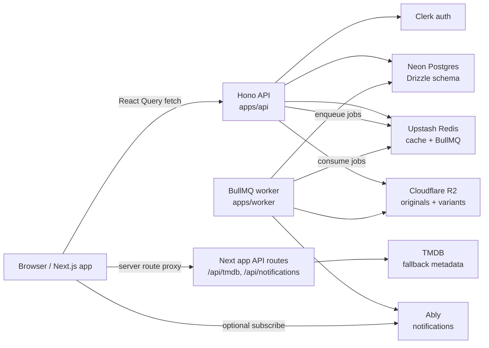

# 35mm Platform - Architecture and System Design

> Master reference document for engineers, AI agents, and product architecture work.
> Last updated: 2026-07-02

35mm is a social film platform: Letterboxd x Twitter for cinema. It combines a social feed, film logs/reviews, comments, profiles, follows, notifications, film lists/watchlists, discovery, and creator-friendly media workflows.

Target scale: 35M+ users. Architecture decisions should preserve cursor pagination, denormalized read counters, async side effects, cacheable media reads, and native-client-friendly REST contracts.

---

## 1. Monorepo Structure

```txt
35mm_platform/
├── apps/
│   ├── web/       Next.js 15 App Router web app
│   ├── api/       Hono REST API
│   ├── worker/    BullMQ background worker
│   └── ios/       SwiftUI iOS app
├── packages/
│   ├── db/          Drizzle schema and Neon client
│   ├── types/       Shared TypeScript contracts
│   ├── validators/  Shared Zod schemas and parsing helpers
│   ├── ui/          Shared React primitives
│   └── config/      Shared TS config
├── docs/
└── codebase-analysis-docs/
```

Deploy targets:

- `apps/web`: Vercel.
- `apps/api`: Vercel or dedicated Node host.
- `apps/worker`: long-running Node process.
- `packages/db`: not deployed directly; consumed by API and worker.

Root commands:

```bash
pnpm dev        # web + API only; avoids idle BullMQ polling against shared Upstash Redis
pnpm dev:all    # web + API + worker
pnpm dev:web
pnpm dev:api
pnpm dev:worker
pnpm build
pnpm typecheck
pnpm lint
```

Node engine: `>=22.0.0`.

---

## 2. Tech Stack

### Frontend: `apps/web`

| Concern | Choice |
|---|---|
| Framework | Next.js 15 App Router |
| React | React 18 |
| Styling | Tailwind CSS v3 with CSS variable tokens |
| Server state | TanStack React Query v5 |
| Client/UI state | Zustand v5 and local component state |
| Auth | Clerk |
| Forms | React Hook Form + Zod |
| Rich text | TipTap |
| Animation | Framer Motion |
| URL state | nuqs |
| Analytics | Vercel Analytics + Speed Insights |
| Tests | Vitest + Testing Library + Happy DOM |

Design conventions:

- Default experience is light mode. Additional themes exist through `data-theme`.
- Main feed column max width is 640px.
- Shell layout is a left nav, center content, and right rail.
- Server state belongs in React Query. Do not mirror DB-backed state in Zustand.
- Query key factories live in feature folders. Do not use ad hoc query strings.

### API: `apps/api`

| Concern | Choice |
|---|---|
| Framework | Hono v4 |
| Contract style | REST, chosen over tRPC for Swift/Kotlin/native compatibility |
| ORM | Drizzle ORM |
| Database | Neon Postgres through `@neondatabase/serverless` |
| Auth | Clerk backend token verification |
| Webhooks | Svix for Clerk webhooks |
| Validation | Zod from `packages/validators` |
| Queues | BullMQ producer |
| Cache/rate limits | Upstash Redis REST |
| Media upload | Cloudflare R2 presigned PUT |

### Worker: `apps/worker`

| Concern | Choice |
|---|---|
| Runtime | Long-running Node process |
| Queue | BullMQ |
| Broker | Upstash Redis protocol URL |
| Image processing | Sharp |
| Blurhash | `blurhash` |
| Storage | Cloudflare R2 |
| Realtime publish | Ably REST for notifications |

Local dev note: BullMQ workers emit continuous blocking Redis commands while idle. Use `pnpm dev:worker` only when testing queued jobs, or set `WORKER_ENABLED=false` to exit before Redis connections are opened.

### iOS: `apps/ios`

| Concern | Choice |
|---|---|
| App | SwiftUI app target `ThirtyFiveMM` |
| Auth | ClerkKit |
| Networking | Shared `APIClient` over REST with Clerk bearer auth |
| Realtime | Ably Swift SDK, optional/noop when `ABLY_API_KEY` is absent |
| Image loading | Kingfisher |
| Tests | `ThirtyFiveMMTests` XCTest target |

Native auth keeps Clerk session state separate from API bootstrap state. If Clerk has an active session but `/v1/me` or onboarding bootstrap fails, the app shows a retry/sign-out recovery screen instead of routing back to signed-out auth screens.

Native feed post cards mirror the shared REST feed contract through `Core/Models/FeedPost.swift`, `PostInteracting`, and `Features/Feed/PostCard.swift`. Likes, reposts, bookmarks, comments navigation, and poll votes use the same `/v1/feed/posts/:postId/*` endpoints as web. Poll voting is optimistic on-device and relies on the API's idempotent vote fact row plus async `counter.increment` jobs for durable poll totals/options, so the hot request path does not perform synchronous counter updates. The native bottom tab bar currently exposes Home, Create, and Activity; Messages/Profile are not bottom-tab destinations. The app shell header loads the current `/v1/me` profile once, opens a left profile sidebar from the avatar, and pushes the native Messages inbox through each tab's `NavigationStack` from the header message icon.

### External Services

| Service | Status | Usage |
|---|---:|---|
| Clerk | Wired | Web auth, API bearer verification, webhooks |
| Neon Postgres | Wired | Source-of-truth relational data |
| Cloudflare R2 | Wired | Originals and processed media variants |
| Upstash Redis | Wired | Feed cache, rate limits, BullMQ broker, suggestions cache, chat unread/typing/presence |
| BullMQ | Partially wired | Media processing, notifications, suggestions, async counters, and feed fanout implemented; digest/search jobs partial |
| Ably | Partially wired | Worker can publish notifications; clients have noop/Ably transport abstractions |
| TMDB | Wired as fallback/proxy | Discovery/autocomplete/cold-start imports |
| Cloudflare Images | Optional | Delivery layer for processed images |
| Cloudflare Stream | Not wired | Future video streaming |
| Meilisearch | Not wired | Future search |
| Resend | Partially wired | Transactional notification emails from the worker; digest remains future work |

---

## 3. Critical Film Identity Rules

These rules are non-negotiable:

- The 35mm database is primary.
- TMDB is a cold-start metadata source and autocomplete fallback only.
- `films.id` is the canonical film ID and must be a 35mm ULID-shaped string.
- `tmdb_id` and `imdb_id` are unique indexes, never primary keys.
- App URLs and API contracts must use the 35mm film ID, not TMDB IDs.
- `FilmRef.id` in frontend/API types is the 35mm ULID.
- `tmdbId` may exist only as optional metadata.
- Do not reintroduce inline film JSON as post identity.

Current implementation:

- `packages/db/src/schema/films.ts` defines the canonical `films` table.
- `posts.film_id` references `films.id`.
- Onboarding and list APIs can resolve TMDB/catalog metadata into canonical `films` rows.
- Validators enforce ULID shape on many film write paths.
- The DB column is `text`, so the ULID guarantee is currently app-layer validation, not a DB check constraint.

---

## 4. Runtime Architecture



Request path:

1. Web client gets Clerk session/token.
2. Feature API clients call `NEXT_PUBLIC_API_URL`.
3. API protected routes use `requireAuth`.
4. API verifies Clerk token, bootstraps missing local `users`, `profiles`, `user_settings`, and a private watchlist.
5. API reads/writes Neon through Drizzle.
6. API invalidates Redis caches and enqueues async jobs where needed.
7. Worker consumes BullMQ jobs for media processing, notification publish, and suggestions.

---

## 5. Current Database Schema

Source of truth: `packages/db/src/schema/*`.

### Core Identity

`users`

- UUID primary key.
- Clerk user ID, email, age verification timestamp, account status.
- Status enum: `active | deactivated | suspended`.

`profiles`

- One-to-one with `users`.
- Username, display name, bio, avatar, cover, location, website, DOB.
- Profile media stores original `avatar_url` / `cover_url` plus nullable JSONB variant maps:
  - `avatar_variants`: `{ sm?: string; lg?: string }`
  - `cover_variants`: `{ default?: string }`
- Role/headline fields and onboarding completion state.
- Favorite film IDs and genre IDs arrays.
- Private account flag.
- Denormalized `films_logged_count`.

`user_settings`

- Privacy preferences.
- Notification preferences.
- Theme, accent color, video autoplay.

### Film Catalog

`films`

- `id`: text primary key, intended to be ULID.
- Optional unique `tmdb_id`, optional unique `imdb_id`.
- Title/original title/year/runtime/overview/poster/backdrop/genres/director/language/country.
- Source enum: `35mm | tmdb_import | user_contributed`.
- Optional contributor user ID.
- Verification flag and timestamps.

### Posts and Interactions

`posts`

- UUID primary key.
- Author FK.
- Type enum: `text | discussion | log | review | image`.
- `headline`, `body`.
- `film_id` FK to `films`, nullable.
- `film_rating` smallint, nullable.
- Visibility enum: `public | followers_only | private`.
- `reply_to_id`, `is_repost`.
- Denormalized `like_count`, `comment_count`, `repost_count`, `bookmark_count`.
- `is_deleted`, `edited_at`.
- JSONB `media`, text array `media_urls`, JSONB `link_preview`.
- Timestamps.

`post_likes`, `post_reposts`, `post_bookmarks`

- Join tables with unique `(post_id, user_id)` indexes.
- `post_bookmarks` is the current table name. Do not use `post_saves`.
- `post_bookmarks.folder_id` optionally points at `bookmark_folders`; deleting a folder sets saved posts back to unsorted bookmarks.

`bookmark_folders`

- Per-user bookmark folders.
- UUID primary key.
- `user_id` FK to `users`.
- `name`, `created_at`, `updated_at`.

`post_polls`, `poll_options`, `poll_votes`

- Ranking/image polls.
- Results visibility: `after_vote | after_end`.
- Vote totals and option vote counts are denormalized.

### Social Graph and Moderation

`follows`

- Composite PK `(follower_id, following_id)`.
- Status enum: `pending | accepted`.

`user_blocks`, `user_mutes`

- Composite primary keys.
- Blocking removes follow relationships, inserts mute, and purges feed rows between users.

### Comments

`comments`

- UUID primary key.
- `post_id`, `user_id`, optional `parent_id`.
- Body, denormalized `like_count`, soft delete, edit timestamp.
- App layer enforces max nesting depth.

`comment_likes`

- Unique `(comment_id, user_id)`.

### Notifications

`notifications`

- Recipient, optional actor, `actor_ids` bundle array.
- Type enum: `like | comment | reply | follow | follow_request | follow_request_approved | mention | repost`.
- Entity ID/type, read state, bundle count, created timestamp.

### Feed Materialization

`feed_items`

- Feed owner user ID, post ID, optional score, created timestamp.
- Used for follow backfill and target hybrid fanout architecture.

`post_edits`

- Historical post body/headline edits.

### Lists and Watchlists

`film_lists`

- Text primary key, intended to be ULID.
- Owner, type enum `custom | watchlist`.
- Title, description, visibility, ranked flag, tags, share slug.
- Denormalized like/comment/entry counts.
- Soft delete and cloned-from reference.
- Partial unique index enforces one active watchlist per user.

`film_list_entries`

- Text primary key, intended to be ULID.
- List, film, position, note, added timestamp.
- Unique `(list_id, film_id)`.

`film_list_likes`

- Unique `(list_id, user_id)`.

### Suggestions

`follow_suggestions`

- Stores computed follow suggestions, currently friend-of-friend oriented.

---

## 6. API Architecture

Entry point: `apps/api/src/index.ts`.

Global behavior:

- Loads env with `loadEnv`.
- Initializes Drizzle with `initDb`.
- Logs feed cache and queue availability.
- Installs CORS, error handling, and route modules.
- Error contract:

```json
{ "code": "ERROR_CODE", "message": "Human readable message" }
```

Paginated envelope:

```json
{
  "items": [],
  "nextCursor": null,
  "hasMore": false
}
```

### Auth Pattern

Protected routes use `requireAuth`:

1. Read `Authorization: Bearer <token>`.
2. Verify token with Clerk.
3. Resolve or create local user/profile/settings.
4. Ensure private watchlist exists when schema is available.
5. Attach `c.var.user`.
6. Reject suspended/deactivated users.

Optional-auth routes call `getOptionalAuthUser`.

### Mounted API Surfaces

Health and utilities:

- `GET /health`
- `GET /poster-proxy`

Auth and onboarding:

- `GET /v1/usernames/:username/available`
- `GET /v1/me`
- `GET /v1/me/onboarding-status`
- `POST /v1/onboarding/films/resolve`
- `POST /v1/me/onboarding`
- `GET /v1/onboarding/suggestions`
- `POST /v1/webhooks/clerk`

Profiles, follows, moderation:

- `GET /v1/profiles/search`
- `GET /v1/profiles/:username`
- `PATCH /v1/profiles/me`
- `GET /v1/profiles/:username/followers`
- `GET /v1/profiles/:username/following`
- `GET /v1/profiles/:username/follow-requests`
- `POST /v1/follows/:userId`
- `DELETE /v1/follows/:userId`
- `POST /v1/follows/:userId/accept`
- `DELETE /v1/follows/:userId/request`
- `GET /v1/follows/requests/received`
- `POST /v1/users/:userId/block`
- `DELETE /v1/users/:userId/block`
- `POST /v1/users/:userId/mute`
- `DELETE /v1/users/:userId/mute`
- `GET /v1/me/blocks`
- `GET /v1/me/mutes`

Feed, posts, comments, polls:

- `GET /v1/feed`
- `POST /v1/feed`
- `GET /v1/feed/posts/:postId`
- `GET /v1/feed/profiles/:username/posts`
- `GET /v1/feed/bookmarks`
- `GET /v1/feed/bookmarks/folders`
- `POST /v1/feed/bookmarks/folders`
- `PATCH /v1/feed/bookmarks/folders/:folderId`
- `DELETE /v1/feed/bookmarks/folders/:folderId`
- `PATCH /v1/feed/posts/:postId`
- `DELETE /v1/feed/posts/:postId`
- `POST /v1/feed/posts/:postId/likes`
- `DELETE /v1/feed/posts/:postId/likes`
- `POST /v1/feed/posts/:postId/reposts`
- `DELETE /v1/feed/posts/:postId/reposts`
- `POST /v1/feed/posts/:postId/bookmarks`
- `PATCH /v1/feed/posts/:postId/bookmarks`
- `DELETE /v1/feed/posts/:postId/bookmarks`
- `POST /v1/feed/posts/:postId/poll/votes`
- `GET /v1/feed/posts/:postId/comments`
- `POST /v1/feed/posts/:postId/comments`
- `PATCH /v1/feed/posts/:postId/comments/:commentId`
- `DELETE /v1/feed/posts/:postId/comments/:commentId`
- `POST /v1/feed/posts/:postId/comments/:commentId/likes`
- `DELETE /v1/feed/posts/:postId/comments/:commentId/likes`

Lists and watchlists:

- `GET /v1/lists/profile/:username`
- `GET /v1/lists/films/:filmId`
- `GET /v1/lists/me/watchlist`
- `POST /v1/lists/films/resolve`
- `GET /v1/lists/:listId`
- `POST /v1/lists`
- `PATCH /v1/lists/:listId`
- `DELETE /v1/lists/:listId`
- `POST /v1/lists/:listId/entries`
- `PATCH /v1/lists/:listId/entries/reorder`
- `PATCH /v1/lists/:listId/entries/:entryId`
- `DELETE /v1/lists/:listId/entries/:entryId`
- `POST /v1/lists/:listId/like`
- `DELETE /v1/lists/:listId/like`
- `POST /v1/lists/:listId/clone`
- `GET /v1/lists/watchlist/films/:filmId`
- `POST /v1/lists/watchlist/films`
- `DELETE /v1/lists/watchlist/films/:filmId`

Notifications:

- `GET /v1/me/notifications`
- `PATCH /v1/me/notifications/:notificationId/read`
- `PATCH /v1/me/notifications/:notificationId/unread`
- `POST /v1/me/notifications/read-all`

Settings:

- `GET /v1/me/settings`
- `PATCH /v1/me/settings/privacy`
- `PATCH /v1/me/settings/notifications`
- `PATCH /v1/me/settings/profile`
- `PATCH /v1/me/settings/appearance`

Media:

- `POST /v1/media/presign`
- `GET /v1/media/resolve-url`
- `GET /v1/media/oembed`

Suggestions:

- `GET /v1/suggestions/users`

Chat:

- `GET /v1/chat/inbox`
- `POST /v1/chat/threads`
- `GET /v1/chat/threads/:threadId/messages`
- `POST /v1/chat/threads/:threadId/messages`
- `PATCH /v1/chat/messages/:messageId?threadId=:threadId`
- `DELETE /v1/chat/messages/:messageId?threadId=:threadId`
- `POST /v1/chat/messages/:messageId/reactions?threadId=:threadId`
- `DELETE /v1/chat/messages/:messageId/reactions/:emoji?threadId=:threadId`
- `PATCH /v1/chat/threads/:threadId/read`
- `GET /v1/chat/threads/:threadId/read-receipts`
- `PATCH /v1/chat/threads/:threadId/archive`
- `PATCH /v1/chat/threads/:threadId/mute`
- `DELETE /v1/chat/threads/:threadId`
- `POST /v1/chat/threads/:threadId/typing`
- `GET /v1/chat/threads/:threadId/typing`
- `POST /v1/chat/presence/ping`
- `POST /v1/chat/presence/batch`

Chat uses hybrid storage. Postgres stores `chat_threads`, `chat_participants`, `chat_member_state`, and `chat_thread_meta`; AWS Keyspaces stores `thirtyFiveMM.messages`, `thirtyFiveMM.message_edits`, and high-scale `thirtyFiveMM.message_reactions`. Redis stores unread counters, typing indicators in a short-lived sorted set, online presence with a 65 second TTL, last-seen presence markers retained for 35 days, and cached `showActivityStatus` privacy flags. Inbox/presence reads use batched Redis `MGET` instead of per-thread/per-user loops, and presence batch responses enforce activity-status privacy server-side. The API publishes latency-sensitive chat realtime events directly to Ably after durable state is written: new message thread events, small-conversation inbox unread updates, message edit/reaction updates, typing, and read receipts. First-time chat reaction adds also create `chat_reaction` notifications for the original message sender, increment that sender's chat unread count, update thread activity metadata, and publish an inbox `thread.updated` patch. BullMQ jobs `chat.deliver`, `chat.messageUpdated`, `chat.readReceipt`, and `chat.typing` remain fallback/asynchronous paths for publish failures, large inbox fanout, and delete/update recovery. The web `ChatRealtimeProvider` subscribes to those channels when `NEXT_PUBLIC_ABLY_API_KEY` is configured, patches active-thread messages and inbox unread rows, and sends throttled presence heartbeats while signed in. Chat headers batch-read active thread member presence to render online, active-ago, and offline labels without persisting presence query cache. Read receipt snapshots use normal stale React Query reads without polling; typing snapshots are development-only fallback when realtime is not configured. A future ScyllaDB Cloud migration can swap the Cassandra contact point while preserving schema and query shapes.

---

## 7. Frontend Architecture

Root app:

- `app/layout.tsx`: global metadata, Clerk provider, React Query providers, fonts, analytics, service worker, offline status.
- `app/providers.tsx`: QueryClient, theme provider, accent color provider, notification realtime provider, title badge, sound player, toast host.
- `middleware.ts`: public route definitions and Clerk protection.
- `app/(shell)/layout.tsx`: authenticated shell, auth bootstrap, onboarding gate, scroll restoration, shared layout grid.

Route groups:

- `(auth)`: login, signup, forgot, reset, verify.
- `(legal)`: about, privacy, terms, help, careers.
- `(shell)`: authenticated product routes.

Important app routes:

- `/landing`: signed-out landing page.
- `/`: authenticated home feed.
- `/new`: post composer page.
- `/:username`: profile.
- `/:username/post/:postid`: post detail.
- `/:username/diary`, `/:username/lists`, `/:username/stats`: profile tabs.
- `/discover`: discovery.
- `/notifications`: notifications.
- `/bookmarks`: two-column bookmarks surface with folder navigation, create/rename/delete folder controls, folder-filtered saved posts, and loading skeletons.
- `/settings`: redirects to `/settings/account`.
- `/settings/account`, `/settings/privacy`, `/settings/notifications`, `/settings/appearance`, `/settings/data-security`: settings sections with URL-backed tab navigation.
- `/list/:listId`: list detail.
- `/suggestions/people`: follow suggestions.
- `/title/:media/:id`: title detail.
- `/short-films`, `/short-films/upload`, `/short-films/:id`: short film surfaces.

Next app API routes:

- `/api/tmdb/[...path]`: server-side TMDB proxy.
- `/api/notifications`: legacy/mock notification data.

Feature ownership:

- `features/feed`: composer, feed, post cards, comments, polls, mutations.
- `features/profile`: public profile, edit profile, follow state, media upload, connections, blocks/mutes.
- `features/notifications`: notification list/dropdown, mark-read flows, realtime. Realtime handles normal freshness; no-Ably fallback invalidates notification queries every 30 seconds without duplicate 5-second component polling.
- `features/lists`: film lists and watchlists.
- `features/settings`: account, privacy, notifications, appearance, data/security settings.
  Account settings include a client-side change-password modal backed by Clerk `user.updatePassword`.
- `features/onboarding`: role, favorite films, favorite genres, follow suggestions.
  Onboarding follow suggestions are a bounded seed query over active public profiles, exclude already-followed/blocked/muted accounts, and rank by denormalized profile activity rather than live follower-count aggregation.
- `features/discover`: TMDB-backed browsing and search.
- `features/bookmarks`: bookmark page, folder management, and post-to-folder flow over feed bookmark API.
- `features/chat`: rich frontend, remote backend client, optional mock mode, chat route pages, realtime cache application, and bounded persisted React Query cache for inbox/recent messages.
- `features/title`: title pages.
- `features/short-films`, `features/festivals`, `features/communities`, `features/videos`: future or mock-heavy product surfaces.

State rules:

- React Query: all DB/server state.
- Zustand: UI-only state, currently composer modal and mobile bottom chrome.
- Local component state: dialogs, menus, active tabs, draft input, reply targets.

---

## 8. Feed and Post Architecture

Business role: primary social timeline and post interaction surface.

Detailed fanout/ranking implementation note: `docs/feed-fanout-ranking.md`.

Read path:

1. Web `useFeed` calls `/v1/feed` or `/v1/feed/profiles/:username/posts`.
2. API applies optional auth, moderation filters, visibility rules, cursor filters, and cache lookup.
3. API hydrates author, film, media variants, poll, viewer interaction flags, and counters.
4. Response uses `{ items, nextCursor, hasMore }`.
5. Web adapts payloads into feed component types.

Write path:

1. Web composer validates and submits post payload.
2. API validates with `createPostSchema`.
3. API writes post, poll rows if needed, the author's own feed item row, and edit/history metadata.
4. API writes interaction fact rows synchronously and enqueues `counter.increment` for denormalized counters instead of updating hot counter rows inline.
5. API enqueues `feed.fanout` for accepted followers when the post should enter home feeds.
6. API creates mention notifications and enqueues media processing if media exists.
7. API invalidates author/guest feed caches; the worker invalidates viewer caches as materialized rows are written.

Interactions:

- Likes, reposts, bookmarks, poll votes, comment CRUD, and comment likes are real API paths.
- Notifications are created for relevant social actions.
- Rich text mentions are hydrated and can create mention notifications.

Scale target:

- Cursor pagination everywhere.
- Denormalized counters on read payloads.
- Hybrid fanout is implemented for home feed: write fanout below the high-follower threshold and live read merge at/above it.

Current feed behavior:

- `feed.fanout` writes follower `feed_items` in cursor-paginated chunks and skips high-follower authors.
- `FEED_HIGH_FOLLOWER_THRESHOLD` defaults to `10000`, matching the architecture target, and can be overridden per environment.
- `FEED_FANOUT_BATCH_SIZE` defaults to `500` and is capped by the worker at `2000`.
- Authenticated home feed reads materialized `feed_items` plus live recent posts from followed high-follower accounts, ordered by score + post ID.
- Feed score formula is `1000 * exp(-ageHours / 36) + 120 * ln(1 + likes + comments*3 + reposts*4)`.
- `feed_items.score` is computed at fanout/backfill/write time from denormalized post counters, and `feed.rescore` periodically refreshes recent rows after async counter deltas settle.
- `feed_items` retention defaults to 30 days (`FEED_ITEMS_RETENTION_DAYS`). This keeps the hot materialized table bounded while covering the practical depth of normal social feed pagination; users who page beyond that switch to the cold path.
- `feed.pruneFeedItems` runs as a repeatable worker job every 60 minutes by default, deleting old `feed_items` in indexed `(created_at, id)` chunks of 5,000 rows, up to 20 chunks per run. It logs pruned rows and distinct touched viewers; it relies on the 60-second feed cache TTL instead of issuing per-viewer Redis invalidations during prune.
- Authenticated home feed cursors include score, post ID, ranking timestamp, and the materialized row creation time when a row came from `feed_items`. When that materialized cursor anchor reaches the retention boundary, the API bypasses feed cache and reads that page from `posts` for the viewer's own posts plus accepted followees.
- Reposts are filtered at feed query time against the original author's profile privacy. A repost of a private author's post is visible only when the viewer also follows the original author.
- Authenticated home feed cursor ranking timestamps keep score-formula rows stable across pages.
- Authenticated home feeds that include high-follower live rows cache the final per-viewer merged page with the normal feed payload TTL and also cache the viewer-independent slice: recent rows for each high-follower author, keyed by author ID.
- `FEED_HIGH_FOLLOWER_CACHE_TTL_SECONDS` defaults to 45 seconds. This intentionally allows high-follower author scores/counters/profile fields to be up to TTL seconds stale in exchange for sharing one cached author slice across many followers.
- `FEED_HIGH_FOLLOWER_CACHE_POST_LIMIT` defaults to 100 rows per author. Deep pagination beyond the cached slice falls back to a direct per-author DB query for that rare page.
- `counter.increment` is implemented for post like/comment/repost/bookmark counters, comment likes, poll totals/options, and film list like/entry counters.
- Counter jobs are batched in the worker for a short window before writing Postgres; the manual reconciliation path is `pnpm --filter @35mm/worker reconcile:counters -- --scope=<scope> --id=<id>`.

---

## 9. Film Lists, Watchlists, and Catalog Resolution

Business role: user-curated film identity surfaces and private watchlist.

Resolution inputs:

- Existing 35mm `filmId`.
- TMDB film metadata.
- Catalog/user-contributed film metadata.

Resolution behavior:

- Existing `filmId` must be valid ULID and exist.
- TMDB payload dedupes by `tmdb_id` and inserts `source='tmdb_import'`.
- Catalog payload dedupes by title/year under `source='35mm'`.
- New film IDs are generated with `createUlid`.

List behavior:

- Users can create custom lists.
- Each user gets one private watchlist.
- Entries have optional notes and positions.
- Lists can be liked, cloned, reordered, soft-deleted.

Current gap:

- There is no general films API module or Meilisearch-backed film search yet.

---

## 10. Notifications and Realtime

Business role: notify users about social actions without excessive duplicate noise.

Creation path:

1. API calls `createNotification`.
2. Preferences, mutes, blocks, and self-action rules can skip creation.
3. Unread notifications for the same recipient/type/entity can bundle.
4. API enqueues `notification.publish`.
5. Worker reads notification and actor profiles.
6. Worker publishes Ably `notification.new` to `user:{recipientId}:notifications`.

`chat_reaction` notifications use `entityType=chat_thread` and link back to the chat thread. They are created only for first reaction adds by an actor, not duplicate retries or reaction removals.

Client path:

- Web notifications use React Query for list/read/unread state.
- Follow requests use a dedicated `/v1/follows/requests/received` data source and render in a separate tray above the regular activity notification feed.
- Global providers install realtime, title badge, and sound side effects.
- Realtime provider can run with noop transport when Ably is not configured.

Current gap:

- `notification.digest` is a stub.
- Email digest via Resend is not implemented.
- Transactional notification email is wired as a fire-and-forget side effect of `notification.publish`, with per-type preferences and one-click unsubscribe.

---

## 11. Media Pipeline

Upload path:

1. Web requests `POST /v1/media/presign`.
2. API validates content type, content length, media kind, and R2 env.
3. API returns presigned R2 PUT URL plus deterministic public and variant URLs.
4. Client uploads directly to R2.
5. Post/profile update stores resulting public URL/object key.
6. Profile avatar/cover updates enqueue `media.process` so the worker can generate profile media variants.

Processing path:

1. API enqueues `media.process` for post media and profile avatar/cover uploads.
2. Worker downloads original from R2.
3. Worker creates WebP variants:
   - Post media: `thumb` 320w, `feed` 640w, `full` 2048w.
   - Avatar media: `sm` 64x64 square crop, `lg` 320x320 square crop.
   - Cover media: `default` 1200x400 cover crop.
4. Worker computes blurhash for post media.
5. Worker writes variants to R2 with immutable cache headers.
6. Worker updates `posts.media` / `posts.media_urls` for post media, or `profiles.avatar_variants` / `profiles.cover_variants` for profile media.
7. Optional Cloudflare Images integration can provide delivery URLs for post media.

Profile media delivery:

- Avatar and cover images are public profile media and should resolve to stable `R2_PUBLIC_BASE_URL` URLs, not signed URLs.
- API responses expose `avatarUrl` as the small avatar URL and `avatarUrlLg` as the large profile-header URL.
- Profile cover responses prefer `cover_variants.default`.
- Existing profile media can be backfilled with `pnpm --filter @35mm/worker backfill:avatars`.
- R2 bucket CORS must allow `GET`/`HEAD` from the app origin for browser image loads.
- Browser/service-worker caching treats R2 profile media as long-lived immutable assets.

Limits:

- Images: 12 MB.
- Videos: 120 MB.

Current gap:

- Cloudflare Stream is not wired.
- AVIF generation is deferred.

---

## 12. Caching, Rate Limiting, and Pagination

Feed cache:

- Namespace: `feed-cache:v1`.
- Home feed key includes viewer, cursor, and limit.
- Profile feed key includes username, viewer, cursor, and limit.
- Index sets track keys by viewer and author for targeted invalidation.
- Cache disables automatically if Upstash REST env is missing.
- TTL is 60 seconds for feed payloads.
- Authenticated home feeds with followed high-follower authors use Redis payload caching like other viewer feeds. On misses, high-follower author rows are cached separately by author ID with a short TTL, then merged with the viewer's materialized rows, block/mute state, and interaction flags per request.

Rate limiting:

- Redis fixed-window limiter.
- Allowed requests avoid per-request `TTL`; `TTL` is fetched only for blocked responses that need `Retry-After`.
- Disabled in test env or when `RATE_LIMIT_DISABLED=true`.
- Feed create: 20/min per user.
- Media presign: 20/min per user.
- Feed reads also have route-level rate limiting.

Pagination:

- API uses cursor pagination.
- Shared helper encodes `{ createdAt, id }` as base64 JSON.
- Authenticated home feed ranking uses a score cursor `{ score, id, asOf, createdAt }`; guest/profile/bookmark/comment feeds keep chronological cursors.
- No OFFSET pagination should be added.

---

## 13. Worker Jobs

Queue: `35mm-jobs`.

Implemented:

- `media.process`: post image variants/blurhash and profile avatar/cover variants.
- `notification.publish`: Ably notification publish.
- `compute-suggestions`: friend-of-friend follow suggestions.
- `counter.increment`: batched denormalized counter deltas for hot social/list/poll counters.
- `feed.fanout`: materializes new posts into accepted followers' `feed_items` below the high-follower threshold; skips high-follower authors for live read merge.
- `feed.rescore`: recomputes scores for recent materialized `feed_items` from denormalized post counters and invalidates touched viewer caches.
- `feed.pruneFeedItems`: deletes materialized feed rows older than the retention window in small indexed batches; `feed.rescore` uses the retention boundary as a lower cutoff so it does not refresh rows about to be pruned. Prune does not target-invalidate viewer caches because feed payload TTL is short and per-viewer invalidation can be more expensive than the old rows being removed.

Stub or incomplete:

- `notification.digest`: logs readiness only.
- Search indexing jobs are not implemented.

---

## 14. Search and Discovery

Current:

- Discover and title surfaces still rely heavily on TMDB proxy and local/static data.
- Post composer film search uses frontend TMDB-oriented lookup paths in places.
- SearchBar has mock search behavior.

Target:

- Meilisearch indexes:
  - `films`
  - `users`
  - `posts`
- Indexing should happen asynchronously through worker jobs.
- Composer film search should prefer 35mm film catalog search once populated.
- TMDB should remain fallback/autocomplete only.

---

## 15. Chat

Detailed backend reference: `docs/chat-backend.md`

Frontend:

- Rich feature module exists under `apps/web/features/chat`.
- Includes API client abstraction, mock store, remote client, hooks, components, realtime cache application, and documentation.
- App Router pages exist at `/chat` and `/chat/:chatId`; URLs render lowercase chat IDs while the frontend normalizes route params back to canonical uppercase thread IDs before API/cache use.
- Remote chat is the default client mode. `NEXT_PUBLIC_CHAT_API_MODE=mock` is only for demos/tests.
- React Query persists chat conversation lists and the latest bounded message page in `localStorage` for faster reload/offline read access. Infinite/older-history pages are not persisted, and persisted query cache is cleared on sign-out or user switch.
- Chat list/header/message avatars use backend profile avatar URLs when present, thread headers render skeletons while metadata resolves, own messages can be edited through the chat edit route, and image/GIF message media opens in the shared `ImageViewer`.
- The desktop site header Messages nav item shows unread chat count from inbox/request preview caches, which are refreshed by chat realtime inbox invalidation.
- Active chat threads render live typing bubbles from `typing.update` and seen indicators from `message.read`; composer input posts typing state through `/v1/chat/threads/:threadId/typing`. The web UI avoids production polling for ephemeral typing state; realtime is the scale path.

iOS:

- `apps/ios/ThirtyFiveMM/Core/Models/Chat.swift` mirrors the shared chat contracts: `ChatInboxPage`, `ChatThreadPreview`, `ChatMessagesPage`, `ChatMessage`, `ChatMember`, `MessageReaction`, `MessageReplySnapshot`, typing snapshots, and read receipts.
- `apps/ios/ThirtyFiveMM/Features/Chat/ChatAPIClient.swift` covers every `/v1/chat` endpoint using the existing Clerk-backed `APIClient`; chat message IDs stay opaque `String` TIMEUUID values and message pagination uses `before`, not offsets.
- `apps/ios/ThirtyFiveMM/Features/Chat/ChatRealtimeClient.swift` adds optional Ably subscriptions for `user:{userId}:inbox` and `thread:{threadId}` events with explicit inbox/thread subscribe and unsubscribe lifecycle methods. Without `ABLY_API_KEY`, chat remains fetch-capable through the noop client.
- `apps/ios/ThirtyFiveMM/Features/Chat/ChatInboxViewModel.swift` and `ChatInboxView.swift` implement the native messages inbox module: cursor paging, archived/default views, pull refresh, native archive/mute/delete swipe actions, batched visible-row presence, visible-thread typing indicators, profile search backed DM creation, and in-place `thread.updated` realtime row updates. `MainTabView` mounts Messages as a header-pushed `NavigationStack` destination rather than a bottom tab.
- `apps/ios/ThirtyFiveMM/Features/Chat/ChatThreadViewModel.swift` and `ChatThreadView.swift` implement the native thread read side: reverse-display message history with `before` pagination, Ably thread event patching, grouped bubbles, deleted/edited/reply rendering, media/link/file content, reaction pills with endpoint-backed toggles, read receipt summaries, typing bubbles, reconnect reconciliation, and non-disruptive new-message affordance while scrolled up.
- `apps/ios/ThirtyFiveMM/Features/Chat/ChatBlurhash.swift` provides native blurhash placeholder decoding for chat media thumbnails before Kingfisher image fade-in.
- `apps/ios/ThirtyFiveMM/Features/Chat/ChatMediaUploadClient.swift` and `ChatComposerModels.swift` support the native thread write side: growing composer, optimistic sends with retryable failure state, typed upload via the existing `/v1/media/presign` + direct R2 PUT flow, image/file staged previews, 4000-character enforcement, reply/edit context, sender-only edit/delete UI, throttled typing dispatch, and foreground-only read dispatch.
- `apps/ios/ThirtyFiveMMTests/ChatDecodingTests.swift` decodes fixture JSON for core chat message and inbox shapes.
- Native GIF sending, jump-to-unloaded-reply pagination, per-member group read receipt UI, and richer group creation remain staged after the core thread experience.

API:

- Authenticated Hono routes now cover inbox, thread creation, messages, reactions, read state, archive/mute/delete, typing, and presence.
- Media presign supports images/video plus common document MIME types for chat file attachments; all use the same rate-limited `/v1/media/presign` flow and direct R2 PUT.
- Postgres stores thread/member metadata; AWS Keyspaces stores message bodies and edit history.
- Missing Keyspaces config returns a safe empty page for message reads in development and `503 KEYSPACES_UNAVAILABLE` for writes.

Current status:

- Backend persistence and worker realtime jobs are wired.
- Frontend remote client is aligned to `/v1/chat/inbox`, `/v1/chat/threads`, and `/v1/chat/messages` backend routes.
- Production rollout requires keeping both Postgres and Keyspaces schemas applied in every environment.
- AWS Keyspaces schema expects keyspace `thirtyFiveMM` with `messages`, `message_edits`, and sharded `message_reactions` tables using on-demand capacity; apply `packages/db/src/keyspaces/schema.cql` in every environment. Node `cassandra-driver` clients warm pools at API/worker boot, use execution profiles for `chat-read`/`chat-write`, enable prepared statements by default, and pin load balancing to the local AWS region.

---

## 16. Environment Variables

API and worker:

```env
DATABASE_URL=
CLERK_SECRET_KEY=
CLERK_PUBLISHABLE_KEY=
CLERK_WEBHOOK_SECRET=
CORS_ORIGIN=
R2_ACCOUNT_ID=
R2_ACCESS_KEY_ID=
R2_SECRET_ACCESS_KEY=
R2_BUCKET=
R2_PUBLIC_BASE_URL=
R2_PRESIGN_TTL_SECONDS=
UPSTASH_REDIS_URL=
UPSTASH_REDIS_REST_URL=
UPSTASH_REDIS_REST_TOKEN=
ABLY_API_KEY=
RATE_LIMIT_DISABLED=
CF_IMAGES_ACCOUNT_HASH=
CF_IMAGES_ACCOUNT_ID=
CF_IMAGES_API_TOKEN=
CF_IMAGES_DELIVERY_BASE_URL=
CF_IMAGES_DEFAULT_THUMB_VARIANT=
CF_IMAGES_DEFAULT_FEED_VARIANT=
CF_IMAGES_DEFAULT_FULL_VARIANT=
COUNTER_BATCH_WINDOW_MS=
FEED_HIGH_FOLLOWER_THRESHOLD=
FEED_FANOUT_BATCH_SIZE=
FEED_RESCORE_MAX_AGE_HOURS=
FEED_RESCORE_BATCH_SIZE=
FEED_ITEMS_RETENTION_DAYS=
FEED_ITEMS_PRUNE_BATCH_SIZE=
FEED_ITEMS_PRUNE_MAX_BATCHES=
FEED_ITEMS_PRUNE_INTERVAL_MINUTES=
FEED_HIGH_FOLLOWER_CACHE_TTL_SECONDS=
FEED_HIGH_FOLLOWER_CACHE_POST_LIMIT=
RESEND_API_KEY=
EMAIL_FROM=
EMAIL_UNSUBSCRIBE_SECRET=
APP_BASE_URL=
API_PUBLIC_BASE_URL=
NOTIFICATION_EMAIL_COOLDOWN_MINUTES=
PORT=
```

Web:

```env
NEXT_PUBLIC_API_URL=
NEXT_PUBLIC_CLERK_PUBLISHABLE_KEY=
CLERK_SECRET_KEY=
TMDB_API_KEY=
NEXT_PUBLIC_OMDB_API_KEY=
NEXT_PUBLIC_IS_AUTHENTICATED=
NEXT_PUBLIC_MEDIA_READS_PUBLIC=
NEXT_PUBLIC_ABLY_API_KEY=
NEXT_PUBLIC_CHAT_API_MODE=
NEXT_PUBLIC_CHAT_API_URL=
NEXT_PUBLIC_TENOR_API_KEY=
```

iOS xcconfig:

```env
API_BASE_URL=
CLERK_PUBLISHABLE_KEY=
ABLY_API_KEY=
```

Future:

```env
MEILISEARCH_HOST=
MEILISEARCH_API_KEY=
```

---

## 17. Testing

Current test coverage includes:

- API media variants.
- API rich text validators.
- API feed rich mentions and mention notifications.
- Web rich text renderer.
- Web R2 media helpers.
- Web post media helpers.
- Web comment section.
- Web search bar.
- Web post composer.
- Web settings schemas, hooks, and notifications panel.
- Modal focus stack.

Useful commands:

```bash
pnpm --filter @35mm/web test
pnpm --filter @35mm/api test
pnpm --filter @35mm/api typecheck
pnpm --filter @35mm/worker typecheck
pnpm typecheck
```

---

## 18. Current Gaps and Priority Work

Highest priority architecture gaps:

1. Add general films API and catalog search.
2. Wire Meilisearch for films/users/posts.
3. Add DB-level checks for ULID-shaped text IDs where practical.
4. Finish notification digest and Resend integration.
5. Wire Cloudflare Stream if production video is in scope.
6. Audit all TMDB-backed title/discover paths for canonical 35mm ID compliance.
7. Validate migrations against current Drizzle schema in real environments.

Post-V1 or gated surfaces:

- Short films.
- Communities.
- Festivals.
- Push notifications.

---

## 19. Engineering Rules

- Do not use TMDB IDs as canonical film IDs.
- Keep `FilmRef.id` as a 35mm ULID.
- Do not add OFFSET pagination.
- Do not use live `COUNT()` queries on hot read paths.
- Keep user-generated content soft-deleted.
- Keep DB/server state in React Query on the frontend.
- Use Zustand only for local UI state.
- Use feature query key factories.
- Keep REST contracts stable and native-client friendly.
- Keep schema, validators, shared types, API routes, frontend adapters, and worker side effects aligned in the same change.
