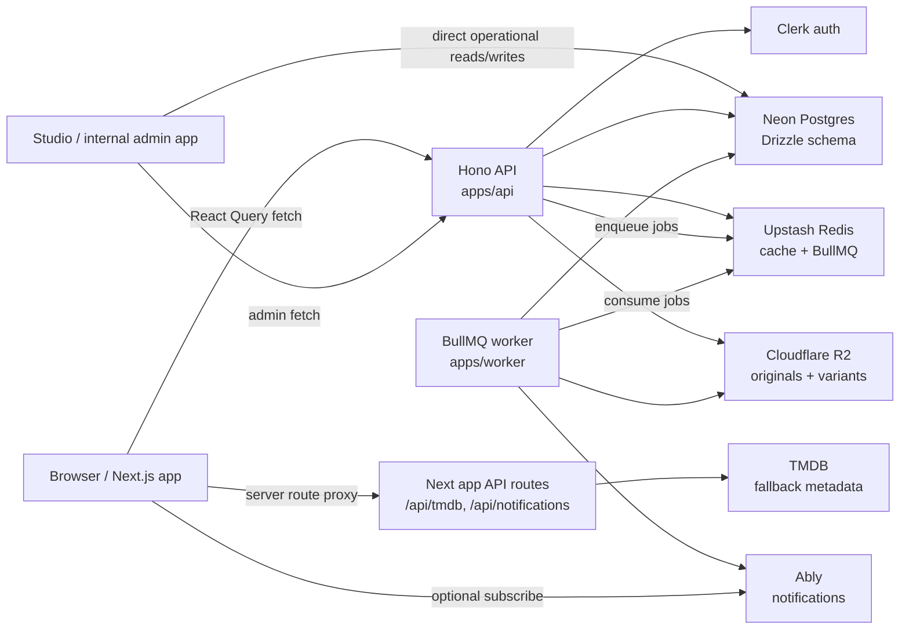

# 35mm Platform - Architecture and System Design

> Master reference document for engineers, AI agents, and product architecture work.
> Last updated: 2026-07-17

Catalog documentation lives in `docs/catalog/`; start with `docs/catalog/spec.md`.

Content moderation documentation lives in `docs/moderation/`; start with `docs/moderation/spec.md`.

35mm is a social film platform: Letterboxd x Twitter for cinema. It combines a social feed, film logs/reviews, comments, profiles, follows, notifications, film lists/watchlists, discovery, creator-friendly media workflows, and an IMDb-like catalog database for titles, people, companies, awards, media, sources, and public revision history.

Target scale: 35M+ users. Architecture decisions should preserve cursor pagination, denormalized read counters, async side effects, cacheable media reads, and native-client-friendly REST contracts.

---

## 1. Monorepo Structure

```txt
35mm_platform/
├── apps/
│   ├── web/       Next.js 15 App Router web app
│   ├── studio/    Next.js internal admin/content operations app
│   ├── api/       Hono REST API
│   ├── worker/    BullMQ background worker
│   └── ios/       SwiftUI iOS app
├── packages/
│   ├── db/          Drizzle schema and Neon client
│   ├── types/       Shared TypeScript contracts
│   ├── validators/  Shared Zod schemas and parsing helpers
│   ├── ui/          Shared React primitives
│   └── config/      Shared TS config
├── docs/
└── codebase-analysis-docs/
```

Deploy targets:

- `apps/web`: Vercel.
- `apps/studio`: internal Next.js admin deployment, isolated from the public web app.
- `apps/api`: Vercel or dedicated Node host.
- `apps/worker`: long-running Node process.
- `packages/db`: not deployed directly; consumed by API and worker.

Root commands:

```bash
pnpm dev        # web + API only; avoids idle BullMQ polling against shared Upstash Redis
pnpm dev:all    # web + Studio + API + worker
pnpm dev:web
pnpm dev:studio
pnpm dev:api
pnpm dev:worker
pnpm build
pnpm typecheck
pnpm lint
```

Node engine: `>=22.0.0`.

---

## 2. Tech Stack

### Frontend: `apps/web`

| Concern | Choice |
|---|---|
| Framework | Next.js 15 App Router |
| React | React 18 |
| Styling | Tailwind CSS v3 with CSS variable tokens |
| Server state | TanStack React Query v5 |
| Client/UI state | Zustand v5 and local component state |
| Auth | Clerk |
| Forms | React Hook Form + Zod |
| Rich text | TipTap |
| Animation | Framer Motion |
| URL state | nuqs |
| Analytics | Vercel Analytics + Speed Insights |
| Tests | Vitest + Testing Library + Happy DOM |

Design conventions:

- Default experience is light mode. Additional themes exist through `data-theme`, including Matinee for warm editorial film surfaces, shared elevated panels/dropdowns, composer, and floating chat surfaces.
- Main feed column max width is 640px.
- Shell layout is a left nav, center content, and right rail.
- Server state belongs in React Query. Do not mirror DB-backed state in Zustand.
- Query key factories live in feature folders. Do not use ad hoc query strings.

### Studio: `apps/studio`

| Concern | Choice |
|---|---|
| Framework | Next.js App Router |
| Purpose | Internal platform/content operations |
| Auth | Dedicated Clerk app configuration |
| Server state | TanStack Query |
| Client/UI state | Zustand and local component state |
| Forms | React Hook Form + Zod through standard-schema resolver |
| Styling | Tailwind CSS with shadcn-style primitives |

Studio is a separate internal workspace from the public web app. It exposes operational surfaces for catalog titles, shelves, users, username locks, infrastructure, queues, moderation, imports, and API reference pages. Catalog title list/detail/form/import surfaces use the Hono `/v1/catalog` read and mutation APIs, TanStack Query, Clerk bearer tokens for writes, required idempotency keys, and cursor pagination. Local browser sessions on `http://localhost:3001` call the local Hono API at `http://localhost:4000` directly because non-production API CORS allows Studio. Deployed/no-env sessions fall back to the Studio `/api/platform/*` server proxy; that proxy accepts `PLATFORM_API_URL` for deployed/internal API origins, rejects self-targeting Studio URLs, and returns JSON diagnostics for upstream non-JSON errors. Username lock routes rely on the shared Drizzle schema and require the `0036_username_locks` migration in environments where lock management is enabled.

The moderation console (`/moderation` queue + `/moderation/:contentType/:contentId` detail) is a first-class Studio surface gated on the `moderation` / `moderation_admin` Studio roles (nav hidden and `proxy.ts` middleware redirect when absent; the Hono API is the real authority). Its typed client lives in `lib/moderation/api.ts` and shares the base-URL/proxy resolver (`lib/studio/platformClient.ts`) with the catalog client. The queue reads `GET /v1/admin/moderation/queue` with `nuqs` URL-backed status/contentType/reason filters and cursor pagination; the detail reads `GET /v1/admin/moderation/content/:contentType/:contentId` with independent `reportCursor`/`actionCursor`/`strikeCursor` cursors, renders the persisted per-type snapshot (so cases stay reviewable after content is hidden/removed), and applies enforcement via `POST .../action` or the distinct `POST .../dismiss`, each with a per-attempt `Idempotency-Key` (reused on `503` cache-sync retry). Suspend duration is carried in action `metadata.durationMinutes` because the action payload has no top-level duration field.

### API: `apps/api`

| Concern | Choice |
|---|---|
| Framework | Hono v4 |
| Contract style | REST, chosen over tRPC for Swift/Kotlin/native compatibility |
| ORM | Drizzle ORM |
| Database | Neon Postgres through `@neondatabase/serverless`; HTTP driver for general reads and pooled Neon driver for transaction-required writes |
| Auth | Clerk backend token verification |
| Webhooks | Svix for Clerk webhooks |
| Validation | Zod from `packages/validators` |
| Queues | BullMQ producer |
| Cache/rate limits | Upstash Redis REST |
| Media upload | Cloudflare R2 presigned PUT |

### Worker: `apps/worker`

| Concern | Choice |
|---|---|
| Runtime | Long-running Node process |
| Queue | BullMQ |
| Broker | Upstash Redis protocol URL |
| Image processing | Sharp |
| Blurhash | `blurhash` |
| Storage | Cloudflare R2 |
| Realtime publish | Ably REST for notifications |

Local dev note: BullMQ workers emit continuous blocking Redis commands while idle. Use `pnpm dev:worker` only when testing queued jobs, or set `WORKER_ENABLED=false` to exit before Redis connections are opened. Worker requires explicit `QUEUE_REDIS_URL` (or queue REST credentials) and never falls back to cache Redis, preventing silent producer/consumer queue divergence.

### iOS: `apps/ios`

| Concern | Choice |
|---|---|
| App | SwiftUI app target `ThirtyFiveMM` |
| Auth | ClerkKit |
| Networking | Shared `APIClient` over REST with Clerk bearer auth |
| Realtime | Ably Swift SDK, optional/noop when `ABLY_API_KEY` is absent |
| Image loading | Kingfisher |
| Tests | `ThirtyFiveMMTests` XCTest target |

App-wide design tokens live in `apps/ios/ThirtyFiveMM/Core/DesignSystem.swift`: brand accent `#c2473a` (also wired into `AccentColor.colorset`), like/repost action colors, a 4pt spacing scale, corner-radius scale, canonical avatar sizes, and semantic Dynamic Type font aliases (`.appWordmark`, `.appScreenTitle`, `.appAuthorName`, etc.). Core surfaces (shell chrome, feed cards, notifications, settings, chat headers) use these tokens or system text styles instead of hardcoded `.system(size:)` fonts; auth/onboarding marketing screens intentionally keep their own display styling.

Native auth keeps Clerk session state separate from API bootstrap state. If Clerk has an active session but `/v1/me` or onboarding bootstrap fails, the app shows a retry/sign-out recovery screen instead of routing back to signed-out auth screens.

Debug device builds omit the Associated Domains entitlement so contributors using an Apple Personal Team can provision and run the app on physical devices. Release builds retain `ThirtyFiveMM.entitlements`, including Clerk's `webcredentials` domain; production signing therefore requires an Apple Developer Program team that supports Associated Domains. The reverse-DNS bundle identifier `com.35mm.app` is an Apple app identifier and does not represent the product's public web domain.

Native feed post cards mirror the shared REST feed contract through `Core/Models/FeedPost.swift`, `PostInteracting`, and `Features/Feed/PostCard.swift`. Film-log cards consume canonical film ID, poster, genres, and normalized 0.5-5 rating metadata already present in that payload; poster-derived card color is computed on-device from a 16x16 sample and kept in a bounded memory cache, adding no feed API or database read. Likes, reposts, bookmarks, comments navigation, and poll votes use the same `/v1/feed/posts/:postId/*` endpoints as web. Poll voting is optimistic on-device and relies on the API's idempotent vote fact row plus async `counter.increment` jobs for durable poll totals/options, so the hot request path does not perform synchronous counter updates. Native post detail renders the complete post body, keeps TipTap paragraph breaks at one rendered line break, places the reply trigger/expanded composer inline above the cursor-paged comment list, and gives comments a compact like/reply-count/reply action row backed by the existing optimistic comment-like and create-comment paths. Native URL previews share web's image-first editorial card and text-only fallback; YouTube/Vimeo post links and YouTube/Vimeo/Dailymotion comment links use locally detected, de-duplicated video thumbnail cards. Detection is bounded to each already-loaded body and publisher thumbnails load through the existing Kingfisher image path, adding no API, database, cache, queue, worker, schema, or index. Post and comment identity links share the same compact role/context/films-logged headline directly beneath the name. Their shared native identity/timestamp header matches web positioning and uses Dynamic Type tokens from `Core/DesignSystem.swift`: semibold subheadline name, regular subheadline handle, inline muted footnote `· timestamp`, optional caption2 `logged` context, and trailing overflow control. Feed timestamps use the same `now`, minute, hour, and unbounded day buckets as web; edits do not prepend a competing header label. The native `ShareModal` matches mobile web's branded 32pt-radius bottom sheet for post and profile sharing, including the content preview, ten-destination grid, separator, copy-link feedback, synchronized backdrop/panel animation, drag dismissal, safe-area padding, and Reduce Motion behavior. Its regular-height shell has no outer height constraint and therefore resolves strictly to its content plus safe-area padding; only the inner compact-height scroll region receives a cap for phone landscape. The complete sheet remains composed offscreen before presentation and moves as one container; its fixed ten-item grid uses eager rows so preview, destinations, and copy control cannot enter on separate layout passes. Share destinations and previews are composed entirely on-device from already-loaded data, adding no API, database, cache, queue, or media request beyond optional preview-image delivery. Existing comment list/create/edit responses expose those fields from their already-joined profile row, adding no query, N+1 read, route, cache, job, schema, or index. Author avatars plus display-name/username controls push the shared `ProfileView` through the shell's typed `AppRoute` path; an explicit tap adds one bounded existing profile read and no feed/comment query. The native bottom tab bar currently exposes Home, Create, and Activity; Messages/Profile are not bottom-tab destinations. The app shell header loads the current `/v1/me` profile once, including denormalized follower/following counts, opens a stationary left profile sidebar from the avatar, and pushes the complete tab/header/bottom-bar surface right by the drawer width with the same horizontal-only 300 ms timing curve and dimming as mobile web. Both native and mobile-web sidebars show those relationship counts beneath the username without another query. The native tab bar uses the system default (blurred) backdrop with label/secondary-label item tints and selection-aware filled/outline SF Symbols, and the sidebar push does not apply clipping or vertical layout modifiers. Reduce Motion disables that spatial animation. Messages remains a `NavigationStack` destination opened from the header message icon.

Non-control taps across native feed, profile, and bookmark `PostCard` instances open post detail through a full-card background `Button`. Nested author, media, quote, overflow, poll, and interaction controls retain independent hit targets. This is client-only navigation wiring over already-loaded post data; it adds no API route, database query, cache, worker job, schema, or index.

Native repost/quote presentation matches web's expanded feed contract. Card and image-viewer repost controls open Repost/Undo + Quote actions. `RepostContext` renders viewer-aware social proof from at most two named actors, while feed/profile/bookmark pagination collapses repeated normalized source IDs and merges counters/flags in bounded O(loaded-page-size) client memory. `QuotedFeedPost` renders non-recursive rich-text, media, film, link, and poll previews or unavailable tombstones; normal and quoted cards share `PostMediaGrid` and its responsive one-to-four-image layouts, so a multi-image quote preview renders every bounded preview item instead of replacing later images with a count badge. Opening a source performs one bounded existing detail read. Quote publishing sends `quotedPostId` through the existing authorized, rate-limited `POST /v1/feed` route, guards duplicate taps, surfaces failures, and prepends the returned row without another feed query. This adds no API route, database query, cache, worker job, schema, or index.

Shared native action sheets use `Core/BottomActionSheet.swift` and the `bottomActionSheet` presenter. Their visual contract mirrors the mobile-web `PortalDropdown` sheet: no visible menu title, a 38% neutral dark backdrop, 32pt shell corners, sunken shell/elevated 22pt action groups, 58pt rows with 16pt semibold labels and 24pt icon slots, inset dividers, exact light/dark semantic colors, safe-area-aware bottom spacing, and an 80pt downward drag dismissal threshold. The backdrop deliberately avoids SwiftUI light material because transparent full-screen covers can resolve that material as an opaque white wash. System cover choreography is disabled so backdrop fade and panel movement begin in one 300 ms smooth transaction on presentation and dismissal; Reduce Motion presents and dismisses without spatial animation. All feed, comment, image, bookmark, profile, title, review, and credit action-sheet call sites use this presenter. This is presentation-only and adds no network, database, cache, worker, schema, or index impact at 1M+ DAU.

Native bookmarks live in `Features/Bookmarks` and use the same cursor-paged `/v1/feed/bookmarks` and denormalized `/v1/feed/bookmarks/folders` contracts as web. The SwiftUI surface provides All, Unsorted, and folder pages; folder create/rename/delete; post move/remove actions; app-standard bottom action sheets; optimistic interaction rollback; and localized search across loaded cursor pages. The selected tab is the sole collection heading: post rows show a folder badge only in All and omit it for unsorted bookmarks, while folder actions remain in the control row. Bookmark-specific move/copy/remove actions reuse `PostCard`'s existing in-card overflow control, avoiding a second standalone action row. Folder create/rename uses an opaque grouped-system editor surface with a compact 230pt standard detent and a taller accessibility Dynamic Type detent. Search never expands into an unbounded fetch: when a loaded page has no match, the user can explicitly scan the next 20-item cursor page. Rapid folder changes use request identity checks so stale responses cannot replace the active folder. Folder and interaction mutations retain existing server authorization and route-family rate limits. This adds no API, database query, cache, worker job, or index; at 1M+ DAU, read volume remains one per-user cursor query plus one denormalized folder-summary query per initial/refresh load.

Web and native profiles share Posts/Reposts/Diary/Lists/Stats navigation. Web route `/:username/reposts` and native Reposts tab lazily request `GET /v1/feed/profiles/:username/posts?kind=reposts`; independent React Query/native cursor state prevents mixed-feed cache reuse. Existing privacy/moderation checks return only normalized repost activity through bounded 20-item cursor pages.

Native profiles live in `Features/Profile` and mirror the mobile-web information hierarchy with cover/avatar identity, inline relationship counts, bio metadata, and equal-width Posts/Reposts/Diary/Lists/Stats tabs. The identity chip renders profile role plus optional role context; denormalized films-logged count remains a separate metric in the counts row. Header actions use the web profile's adaptive border hierarchy: regular border for circular share/overflow controls and strong border for outline action pills. Profiles with valid avatar or cover URLs expose accessible full-screen previews through `Core/ImageViewerView.swift`; presentation suppresses system cover choreography, profile photos use a centered circular crop, covers retain fitted rectangular presentation, and both place the profile username directly below the image. Missing media remains noninteractive, and image delivery reuses Kingfisher's bounded cache/retry path without another API read. Overflow, unfollow, and block choices use the shared app-standard bottom action sheet; profile sharing opens the branded native `ShareModal` directly. Profile posts, reposts, and lists use independent 20-item cursor streams; reposts, lists, and the server-cached stats summary load only when selected. Existing denormalized counts remain read-time inputs, post interactions preserve optimistic rollback, and follow/request/mute/block actions reuse the existing authorized, rate-limited REST mutations. Own-profile editing uses validated PATCH semantics with explicit JSON `null` for field/media removal; avatar and cover changes reuse `/v1/media/presign` plus direct R2 PUT through the shared native presigned uploader. This extends an existing read route without adding a mutation, worker job, or counter path. At 1M+ DAU, each tab request remains one bounded cursor query; `posts_user_repost_created_at_id_idx` keeps repost scans indexed by user and activity order. Media previews add only user-initiated CDN delivery when not already cached.

Native Discover mirrors the web Discover program through the existing cached, IP-rate-limited `/api/tmdb` proxy: popular/featured heroes, provider-filtered streaming, trending, ranked, current-release, popular, mood, TV, and Now Playing shelves use the same upstream paths and ordering. Provider changes refetch only the streaming shelf. TMDB IDs remain discovery metadata, never 35mm identity: opening an item resolves `externalProvider=tmdb&externalId=...` through public `/v1/catalog/titles`, then navigates with the canonical catalog ID; an unlinked item offers an explicit web-title fallback. `Features/Title` remains catalog-backed and provides hero/metadata, lazy reviews, complete cursor-paged cast/crew, live watchlist state, and bottom action sheets. Social reviews resolve only through `catalog_titles.legacy_film_id` to canonical `films.id`; unbridged titles render an explicit unavailable state instead of substituting a TMDB ID.

### External Services

| Service | Status | Usage |
|---|---:|---|
| Clerk | Wired | Web auth, API bearer verification, webhooks |
| Neon Postgres | Wired | Source-of-truth relational data |
| Cloudflare R2 | Wired | Originals and processed media variants |
| Upstash Redis | Wired | Split Redis databases for feed/catalog/profile/TMDB cache, rate limits, BullMQ broker, suggestions cache, and chat unread/typing/presence |
| BullMQ | Partially wired | Media processing, notifications, suggestions, async counters, and feed fanout implemented; digest/search jobs partial |
| Ably | Partially wired | Worker can publish notifications; clients have noop/Ably transport abstractions |
| TMDB | Wired as fallback/proxy | Discovery/autocomplete/cold-start imports |
| Cloudflare Images | Optional | Delivery layer for processed images |
| Cloudflare Stream | Not wired | Future video streaming |
| Meilisearch | Not wired | Future search |
| Resend | Partially wired | Transactional notification emails from the worker; digest remains future work |

---

## 3. Critical Film Identity Rules

These rules are non-negotiable:

- The 35mm database is primary.
- TMDB is a cold-start metadata source and autocomplete fallback only.
- `catalog_titles.id` is the long-term canonical catalog title ID for IMDb-like title data.
- `films.id` remains the current social-product film FK and compatibility bridge while catalog APIs migrate to `catalog_titles`.
- `tmdb_id` and `imdb_id` are unique indexes, never primary keys.
- App URLs and API contracts must use 35mm IDs, not TMDB IDs.
- `FilmRef.id` in current frontend/API social contracts is the 35mm film ULID.
- `tmdbId` may exist only as optional metadata.
- Do not reintroduce inline film JSON as post identity.

Current implementation:

- `packages/db/src/schema/films.ts` defines the canonical `films` table.
- `posts.film_id` references `films.id`.
- Onboarding and list APIs can resolve TMDB/catalog metadata into canonical `films` rows.
- Public contributor forms write to `contribution_submissions` for moderation instead of mutating `films` or title/person identity directly.
- `packages/db/src/schema/catalog.ts` defines the new catalog database tables using a `catalog_` table prefix. This is the foundation for direct Studio/contributor catalog edits, public revision history, sources, and rollback.
- Validators enforce ULID shape on many film write paths.
- The DB column is `text`, so the ULID guarantee is currently app-layer validation, not a DB check constraint.

---

## 4. Runtime Architecture



Request path:

1. Web client gets Clerk session/token.
2. Feature API clients call `NEXT_PUBLIC_API_URL`.
3. API protected routes use `requireAuth`.
4. API verifies Clerk token, bootstraps missing local `users`, `profiles`, `user_settings`, and a private watchlist.
5. API reads/writes Neon through Drizzle.
6. Public mutation routes apply Upstash-backed rate limits before writes. Rate limiting is fail-closed outside explicit test/disabled modes: missing/unreachable Redis returns `503 RATE_LIMIT_UNAVAILABLE`.
7. API uses pooled Neon transactions for multi-table write units such as post+poll creation, repost materialization, list cloning, and chat thread metadata creation.
8. API invalidates Redis caches and enqueues async jobs where needed. Counter-touching mutations also write durable `counter_jobs` rows in the same DB transaction as their fact-row changes, then best-effort wake the worker.
9. Worker consumes BullMQ jobs for media processing, notification publish, and suggestions.

---

## 5. Current Database Schema

Source of truth: `packages/db/src/schema/*`.

### Core Identity

`users`

- UUID primary key.
- Clerk user ID, email, age verification timestamp, account status.
- Status enum: `active | deactivated | suspended | banned`.

`profiles`

- One-to-one with `users`.
- Username, display name, bio, avatar, cover, location, website, DOB.
- Profile media stores original `avatar_url` / `cover_url` plus nullable JSONB variant maps:
  - `avatar_variants`: `{ sm?: string; lg?: string }`
  - `cover_variants`: `{ default?: string }`
- Role/headline fields and onboarding completion state.
- Edit Profile can update role/headline metadata through `/v1/profiles/me`; role changes write both role and headline fields so profile and post bylines stay aligned.
- Favorite film IDs and genre IDs arrays.
- Private account flag.
- Denormalized `films_logged_count`, `post_count`, follower/following counts, moderation `strike_count`, and `moderation_status`. `post_count` tracks non-deleted authored posts through the durable async counter outbox; migration `0047_profile_post_count` backfills existing profiles.
- Public profile detail, stats, search, follower, and following reads exclude hidden/removed profiles. Profile owner and moderation staff retain access; responses expose `moderationStatus` so owner clients can render under-review/removed state.

`username_locks`

- Text primary key `username`, stored lowercase.
- `state`: `locked | reserved`.
- `owner`, `reason`, and timestamps for Studio-managed operational context.
- Check constraints enforce lowercase usernames and the allowed state set.
- API username availability and profile rename paths consult this table in addition to existing profile usernames and the shared reserved-name list.

`contribution_submissions`

- UUID primary key, authenticated user, contribution kind, moderation status, title/summary, optional entity reference, and JSONB payload.
- Kind enum: `add_title | edit_title | credits | person_update | media | awards_events | duplicate_titles | merge_people | split_person`.
- Status enum: `pending | in_review | approved | rejected`.
- Public submit path requires an `Idempotency-Key`, uses user-scoped rate limiting, and stores review-state rows. It does not directly mutate `films`, credits, people, media, or event records.
- Indexed by `(user_id, created_at, id)` for per-user cursor history, `(status, created_at, id)` for moderation queues, entity lookup, and unique `(user_id, idempotency_key)`.

`user_settings`

- Privacy preferences.
- Notification preferences.
- Theme and accent color. Theme values currently accepted by settings are `auto`, `light`, `dark`, `matinee`, `matrix`, `oppenheimer-bw`, and `barbie`.
- Media playback preferences: video autoplay, default quality, captions default, caption display style, and quiet mode.

### Film Catalog

`films`

- `id`: text primary key, intended to be ULID.
- Optional unique `tmdb_id`, optional unique `imdb_id`.
- Title/original title/year/runtime/overview/poster/backdrop/genres/director/language/country.
- Source enum: `35mm | tmdb_import | user_contributed`.
- Optional contributor user ID.
- Verification flag and timestamps.

`catalog_titles`

- Long-term source for movies, short films, documentaries, TV/web series, seasons, episodes, specials, videos, and other title records.
- Text primary key, `legacy_film_id` bridge to `films.id`, type/lifecycle/status enums, canonical title fields, sort title, slug, synopsis, runtime/release fields, language/country arrays, JSONB facts, parent/season/episode fields, lock/merge metadata, creator/updater user FKs, and timestamps.
- Indexed for title pages, series episode lookup, type/year browsing, sort-title browsing, and incremental sync by updated timestamp.

`catalog_people`

- Cast/crew/person records with primary/sort names, slug, biography, birth/death facts, professions, verification, lock/merge metadata, actor/updater FKs, and timestamps.
- Indexed by slug, sort name, and updated timestamp.

`catalog_companies`

- Studios, production companies, distributors, networks, streamers, sales agents, schools, collectives, festivals, and other organizations.
- Stores type, name/sort name/slug, country, lifecycle years, official URL, verification, merge metadata, and timestamps.
- Indexed by `(sort_name, id)` for public company search plus `(type, sort_name, id)` for type-bounded browsing.

`catalog_credits`

- Normalized title/person credits by department, job, character, credited-as name, billing order, episode scope, years, status, and actor/updater FKs.
- Indexed by `(title_id, department, billing_order, id)` for title pages and `(person_id, title_id, id)` for person filmographies.

`catalog_title_relations`

- Title graph edges for non-hierarchical relations: sequel/prequel, remake, spin-off, adaptation, alternate versions, compilations, and related titles.
- Public title relation reads use `(from_title_id, sort_order, id)` cursor ordering.
- Series, season, and episode hierarchy is canonical on `catalog_titles.parent_title_id`, `season_number`, `episode_number`, and `absolute_episode_number`. Do not model that hierarchy in `catalog_title_relations`.

`catalog_genres`, `catalog_title_genres`

- First-class genre taxonomy plus title/genre join table for Discover filtering, faceting, and search indexing.
- `catalog_title_genres` has an `id` primary key and `catalog_entity_type = 'title_genre'` so joins can move through the shared catalog mutation/revision pipeline.
- Genres in `catalog_titles.facts` are display/import fallback only. Production filtering should use `catalog_title_genres`.

`catalog_title_companies`

- Joins titles to companies by role: studio, production, distribution, network, streaming, sales, rights holder, or other.

`catalog_awards`, `catalog_award_events`, `catalog_award_nominations`

- Award/festival organizations, yearly events, and nominations/wins/selections tied to titles, people, or companies.
- Event/category/title/person/company indexes support award pages and title/person award sections.

`catalog_media_assets`

- Posters, backdrops, stills, headshots, logos, trailers, clips, featurettes, and external videos.
- Polymorphic `entity_type/entity_id` target, storage/source metadata, rights/attribution, JSONB media metadata, primary flags, status, and cursor-friendly update indexes.

`catalog_external_ids`

- IMDb, TMDB, Wikidata, Letterboxd, TVDB, official site, YouTube/Vimeo, Wikipedia, and other external identifiers.
- Indexed by provider/external ID for import/dedupe and by entity for detail hydration.

`catalog_aliases`

- Original, localized, alternate, working, festival, legal, and search aliases for titles, people, companies, awards, and other catalog entities.
- Public alias reads use `(entity_type, entity_id, sort_value, id)` cursor ordering.

`catalog_edits`, `catalog_revisions`, `catalog_sources`

- `catalog_edits` groups one Studio, contribution, import, or system change with actor, summary, idempotency key, public visibility, revert links, and cursor indexes. Pending-review queues use a partial `(status, created_at, id)` index filtered to `status='pending_review'`.
- `catalog_revisions` stores per-entity before/after JSONB snapshots, changed fields, action, and public visibility. It is archive-ready through `storage_tier`, `archive_object_key`, `archive_sha256`, and `archived_at`; recent history stays hot in Postgres and old JSON can move to R2 later while retaining a lightweight pointer.
- `catalog_sources` stores citation URLs/archive URLs/notes attached to edits or specific entities.

`catalog_index_jobs`

- Transactional outbox for catalog search/index work created in the same transaction as applied/reverted catalog edits.
- Relay workers poll the partial `processed_at IS NULL` index, then push to BullMQ/Meilisearch. Processed rows may stay in Postgres as operational history because the hot poll path only scans unprocessed jobs.

Catalog write pattern:

1. Studio or Contributions submits typed catalog mutation.
2. API validates payload, authorization/trust, idempotency key, source requirements, and conflict/dedupe rules.
3. Pending-review edits write `catalog_edits`, proposed `catalog_revisions.after_data`, and `catalog_sources`, but do not mutate current-state tables or enqueue indexing.
4. Applied edits lock target rows, update normalized current-state tables, write revisions/sources, and insert `catalog_index_jobs` in the same transaction.
5. Rollback creates a new `catalog_edits` row that restores selected `after_data`/`before_data`; existing revisions remain public audit history.
6. The Hono catalog mutation layer lives in `apps/api/src/modules/catalog`. It uses shared Zod validators, shared response DTOs, transaction-local `SET LOCAL lock_timeout`, deterministic row locking, advisory-lock idempotency protection, and structured catalog mutation/metric logs.
7. Public catalog mutation routes derive source/trust server-side: Studio catalog writers stage as `studio`, other authenticated users stage as `contribution`, and client-supplied `source` is ignored.
8. `apps/worker/src/jobs/catalogIndex.ts` drains `catalog_index_jobs` into BullMQ `catalog.index` jobs through the partial unprocessed index and samples pending-review queue depth out of band. Meilisearch document writes still require search backend wiring.
9. Public catalog GET routes use the `catalog-read:v1` Redis cache with normalized path/query keys, a 45-second TTL, and an index set for explicit invalidation after applied catalog mutations, reverts, and merges. If Redis is missing, reads fall back to bounded indexed DB queries.

### Posts and Interactions

`posts`

- UUID primary key.
- Author FK.
- Type enum: `text | discussion | log | review | image`.
- `headline`, `body`.
- `film_id` FK to `films`, nullable.
- `film_rating` smallint, nullable.
- Visibility enum: `public | followers_only | private`.
- `reply_to_id`, `is_repost`, plus nullable `quoted_post_id` self-reference (`ON DELETE SET NULL`). Quote reverse lookups use the partial `(quoted_post_id, created_at DESC, id DESC)` index for non-deleted rows.
- Denormalized `like_count`, `comment_count`, `repost_count`, `bookmark_count`.
- `is_deleted`, `edited_at`.
- Denormalized `moderation_status` (`visible | hidden | removed`) is updated in the same transaction as staff enforcement. Feed/detail/profile-feed/bookmark/comment-parent reads use it without joining report history or `moderation_content_state`.
- JSONB `media`, text array `media_urls`, JSONB `link_preview`.
- Timestamps.

`post_likes`, `post_reposts`, `post_bookmarks`

- Join tables with unique `(post_id, user_id)` indexes.
- `post_bookmarks` is the current table name. Do not use `post_saves`.
- `post_bookmarks.folder_id` optionally points at `bookmark_folders`; deleting a folder sets saved posts back to unsorted bookmarks.
- Bookmark listing uses user-first cursor indexes on `(user_id, created_at, post_id)` and `(user_id, folder_id, created_at, post_id)` so per-user and folder-filtered pages avoid post-first scans.

`bookmark_folders`

- Per-user bookmark folders.
- UUID primary key.
- `user_id` FK to `users`.
- `item_count` cached folder total. The value is maintained by bookmark add/remove/move endpoints and is backfilled on migration for existing rows.
- `name`, `created_at`, `updated_at`.

`profiles`

- `unsorted_bookmark_count` denormalized cache for `post_bookmarks` with `folder_id IS NULL`.

`post_polls`, `poll_options`, `poll_votes`

- Ranking/image polls.
- Results visibility: `after_vote | after_end`.
- Vote totals and option vote counts are denormalized.

### Social Graph and Moderation

`follows`

- Composite PK `(follower_id, following_id)`.
- Status enum: `pending | accepted`.

`user_blocks`, `user_mutes`

- Composite primary keys.
- Blocking removes follow relationships, inserts mute, and purges feed rows between users.

`reports`

- ULID-shaped text primary key, reporter FK, polymorphic `post | comment | profile` target, reason/details, server-captured JSONB content snapshot, review status, and optional resolved action link. Post/comment snapshots include author presentation and original creation time for faithful read-only social-card rendering; author IDs remain staff/internal-only on reporter responses.
- Partial unique index permits one unresolved (`open | reviewing`) report per reporter/content target while allowing a new report after action or dismissal.
- Content grouping, open queue, and per-reporter cursor indexes support bounded moderation reads without `OFFSET`.

`moderation_actions`

- Append-only ULID audit rows for staff/system decisions, with optional source report, polymorphic content target, actor, denormalized subject user, action/reason, internal notes, metadata, idempotency key, and timestamp.
- Content and actor history indexes support detail review. `(subject_user_id, created_at, id)` supports cross-content strike/action history without polymorphic scans; unique `(actor_user_id, idempotency_key)` protects irreversible staff retries.

`moderation_content_state`

- Composite `(content_type, content_id)` primary key with denormalized `visible | hidden | removed` status, report count, report/enforcement timestamps, and update timestamp.
- Keeps moderation review state independent from live report aggregation. `posts`, `comments`, and `profiles` mirror its status in indexed `moderation_status` columns for hot reads; staff and automatic enforcement update state and target row in one transaction.
- Admin queue ordering uses `(report_count desc, last_reported_at desc, content_type, content_id)` so grouped review reads start from denormalized state instead of globally grouping `reports`.

Moderation read enforcement:

- Direct DB reads apply indexed target/profile status predicates alongside existing privacy, block, mute, and soft-delete predicates. Hidden/removed content is absent for ordinary viewers; target author and moderation staff can still read it.
- Cached feed pages remain safe after enforcement through one bounded Redis `MGET` over post/profile moderation keys. Redis/filter failure rejects that cache entry and falls back to the indexed DB path; it never returns an unchecked cached page.
- Enforcement also writes a 180-second per-author profile-stats dirty guard, longer than the 60-second stats TTL. Guest stats bypass cache while guarded, so an invalidation failure cannot expose aggregates from newly hidden content.
- Staff bypass shared high-follower author slices and query live, preventing staff-only rows from entering public caches. Staff action completion synchronizes the target status key and explicitly invalidates guest, viewer, author, high-follower, and profile-stats caches.
- At 1M+ DAU, common feed reads stay on existing denormalized rows plus one batched cache lookup. No per-item DB query, live report aggregation, or `OFFSET` scan is added.
- Read indexes are `posts(moderation_status, created_at, id)`, `comments(post_id, moderation_status, created_at, id)`, and `profiles(moderation_status, username, user_id)`.

`moderation_notification_outbox`

- Durable one-row-per-action notification intent written in the same transaction as enforcement, report resolution, and strike updates.
- Partial unprocessed index supports `moderation.notifyReporters` claims with `FOR UPDATE SKIP LOCKED`; API queue wake failure cannot lose reporter/author notification intent.
- `report_cursor` advances through resolved reports in bounded batches. Notification `source_key` uniqueness makes reporter/author creation retry-safe, while failed rows use capped exponential backoff and stale processing locks are reclaimable.

Automatic moderation enforcement:

- `moderation.autoHideCheck` locks current state, checks denormalized total count, probes only the configured threshold number of unresolved reports inside the configured time window, then reads the author's denormalized follower count. It never performs an unbounded count.
- Defaults: `MODERATION_AUTO_HIDE_THRESHOLD=5`, `MODERATION_AUTO_HIDE_WINDOW_MINUTES=60`, and `MODERATION_AUTO_HIDE_TRUSTED_FOLLOWER_THRESHOLD=50000`.
- Eligible visible targets receive one append-only system `content_hidden` action and transactional state/target-row updates. Retry against an existing automatic hide reuses that action for cache and notification recovery; other hidden/removed states are no-ops.
- Dismissing reports restores visibility only when latest enforcement was a system auto-hide. It does not reverse staff enforcement.
- After commit, worker synchronizes moderation Redis status before acknowledging job, invalidates affected feed/profile caches, and creates idempotent `content_under_review` notification through existing notification pipeline.

### Comments

`comments`

- UUID primary key.
- `post_id`, `user_id`, optional `parent_id`.
- Body, denormalized `like_count`, soft delete, edit timestamp, and denormalized `moderation_status`.
- App layer enforces max nesting depth.
- Comment list and interaction paths exclude hidden/removed comments and moderated authors for ordinary viewers. Comment author and moderation staff retain read access; API comment list/create/edit payloads expose `moderationStatus` plus author `role`, `roleContext`, and denormalized `filmsLoggedCount` from the existing profile read/join.

`comment_likes`

- Unique `(comment_id, user_id)`.

### Notifications

`notifications`

- Recipient, optional actor, `actor_ids` bundle array.
- Type enum also includes `film_logged`, `chat_reaction`, `report_status_update`, `content_moderated`, and `content_under_review`.
- Entity ID/type, JSONB metadata, nullable idempotent `source_key`, read state, bundle count, created timestamp.
- Unread bundle writes are indexed by partial index `notifications_unread_bundle_lookup_idx` on
  `(recipient_id, type, entity_type, entity_id, created_at)` with `WHERE is_read = false`.

### Feed Materialization

`feed_items`

- Feed owner user ID, post ID, optional score, created timestamp.
- Used for follow backfill and target hybrid fanout architecture.

`feed_fanout_outbox`

- Durable one-row-per-post fanout intent, written in the same transaction as feed-eligible post/repost creation.
- Tracks bounded recovery enqueue attempts through `(status, next_attempt_at, created_at, id)`; successful `feed.fanout` completion deletes the row.

`post_edits`

- Historical post body/headline edits.

### Lists and Watchlists

`film_lists`

- Text primary key, intended to be ULID.
- Owner, type enum `custom | watchlist`.
- Title, description, visibility, ranked flag, tags, share slug.
- Denormalized like/comment/entry counts.
- Soft delete and cloned-from reference.
- Partial unique index enforces one active watchlist per user.

`film_list_entries`

- Text primary key, intended to be ULID.
- List, film, position, note, added timestamp.
- Unique `(list_id, film_id)`.
- Composite `(list_id, COALESCE(position, -1), added_at, id)` index supports keyset list-entry pagination order used by `/v1/lists/:listId` with nullable `position`.

`film_list_likes`

- Unique `(list_id, user_id)`.

### Suggestions

`follow_suggestions`

- Stores computed follow suggestions, currently friend-of-friend oriented.
- `user_id` and `suggested_user_id` are UUID FKs to `users.id`; suggestion reads join against `follows` without casts.
- Indexed by `user_id`, `(user_id, score desc, suggested_user_id)`, and unique `(user_id, suggested_user_id)` for per-user top suggestion reads and idempotent worker writes.

---

## 6. API Architecture

Entry point: `apps/api/src/index.ts`.

Global behavior:

- Loads env with `loadEnv`.
- Initializes Drizzle with `initDb`.
- Logs feed cache and queue availability.
- Installs CORS, error handling, and route modules.
- Error contract:

```json
{ "code": "ERROR_CODE", "message": "Human readable message" }
```

Paginated envelope:

```json
{
  "items": [],
  "nextCursor": null,
  "hasMore": false
}
```

### Auth Pattern

Protected routes use `requireAuth`:

1. Read `Authorization: Bearer <token>`.
2. Verify token with Clerk.
3. Resolve or create local user/profile/settings.
4. Ensure private watchlist exists when schema is available.
5. Attach `c.var.user`.
6. Reject suspended, banned, and deactivated users.

Optional-auth routes call `getOptionalAuthUser`.

### Mounted API Surfaces

Health and utilities:

- `GET /health`
- `GET /poster-proxy`

Auth and onboarding:

- `GET /v1/usernames/:username/available`
- `GET /v1/me`
- `GET /v1/me/onboarding-status`
- `POST /v1/onboarding/films/resolve`
- `POST /v1/me/onboarding`
- `GET /v1/onboarding/suggestions`
- `POST /v1/webhooks/clerk`

Profiles, follows, moderation:

- `GET /v1/profiles/search`
- `GET /v1/profiles/:username`
- `GET /v1/profiles/:username/stats`
  - returns real profile stats for visible logged films, runtime hours, average rating, review counts/likes, favorite films, genre breakdown, last-12-month activity, and recent diary rows
  - enforces profile privacy, blocks, and per-post visibility server-side; public guest payloads are Redis-cached for 60 seconds and invalidated on author post mutations and post-owner interactions
- `PATCH /v1/profiles/me`
  - switching a private profile to public writes one `profile_follow_approval_outbox` row in the same DB transaction as profile visibility, and `counter.outbox` drains it through bounded `profile.followApproval` batches
- `GET /v1/profiles/:username/followers`
- `GET /v1/profiles/:username/following`
- `GET /v1/profiles/:username/follow-requests`
- `POST /v1/follows/:userId`
- `DELETE /v1/follows/:userId`
- `POST /v1/follows/:userId/accept`
- `DELETE /v1/follows/:userId/request`
- `GET /v1/follows/requests/received`
- `POST /v1/users/:userId/block`
- `DELETE /v1/users/:userId/block`
- `POST /v1/users/:userId/mute`
- `DELETE /v1/users/:userId/mute`
- `GET /v1/me/blocks`
- `GET /v1/me/mutes`
- `POST /v1/reports`
  - requires auth, accepts only server-validated post/comment/profile UUID targets, captures content snapshots inside the report transaction, and is limited to 20 reports/hour/user
  - duplicate unresolved reports return the existing `ReportDto` without incrementing `moderation_content_state.report_count` again
- `GET /v1/me/reports`
  - returns only the caller's cursor-paginated report history; stored snapshots and reporter identity are not exposed through the list DTO
- `GET /v1/me/reports/:reportId`
  - owner-only primary-key lookup returning current status and a reporter-safe submission-time snapshot; author IDs, reporter identity, staff notes, and exact enforcement internals remain private
- `GET /v1/admin/moderation/queue`
  - moderation staff only; grouped by content, sorted by denormalized report count then latest report time, with status/content/reason filters and an opaque four-field keyset cursor
- `GET /v1/admin/moderation/content/:contentType/:contentId`
  - moderation staff only; returns current state/author plus separately cursor-paginated report, content-action, and subject-action history pages so brigaded targets never produce unbounded responses
- `POST /v1/admin/moderation/content/:contentType/:contentId/action`
- `POST /v1/admin/moderation/content/:contentType/:contentId/dismiss`
  - moderation staff only, 60 mutations/minute/user, and requires `Idempotency-Key`
  - uses transaction-local lock timeout, advisory idempotency lock, target/state/report locks, append-only action insert, state enforcement, report resolution, optional strike/account suspension, and durable notification outbox insertion in one transaction
  - dismiss restores content hidden by automatic threshold enforcement, but never reverses an existing staff hide/removal
  - `moderation` may reverse its own or system enforcement; only `owner | admin | moderation_admin` may reverse another staff actor's stricter content state
- `GET /v1/admin/moderation/users/:userId/strikes`
  - moderation staff only; cursor-paginated action history through denormalized `moderation_actions.subject_user_id`

Feed, posts, comments, polls:

- `GET /v1/feed`
- `POST /v1/feed`
- `GET /v1/feed/posts/:postId`
- `GET /v1/feed/films/:filmId/reviews`
  - optional-auth, newest-first cursor page of visible review posts for a canonical `films.id`
  - protected by per-viewer/IP read limiting, CDN cache headers for guest reads, and partial composite index `posts_film_type_created_at_id_idx`; response uses denormalized counters and performs no live aggregate count
- `GET /v1/feed/profiles/:username/posts`
- `GET /v1/feed/bookmarks`
- `GET /v1/feed/bookmarks/folders`
- `POST /v1/feed/bookmarks/folders`
- `PATCH /v1/feed/bookmarks/folders/:folderId`
- `DELETE /v1/feed/bookmarks/folders/:folderId`
- `GET /v1/feed/bookmarks/folders` reads folder totals from `bookmark_folders.item_count` (denormalized) to avoid per-folder full-history scans; unsorted totals come from denormalized `profiles.unsorted_bookmark_count`.
- `DELETE /v1/feed/bookmarks/folders/:folderId` relies on FK `set null` so child bookmarks move to unsorted bucket; unsorted totals are incremented by the deleted-folder transfer count.
- `PATCH /v1/feed/posts/:postId`
- `DELETE /v1/feed/posts/:postId`
- `POST /v1/feed/posts/:postId/likes`
- `DELETE /v1/feed/posts/:postId/likes`
- `POST /v1/feed/posts/:postId/reposts`
- `DELETE /v1/feed/posts/:postId/reposts`
- `POST /v1/feed/posts/:postId/bookmarks`
- `PATCH /v1/feed/posts/:postId/bookmarks`
- `DELETE /v1/feed/posts/:postId/bookmarks`
- `POST /v1/feed/posts/:postId/poll/votes`
- `GET /v1/feed/posts/:postId/comments`
- `POST /v1/feed/posts/:postId/comments`
- `PATCH /v1/feed/posts/:postId/comments/:commentId`
- `DELETE /v1/feed/posts/:postId/comments/:commentId`
- `POST /v1/feed/posts/:postId/comments/:commentId/likes`
- `DELETE /v1/feed/posts/:postId/comments/:commentId/likes`

Lists and watchlists:

- `GET /v1/lists/profile/:username`
- `GET /v1/lists/films/:filmId`
- `GET /v1/lists/me/watchlist`
- `POST /v1/lists/films/resolve`
- `GET /v1/lists/:listId`
- `POST /v1/lists`
- `PATCH /v1/lists/:listId`
- `DELETE /v1/lists/:listId`
- `POST /v1/lists/:listId/entries`
- `PATCH /v1/lists/:listId/entries/reorder`
- `PATCH /v1/lists/:listId/entries/:entryId`
- `DELETE /v1/lists/:listId/entries/:entryId`
- `POST /v1/lists/:listId/like`
- `DELETE /v1/lists/:listId/like`
- `POST /v1/lists/:listId/clone` (`503 LIST_CLONE_QUEUE_UNAVAILABLE` on queue enqueue failure)
- `GET /v1/lists/watchlist/films/:filmId`
- `POST /v1/lists/watchlist/films`
- `DELETE /v1/lists/watchlist/films/:filmId`

Notifications:

- `GET /v1/me/notifications`
- `PATCH /v1/me/notifications/:notificationId/read`
- `PATCH /v1/me/notifications/:notificationId/unread`
- `POST /v1/me/notifications/read-all`

Settings:

- `GET /v1/me/settings`
- `PATCH /v1/me/settings/privacy`
- `PATCH /v1/me/settings/notifications`
- `PATCH /v1/me/settings/profile`
- `PATCH /v1/me/settings/appearance`
- `PATCH /v1/me/settings/media`

Media:

- `POST /v1/media/presign`
- `GET /v1/media/resolve-url`
- `GET /v1/media/oembed`

Contributions:

- `GET /v1/contributions/submissions`
- `POST /v1/contributions/submissions`

Catalog:

- `GET /v1/catalog/titles`
- `GET /v1/catalog/titles/:id`
- `GET /v1/catalog/titles/:id/credits`
- `GET /v1/catalog/titles/:id/media`
- `GET /v1/catalog/titles/:id/external-ids`
- `GET /v1/catalog/titles/:id/aliases`
- `GET /v1/catalog/titles/:id/relations`
- `GET /v1/catalog/titles/:id/awards`
- `GET /v1/catalog/people`
- `GET /v1/catalog/people/:id`
- `GET /v1/catalog/people/:id/credits`
- `GET /v1/catalog/people/:id/media`
- `GET /v1/catalog/people/:id/external-ids`
- `GET /v1/catalog/people/:id/aliases`
- `GET /v1/catalog/companies`
- `GET /v1/catalog/companies/:id`
- `GET /v1/catalog/companies/:id/titles`
- `GET /v1/catalog/companies/:id/external-ids`
- `POST /v1/catalog/titles`
- `PATCH /v1/catalog/titles/:id`
- `DELETE /v1/catalog/titles/:id`
- `POST /v1/catalog/people`
- `PATCH /v1/catalog/people/:id`
- `DELETE /v1/catalog/people/:id`
- `POST /v1/catalog/credits`
- `PATCH /v1/catalog/credits/:id`
- `DELETE /v1/catalog/credits/:id`
- `POST /v1/catalog/media`
- `PATCH /v1/catalog/media/:id`
- `DELETE /v1/catalog/media/:id`
- `POST/PATCH/DELETE /v1/catalog/external-ids`
- `POST/PATCH/DELETE /v1/catalog/aliases`
- `POST/PATCH/DELETE /v1/catalog/title-relations`
- `POST/PATCH/DELETE /v1/catalog/title-companies`
- `POST/PATCH/DELETE /v1/catalog/title-genres`
- `POST/PATCH/DELETE /v1/catalog/companies`
- `POST/PATCH/DELETE /v1/catalog/awards`
- `POST/PATCH/DELETE /v1/catalog/award-events`
- `POST/PATCH/DELETE /v1/catalog/award-nominations`
- `POST /v1/catalog/merge`
- `GET /v1/catalog/edits`
- `GET /v1/catalog/edits/:id`
- `POST /v1/catalog/edits/:id/approve`
- `POST /v1/catalog/edits/:id/reject`
- `POST /v1/catalog/edits/:id/revert`
- `GET /v1/catalog/titles/:id/history`
- `GET /v1/catalog/people/:id/history`
- `GET /v1/catalog/companies/:id/history`

Suggestions:

- `GET /v1/suggestions/users`
  - Authenticated, cursor-based, Redis-cached ID list backed by `follow_suggestions`.
  - Falls back to enqueueing `compute-suggestions` when no rows exist; the read path remains bounded by per-user cache/table indexes.

Chat:

- `GET /v1/chat/inbox`
- `POST /v1/chat/threads`
- `GET /v1/chat/threads/:threadId/messages`
- `POST /v1/chat/threads/:threadId/messages`
- `PATCH /v1/chat/messages/:messageId?threadId=:threadId`
- `DELETE /v1/chat/messages/:messageId?threadId=:threadId`
- `POST /v1/chat/messages/:messageId/reactions?threadId=:threadId`
- `DELETE /v1/chat/messages/:messageId/reactions/:emoji?threadId=:threadId`
- `PATCH /v1/chat/threads/:threadId/read`
- `GET /v1/chat/threads/:threadId/read-receipts`
- `PATCH /v1/chat/threads/:threadId/archive`
- `PATCH /v1/chat/threads/:threadId/mute`
- `DELETE /v1/chat/threads/:threadId`
- `POST /v1/chat/threads/:threadId/typing`
- `GET /v1/chat/threads/:threadId/typing`
- `POST /v1/chat/presence/ping`
- `POST /v1/chat/presence/batch`

Chat uses hybrid storage. Postgres stores `chat_threads`, `chat_participants`, `chat_member_state`, and `chat_thread_meta`; AWS Keyspaces stores `thirtyFiveMM.messages`, `thirtyFiveMM.message_edits`, and high-scale `thirtyFiveMM.message_reactions`. Redis stores unread counters, typing indicators in a short-lived sorted set, online presence with a 65 second TTL, last-seen presence markers retained for 35 days, and cached `showActivityStatus` privacy flags. Inbox/presence reads use batched Redis `MGET` instead of per-thread/per-user loops, and presence batch responses enforce activity-status privacy server-side. Inbox previews display and sort by the latest of per-member `chat_member_state.last_message_at` and thread-level `chat_thread_meta.last_message_at`, with `0034_chat_member_activity_backfill` repairing existing member activity rows; new sends upsert per-member activity state for active participants and first-time reaction notifications upsert it for the recipient. The API publishes latency-sensitive chat realtime events directly to Ably after durable state is written: new message thread events, small-conversation inbox unread updates, message edit/reaction updates, typing, and read receipts. First-time chat reaction adds also create `chat_reaction` notifications for the original message sender, increment that sender's chat unread count, update thread activity metadata, and publish an inbox `thread.updated` patch. BullMQ jobs `chat.deliver`, `chat.messageUpdated`, `chat.readReceipt`, and `chat.typing` remain fallback/asynchronous paths for publish failures, large inbox fanout, and delete/update recovery. The web `ChatRealtimeProvider` subscribes to those channels when `NEXT_PUBLIC_ABLY_API_KEY` is configured, patches active-thread messages and inbox unread rows, and sends throttled presence heartbeats while signed in. On desktop, signed-in users also get a route-independent floating chat inbox mounted from `app/providers.tsx` outside `/chat`; opening a thread there registers that thread as the active realtime subscription so messages, typing, and read receipts update in place without navigating to `/chat`. Chat headers batch-read active thread member presence to render online, active-ago, and offline labels without persisting presence query cache. Read receipt snapshots use normal stale React Query reads without polling; typing snapshots are development-only fallback when realtime is not configured. A future ScyllaDB Cloud migration can swap the Cassandra contact point while preserving schema and query shapes.
`POST /v1/chat/threads` now resolves existing DM threads by deterministic pair identity (`chat_threads.dm_member_low`, `chat_threads.dm_member_high`) and a partial unique pair index, not by scanning viewer inbox participants.

---

## 7. Frontend Architecture

Root app:

- `app/layout.tsx`: global metadata, Clerk provider, React Query providers, fonts, analytics, service worker, offline status.
- `app/providers.tsx`: QueryClient, theme provider, accent color provider, notification realtime provider, chat realtime provider, global new-chat provider, desktop floating chat inbox, title badge, sound player, toast host.
- `middleware.ts`: public route definitions, guest-only auth page redirects, and Clerk protection.
- `app/(shell)/layout.tsx`: authenticated shell, auth bootstrap, onboarding gate, scroll restoration, shared layout grid.
- `components/layout/ShellGrid.tsx`: owns responsive shell composition. On mobile, opening `MobileSidebar` reveals a fixed underlay by translating route content horizontally (`min(82vw, 320px)`) while `MobileHeader`, `MobileTabBar`, and the fixed scrim receive the same X offset independently. Keeping fixed chrome outside the transformed content wrapper preserves viewport anchoring; open-state clipping uses the current scroll offset plus `100dvh`, keeping both left corners rounded even when the feed is taller than the viewport. The UI moves in sync with no vertical translation or scale. Outside the open-sidebar state, one shared scroll-direction listener hides `MobileHeader` and `MobileTabBar` on downward scroll and restores them on upward scroll or near the page top; opening the sidebar pins the header visible. On profile-tab routes, hidden scroll chrome swaps the standard header controls for a compact fixed profile header with a back control and centered username, preserving the measured sticky offset used by `ProfileTabs`. The exposed page is dimmed/inert and closes the menu on tap, while the dialog traps focus and supports Escape. `MobileSidebar` mirrors native iOS hierarchy and styling: static profile identity, regular Profile/Discover/Short Films/Bookmarks/Lists/Diary/Drafts rows, a divider, then compact Chat/Notifications/Settings and privacy/Help rows with rounded system typography and semantic colors.

Route groups:

- `(auth)`: login, signup, forgot, reset, verify. These are guest-only; authenticated sessions redirect in middleware before page render.
- `(legal)`: about, privacy, terms, help, careers.
- `(shell)`: authenticated product routes.

Important app routes:

- `/landing`: signed-out landing page.
- `/`: authenticated home feed.
- `/new`: post composer page.
- `/:username`: profile.
- `/:username/post/:postid`: post detail.
- `/:username/reposts`, `/:username/diary`, `/:username/lists`, `/:username/stats`: profile tabs.
- `/discover`: discovery.
- `/notifications`: notifications.
- `/bookmarks`: two-column bookmarks surface with folder navigation, create/rename/delete folder controls, folder-filtered saved posts, and loading skeletons.
- `/contribute`, `/contribute/:slug`, `/contribute/submissions`: contributor hub, validated catalog contribution forms, and cursor-paged personal submission history.
- `/settings`: mobile settings index listing the main settings sections; desktop renders the account settings layout.
- `/settings/account`, `/settings/privacy`, `/settings/privacy/blocked`, `/settings/privacy/muted`, `/settings/notifications`, `/settings/appearance`, `/settings/media`, `/settings/data-security`: settings sections with URL-backed navigation. Mobile section pages use a back control instead of a tab bar. Blocked/muted privacy subroutes keep the Privacy tab active on desktop and show a compact header with a back control plus `Blocked` or `Muted`.
- `/list/:listId`: list detail.
- `/suggestions/people`: follow suggestions.
- `/title/:media/:id`: title detail.
- `/short-films`, `/short-films/upload`, `/short-films/:id`: short film surfaces.

Next app API routes:

- `/api/tmdb/[...path]`: server-side TMDB proxy with Upstash Redis REST response caching and IP rate limiting.
- `/api/notifications`: legacy/mock notification data.

Feature ownership:

- `features/feed`: composer, feed, post cards, comments, polls, mutations.
- `features/profile`: public profile, Posts/Reposts/Diary/Lists/Stats routing, edit profile, follow state, media upload, connections, blocks/mutes. Reposts uses a dedicated React Query key and the server-side `kind=reposts` cursor feed. Mobile profile identity and actions render together in `ProfileHeader`: circular share/overflow controls align beside the cover-overlapping avatar, while full-width message/follow/edit capsules follow the profile details; tablet/desktop placement remains unchanged.
- `features/notifications`: notification list/dropdown, mark-read flows, realtime. Realtime handles normal freshness; no-Ably fallback invalidates notification queries every 30 seconds without duplicate 5-second component polling.
- `features/lists`: film lists and watchlists.
- `features/settings`: account, privacy, notifications, appearance, media, data/security settings.
  Account settings include a client-side change-password modal backed by Clerk `user.updatePassword`.
- `features/onboarding`: role, favorite films, favorite genres, follow suggestions.
  Onboarding follow suggestions are a bounded seed query over active public profiles, exclude already-followed/blocked/muted accounts, and rank by denormalized profile activity rather than live follower-count aggregation.
- `features/discover`: TMDB-backed browsing and search, with hero/aisle presentation, provider-filtered streaming rows through the TMDB proxy, and semantic theme tokens.
- `app/(shell)/person/[id]`: TMDB-backed cast/crew profile display, cached by Next revalidation and used for metadata/display only.
- `features/bookmarks`: bookmark page, folder management, and post-to-folder flow over feed bookmark API.
- `features/contribute`: contributor hub, config-driven Zod-validated forms, API client/hooks, and submissions tracker backed by `/v1/contributions/submissions`.
- `features/chat`: rich frontend, remote backend client, optional mock mode, chat route pages, realtime cache application, and bounded persisted React Query cache for inbox/recent messages.
- `features/title`: title pages.
- `features/short-films`, `features/festivals`, `features/communities`, `features/videos`: future or mock-heavy product surfaces.

State rules:

- React Query: all DB/server state.
- Zustand: UI-only state, currently composer modal and mobile bottom chrome.
- Local component state: dialogs, menus, active tabs, draft input, reply targets.

---

## 8. Feed and Post Architecture

Business role: primary social timeline and post interaction surface.

Detailed fanout/ranking implementation note: `docs/feed-fanout-ranking.md`.

Read path:

1. Web `useFeed` calls `/v1/feed` or `/v1/feed/profiles/:username/posts`.
2. API applies optional auth, moderation filters, visibility rules, cursor filters, and cache lookup.
3. API hydrates author, film, media variants, poll, viewer interaction flags, and counters.
4. Response uses `{ items, nextCursor, hasMore }`.
5. Web adapts payloads into feed component types.

Write path:

1. Web composer validates and submits post payload.
2. API validates with `createPostSchema`.
3. API writes post, poll rows if needed, the author's own feed item row, durable `feed_fanout_outbox` intent when eligible, and edit/history metadata in a pooled Neon transaction.
4. API writes interaction fact rows synchronously and writes matching `counter_jobs` rows in the same pooled Neon transaction, instead of updating hot counter rows inline. The worker drains the durable counter outbox and applies batched `counter.increment` updates; BullMQ enqueue only wakes the worker and is not the durability boundary.
5. API best-effort enqueues `feed.fanout` for accepted followers when the post should enter home feeds. This is the low-latency wake path, not the durability boundary: a repeatable worker relay recovers due `feed_fanout_outbox` rows after Redis/queue outages.
6. API creates mention notifications and enqueues media processing if media exists.
7. API invalidates author/actor/guest feed caches for author mutations. Post interactions invalidate only bounded caches: the actor viewer cache, the post owner's viewer cache, and the post owner's profile-feed cache. It does not load every follower for cache invalidation; follower feeds rely on short feed TTLs, materialized feed writes, and async counter/rescore jobs for broad freshness.

Interactions:

- Likes, reposts, bookmarks, poll votes, comment CRUD, and comment likes are real API paths.
- Feed mutations are user-rate-limited by route family: create posts, post edits/deletes, interactions, bookmark folders, and comment writes.
- Notifications are created for relevant social actions.
- Rich text mentions are hydrated and can create mention notifications.
- TipTap `http`/`https` link marks are part of the validated rich-text contract. Post create and edit validate the same bounded link-preview shape, and `PATCH /v1/feed/posts/:postId` can atomically replace or clear `posts.link_preview` with the edited body. Web submit performs a final preview lookup when debounce has not completed, while lookup failure remains non-blocking and visible to the author.
- Authenticated `GET /v1/media/oembed` is limited to 30 requests per user per minute and caches normalized preview metadata in Redis for six hours. TTL expiry is the explicit invalidation policy because publishers own the upstream metadata. Preview generation occurs only during compose/edit; feed reads use stored JSON and never fan out to publisher sites. Web renders image-bearing previews as full-width editorial stills with an overlaid title and quiet source line, with a compact text fallback when no image exists. YouTube/Vimeo metadata instead feeds one inline-playable `VideoUrlPreview`, including the fetched publisher title and image, so the composer and feed never render a duplicate editorial link card for the same video URL. Persisted `posts.link_preview.presentation` is `card_only | url_and_card`: the source body always retains the authored URL, while web and iOS suppress the matching URL only at render time for `card_only`. The composer infers `card_only` for a standalone URL line and `url_and_card` for an inline URL, exposes an author override for non-video link cards, and sends the same preference on create/edit. Legacy preview JSON without the field defaults to `url_and_card`; this JSONB shape change needs no migration or index.

Scale target:

- Cursor pagination everywhere.
- Denormalized counters on read payloads.
- Hybrid fanout is implemented for home feed: write fanout below the high-follower threshold and live read merge at/above it.
- Link preview reads add no database query, worker job, or index. At 1M+ DAU, publisher fetch volume scales with unique compose-time URLs and is bounded by per-user rate limiting plus shared six-hour URL caching; feed-card volume remains an O(page-size) render over already-loaded post payloads.

Current feed behavior:

- `feed.fanout` reads `profiles.follower_count` and writes follower `feed_items` in cursor-paginated chunks for non-high-follower authors.
- Feed-eligible post and repost transactions insert a unique `feed_fanout_outbox(post_id)` row with a five-minute grace period for the normal job. Successful `feed.fanout` processing removes it. `feed.fanout.outbox` runs every 15 seconds, claims due rows with `FOR UPDATE SKIP LOCKED`, and enqueues unique recovery jobs; failed relay attempts remain in Postgres with capped exponential backoff.
- Historical outage recovery uses bounded `(posts.created_at, posts.id)` cursor scans: `pnpm --filter @35mm/worker backfill:feed-fanout -- --from=<ISO> --to=<ISO> [--dry-run]`. It inserts idempotent outbox rows rather than performing an unbounded posts-by-followers join.
- `FEED_HIGH_FOLLOWER_THRESHOLD` defaults to `10000`, matching the architecture target, and can be overridden per environment.
- `FEED_FANOUT_BATCH_SIZE` defaults to `500` and is capped by the worker at `2000`.
- Authenticated home feed reads materialized `feed_items` plus live recent posts from followed high-follower accounts, ordered by score + post ID.
- Feed score formula is `1000 * exp(-ageHours / 36) + 120 * ln(1 + likes + comments*3 + reposts*4)`.
- `feed_items.score` is computed at fanout/backfill/write time from denormalized post counters, and `feed.rescore` periodically refreshes recent rows after async counter deltas settle.
- `GET /v1/feed/posts/:postId` is viewer-specific because it includes `isLiked`, `isBookmarked`, `isReposted`, and bookmark folder state. The route is served with `Cache-Control: no-store`; browser/HTTP caches must not reuse detail payloads across interaction state changes. Detail/action payloads add pending `counter_job_deltas` for that one post to denormalized counters, so the viewer sees their interaction count change while the worker catches up without scanning fact tables. Feed/profile/bookmark pages apply the same pending-delta overlay in one grouped query for the visible page.
- `feed_items` retention defaults to 30 days (`FEED_ITEMS_RETENTION_DAYS`). This keeps the hot materialized table bounded while covering the practical depth of normal social feed pagination; users who page beyond that switch to the cold path.
- `feed.pruneFeedItems` runs as a repeatable worker job every 60 minutes by default, deleting old `feed_items` in indexed `(created_at, id)` chunks of 5,000 rows, up to 20 chunks per run. It logs pruned rows and distinct touched viewers; it relies on the 60-second feed cache TTL instead of issuing per-viewer Redis invalidations during prune.
- Authenticated home feed cursors include score, post ID, ranking timestamp, the materialized row creation time when a row came from `feed_items`, and an explicit hot/cold phase marker. When a retained page is exhausted, one bounded existence probe determines whether direct history remains; a cold-marked cursor then bypasses feed cache and reads from `posts` for the viewer's own posts plus accepted followees. If the retained feed is empty, that direct read happens in the same request.
- Reposts are materialized as activity rows for fan-out, ranking, profile pagination, and idempotent undo, but feed/profile responses normalize each activity to the original post ID, content, author, counters, and viewer interaction flags. Normalized duplicates in a page are collapsed in one bounded in-memory pass, keeping the highest-ranked occurrence and aggregating at most two named reposters plus the denormalized `repost_count`. The nullable `repostContext` carries `users`, `totalCount`, and original-row provenance so clients render “You reposted” for the current viewer, otherwise “x reposted”, “x and y reposted”, or “x, y and n others reposted” above one unchanged original post card. Web and iOS also collapse the same source across already-loaded cursor pages, preventing a page boundary from reintroducing the duplicate without another database query.
- Web feed post previews use one word-safe 400-grapheme cutoff independent of rendered width; short posts therefore remain complete on both desktop and mobile, while genuinely long posts truncate at the same content position and link to the untruncated detail view. Grapheme segmentation prevents emoji splitting. Post cards no longer run per-card text layout measurement; comment expansion retains its separate line-based behavior. Infinite feeds use one window-virtualized render path from the first page instead of swapping DOM strategy after a row threshold. Stored media width/height reserves single-image geometry before decode, metadata-free legacy rows retain a bounded fallback ratio, and virtual row ResizeObserver updates are animation-frame batched. Work stays O(visible rows + overscan) as loaded cursor history grows, with no new API read, database query, cache, worker job, schema, or index.
- Quote posts are normal authored posts whose `quoted_post_id` points to the canonical source. `createPostSchema` validates the UUID and the API re-authorizes/canonicalizes the source server-side before insert. Feed/detail/profile/bookmark responses expose a bounded, non-recursive `quotedPost` preview (original author, rich text, media, film, link preview, and poll) plus `quotedPostUnavailable`; web and iOS render it inside the quote card and use a tombstone when the source is deleted or inaccessible.
- Repost and quote sources for a page share one bounded primary-key `IN` query, followed by the existing batched poll and rich-mention hydration; there is no per-post/N+1 read. Source access checks cover post visibility, deletion/moderation, original-profile privacy/moderation, blocks, and mutes. Cached quote previews are rechecked against moderation read status and tombstoned when access is revoked; cached aggregated repost proof rechecks every named actor and removes hidden identities while preserving a separately visible original. Feed/profile response caches use the shared `FEED_CACHE_NAMESPACE` (`feed-cache:v5`) constant in API and worker so writes and invalidations cannot drift across namespaces.
- Authenticated home feed cursor ranking timestamps keep score-formula rows stable across pages.
- Authenticated home feeds that include high-follower live rows cache the final per-viewer merged page with the normal feed payload TTL and also cache the viewer-independent slice: recent rows for each high-follower author, keyed by author ID.
- `FEED_HIGH_FOLLOWER_CACHE_TTL_SECONDS` defaults to 45 seconds. This intentionally allows high-follower author scores/counters/profile fields to be up to TTL seconds stale in exchange for sharing one cached author slice across many followers.
- `FEED_HIGH_FOLLOWER_CACHE_POST_LIMIT` defaults to 100 rows per author. Deep pagination beyond the cached slice falls back to a direct per-author DB query for that rare page.
- `counter.increment` is implemented for post like/comment/repost/bookmark counters, comment likes, poll totals/options, profile films/post/follower/following counters, and film list like/entry counters. Post create/delete and repost create/delete write the profile `postCount` delta in the same transaction as the post mutation.
- `counter.outbox`: worker drains pending rows with row locks, batches by target/counter, and now loops until empty or a configured time budget (`COUNTER_OUTBOX_LOOP_BUDGET_MS`) before ending. If a full batch is processed and backlog remains, worker self-enqueues follow-up `counter.outbox` work to keep up with burst writes.
- Counter jobs are durable through `counter_jobs`: API counter-touching mutations write outbox rows in the same transaction as the fact mutation, then best-effort enqueue `counter.outbox` to wake the worker. The worker deletes processed `counter_jobs` rows and decrements `counter_job_deltas`, and also drains `profile_follow_approval_outbox` rows in the same loop and re-schedules `profile.followApproval` pages when needed. If BullMQ is unavailable, the repeatable `counter.outbox` worker job still drains pending DB rows when the queue returns. Manual reconciliation path: `pnpm --filter @35mm/worker reconcile:counters -- --scope=<scope> --id=<id>`.

---

## 9. Film Lists, Watchlists, and Catalog Resolution

Business role: user-curated film identity surfaces and private watchlist.

List mutations are user-rate-limited by route family: list writes, entry/watchlist writes, likes, and clones. Clone writes the new list row plus first entry chunk (`LIST_ENTRIES_PAGE_SIZE`) in one pooled Neon transaction, then enqueues `list.clone` jobs for remaining chunks. If queue enqueue fails, API returns `503 LIST_CLONE_QUEUE_UNAVAILABLE` and aborts the clone transaction.

Resolution inputs:

- Existing 35mm `filmId`.
- TMDB film metadata.
- Catalog/user-contributed film metadata.

Resolution behavior:

- Existing `filmId` must be valid ULID and exist.
- TMDB payload dedupes by `tmdb_id` and inserts `source='tmdb_import'`.
- Catalog payload dedupes by title/year under `source='35mm'`.
- New film IDs are generated with `createUlid`.

List behavior:

- Users can create custom lists.
- Each user gets one private watchlist.
- Entries have optional notes and positions.
- Lists can be liked, cloned, reordered, soft-deleted.

Contributor behavior:

- Contributor forms support add-title, edit-title, credits, person update, media, awards/events, duplicate-title, merge-person, and split-person submissions through a review queue.
- This review queue is legacy scaffolding. Target contribution behavior should write through the same catalog mutation pipeline as Studio, producing `catalog_edits`, `catalog_revisions`, and `catalog_sources` directly.
- Read/write volume assumption at 1M+ DAU: catalog edits are low-frequency authenticated writes relative to feed/social actions. They must remain rate-limited and idempotent, with hot read paths served from normalized current-state catalog tables and public edit/history pages cursor-paged by indexed `(entity_type, entity_id, created_at, id)` or `(actor_user_id, created_at, id)` paths.

Current gap:

- Catalog public read/search APIs exist over `catalog_` current-state tables with DB-backed `sort_title` / `sort_name` prefix search and short Redis caching. Meilisearch-backed relevance search is not wired.
- Studio catalog title list/detail/form/import surfaces now write through typed catalog mutation APIs. Contributions are still review-queue scaffolding and need the same mutation/revision pipeline wiring.

Letterboxd import behavior:

- Letterboxd exports do not include TMDB or IMDb IDs; they include title, release year, rating/log metadata, and Letterboxd URLs.
- `watched.csv` URLs can point at film pages; `diary.csv` URLs may point at per-entry diary pages. Import resolution must dedupe unique Letterboxd slugs before network work.
- Preferred path: resolve each unique Letterboxd film slug once, cache it permanently in `catalog_external_ids` with `provider='letterboxd'`, then link the resolved TMDB ID through `catalog_external_ids` with `provider='tmdb'`.
- Fallback path: fuzzy title/year matching against local catalog and TMDB only when slug resolution fails, with low-confidence matches routed to review.
- Resolution fetches must run through BullMQ, not inline in import requests. The write path should create `catalog_edits` with `source='import'`, plus normal revisions and sources, so bad auto-matches are revertible like Studio/contributor edits.

---

## 10. Notifications and Realtime

Business role: notify users about social actions without excessive duplicate noise.

Creation path:

1. API calls `createNotification`.
2. Preferences, mutes, blocks, and self-action rules can skip creation.
3. Unread notifications for the same recipient/type/entity can bundle using the partial index in step shape:
   `WHERE recipient_id = ?, type = ?, entity_type = ?, entity_id = ?, is_read = false ORDER BY created_at`
4. API enqueues `notification.publish`.
5. Worker reads notification and actor profiles.
6. Worker publishes Ably `notification.new` to `user:{recipientId}:notifications`.

`chat_reaction` notifications use `entityType=chat_thread` and link back to the chat thread. They are created only for first reaction adds by an actor, not duplicate retries or reaction removals.

Client path:

- Web notifications use React Query for list/read/unread state.
- Notification reads batch-resolve actor/entity data and include a privacy-checked, plain-text `contentPreview` capped at 280 characters for post/comment cards. Comment source text is capped at 8 KiB in SQL before preview extraction, bounding DB-to-API transfer even though stored comment bodies permit larger rich-text documents. Deleted content is never previewed; blocks, private/followers-only visibility, and moderation status follow current read access. This adds no N+1 query and uses existing post IDs plus block/follow indexes.
- Follow requests use a dedicated `/v1/follows/requests/received` data source and render in a separate tray above the regular activity notification feed.
- `POST /v1/me/notifications/read-all` updates unread rows up to a fixed DB cutoff in bounded batches and returns only `updatedCount`; it does not materialize notification IDs in the response path.
- Global providers install realtime, title badge, and sound side effects.
- Realtime provider can run with noop transport when Ably is not configured.

Current gap:

- `notification.digest` is a stub.
- Email digest via Resend is not implemented.
- Transactional notification email is wired as a fire-and-forget side effect of `notification.publish`, with per-type preferences and one-click unsubscribe.

---

## 11. Media Pipeline

Upload path:

1. Web requests `POST /v1/media/presign`.
2. API validates content type, content length, media kind, and R2 env.
3. API returns presigned R2 PUT URL plus deterministic public and variant URLs.
4. Client uploads directly to R2.
5. Post/profile update stores the resulting public original URL and object key. Post creation does not store future variant URLs before the worker has written them, so new image posts render from the original immediately.
6. Profile avatar/cover updates enqueue `media.process` so the worker can generate profile media variants.

Processing path:

1. API enqueues `media.process` for post media and profile avatar/cover uploads.
2. Worker downloads original from R2.
3. Worker creates WebP variants:
   - Post media: `thumb` 320w, `feed` 640w, `full` 2048w.
   - Avatar media: `sm` 64x64 square crop, `lg` 320x320 square crop.
   - Cover media: `default` 1200x400 cover crop.
4. Worker computes blurhash for post media.
5. Worker writes variants to R2 with immutable cache headers.
6. Worker updates `posts.media` / `posts.media_urls` for post media, or `profiles.avatar_variants` / `profiles.cover_variants` for profile media.
7. Optional Cloudflare Images integration can provide delivery URLs for post media after the worker upload succeeds; otherwise R2 variant URLs remain the delivery path.

Profile media delivery:

- Avatar and cover images are public profile media and should resolve to stable `R2_PUBLIC_BASE_URL` URLs, not signed URLs.
- API responses expose `avatarUrl` as the small avatar URL and `avatarUrlLg` as the large profile-header URL.
- Profile cover responses prefer `cover_variants.default`.
- Existing profile media can be backfilled with `pnpm --filter @35mm/worker backfill:avatars`.
- R2 bucket CORS must allow `GET`/`HEAD` from the app origin for browser image loads.
- Browser/service-worker caching treats R2 profile media as long-lived immutable assets.

Limits:

- Images: 12 MB.
- Videos: 120 MB.

Current gap:

- Cloudflare Stream is not wired.
- AVIF generation is deferred.

---

## 12. Caching, Rate Limiting, and Pagination

Feed cache:

- Namespace: `feed-cache:v5`.
- Home feed key includes viewer, cursor, and limit.
- Profile feed key includes username, viewer, feed kind, cursor, and limit.
- Index sets track keys by viewer and author for targeted invalidation.
- Cache disables automatically if Upstash REST env is missing.
- TTL is 60 seconds for feed payloads.
- Authenticated home feeds with followed high-follower authors use Redis payload caching like other viewer feeds. On misses, high-follower author rows are cached separately by author ID with a short TTL, then merged with the viewer's materialized rows, block/mute state, and interaction flags per request.

Profile stats cache:

- Namespace: `profile-stats:v1`.
- Public guest stats for public profiles are cached by username for 60 seconds and indexed by author user ID.
- Authenticated stats are not cached because follower state and owner/private post visibility change the aggregate payload.
- Author post create/edit/delete, post-owner interaction invalidation, and profile edits clear the author stats cache. Profile stats queries use `posts_user_type_created_at_idx` for per-user log/review scans and keep recent diary rows bounded.

Catalog read cache:

- Namespace: `catalog-read:v1`.
- Public catalog GET keys normalize path plus sorted query params, so cursor/list/detail requests share deterministic keys.
- TTL is 45 seconds. Applied catalog stage/apply/revert/merge/batch paths clear all indexed public catalog read keys after DB commit.
- Cache invalidation is broad by design: catalog writes are low-volume, while title/person/company merge and relation edits can affect many read shapes. Redis absence or cache errors fall back to direct indexed DB reads.

Rate limiting:

- Redis fixed-window limiter in production; non-production falls back to a bounded process-local fixed-window limiter when Redis REST is unavailable.
- Allowed requests avoid per-request `TTL`; `TTL` is fetched only for blocked responses that need `Retry-After`.
- Disabled in test env or when `RATE_LIMIT_DISABLED=true`.
- Feed create: 20/min per user.
- Moderation reports: 20/hour per user.
- Moderation admin mutations: 60/minute per user.
- Media presign: 20/min per user.
- Feed reads also have route-level rate limiting.

Pagination:

- API uses cursor pagination.
- Shared helper encodes `{ createdAt, id }` as base64 JSON.
- Authenticated home feed ranking uses a score cursor `{ score, id, asOf, createdAt }`; guest/profile/bookmark/comment feeds keep chronological cursors.
- No OFFSET pagination should be added.

---

## 13. Worker Jobs

Queue: `35mm-jobs`.

Implemented:

- `media.process`: post image variants/blurhash and profile avatar/cover variants.
- `notification.publish`: Ably notification publish.
- `compute-suggestions`: friend-of-friend follow suggestions.
  Writes UUID-backed `follow_suggestions` rows and refreshes the Redis cached ID list.
- `counter.increment`: batched denormalized counter deltas for hot social/list/poll counters.
- `counter.outbox`: durable `counter_jobs` and `profile_follow_approval_outbox` drain, now run with bounded time budget loops and emit `backlog` + `followUp` metrics in worker result payloads.
- `catalog.index.outbox`: durable catalog indexing relay. It locks unprocessed `catalog_index_jobs` rows with `FOR UPDATE SKIP LOCKED`, enqueues idempotent `catalog.index` BullMQ jobs, records `processed_at`, emits index-job lag logs, and samples `catalog.pending_queue_depth` outside the mutation path.
- `catalog.index`: receives catalog index payloads. It logs an explicit unconfigured search target until Meilisearch host/token and document mapping are wired.
- `counter_job_deltas`: aggregates active `counter_jobs` deltas by `(target_table, target_id, counter_name)` to keep feed overlays bounded to active keys.
- `feed.fanout`: materializes new posts into accepted followers' `feed_items` below the high-follower threshold; skips high-follower authors for live read merge.
- `feed.fanout.outbox`: relays durable Postgres fanout intents back into per-post BullMQ work after queue outages; uses bounded lock-safe claims, unique recovery job IDs, and capped retry backoff.
- `feed.rescore`: recomputes stale materialized `feed_items` scores from denormalized post counters, ordered by `feed_items.score_refreshed_at`, and invalidates touched viewer caches. The worker schedules it every `FEED_RESCORE_INTERVAL_MINUTES` minutes.
- `feed.pruneFeedItems`: deletes materialized feed rows older than the retention window in small indexed batches; `feed.rescore` uses the retention boundary as a lower cutoff so it does not refresh rows about to be pruned. Prune does not target-invalidate viewer caches because feed payload TTL is short and per-viewer invalidation can be more expensive than the old rows being removed.

Transaction-capable DB writes:

- `packages/db` exposes both `createDb()` for Neon HTTP reads/simple statements and `createPooledDb()` for Neon pooled driver transactions.
- `apps/api/src/lib/db.ts` exposes `getWriteDb()` for multi-table write paths.
- Current transaction-converted write units: post+poll+own-feed-item create, poll vote, post/comment/list interaction facts plus counter outbox rows, follow/unfollow/accept plus profile counter outbox rows, private->public follow-approval via `profile_follow_approval_outbox` + `counter.outbox`, onboarding profile+follow writes, user/profile/settings creation, block+follow cleanup+mute, repost fact+repost-post+own-feed-item create, repost delete+soft-delete, list clone (first chunk + queue enqueue), and chat thread Postgres metadata create.
- Report creation uses `getWriteDb().transaction(...)` for server-side snapshot capture, unresolved-report dedupe, report insertion, and atomic `moderation_content_state` count/timestamp upsert.
- Moderation action/dismiss writes use one pooled transaction for audit, state, report statuses, strikes/account enforcement, and notification outbox. `user_suspended` sets account/profile state to suspended/hidden; `user_banned` sets account/profile state to banned/removed so profile-backed public reads exclude all authored content without unbounded row updates.

Rate limiting:

- `apps/api/src/lib/rateLimit.ts` uses Upstash Redis REST and fails closed with `503 RATE_LIMIT_UNAVAILABLE` in production when Redis is missing or command checks fail. Non-production falls back to a bounded process-local fixed-window limiter with the same route limits.
- Protected mutation routes in feed, follows, lists, onboarding, settings, profiles, users/moderation, notifications, chat, media presign, and contribution submissions have route-family rate limiters. Public email unsubscribe POST is IP-limited. `RATE_LIMIT_DISABLED=true` remains the explicit local/test escape hatch.

Stub or incomplete:

- `notification.digest`: logs readiness only.
- Search indexing jobs are not implemented.
- API producer enqueues idempotent-per-report `moderation.autoHideCheck` jobs after report commit. Worker handling is added in moderation Stage 5; until then this staged feature must not be deployed independently.
- API producer wakes `moderation.notification.outbox` after committed staff actions. Durable rows remain pending when Redis is unavailable; Stage 5 adds relay and reporter/author delivery.

---

## 14. Search and Discovery

Current:

- Native iOS Discover uses the same server-side TMDB proxy and default shelf composition as web, then resolves selections through the canonical catalog API before native title navigation. Web title and composer paths still rely on TMDB proxy or local/static data in places.
- Post composer film search uses frontend TMDB-oriented lookup paths in places.
- SearchBar has mock search behavior.

Target:

- Meilisearch indexes:
  - `films`
  - `users`
  - `posts`
- Indexing should happen asynchronously through worker jobs.
- Composer film search should prefer 35mm film catalog search once populated.
- TMDB should remain fallback/autocomplete only.

---

## 15. Chat

Detailed backend reference: `docs/chat-backend.md`

Frontend:

- Rich feature module exists under `apps/web/features/chat`.
- Includes API client abstraction, mock store, remote client, hooks, components, realtime cache application, and documentation.
- App Router pages exist at `/chat` and `/chat/:chatId`; URLs render lowercase chat IDs while the frontend normalizes route params back to canonical uppercase thread IDs before API/cache use.
- Remote chat is the default client mode. `NEXT_PUBLIC_CHAT_API_MODE=mock` is only for demos/tests.
- React Query persists chat conversation lists and the latest bounded message page in `localStorage` for faster reload/offline read access. Infinite/older-history pages are not persisted, and persisted query cache is cleared on sign-out or user switch.
- Chat list/header/message avatars use backend profile avatar URLs when present, thread headers render skeletons while metadata resolves, own messages can be edited through the chat edit route, and image/GIF message media opens in the shared `ImageViewer`.
- The desktop site header Messages nav item shows unread chat count from inbox/request preview caches. Sends and realtime inbox patches update cached conversation previews immediately and move the active row to the top before background invalidation/refetch.
- Active chat threads render live typing bubbles from `typing.update` and seen indicators from `message.read`; composer input posts typing state through `/v1/chat/threads/:threadId/typing`. The web UI avoids production polling for ephemeral typing state; realtime is the scale path.

iOS:

- `apps/ios/ThirtyFiveMM/Core/Models/Chat.swift` mirrors the shared chat contracts: `ChatInboxPage`, `ChatThreadPreview`, `ChatMessagesPage`, `ChatMessage`, `ChatMember`, `MessageReaction`, `MessageReplySnapshot`, typing snapshots, and read receipts.
- `apps/ios/ThirtyFiveMM/Features/Chat/ChatAPIClient.swift` covers every `/v1/chat` endpoint using the existing Clerk-backed `APIClient`; chat message IDs stay opaque `String` TIMEUUID values and message pagination uses `before`, not offsets.
- `apps/ios/ThirtyFiveMM/Features/Chat/ChatRealtimeClient.swift` adds optional Ably subscriptions for `user:{userId}:inbox` and `thread:{threadId}` events with explicit inbox/thread subscribe and unsubscribe lifecycle methods. Without `ABLY_API_KEY`, chat remains fetch-capable through the noop client.
- `apps/ios/ThirtyFiveMM/Features/Chat/ChatInboxViewModel.swift` and `ChatInboxView.swift` implement the native messages inbox module: cursor paging, archived/default views, pull refresh, native archive/mute/delete swipe actions, batched visible-row presence, visible-thread typing indicators, profile search backed DM creation, and in-place `thread.updated` realtime row updates. `MainTabView` mounts Messages as a header-pushed `NavigationStack` destination rather than a bottom tab.
- `apps/ios/ThirtyFiveMM/Features/Chat/ChatThreadViewModel.swift` and `ChatThreadView.swift` implement the native thread read side: reverse-display message history with `before` pagination, Ably thread event patching, grouped bubbles, deleted/edited/reply rendering, media/link/file content, reaction pills with endpoint-backed toggles, read receipt summaries, typing bubbles, reconnect reconciliation, and non-disruptive new-message affordance while scrolled up.
- `apps/ios/ThirtyFiveMM/Features/Chat/ChatBlurhash.swift` provides native blurhash placeholder decoding for chat media thumbnails before Kingfisher image fade-in.
- `apps/ios/ThirtyFiveMM/Features/Chat/ChatMediaUploadClient.swift` and `ChatComposerModels.swift` support the native thread write side: growing composer, optimistic sends with retryable failure state, typed upload via the existing `/v1/media/presign` + direct R2 PUT flow, image/file staged previews, 4000-character enforcement, reply/edit context, sender-only edit/delete UI, throttled typing dispatch, and foreground-only read dispatch.
- `apps/ios/ThirtyFiveMMTests/ChatDecodingTests.swift` decodes fixture JSON for core chat message and inbox shapes.
- `apps/ios/ThirtyFiveMM/Core/Models/Catalog.swift`, `Features/Discover/*`, and `Features/Title/*` implement web-parity discovery over the shared cached TMDB proxy, canonical catalog resolution before native title navigation, title detail, cast/crew, review browsing, watchlist actions, and native action sheets.
- `apps/ios/ThirtyFiveMMTests/CatalogDecodingTests.swift` and `DiscoverViewModelTests.swift` cover catalog contract decoding plus trimmed search, tab caching, shelf deduplication, and isolated streaming-provider refresh behavior.
- `apps/ios/ThirtyFiveMM/Core/Models/PublicProfile.swift`, `ProfileStatsSummary.swift`, and `FilmListSummary.swift` mirror the existing profile, cached-stats, and list REST contracts for native rendering.
- `apps/ios/ThirtyFiveMM/Features/Profile/*` implements mobile-web-aligned native profile identity, Posts/Reposts/Diary/Lists/Stats tabs, cursor paging, lazy repost/list/stats reads, optimistic post actions, relationship/moderation confirmation dialogs, and a validated edit-profile flow with avatar/cover upload and removal. Reposts uses the existing profile feed route with `kind=reposts` and an independent bounded cursor. `ProfileHeaderView` matches the mobile web action hierarchy with 44-point circular share/overflow controls beside the overlapping avatar and a full-width follow/edit capsule below profile metadata.
- `apps/ios/ThirtyFiveMMTests/ProfileFeatureTests.swift` covers profile/stats/list decoding, edit validation and explicit-null encoding, cursor deduplication, lazy tabs, and optimistic rollback.
- Native GIF sending, jump-to-unloaded-reply pagination, per-member group read receipt UI, and richer group creation remain staged after the core thread experience.

API:

- Authenticated Hono routes now cover inbox, thread creation, messages, reactions, read state, archive/mute/delete, typing, and presence.
- Media presign supports images/video plus common document MIME types for chat file attachments; all use the same rate-limited `/v1/media/presign` flow and direct R2 PUT.
- Postgres stores thread/member metadata; AWS Keyspaces stores message bodies and edit history.
- Missing Keyspaces config returns a safe empty page for message reads in development and `503 KEYSPACES_UNAVAILABLE` for writes.

Current status:

- Backend persistence and worker realtime jobs are wired.
- Frontend remote client is aligned to `/v1/chat/inbox`, `/v1/chat/threads`, and `/v1/chat/messages` backend routes.
- Production rollout requires keeping both Postgres and Keyspaces schemas applied in every environment.
- AWS Keyspaces schema expects keyspace `thirtyFiveMM` with `messages`, `message_edits`, and sharded `message_reactions` tables using on-demand capacity; apply `packages/db/src/keyspaces/schema.cql` in every environment. Node `cassandra-driver` clients warm pools at API/worker boot, use execution profiles for `chat-read`/`chat-write`, enable prepared statements by default, and pin load balancing to the local AWS region.

---

## 16. Environment Variables

API and worker:

```env
DATABASE_URL=
CLERK_SECRET_KEY=
STUDIO_CLERK_SECRET_KEY=
CLERK_PUBLISHABLE_KEY=
CLERK_WEBHOOK_SECRET=
CORS_ORIGIN=
R2_ACCOUNT_ID=
R2_ACCESS_KEY_ID=
R2_SECRET_ACCESS_KEY=
R2_BUCKET=
R2_PUBLIC_BASE_URL=
R2_PRESIGN_TTL_SECONDS=
RATE_LIMIT_REDIS_URL=
QUEUE_REDIS_URL=
UPSTASH_REDIS_URL=
RATE_LIMIT_REDIS_REST_URL=
RATE_LIMIT_REDIS_REST_TOKEN=
QUEUE_REDIS_REST_URL=
QUEUE_REDIS_REST_TOKEN=
UPSTASH_REDIS_REST_URL=
UPSTASH_REDIS_REST_TOKEN=
ABLY_API_KEY=
RATE_LIMIT_DISABLED=
CF_IMAGES_ACCOUNT_HASH=
CF_IMAGES_ACCOUNT_ID=
CF_IMAGES_API_TOKEN=
CF_IMAGES_DELIVERY_BASE_URL=
CF_IMAGES_DEFAULT_THUMB_VARIANT=
CF_IMAGES_DEFAULT_FEED_VARIANT=
CF_IMAGES_DEFAULT_FULL_VARIANT=
COUNTER_BATCH_WINDOW_MS=
COUNTER_OUTBOX_LOOP_BUDGET_MS=
FEED_HIGH_FOLLOWER_THRESHOLD=
FEED_FANOUT_BATCH_SIZE=
FEED_FANOUT_OUTBOX_BATCH_SIZE=
FEED_FANOUT_OUTBOX_RETRY_BASE_MS=
FEED_FANOUT_OUTBOX_RETRY_MAX_MS=
FEED_FANOUT_OUTBOX_INTERVAL_SECONDS=
FEED_RESCORE_MAX_AGE_HOURS=
FEED_RESCORE_BATCH_SIZE=
FEED_ITEMS_RETENTION_DAYS=
FEED_ITEMS_PRUNE_BATCH_SIZE=
FEED_ITEMS_PRUNE_MAX_BATCHES=
FEED_ITEMS_PRUNE_INTERVAL_MINUTES=
FEED_HIGH_FOLLOWER_CACHE_TTL_SECONDS=
FEED_HIGH_FOLLOWER_CACHE_POST_LIMIT=
RESEND_API_KEY=
EMAIL_FROM=
EMAIL_UNSUBSCRIBE_SECRET=
APP_BASE_URL=
API_PUBLIC_BASE_URL=
NOTIFICATION_EMAIL_COOLDOWN_MINUTES=
PORT=
```

In non-production API runs, CORS also allows `http://localhost:3000` and `http://localhost:3001` so local web and Studio can both call protected endpoints with bearer tokens and idempotency keys. Production CORS remains restricted to configured `CORS_ORIGIN` values.

`STUDIO_CLERK_SECRET_KEY` is optional but required when Studio uses a separate Clerk application from the public web app. Catalog write auth verifies Studio bearer tokens against that secret and first reads Studio role metadata from verified JWT claims; if the token does not carry an elevated Studio role, it tries configured Clerk secrets for user metadata so a token initially resolved through the wrong auth source can still find the Studio user role.

Web:

```env
NEXT_PUBLIC_API_URL=
NEXT_PUBLIC_CLERK_PUBLISHABLE_KEY=
CLERK_SECRET_KEY=
TMDB_API_KEY=
NEXT_PUBLIC_OMDB_API_KEY=
NEXT_PUBLIC_IS_AUTHENTICATED=
NEXT_PUBLIC_MEDIA_READS_PUBLIC=
NEXT_PUBLIC_ABLY_API_KEY=
NEXT_PUBLIC_CHAT_API_MODE=
NEXT_PUBLIC_CHAT_API_URL=
NEXT_PUBLIC_TENOR_API_KEY=
```

Studio:

```env
NEXT_PUBLIC_TMDB_API_KEY=
NEXT_PUBLIC_OMDB_API_KEY=
NEXT_PUBLIC_CLERK_PUBLISHABLE_KEY=
CLERK_SECRET_KEY=
DATABASE_URL=
```

iOS xcconfig:

```env
API_BASE_URL=
WEB_BASE_URL=
CLERK_PUBLISHABLE_KEY=
ABLY_API_KEY=
```

`WEB_BASE_URL` points native Discover at the same Next deployment that owns `/api/tmdb`; local simulator builds use `http://127.0.0.1:3000`, and release configuration must supply the deployed web origin.

Future:

```env
MEILISEARCH_HOST=
MEILISEARCH_API_KEY=
```

---

## 17. Testing

Current test coverage includes:

- API media variants.
- API rich text validators.
- API feed rich mentions and mention notifications.
- API moderation dedupe/action decisions, static no-`OFFSET` guard, and `RUN_MODERATION_DB_TESTS` transaction coverage.
- Worker moderation auto-hide threshold/window/trusted-follower decisions.
- Web rich text renderer.
- Web R2 media helpers.
- Web post media helpers.
- Web comment section.
- Web search bar.
- Web post composer.
- Web settings schemas, hooks, and notifications panel.
- Modal focus stack.

Useful commands:

```bash
pnpm --filter @35mm/web test
pnpm --filter @35mm/api test
pnpm --filter @35mm/api typecheck
pnpm --filter @35mm/worker typecheck
pnpm --filter @35mm/worker test
pnpm typecheck
```

---

## 18. Current Gaps and Priority Work

Highest priority architecture gaps:

1. Rewire Contributions to typed catalog mutations instead of review-queue scaffolding.
2. Wire Meilisearch document writes for titles/people/companies plus users/posts.
3. Run and validate the `films` to `catalog_titles` backfill in real environments while keeping `films` as the social FK bridge.
4. Add DB-level checks for ULID-shaped text IDs where practical.
5. Finish notification digest scheduling; transactional Resend notification email is wired.
6. Wire Cloudflare Stream if production video is in scope.
8. Audit all TMDB-backed title/discover paths for canonical 35mm ID compliance.
9. Validate migrations against current Drizzle schema in real environments.
10. Define audited appeals, unsuspend, and unban actions if account reinstatement enters scope.

Post-V1 or gated surfaces:

- Short films.
- Communities.
- Festivals.
- Push notifications.

---

## 19. Engineering Rules

- Do not use TMDB IDs as canonical film IDs.
- Keep `FilmRef.id` as a 35mm ULID.
- Do not add OFFSET pagination.
- Do not use live `COUNT()` queries on hot read paths.
- Keep user-generated content soft-deleted.
- Keep DB/server state in React Query on the frontend.
- Use Zustand only for local UI state.
- Use feature query key factories.
- Keep REST contracts stable and native-client friendly.
- Keep schema, validators, shared types, API routes, frontend adapters, and worker side effects aligned in the same change.
