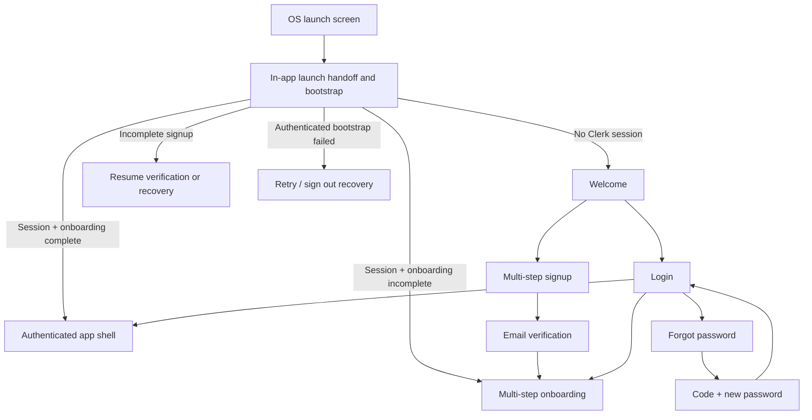

# 35mm React Native Mobile Development Plan

> Canonical plan, progress ledger, and continuation contract for the shared iOS and Android app.
>
> Last updated: 2026-07-23
> Document status: Phase 1 implementation active; Phase 1.8 complete; Phase 1.9 physical iOS verified and physical Android blocked
> Current phase: Phase 1 — workspace, runtime, and design-system foundation
> Next unblocked task: Connect and trust one representative low/mid-range physical Android device, then install and verify the signed Android development build on that hardware

## 1. Document contract

This file is the source of truth for React Native mobile planning and delivery. Every agent working on the mobile app must read this file completely before planning, reviewing, or editing mobile code.

Keep this document current in the same change whenever work affects:

- Completed or active roadmap items.
- Mobile app structure, dependencies, navigation, environment variables, build settings, or release configuration.
- Shared API clients, types, validators, design tokens, or mobile UI primitives.
- Screen behavior, backend readiness, native integration, supported OS versions, or testing requirements.
- Any blocker, decision, migration note, or newly discovered parity gap.

Do not rewrite history. Mark completed checklist items, update the current phase and next task, and append a dated work-log entry. When a decision changes, record both the replacement and the reason in the decision log.

### Status legend

- `[x]` Complete and verified.
- `[ ]` Not started.
- `IN PROGRESS` Actively being implemented; only one roadmap item should carry this label.
- `BLOCKED` Cannot proceed without a named product, backend, vendor, or platform decision.
- `GATED` Deliberately unavailable because its production backend or product scope is not ready.

## 2. Approved decisions

- [x] Build one React Native app for iOS and Android at `apps/mobile`.
- [x] Use Expo and React Native New Architecture/Fabric.
- [x] Preserve `apps/ios` and every related source, project, resource, test, and document.
- [x] Use `apps/web` mobile UI and `apps/ios` as primary product references.
- [x] Make 35mm-controlled UI visually and behaviorally consistent across iOS and Android, following the Twitter/Instagram model.
- [x] Keep platform differences only where the operating system owns behavior or accessibility.
- [x] Support Android 7/API 24 and newer unless a future supported Expo release raises the floor.
- [x] Target current Google Play requirements; baseline as of this document is API 36.
- [x] Retain canonical 35mm REST contracts, IDs, pagination, caching, rate limits, and async counter architecture.
- [x] Use production data only. Missing production dependencies cause a feature to remain gated, not filled with mock data.

### Decision pending before public release

- `BLOCKED` Product/legal approval for minimum signup age and regional age-handling rules. DOB must still be collected and stored privately, but release eligibility cannot rely on an invented client-only policy.
- `BLOCKED` Final production app-store identifiers, signing teams, store accounts, and whether React Native iOS takes over `com.35mm.app` immediately or after parity validation.
- `BLOCKED` Push-notification provider/configuration and production notification routing. In-app notifications can ship independently.

## 3. Required continuation protocol

Every mobile implementation session must follow this order:

1. Read root `AGENTS.md` completely.
2. Read this document completely.
3. Read relevant sections of `docs/architecture.md` and `codebase-analysis-docs/CODEBASE_KNOWLEDGE.md`.
4. Inspect `graphify-out/GRAPH_REPORT.md` and `graphify-out-api/GRAPH_REPORT.md` for the affected web/API area, then verify behavior in source.
5. Inspect both reference implementations for the affected surface:
   - Mobile web under `apps/web`.
   - SwiftUI under `apps/ios/ThirtyFiveMM`.
6. Check `git status` and preserve unrelated user changes.
7. Find the current phase, the next uncompleted item, blockers, and latest work-log entry below.
8. Implement one coherent production-grade slice with tests and documentation.
9. Update this document before finishing:
   - Current phase.
   - Next unblocked task.
   - Roadmap checkboxes.
   - Feature status matrix when affected.
   - Decision or blocker log when affected.
   - Dated work-log entry with verification commands.

If the user requests work outside the next listed item, follow the user’s scope and update this plan to reflect the new ordering.

## 4. Embedded Codex continuation prompt

Copy this prompt into a new Codex task when explicitly resuming React Native work. Root `AGENTS.md` also requires agents to discover and read this document automatically for mobile tasks.

```text
Continue development of the 35mm React Native mobile app for iOS and Android.

Before taking any implementation action, read these files completely:
1. AGENTS.md
2. docs/react-native-mobile-development-plan.md
3. Relevant sections of docs/architecture.md
4. Relevant sections of codebase-analysis-docs/CODEBASE_KNOWLEDGE.md
5. Relevant graph reports in graphify-out and graphify-out-api, followed by direct source verification

Treat docs/react-native-mobile-development-plan.md as the canonical mobile status and handoff document. Identify its current phase, next unblocked task, latest work-log entry, open blockers, and relevant acceptance criteria. Inspect git status and preserve unrelated changes.

Non-negotiable requirements:
- Never delete, rename, replace, or weaken apps/ios or its related files. It remains a product and native-behavior reference.
- Build the shared React Native app under apps/mobile for both iOS and Android.
- Hold every React Native change to the production engineering standard in this plan, benchmarked against mature large-scale consumer mobile teams such as Meta/Instagram, X/Twitter, Airbnb, and Discord. Require measured evidence; brand comparison alone is never acceptance evidence.
- 35mm-controlled UI must look and behave consistently across iOS and Android. Use shared components, tokens, icons, fonts, geometry, and motion. Keep platform-specific code limited to OS integration, accessibility, and measured performance escape hatches.
- Use apps/web mobile UI and apps/ios as reference points. Verify the current source instead of relying only on prose documentation.
- Reuse canonical shared TypeScript types and validators where runtime-safe. Never use TMDB IDs as 35mm identity.
- Keep cursor pagination, denormalized counters, rate limits, idempotency, server-side authorization, soft-delete semantics, cache invalidation, and async worker patterns intact.
- Do not add mock production behavior, placeholder routes, fake data, unbounded queries, OFFSET pagination, N+1 reads, synchronous hot-path counters, silent failures, or client-trusted authorization.
- Use React Query for server state and Zustand only for UI state.
- Preserve exact loading, empty, error, retry, offline, accessibility, and reduced-motion states—not only happy paths.
- Test old and low-memory Android devices from the first vertical slice.

At the start, briefly report the current phase and exact slice being continued. Implement and verify that slice. Before finishing, update docs/react-native-mobile-development-plan.md: progress checkboxes, current phase, next task, blockers/decisions, feature status, and a dated work-log entry listing files changed and verification commands. Update architecture and codebase knowledge docs whenever app structure, contracts, feature wiring, environment variables, or known gaps change.
```

## 5. Product intent and reference hierarchy

35mm mobile is a conversation-first film network: feed, film logging and reviews, comments, profiles, follows, notifications, discovery, lists, watchlists, bookmarks, media, and chat. Mobile interactions must feel immediate, content-led, and intentional without turning into generic platform chrome.

When references conflict, use this order:

1. Server authorization, data integrity, and canonical identity rules in API/database source.
2. Shared response/request contracts in `packages/types` and `packages/validators`.
3. Explicit decisions in this plan.
4. Mobile-web information architecture and cross-platform visual composition.
5. SwiftUI interaction details, gesture behavior, accessibility, native edge cases, and implemented production flows.
6. Platform conventions for OS-owned surfaces.

If web and SwiftUI disagree materially, do not mix them accidentally. Record the selected behavior in the decision log and add parity tests.

### UI parity policy

The following must use the same shared React Native implementation and appearance on iOS and Android:

- Launch-to-app handoff surface after the OS launch screen.
- Welcome, signup, login, verification, password recovery, and onboarding screens.
- Headers, bottom navigation, side drawer, cards, lists, buttons, fields, sheets, dialogs, menus, toasts, badges, tabs, skeletons, empty states, and error states.
- Typography, icons, colors, spacing, radii, shadows, borders, motion timing, and interaction feedback.
- Feed, profile, title, discover, notifications, bookmarks, lists, settings, composer, and chat surfaces.

Platform-specific behavior is allowed only for:

- OS launch-screen implementation.
- Status/navigation bar integration and safe areas.
- Keyboard, text-input services, autofill, and password manager integration.
- Android system back/predictive back and iOS interactive back gestures.
- Permissions, push registration, deep-link registration, app lifecycle, secure storage, and background execution.
- Camera, photo library, document picker, external share targets, and store review surfaces.
- Native modules proven necessary through profiling.
- Accessibility APIs required by VoiceOver or TalkBack.

OS-owned dialogs may differ. 35mm-owned wrappers, previews, labels, ordering, and confirmation steps must remain shared.

### Production engineering standard

All React Native source, native integration, tests, build configuration, and release operations must meet one production-grade quality tier. Target the engineering discipline, reliability, performance, security, accessibility, and product polish expected from mature large-scale consumer mobile organizations such as Meta/Instagram, X/Twitter, Airbnb, and Discord. This benchmark does not claim affiliation or quality through comparison alone; every claim requires repository, test, profiling, device, observability, and rollout evidence.

Non-negotiable requirements:

- No prototype-quality path may enter production source. No fake success, placeholder behavior, mock production data, debug-only control flow, swallowed error, or knowingly incomplete user journey may be presented as complete. If production dependencies are missing, keep the feature explicitly gated or absent.
- Architecture must have clear ownership and stable boundaries. Route files stay thin; feature modules own UI, queries, mutations, adapters, state machines, and tests; platform code stays behind narrow typed interfaces; shared packages remain platform-appropriate and free of dependency leakage.
- Strict TypeScript, runtime validation at trust boundaries, exhaustive state handling, immutable contracts, deterministic behavior, and actionable errors are required. Avoid broad `any`, unchecked casts, ambient mutable singletons, hidden side effects, and duplicated sources of truth.
- Every async flow must define cancellation, timeout, retry, deduplication, idempotency, stale-response protection, offline behavior, background/foreground transitions, process-death recovery, and account-switch/sign-out cleanup where applicable.
- UI must remain responsive under realistic production load. Use bounded virtualization, stable render identities, measured image decoding/caching, deferred heavy modules, off-thread animation where supported, and explicit memory ownership. Release-build profiling on named devices is required for hot paths.
- Every release-sensitive surface must have approved measurable budgets or service-level objectives for startup, interaction latency, frame stability, memory, API failure handling, crash-free sessions, Android ANR, iOS hangs, and update success. Material regression blocks release until fixed or explicitly accepted with documented impact, owner, containment, and rollback.
- Network and server-state code must preserve cursor pagination, bounded reads, cache ownership, explicit invalidation, optimistic rollback, reconnect reconciliation, rate limits, server authorization, soft-delete behavior, and async counter architecture. Mobile convenience never weakens canonical backend guarantees.
- Security and privacy reviews cover token storage, PII/secret redaction, deep links, uploads, permissions, entitlements, local persistence, analytics, crash reporting, screenshots/previews, clipboard exposure, account switching, and dependency supply-chain risk. Client state never serves as authorization evidence.
- Accessibility, localization, RTL, large text, Reduce Motion, screen-reader behavior, keyboard behavior, safe areas, narrow screens, poor networks, and low-memory devices are release requirements, not polish work.
- Tests must cover contracts, state machines, components, accessibility, integration boundaries, critical end-to-end journeys, visual parity, failure recovery, lifecycle changes, and performance regressions in proportion to risk. Flaky tests are defects; bypassing or weakening a gate requires a documented owner and resolution before release.
- Production observability must use structured, privacy-safe diagnostics with release/build/variant context, crash and hang reporting, performance signals, and actionable ownership. Failures must be diagnosable without reproducing them on a developer machine or logging secrets.
- Releases use reproducible builds, reviewed configuration, backward-compatible migrations/contracts, staged rollout, health monitoring, kill/containment controls where appropriate, and a tested rollback path. Native/runtime incompatibility cannot ship through OTA updates.
- Dependencies require maintenance, license, security, New Architecture, OS-floor, binary-size, startup, memory, permission, and privacy review. Unmaintained or incompatible dependencies must be replaced, isolated, or rejected before adoption.
- Reviews evaluate correctness, failure modes, scale, performance, security, privacy, accessibility, operability, tests, and rollback—not only visual output or happy-path behavior. Large or high-risk changes must be split into coherent reviewable slices without lowering end-state quality.

The names above establish ambition and operating discipline; acceptance remains evidence-based. If schedule or dependency constraints prevent this standard, reduce exposed scope or keep the feature gated. Do not silently lower engineering quality.

## 6. Technical baseline

Version baseline was reverified against official Expo, React Native, and Android documentation on 2026-07-22. Expo SDK 57 itself supports iOS 16.4, but the shared app now targets iOS 17.0 because the selected Clerk Expo native SDK requires that floor. The remaining baseline is Expo SDK 57, React Native 0.86, React 19.2.3, Android API 24 minimum, and Android compile/target API 36. SDK 57 requires Node 22.13 or newer and runs only on React Native New Architecture/Fabric; the legacy-architecture app-config switch no longer exists.

| Concern | Planned choice |
|---|---|
| Workspace | `apps/mobile`, package name `@35mm/mobile` |
| Framework | Expo SDK 57 (`expo` 57.0.8 at scaffold) |
| Runtime | React Native 0.86.0, New Architecture/Fabric only |
| React | React 19.2.3, isolated from existing React 18 workspaces through pnpm peer/type resolution |
| Routing | Expo Router 57.0.8 with typed routes; universal/app links remain later-phase work |
| Server state | TanStack React Query v5 |
| UI state | Zustand v5 and local component state |
| Auth | `@clerk/expo` custom flows; no beta prebuilt native auth UI |
| Secure token cache | Expo SecureStore through Clerk-supported token cache |
| Forms | React Hook Form plus shared/new Zod validators where compatible |
| Animation/gestures | React Native Reanimated and Gesture Handler |
| Images | Expo Image or an equivalently maintained native cache, using R2 variants and blurhash |
| Realtime | Ably JavaScript SDK behind typed lifecycle-aware adapters |
| Media uploads | Existing presign API plus direct R2 upload |
| Unit/component tests | Jest 29.7 through `jest-expo` 57.0.2 plus React Native Testing Library 14.0.1 |
| Native end-to-end tests | Maestro flows on fixed iOS simulators and Android emulators/devices |
| Distribution | EAS development/preview/production profiles and store builds |
| OTA updates | Expo Updates with runtime fingerprinting and staged rollout |

### Supported operating systems

- Android minimum: Android 7, API 24.
- Android compile/target baseline: API 36.
- iOS minimum baseline: iOS 17.0, raised from the Expo 16.4 floor for Clerk Expo native SDK compatibility.
- Existing SwiftUI app target remains unchanged unless separately requested.
- Devices below the mobile app floor use the responsive web app.

### Android validation matrix

At minimum, validate:

- API 24: oldest supported behavior and TLS/network compatibility.
- API 26: notification channels and background restrictions.
- API 29: scoped storage transition behavior.
- API 31: modern background and permission behavior.
- API 33: notification permission and media access behavior.
- API 36: target behavior and current Play submission baseline.
- One low-memory physical device representative of older Android hardware.
- One current mid-range device and one current flagship-class device.
- Font scale, display scale, gesture navigation, three-button navigation, RTL, dark theme, and reduced motion.

## 7. Planned repository structure

```txt
apps/mobile/
├── app.config.ts
├── eas.json
├── package.json
├── tsconfig.json
├── assets/
│   ├── fonts/
│   ├── icons/
│   ├── images/
│   └── launch/
└── src/
    ├── app/                    Expo Router route files only
    │   ├── _layout.tsx
    │   ├── (auth)/
    │   ├── (onboarding)/
    │   └── (app)/
    ├── components/             Cross-feature mobile components
    ├── features/               Feature-owned UI, hooks, API adapters, models
    ├── providers/              Clerk, React Query, theme, realtime, app lifecycle
    ├── services/               API, media, storage, updates, observability
    ├── state/                  UI-only Zustand stores
    ├── theme/                  Mobile token adapters and themes
    ├── platform/               Narrow OS-integration boundary
    ├── test/                   Fixtures, render helpers, mocks, assertions
    └── types/                  Mobile-only view types; shared contracts stay in packages

packages/
├── api-client/                 Platform-neutral REST client and errors (Phase 1.7 complete)
├── design-tokens/              React-free brand/theme token source (Phase 1.5 complete)
├── mobile-ui/                  React Native primitives and patterns (Phase 1.6 complete)
├── types/                      Existing canonical contracts
└── validators/                 Existing canonical Zod validation
```

Rules:

- `packages/ui` remains web-oriented and must not be imported into React Native.
- `packages/design-tokens` must contain no React, DOM, UIKit, or Android dependencies.
- `packages/mobile-ui` must not import Next.js, browser globals, Radix, Tailwind DOM utilities, TipTap React UI, or web-only packages.
- `packages/api-client` must accept injected base URL, token provider, fetch implementation, request ID, abort signal, and platform metadata.
- Generated `apps/mobile/ios` and `apps/mobile/android` directories are ignored, untracked, disposable Expo CNG output and are not substitutes for `apps/ios`. Retained native behavior belongs in reviewed app config, explicit config plugins, or native modules outside generated trees. `apps/mobile/NATIVE_GENERATION.md` is the detailed policy and command reference.
- Production and development app identifiers must be distinct. Never install a development build over the shipping SwiftUI app accidentally.

Phase 1.1 implements the workspace/configuration files plus only the root Expo Router layout and index entry needed for native bundle validation. Phase 1.3 adds `eas.json` for isolated internal development/preview profiles and fail-closed variant validation. Phase 1.4 adds enforceable CNG boundaries, config-plugin/autolinking review baselines, safe clean-regeneration commands, and isolated two-variant native generation checks. Phase 1.5 adds React-free `packages/design-tokens` plus source-backed web/Swift theme parity fixtures. Phase 1.6 adds `packages/mobile-ui`, local DM font assets, one cross-platform icon source, shared controls, overlays, toast, skeletons, and explicit state surfaces. Phase 1.7 adds provider composition, services, UI-only state wiring, secure Clerk tokens, bounded query persistence, lifecycle integration, and `packages/api-client`. Phase 1.8 mounts an internal foundation gallery and adds accessibility, Maestro E2E, reviewed PNG visual-diff, and release/device performance-evidence harnesses. No auth, onboarding, authenticated shell, or product feature route exists. Production release profile remains blocked.

## 8. Root application state and routing



Bootstrap must not flash Welcome between session restoration and authenticated routing. Clerk session state, local API bootstrap state, onboarding status, theme hydration, and font readiness are separate states with explicit recovery.

### Planned route groups

```txt
src/app/
├── _layout.tsx
├── index.tsx                         Root state redirect only
├── (auth)/
│   ├── welcome.tsx
│   ├── signup/
│   │   ├── name.tsx
│   │   ├── email.tsx
│   │   ├── password.tsx
│   │   ├── dob.tsx
│   │   └── verify.tsx
│   ├── login.tsx
│   └── password/
│       ├── forgot.tsx
│       ├── verify.tsx
│       ├── reset.tsx
│       └── complete.tsx
├── (onboarding)/
│   ├── role.tsx
│   ├── films.tsx
│   ├── genres.tsx
│   └── people.tsx
└── (app)/
    ├── _layout.tsx                   Shared shell
    ├── (tabs)/
    │   ├── home.tsx
    │   ├── discover.tsx
    │   ├── compose.tsx
    │   ├── notifications.tsx
    │   └── profile.tsx
    ├── post/[postId].tsx
    ├── profile/[username]/...
    ├── title/[catalogTitleId].tsx
    ├── person/[personId].tsx
    ├── lists/...
    ├── bookmarks/...
    ├── chat/...
    ├── settings/...
    ├── reports/...
    ├── contribute/...
    └── legal/...
```

Route filenames may evolve to satisfy Expo Router constraints, but public deep-link identity must remain canonical:

- Profiles use username where current contracts do.
- Posts use canonical post IDs.
- Catalog/title routes use canonical 35mm catalog IDs.
- Film social contracts use `films.id`, never TMDB ID.
- TMDB IDs remain lookup/import metadata only.

## 9. Signed-out and account flows

### 9.1 OS launch screen and in-app launch handoff

Reference assets:

- `apps/ios/ThirtyFiveMM/Resources/Assets.xcassets/LaunchWordmark.imageset`.
- Web and iOS theme/brand assets.

Requirements:

- Static OS-native launch screen with local 35mm wordmark and solid theme-safe background.
- No remote image, API request, JavaScript-driven animation, user content, or personalized state on the OS launch screen.
- In-app handoff must match its geometry and color closely enough to avoid a visible jump.
- Load fonts, persisted theme, Clerk session, and bootstrap prerequisites in parallel.
- Do not add an artificial minimum delay. Transition as soon as destination is known and first frame is ready.
- Respect Reduce Motion. Any handoff animation must fade or resolve immediately.
- If authenticated bootstrap fails, show retry/sign-out recovery; do not misroute to Welcome.
- Measure launch-to-usable time on the Android matrix and supported iOS versions.

### 9.2 Welcome screen

Primary references:

- `apps/ios/ThirtyFiveMM/Features/Intro/IntroView.swift`.
- `apps/ios/ThirtyFiveMM/Features/Intro/WelcomeHeroView.swift`.
- Mobile web auth branding and `apps/web/PRODUCT.md`.

Required content:

- Locally bundled cinematic hero artwork.
- 35mm wordmark and concise value proposition.
- Primary “Start your journey” action.
- Secondary “Log in” action.
- Terms and privacy links near account creation.
- No authenticated API reads or remote artwork before action.
- Same layout, typography, assets, and motion across platforms, adjusted only for safe area and usable height.

### 9.3 Multi-step signup

Signup collects the requested fields as discrete, resumable visual steps:

1. **Name**
   - Full/display name.
   - Username in the same step because 35mm identity requires it and current Clerk/API bootstrap expects it.
   - Debounced username availability check with stale-response protection.
   - Availability failure must not silently report “available.”
2. **Email**
   - Email normalization and Clerk-supported validation.
   - Correct keyboard, autofill, return key, and error announcement.
3. **Password**
   - Password and confirmation.
   - Visibility controls with accessible state labels.
   - Clerk password requirements surfaced before submission where available.
   - Password must never be written to AsyncStorage, logs, analytics, crash breadcrumbs, or the progress ledger.
4. **Date of birth**
   - Locale-friendly date input presented identically across platforms through a shared 35mm surface.
   - Persist canonical `YYYY-MM-DD` only after verification/authentication through the protected profile API.
   - Reject impossible and future dates on both client and server.
   - Final minimum-age behavior remains release-blocked until approved; server is authoritative.
   - DOB remains private and must never appear on public profile payloads.
5. **Email verification completion**
   - Six-digit code, resend cooldown, change-email path, paste support, and expired-code recovery.
   - Verification is part of signup completion even though it is not a profile-data step.

Implementation notes:

- Current web signup is one page and does not capture DOB.
- Current SwiftUI signup has identity, credentials, and verification steps but does not capture DOB.
- Current profile API supports `dateOfBirth`, validates date format, and returns it only to the owner; it does not enforce age policy.
- Signup must retain non-secret draft fields through navigation and ordinary process recreation. Password fields remain memory-only and must be re-entered after process death.
- After email verification: activate Clerk session, bootstrap `/v1/me`, persist DOB through authorized `PATCH /v1/profiles/me`, confirm onboarding status, then route to onboarding.
- If DOB persistence fails after account creation, keep user inside an explicit retryable completion state. Do not mark signup complete and lose the value.
- Back navigation preserves completed non-secret values. Double submission must be prevented.

### 9.4 Login

Requirements:

- Username-or-email identifier and password.
- Password visibility, autofill, password-manager, hardware-keyboard, and submit-key support.
- Clerk multi-factor/session-task handling when required.
- Safe deep-link return destination validation.
- Already-authenticated handling without duplicate session creation.
- Loading state disables duplicate submission while preserving field visibility.
- Inline field errors plus one accessible form-level error.
- Links to password recovery and account creation.

### 9.5 Forgot and reset password

Required route sequence:

1. Enter email.
2. Send Clerk reset code.
3. Enter/paste code with resend cooldown and expiry handling.
4. Enter and confirm new password.
5. Complete Clerk reset/session handling.
6. Show success state and route safely to login or activated session according to Clerk result.

Requirements:

- Same screens and state machine on iOS and Android.
- Do not reveal whether an account exists beyond Clerk’s approved response semantics.
- Passwords and codes remain memory-only.
- Network interruption preserves safe non-secret progress and offers retry.
- Cover invalid, expired, reused, and throttled codes.
- Replace the unwired SwiftUI forgot-password reference with the production Clerk flow in React Native; never copy its unresolved action.

## 10. New-user onboarding

Onboarding begins only after verified authentication and successful local-user bootstrap.

Canonical steps:

1. **Role and context**
   - Cinephile, creator, critic, film student, or industry.
   - Optional short context for non-cinephile roles.
2. **Favorite films**
   - Search and select up to five.
   - TMDB may power cold-start lookup only through existing cached/rate-limited paths.
   - Resolve selections to canonical 35mm IDs before final submit.
3. **Favorite genres**
   - Select up to ten canonical genre identifiers.
4. **People to follow**
   - Bounded production suggestions.
   - Select up to twenty users.
   - Follow all, individual toggle, retry, empty state, and skip.

Behavior:

- Shared progress indicator, back navigation, and step transitions.
- Role is required; optional steps show explicit skip language.
- Draft persists locally using a versioned schema. No password, auth token, or private remote response belongs in the onboarding draft.
- Suggestions load only when needed and never fetch unbounded pages.
- Film search is debounced, cancellable, deduplicated, and stale-response safe.
- Final submission uses existing `/v1/me/onboarding` contract, server authorization, transaction behavior, and idempotent follow facts.
- Successful completion invalidates onboarding status, current profile, suggestions, feed, and relevant settings queries explicitly.
- Failed completion stays retryable without replaying already durable facts incorrectly.
- Sign-out is available without leaving a half-authenticated shell.

Reference choice:

- Use mobile web for complete step content because it includes favorite films.
- Use SwiftUI for touch presentation, progression, recovery, and accessibility details.
- React Native result becomes one shared visual implementation across both platforms.

## 11. Loading and skeleton system

Create one tokenized skeleton system in `packages/mobile-ui`; do not create unrelated shimmer implementations per feature.

Core primitives:

- `SkeletonBlock`.
- `SkeletonText`.
- `SkeletonAvatar`.
- `SkeletonPoster`.
- `SkeletonMedia`.
- `SkeletonRow`.
- Screen-specific compositions using these primitives.

Behavior rules:

- Skeleton geometry must match loaded content closely to minimize layout shift.
- Animation uses shared timing/colors and stops under Reduce Motion.
- Shimmer or pulse must not create continuous heavy GPU/CPU work on low-end Android.
- Skeleton elements are hidden from VoiceOver/TalkBack; one screen-level loading announcement is sufficient.
- Initial load may use a full skeleton.
- Pull-to-refresh keeps existing content visible with refresh affordance.
- Next-page loading uses bounded footer/row placeholders, not a full-screen reset.
- Cached stale content stays visible during background revalidation.
- Loading, empty, offline, permission-denied, private, deleted, and error states are distinct.
- Every recoverable error includes a real retry path.

Required skeleton compositions:

- Launch/bootstrap handoff.
- Home feed and post card variants.
- Post detail and comments.
- Profile header, tabs, posts, lists, diary, and stats.
- Discover hero, poster shelves, search results, and title detail.
- Bookmarks and bookmark folders.
- Lists, list details, watchlists, and entries.
- Notifications and follow requests.
- Chat inbox, thread history, attachment thumbnails, and typing/reconnect states.
- Settings/profile bootstrap rows where content depends on server data.
- People suggestions and onboarding film search.

Primary references include web feed/discover/bookmark/comment skeletons and SwiftUI notifications/discover/title/chat skeletons.

## 12. Authenticated shell and shared navigation

Canonical five-item bottom navigation, taken from current mobile web and rendered identically on both platforms:

1. Home.
2. Discover.
3. Create.
4. Notifications.
5. Profile.

Shell requirements:

- Shared custom 35mm bottom bar; do not use visually divergent system tab bars.
- Shared custom icons; do not pair SF Symbols with Material icons.
- Create opens composer without losing selected tab history.
- Notification badge is capped visually at `99+` and announced accessibly.
- Independent navigation history per durable tab where practical.
- Re-select active tab scrolls to top; repeated re-select may refresh only when product rules permit.
- Bottom chrome hides/restores using the same scroll policy on both platforms and respects Reduce Motion.
- Keyboard, safe-area, and Android navigation-mode changes cannot cover actionable content.

Canonical mobile header:

- Profile avatar opens the shared side drawer.
- Center uses wordmark or contextual title.
- Search and chat actions appear on applicable root screens.
- Detail screens use shared back/title/actions layout.
- Profile scroll may switch to compact username header without changing tab geometry.

Canonical side drawer:

- Profile identity, username, follower/following counts.
- Profile, Discover, Short Films, Bookmarks, Lists, Diary, Drafts.
- Divider.
- Chat, Notifications, Settings and privacy, Help.
- Route entries whose production feature is gated show no fake content. Hide them or present an explicit product-approved unavailable state.
- Opening drawer shifts/dims the complete app surface consistently, traps accessibility focus, closes on backdrop/back/Escape-equivalent, and restores focus.

## 13. Feature delivery matrix

| Domain | Planned mobile scope | Primary references | Backend readiness | Phase |
|---|---|---|---|---:|
| Auth | Launch, Welcome, signup, verify, login, MFA, forgot/reset | Web auth + SwiftUI Intro/Auth | Clerk wired; DOB signup bridge needed | 2 |
| Onboarding | Role, films, genres, people | Web complete flow + SwiftUI coordinator | Wired | 3 |
| Shell | Header, five tabs, drawer, deep links | Mobile web shell + SwiftUI shell | Client-only | 4 |
| Feed | Home feed, refresh, cursor paging, repost proof, quotes, polls, media/link cards | Web feed + SwiftUI Feed | Wired | 4 |
| Composer | Text/log/review, canonical film selection, media, poll, quote, edit | Web composer + SwiftUI composer | Wired; rich-text parity required | 4 |
| Post detail | Complete body, comments, replies, likes, media viewer, share | Web + SwiftUI Post | Wired | 4 |
| Profiles | Public/own profile, edit, media, follow state, connections | Web + SwiftUI Profile | Wired | 5 |
| Profile tabs | Posts, Reposts, Diary, Lists, Stats | Web + SwiftUI Profile | Wired, cursor/cached stats | 5 |
| Social graph | Follow requests, followers/following, block, mute | Web profile/notifications + API | Wired | 5 |
| Discover | Search, shelves, filters, canonical resolution | Web Discover + SwiftUI Discover | Mixed TMDB/catalog; audit required | 6 |
| Titles/people | Title detail, reviews, cast/crew, watchlist, person detail | Web Title + SwiftUI Title | Catalog wired; identity audit required | 6 |
| Bookmarks | All, unsorted, folders, move/remove, loaded-page search | Web + SwiftUI Bookmarks | Wired | 7 |
| Lists/watchlists | List CRUD, entries, reorder, like, clone, watchlist state | Web Lists + API | Wired | 7 |
| Notifications | List, bundles, unread, mark read/unread, follow requests, realtime | Web + SwiftUI Notifications | Wired in-app; push blocked | 8 |
| Chat | Inbox, thread, messages, reactions, edit/delete, media, typing, presence | Web + SwiftUI Chat | Keyspaces/Ably path wired; verify environment | 9 |
| Settings | Account, privacy, notifications, appearance, media, data/security | Web + SwiftUI Settings | Mostly wired | 10 |
| Moderation | Report content, report history/detail, block/mute safety paths | Web Moderation + API | Wired | 10 |
| Contributions | Hub, forms, submission status | Web Contribute + API | Wired; scope after core mobile | 10 |
| Suggestions | People discovery and follow actions | Web Suggestions + API | Wired | 10 |
| Sharing/deep links | Posts, profiles, titles, lists, auth returns | Web + SwiftUI share/navigation | Routes exist; app links required | 10 |
| Help/legal | Help, terms, privacy, about | Web legal routes | Wired as web content; native presentation decision | 10 |
| Push notifications | Permission, token registration, routing, badges | Planned | `GATED` pending provider/backend | 11 |
| Short films/video | Browse, detail, upload/playback | Web future surfaces | `GATED`; Cloudflare Stream absent | Later product phase |
| Communities | Community discovery/detail/feed | Web future surfaces | `GATED`; mock-heavy | Later product phase |
| Festivals | Festival discovery/detail | Web future surfaces | `GATED`; mock-heavy | Later product phase |
| Letterboxd import | File import and status | Web local workflow | Scope/contract review required | Later product phase |

Backend readiness must be verified again when each phase starts. Documentation can lag source; route tests and implementation are authoritative.

## 14. Data, networking, and state architecture

### API client

One mobile API client must provide:

- Configured API base URL with no production localhost fallback.
- Clerk bearer-token injection.
- Standard `{ code, message }` error decoding.
- Request IDs and structured diagnostic context without PII/secrets.
- Abort/cancellation support tied to screen/query lifecycle.
- Explicit timeouts by request class.
- Safe retry rules: reads may retry with bounded backoff; mutations retry only when idempotency semantics make replay safe.
- Idempotency-key support for client-originated mutations requiring it.
- Network/offline classification distinct from server errors.
- JSON decoding validation at trust boundaries for high-risk contracts.
- No swallowed errors or success substitution after request failure.

### React Query

- Server state lives in React Query.
- Every feature owns a typed query-key factory aligned with web conventions.
- Infinite queries use server cursors and preserve page boundaries.
- Optimistic likes, bookmarks, reposts, follows, poll votes, read state, and similar actions must snapshot, reconcile, and roll back explicitly.
- Realtime events patch/invalidate the same canonical caches; they do not create a second source of truth.
- Persist only approved bounded queries with a versioned cache buster and user/session namespace.
- Clear user-scoped persisted cache on sign-out/account switch.
- Sensitive chat/profile/account data requires an explicit persistence policy before disk caching.

### Zustand

Zustand is limited to UI state such as:

- Composer presentation and draft UI metadata.
- Drawer state.
- Bottom chrome visibility.
- Toasts and transient modal coordination.
- Local media-picker workflow state.

Do not mirror profiles, feeds, notifications, settings, lists, chat threads, or other server-owned entities into Zustand.

### Realtime

- One lifecycle-aware Ably connection layer.
- Subscribe only when authenticated and foreground/feature policy allows.
- Deduplicate events by durable identifiers/version fields.
- Reconcile on reconnect using bounded REST reads.
- Notification and chat adapters remain feature-specific above shared transport.
- Missing Ably configuration must surface as an intentional environment capability state; polling/reconnect fallback must be bounded.

### Media

- Use existing authorized presign endpoint and direct R2 PUT.
- Validate size/type/dimensions before upload where possible; server remains authoritative.
- Use processed variants and blurhash to avoid decoding full originals in scrolling lists.
- Upload state supports progress, cancellation, retry, and explicit failure.
- Clean local previews when discarded or completed.
- Never embed binary uploads through the Hono request body when direct upload is available.

### Rich content

- Render shared TipTap-compatible document payloads with a bounded native renderer; do not use a WebView for feed cards.
- Sanitize/validate marks, links, mentions, and unsupported nodes.
- Preserve canonical mention/user and film identity.
- Composer must emit payloads accepted by shared validators and fixture tests.
- Full composer parity is a Phase 4 exit condition; no reduced production payload may silently replace supported web/iOS behavior.

## 15. Design system

### Tokens

Create React-free shared tokens covering:

- Brand accent `#c2473a` and semantic action colors.
- Every existing theme: auto, light, dark, matinee, matrix, oppenheimer-bw, barbie.
- Surface, elevated, sunken, border, strong-border, text, secondary-text, destructive, success, and focus colors.
- 4-point spacing scale.
- Corner-radius and sheet geometry.
- Avatar, icon, touch-target, poster, and media sizes.
- Typography roles and line heights.
- Motion durations/easings and Reduce Motion substitutions.
- Elevation/shadow recipes calibrated to look equivalent on both platforms.

### Typography

- Bundle DM Serif Display, DM Sans, and DM Mono assets where licensing/assets permit.
- Use the same font files and weights on iOS and Android.
- Provide semantic roles rather than screen-local numeric font declarations.
- Respect Dynamic Type/font scale without clipping or hiding controls.
- Establish maximum scaling/layout fallbacks only when required to preserve action access, never to suppress accessibility.

### Icons

- Use one shared SVG/icon source for all 35mm-controlled UI.
- Active/inactive variants must be intentionally designed.
- Icons need accessible labels when not accompanied by visible text.
- Platform system symbols may appear only inside OS-owned surfaces or narrow platform integration.

### Core components

Foundation must cover at least:

- Screen/container/safe-area primitives.
- App text and icon.
- Button, icon button, link button, destructive action.
- Text field, password field, date field, search field, code field, text area.
- Avatar, poster, remote image, blurhash placeholder.
- Header, bottom tab bar, drawer, segmented tabs.
- Card, divider, badge, chip, counter.
- Action sheet, modal, confirmation dialog, toast.
- Skeleton primitives and screen states.
- Refresh/pagination affordances.
- Media grid/viewer and branded share preview.

Every primitive requires light/dark/custom-theme, disabled, pressed, focused, loading, error, RTL, large-text, and Reduce Motion coverage where applicable.

## 16. Performance and scale requirements

React Native does not change backend scale rules. Mobile adds another high-volume client, so it must reuse existing cacheable, cursor-paged, denormalized contracts rather than multiply reads.

### Client performance rules

- Use recycler-backed virtualized lists appropriate for variable-height social cards and chat rows.
- Never render an unbounded feed, comments tree, notifications list, chat history, cast list, followers list, or search result set.
- Preserve server cursor sizes; do not increase limits to compensate for client design.
- Keep `PostCard` and other hot rows memoized with stable props/callbacks.
- Avoid new object/style creation in hot render paths when profiling shows churn.
- Decode images at rendered dimensions and use bounded memory/disk caches.
- Defer heavy composer, GIF/emoji, media editor, and film-search modules until invoked.
- Keep animations off the JavaScript thread where supported.
- Bound body parsing, URL detection, rich-text normalization, color extraction, and deduplication per loaded item/page.
- Profile release builds; development-mode timings are not release evidence.

### Performance gates

Phase 1 establishes reproducible cold/warm launch, memory, frame, and bundle baselines on named devices. Each later phase must avoid material regression. Before store release, define and record approved thresholds for:

- OS launch to first rendered app frame.
- Launch to usable signed-out and signed-in destinations.
- Feed first-content render.
- Feed scroll frame stability.
- Composer open and keyboard latency.
- Peak memory after extended feed/media use.
- Chat thread open, history prepend, and newest-message delivery.
- Android ANR and iOS hang rates.
- Crash-free sessions.
- OTA update success and rollback.

Any threshold change requires a measured explanation in the work log.

### 1M+ DAU assumptions

- Home/feed/profile/list reads remain bounded cursor queries and use existing server caches/indexes.
- Denormalized counters stay server-owned and update through existing async jobs.
- Mobile optimistic UI does not create extra reconciliation writes beyond necessary facts.
- Images and media flow through CDN/R2 variants, not API proxy bodies.
- Realtime reconnect uses bounded reconciliation, not full-history replay.
- No new database index is required merely to add a client. Any new route/filter must document and add its index in the same cross-layer change.

## 17. Accessibility, localization, and resilience

Accessibility is part of parity, not a platform exception.

- WCAG AA color/contrast intent across every theme.
- VoiceOver and TalkBack labels, roles, state, order, announcements, and modal focus containment.
- Minimum 44-point/44-dp actionable targets unless a larger target is required.
- Dynamic Type/Android font scale, display zoom, narrow devices, split-screen where supported, and landscape keyboard use.
- Reduce Motion disables or simplifies spatial transitions, shimmer, parallax, autoplay, and drawer motion.
- Meaning never depends only on color.
- RTL layout and gestures are tested; directional icons/animations mirror correctly.
- Long names, usernames, translated labels, missing media, deleted content, private content, and unavailable services remain usable.
- Offline and poor-network states preserve readable cached content where policy allows.
- App resume, background, killed-process restoration, account switching, and expired sessions have explicit state transitions.

User-visible copy must be ready for localization: no string concatenation that prevents reordering, no UI logic based on English text, and no hardcoded locale-sensitive dates/numbers.

## 18. Security and privacy

- Clerk/API authorization remains server-enforced.
- Tokens use Clerk-supported secure storage and never appear in logs.
- Passwords, reset codes, verification codes, DOB, private settings, and signed URLs are excluded from analytics/crash breadcrumbs.
- DOB remains owner-only and is not used as a public social field.
- Validate deep links and redirect targets against an allowlist of internal routes.
- Validate uploaded type/size locally for UX and on server for security.
- Clear user-scoped caches, realtime subscriptions, in-memory drafts, and media previews on sign-out/account change.
- Do not trust optimistic state as authorization evidence.
- Do not render unsanitized rich HTML or open arbitrary URLs without scheme/domain safety handling.
- Mobile app secrets are public by nature; only publishable/configuration values may be bundled. Server secrets remain server-side.

## 19. Testing strategy

### Contract and unit tests

- Shared type/validator fixture compatibility.
- API error decoding and auth headers.
- Cursor extraction, next-page behavior, deduplication, and cancellation.
- Query-key factories and optimistic rollback.
- Date/DOB parsing without timezone shifts.
- Rich-text/mention/link parsing.
- Deep-link parsing and canonical ID routing.
- Theme/token resolution.
- Onboarding draft version/migration.
- Realtime deduplication and reconnect reconciliation.

### Component tests

- Every design-system state.
- Auth step validation and navigation.
- Signup process restoration without password persistence.
- Skeleton/loading/empty/error/offline transitions.
- Feed interactions and counter reconciliation.
- Profile follow/request/block/mute states.
- Composer payload construction.
- Accessibility roles, names, values, and focus order.

### End-to-end tests

Critical Maestro flows:

1. Fresh launch → Welcome → signup → verification → DOB persistence → onboarding → Home.
2. Login → authenticated bootstrap → Home.
3. Forgot password → code → reset → login.
4. Feed page → interact → post detail → comments → profile.
5. Create/edit/soft-delete post with media and film identity.
6. Discover → canonical title → reviews/watchlist.
7. Follow request/private profile/block/mute/report.
8. Bookmark folders and list/watchlist operations.
9. Notifications realtime/read state and follow requests.
10. Chat send/retry/edit/delete/reaction/media/reconnect.
11. Theme, large text, RTL, Reduce Motion, offline/recovery.
12. Deep links from cold and warm app states.

### Visual regression

- Fixed iOS simulator and Android emulator configurations.
- Golden screenshots for every foundation component and critical screen/state.
- Same content fixtures, locale, font scale, theme, clock, and image assets on both platforms.
- Compare each platform against approved design goldens and compare platform pairs for 35mm-controlled surfaces.
- Mask only true OS-owned variability such as status-bar indicators.
- No baseline update without reviewed visual intent.

### Performance tests

- Release-mode launch benchmark.
- Long feed with mixed post/media/poll/quote shapes.
- Large comment tree within three-level limit.
- Long profile/list/bookmark/notification pagination.
- Chat history prepend and live insert.
- Low-memory background/foreground and process recreation.
- Upload cancellation/retry and image-cache pressure.

## 20. Build, release, and operations

Configured and planned build profiles:

- Development: internal development-client profile, EAS `development` environment, `35mm Dev`, `thirtyfivemm-dev`, and `com.thirtyfivemm.mobile.dev`. Runtime requires explicit `EXPO_PUBLIC_API_URL` and `EXPO_PUBLIC_CLERK_PUBLISHABLE_KEY`; missing or invalid values fail closed at the root recovery boundary.
- Preview: internal distribution profile, EAS `preview` environment, `35mm Preview`, `thirtyfivemm-preview`, and `com.thirtyfivemm.mobile.preview`. Staging services and update channel remain later wiring.
- Production: `BLOCKED` pending store identifier, signing, and migration-sequencing decisions; no profile or guessed native identity exists.

Release requirements:

- `expo-doctor`, TypeScript, lint, unit/component tests, E2E critical flows, visual diff, and platform build must pass.
- Environment validation fails builds with missing required production values.
- OTA updates use runtime fingerprinting so JavaScript never targets incompatible native code.
- OTA rolls out to a small cohort, monitors crash/startup/error signals, then expands.
- Native dependency/config changes receive new store binaries.
- Store privacy labels/data-safety forms include auth, DOB, analytics, media, notifications, and chat accurately.
- Release notes and rollback owner are identified.
- SwiftUI production app remains recoverable until React Native iOS parity and rollout criteria pass.

## 21. Phased roadmap

### Phase 0 — Plan and repository contract

- [x] Approve React Native/Expo direction.
- [x] Approve one visually consistent iOS/Android UI.
- [x] Preserve SwiftUI app as reference and fallback.
- [x] Inventory web, SwiftUI, API, graph, and documentation surfaces.
- [x] Create this canonical plan and embedded continuation prompt.
- [x] Add repository-agent requirement to read and maintain this plan.
- [x] Link architecture and codebase knowledge documents to this plan.

Exit criterion: future mobile sessions automatically discover one current plan and next task.

### Phase 1 — Workspace, runtime, and design-system foundation

- [x] **1.1** Scaffold `apps/mobile` with verified current stable Expo SDK, pnpm workspace support, strict TypeScript, Expo Router, and New Architecture.
- [x] **1.2** Add root mobile scripts and CI-aware typecheck/lint/test commands.
- [x] **1.3** Configure distinct development/preview identifiers, schemes, and environment validation.
- [x] **1.4** Establish generated native-directory/config-plugin policy without touching `apps/ios`.
- [x] **1.5** Create `packages/design-tokens` and theme parity fixtures.
- [x] **1.6** Create `packages/mobile-ui` primitives, icons, fonts, sheets, modals, toast, skeletons, and state surfaces.
- [x] **1.7** Configure React Query, persisted cache policy, Zustand UI boundary, Clerk provider/token cache, API client, app lifecycle, and error boundary.
- [x] **1.8** Add baseline accessibility, visual-regression, E2E, and performance harnesses.
- [ ] **1.9** Produce signed development builds on one physical iOS and one low/mid-range Android device. **IN PROGRESS / BLOCKED:** physical iOS is verified. The development-identity Release app embeds `main.jsbundle`, retains the generated `ExpoModulesProvider`, embeds a valid Expo Constants `app.config`, is strictly signed for `com.thirtyfivemm.mobile.dev`, installs on the connected iPhone 13 Pro, visibly renders the Foundation gallery, and remains alive with clean startup logs. The Debug null-bundle path is not used. Explicit bootstrap loading remains as fail-visible protection. No physical Android device is available; Android emulator build/smoke pass, but representative hardware evidence is still required.

Exit criterion: themed component gallery and bootstrap shell render identically, pass tests, and establish performance baselines on both platforms.

### Phase 2 — Launch, Welcome, and account lifecycle

- [ ] OS launch screens and in-app handoff.
- [ ] Root auth/bootstrap state machine with retry/sign-out recovery.
- [ ] Welcome screen.
- [ ] Signup Name/username step.
- [ ] Signup Email step.
- [ ] Signup Password step.
- [ ] Signup DOB step and secure post-verification persistence.
- [ ] Email verification/resend/change-email flow.
- [ ] Login and Clerk session-task/MFA handling.
- [ ] Forgot password, reset code, new password, and completion flows.
- [ ] Auth process-death, offline, throttling, expiry, accessibility, and visual tests.
- [ ] Cross-layer DOB validation/privacy tests and documented release-age-policy blocker.

Exit criterion: every signed-out/account path works end-to-end with production Clerk/API behavior and no fake success path.

### Phase 3 — New-user onboarding

- [ ] Authenticated onboarding gate and local draft schema.
- [ ] Role/context step.
- [ ] Favorite-film search/selection and canonical resolution.
- [ ] Genre selection.
- [ ] Follow suggestions.
- [ ] Transactional completion, explicit cache invalidation, retry, skip, and sign-out.
- [ ] Onboarding skeletons, empty/error/offline states, accessibility, E2E, and visual parity.

Exit criterion: verified new account reaches a populated Home shell through existing production onboarding contracts.

### Phase 4 — Authenticated shell and feed vertical slice

- [ ] Five-tab custom bottom navigation.
- [ ] Shared header, scroll chrome, drawer, and deep-link shell.
- [ ] Home feed with cursor pagination, refresh, skeletons, cache, and retry.
- [ ] Post cards: text, log/review, media, polls, links/video, repost proof, quotes, tombstones.
- [ ] Optimistic likes, reposts, bookmarks, poll votes, and rollback.
- [ ] Post detail, bounded comments/replies, comment likes, media viewer, and share.
- [ ] Composer create/edit with film identity, media upload, polls, quote, rich mentions/links, visibility, and idempotency.
- [ ] Feed virtualization and low-end Android performance gates.

Exit criterion: one production-complete vertical slice from launch through authoring and interaction passes iOS/Android parity, E2E, accessibility, and performance gates.

### Phase 5 — Profiles and social graph

- [ ] Profile header and Posts/Reposts/Diary/Lists/Stats tabs.
- [ ] Own-profile edit, explicit-null clearing, avatar/cover upload, and media viewer.
- [ ] Follow/unfollow/request/cancel/approve flows.
- [ ] Followers/following lists with cursor pagination.
- [ ] Block, mute, share, and report actions.
- [ ] Profile tab lazy loading, deduplication, skeletons, and performance.

Exit criterion: all existing production profile/social contracts work without N+1 reads or mixed query caches.

### Phase 6 — Discover, catalog, titles, and people

- [ ] Discover search, heroes, shelves, filters, and skeletons.
- [ ] Canonical TMDB-to-catalog resolution before navigation.
- [ ] Title detail, metadata, media, reviews, watchlist actions, and share.
- [ ] Cursor-paged cast/crew and reviews.
- [ ] Person detail and credits.
- [ ] Composer/title/discover identity audit against canonical 35mm IDs.

Exit criterion: no app route or social API contract treats TMDB ID as canonical identity.

### Phase 7 — Bookmarks, lists, and watchlists

- [ ] Bookmark All/Unsorted/folder screens and folder CRUD.
- [ ] Bookmark move/remove and bounded loaded-page search.
- [ ] Public/private lists, create/edit, entries, reorder, notes, likes, and clone.
- [ ] Watchlist state and title integrations.
- [ ] Cursor, denormalized count, optimistic rollback, skeleton, and visual tests.

Exit criterion: collection workflows preserve existing indexes, counters, authorization, and pagination.

### Phase 8 — Notifications and follow requests

- [ ] Notification list, bundles, thumbnails, unread badge, mark read/unread.
- [ ] Follow-request summary and management.
- [ ] Ably lifecycle/reconnect reconciliation and bounded fallback.
- [ ] Notification deep links.
- [ ] Skeleton, empty/error/offline, accessibility, and E2E coverage.

Exit criterion: in-app activity remains consistent after realtime disconnect/reconnect and process resume.

### Phase 9 — Chat

- [ ] Inbox, archive/mute/delete, presence, typing, and thread creation.
- [ ] Thread history with `before` cursor, live insert, reconnect reconciliation, and read state.
- [ ] Text, reply, reaction, edit/delete, image/GIF/file/link rendering.
- [ ] Composer, presigned media upload, retry, typing throttle, and foreground read dispatch.
- [ ] Low-end Android keyboard/list/media performance and process restoration.

Exit criterion: production persistence and realtime paths pass durable-state, reconnect, optimistic-failure, and privacy tests.

### Phase 10 — Settings, safety, contributions, and secondary routes

- [ ] Account, privacy, notifications, appearance, media, and data/security settings.
- [ ] Theme/accent parity and no launch/theme flash.
- [ ] Report content, report history/detail, block/mute safety surfaces.
- [ ] Contribution hub/forms/submissions where mobile product scope approves.
- [ ] Suggestions, Help, legal, app information, and account lifecycle actions.
- [ ] Branded sharing and universal/app links across supported entities.

Exit criterion: every exposed drawer/tab/settings destination has production behavior, an explicit gate, or is absent.

### Phase 11 — Push, hardening, stores, and migration readiness

- [ ] Resolve push provider/backend and implement token lifecycle, permissions, channels/categories, routing, and badge reconciliation.
- [ ] Complete device/API/iOS matrix, accessibility audit, localization audit, privacy review, and security review.
- [ ] Meet approved startup, memory, frame, ANR/hang, and crash-free gates.
- [ ] Validate EAS builds, OTA runtime fingerprinting, rollout, rollback, signing, store metadata, and data-safety declarations.
- [ ] Run React Native iOS vs SwiftUI parity review.
- [ ] Decide production bundle-ID takeover and staged migration while preserving `apps/ios` source.

Exit criterion: signed store candidates pass production readiness and rollback requirements on both platforms.

## 22. Definition of done for every mobile slice

A slice is not complete until:

1. Production source is implemented without fake data or silent fallback.
2. Loading, loaded, empty, offline, unauthorized/private, deleted, error, retry, and pagination states relevant to the slice exist.
3. iOS and Android use shared 35mm UI and pass reviewed visual parity.
4. Accessibility and Reduce Motion behavior are tested.
5. Old/low-memory Android impact is measured for hot surfaces.
6. Shared contracts, validators, API routes, authorization, rate limits, idempotency, soft-delete behavior, cache invalidation, worker effects, and indexes remain aligned.
7. Unit/component tests and relevant E2E flows pass.
8. Architecture/codebase docs are updated when structure, wiring, contracts, environment, or known gaps changed.
9. This plan’s status, next task, blockers, and work log are updated.
10. Verification commands and any unverified platform/device are reported explicitly.
11. Evidence demonstrates compliance with the production engineering standard above, including relevant performance, resilience, security/privacy, accessibility, observability, release, and rollback requirements.

## 23. Current status snapshot

| Area | Status |
|---|---|
| Product direction | Complete |
| Canonical plan | Complete |
| Agent auto-discovery contract | Complete |
| `apps/mobile` workspace | Phase 1.8 complete: Expo SDK 57 scaffold, deterministic checks, isolated development/preview profiles, enforceable CNG policy, shared tokens/UI, provider bootstrap, state/cache boundaries, Clerk secure token wiring, lifecycle integration, API transport, and quality harnesses |
| Mobile unit/integration tests | Jest/`jest-expo` and React Native Testing Library wired; 43 mobile cases cover root/Router/config/UI, provider composition, token-to-transport injection, runtime validation, state/lifecycle/retry boundaries, cache allowlisting/account cleanup, error recovery, deterministic foundation accessibility/state transitions, explicit bootstrap loading, variant-specific Apple Sign-In capability, and recent-bundle auto-launch preference; 29 token invariants and 6 API-client cases run in package checks |
| Shared mobile design system | Token/theme foundation, `packages/mobile-ui`, local font loading, safe-area/theme/toast provider composition, and persisted theme preference are complete |
| Native quality harnesses | Deterministic internal gallery, Maestro smoke/screenshot flows, fixed iOS/Android visual profiles, fail-closed PNG comparison, and measured release-performance result validation are wired; the development-client Maestro smoke flow passes on the Pixel 6/API 36 emulator. Device syslog and LLDB corrected the iOS black-screen diagnosis to a stripped generated Expo module provider, then exposed an empty Expo Constants bundle caused by an upstream unquoted path. The corrected Release binary retains the provider, embeds valid Expo config, visibly renders the gallery on the connected iPhone 13 Pro, remains alive, and emits none of the prior fatal signatures. Maestro 2.7.0 does not support local physical-iOS execution. Reviewed fixed-profile baselines and release-performance evidence remain unclaimed |
| Auth/onboarding implementation | Not started |
| Authenticated feature implementation | Not started |
| Native builds | Native config, iOS/Android Hermes bundles, and isolated two-variant CNG output at Android API 24/36 and iOS 17.0 verified. Development omits Sign in with Apple for Personal Team provisioning and disables recent-bundle auto-launch; preview retains Apple Sign-In. CocoaPods, JDK 17, Android Studio/SDK/ADB/emulator, Maestro, and EAS CLI are installed; a Pixel 6/API 36 AVD exists; the Android development debug binary builds, installs, bundles through Metro, and passes Maestro smoke. The `com.thirtyfivemm.mobile.dev` Release app now embeds Hermes plus valid Expo Constants config, retains the generated Expo provider, passes strict signing checks, installs, launches, visibly renders, and survives sustained checks on the connected iPhone 13 Pro. The root supplies an explicit loading surface during Clerk, query-scope, or font bootstrap and does not block routes on theme hydration. Repository paths containing spaces are protected by the retained Podfile/plugin and dependency patches. No physical Android device is available. EAS is optional while local builds are used |
| Store/release configuration | Internal development/preview EAS profiles configured; production identity/signing remain blocked |

Current next task is **Phase 1.9: connect and trust one representative low/mid-range physical Android device, then install and verify the signed Android development build on that hardware**. Physical iOS is complete with visible-surface, process-survival, signature, embedded-bundle/config, and clean startup-log evidence. Local Maestro cannot automate a physical iPhone, so no physical-iOS Maestro result is claimed. Do not begin auth, onboarding, or feature routes during Phase 1 foundation work.

## 24. Decision log

### 2026-07-22 — React Native and preservation of SwiftUI

Decision: Add `apps/mobile` for shared iOS/Android development. Keep `apps/ios` intact as reference, comparison target, fallback, and retained source.

### 2026-07-22 — Cross-platform visual parity

Decision: 35mm-controlled surfaces use one shared design and component implementation across iOS and Android. Platform-specific visual defaults are not used for app chrome.

### 2026-07-22 — Production-grade mobile engineering benchmark

Decision: Hold all React Native source, native integration, tests, configuration, and releases to one evidence-based production quality tier benchmarked against mature large-scale consumer mobile teams such as Meta/Instagram, X/Twitter, Airbnb, and Discord. Brand comparison is not acceptance evidence; measurable correctness, reliability, performance, security, privacy, accessibility, operability, rollout, and rollback evidence is required. When full quality cannot be delivered, reduce exposed scope or keep the feature gated instead of lowering the standard.

### 2026-07-22 — Navigation baseline

Decision: Use mobile web’s five destinations—Home, Discover, Create, Notifications, Profile—as the initial shared bottom navigation. Preserve SwiftUI shell gesture/accessibility knowledge while replacing its three-item system tab presentation in React Native.

### 2026-07-22 — Reference split

Decision: Mobile web supplies broader information architecture and complete onboarding content. SwiftUI supplies mature touch behavior, native lifecycle/recovery, accessibility, and many feature implementations. Server/shared source remains authoritative for identity and data behavior.

### 2026-07-22 — DOB signup bridge

Decision: Collect DOB during signup, but store it through the authorized 35mm profile API after Clerk verification rather than duplicating it as public identity metadata. Strengthen server validation before release and keep DOB owner-only.

### 2026-07-22 — Phase 1.1 Expo baseline and development identity

Decision: Scaffold `@35mm/mobile` on stable Expo SDK 57.0.8, React Native 0.86.0, React 19.2.3, Expo Router 57.0.8, and Node 22.13+. SDK 57 supplies mandatory New Architecture/Fabric and Hermes defaults. Use `com.thirtyfivemm.mobile.dev` and `thirtyfivemm-dev` for this development scaffold so it cannot replace SwiftUI `com.35mm.app`. Keep generated `apps/mobile/ios` and `apps/mobile/android` ignored pending the fuller Phase 1.4 native-generation policy; `apps/ios` remains untouched.

Decision: Keep React type packages out of pnpm's hidden workspace hoist and declare the missing React 18 type peers for the existing React Email packages. This preserves the web/Studio/worker React 18 dependency graph while allowing Expo SDK 57 to own React 19 inside `@35mm/mobile`.

### 2026-07-22 — Phase 1.2 deterministic mobile checks

Decision: Use Expo's supported `jest-expo` preset with React Native Testing Library; do not install deprecated `react-test-renderer` under React 19. Keep local `test` non-watching, expose watch mode explicitly, and make `test:ci` deterministic with Jest CI mode, serialized workers, and coverage. Root `mobile:check` is the single CI entry point for typecheck, lint, Expo config validation, and tests. No repository CI provider is assumed because no workflow configuration exists.

### 2026-07-22 — Phase 1.3 isolated internal build variants

Decision: Require explicit `APP_VARIANT=development|preview` for every Expo config resolution and reject missing, misspelled, or production values. Development uses `35mm Dev`, `thirtyfivemm-dev`, and `com.thirtyfivemm.mobile.dev`; preview uses `35mm Preview`, `thirtyfivemm-preview`, and `com.thirtyfivemm.mobile.preview`. Local commands inject development through a cross-platform Node launcher. EAS internal profiles select matching named EAS environments and variant values.

Decision: Install Expo Dev Client for the development profile. Keep its generated Expo scheme enabled only in development, because preview has its own scheme and is not a development-client build. Do not create a production profile or infer a production identifier before product/signing approval.

### 2026-07-22 — Phase 1.4 Expo CNG and config-plugin policy

Decision: Keep `apps/mobile/ios` and `apps/mobile/android` ignored, untracked, and disposable under Expo Continuous Native Generation. App config, the dependency lockfile, explicit reviewed config plugins, and native modules outside generated trees are the only retained native sources. Direct generated-file edits may support local diagnosis but cannot become committed product behavior.

Decision: Require native-policy validation to reject tracked generated files and symbolic-link regeneration targets, preserve independently tracked SwiftUI `apps/ios` and `com.35mm.app`, and baseline both explicit config plugins and resolved autolinking. Verify development and preview with clean Prebuild in isolated OS scratch directories so CI does not mutate developer native trees. Native dependency/config changes require new binaries rather than JavaScript-only OTA delivery.

### 2026-07-22 — Phase 1.5 shared design-token authority and reference parity

Decision: Make `packages/design-tokens` the React-free, platform-neutral source for React Native semantic themes and foundation metrics. Keep framework adapters and components in later packages; the token package cannot depend on React, React Native, DOM, UIKit, Android, or runtime network state. Resolve `auto` explicitly from the current system light/dark scheme instead of storing a seventh static palette.

Decision: Follow the documented reference hierarchy when web and SwiftUI differ. Mobile-web rendered behavior supplies Matrix and Oppenheimer social accents plus the Oppenheimer unread badge; parity fixtures still assert SwiftUI's differing values so neither source can drift silently. Theme-specific foreground tokens may improve contrast over reference hardcoding when WCAG AA requires it; meaning must also remain available through labels/icons rather than color alone.

### 2026-07-22 — Phase 1.6 shared React Native UI boundary

Decision: Make private package `@35mm/mobile-ui` the sole React Native adapter over `@35mm/design-tokens`. Keep app routes and feature modules thin by centralizing theme adaptation, local font aliases, the shared icon map, foundation controls, overlays, toast, skeleton geometry, and generic state surfaces in this package. The package performs no network request and owns no server state; React Query, Clerk, API-client, lifecycle, persistence, and Zustand integration remain Phase 1.7 concerns.

Decision: Use locally bundled Expo Google Font assets for DM Serif Display, DM Sans, and DM Mono; one tree-shakeable Lucide/`react-native-svg` glyph source for 35mm-controlled UI; and Reanimated 4.5 plus Gesture Handler for native-thread action-sheet motion. These native dependencies require new binaries and cannot ship as a JavaScript-only OTA update. Preserve web/Swift sheet geometry—32-point shell, 22-point groups, 58-point actions, 38% neutral backdrop, and 80-point drag dismissal—while using shared theme colors and a no-spatial-animation Reduce Motion path.

### 2026-07-22 — Phase 1.7 provider, persistence, and transport boundaries

Decision: Compose the root as error recovery → Clerk secure session → account-scoped React Query persistence/lifecycle → injected API client → font/safe-area/theme/toast UI. Clerk owns token storage through its Expo SecureStore cache; `packages/api-client` remains platform-neutral and receives token, fetch, request-ID, base-URL, and platform dependencies from the app.

Decision: Persist no React Query entry by default. A query must be successful, idle, explicitly classified as bounded non-sensitive public or user data, and fit fixed per-query/count/total limits. Cache keys use a SHA-256-derived account scope, never a raw Clerk user ID; serialized cache from the prior account is removed before a new account session renders. Zustand owns transient presentation state only and persists only validated theme preference.

Decision: Raise the shared React Native iOS deployment target from Expo SDK 57's 16.4 floor to iOS 17.0 because the selected current Clerk Expo package integrates its native SDK at that minimum. Android remains API 24 minimum/API 36 compile and target. This native dependency/floor change requires new development and preview binaries and is not eligible for JavaScript-only OTA delivery; the retained SwiftUI app is unchanged.

### 2026-07-22 — Phase 1.8 quality-harness boundary

Decision: Use one deterministic internal foundation gallery as the shared input for component accessibility tests, Maestro smoke flows, fixed-profile screenshots, and initial device performance scenarios. Only development and preview identities expose this root surface; Phase 2 replaces it with the production bootstrap state machine while retaining quality runners for feature-owned flows.

Decision: Keep visual approval and performance claims fail-closed. Maestro captures only the 35mm-owned canvas on fixed iPhone 15/iOS 17.5 and Pixel 6/API 36 profiles; PNG comparison requires reviewed baselines and never creates them automatically. Performance validation accepts only named-device release evidence with at least five runs and reports p50/p95. Budgets remain unapproved until Phase 1.9 produces physical-device measurements.

### 2026-07-22 — Phase 1.9 local native build path

Decision: Use the installed local Xcode/CocoaPods and Android Studio/JDK/SDK/ADB/Maestro toolchain for Phase 1.9. EAS CLI remains available as an optional cloud build/distribution path, but an Expo login is not required for local builds and cannot replace the physical-device evidence gate. Development uses the ignored LAN `EXPO_PUBLIC_API_URL`; preview still requires a non-loopback HTTPS origin.

### 2026-07-22 — Development Apple Sign-In capability boundary

Decision: Configure Clerk's supported `appleSignIn` plugin option by build variant. Development omits the Sign in with Apple entitlement so `com.thirtyfivemm.mobile.dev` can be provisioned by an Apple Personal Team; preview retains the entitlement and requires a capable paid Apple Developer team. Expose `extra.appleSignInEnabled` and require future authentication UI to hide Apple Sign-In when false. Verify the generated entitlement boundary for both variants during isolated CNG checks. This native configuration change requires new binaries and is not eligible for JavaScript-only OTA delivery.

### 2026-07-22 — Space-safe iOS native build phases

Decision: Support repository paths containing spaces through retained native sources, not generated-project edits. Pin the reviewed `expo-constants@57.0.7` pnpm patch so its CocoaPods app-config phase preserves the script path as one argument, and apply a synchronous structured Xcode-project config plugin that resolves then quotes React Native's bundle script. Fail isolated development/preview generation if the quoted bundle phase drifts, and fail native policy if the pinned dependency patch disappears. This is binary-build configuration, creates no runtime/backend volume, and requires regenerated native projects/new binaries rather than an OTA-only delivery.

Amendment: The embedded Expo config also requires CocoaPods to evaluate `EXConstants.podspec` with the application `PROJECT_ROOT`, and Expo's `get-app-config-ios.sh` must quote `PROJECT_DIR` when calling `basename`. Without both, a repository path containing spaces silently produces an `EXConstants.bundle` containing only `Info.plist`; `expo-linking` then terminates startup because no manifest is available. A reviewed Podfile plugin provides the root before pod evaluation, the pinned dependency patch preserves both shell arguments, native policy checks the patch, and isolated CNG checks the generated Podfile.

Enforcement: Native verification executes Expo's installed manifest generator for both variants through a synthetic project path containing spaces and validates the emitted identity. Every physical-iOS Release artifact must pass the retained artifact gate before install or distribution; it requires non-empty embedded JavaScript, a valid variant-matched Expo config, the linked `ExpoModulesProvider` class, the expected bundle identifier, and strict deep code-sign verification. Source generation and final binary packaging are separate mandatory gates.

### 2026-07-22 — Physical-iOS development-client launch boundary

Decision: Configure the development variant's Expo Dev Client with launcher mode so absent or stale Metro state opens the development launcher rather than supplying React Native with a null bundle URL. Keep preview free of development-launcher behavior. On a physical iPhone, require Expo Dev Launcher's one-time Continue/Local Network approval before Metro handoff; CoreDevice automation supplies the development server as the app argument `--initialUrl`, not as `devicectl --payload-url`. A living process without a recorded Metro bundle request is not launch evidence. This native configuration change requires regenerated development binaries and cannot ship through JavaScript-only OTA delivery.

Replacement decision: Direct evidence from the connected iPhone invalidates the preceding launcher conclusion. With Expo SDK 57, `launchMode: "launcher"` writes `DEV_CLIENT_TRY_TO_LAUNCH_LAST_BUNDLE=false`, but this physical-device Debug runtime still reaches React Native with a nil bundle URL before any Expo launcher, Continue button, or Local Network prompt appears. Physical-iOS Phase 1.9 validation therefore uses the development identity in Xcode's Release configuration so `main.jsbundle` is embedded in the signed app and startup does not depend on Metro. No phone-side Continue/Allow action is required or expected. The earlier decision remains above only as corrected history.

### 2026-07-22 — Physical-iOS Release Expo-module retention

Decision: Treat Expo's generated `ExpoModulesProvider` as a required Release-link artifact. The connected iPhone's syslog reported missing `ExpoAsset` and Expo Constants modules, and LLDB showed a live React root while `NSClassFromString("ExpoModulesProvider")` returned `nil`; this disproved the bootstrap-only diagnosis. Retain the provider through a lifetime-held `AppDelegate` property injected by an explicit reviewed CNG plugin. Verify both generated variants and require the linked Release binary to contain the provider before physical installation. This is native startup/link behavior, requires regenerated binaries, and cannot ship as a JavaScript-only OTA update.

## 25. Blocker log

| Blocker | Required resolution | Blocks |
|---|---|---|
| Minimum age/regional DOB policy | Product/legal decision plus server-enforced policy | Public signup release |
| Production app identifiers/signing | Store/team decision and migration sequencing | Production binaries |
| Push provider/backend | Production provider, API token registration, routing, privacy | Push notifications only |
| Video backend | Cloudflare Stream or approved alternative | Short films/video release |
| Mock-heavy communities/festivals | Production contracts, persistence, moderation, pagination | Those feature routes |
| Phase 1.9 iOS signing account | **Resolved 2026-07-22:** automatic signing created the Personal Team profile; `com.thirtyfivemm.mobile.dev` Debug builds and installs on the connected iPhone 13 Pro | No longer blocks Phase 1.9; embedded-bundle signing/startup and unsupported local Maestro automation are tracked separately |
| Phase 1.9 iOS embedded-bundle signing | **Resolved 2026-07-22:** Keychain authorization completed; Release configuration signed, installed, launched, and remained alive on the connected iPhone with its embedded Hermes bundle | No longer blocks Phase 1.9; local Maestro physical-iOS automation remains unsupported |
| Phase 1.9 iOS Expo-module-retaining build | **Resolved 2026-07-22:** the signed Release app retains `ExpoModulesProvider`, embeds a valid Expo Constants config, installs and visibly renders on the connected iPhone 13 Pro, survives sustained checks, and has clean startup logs | No longer blocks Phase 1.9; local Maestro physical-iOS automation remains unsupported |
| Phase 1.9 physical Android device | Connect and trust one representative low/mid-range Android device with USB or approved network debugging | Signed Android physical installation, Android physical-device evidence, and Phase 1 exit |
| Local/cloud native build and evidence access | **Resolved 2026-07-22:** CocoaPods, JDK 17, Android Studio/SDK/ADB/emulator, Maestro, and EAS CLI are installed; Clerk and a health-checked LAN development API origin are configured locally. EAS authentication is optional because the approved local build path works | No longer blocks Phase 1.9; physical-device evidence remains separately blocked |
| Retained SwiftUI product-ID drift | Resolve whether the user/Xcode change from approved `com.35mm.app` to `com.35mm.com` should be reverted or approved through the separate production identity decision; do not modify `apps/ios` during React Native work | Aggregate `mobile:check` native-policy stage; React Native config/generation/build tests pass independently |
| Existing Studio React runtime mismatch | Align `apps/studio` Next.js 16/Clerk async provider types with a React version that supports async JSX components | Repository-wide `pnpm typecheck` and `pnpm lint`; mobile and all non-Studio workspace checks pass |

## 26. Work log

### 2026-07-22 — Canonical plan created

- Inspected mobile-web routes/features, SwiftUI features, API modules, auth/onboarding contracts, skeleton implementations, architecture/codebase knowledge, and graph reports.
- Recorded approved React Native, cross-platform parity, Android support, preservation, auth, onboarding, skeleton, feature, testing, performance, security, and release plans.
- Added embedded Codex continuation prompt and repository auto-discovery requirement.
- Linked `docs/architecture.md` and `codebase-analysis-docs/CODEBASE_KNOWLEDGE.md` back to this canonical plan while marking `apps/mobile` as unimplemented.
- Confirmed implementation state: `apps/mobile` does not yet exist; no production/mobile source was created.
- Verification passed: `git diff --check`, balanced Markdown code fences, required reference-path checks, explicit `apps/mobile` absence check, and forbidden-language scan of the new plan.
- Runtime tests were not run because this change contains documentation and agent instructions only.

### 2026-07-22 — Phase 1.1 mobile workspace scaffolded

- Reverified official stable baselines: Expo SDK 57 maps to React Native 0.86 and React 19.2.3, supports Android 7/API 24+, compiles/targets API 36, requires iOS 16.4+, and runs New Architecture/Fabric only. Google Play requires API 36 for new submissions and updates beginning August 31, 2026.
- Created `apps/mobile` as private package `@35mm/mobile` with Expo Router entry, typed routes, strict TypeScript safety options, Expo flat-config ESLint, automatic pnpm monorepo resolution, API 24/36 build properties, and development-only native identifiers.
- Added root `dev:mobile`, `mobile:ios`, and `mobile:android` scripts; raised repository Node floor to 22.13 for Expo SDK 57. Isolated React 19 types from existing React 18 workspaces through pnpm hoist exclusions and React Email package extensions. Added no API call, database read/write, cache, queue, schema, or index; 1M+ DAU behavior is unchanged.
- Added only root Router layout/index infrastructure. Feature status matrix remains unchanged: no auth, onboarding, shell, mock screen, fake data, or product feature route was added. No web-only `packages/ui`, Next.js, Radix, or DOM-dependent source is imported.
- Preserved `apps/ios`. Generated CNG `apps/mobile/ios` and `apps/mobile/android` trees were used for verification and remain ignored.
- Passed `pnpm install --no-frozen-lockfile`; `CI=1 pnpm install --frozen-lockfile`; `pnpm dlx expo-doctor@latest --verbose` (20/20 checks); `pnpm --filter @35mm/mobile typecheck`; `pnpm --filter @35mm/mobile lint`; `pnpm --filter @35mm/mobile config:check`; `expo prebuild --platform all --no-install`; separate iOS/Android `expo export` Hermes bundles; and repository typecheck/lint across every non-Studio workspace.
- Generated Android config confirmed `newArchEnabled=true`, `hermesEnabled=true`, minimum API 24, compile/target API 36, and `com.thirtyfivemm.mobile.dev`. Generated iOS config confirmed Hermes, iOS 16.4, Fabric-only Router integration, and the same distinct bundle identifier.
- Android `:app:assembleDebug` could not run because this machine has no Java runtime or Android SDK. iOS Xcode compilation reached the CocoaPods manifest phase but could not continue because CocoaPods is not installed; simulator services were also unavailable in the sandbox. No signed build or physical-device check was attempted in Phase 1.1. Root `pnpm typecheck` and `pnpm lint` reach the pre-existing `apps/studio` Next.js 16/Clerk async-provider versus React 18 JSX incompatibility and fail there; explicit runs excluding Studio pass.

### 2026-07-22 — Phase 1.2 mobile CI command and test wiring

- Added SDK-compatible Jest 29.7, `jest-expo` 57.0.2, React Native Testing Library 14.0.1, Jest TypeScript definitions, pnpm-aware transform configuration, coverage output isolation, and explicit local/watch/CI scripts.
- Added root `mobile:typecheck`, `mobile:lint`, `mobile:test`, `mobile:test:ci`, and aggregate `mobile:check` commands. `mobile:check` runs typecheck, Expo ESLint, public Expo config validation, and serialized Jest CI coverage without shell-specific environment assignment or interactive watch behavior.
- Added Router-bootstrap and root-layout integration tests outside `src/app`, following Expo Router's route-directory rule. Tests exercise real scaffold entry components; no empty-suite bypass, snapshot baseline, fake feature behavior, product route, auth flow, API call, database load, cache, worker job, schema, or index was added. Feature delivery matrix remains unchanged and 1M+ DAU behavior is unaffected.
- Verified `CI=1 pnpm install --frozen-lockfile`; `pnpm mobile:test`; `pnpm mobile:check` with two passing tests and 100% coverage of current route-entry source; `pnpm dlx expo-doctor@latest --verbose` with 20/20 checks; and typecheck/lint across every non-Studio workspace.
- Existing `apps/studio` React runtime mismatch remains the only repository-wide typecheck/lint blocker. Native binary/toolchain blockers are unchanged. `apps/ios` and its existing user-owned workspace-state change were preserved without modification by Phase 1.2.

### 2026-07-22 — Phase 1.3 development/preview identity and environment validation

- Added fail-closed dynamic Expo configuration accepting only `APP_VARIANT=development|preview`, with exact per-variant display names, URL schemes, iOS bundle IDs, Android application IDs, and public variant markers.
- Added internal EAS development and preview profiles mapped explicitly to matching EAS environments. Production profile remains absent because store identity, signing, and SwiftUI migration sequencing are blocked decisions.
- Added Expo Dev Client for development builds and disabled its generated scheme in preview, preventing shared development URL ownership between installed variants.
- Replaced direct local Expo commands with a cross-platform Node launcher that injects development and rejects conflicting ambient variants. Expanded config validation to resolve both variants and assert exact identity, uniqueness, EAS profile/environment mapping, and absence of unvalidated profiles.
- Added app-config tests for both mappings, uniqueness, and missing/invalid environment rejection. Feature delivery matrix remains unchanged: no product route, provider, API client, API request, database access, cache, worker, schema, or index was added; 1M+ DAU behavior is unchanged.
- Verified `CI=1 pnpm install --no-frozen-lockfile`; `CI=1 pnpm install --frozen-lockfile`; `pnpm mobile:check` with three suites and nine passing tests; `pnpm -r --filter '!@35mm/studio' typecheck`; `pnpm -r --filter '!@35mm/studio' lint`; explicit no-variant Expo config failure; and isolated development/preview `expo prebuild --platform all --no-install --clean` runs. Generated iOS/Android output confirmed exact names, schemes, and native IDs; preview contains no generated Expo development scheme. Expo Doctor passed 18 local checks, while its two remote Expo/React Native Directory checks could not run under restricted network policy. Native binary/device and signing checks remain assigned to later phases.
- Updated `docs/architecture.md`, `codebase-analysis-docs/CODEBASE_KNOWLEDGE.md`, and this continuation ledger. Preserved `apps/ios` and its existing user-owned workspace-state change without modification.

### 2026-07-22 — Phase 1.4 generated-native and config-plugin policy

- Adopted Expo Continuous Native Generation for `apps/mobile`; generated `ios` and `android` directories remain ignored/untracked/disposable, while independently tracked SwiftUI `apps/ios` remains protected and unchanged.
- Added `apps/mobile/NATIVE_GENERATION.md` with source-control, plugin/native-module, clean-regeneration, EAS, signing-material, review, binary/OTA, permission, entitlement, privacy, OS-floor, and low-memory Android rules.
- Added safe explicit-argument `native:regenerate` tooling. It always uses clean Prebuild, rejects conflicting variants and symbolic-link targets, and resolves deletion targets only beneath `apps/mobile`.
- Added policy checks for ignore boundaries, absence of tracked generated files, SwiftUI project/bundle preservation, explicit config-plugin order, resolved plugin history, and autolinked native-module drift. Added isolated development/preview Prebuild verification for native identifiers, display names, New Architecture, Hermes, and iOS 16.4 without writing workspace native directories.
- Added root/package native-check commands and included them in `pnpm mobile:check`. Expanded app-config tests for explicit reviewed plugin order. No product route, feature, API request, database access, cache, queue, worker, schema, or index changed; 1M+ DAU read/write behavior is unchanged and no new index is required.
- Verification passed: `pnpm mobile:check`; `pnpm -r --filter '!@35mm/studio' typecheck`; `pnpm -r --filter '!@35mm/studio' lint`; `git diff --check`; and explicit CNG ignore/tracked-file checks. Expo Doctor passed 18 local checks; its Expo schema and React Native Directory checks require sending project/dependency metadata to external services and remain unverified because that network action was not authorized. Native binary compilation and physical-device testing remain blocked by the recorded local toolchain gap and assigned to Phase 1.9.
- Updated `docs/architecture.md`, `codebase-analysis-docs/CODEBASE_KNOWLEDGE.md`, and this continuation ledger. Feature matrix and blocker log remain unchanged because Phase 1.4 adds build policy/tooling only. Preserved the existing user-owned SwiftUI workspace-state change without modification.

### 2026-07-22 — Production engineering standard formalized

- Added one non-negotiable React Native production quality tier benchmarked against mature large-scale consumer mobile teams including Meta/Instagram, X/Twitter, Airbnb, and Discord.
- Made acceptance evidence-based across architecture, correctness, typed/runtime safety, async/lifecycle behavior, performance budgets, backend guarantees, security/privacy, accessibility/localization, testing, observability, dependencies, reproducible releases, staged rollout, and rollback.
- Added the standard to the embedded continuation prompt and every-slice definition of done so future mobile sessions must apply it automatically.
- Current phase, next task, roadmap checkboxes, feature status matrix, and blocker log remain unchanged because this change strengthens delivery policy without changing implementation scope.
- Documentation-only verification passed: `git diff --check`, balanced Markdown code fences, required benchmark/reference wording checks, and direct review of the new standard. Runtime tests were not run because application source and configuration did not change.

### 2026-07-22 — Phase 1.5 shared design tokens and theme parity fixtures

- Created private React-free `@35mm/design-tokens` with semantic theme palettes, explicit `auto` light/dark resolution, brand/action colors, 4-point spacing, radii and action-sheet geometry, touch/avatar/icon/poster/media sizing, DM-family typography roles, motion/Reduce Motion substitutions, and calibrated iOS/Android elevation recipes. Package source contains no React, React Native, DOM, UIKit, Android, runtime network, or platform-global dependency.
- Added stable fixtures for all six resolved themes plus the seven-value preference contract. Tests read `apps/web/app/globals.css` and `apps/ios/ThirtyFiveMM/Core/Theme.swift` directly, assert both sources, and preserve the documented web-authoritative selection for Matrix/Oppenheimer social accents and the rendered Oppenheimer unread badge. Critical text, filled-control, destructive, and unread-badge pairs pass WCAG AA contrast; theme-specific foreground tokens avoid copying inaccessible reference foregrounds.
- Added package build/typecheck/lint/test commands and root `mobile:tokens:check`; aggregate `pnpm mobile:check` now validates shared tokens before mobile app checks. Twenty-nine token tests cover source parity, IDs and `auto` resolution, 4-point spacing, contrast, and Reduce Motion. No auth, onboarding, shell, product route, API request, database read/write, cache, queue, worker, schema, or index changed. Static token reads are local constant access, so 1M+ DAU backend volume and scaling behavior are unchanged and no index is required.
- Verification passed: `CI=1 pnpm install --offline --frozen-lockfile --store-dir /Users/srithan/Library/pnpm/store/v3`; `pnpm mobile:check` with 29 token tests, 11 mobile tests, 100% current mobile route-entry coverage, config/native policy validation, and isolated development/preview Prebuild; `pnpm --filter @35mm/design-tokens build`; `pnpm -r --filter '!@35mm/studio' typecheck`; and `pnpm -r --filter '!@35mm/studio' lint`. Native binary/device checks were not repeated because this slice adds platform-neutral static data and no native or rendered surface; existing Phase 1.9 toolchain/device blockers remain unchanged.
- Updated `docs/architecture.md`, `codebase-analysis-docs/CODEBASE_KNOWLEDGE.md`, and this continuation ledger. Current phase remains Phase 1, Phase 1.5 is complete, Phase 1.6 is next, shared-design-system status is updated, feature delivery phases and blocker log are unchanged, and `apps/ios` remains unmodified by this slice.

### 2026-07-22 — Phase 1.6 shared React Native UI primitives and state surfaces

- Created private `@35mm/mobile-ui` over `@35mm/design-tokens`, with a controlled fail-loud theme context; DM Serif Display/DM Sans/DM Mono local asset aliases; one Lucide/`react-native-svg` icon map; safe-area screen, text, card, divider, button, icon-button, badge, chip, counter, field, and avatar primitives; centered/full-screen modal and confirmation surfaces; web/Swift-aligned draggable action sheets; a provider-scoped bounded toast queue; bounded pulse skeletons; and distinct loading, empty, error, offline, unauthorized, private, deleted, permission-denied, pagination, and inline-notice states.
- Preserved accessibility and resilience at the package boundary: interactive controls have at least 44-point targets, disabled/loading states block duplicate actions, field errors use live-region semantics, modals/sheets handle Android back and declare modal containment, skeletons are hidden from assistive technology behind one screen-level loading label, and Reduce Motion disables autonomous skeleton/spatial sheet motion. Toasts are provider-scoped, deduplicated, bounded to four records, announced accessibly, and cleaned up deterministically.
- Added local Expo Font, Expo Google Font, Lucide, `react-native-svg`, Gesture Handler, and Reanimated dependencies at SDK-compatible versions. Reanimated 4.5 + Worklets 0.10 are compatible with React Native 0.86/New Architecture; native dependency changes require new development/preview binaries rather than JavaScript-only OTA delivery. Isolated CNG generation passed for both variants without touching generated workspace trees or `apps/ios`.
- Added root `mobile:ui:check` and placed it between token validation and app checks in `pnpm mobile:check`. Added React Native Testing Library coverage for theme resolution/provider failure, font mappings, icons, loading/disabled controls, field errors, skeleton accessibility, retryable states, confirmation blocking, action-sheet dismiss-before-action ordering, and toast actions/expiry. Jest now uses the official Worklets/Reanimated test setup and a pnpm-safe CJS Lucide resolver.
- No auth, onboarding, shell, product route, API request, database read/write, cache, Redis operation, queue/worker job, server mutation, schema, or index changed. All new work is bounded local presentation, so 1M+ DAU backend volume is unchanged and no database index is required. Feature delivery matrix and blocker log remain unchanged.
- Verification passed: `CI=1 pnpm install --offline --frozen-lockfile --store-dir /Users/srithan/Library/pnpm/store/v3`; aggregate `pnpm mobile:check` with 29 token tests, 4 mobile suites and 21 mobile tests, 100% current route-entry coverage, Expo config validation, CNG policy validation, and isolated development/preview Prebuild; `pnpm --filter @35mm/mobile-ui check:ci`; `pnpm --filter @35mm/mobile typecheck`; `pnpm --filter @35mm/mobile lint`; `pnpm --filter @35mm/mobile test`; `pnpm --filter @35mm/mobile native:check`; `pnpm -r --filter '!@35mm/studio' typecheck`; and `pnpm -r --filter '!@35mm/studio' lint`.
- Updated `docs/architecture.md`, `codebase-analysis-docs/CODEBASE_KNOWLEDGE.md`, and this continuation ledger. Current phase remains Phase 1, Phase 1.6 is complete, Phase 1.7 is next, shared-design-system status is updated, and `apps/ios` remains unmodified by this slice.

### 2026-07-22 — Phase 1.7 provider, cache, Clerk token, API-client, lifecycle, and recovery foundation

- Added root provider composition under `apps/mobile/src/providers`: a root error boundary with accessible retry and privacy-safe diagnostics; Clerk Expo with its SecureStore-backed supported token cache; account-gated React Query persistence; AppState focus and NetInfo connectivity synchronization; and font, Gesture Handler, shared safe-area, theme, and toast bootstrap. Route files remain thin and no auth/onboarding/product route was introduced.
- Added private platform-neutral `@35mm/api-client`. It accepts injected origin, Clerk token provider, fetch, request IDs, abort signals, and platform metadata; applies bounded read/mutation/upload timeouts, standard `{code,message}` decoding, optional response validation, response-size limits, redacted structured diagnostics, cancellation, and at most three safe retries. Mutations cannot retry without an idempotency key. This follows the existing REST/bearer/idempotency architecture; it does not weaken server authorization, cursor pagination, rate limiting, soft deletion, counters, or cache invalidation.
- Added fail-closed runtime validation for explicit API and Clerk public configuration. Preview rejects HTTP and loopback API origins. No secret is embedded; Clerk session tokens stay in platform secure storage and are injected only at request time.
- Added React Query defaults with one classified query-level retry, no automatic mutation retry, foreground/reconnect integration, and an opt-in persisted-cache allowlist. Persistence is limited to 32 queries, 256 KiB per serialized entry, 1 MiB total, and six hours; account identifiers are SHA-256 scoped, transitions are serialized, and the previous account cache is removed before the next scope renders. Zustand owns drawer/chrome/composer presentation plus theme preference, but only a validated theme preference reaches AsyncStorage.
- Added SDK-compatible Clerk, SecureStore, AsyncStorage, NetInfo, TanStack Query persistence, Zustand, and Expo Crypto dependencies. Clerk's native SDK raised the shared app deployment target to iOS 17.0; updated config-plugin/autolinking policy and isolated Prebuild assertions cover both internal variants. Shared UI now exports its safe-area provider so pnpm peer-qualified module instances cannot split context between the app and package. `apps/ios` and its user-owned workspace-state change were preserved.
- Scale assessment: Phase 1.7 adds no API route, server request at rest, database read/write, Redis operation, worker job, schema, or index. At 1M+ DAU, request volume remains feature-driven and unchanged; client retries are bounded and mutation retries require idempotency. Device persistence is fixed-size and account-isolated. No database index is required.
- Added six API-client tests and expanded mobile coverage to 32 cases, including provider order and secure-cache presence, Clerk token-to-request injection, runtime config rejection, lifecycle/retry policy, UI-state boundaries, cache allowlisting and size bounds, account cleanup, root error recovery, existing UI/accessibility behavior, Router, and build config. Verification passed: frozen offline workspace install; `pnpm mobile:check`; `pnpm --filter @35mm/api-client check:ci`; `pnpm --filter @35mm/mobile-ui check:ci`; `pnpm --filter @35mm/mobile typecheck`; `pnpm --filter @35mm/mobile lint`; `pnpm --filter @35mm/mobile test`; `pnpm --filter @35mm/mobile native:policy:check`; `pnpm --filter @35mm/mobile native:prebuild:check`; and repository typecheck/lint across every non-Studio workspace.
- Updated `docs/architecture.md`, `codebase-analysis-docs/CODEBASE_KNOWLEDGE.md`, `apps/mobile/NATIVE_GENERATION.md`, and this continuation ledger. Current phase remains Phase 1, Phase 1.7 is complete, Phase 1.8 is next, feature implementation and blockers remain unchanged, and no diagram changed because service topology/API routes are unchanged.

### 2026-07-22 — Phase 1.8 accessibility, visual, E2E, and performance harnesses

- Added deterministic internal foundation gallery at the development/preview root with controls, identity/counter fixtures, loading/offline/error states, explicit light/dark selection, forced Reduce Motion, stable test IDs, tab semantics, and 44-point minimum targets. Phase 2 remains responsible for replacing this internal root with the real bootstrap flow; no auth, onboarding, shell, API request, or product feature was added.
- Added React Native Testing Library coverage for headings, accessible names/roles, field values, selected/disabled states, realistic tab/theme interaction, retry/progress surfaces, and target geometry. Extended `Chip` to preserve an explicitly supplied accessibility role so segmented tabs can announce as tabs rather than generic buttons.
- Added fail-closed Maestro smoke and visual flows plus an app-ID/device-validated runner. Visual capture crops to the 35mm-owned canvas and compares actual PNGs with reviewed fixed iPhone 15/iOS 17.5 and Pixel 6/API 36 baselines using equal dimensions, an 8-channel threshold, and a 0.1% changed-pixel limit. Missing baselines fail and cannot auto-approve.
- Added release performance protocol and result validator requiring named device, OS, tool/version, commit, Hermes bundle bytes, at least five runs, cold/warm launch, steady memory, and slow-frame samples; output computes p50/p95. No threshold or device result was fabricated. Native E2E, screenshot baselines, and measured performance remain Phase 1.9 actions because Maestro, complete native toolchains, and target physical devices are unavailable locally.
- Added `apps/mobile/QUALITY_HARNESSES.md`, package/root quality commands, deterministic harness-contract checks in `pnpm mobile:check`, direct `yaml`/`pngjs` tooling dependencies, and ignored local artifact directories. No native module/config plugin changed, so this slice is JavaScript/tooling-only and does not require a new native binary by itself.
- Scale assessment: harness data is fixed-size local/internal state and produces no API, database, Redis, cache, queue, worker, server mutation, schema, or index work. Backend read/write volume at 1M+ DAU is unchanged; no database index is required. Feature delivery matrix and blocker log remain unchanged.
- Verification passed: frozen offline workspace install; mobile typecheck/lint/unit tests and quality-contract checks; `@35mm/mobile-ui` package checks; aggregate `pnpm mobile:check`; repository typecheck/lint across every non-Studio workspace; `git diff --check`; and forbidden-language scan. Native Maestro, visual-baseline comparison, release performance measurement, signed builds, and physical-device checks were not run for the recorded toolchain/device reasons.
- Updated `docs/architecture.md`, `codebase-analysis-docs/CODEBASE_KNOWLEDGE.md`, and this continuation ledger. No Mermaid asset changed because service topology/API routes are unchanged. Current phase remains Phase 1, Phase 1.8 is complete, Phase 1.9 is next, and `apps/ios` remains unmodified by this slice.

### 2026-07-22 — Phase 1.9 signed-device build attempt blocked by hardware/tooling

- Read the complete continuation contract, relevant architecture/codebase sections, both graph reports, mobile build and quality policies, current foundation source, and web/Swift theme references. Graphs contain no affected mobile build path; direct mobile configuration remains authoritative.
- Audited native readiness outside the sandbox where required. Xcode 26.6 and one valid `Apple Development: Srithan Savela (T3DA6PN2K8)` signing identity are available. CoreDevice and Xcode list no physical iPhone/iPad; the only non-simulator Apple target is an unavailable `AudioAccessory5,1`. No Android device or Android Studio/JDK/SDK/ADB is available.
- CocoaPods, Maestro, and EAS CLI are absent. No Expo token/session, API public URL, or Clerk publishable key is available in the task environment. Existing provisioning files do not replace the missing eligible physical targets. No signed binary, installation, native screenshot baseline, Maestro run, or performance measurement was claimed or fabricated.
- Verification passed: `pnpm mobile:check`, including 29 design-token tests, 6 API-client tests, mobile-UI typecheck/lint/build, mobile TypeScript/Expo lint, two-variant config validation, quality-harness contracts, CNG policy, isolated development/preview native generation, and 35 mobile Jest tests.
- Phase 1.9 remains unchecked and is now explicitly `BLOCKED`; Phase 2 did not start. Resume only after connecting the required physical devices and providing either local native build/evidence tools or an approved authenticated EAS path plus required public runtime values.
- This attempt changed documentation/status only. It adds no API request, database/Redis/cache/queue/worker operation, schema, server mutation, runtime client work, or index; 1M+ DAU behavior is unchanged. Updated `docs/architecture.md`, `codebase-analysis-docs/CODEBASE_KNOWLEDGE.md`, and this ledger. No Mermaid asset changed because service topology and API routes are unchanged; `apps/ios` source remains untouched.

### 2026-07-22 — Phase 1.9 continuation re-audit remains blocked

- Re-read the complete repository and mobile continuation contracts, relevant architecture/codebase sections, both graph reports, native-generation and quality-harness policies, current mobile configuration/gallery source, and the mobile-web/SwiftUI theme references. Graph reports still contain no affected React Native build path, so direct mobile configuration and harness source remain authoritative.
- Re-ran read-only host/device readiness checks. Xcode 26.6 and one valid `Apple Development: Srithan Savela (T3DA6PN2K8)` identity remain available. Xcode lists no eligible physical iPhone or iPad; the paired `Bedroom` target resolves to `AudioAccessory5,1`. No physical Android target, Android JDK runtime, SDK, ADB, CocoaPods, Maestro, or EAS CLI is available. Required `EXPO_PUBLIC_API_URL`, `EXPO_PUBLIC_CLERK_PUBLISHABLE_KEY`, and `EXPO_TOKEN` environment values are unset; an Expo state file alone does not provide an approved authenticated EAS build/evidence path.
- Verified `pnpm mobile:check`: 29 design-token tests, 6 API-client tests, mobile-UI typecheck/lint/build, mobile TypeScript/Expo lint, two-variant config validation, quality-harness contracts, CNG policy, isolated development/preview native generation, and 35 mobile Jest tests all passed.
- No signed binary, device installation, Maestro capture, reviewed PNG baseline, or physical-device performance result was produced or claimed. Phase 1.9 remains unchecked and `BLOCKED`; current phase and next-unblocked-task status remain unchanged, and Phase 2 did not start.
- This re-audit changes only this continuation ledger. It adds no runtime code, API/DB/Redis/cache/queue/worker work, schema, server mutation, or index, so 1M+ DAU behavior is unchanged. `docs/architecture.md`, `codebase-analysis-docs/CODEBASE_KNOWLEDGE.md`, and Mermaid assets require no further update because app structure, feature wiring, environment contract, topology, and blocker state did not change. `apps/ios` remains untouched.

### 2026-07-22 — Phase 1.9 repeated continuation remains blocked

- Re-read the complete root and mobile continuation contracts, relevant architecture/codebase sections, both graph reports, native-generation and quality-harness policies, current configuration/gallery source, and mobile-web/SwiftUI theme references. The graph reports still contain no React Native build path; direct mobile source remains authoritative.
- Repeated host/device/toolchain checks. Xcode 26.6 and the valid Apple Development identity remain available, but Xcode exposes no eligible physical iPhone or iPad; `Bedroom` remains an `AudioAccessory5,1`. No Android device/runtime/SDK/ADB, CocoaPods, Maestro, or EAS CLI is available. The ignored local mobile environment now contains the Clerk publishable-key variable, while the required API origin and process-level EAS token remain absent; this partial configuration does not unblock a local or approved cloud build/evidence path.
- Verified `pnpm mobile:check`: 29 design-token tests, 6 API-client tests, mobile-UI typecheck/lint/build, mobile TypeScript/Expo lint, development/preview config validation, quality-harness contracts, CNG policy, isolated development/preview native generation, and 35 mobile Jest tests all passed.
- No signed binary, device install, Maestro capture, reviewed visual baseline, or physical-device performance result was produced or claimed. Phase 1.9 remains unchecked and `BLOCKED`; current phase, next-unblocked-task field, roadmap, feature matrix, decisions, and blocker log remain unchanged. Phase 2 did not start.
- This update changes only the current native-build status and this work log. No runtime/API/DB/Redis/cache/queue/worker/schema/index behavior changed, so 1M+ DAU characteristics remain unchanged and no new index is required. Architecture, codebase-knowledge, chat, and Mermaid docs need no update because structure, contracts, feature wiring, topology, and environment requirements did not change. `apps/ios` remains untouched.

### 2026-07-22 — Phase 1.9 local toolchain and Android emulator evidence

- Installed and configured the local native build/evidence path: Android Studio, OpenJDK 17, Android command-line tools, SDK platforms 24/36, build tools, ADB, emulator, ARM64 API 36 system image, CocoaPods 1.17.0, Maestro 2.7.0, and EAS CLI 21.0.3. Created `35mm_Pixel_6_API_36`; persisted `JAVA_HOME`, Android SDK paths, platform tools, and emulator paths in the user shell. EAS is deliberately not logged in because local builds work and cloud authentication is optional.
- Preserved the ignored Clerk configuration and added an ignored LAN development `EXPO_PUBLIC_API_URL`. Started the local API and verified `/health` from loopback and the LAN origin. The LAN address is workstation/network-specific and must be refreshed after a network-address change; preview still requires an HTTPS non-loopback origin.
- Generated the disposable Android development tree under the existing CNG policy, built and installed `com.thirtyfivemm.mobile.dev` on the Pixel 6/API 36 emulator, and completed the Metro/Hermes development bundle. Fixed Metro-incompatible relative `.js` TypeScript source specifiers in `@35mm/design-tokens` and `@35mm/mobile-ui`, and added a quality-contract guard against recurrence.
- Added development-client Maestro flows that reopen the cleared Expo development URL, select the Metro server, and dismiss first-run Expo surfaces without weakening the preview flow. Moved the internal gallery theme control clear of Expo's development-only Tools overlay. The complete Android emulator smoke flow now passes controls, explicit state, retry, theme, and navigation assertions.
- A preview multi-ABI release build was stopped before disk exhaustion; re-downloadable Homebrew caches and its Gradle outputs were cleaned, the required Android development build had already succeeded, and final host verification reported 28 GiB available. No visual baseline or performance result was approved from an emulator.
- Phase 1.9 remains unchecked and blocked only on one connected/trusted physical iPhone or iPad plus one representative low/mid-range Android device. No auth/onboarding/product feature, API route, database/Redis/cache/queue/worker behavior, schema, server mutation, or index changed. The harness is bounded local infrastructure, so 1M+ DAU behavior is unchanged and no database index is required. `apps/ios` remains untouched; no Mermaid diagram changed because service topology and API routes are unchanged.
- Verification passed: Android Gradle development `assembleDebug` and install; Metro Android bundle; `maestro check-syntax`; `pnpm --filter @35mm/mobile quality:check`; development-client `pnpm --filter @35mm/mobile e2e:foundation` on `35mm_Pixel_6_API_36`; local API health over loopback and LAN; `pnpm mobile:check`; `pnpm --filter @35mm/design-tokens build`; `pnpm --filter @35mm/mobile-ui check:ci`; and `git diff --check`.

### 2026-07-22 — Phase 1.9 physical iPhone signing diagnosis

- Detected and inspected connected `MadMax iPhone`, an iPhone 13 Pro running iOS 26.5.2. CoreDevice reports it wired, paired, trusted, unlocked, Developer Mode enabled, and available to Xcode as an `arm64` destination. No physical Android target is available.
- Regenerated the ignored development iOS project, installed 112 CocoaPods, and confirmed the LAN API address still matches the workstation. The first signed build reached provisioning but exposed that an Apple Personal Team cannot create a profile while Clerk's default Sign in with Apple entitlement is present.
- Configured Clerk's supported `appleSignIn` option per variant: development disables the entitlement for Personal Team builds, preview retains it, and public Expo config exposes `extra.appleSignInEnabled` so future auth UI cannot offer an unavailable provider. Added unit, public-config, and isolated native-generation assertions; the regenerated development entitlements file is empty while preview generation retains Apple Sign-In.
- Retried the physical iPhone build with automatic signing and device registration. The capability error is resolved, but Xcode now rejects the saved credentials for Apple account `themodernbuddha@icloud.com` and cannot create the `com.thirtyfivemm.mobile.dev` provisioning profile. This account login/2FA operation requires user interaction in Xcode Settings > Accounts. No signed iOS binary, install, Maestro physical-device result, reviewed screenshot, or performance claim was produced.
- Phase 1.9 remains unchecked. Its remaining gates are Xcode account reauthentication for the connected iPhone and one connected/trusted low/mid-range Android device. The change affects only native build configuration and bounded local validation; it adds no API, database, Redis, cache, queue, worker, schema, read/write-volume, or index impact at 1M+ DAU. `apps/ios` was not modified by this work, and no Mermaid topology changed.
- Verification passed: `pnpm mobile:check` with 29 token tests, 6 API-client tests, 37 mobile tests, strict TypeScript, Expo lint/config, quality contracts, native policy, and isolated development/preview CNG checks; focused app-config tests; CocoaPods install; connected-device discovery; empty generated development entitlements; matching LAN API origin; and `git diff --check`. Physical `xcodebuild` reached automatic provisioning and failed only on the recorded Xcode account/profile errors.

### 2026-07-22 — Phase 1.9 signed physical iPhone build and installation

- Completed Xcode automatic signing with the Personal Team profile for `com.thirtyfivemm.mobile.dev`. Diagnosed the reported Xcode failures as two independent shell-quoting defects exposed by the repository path containing spaces: Expo Constants invoked its app-config script through an unquoted shell command string, and Expo's generated React Native bundle phase executed a resolved script path through backticks.
- Retained both fixes outside generated native trees. Added the pinned `expo-constants@57.0.7` pnpm patch for the CocoaPods phase and the run-once `@35mm/with-quoted-react-native-bundle-script` structured config plugin for the app bundle phase. Native policy verifies the patch; isolated development/preview CNG verifies the safe generated Xcode invocation and fails on upstream drift. Clean Prebuild plus CocoaPods reproduced both fixes without touching `apps/ios`.
- Built the CocoaPods workspace for the connected iPhone 13 Pro with automatic signing. The output app is signed by the Personal Team, has bundle ID `com.thirtyfivemm.mobile.dev`, installs through CoreDevice, launches with the reviewed Expo development URL, and remains a running device process. Metro is reachable on the configured LAN origin. Third-party Expo/React Native compiler warnings remain warnings; the build exits successfully.
- Maestro 2.7.0 detects only iOS simulators locally, consistent with Maestro's documented lack of physical-iOS execution support. Therefore no physical-iOS Maestro, reviewed fixed-profile screenshot, UI assertion, or release-performance result is claimed. The signed physical iOS build/install/launch portion of Phase 1.9 is complete; the phase remains unchecked and blocked only on one representative low/mid-range physical Android device.
- Verification passed: frozen dependency patch application and CocoaPods installation; `pnpm --filter @35mm/mobile native:check`; clean development iOS regeneration; signed physical-device `xcodebuild` with exit 0; `codesign` identity/team and bundle-ID inspection; CoreDevice install/app inventory/launch/running-process checks; Metro health; Maestro 2.7.0/JDK 17 probe; and `git diff --check`. No API route, database/Redis/cache/queue/worker behavior, schema, server mutation, read/write volume, or index changed; the bounded build configuration has no 1M+ DAU impact. Architecture, codebase knowledge, native-generation policy, blocker/status snapshot, and this ledger were updated; no Mermaid topology changed.

### 2026-07-22 — Phase 1.9 physical-iOS null bundle diagnosis and retained launcher fallback

- Corrected the prior physical-iOS launch claim after the installed app reported `No script URL provided` and Metro showed no device bundle request. The build's Expo development URL metadata, URL schemes, signing, install, and Metro health were valid, but device preferences showed Expo Dev Launcher's one-time Local Network permission flow had not completed. Expo Dev Launcher intentionally withholds the physical-device packager host until that approval, which produced the null React Native bundle URL. A running process alone was insufficient evidence.
- Configured only the development variant with Expo Dev Client launcher mode. Missing or stale Metro state now opens the development launcher rather than crashing React Native with a null bundle URL; preview remains unchanged. Added config tests and isolated native-generation verification for the `DEV_CLIENT_TRY_TO_LAUNCH_LAST_BUNDLE=false` boundary. Documented the physical-iOS Continue/Local Network step and CoreDevice's supported app argument `--initialUrl`; no workstation address is retained in tracked source.
- Regenerated the disposable development iOS project, installed CocoaPods, and built the signed iPhone target with bounded Xcode concurrency after an unconstrained third-party JSI compile phase was killed under host resource pressure. The successful build is signed by Personal Team `9RY5W5XU22`, has bundle ID `com.thirtyfivemm.mobile.dev`, contains the Local Network/Bonjour declarations plus the false launcher flag, and installs on the connected iPhone 13 Pro. The app is now awaiting the user's one-time Continue/Allow action; physical-iOS Metro handoff is not claimed until the phone records permission and Metro records its bundle request.
- A user screenshot taken before the clean reinstall showed Expo Dev Launcher's retained report for the earlier null-URL crash. Uninstalling and reinstalling only `com.thirtyfivemm.mobile.dev` cleared that disposable development-client state; the separately installed SwiftUI app and its data were untouched. A fresh plain launch emitted no React Native fatal in the attached device console. The development app is installed and open again, awaiting the one-time Continue/Allow action.
- Verification passed for the changed React Native scope: 39 mobile tests including 13 app-config cases, mobile TypeScript, Expo lint, public config validation, quality contracts, isolated development/preview native generation, CocoaPods installation, signed physical-device `xcodebuild` with two jobs, built-app `Info.plist` inspection, `codesign` identity/team inspection, and CoreDevice installation/launch. Token, API-client, and mobile-UI package checks also pass. Aggregate `pnpm mobile:check` reaches native policy and fails only because the independently modified SwiftUI project now declares `com.35mm.com` instead of the approved protected `com.35mm.app`; that user-owned project was not altered. Final diff validation remains required. This retained native launch configuration creates no API route, database/Redis/cache/queue/worker behavior, schema, server mutation, read/write volume, or index impact at 1M+ DAU. Architecture, codebase knowledge, native-generation policy, blocker/status snapshot, and this ledger were updated; no Mermaid topology changed and `apps/ios` remains preserved.

### 2026-07-22 — Phase 1.9 physical-iOS launcher correction and embedded bundle

- Retracted the preceding phone-side Continue/Local Network instructions after screenshots at 20:32 and 20:42 showed the app opening directly to React Native's `No script URL provided` report with only Dismiss, Reload JS, Copy, and Extra Info actions. There was no Expo launcher, Continue button, permission prompt, Allow button, or Done button. Asking the user to keep looking for those controls was incorrect.
- Confirmed the generated development app contains `DEV_CLIENT_TRY_TO_LAUNCH_LAST_BUNDLE=false`, establishing that Expo Dev Client launcher mode only disables automatic recent-bundle launch in this build; it does not prevent this Expo SDK 57 physical-device Debug runtime from reaching React Native with a nil bundle URL before launcher UI.
- Switched the physical-iOS smoke path to the development scheme's Release configuration. Xcode completed native compilation and produced `/tmp/35mm-mobile-ios-device-release/Build/Products/Release-iphoneos/35mmDev.app` with a 36 MB executable and a non-empty 7.0 MB embedded `main.jsbundle`, removing Metro and Local Network permission from app startup.
- Final framework/app signing is paused at macOS SecurityAgent, which requires the local login-keychain password to authorize the valid Apple Development private key. That credential cannot be supplied or bypassed by the agent. After the user chooses Always Allow in the visible Mac dialog, the cached build can finish signing, install on the connected iPhone, and supply real JavaScript-startup evidence. No phone-side action is required.
- Updated the canonical plan, native-generation documentation, architecture status, and codebase knowledge with the corrected behavior. No API route, database/Redis/cache/queue/worker behavior, schema, server mutation, read/write volume, or index changed; the native build path has no 1M+ DAU impact. `apps/ios` remains preserved, and no Mermaid topology changed.

### 2026-07-22 — Phase 1.9 embedded-bundle iPhone launch verified

- Completed the cached development-scheme Release build after macOS Keychain authorization. Expo produced a 7,315,719-byte embedded Hermes `main.jsbundle`; `xcodebuild` exited successfully.
- Verified the app under strict deep code-signing checks with bundle ID `com.thirtyfivemm.mobile.dev`, Apple Development identity `Srithan Savela (95552FJQB6)`, and team `9RY5W5XU22`.
- Installed the resulting app on connected `MadMax iPhone`, launched it without Metro, and confirmed its native process remained alive after both 8-second and 15-second post-launch checks. This replaces the failing Debug null-bundle runtime path for physical-iOS Phase 1.9 validation. No local Maestro UI assertion, reviewed screenshot, or performance result is claimed.
- Phase 1.9 remains unchecked only because no representative low/mid-range physical Android device is available. The Android emulator development build and Maestro smoke evidence remain valid. No API, DB, Redis, cache, queue, worker, schema, server mutation, read/write-volume, or index impact was introduced; `apps/ios` remains untouched by this React Native work, and no Mermaid topology changed.
- Verification passed: Release `xcodebuild`; embedded-bundle size check; `codesign --verify --deep --strict`; signing identity/team inspection; CoreDevice installation; CoreDevice launch; two process-survival checks; focused 13-case app-config Jest suite; isolated development/preview native generation; and `git diff --check`.

### 2026-07-22 — Phase 1.9 iPhone black-screen bootstrap correction

- Corrected the preceding launch claim after direct user observation showed a black screen. CoreDevice process survival proved only that the native process remained alive; attached device console subsequently proved Hermes evaluated the embedded JavaScript bundle but supplied no rendered-surface evidence.
- Traced silent blank trees to both `MobileQueryProvider` and `MobileUiBootstrapProvider`. They returned `null` while Clerk, query-cache scope, fonts, or persisted theme state initialized. Theme preference is non-sensitive UI state and does not need to block route rendering, so that gate was removed while retaining asynchronous validated preference restoration.
- Added one shared light-theme, system-font 35mm loading surface with progress semantics for Clerk, query-scope, and font waits. Root bootstrap can no longer present an unexplained black screen; font/query failures still fail into the existing recovery boundary.
- Added tests proving the explicit loading surface renders during Clerk, query-scope, and font initialization and route content renders before theme hydration. Focused tests, mobile TypeScript, and Expo lint pass.
- Rebuilt and strictly verified the signed embedded-bundle Release app, reinstalled it on `MadMax iPhone`, relaunched it without Metro, and confirmed the process remains alive. Direct confirmation of the visible loading/gallery surface is still required because local Maestro cannot inspect a physical iPhone.
- This app-bootstrap change adds no API, DB, Redis, cache, queue, worker, schema, server mutation, read/write volume, or index impact at 1M+ DAU. Architecture, codebase knowledge, blocker/status snapshot, and this ledger were updated; `apps/ios` remains untouched and no Mermaid topology changed.

### 2026-07-22 — Phase 1.9 iPhone black-screen native-module root cause

- Corrected the bootstrap-only diagnosis using direct device evidence. Physical-iPhone syslog reported `No native ExponentConstants module found` followed by `[runtime not ready]: Error: Cannot find native module 'ExpoAsset'`. LLDB showed the React root view and application window existed while `NSClassFromString("ExpoModulesProvider")` returned `nil`.
- Confirmed Xcode Release dead-code stripping removed the generated provider because Expo discovers it by class name. Added reviewed CNG plugin `with-retained-expo-modules-provider.cjs`, which injects a lifetime-held `ExpoModulesProvider` property into generated `AppDelegate.swift`; no generated native directory is retained.
- Added native-generation enforcement and documentation. Isolated clean development and preview generation passes, generated `AppDelegate` contains the retention property, and the linked device Release binary contains the generated provider class and methods.
- Final framework/app signing is paused at the active macOS `SecurityAgent` prompt for the Apple Development private key. The corrected binary has not yet been installed, so no visible-iPhone success is claimed. The next action is Keychain authorization, followed by install, screenshot, and clean device-log verification.
- Verification passed: mobile TypeScript; Expo lint; all 13 Jest suites and 43 tests; focused configuration coverage; isolated development/preview native generation; linked-binary provider inspection; and prior embedded Hermes bundle generation. Aggregate `native:check` still stops at the known user-owned SwiftUI `com.35mm.com` product-ID drift; the independent native Prebuild check passes. No API, DB, cache, queue, worker, schema, mutation, read/write-volume, or index changed. `apps/ios` was not modified by this work, and no Mermaid topology changed.

### 2026-07-22 — Phase 1.9 physical iPhone visible startup verified

- Signed, installed, and launched the provider-retaining development-identity Release build on connected `MadMax iPhone` (iPhone 13 Pro). Pre-install inspection verified a non-empty 7.3 MB embedded `main.jsbundle`, strict deep code signing, Personal Team application identifier `9RY5W5XU22.com.thirtyfivemm.mobile.dev`, and the linked `ExpoModulesProvider` class.
- The first corrected launch exposed one remaining exact failure: `expo-linking needs access to the expo-constants manifest`. The built `EXConstants.bundle` contained only `Info.plist`. Expo's app-config script evaluated the repository path as multiple arguments at `basename $PROJECT_DIR`, silently exited because the derived directory name was not `Pods`, and never wrote `app.config`.
- Extended the pinned `expo-constants@57.0.7` patch to quote `PROJECT_DIR`, added a reviewed Podfile CNG plugin that supplies the application `PROJECT_ROOT` before CocoaPods evaluates the podspec, and added policy/generation assertions. A direct script probe and the rebuilt app both contain a valid 948-byte config for `35mm Dev`, scheme `thirtyfivemm-dev`, and bundle ID `com.thirtyfivemm.mobile.dev`.
- Reinstalled and relaunched the exact rebuilt artifact. A physical-device screenshot shows the full 35mm Foundation gallery; the process remained alive through the sustained check. The captured startup log contains zero instances of the prior missing-module, missing-manifest, runtime-not-ready, `RCTFatal`, unhandled-JavaScript, termination, or crash signatures. Physical iOS is therefore complete; no local Maestro result is claimed because Maestro 2.7.0 cannot automate a physical iPhone.
- Phase 1.9 remains unchecked and blocked only on one representative low/mid-range physical Android device. The Android emulator build and Maestro smoke evidence remain valid, but emulator evidence does not replace the required hardware gate.
- Verification passed: offline frozen dependency installation and patch application; direct Expo Constants config generation; CocoaPods install; signed physical-device Release `xcodebuild`; embedded JS/config inspection; linked provider inspection; strict code-sign verification; CoreDevice install/launch/process checks; physical screenshot capture; device-log fatal-signature scan; 29 token tests; 6 API-client tests; 43 mobile tests; mobile TypeScript/lint/config/quality checks; isolated development/preview native generation; and `git diff --check`. Aggregate `pnpm mobile:check` reaches native policy and stops only at the recorded user-owned SwiftUI `com.35mm.com` product-ID drift; the new patch assertions pass before that protected-project check. The change adds no API route, DB/Redis/cache/queue/worker behavior, schema, server mutation, read/write volume, or index impact at 1M+ DAU. `apps/ios` remains preserved, and no Mermaid topology changed.

### 2026-07-23 — Physical-iOS startup regression gates

- Converted manual diagnosis into fail-closed automation. `native:expo-constants:check` runs Expo's installed iOS manifest generator for development and preview through an intentionally space-containing project path, then validates emitted name, scheme, iOS/Android identifier, and variant.
- Added `native:ios:artifact:check` for every physical-iOS Release artifact. It rejects missing or empty `main.jsbundle`, missing/invalid/mismatched `EXConstants.bundle/app.config`, absent linked `ExpoModulesProvider`, wrong `CFBundleIdentifier`, or invalid deep code signing. The verified iPhone artifact passes with a 7,316,564-byte bundle and 948-byte Expo config.
- Centralized native variant expectations so clean Prebuild, manifest generation, and final artifact checks enforce the same identities. Added generated coverage-directory protection so test output cannot enter commits.
- Updated native policy, architecture, codebase knowledge, status, decision history, and handoff commands. Phase 1.9 status and next task remain unchanged: physical iOS is complete; one representative low/mid-range Android device remains the only device blocker.
- Verification: new manifest-generation guard; final Release artifact guard; isolated development/preview Prebuild; mobile typecheck/lint/tests and package checks; `git diff --check`; secret scan; and physical-device process evidence. Aggregate mobile policy still reports the separately recorded SwiftUI `com.35mm.com` identity drift; this guard work does not alter or approve that production identity.
