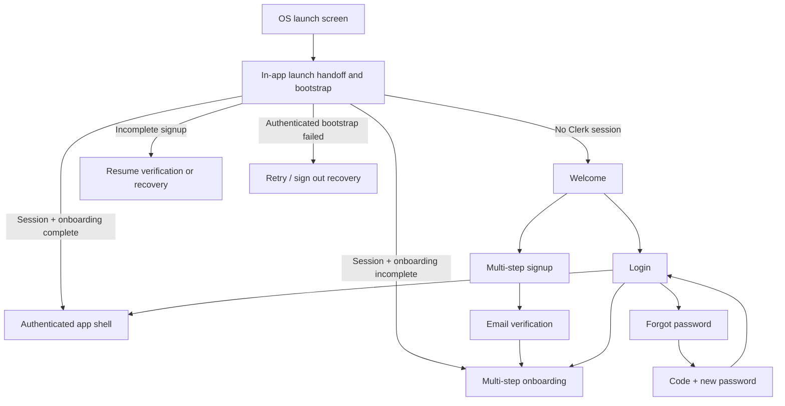

# 35mm React Native Mobile Development Plan

> Canonical plan, progress ledger, and continuation contract for the shared iOS and Android app.
>
> Last updated: 2026-09-24
> Document status: React Native now mirrors retained SwiftUI splash/welcome/auth presentation with device appearance, local animated posters, compact system-font forms, toolbar progress, and a shared DOB wheel sheet; mobile Clerk recovery is preserved. Retained SwiftUI Home and Profile Posts/Reposts share the UIKit/diffable renderer; first-page lifecycle, nonanimated snapshots, self-sizing, and reading-anchor stability are corrected, with bounded short-page/cold-history batching added after the user reported a remaining one-post launch flash (2026-09-23).
> Current phase: Phase 2 — Launch, Welcome, and account lifecycle
> Next unblocked task: Auth process-death, offline, throttling, expiry, accessibility, and visual tests

## 1. Document contract

This file is the source of truth for React Native mobile planning and delivery. Every agent working on the mobile app must read this file completely before planning, reviewing, or editing mobile code.

Keep this document current in the same change whenever work affects:

- Completed or active roadmap items.
- Mobile app structure, dependencies, navigation, environment variables, build settings, or release configuration.
- Shared API clients, types, validators, design tokens, or mobile UI primitives.
- Screen behavior, backend readiness, native integration, supported OS versions, or testing requirements.
- Any blocker, decision, migration note, or newly discovered parity gap.

Do not rewrite history. Mark completed checklist items, update the current phase and next task, and append a dated work-log entry. When a decision changes, record both the replacement and the reason in the decision log.

### Status legend

- `[x]` Complete and verified.
- `[ ]` Not started.
- `IN PROGRESS` Actively being implemented; only one roadmap item should carry this label.
- `BLOCKED` Cannot proceed without a named product, backend, vendor, or platform decision.
- `GATED` Deliberately unavailable because its production backend or product scope is not ready.

## 2. Approved decisions

- [x] Build one React Native app for iOS and Android at `apps/mobile`.
- [x] Use Expo and React Native New Architecture/Fabric.
- [x] Preserve `apps/ios` and every related source, project, resource, test, and document.
- [x] Use `apps/web` mobile UI and `apps/ios` as primary product references.
- [x] Make 35mm-controlled UI visually and behaviorally consistent across iOS and Android, following the Twitter/Instagram model.
- [x] Keep platform differences only where the operating system owns behavior or accessibility.
- [x] Support Android 7/API 24 and newer unless a future supported Expo release raises the floor.
- [x] Target current Google Play requirements; baseline as of this document is API 36.
- [x] Retain canonical 35mm REST contracts, IDs, pagination, caching, rate limits, and async counter architecture.
- [x] Use production data only. Missing production dependencies cause a feature to remain gated, not filled with mock data.

### Decision pending before public release

- `BLOCKED` Product/legal approval for minimum signup age and regional age-handling rules. DOB must still be collected and stored privately, but release eligibility cannot rely on an invented client-only policy.
- `BLOCKED` Final production app-store identifiers, signing teams, store accounts, and whether React Native iOS takes over `com.35mm.app` immediately or after parity validation.
- `BLOCKED` Push-notification provider/configuration and production notification routing. In-app notifications can ship independently.

## 3. Required continuation protocol

Every mobile implementation session must follow this order:

1. Read root `AGENTS.md` completely.
2. Read this document completely.
3. Read relevant sections of `docs/architecture.md` and `codebase-analysis-docs/CODEBASE_KNOWLEDGE.md`.
4. Inspect `graphify-out/GRAPH_REPORT.md` and `graphify-out-api/GRAPH_REPORT.md` for the affected web/API area, then verify behavior in source.
5. Inspect both reference implementations for the affected surface:
   - Mobile web under `apps/web`.
   - SwiftUI under `apps/ios/ThirtyFiveMM`.
6. Check `git status` and preserve unrelated user changes.
7. Find the current phase, the next uncompleted item, blockers, and latest work-log entry below.
8. Implement one coherent production-grade slice with tests and documentation.
9. Update this document before finishing:
   - Current phase.
   - Next unblocked task.
   - Roadmap checkboxes.
   - Feature status matrix when affected.
   - Decision or blocker log when affected.
   - Dated work-log entry with verification commands.

If the user requests work outside the next listed item, follow the user’s scope and update this plan to reflect the new ordering.

## 4. Embedded Codex continuation prompt

Copy this prompt into a new Codex task when explicitly resuming React Native work. Root `AGENTS.md` also requires agents to discover and read this document automatically for mobile tasks.

```text
Continue development of the 35mm React Native mobile app for iOS and Android.

Before taking any implementation action, read these files completely:
1. AGENTS.md
2. docs/react-native-mobile-development-plan.md
3. Relevant sections of docs/architecture.md
4. Relevant sections of codebase-analysis-docs/CODEBASE_KNOWLEDGE.md
5. Relevant graph reports in graphify-out and graphify-out-api, followed by direct source verification

Treat docs/react-native-mobile-development-plan.md as the canonical mobile status and handoff document. Identify its current phase, next unblocked task, latest work-log entry, open blockers, and relevant acceptance criteria. Inspect git status and preserve unrelated changes.

Non-negotiable requirements:
- Never delete, rename, replace, or weaken apps/ios or its related files. It remains a product and native-behavior reference.
- Build the shared React Native app under apps/mobile for both iOS and Android.
- Hold every React Native change to the production engineering standard in this plan, benchmarked against mature large-scale consumer mobile teams such as Meta/Instagram, X/Twitter, Airbnb, and Discord. Require measured evidence; brand comparison alone is never acceptance evidence.
- 35mm-controlled UI must look and behave consistently across iOS and Android. Use shared components, tokens, icons, fonts, geometry, and motion. Keep platform-specific code limited to OS integration, accessibility, and measured performance escape hatches.
- Use apps/web mobile UI and apps/ios as reference points. Verify the current source instead of relying only on prose documentation.
- Reuse canonical shared TypeScript types and validators where runtime-safe. Never use TMDB IDs as 35mm identity.
- Keep cursor pagination, denormalized counters, rate limits, idempotency, server-side authorization, soft-delete semantics, cache invalidation, and async worker patterns intact.
- Do not add mock production behavior, placeholder routes, fake data, unbounded queries, OFFSET pagination, N+1 reads, synchronous hot-path counters, silent failures, or client-trusted authorization.
- Use React Query for server state and Zustand only for UI state.
- Preserve exact loading, empty, error, retry, offline, accessibility, and reduced-motion states—not only happy paths.
- Test old and low-memory Android devices from the first vertical slice.

At the start, briefly report the current phase and exact slice being continued. Implement and verify that slice. Before finishing, update docs/react-native-mobile-development-plan.md: progress checkboxes, current phase, next task, blockers/decisions, feature status, and a dated work-log entry listing files changed and verification commands. Update architecture and codebase knowledge docs whenever app structure, contracts, feature wiring, environment variables, or known gaps change.
```

## 5. Product intent and reference hierarchy

35mm mobile is a conversation-first film network: feed, film logging and reviews, comments, profiles, follows, notifications, discovery, lists, watchlists, bookmarks, media, and chat. Mobile interactions must feel immediate, content-led, and intentional without turning into generic platform chrome.

When references conflict, use this order:

1. Server authorization, data integrity, and canonical identity rules in API/database source.
2. Shared response/request contracts in `packages/types` and `packages/validators`.
3. Explicit decisions in this plan.
4. Mobile-web information architecture and cross-platform visual composition.
5. SwiftUI interaction details, gesture behavior, accessibility, native edge cases, and implemented production flows.
6. Platform conventions for OS-owned surfaces.

If web and SwiftUI disagree materially, do not mix them accidentally. Record the selected behavior in the decision log and add parity tests.

### UI parity policy

The following must use the same shared React Native implementation and appearance on iOS and Android:

- Launch-to-app handoff surface after the OS launch screen.
- Welcome, signup, login, verification, password recovery, and onboarding screens.
- Headers, bottom navigation, side drawer, cards, lists, buttons, fields, sheets, dialogs, menus, toasts, badges, tabs, skeletons, empty states, and error states.
- Typography, icons, colors, spacing, radii, shadows, borders, motion timing, and interaction feedback.
- Feed, profile, title, discover, notifications, bookmarks, lists, settings, composer, and chat surfaces.

Platform-specific behavior is allowed only for:

- OS launch-screen implementation.
- Status/navigation bar integration and safe areas.
- Keyboard, text-input services, autofill, and password manager integration.
- Android system back/predictive back and iOS interactive back gestures.
- Permissions, push registration, deep-link registration, app lifecycle, secure storage, and background execution.
- Camera, photo library, document picker, external share targets, and store review surfaces.
- Native modules proven necessary through profiling.
- Accessibility APIs required by VoiceOver or TalkBack.

OS-owned dialogs may differ. 35mm-owned wrappers, previews, labels, ordering, and confirmation steps must remain shared.

### Production engineering standard

All React Native source, native integration, tests, build configuration, and release operations must meet one production-grade quality tier. Target the engineering discipline, reliability, performance, security, accessibility, and product polish expected from mature large-scale consumer mobile organizations such as Meta/Instagram, X/Twitter, Airbnb, and Discord. This benchmark does not claim affiliation or quality through comparison alone; every claim requires repository, test, profiling, device, observability, and rollout evidence.

Non-negotiable requirements:

- No prototype-quality path may enter production source. No fake success, placeholder behavior, mock production data, debug-only control flow, swallowed error, or knowingly incomplete user journey may be presented as complete. If production dependencies are missing, keep the feature explicitly gated or absent.
- Architecture must have clear ownership and stable boundaries. Route files stay thin; feature modules own UI, queries, mutations, adapters, state machines, and tests; platform code stays behind narrow typed interfaces; shared packages remain platform-appropriate and free of dependency leakage.
- Strict TypeScript, runtime validation at trust boundaries, exhaustive state handling, immutable contracts, deterministic behavior, and actionable errors are required. Avoid broad `any`, unchecked casts, ambient mutable singletons, hidden side effects, and duplicated sources of truth.
- Every async flow must define cancellation, timeout, retry, deduplication, idempotency, stale-response protection, offline behavior, background/foreground transitions, process-death recovery, and account-switch/sign-out cleanup where applicable.
- UI must remain responsive under realistic production load. Use bounded virtualization, stable render identities, measured image decoding/caching, deferred heavy modules, off-thread animation where supported, and explicit memory ownership. Release-build profiling on named devices is required for hot paths.
- Every release-sensitive surface must have approved measurable budgets or service-level objectives for startup, interaction latency, frame stability, memory, API failure handling, crash-free sessions, Android ANR, iOS hangs, and update success. Material regression blocks release until fixed or explicitly accepted with documented impact, owner, containment, and rollback.
- Network and server-state code must preserve cursor pagination, bounded reads, cache ownership, explicit invalidation, optimistic rollback, reconnect reconciliation, rate limits, server authorization, soft-delete behavior, and async counter architecture. Mobile convenience never weakens canonical backend guarantees.
- Security and privacy reviews cover token storage, PII/secret redaction, deep links, uploads, permissions, entitlements, local persistence, analytics, crash reporting, screenshots/previews, clipboard exposure, account switching, and dependency supply-chain risk. Client state never serves as authorization evidence.
- Accessibility, localization, RTL, large text, Reduce Motion, screen-reader behavior, keyboard behavior, safe areas, narrow screens, poor networks, and low-memory devices are release requirements, not polish work.
- Tests must cover contracts, state machines, components, accessibility, integration boundaries, critical end-to-end journeys, visual parity, failure recovery, lifecycle changes, and performance regressions in proportion to risk. Flaky tests are defects; bypassing or weakening a gate requires a documented owner and resolution before release.
- Production observability must use structured, privacy-safe diagnostics with release/build/variant context, crash and hang reporting, performance signals, and actionable ownership. Failures must be diagnosable without reproducing them on a developer machine or logging secrets.
- Releases use reproducible builds, reviewed configuration, backward-compatible migrations/contracts, staged rollout, health monitoring, kill/containment controls where appropriate, and a tested rollback path. Native/runtime incompatibility cannot ship through OTA updates.
- Dependencies require maintenance, license, security, New Architecture, OS-floor, binary-size, startup, memory, permission, and privacy review. Unmaintained or incompatible dependencies must be replaced, isolated, or rejected before adoption.
- Reviews evaluate correctness, failure modes, scale, performance, security, privacy, accessibility, operability, tests, and rollback—not only visual output or happy-path behavior. Large or high-risk changes must be split into coherent reviewable slices without lowering end-state quality.

The names above establish ambition and operating discipline; acceptance remains evidence-based. If schedule or dependency constraints prevent this standard, reduce exposed scope or keep the feature gated. Do not silently lower engineering quality.

## 6. Technical baseline

Version baseline was reverified against official Expo, React Native, and Android documentation on 2026-07-22. Expo SDK 57 itself supports iOS 16.4, but the shared app now targets iOS 17.0 because the selected Clerk Expo native SDK requires that floor. The remaining baseline is Expo SDK 57, React Native 0.86, React 19.2.3, Android API 24 minimum, and Android compile/target API 36. SDK 57 requires Node 22.13 or newer and runs only on React Native New Architecture/Fabric; the legacy-architecture app-config switch no longer exists.

| Concern | Planned choice |
|---|---|
| Workspace | `apps/mobile`, package name `@35mm/mobile` |
| Framework | Expo SDK 57 (`expo` 57.0.20; scaffolded at 57.0.8) |
| Runtime | React Native 0.86.3, New Architecture/Fabric only |
| React | React 19.2.3, isolated from existing React 18 workspaces through pnpm peer/type resolution |
| Routing | Expo Router 57.0.19 with typed routes; universal/app links remain later-phase work |
| Server state | TanStack React Query v5 |
| UI state | Zustand v5 and local component state |
| Auth | `@clerk/expo` custom flows; no beta prebuilt native auth UI |
| Secure token cache | Expo SecureStore through Clerk-supported token cache |
| Forms | React Hook Form plus shared/new Zod validators where compatible |
| Animation/gestures | React Native Reanimated and Gesture Handler |
| Images | Expo Image or an equivalently maintained native cache, using R2 variants and blurhash |
| Realtime | Ably JavaScript SDK behind typed lifecycle-aware adapters |
| Media uploads | Existing presign API plus direct R2 upload |
| Unit/component tests | Jest 29.7 through `jest-expo` 57.0.2 plus React Native Testing Library 14.0.1 |
| Native end-to-end tests | Maestro flows on fixed iOS simulators and Android emulators/devices |
| Distribution | EAS development/preview/production profiles and store builds |
| OTA updates | Expo Updates with runtime fingerprinting and staged rollout |

### Supported operating systems

- Android minimum: Android 7, API 24.
- Android compile/target baseline: API 36.
- iOS minimum baseline: iOS 17.0, raised from the Expo 16.4 floor for Clerk Expo native SDK compatibility.
- Existing SwiftUI app target remains unchanged unless separately requested.
- Devices below the mobile app floor use the responsive web app.

### Android validation matrix

At minimum, validate:

- API 24: oldest supported behavior and TLS/network compatibility.
- API 26: notification channels and background restrictions.
- API 29: scoped storage transition behavior.
- API 31: modern background and permission behavior.
- API 33: notification permission and media access behavior.
- API 36: target behavior and current Play submission baseline.
- One low-memory physical device representative of older Android hardware.
- One current mid-range device and one current flagship-class device.
- Font scale, display scale, gesture navigation, three-button navigation, RTL, dark theme, and reduced motion.

## 7. Planned repository structure

```txt
apps/mobile/
├── app.config.ts
├── eas.json
├── package.json
├── tsconfig.json
├── assets/
│   ├── fonts/
│   ├── icons/
│   ├── images/
│   └── launch/
└── src/
    ├── app/                    Expo Router route files only
    │   ├── _layout.tsx
    │   ├── (auth)/
    │   ├── (onboarding)/
    │   └── (app)/
    ├── components/             Cross-feature mobile components
    ├── features/               Feature-owned UI, hooks, API adapters, models
    ├── providers/              Clerk, React Query, theme, realtime, app lifecycle
    ├── services/               API, media, storage, updates, observability
    ├── state/                  UI-only Zustand stores
    ├── theme/                  Mobile token adapters and themes
    ├── platform/               Narrow OS-integration boundary
    ├── test/                   Fixtures, render helpers, mocks, assertions
    └── types/                  Mobile-only view types; shared contracts stay in packages

packages/
├── api-client/                 Platform-neutral REST client and errors (Phase 1.7 complete)
├── design-tokens/              React-free brand/theme token source (Phase 1.5 complete)
├── mobile-ui/                  React Native primitives and patterns (Phase 1.6 complete)
├── types/                      Existing canonical contracts
└── validators/                 Existing canonical Zod validation
```

Rules:

- `packages/ui` remains web-oriented and must not be imported into React Native.
- `packages/design-tokens` must contain no React, DOM, UIKit, or Android dependencies.
- `packages/mobile-ui` must not import Next.js, browser globals, Radix, Tailwind DOM utilities, TipTap React UI, or web-only packages.
- `packages/api-client` must accept injected base URL, token provider, fetch implementation, request ID, abort signal, and platform metadata.
- Generated `apps/mobile/ios` and `apps/mobile/android` directories are ignored, untracked, disposable Expo CNG output and are not substitutes for `apps/ios`. Retained native behavior belongs in reviewed app config, explicit config plugins, or native modules outside generated trees. `apps/mobile/NATIVE_GENERATION.md` is the detailed policy and command reference.
- Production and development app identifiers must be distinct. Never install a development build over the shipping SwiftUI app accidentally.

Phase 1.1 implements the workspace/configuration files plus only the root Expo Router layout and index entry needed for native bundle validation. Phase 1.3 adds `eas.json` for isolated internal development/preview profiles and fail-closed variant validation. Phase 1.4 adds enforceable CNG boundaries, config-plugin/autolinking review baselines, safe clean-regeneration commands, and isolated two-variant native generation checks. Phase 1.5 adds React-free `packages/design-tokens` plus source-backed web/Swift theme parity fixtures. Phase 1.6 adds `packages/mobile-ui`, local DM font assets, one cross-platform icon source, shared controls, overlays, toast, skeletons, and explicit state surfaces. Phase 1.7 adds provider composition, services, UI-only state wiring, secure Clerk tokens, bounded query persistence, lifecycle integration, and `packages/api-client`. Phase 1.8 mounts an internal foundation gallery and adds accessibility, Maestro E2E, reviewed PNG visual-diff, and release/device performance-evidence harnesses. At Phase 1.8 completion no auth, onboarding, authenticated shell, or product feature route existed; Phase 2 now owns that implementation. Production release profile remains blocked.

## 8. Root application state and routing


```mermaid
flowchart TD
  Launch["OS launch screen"] --> Bootstrap["In-app launch handoff and bootstrap"]
  Bootstrap -->|No Clerk session| Welcome["Welcome"]
  Bootstrap -->|Incomplete signup| AuthResume["Resume verification or recovery"]
  Bootstrap -->|Session + onboarding incomplete| Onboarding["Multi-step onboarding"]
  Bootstrap -->|Session + onboarding complete| Shell["Authenticated app shell"]
  Bootstrap -->|Authenticated bootstrap failed| Recovery["Retry / sign out recovery"]
  Welcome --> Signup["Multi-step signup"]
  Welcome --> Login["Login"]
  Signup --> Verify["Email verification"]
  Verify --> Onboarding
  Login --> Onboarding
  Login --> Shell
  Login --> Forgot["Forgot password"]
  Forgot --> Reset["Code + new password"]
  Reset --> Login
```

Bootstrap must not flash Welcome between session restoration and authenticated routing. Clerk session state, local API bootstrap state, onboarding status, theme hydration, and font readiness are separate states with explicit recovery.

### Planned route groups

```txt
src/app/
├── _layout.tsx
├── index.tsx                         Root state redirect only
├── (auth)/
│   ├── welcome.tsx
│   ├── signup/
│   │   ├── name.tsx
│   │   ├── username.tsx
│   │   ├── email.tsx
│   │   ├── password.tsx
│   │   ├── dob.tsx
│   │   └── verify.tsx
│   ├── login.tsx
│   └── password/
│       ├── forgot.tsx
│       ├── verify.tsx
│       ├── reset.tsx
│       └── complete.tsx
├── (onboarding)/
│   ├── role.tsx
│   ├── films.tsx
│   ├── genres.tsx
│   └── people.tsx
└── (app)/
    ├── _layout.tsx                   Shared shell
    ├── (tabs)/
    │   ├── home.tsx
    │   ├── discover.tsx
    │   ├── compose.tsx
    │   ├── notifications.tsx
    │   └── profile.tsx
    ├── post/[postId].tsx
    ├── profile/[username]/...
    ├── title/[catalogTitleId].tsx
    ├── person/[personId].tsx
    ├── lists/...
    ├── bookmarks/...
    ├── chat/...
    ├── settings/...
    ├── reports/...
    ├── contribute/...
    └── legal/...
```

Route filenames may evolve to satisfy Expo Router constraints, but public deep-link identity must remain canonical:

- Profiles use username where current contracts do.
- Posts use canonical post IDs.
- Catalog/title routes use canonical 35mm catalog IDs.
- Film social contracts use `films.id`, never TMDB ID.
- TMDB IDs remain lookup/import metadata only.

## 9. Signed-out and account flows

### 9.1 OS launch screen and in-app launch handoff

Reference assets:

- `apps/ios/ThirtyFiveMM/Resources/Assets.xcassets/LaunchWordmark.imageset`.
- Web and iOS theme/brand assets.

Requirements:

- Static OS-native launch screen with local 35mm wordmark and solid theme-safe background.
- No remote image, API request, JavaScript-driven animation, user content, or personalized state on the OS launch screen.
- In-app handoff must match its geometry and color closely enough to avoid a visible jump.
- Load fonts, persisted theme, Clerk session, and bootstrap prerequisites in parallel.
- Do not add an artificial minimum delay. Transition as soon as destination is known and first frame is ready.
- Respect Reduce Motion. Any handoff animation must fade or resolve immediately.
- If authenticated bootstrap fails, show retry/sign-out recovery; do not misroute to Welcome.
- Measure launch-to-usable time on the Android matrix and supported iOS versions.

### 9.2 Welcome screen

Primary references:

- `apps/ios/ThirtyFiveMM/Features/Intro/IntroView.swift`.
- `apps/ios/ThirtyFiveMM/Features/Intro/WelcomeHeroView.swift`.
- Mobile web auth branding and `apps/web/PRODUCT.md`.

Required content:

- Nine locally bundled movie posters in three staggered, repeating columns with adaptive fades; shared animation pauses when backgrounded and under Reduce Motion.
- 35mm wordmark and concise value proposition.
- Primary “Sign up” action.
- Secondary “Log in” action.
- Terms and privacy links near account creation.
- No authenticated API reads or remote artwork before action.
- Same layout, typography, assets, and motion across platforms, adjusted only for safe area and usable height.

### 9.3 Multi-step signup

Signup collects the requested fields as discrete, resumable visual steps:

1. **Name**
   - Full/display name.
2. **Username**
   - Username as its own requested field.
   - Debounced username availability check with stale-response protection.
   - Availability failure must not silently report “available.”
3. **Email**
   - Email normalization and Clerk-supported validation.
   - Correct keyboard, autofill, return key, and error announcement.
4. **Password**
   - One password field.
   - Visibility controls with accessible state labels.
   - Clerk password requirements surfaced before submission where available.
   - Password must never be written to AsyncStorage, logs, analytics, crash breadcrumbs, or the progress ledger.
5. **Date of birth**
   - Locale-friendly date input presented identically across platforms through a shared 35mm surface.
   - Persist canonical `YYYY-MM-DD` only after verification/authentication through the protected profile API.
   - Reject impossible and future dates on both client and server.
   - Final minimum-age behavior remains release-blocked until approved; server is authoritative.
   - DOB remains private and must never appear on public profile payloads.
6. **Email verification completion**
   - Six-digit code, resend cooldown, change-email path, paste support, and expired-code recovery.
   - Verification is part of signup completion even though it is not a profile-data step.

Implementation notes:

- Current web signup is one page and does not capture DOB.
- Current SwiftUI and React Native signup use discrete name, username, email, password, DOB, and verification steps with top-aligned content. Signup form screens intentionally do not use the cinematic poster hero.
- Current profile API supports `dateOfBirth`, validates date format, and returns it only to the owner; it does not enforce age policy.
- Signup must retain non-secret draft fields through navigation and ordinary process recreation. Password fields remain memory-only and must be re-entered after process death.
- After email verification: activate Clerk session, bootstrap `/v1/me`, persist DOB through authorized `PATCH /v1/profiles/me`, confirm onboarding status, then route to onboarding.
- If DOB persistence fails after account creation, keep user inside an explicit retryable completion state. Do not mark signup complete and lose the value.
- Back navigation preserves completed non-secret values. Double submission must be prevented.

### 9.4 Login

Requirements:

- Username-or-email identifier and password.
- Password visibility, autofill, password-manager, hardware-keyboard, and submit-key support.
- Clerk multi-factor/session-task handling when required.
- Safe deep-link return destination validation.
- Already-authenticated handling without duplicate session creation.
- Loading state disables duplicate submission while preserving field visibility.
- Inline field errors plus one accessible form-level error.
- Links to password recovery and account creation.

### 9.5 Forgot and reset password

Required route sequence:

1. Enter email.
2. Send Clerk reset code.
3. Enter/paste code with resend cooldown and expiry handling.
4. Enter and confirm new password.
5. Complete Clerk reset/session handling.
6. Show success state and route safely to login or activated session according to Clerk result.

Requirements:

- Same screens and state machine on iOS and Android.
- Do not reveal whether an account exists beyond Clerk’s approved response semantics.
- Passwords and codes remain memory-only.
- Network interruption preserves safe non-secret progress and offers retry.
- Cover invalid, expired, reused, and throttled codes.
- Replace the unwired SwiftUI forgot-password reference with the production Clerk flow in React Native; never copy its unresolved action.

## 10. New-user onboarding

Onboarding begins only after verified authentication and successful local-user bootstrap.

Canonical steps:

1. **Role and context**
   - Cinephile, creator, critic, film student, or industry.
   - Optional short context for non-cinephile roles.
2. **Favorite films**
   - Search and select up to five.
   - TMDB may power cold-start lookup only through existing cached/rate-limited paths.
   - Resolve selections to canonical 35mm IDs before final submit.
3. **Favorite genres**
   - Select up to ten canonical genre identifiers.
4. **People to follow**
   - Bounded production suggestions.
   - Select up to twenty users.
   - Follow all, individual toggle, retry, empty state, and skip.

Behavior:

- Shared progress indicator, back navigation, and step transitions.
- Role is required; optional steps show explicit skip language.
- Draft persists locally using a versioned schema. No password, auth token, or private remote response belongs in the onboarding draft.
- Suggestions load only when needed and never fetch unbounded pages.
- Film search is debounced, cancellable, deduplicated, and stale-response safe.
- Final submission uses existing `/v1/me/onboarding` contract, server authorization, transaction behavior, and idempotent follow facts.
- Successful completion invalidates onboarding status, current profile, suggestions, feed, and relevant settings queries explicitly.
- Failed completion stays retryable without replaying already durable facts incorrectly.
- Sign-out is available without leaving a half-authenticated shell.

Reference choice:

- Use mobile web for complete step content because it includes favorite films.
- Use SwiftUI for touch presentation, progression, recovery, and accessibility details.
- React Native result becomes one shared visual implementation across both platforms.

## 11. Loading and skeleton system

Create one tokenized skeleton system in `packages/mobile-ui`; do not create unrelated shimmer implementations per feature.

Core primitives:

- `SkeletonBlock`.
- `SkeletonText`.
- `SkeletonAvatar`.
- `SkeletonPoster`.
- `SkeletonMedia`.
- `SkeletonRow`.
- Screen-specific compositions using these primitives.

Behavior rules:

- Skeleton geometry must match loaded content closely to minimize layout shift.
- Animation uses shared timing/colors and stops under Reduce Motion.
- Shimmer or pulse must not create continuous heavy GPU/CPU work on low-end Android.
- Skeleton elements are hidden from VoiceOver/TalkBack; one screen-level loading announcement is sufficient.
- Initial load may use a full skeleton.
- Pull-to-refresh keeps existing content visible with refresh affordance.
- Next-page loading uses bounded footer/row placeholders, not a full-screen reset.
- Cached stale content stays visible during background revalidation.
- Loading, empty, offline, permission-denied, private, deleted, and error states are distinct.
- Every recoverable error includes a real retry path.

Required skeleton compositions:

- Launch/bootstrap handoff.
- Home feed and post card variants.
- Post detail and comments.
- Profile header, tabs, posts, lists, diary, and stats.
- Discover hero, poster shelves, search results, and title detail.
- Bookmarks and bookmark folders.
- Lists, list details, watchlists, and entries.
- Notifications and follow requests.
- Chat inbox, thread history, attachment thumbnails, and typing/reconnect states.
- Settings/profile bootstrap rows where content depends on server data.
- People suggestions and onboarding film search.

Primary references include web feed/discover/bookmark/comment skeletons and SwiftUI notifications/discover/title/chat skeletons.

## 12. Authenticated shell and shared navigation

Canonical five-item bottom navigation, taken from current mobile web and rendered identically on both platforms:

1. Home.
2. Discover.
3. Create.
4. Notifications.
5. Profile.

Shell requirements:

- Shared custom 35mm bottom bar; do not use visually divergent system tab bars.
- Shared custom icons; do not pair SF Symbols with Material icons.
- Create opens composer without losing selected tab history.
- Notification badge is capped visually at `99+` and announced accessibly.
- Independent navigation history per durable tab where practical.
- Re-select active tab scrolls to top; repeated re-select may refresh only when product rules permit.
- Bottom chrome hides/restores using the same scroll policy on both platforms and respects Reduce Motion.
- Keyboard, safe-area, and Android navigation-mode changes cannot cover actionable content.

Canonical mobile header:

- Profile avatar opens the shared side drawer.
- Center uses wordmark or contextual title.
- Search and chat actions appear on applicable root screens.
- Detail screens use shared back/title/actions layout.
- Profile scroll may switch to compact username header without changing tab geometry.

Canonical side drawer:

- Profile identity, username, follower/following counts.
- Profile, Discover, 70mm, Bookmarks, Lists, Diary, Drafts.
- Divider.
- Chat, Notifications, Settings and privacy, Help.
- Route entries whose production feature is gated show no fake content. Hide them or present an explicit product-approved unavailable state.
- Opening drawer shifts/dims the complete app surface consistently, traps accessibility focus, closes on backdrop/back/Escape-equivalent, and restores focus.

## 13. Feature delivery matrix

| Domain | Planned mobile scope | Primary references | Backend readiness | Phase |
|---|---|---|---|---:|
| Auth | React Native now mirrors retained SwiftUI splash, animated poster Welcome, adaptive auth forms, toolbar progress, and DOB sheet (2026-09-21). Launch, root bootstrap, Welcome, verified signup, password Login, session activation, email-code challenge handling, and forgot/reset password email-code flow complete; social sign-in and broader resilience/visual evidence remain | Web auth + SwiftUI Intro/Auth | Clerk and secure DOB completion bridge wired | 2 |
| Onboarding | Role, films, genres, people | Web complete flow + SwiftUI coordinator | Wired | 3 |
| Shell | Header, five tabs, drawer, deep links | Mobile web shell + SwiftUI shell | Client-only | 4 |
| Feed | Home feed, refresh, cursor paging, repost proof, quotes, polls, media/link cards | Web feed + SwiftUI Feed | Wired | 4 |
| Composer | Text/log/review, canonical film selection, media, poll, quote, edit | Web composer + SwiftUI composer | Wired; rich-text parity required | 4 |
| Post detail | Complete body, comments, replies, likes, media viewer, share | Web + SwiftUI Post | Wired | 4 |
| Profiles | Public/own profile, edit, media, follow state, connections | Web + SwiftUI Profile | Wired | 5 |
| Profile tabs | Posts, Reposts, Diary, Lists, Stats | Web + SwiftUI Profile | Wired, cursor/cached stats | 5 |
| Social graph | Follow requests, followers/following, block, mute | Web profile/notifications + API | Wired | 5 |
| Discover | Search, shelves, filters, canonical resolution | Web Discover + SwiftUI Discover | Mixed TMDB/catalog; audit required | 6 |
| Titles/people | Title detail, reviews, cast/crew, watchlist, person detail | Web Title + SwiftUI Title | Catalog wired; identity audit required | 6 |
| Bookmarks | All, unsorted, folders, move/remove, loaded-page search | Web + SwiftUI Bookmarks | Wired | 7 |
| Lists/watchlists | Public list discovery, watchlist reading, list CRUD, entries, reorder, like, clone, title watchlist state | Web Lists + API | Wired | 7 |
| Notifications | List, bundles, unread, mark read/unread, follow requests, realtime | Web + SwiftUI Notifications | Wired in-app; push blocked | 8 |
| Chat | Inbox, thread, messages, reactions, edit/delete, image media, typing, presence | Web + SwiftUI Chat | Keyspaces persistence wired; React Native uses bounded REST reconciliation until Ably/mobile transport dependency is added | 9 |
| Settings | Account, privacy, notifications, appearance, media, data/security | Web + SwiftUI Settings | Mostly wired | 10 |
| Moderation | Report content, report history/detail, block/mute safety paths | Web Moderation + API | Wired | 10 |
| Contributions | Hub, forms, submission status | Web Contribute + API | Wired; scope after core mobile | 10 |
| Suggestions | People discovery and follow actions | Web Suggestions + API | Wired | 10 |
| Sharing/deep links | Posts, profiles, titles, lists, auth returns | Web + SwiftUI share/navigation | Routes exist; app links required | 10 |
| Help/legal | Help, terms, privacy, about | Web legal routes | Wired as web content; native presentation decision | 10 |
| Push notifications | Permission, token registration, routing, badges | Planned | `GATED` pending provider/backend | 11 |
| 70mm/video | Browse, detail, upload/playback | Web future surfaces | `GATED`; Cloudflare Stream absent | Later product phase |
| Communities | Community discovery/detail/feed | Web future surfaces | `GATED`; mock-heavy | Later product phase |
| Festivals | Festival discovery/detail | Web future surfaces | `GATED`; mock-heavy | Later product phase |
| Letterboxd import | File import and status | Web local workflow | Scope/contract review required | Later product phase |

Backend readiness must be verified again when each phase starts. Documentation can lag source; route tests and implementation are authoritative.

## 14. Data, networking, and state architecture

### API client

One mobile API client must provide:

- Configured API base URL with no production localhost fallback.
- Clerk bearer-token injection.
- Standard `{ code, message }` error decoding.
- Request IDs and structured diagnostic context without PII/secrets.
- Abort/cancellation support tied to screen/query lifecycle.
- Explicit timeouts by request class.
- Safe retry rules: reads may retry with bounded backoff; mutations retry only when idempotency semantics make replay safe.
- Idempotency-key support for client-originated mutations requiring it.
- Network/offline classification distinct from server errors.
- JSON decoding validation at trust boundaries for high-risk contracts.
- No swallowed errors or success substitution after request failure.

### React Query

- Server state lives in React Query.
- Every feature owns a typed query-key factory aligned with web conventions.
- Infinite queries use server cursors and preserve page boundaries.
- Optimistic likes, bookmarks, reposts, follows, poll votes, read state, and similar actions must snapshot, reconcile, and roll back explicitly.
- Realtime events patch/invalidate the same canonical caches; they do not create a second source of truth.
- Persist only approved bounded queries with a versioned cache buster and user/session namespace.
- Clear user-scoped persisted cache on sign-out/account switch.
- Sensitive chat/profile/account data requires an explicit persistence policy before disk caching.

### Zustand

Zustand is limited to UI state such as:

- Composer presentation and draft UI metadata.
- Drawer state.
- Bottom chrome visibility.
- Toasts and transient modal coordination.
- Local media-picker workflow state.

Do not mirror profiles, feeds, notifications, settings, lists, chat threads, or other server-owned entities into Zustand.

### Realtime

- One lifecycle-aware Ably connection layer.
- Subscribe only when authenticated and foreground/feature policy allows.
- Deduplicate events by durable identifiers/version fields.
- Reconcile on reconnect using bounded REST reads.
- Notification and chat adapters remain feature-specific above shared transport.
- Missing Ably configuration must surface as an intentional environment capability state; polling/reconnect fallback must be bounded.

### Media

- Use existing authorized presign endpoint and direct R2 PUT.
- Validate size/type/dimensions before upload where possible; server remains authoritative.
- Use processed variants and blurhash to avoid decoding full originals in scrolling lists.
- Upload state supports progress, cancellation, retry, and explicit failure.
- Clean local previews when discarded or completed.
- Never embed binary uploads through the Hono request body when direct upload is available.

### Rich content

- Render shared TipTap-compatible document payloads with a bounded native renderer; do not use a WebView for feed cards.
- Sanitize/validate marks, links, mentions, and unsupported nodes.
- Preserve canonical mention/user and film identity.
- Composer must emit payloads accepted by shared validators and fixture tests.
- Full composer parity is a Phase 4 exit condition; no reduced production payload may silently replace supported web/iOS behavior.

## 15. Design system

### Tokens

Create React-free shared tokens covering:

- Brand accent `#c2473a` and semantic action colors.
- Every existing theme: auto, light, dark, letterboxd, matinee, matrix, oppenheimer-bw, barbie.
- Surface, elevated, sunken, border, strong-border, text, secondary-text, destructive, success, and focus colors.
- 4-point spacing scale.
- Corner-radius and sheet geometry.
- Avatar, icon, touch-target, poster, and media sizes.
- Typography roles and line heights.
- Motion durations/easings and Reduce Motion substitutions.
- Elevation/shadow recipes calibrated to look equivalent on both platforms.

### Typography

- Bundle DM Serif Display, DM Sans, and DM Mono assets where licensing/assets permit.
- Use the same font files and weights on iOS and Android.
- Provide semantic roles rather than screen-local numeric font declarations.
- Respect Dynamic Type/font scale without clipping or hiding controls.
- Establish maximum scaling/layout fallbacks only when required to preserve action access, never to suppress accessibility.

### Icons

- Use one shared SVG/icon source for all 35mm-controlled UI.
- Active/inactive variants must be intentionally designed.
- Icons need accessible labels when not accompanied by visible text.
- Platform system symbols may appear only inside OS-owned surfaces or narrow platform integration.

### Core components

Foundation must cover at least:

- Screen/container/safe-area primitives.
- App text and icon.
- Button, icon button, link button, destructive action.
- Text field, password field, date field, search field, code field, text area.
- Avatar, poster, remote image, blurhash placeholder.
- Header, bottom tab bar, drawer, segmented tabs.
- Card, divider, badge, chip, counter.
- Action sheet, modal, confirmation dialog, toast.
- Skeleton primitives and screen states.
- Refresh/pagination affordances.
- Media grid/viewer and branded share preview.

Every primitive requires light/dark/custom-theme, disabled, pressed, focused, loading, error, RTL, large-text, and Reduce Motion coverage where applicable.

## 16. Performance and scale requirements

React Native does not change backend scale rules. Mobile adds another high-volume client, so it must reuse existing cacheable, cursor-paged, denormalized contracts rather than multiply reads.

### Client performance rules

- Use recycler-backed virtualized lists appropriate for variable-height social cards and chat rows.
- Never render an unbounded feed, comments tree, notifications list, chat history, cast list, followers list, or search result set.
- Preserve server cursor sizes; do not increase limits to compensate for client design.
- Keep `PostCard` and other hot rows memoized with stable props/callbacks.
- Avoid new object/style creation in hot render paths when profiling shows churn.
- Decode images at rendered dimensions and use bounded memory/disk caches.
- Defer heavy composer, GIF/emoji, media editor, and film-search modules until invoked.
- Keep animations off the JavaScript thread where supported.
- Bound body parsing, URL detection, rich-text normalization, color extraction, and deduplication per loaded item/page.
- Profile release builds; development-mode timings are not release evidence.

### Performance gates

Phase 1 establishes reproducible cold/warm launch, memory, frame, and bundle baselines on named devices. Each later phase must avoid material regression. Before store release, define and record approved thresholds for:

- OS launch to first rendered app frame.
- Launch to usable signed-out and signed-in destinations.
- Feed first-content render.
- Feed scroll frame stability.
- Composer open and keyboard latency.
- Peak memory after extended feed/media use.
- Chat thread open, history prepend, and newest-message delivery.
- Android ANR and iOS hang rates.
- Crash-free sessions.
- OTA update success and rollback.

Any threshold change requires a measured explanation in the work log.

### 1M+ DAU assumptions

- Home/feed/profile/list reads remain bounded cursor queries and use existing server caches/indexes.
- Denormalized counters stay server-owned and update through existing async jobs.
- Mobile optimistic UI does not create extra reconciliation writes beyond necessary facts.
- Images and media flow through CDN/R2 variants, not API proxy bodies.
- Realtime reconnect uses bounded reconciliation, not full-history replay.
- No new database index is required merely to add a client. Any new route/filter must document and add its index in the same cross-layer change.

## 17. Accessibility, localization, and resilience

Accessibility is part of parity, not a platform exception.

- WCAG AA color/contrast intent across every theme.
- VoiceOver and TalkBack labels, roles, state, order, announcements, and modal focus containment.
- Minimum 44-point/44-dp actionable targets unless a larger target is required.
- Dynamic Type/Android font scale, display zoom, narrow devices, split-screen where supported, and landscape keyboard use.
- Reduce Motion disables or simplifies spatial transitions, shimmer, parallax, autoplay, and drawer motion.
- Meaning never depends only on color.
- RTL layout and gestures are tested; directional icons/animations mirror correctly.
- Long names, usernames, translated labels, missing media, deleted content, private content, and unavailable services remain usable.
- Offline and poor-network states preserve readable cached content where policy allows.
- App resume, background, killed-process restoration, account switching, and expired sessions have explicit state transitions.

User-visible copy must be ready for localization: no string concatenation that prevents reordering, no UI logic based on English text, and no hardcoded locale-sensitive dates/numbers.

## 18. Security and privacy

- Clerk/API authorization remains server-enforced.
- Tokens use Clerk-supported secure storage and never appear in logs.
- Passwords, reset codes, verification codes, DOB, private settings, and signed URLs are excluded from analytics/crash breadcrumbs.
- DOB remains owner-only and is not used as a public social field.
- Validate deep links and redirect targets against an allowlist of internal routes.
- Validate uploaded type/size locally for UX and on server for security.
- Clear user-scoped caches, realtime subscriptions, in-memory drafts, and media previews on sign-out/account change.
- Do not trust optimistic state as authorization evidence.
- Do not render unsanitized rich HTML or open arbitrary URLs without scheme/domain safety handling.
- Mobile app secrets are public by nature; only publishable/configuration values may be bundled. Server secrets remain server-side.

## 19. Testing strategy

### Contract and unit tests

- Shared type/validator fixture compatibility.
- API error decoding and auth headers.
- Cursor extraction, next-page behavior, deduplication, and cancellation.
- Query-key factories and optimistic rollback.
- Date/DOB parsing without timezone shifts.
- Rich-text/mention/link parsing.
- Deep-link parsing and canonical ID routing.
- Theme/token resolution.
- Onboarding draft version/migration.
- Realtime deduplication and reconnect reconciliation.

### Component tests

- Every design-system state.
- Auth step validation and navigation.
- Signup process restoration without password persistence.
- Skeleton/loading/empty/error/offline transitions.
- Feed interactions and counter reconciliation.
- Profile follow/request/block/mute states.
- Composer payload construction.
- Accessibility roles, names, values, and focus order.

### End-to-end tests

Critical Maestro flows:

1. Fresh launch → Welcome → signup → verification → DOB persistence → onboarding → Home.
2. Login → authenticated bootstrap → Home.
3. Forgot password → code → reset → login.
4. Feed page → interact → post detail → comments → profile.
5. Create/edit/soft-delete post with media and film identity.
6. Discover → canonical title → reviews/watchlist.
7. Follow request/private profile/block/mute/report.
8. Bookmark folders and list/watchlist operations.
9. Notifications realtime/read state and follow requests.
10. Chat send/retry/edit/delete/reaction/media/reconnect.
11. Theme, large text, RTL, Reduce Motion, offline/recovery.
12. Deep links from cold and warm app states.

### Visual regression

- Fixed iOS simulator and Android emulator configurations.
- Golden screenshots for every foundation component and critical screen/state.
- Same content fixtures, locale, font scale, theme, clock, and image assets on both platforms.
- Compare each platform against approved design goldens and compare platform pairs for 35mm-controlled surfaces.
- Mask only true OS-owned variability such as status-bar indicators.
- No baseline update without reviewed visual intent.

### Performance tests

- Release-mode launch benchmark.
- Long feed with mixed post/media/poll/quote shapes.
- Large comment tree within three-level limit.
- Long profile/list/bookmark/notification pagination.
- Chat history prepend and live insert.
- Low-memory background/foreground and process recreation.
- Upload cancellation/retry and image-cache pressure.

## 20. Build, release, and operations

Configured and planned build profiles:

- Development: internal development-client profile, EAS `development` environment, `35mm Dev`, `thirtyfivemm-dev`, and `com.thirtyfivemm.mobile.dev`. Runtime requires explicit `EXPO_PUBLIC_API_URL` and `EXPO_PUBLIC_CLERK_PUBLISHABLE_KEY`; missing or invalid values fail closed at the root recovery boundary.
- Preview: internal distribution profile, EAS `preview` environment, `35mm Preview`, `thirtyfivemm-preview`, and `com.thirtyfivemm.mobile.preview`. Staging services and update channel remain later wiring.
- Production: `BLOCKED` pending store identifier, signing, and migration-sequencing decisions; no profile or guessed native identity exists.

Release requirements:

- `expo-doctor`, TypeScript, lint, unit/component tests, E2E critical flows, visual diff, and platform build must pass.
- Environment validation fails builds with missing required production values.
- OTA updates use runtime fingerprinting so JavaScript never targets incompatible native code.
- OTA rolls out to a small cohort, monitors crash/startup/error signals, then expands.
- Native dependency/config changes receive new store binaries.
- Store privacy labels/data-safety forms include auth, DOB, analytics, media, notifications, and chat accurately.
- Release notes and rollback owner are identified.
- SwiftUI production app remains recoverable until React Native iOS parity and rollout criteria pass.

## 21. Phased roadmap

### Phase 0 — Plan and repository contract

- [x] Approve React Native/Expo direction.
- [x] Approve one visually consistent iOS/Android UI.
- [x] Preserve SwiftUI app as reference and fallback.
- [x] Inventory web, SwiftUI, API, graph, and documentation surfaces.
- [x] Create this canonical plan and embedded continuation prompt.
- [x] Add repository-agent requirement to read and maintain this plan.
- [x] Link architecture and codebase knowledge documents to this plan.

Exit criterion: future mobile sessions automatically discover one current plan and next task.

### Phase 1 — Workspace, runtime, and design-system foundation

- [x] **1.1** Scaffold `apps/mobile` with verified current stable Expo SDK, pnpm workspace support, strict TypeScript, Expo Router, and New Architecture.
- [x] **1.2** Add root mobile scripts and CI-aware typecheck/lint/test commands.
- [x] **1.3** Configure distinct development/preview identifiers, schemes, and environment validation.
- [x] **1.4** Establish generated native-directory/config-plugin policy without touching `apps/ios`.
- [x] **1.5** Create `packages/design-tokens` and theme parity fixtures.
- [x] **1.6** Create `packages/mobile-ui` primitives, icons, fonts, sheets, modals, toast, skeletons, and state surfaces.
- [x] **1.7** Configure React Query, persisted cache policy, Zustand UI boundary, Clerk provider/token cache, API client, app lifecycle, and error boundary.
- [x] **1.8** Add baseline accessibility, visual-regression, E2E, and performance harnesses.
- [ ] **1.9** Produce signed development builds on one physical iOS and one low/mid-range Android device. **DEFERRED BY USER 2026-07-23:** physical iOS is verified. The development-identity Release app embeds `main.jsbundle`, retains the generated `ExpoModulesProvider`, embeds a valid Expo Constants `app.config`, is strictly signed for `com.thirtyfivemm.mobile.dev`, installs on the connected iPhone 13 Pro, visibly renders the Foundation gallery, and remains alive with clean startup logs. No physical Android device is available; Android emulator build/smoke pass, but representative hardware evidence remains required before public release. This missing hardware evidence no longer blocks Phase 2 implementation.

Exit criterion: themed component gallery and bootstrap shell render identically, pass tests, and establish performance baselines on both platforms.

### Phase 2 — Launch, Welcome, and account lifecycle

- [x] OS launch screens and in-app handoff. Retained SwiftUI native launch storyboard and wordmark variants now support device light/dark appearance, verified before SwiftUI starts on simulator (2026-09-21).
- [x] Root auth/bootstrap state machine with retry/sign-out recovery.
- [x] Welcome screen. React Native now ports retained SwiftUI device light/dark appearance, seamless poster motion, bare top wordmark, black CTA, and cinema social-network copy (2026-09-21).
- [x] Signup Name/username step.
- [x] Signup Email step.
- [x] Signup Password step.
- [x] Signup DOB step and secure post-verification persistence.
- [x] Email verification/resend/change-email flow.
- [x] Login and Clerk session-task/MFA handling.
- [x] Forgot password, reset code, new password, and completion flows.
- [ ] Auth process-death, offline, throttling, expiry, accessibility, and visual tests.
- [x] Cross-layer DOB validation/privacy tests and documented release-age-policy blocker.

Exit criterion: every signed-out/account path works end-to-end with production Clerk/API behavior and no fake success path.

### Phase 3 — New-user onboarding

- [ ] Authenticated onboarding gate and local draft schema.
- [ ] Role/context step.
- [ ] Favorite-film search/selection and canonical resolution.
- [ ] Genre selection.
- [ ] Follow suggestions.
- [ ] Transactional completion, explicit cache invalidation, retry, skip, and sign-out.
- [ ] Onboarding skeletons, empty/error/offline states, accessibility, E2E, and visual parity.

Exit criterion: verified new account reaches a populated Home shell through existing production onboarding contracts.

### Phase 4 — Authenticated shell and feed vertical slice

- [x] Video-post vertical slice: cursor feed, signed Bunny playback, eager resumable upload, processing states, visibility, optimistic interactions, sharing, and owner soft-delete.
- [x] Five-tab custom bottom navigation.
- [ ] Shared header, scroll chrome, drawer, and deep-link shell. **PARTIAL 2026-09-13:** shared header and drawer are mounted with explicit gated destinations; scroll chrome and deep-link shell remain.
- [ ] Home feed with cursor pagination, refresh, skeletons, cache, and retry.
- [ ] Post cards: text, log/review, media, polls, links/video, repost proof, quotes, tombstones.
- [ ] Optimistic likes, reposts, bookmarks, poll votes, and rollback.
- [ ] Post detail, bounded comments/replies, comment likes, media viewer, and share.
- [ ] Composer create/edit with film identity, media upload, polls, quote, rich mentions/links, visibility, and idempotency.
- [ ] Feed virtualization and low-end Android performance gates.

Exit criterion: one production-complete vertical slice from launch through authoring and interaction passes iOS/Android parity, E2E, accessibility, and performance gates.

### Phase 5 — Profiles and social graph

- [x] Profile header and Posts/Reposts/Diary/Lists/Stats tabs.
- [x] Own-profile edit, explicit-null clearing, avatar/cover upload, and media viewer.
- [ ] Follow/unfollow/request/cancel/approve flows. **PARTIAL 2026-09-13:** follow/unfollow, private-profile requests, and request cancellation are wired from Profile; approve/decline remains owned by follow-request management.
- [x] Followers/following lists with cursor pagination.
- [x] Block, mute, share, and report actions.
- [x] Profile tab lazy loading, deduplication, skeletons, and performance. **NOTE 2026-09-13:** FlashList, tab-gated reads, loaded-page dedupe, loading/offline/error/empty states, and focused tests are complete; visual/E2E/device-performance evidence remains a release gate.

Exit criterion: all existing production profile/social contracts work without N+1 reads or mixed query caches.

### Phase 6 — Discover, catalog, titles, and people

- [ ] Discover search, heroes, shelves, filters, and skeletons.
- [ ] Canonical TMDB-to-catalog resolution before navigation.
- [ ] Title detail, metadata, media, reviews, watchlist actions, and share.
- [ ] Cursor-paged cast/crew and reviews.
- [ ] Person detail and credits.
- [ ] Composer/title/discover identity audit against canonical 35mm IDs.

Exit criterion: no app route or social API contract treats TMDB ID as canonical identity.

### Phase 7 — Bookmarks, lists, and watchlists

- [x] Bookmark All/Unsorted/folder screens and folder CRUD.
- [x] Bookmark move/remove and bounded loaded-page search.
- [ ] Public/private lists, create/edit, entries, reorder, notes, likes, and clone. **PARTIAL 2026-09-13:** public list discovery reads use existing popular/recent cursor pages with runtime validation and poster-stack cards; create/edit/reorder/notes/likes/clone remain.
- [ ] Watchlist state and title integrations. **PARTIAL 2026-09-13:** the Watchlist drawer tab reads `/v1/lists/me/watchlist` detail/entry pages; title-page add/remove/status integrations remain.
- [ ] Cursor, denormalized count, optimistic rollback, skeleton, and visual tests. **PARTIAL 2026-09-13:** cursor pages, denormalized folder counts, optimistic rollback, refresh/pagination, and unit/component coverage are wired for Bookmarks; public lists and watchlist reads have cursor pagination, refresh, empty/offline/error states, and contract/component tests; dedicated skeleton compositions, visual parity, E2E, and device performance evidence remain.

Exit criterion: collection workflows preserve existing indexes, counters, authorization, and pagination.

### Phase 8 — Notifications and follow requests

- [ ] Notification list, bundles, thumbnails, unread badge, mark read/unread. **PARTIAL 2026-09-13:** cursor list, bundle actor summary, thumbnails/previews, All/Unread filter, mark read/unread, mark all read, refresh, pagination, empty/offline/error states are wired; unread tab badge, follow-request management, realtime reconciliation, and deep-link coverage remain.
- [ ] Follow-request summary and management.
- [ ] Ably lifecycle/reconnect reconciliation and bounded fallback.
- [ ] Notification deep links.
- [ ] Skeleton, empty/error/offline, accessibility, and E2E coverage.

Exit criterion: in-app activity remains consistent after realtime disconnect/reconnect and process resume.

### Phase 9 — Chat

- [x] Inbox, archive/mute/delete, presence, typing, and thread creation. **PARTIAL 2026-09-13:** production REST contracts are wired with bounded presence/typing refresh; native Ably subscription remains.
- [x] Thread history with `before` cursor, live insert, reconnect reconciliation, and read state. **PARTIAL 2026-09-13:** cursor history, read dispatch, and bounded foreground refetch are wired; true push/live insert over Ably remains.
- [x] Text, reply, reaction, edit/delete, image/GIF/file/link rendering. **PARTIAL 2026-09-13:** text, reply, reactions, edit/delete, image rendering, file/link/GIF display paths are wired; native GIF/file senders remain dependency-gated.
- [x] Composer, presigned media upload, retry, typing throttle, and foreground read dispatch. **PARTIAL 2026-09-13:** text and image sends use existing chat/media contracts; failed sends stay explicit and user-retryable because chat send has no server idempotency key; typing start/stop is client-throttled.
- [ ] Low-end Android keyboard/list/media performance and process restoration.

Exit criterion: production persistence and realtime paths pass durable-state, reconnect, optimistic-failure, and privacy tests.

### Phase 10 — Settings, safety, contributions, and secondary routes

- [ ] Account, privacy, notifications, appearance, media, and data/security settings.
- [ ] Theme/accent parity and no launch/theme flash.
- [ ] Report content, report history/detail, block/mute safety surfaces.
- [ ] Contribution hub/forms/submissions where mobile product scope approves.
- [ ] Suggestions, Help, legal, app information, and account lifecycle actions.
- [ ] Branded sharing and universal/app links across supported entities.

Exit criterion: every exposed drawer/tab/settings destination has production behavior, an explicit gate, or is absent.

### Phase 11 — Push, hardening, stores, and migration readiness

- [ ] Resolve push provider/backend and implement token lifecycle, permissions, channels/categories, routing, and badge reconciliation.
- [ ] Complete device/API/iOS matrix, accessibility audit, localization audit, privacy review, and security review.
- [ ] Meet approved startup, memory, frame, ANR/hang, and crash-free gates.
- [ ] Validate EAS builds, OTA runtime fingerprinting, rollout, rollback, signing, store metadata, and data-safety declarations.
- [ ] Run React Native iOS vs SwiftUI parity review.
- [ ] Decide production bundle-ID takeover and staged migration while preserving `apps/ios` source.

Exit criterion: signed store candidates pass production readiness and rollback requirements on both platforms.

## 22. Definition of done for every mobile slice

A slice is not complete until:

1. Production source is implemented without fake data or silent fallback.
2. Loading, loaded, empty, offline, unauthorized/private, deleted, error, retry, and pagination states relevant to the slice exist.
3. iOS and Android use shared 35mm UI and pass reviewed visual parity.
4. Accessibility and Reduce Motion behavior are tested.
5. Old/low-memory Android impact is measured for hot surfaces.
6. Shared contracts, validators, API routes, authorization, rate limits, idempotency, soft-delete behavior, cache invalidation, worker effects, and indexes remain aligned.
7. Unit/component tests and relevant E2E flows pass.
8. Architecture/codebase docs are updated when structure, wiring, contracts, environment, or known gaps changed.
9. This plan’s status, next task, blockers, and work log are updated.
10. Verification commands and any unverified platform/device are reported explicitly.
11. Evidence demonstrates compliance with the production engineering standard above, including relevant performance, resilience, security/privacy, accessibility, observability, release, and rollback requirements.

## 23. Current status snapshot

| Area | Status |
|---|---|
| Retained SwiftUI feed reference | Hosted-cell safe-area isolation corrects scroll-dependent row sizing (2026-09-24); bidirectional mixed-row regression added. Home traditional-bar visibility now preserves feed insets and scopes motion to header/tab overlays (2026-09-24); runtime gesture acceptance remains pending. First-page lifecycle, nonanimated snapshot reconciliation, natural-height fitting, idle reading anchors, inset-aware scroll chrome, and deferred Profile height reporting corrected; native simulator regressions cover real PostCard layout and a delayed one-post-to-history API handoff, now published as one initial batch. React Native Phase 2 and its next auth task are unchanged. |
| Product direction | Complete |
| Canonical plan | Complete |
| Agent auto-discovery contract | Complete |
| `apps/mobile` workspace | Phase 2 active: Expo SDK 57 foundation, auth/bootstrap, Welcome, verified signup, password Login, and Clerk-backed password reset are implemented. Authenticated onboarded users now reach a shared five-tab shell with production cursor-paged mixed-post Home feed, video composer, post-detail/comment reader, Notifications list/read controls, Bookmarks folders/move/remove/search, public Lists discovery, Watchlist entry reading, Chat inbox/thread/message core, Profile header/tabs/connections/stats/social actions, dedicated Edit Profile route with avatar/cover upload, drawer navigation, and explicit gated destinations for Discover, Diary, Settings, Help, 70mm, and Drafts |
| Mobile unit/integration tests | Jest/`jest-expo` and React Native Testing Library wired; discovery is bounded to `src`, and 132 mobile cases cover Login/session challenges, native rich-text rendering, PostCard surface/action/comment entry, UUID post-detail routing, cursor comment contracts/tree bounds, notification contracts/read controls, bookmark folder/page contracts and filter/remove behavior, list/watchlist contracts and screen tabs, profile contracts/tabs/actions/edit-save guards, signed video contract rejection, plus bounded and resumed TUS transfer; 29 token invariants and 6 API-client cases run in package checks |
| Shared mobile design system | Token/theme foundation, `packages/mobile-ui`, local font loading, safe-area/theme/toast provider composition, and persisted theme preference are complete |
| Native quality harnesses | Deterministic internal gallery, Maestro smoke/screenshot flows, fixed iOS/Android visual profiles, fail-closed PNG comparison, and measured release-performance result validation are wired; the development-client Maestro smoke flow passes on the Pixel 6/API 36 emulator. Device syslog and LLDB corrected the iOS black-screen diagnosis to a stripped generated Expo module provider, then exposed an empty Expo Constants bundle caused by an upstream unquoted path. The corrected Release binary retains the provider, embeds valid Expo config, visibly renders the gallery on the connected iPhone 13 Pro, remains alive, and emits none of the prior fatal signatures. Maestro 2.7.0 does not support local physical-iOS execution. Reviewed fixed-profile baselines and release-performance evidence remain unclaimed |
| Auth/onboarding implementation | Phase 2 active: launch handoff, root Clerk/API/onboarding bootstrap with retry/sign-out recovery, signed-out Welcome, signup completion, password Login with Clerk session activation plus safe email-code challenge handling, and password recovery are complete; social sign-in and onboarding screens remain |
| Authenticated feature implementation | User-prioritized Phase 4 feed slice implemented inside a shared authenticated shell: real cursor feed, recycler virtualization, native rendering for text/rich text, image/video, film, link, poll, quote, and tombstone payloads; full-card navigation; More action sheets; comment counts; a UUID-validated post-detail route; and cursor-paged three-level comment reading. Video playback/composer, optimistic like/repost/bookmark, share, and owner soft-delete remain wired. Notifications now has cursor pages, All/Unread filters, row thumbnails/previews, optimistic mark read/unread, mark-all-read, refresh, pagination, and empty/offline/error states. Bookmarks now has All/Unsorted/folder cursor pages, denormalized folder counts, create/rename/delete folder controls, move/remove, bounded loaded-page search, optimistic rollback, refresh, pagination, and empty/offline/error states. Lists now has public popular/recent cursor discovery and authenticated watchlist entry reading over existing list contracts. Profile now has production detail, Posts/Reposts/Diary/Lists/Stats tabs, followers/following pages, share/follow/mute/block/report actions, media preview, and a standalone Edit Profile route with profile-field, username, avatar, and cover updates. Complete feature parity for Discover/list writes/title watchlist actions/Settings, notification follow requests/realtime/deep links, comment writes/likes, poll voting, visual/E2E, and performance/device evidence remain |
| Native builds | Native config, iOS/Android Hermes bundles, and isolated two-variant CNG output at Android API 24/36 and iOS 17.0 verified. Development omits Sign in with Apple for Personal Team provisioning and disables recent-bundle auto-launch; preview retains Apple Sign-In. CocoaPods, JDK 17, Android Studio/SDK/ADB/emulator, Maestro, and EAS CLI are installed; a Pixel 6/API 36 AVD exists; the Android development debug binary builds, installs, bundles through Metro, and passes Maestro smoke. The `com.thirtyfivemm.mobile.dev` Release app now embeds Hermes plus valid Expo Constants config, retains the generated Expo provider, passes strict signing checks, installs, launches, visibly renders, and survives sustained checks on the connected iPhone 13 Pro. The root supplies an explicit loading surface during Clerk, query-scope, or font bootstrap and does not block routes on theme hydration. Repository paths containing spaces are protected by the retained Podfile/plugin and dependency patches. No physical Android device is available. EAS is optional while local builds are used |
| Store/release configuration | Internal development/preview EAS profiles configured; production identity/signing remain blocked |

Current next task is **Phase 2: auth process-death, offline, throttling, expiry, accessibility, and visual tests**. Password Login now has a real Expo Router route, privacy-safe Clerk credential errors, duplicate-submit protection, created-session validation/activation, and forward-compatible email-code challenge verification/resend handling. Password recovery now has real `/password/forgot`, `/password/verify`, `/password/reset`, and `/password/complete` routes over Clerk's enabled `reset_password_email_code` first factor. Apple and Google remain enabled in Clerk but need separately configured native provider flows. Physical iOS is complete with visible-surface, process-survival, signature, embedded-bundle/config, and clean startup-log evidence. The user explicitly deferred unavailable physical Android hardware on 2026-07-23 and reiterated that instruction on 2026-07-24 so Phase 2 implementation can proceed; signed Android hardware evidence remains mandatory before public release and is not claimed.

## 24. Decision log

### 2026-07-22 — React Native and preservation of SwiftUI

Decision: Add `apps/mobile` for shared iOS/Android development. Keep `apps/ios` intact as reference, comparison target, fallback, and retained source.

### 2026-07-22 — Cross-platform visual parity

Decision: 35mm-controlled surfaces use one shared design and component implementation across iOS and Android. Platform-specific visual defaults are not used for app chrome.

### 2026-07-22 — Production-grade mobile engineering benchmark

Decision: Hold all React Native source, native integration, tests, configuration, and releases to one evidence-based production quality tier benchmarked against mature large-scale consumer mobile teams such as Meta/Instagram, X/Twitter, Airbnb, and Discord. Brand comparison is not acceptance evidence; measurable correctness, reliability, performance, security, privacy, accessibility, operability, rollout, and rollback evidence is required. When full quality cannot be delivered, reduce exposed scope or keep the feature gated instead of lowering the standard.

### 2026-07-22 — Navigation baseline

Decision: Use mobile web’s five destinations—Home, Discover, Create, Notifications, Profile—as the initial shared bottom navigation. Preserve SwiftUI shell gesture/accessibility knowledge while replacing its three-item system tab presentation in React Native.

### 2026-07-22 — Reference split

Decision: Mobile web supplies broader information architecture and complete onboarding content. SwiftUI supplies mature touch behavior, native lifecycle/recovery, accessibility, and many feature implementations. Server/shared source remains authoritative for identity and data behavior.

### 2026-07-22 — DOB signup bridge

Decision: Collect DOB during signup, but store it through the authorized 35mm profile API after Clerk verification rather than duplicating it as public identity metadata. Strengthen server validation before release and keep DOB owner-only.

### 2026-07-22 — Phase 1.1 Expo baseline and development identity

Decision: Scaffold `@35mm/mobile` on stable Expo SDK 57.0.8, React Native 0.86.0, React 19.2.3, Expo Router 57.0.8, and Node 22.13+. SDK 57 supplies mandatory New Architecture/Fabric and Hermes defaults. Use `com.thirtyfivemm.mobile.dev` and `thirtyfivemm-dev` for this development scaffold so it cannot replace SwiftUI `com.35mm.app`. Keep generated `apps/mobile/ios` and `apps/mobile/android` ignored pending the fuller Phase 1.4 native-generation policy; `apps/ios` remains untouched.

Decision: Keep React type packages out of pnpm's hidden workspace hoist and declare the missing React 18 type peers for the existing React Email packages. This preserves the web/Studio/worker React 18 dependency graph while allowing Expo SDK 57 to own React 19 inside `@35mm/mobile`.

### 2026-07-22 — Phase 1.2 deterministic mobile checks

Decision: Use Expo's supported `jest-expo` preset with React Native Testing Library; do not install deprecated `react-test-renderer` under React 19. Keep local `test` non-watching, expose watch mode explicitly, and make `test:ci` deterministic with Jest CI mode, serialized workers, and coverage. Root `mobile:check` is the single CI entry point for typecheck, lint, Expo config validation, and tests. No repository CI provider is assumed because no workflow configuration exists.

### 2026-07-22 — Phase 1.3 isolated internal build variants

Decision: Require explicit `APP_VARIANT=development|preview` for every Expo config resolution and reject missing, misspelled, or production values. Development uses `35mm Dev`, `thirtyfivemm-dev`, and `com.thirtyfivemm.mobile.dev`; preview uses `35mm Preview`, `thirtyfivemm-preview`, and `com.thirtyfivemm.mobile.preview`. Local commands inject development through a cross-platform Node launcher. EAS internal profiles select matching named EAS environments and variant values.

Decision: Install Expo Dev Client for the development profile. Keep its generated Expo scheme enabled only in development, because preview has its own scheme and is not a development-client build. Do not create a production profile or infer a production identifier before product/signing approval.

### 2026-07-22 — Phase 1.4 Expo CNG and config-plugin policy

Decision: Keep `apps/mobile/ios` and `apps/mobile/android` ignored, untracked, and disposable under Expo Continuous Native Generation. App config, the dependency lockfile, explicit reviewed config plugins, and native modules outside generated trees are the only retained native sources. Direct generated-file edits may support local diagnosis but cannot become committed product behavior.

Decision: Require native-policy validation to reject tracked generated files and symbolic-link regeneration targets, preserve independently tracked SwiftUI `apps/ios` and `com.35mm.app`, and baseline both explicit config plugins and resolved autolinking. Verify development and preview with clean Prebuild in isolated OS scratch directories so CI does not mutate developer native trees. Native dependency/config changes require new binaries rather than JavaScript-only OTA delivery.

### 2026-07-22 — Phase 1.5 shared design-token authority and reference parity

Decision: Make `packages/design-tokens` the React-free, platform-neutral source for React Native semantic themes and foundation metrics. Keep framework adapters and components in later packages; the token package cannot depend on React, React Native, DOM, UIKit, Android, or runtime network state. Resolve `auto` explicitly from the current system light/dark scheme instead of storing a seventh static palette.

Decision: Follow the documented reference hierarchy when web and SwiftUI differ. Mobile-web rendered behavior supplies Matrix and Oppenheimer social accents plus the Oppenheimer unread badge; parity fixtures still assert SwiftUI's differing values so neither source can drift silently. Theme-specific foreground tokens may improve contrast over reference hardcoding when WCAG AA requires it; meaning must also remain available through labels/icons rather than color alone.

### 2026-07-22 — Phase 1.6 shared React Native UI boundary

Decision: Make private package `@35mm/mobile-ui` the sole React Native adapter over `@35mm/design-tokens`. Keep app routes and feature modules thin by centralizing theme adaptation, local font aliases, the shared icon map, foundation controls, overlays, toast, skeleton geometry, and generic state surfaces in this package. The package performs no network request and owns no server state; React Query, Clerk, API-client, lifecycle, persistence, and Zustand integration remain Phase 1.7 concerns.

Decision: Use locally bundled Expo Google Font assets for DM Serif Display, DM Sans, and DM Mono; one tree-shakeable Lucide/`react-native-svg` glyph source for 35mm-controlled UI; and Reanimated 4.5 plus Gesture Handler for native-thread action-sheet motion. These native dependencies require new binaries and cannot ship as a JavaScript-only OTA update. Preserve web/Swift sheet geometry—32-point shell, 22-point groups, 58-point actions, 38% neutral backdrop, and 80-point drag dismissal—while using shared theme colors and a no-spatial-animation Reduce Motion path.

### 2026-07-22 — Phase 1.7 provider, persistence, and transport boundaries

Decision: Compose the root as error recovery → Clerk secure session → account-scoped React Query persistence/lifecycle → injected API client → font/safe-area/theme/toast UI. Clerk owns token storage through its Expo SecureStore cache; `packages/api-client` remains platform-neutral and receives token, fetch, request-ID, base-URL, and platform dependencies from the app.

Decision: Persist no React Query entry by default. A query must be successful, idle, explicitly classified as bounded non-sensitive public or user data, and fit fixed per-query/count/total limits. Cache keys use a SHA-256-derived account scope, never a raw Clerk user ID; serialized cache from the prior account is removed before a new account session renders. Zustand owns transient presentation state only and persists only validated theme preference.

Decision: Raise the shared React Native iOS deployment target from Expo SDK 57's 16.4 floor to iOS 17.0 because the selected current Clerk Expo package integrates its native SDK at that minimum. Android remains API 24 minimum/API 36 compile and target. This native dependency/floor change requires new development and preview binaries and is not eligible for JavaScript-only OTA delivery; the retained SwiftUI app is unchanged.

### 2026-07-22 — Phase 1.8 quality-harness boundary

Decision: Use one deterministic internal foundation gallery as the shared input for component accessibility tests, Maestro smoke flows, fixed-profile screenshots, and initial device performance scenarios. Only development and preview identities expose this root surface; Phase 2 replaces it with the production bootstrap state machine while retaining quality runners for feature-owned flows.

Decision: Keep visual approval and performance claims fail-closed. Maestro captures only the 35mm-owned canvas on fixed iPhone 15/iOS 17.5 and Pixel 6/API 36 profiles; PNG comparison requires reviewed baselines and never creates them automatically. Performance validation accepts only named-device release evidence with at least five runs and reports p50/p95. Budgets remain unapproved until Phase 1.9 produces physical-device measurements.

### 2026-07-22 — Phase 1.9 local native build path

Decision: Use the installed local Xcode/CocoaPods and Android Studio/JDK/SDK/ADB/Maestro toolchain for Phase 1.9. EAS CLI remains available as an optional cloud build/distribution path, but an Expo login is not required for local builds and cannot replace the physical-device evidence gate. Development uses the ignored LAN `EXPO_PUBLIC_API_URL`; preview still requires a non-loopback HTTPS origin.

### 2026-07-22 — Development Apple Sign-In capability boundary

Decision: Configure Clerk's supported `appleSignIn` plugin option by build variant. Development omits the Sign in with Apple entitlement so `com.thirtyfivemm.mobile.dev` can be provisioned by an Apple Personal Team; preview retains the entitlement and requires a capable paid Apple Developer team. Expose `extra.appleSignInEnabled` and require future authentication UI to hide Apple Sign-In when false. Verify the generated entitlement boundary for both variants during isolated CNG checks. This native configuration change requires new binaries and is not eligible for JavaScript-only OTA delivery.

### 2026-07-22 — Space-safe iOS native build phases

Decision: Support repository paths containing spaces through retained native sources, not generated-project edits. Pin the reviewed `expo-constants@57.0.7` pnpm patch so its CocoaPods app-config phase preserves the script path as one argument, and apply a synchronous structured Xcode-project config plugin that resolves then quotes React Native's bundle script. Fail isolated development/preview generation if the quoted bundle phase drifts, and fail native policy if the pinned dependency patch disappears. This is binary-build configuration, creates no runtime/backend volume, and requires regenerated native projects/new binaries rather than an OTA-only delivery.

Amendment: The embedded Expo config also requires CocoaPods to evaluate `EXConstants.podspec` with the application `PROJECT_ROOT`, and Expo's `get-app-config-ios.sh` must quote `PROJECT_DIR` when calling `basename`. Without both, a repository path containing spaces silently produces an `EXConstants.bundle` containing only `Info.plist`; `expo-linking` then terminates startup because no manifest is available. A reviewed Podfile plugin provides the root before pod evaluation, the pinned dependency patch preserves both shell arguments, native policy checks the patch, and isolated CNG checks the generated Podfile.

Enforcement: Native verification executes Expo's installed manifest generator for both variants through a synthetic project path containing spaces and validates the emitted identity. Every physical-iOS Release artifact must pass the retained artifact gate before install or distribution; it requires non-empty embedded JavaScript, a valid variant-matched Expo config, the linked `ExpoModulesProvider` class, the expected bundle identifier, and strict deep code-sign verification. Source generation and final binary packaging are separate mandatory gates.

### 2026-07-22 — Physical-iOS development-client launch boundary

Decision: Configure the development variant's Expo Dev Client with launcher mode so absent or stale Metro state opens the development launcher rather than supplying React Native with a null bundle URL. Keep preview free of development-launcher behavior. On a physical iPhone, require Expo Dev Launcher's one-time Continue/Local Network approval before Metro handoff; CoreDevice automation supplies the development server as the app argument `--initialUrl`, not as `devicectl --payload-url`. A living process without a recorded Metro bundle request is not launch evidence. This native configuration change requires regenerated development binaries and cannot ship through JavaScript-only OTA delivery.

Replacement decision: Direct evidence from the connected iPhone invalidates the preceding launcher conclusion. With Expo SDK 57, `launchMode: "launcher"` writes `DEV_CLIENT_TRY_TO_LAUNCH_LAST_BUNDLE=false`, but this physical-device Debug runtime still reaches React Native with a nil bundle URL before any Expo launcher, Continue button, or Local Network prompt appears. Physical-iOS Phase 1.9 validation therefore uses the development identity in Xcode's Release configuration so `main.jsbundle` is embedded in the signed app and startup does not depend on Metro. No phone-side Continue/Allow action is required or expected. The earlier decision remains above only as corrected history.

### 2026-07-22 — Physical-iOS Release Expo-module retention

Decision: Treat Expo's generated `ExpoModulesProvider` as a required Release-link artifact. The connected iPhone's syslog reported missing `ExpoAsset` and Expo Constants modules, and LLDB showed a live React root while `NSClassFromString("ExpoModulesProvider")` returned `nil`; this disproved the bootstrap-only diagnosis. Retain the provider through a lifetime-held `AppDelegate` property injected by an explicit reviewed CNG plugin. Verify both generated variants and require the linked Release binary to contain the provider before physical installation. This is native startup/link behavior, requires regenerated binaries, and cannot ship as a JavaScript-only OTA update.

### 2026-07-23 — Physical Android evidence deferred; Phase 2 proceeds

Decision: Honor the user's explicit instruction to skip the unavailable physical Android device and continue Phase 2 implementation. Keep Phase 1.9 unchecked and retain representative low/mid-range Android hardware evidence as a fail-closed public-release requirement. Emulator build/smoke evidence is useful but does not replace or imply physical-device performance, visual, or reliability evidence.

### 2026-07-23 — Phase 2 authenticated bootstrap ownership

Decision: Keep Clerk as session authority and use one feature-owned React Query bootstrap keyed by the Clerk user ID. After Clerk restoration, validate `/v1/me` and `/v1/me/onboarding-status` in parallel through the injected mobile API client, then resolve signed-out, onboarding, or authenticated state without flashing Welcome. Keep bootstrap responses memory-only. Recovery remains explicit for offline, timeout, contract, profile, and server failures, with deduplicated retry plus Clerk sign-out; sign-out removes bootstrap cache and resets transient UI state.

### 2026-07-23 — Phase 2 Welcome presentation and route boundary

Decision: Keep Welcome as a fixed-light, locally rendered cinematic signed-out surface aligned with the retained SwiftUI Intro reference. Bundle its artwork, perform no API or remote-media read before an account action, and restrict legal navigation to fixed 35mm HTTPS URLs. Route the primary and secondary actions to the planned signup-name and login paths without adding fake destination screens; those production routes remain owned by their next Phase 2 checklist slices. Preserve the deterministic foundation gallery at the explicit internal `/quality/foundation` route for Maestro and visual harnesses.

### 2026-07-24 — Phase 2 signup identity draft and username availability

Decision: Keep signup identity in one feature-owned, versioned AsyncStorage draft whose runtime state is exposed through Zustand. Persist only bounded non-secret fields that must survive navigation/process recreation. The Name step stores full/display name and normalized username; password, verification code, token, Clerk resource, and availability result are never included. Hydration is explicit before editable fields render, corrupted or oversized persisted values fail closed to empty fields, and later account steps must extend the same versioned boundary instead of adding parallel draft stores.

Decision: Reuse `usernameSchema` through focused runtime-safe export `@35mm/validators/username`. Query the existing public `/v1/usernames/:username/available` endpoint only after 450 milliseconds of stable locally valid input. React Query owns server state, consumes the request abort signal, retains no inactive typed-name cache, retries only through an explicit user action, validates the response, and never maps a request/contract failure to “available.” Continue requires an available result for the current normalized username. Availability remains guidance; Clerk/local uniqueness enforcement remains authoritative at account creation.

### 2026-07-24 — Phase 2 signup Email draft and shared step scaffold

Decision: Use one shared `SignupStepScaffold` for 35mm-owned signup geometry, cinematic artwork, safe-area/keyboard behavior, accessible five-step progress, large-text layout, and back navigation. Name and Email remain feature-owned screen state above that presentation boundary; later Password, DOB, and verification steps must reuse it unless their interaction requirements prove a narrower shared primitive is needed.

Decision: Extend the existing signup draft to schema version 2 with bounded email persistence and an explicit schema-1 identity-draft migration. Focused runtime-safe `@35mm/validators/email` trims, lowercases, caps at 254 characters, and checks local format before navigation. This step does not create or update a Clerk signup attempt; the later account-creation action passes the normalized value as Clerk `emailAddress`, and Clerk remains authoritative for instance policy, uniqueness, blocking, and deliverability-related rejection. Passwords, codes, tokens, Clerk resources, and server responses remain excluded from AsyncStorage.

### 2026-07-24 — Phase 2 signup Password volatile-secret boundary

Decision: Keep password and confirmation in the volatile portion of the existing signup Zustand store, while its AsyncStorage partialization remains limited to display name, username, and email. Back navigation preserves both fields during the current process; process recreation clears them and requires re-entry. Never persist, log, analyze, breadcrumb, or include password values in diagnostics.

Decision: Match the established mobile-web and SwiftUI local baseline of at least 8 characters plus exact confirmation, preserve password bytes without trimming or normalization, and expose password-manager/autofill metadata plus independent accessible visibility actions. The current Clerk native environment enables password/email-code signup and breach/strength enforcement without advertising a stricter client-side length ceiling; Clerk remains authoritative when the later account-creation action runs. The Password step performs no account mutation and routes to DOB so age data is captured before verification orchestration.

### 2026-07-24 — Phase 2 Signup DOB and verified persistence boundary

Decision: Present locale-ordered Month/Day/Year numeric fields through one shared 35mm React Native surface, but store and transmit only canonical `YYYY-MM-DD`. Reuse focused `@35mm/validators/date-of-birth` logic in mobile and API boundaries so impossible and future dates fail without JavaScript Date timezone conversion. Do not invent minimum-age behavior; product/legal policy and server enforcement remain public-release blockers.

Decision: Extend the non-secret signup draft to schema 3 with bounded DOB persistence while password and confirmation remain volatile. The DOB action creates or exactly resumes the matching Clerk password/email-code attempt, never copies DOB into Clerk metadata, clears password memory after account creation, and retains DOB after any failure. After the next verification slice activates the Clerk session, its completion state must call protected `/v1/me`, naturally idempotent and rate-limited `PATCH /v1/profiles/me`, and `/v1/me/onboarding-status` through the wired runtime-validated bridge before clearing the draft or routing. Failure remains explicit and retryable.

Decision: Bound Jest discovery to `apps/mobile/src`. Test and route source live there; generated native trees, local Expo caches, screenshots, and build artifacts are not test roots and must not make enumeration dependent on workstation residue.

### 2026-07-24 — Phase 2 email verification and authenticated completion

Decision: Accept signup completion only from Clerk's returned `complete` status with created session and user IDs, then activate that session before any owner API mutation. Use one six-digit memory-only code field with OS autofill/paste support, a client-persisted 30-second resend cooldown, Clerk-authoritative resend/change-email operations, and safe incorrect/expired/throttled error mapping. Apple and Google remain enabled in the live Clerk instance but belong to the later Login/session-task slice.

Decision: Extend the bounded non-secret signup draft to schema 4 with only the last email-code send timestamp and verified completion Clerk user ID. Persist neither verification codes nor session IDs/tokens. Bind root recovery to the matching active Clerk user, keep DOB until the protected `/v1/me` → `PATCH /v1/profiles/me` → `/v1/me/onboarding-status` sequence succeeds, and clear the draft only after exact DOB persistence and onboarding-status confirmation. The current root remains the canonical onboarding-status router until Phase 3 supplies its production onboarding destination.

### 2026-09-06 — Phase 2 password Login and simulator build refresh

Decision: Make `/login` an explicit Expo Router route rather than a relative Welcome destination. Keep password and verification code in component memory only, let Clerk remain the sole credential/session authority, accept success only with a created session ID, and activate that exact session before returning through the root bootstrap gate. Map credential rejection without revealing whether an identity exists, lock duplicate actions, and support Clerk email-code second-factor/client-trust states with a 30-second resend cooldown. The current Clerk environment has no second factor configured; this handling is retained for safe future account-policy changes. Native Apple and Google remain separate provider flows because development disables the Apple entitlement and Google native configuration is not installed.

Decision: Refresh the SDK 57 patch line used by the development build to Expo 57.0.20, React Native 0.86.3, Reanimated 4.5.1, and Worklets 0.10.1. Keep the Expo Constants space-path patch on 57.0.17 and add a narrowly scoped ExpoModulesJSI nested-build signing patch so generated iOS dependencies can compile under the repository's File Provider-backed path. These are native binary changes; generated `apps/mobile/ios` may be refreshed, while retained `apps/ios` remains untouched.

### 2026-09-06 — Mixed PostCard, rich text, and comment-detail read path

Decision: Replace the video-only feed renderer with one memoized mixed `PostCard` that consumes the existing `FeedPost` contract, while keeping video playback isolated behind its existing player. Render the versioned TipTap payload through a bounded native-text tree using a focused `@35mm/validators/rich-text` export; malformed or over-complex payloads fail visibly and never expose serialized storage syntax. Every live card exposes a More action sheet, and the comment action navigates by canonical post ULID to a thin Expo Router detail route.

Replacement decision: Direct schema and live-feed evidence invalidate the preceding post-ULID route rule. `posts.id` is a PostgreSQL UUID and `films.id` is the ULID-shaped domain identity. The React Native post-detail boundary accepts one canonical UUID route segment, normalizes casing, rejects arrays/malformed values before an API request, and lets the server remain authoritative for visibility/existence. Non-control PostCard taps and the comment action open the route; nested controls keep their independent actions. The earlier decision remains above as corrected history.

Decision: Read comments from the existing flat cursor endpoint in pages of 20, validate the response before caching, deduplicate page overlap, and build at most the server-supported three display levels on-device. Do not expose comment creation in this slice: the current create-comment endpoint is rate-limited and soft-delete semantics exist, but it does not yet provide the repository-required idempotency contract. Comment creation/replies remain blocked until that server contract and client retry key are implemented together.

### 2026-09-13 — Authenticated shell parity map

Decision: Route authenticated onboarded users through `features/shell/AppShell` rather than the standalone video-feed screen. The shell owns the mobile-web canonical Home, Discover, Create, Notifications, and Profile bottom navigation; a shared header with menu, search, and chat actions; and a left drawer covering Profile, Discover, 70mm, Bookmarks, Lists, Diary, Drafts, Chat, Notifications, Settings, and Help. Home remains production-backed by the existing cursor feed and video composer. Own Profile uses only bootstrap data already returned by `/v1/me`. Destinations whose native slices are not complete show explicit gated states instead of fake data or client-only behavior.

Decision: Keep the web-parity destination registry local to the shell until each feature owns real queries, mutations, tests, and navigation paths. This prevents inactive routes from making unbounded reads or weakening backend contracts while still exposing the app-wide information architecture for continued parity work.

### 2026-09-13 — Notifications cursor/read-state slice

Decision: Promote Notifications from a gated shell destination to a production-backed partial Phase 8 surface. The React Native screen uses the existing `/v1/me/notifications` cursor contract, filters out chat reactions like web, validates every page before caching, and keeps All/Unread state in React Query rather than Zustand. Mark read/unread and mark-all-read use the existing rate-limited mutation routes with optimistic rollback. Follow-request management, Ably reconnect reconciliation, tab badge count, and deep-link test coverage remain Phase 8 work.

Decision: Keep notification navigation conservative until target screens exist. Post/comment notifications can route to the existing canonical `/post/[postId]` detail screen; profile, film/title, follow-request, report, and settings destinations stay readable in place until their feature-owned native routes land.

### 2026-09-13 — Bookmarks cursor/folder slice

Decision: Promote Bookmarks from a gated drawer destination to a production-backed partial Phase 7 surface. The React Native screen uses the existing `/v1/feed/bookmarks` cursor contract and `/v1/feed/bookmarks/folders` denormalized count contract, keeping All/Unsorted/folder filters, loaded-page search, and folder editor state local while server data remains in React Query. Folder create/rename/delete and post move/remove reuse existing server-authorized, route-rate-limited bookmark endpoints; move/remove optimistically patch bookmark cursor caches and roll back on error. Lists, watchlists, title integrations, visual parity, E2E, and device performance evidence remain Phase 7 work.

Decision: Keep bookmark post rendering on the shared `PostCard`, but allow a feature-owned bookmark action override so the Bookmarks surface can remove rows from its own cursor caches. Home/feed and post-detail interaction behavior remains unchanged.

### 2026-09-13 — Lists and watchlist read slice

Decision: Promote Lists from a gated drawer destination to a production-backed partial Phase 7 surface for reads. React Native uses existing `/v1/lists` popular/recent cursor pages and authenticated `/v1/lists/me/watchlist` detail/entry cursor pages, with runtime validation at the mobile trust boundary and React Query-owned server state. The exposed mobile scope is public discovery plus watchlist reading only; list create/edit/delete, entry add/remove/reorder/notes, like/clone mutations, and title-page watchlist actions remain gated until their full mutation/optimistic rollback surfaces land.

### 2026-09-13 — React Native profile page and edit route

Decision: Promote Profile from a bootstrap-only shell summary to a production-backed Phase 5 surface. React Native uses the existing profile detail, profile feed, profile list, profile stats, followers/following, follow, mute, block, moderation report, profile update, username update, and media presign contracts. Edit Profile is a dedicated route instead of a modal so navigation, discard confirmation, photo permissions, direct R2 upload, explicit-null clearing, and username-change completion remain isolated from the profile pager. Follow-request approval remains with the future follow-request management slice, not the profile page.

### 2026-09-20 — Phase 2 password recovery boundary

Decision: Implement React Native password recovery as four thin Expo Router routes under `(auth)/password` backed by Clerk's enabled `reset_password_email_code` first factor. Email address may travel through route params as non-secret recovery context; reset codes and new passwords stay component-memory-only. Completion routes either activate the Clerk session when Clerk returns a session ID or send the user back to Login when no session is returned. No 35mm API route, database schema, cache, worker job, rate limiter, or index changes are required because Clerk owns reset issuance, abuse controls, expiry, and password validation.

### 2026-09-20 — Retained SwiftUI poster welcome

Decision: Apply the supplied Pinterest composition to `apps/ios` only, with nine bundled posters from the existing curated web landing selection, rounded staggered columns, white fade, 35mm badge, welcome heading, red/gray account actions, and existing fixed legal URLs. Keep standard welcome geometry non-scrollable; allow scrolling for enlarged text and compact landscape so controls remain reachable. This replaces the earlier abstract SwiftUI welcome hero. React Native parity is not claimed or changed by this explicitly iOS-scoped request.

## 25. Blocker log

| Blocker | Required resolution | Blocks |
|---|---|---|
| Minimum age/regional DOB policy | Product/legal decision plus server-enforced policy | Public signup release |
| Production app identifiers/signing | Store/team decision and migration sequencing | Production binaries |
| Push provider/backend | Production provider, API token registration, routing, privacy | Push notifications only |
| Video backend | **Resolved 2026-09-05:** Bunny Stream, `video_assets`, signed TUS/playback, final-copy reconciliation, and worker durability are wired | No longer blocks post video; remaining 70mm mobile product UI is roadmap work |
| Mock-heavy communities/festivals | Production contracts, persistence, moderation, pagination | Those feature routes |
| Mobile comment-create idempotency | Add a server-enforced idempotency-key contract and dedupe behavior to the existing rate-limited comment-create endpoint, then wire the same stable key through mobile retries | React Native comment/reply creation; comment reading is available |
| Phase 1.9 iOS signing account | **Resolved 2026-07-22:** automatic signing created the Personal Team profile; `com.thirtyfivemm.mobile.dev` Debug builds and installs on the connected iPhone 13 Pro | No longer blocks Phase 1.9; embedded-bundle signing/startup and unsupported local Maestro automation are tracked separately |
| Phase 1.9 iOS embedded-bundle signing | **Resolved 2026-07-22:** Keychain authorization completed; Release configuration signed, installed, launched, and remained alive on the connected iPhone with its embedded Hermes bundle | No longer blocks Phase 1.9; local Maestro physical-iOS automation remains unsupported |
| Phase 1.9 iOS Expo-module-retaining build | **Resolved 2026-07-22:** the signed Release app retains `ExpoModulesProvider`, embeds a valid Expo Constants config, installs and visibly renders on the connected iPhone 13 Pro, survives sustained checks, and has clean startup logs | No longer blocks Phase 1.9; local Maestro physical-iOS automation remains unsupported |
| Phase 1.9 physical Android device | **Deferred by user 2026-07-23 and reiterated 2026-07-24:** connect and trust one representative low/mid-range Android device with USB or approved network debugging when hardware becomes available | Signed Android physical installation and public-release hardware evidence; does not block Phase 2 implementation |
| Local/cloud native build and evidence access | **Resolved 2026-07-22:** CocoaPods, JDK 17, Android Studio/SDK/ADB/emulator, Maestro, and EAS CLI are installed; Clerk and a health-checked LAN development API origin are configured locally. EAS authentication is optional because the approved local build path works | No longer blocks Phase 1.9; physical-device evidence remains separately blocked |
| Retained SwiftUI product-ID drift | **Resolved 2026-09-19:** restored the retained SwiftUI app bundle identifier to approved `com.35mm.app`; native policy now verifies this protected identity | No longer blocks aggregate `mobile:check` |
| Existing Studio Zod resolver mismatch | Align `apps/studio` React Hook Form resolver and the workspace Zod major version in `FilmForm.tsx` | Repository-wide `pnpm lint`; mobile and all non-Studio typecheck gates pass |

## 26. Work log

### 2026-09-23 — Retained SwiftUI short-first-page launch correction

- User reported the one-post/blank-space launch remained after renderer changes. Source investigation found another path: `/v1/feed` can return one materialized retained post and a cold-history continuation; the model published that page immediately before the renderer triggered the next fetch. Earlier full-page renderer tests did not cover that handoff. This was reproduced with a controlled API fixture, not a captured authenticated device trace.
- [x] Stage an initial page with fewer than six unique posts and fetch at most one continuation (limit 20 unchanged); publish the assembled array once. Keep skeleton state during the handoff, with no fixed delay. Full pages and genuinely exhausted one-post feeds publish immediately.
- [x] Preserve first-page rows/error/retry cursor if continuation fails, discard staged rows on cancellation, bound duplicate/sparse continuation work, and stop missing/non-advancing cursors with an explicit error. Add count/stage-only OSLog diagnostics without user IDs, post content, credentials, or cursor values.
- [x] Add eight regression cases covering the exact short-page fixture, suspended continuation with a single publication, ordinary request count, exhausted feed, duplicate-page bounds, failure/retry, cancellation, and cursor non-advancement. The short-page regression failed before this model correction, then passed.
- Decision/status: retained `apps/ios` scope. Phase 2, next auth resilience/accessibility/visual task, React Native checklist, and release blockers remain unchanged. Native reference feature status updated above; previous renderer work remains, but its full-page tests were insufficient evidence for this launch symptom.
- Scale: existing hybrid feed/cache and cursor contracts. Ordinary initial load is one 20-item request; a sparse initial load is at most two, matching the continuation already triggered immediately for short nonempty pages. Empty filtered pages may now make that one additional bounded read. Assuming one initial load per DAU/day at 10M DAU, this bounds initial traffic at 10M ordinary requests plus up to 10M sparse-page continuations, without introducing another server query shape, route, index, schema, cache policy, mutation, worker job, or counter path.
- Architecture and codebase knowledge updated; chat docs and topology diagrams unaffected.
- Verification passed: full `xcodebuild test` with the existing ThirtyFiveMM scheme on iPhone 16 Pro/iOS 18.5 and iPhone 17 Pro/iOS 26.5, using `/private/tmp/ThirtyFiveMMDerivedData` and result bundle `/private/tmp/35mm-feed-initial-batch.xcresult`: 115 tests per simulator, 230 runs, zero failures/skips. `git diff --check` passed. An initial method-only selection executed no regression, so the full feed-model suite was used to verify the pre-fix failure. Physical-device/authenticated-session launch capture and release profiling remain unverified.

### 2026-09-23 — Retained SwiftUI feed first-render and scroll stability

- [x] Load the collection/data source before first configuration, preserve overlay insets from first layout, serialize nonanimated snapshots, and skip unchanged updates. Reconfigure changed surviving IDs during page insertion and reload cells when their reuse shape changes.
- [x] Give hosted rows required-width/natural-height sizing and post-scoped SwiftUI identity. Remove the write-only post-height cache; UIKit remains measurement authority. Preserve idle reading position across later intrinsic-size passes, release anchors for user scrolling, and normalize chrome offsets against insets while ignoring non-pan direction changes.
- [x] Defer/deduplicate embedded Profile height reports. Resolve prefetch from displayed IDs, suppress pagination during refresh/snapshot application, and check the settled visible tail with existing per-tail deduplication.
- [x] Add real UIKit/SwiftUI regressions for first mount with 20 posts, repeated updates, page append, prepend anchoring, required-width fitting, mixed text/media/film/poll scrolling, Dynamic Type, embedded height callbacks, shape reloads, and short-page pagination gating. The initial prepend test exposed a 54-point late-sizing jump; the collection-layout anchor correction addresses it.
- Decision: retained `apps/ios` fix only. Phase 2, next auth resilience/accessibility/visual task, React Native roadmap checkboxes, and release blockers remain unchanged. Native feed reference status updated above; this does not claim React Native Phase 4 completion.
- Scale: existing UIKit virtualization and 20-post cursor reads over hybrid fan-out/server caches. Zero additional backend reads/writes at 10M DAU; no index, API route, schema, Redis policy, worker, mutation, authorization, rate-limit, or UGC soft-delete changes. No synchronous all-feed premeasurement is introduced.
- Architecture and codebase knowledge updated. Chat-backend docs and Mermaid diagrams are unaffected because topology/contracts do not change.
- Verification passed: full `xcodebuild test -quiet -project apps/ios/ThirtyFiveMM.xcodeproj -scheme ThirtyFiveMM -destination 'platform=iOS Simulator,id=377AC5D8-FF19-4EA8-A852-2A5D1C0B06FE' -destination 'platform=iOS Simulator,id=ACD14BF8-B3E6-4631-ACC5-0BF5AB6788A7' -derivedDataPath /private/tmp/ThirtyFiveMMDerivedData -skipPackagePluginValidation -skipMacroValidation -resultBundlePath /private/tmp/35mm-feed-stability-final.xcresult` with `DEVELOPER_DIR=/Applications/Xcode.app/Contents/Developer`: 107 tests passed on each of iPhone 16 Pro/iOS 18.5 and iPhone 17 Pro/iOS 26.5 (214 runs; zero failures/skips). `git diff --check` passed. The sandboxed attempt could not access CoreSimulator/SwiftPM caches; approved runs completed. Physical-device gesture/VoiceOver and release Instruments profiling are not claimed.

### 2026-09-23 — Center shorter viewer images

- [x] Centered full-width images vertically within the space between viewer controls when their height fits. Tall images retain their existing width, height, and top inset.
- [x] Changed only the shared frame calculation; hero anchors, image-only dragging, cancellation, paging, and zoom are unchanged. Updated centering coverage and added tall-image geometry protection.
- Decision: retained SwiftUI layout correction. React Native Phase 2, next auth resilience/accessibility/visual task, feature matrix, roadmap, and blockers remain unchanged.
- Scale: constant local geometry; zero additional backend reads/writes at 1M+ DAU, no index or service changes. Architecture/codebase knowledge updated; chat docs and diagrams unaffected.
- Verification passed: `ThirtyFiveMMTests/FeedPostDecodingTests` via `xcodebuild test` on iPhone 16 Pro / iOS 18.5 (28 tests), including centering, tall-image geometry, hero frame, image-only drag cleanup, and reversal regressions; `git diff --check`. Physical-device touch validation not performed.

### 2026-09-23 — Image-only drag dismissal

- [x] Corrected retained SwiftUI drag presentation to move only a cached image snapshot. Viewer controls and black spacing remain stationary and fade rapidly instead of travelling with the image.
- [x] Preserved measured-frame hero handoff and cancellation restoration, with explicit snapshot/cover cleanup. Added a regression test verifying image-only bounds, stationary viewer geometry, transformed handoff, and cancellation cleanup.
- Decision: supersedes whole-view dragging in the preceding correction. React Native Phase 2, next auth resilience/accessibility/visual task, feature matrix, roadmap checklist, and blockers remain unchanged.
- Scale: bounded local image presentation; zero added backend reads/writes at 1M+ DAU, no new index or server contract. Architecture/codebase knowledge updated; chat docs and diagrams unaffected.
- Verification passed: focused `ThirtyFiveMMTests/FeedPostDecodingTests` via `xcodebuild test` on iPhone 16 Pro / iOS 18.5 (27 tests), plus `git diff --check`. The new test initially used a window directly instead of the presentation container; corrected the test hierarchy and reran successfully. Physical-device/touch validation not performed.

### 2026-09-23 — Image hero geometry and drag-dismiss correction

- [x] Made the retained SwiftUI image pager own the full-screen viewport and anchored transition endpoints to the actual rendered image, including its drag/zoom transform. Covered the live image during presentation to prevent duplicate imagery and endpoint jumps.
- [x] Replaced percent-driven scrubbing toward the source thumbnail with direct finger-following drag. Release returns to the source from the current image frame; short/cancelled/upward-reversed gestures restore the viewer. Removed the opaque dismissal backing so the underlying feed is revealed during the drag.
- [x] Replaced one-time carousel gesture-tree scanning with dynamic failure priority for lazily mounted scroll recognizers; guarded zoom, modal presentation, and settling states.
- Decision: supersedes the percent-driven/opaque-backing implementation below. Retained iOS 17 compatibility; the linked Peter Friese native zoom example requires iOS 18. React Native Phase 2, next auth resilience/accessibility/visual task, feature matrix, roadmap, and release blockers remain unchanged.
- Scale: existing UIKit/Kingfisher presentation pattern, bounded per-viewer anchors and constant work per gesture update. Zero additional backend reads/writes at 1M+ DAU; no index, API, UGC, pagination, rate-limit, cache-policy, or worker changes.
- Architecture and codebase knowledge updated. Chat docs and diagrams unaffected.
- Verification passed: `xcodebuild test -quiet -project apps/ios/ThirtyFiveMM.xcodeproj -scheme ThirtyFiveMM -destination 'platform=iOS Simulator,name=iPhone 16 Pro,OS=18.5' -derivedDataPath /private/tmp/ThirtyFiveMMExclusiveImageDismissalTestsDerivedData -skipPackagePluginValidation -skipMacroValidation -only-testing:ThirtyFiveMMTests/FeedPostDecodingTests` (26 tests), including live/transformed/page-specific anchor geometry and reversal cancellation; `git diff --check`. The sandbox denied CoreSimulator/package-cache access; the approved rerun and final opacity-change rerun passed. Existing unrelated actor-isolation warnings remain in carousel tests. Runtime touch, physical-device, and VoiceOver checks were not performed.

### 2026-09-23 — Exclusive single-image interactive viewer dismissal

- [x] Removed dismissal-time double rendering: the animator now covers the live viewer image and moves one cached snapshot over an opaque black backing while chrome fades.
- [x] Made vertical dismissal and horizontal carousel paging mutually exclusive. Nested page-scroll pans wait for the dismissal recognizer to reject horizontal intent; simultaneous recognition is disabled.
- [x] Kept interactive dismissal available after paging away from the originally opened image by using the current page's cached image and a downward offscreen target when no matching live source tile exists.
- Decision: retained SwiftUI `apps/ios` gesture/transition correction only. React Native Phase 2, next task, feature matrix, roadmap checkboxes, and blockers remain unchanged.
- Scale: constant local gesture and transition state over bounded image cache entries; zero backend reads/writes at 1M+ DAU. No API, schema, index, worker, cache policy, pagination, mutation, rate-limit, soft-delete, or UGC change.
- Architecture and codebase knowledge updated; chat docs and Mermaid diagrams unaffected.
- Verification passed: Xcode project `plutil`, repository `git diff --check`, generic iOS Simulator Debug build, and focused `ThirtyFiveMMTests/FeedPostDecodingTests` on iPhone 16 Pro / iOS 18.5. Runtime diagonal/vertical/horizontal gesture capture and physical-device checks were not run.

### 2026-09-23 — Stable retained SwiftUI image-viewer first frame

- [x] Removed the post-image viewer's oversized first frame. Before Kingfisher reports final dimensions, the viewer now sizes its cached transition snapshot immediately or shows only a centered loader; the remote image stays invisible until its dimensions are known, then appears directly in the final top-aligned frame.
- Decision: retained SwiftUI presentation correction only. React Native Phase 2, next task, feature matrix, roadmap checkboxes, and blockers remain unchanged.
- Scale: constant local layout state over the existing bounded image cache; zero backend reads/writes at 1M+ DAU. No API, schema, index, worker, cache policy, pagination, mutation, rate-limit, or UGC change.
- Architecture/codebase knowledge, chat docs, and diagrams need no update because image-viewer ownership and behavior documented below remain unchanged; this fixes transient rendering within that existing design.
- Verification passed: repository `git diff --check`, generic iOS Simulator Debug build, and focused `ThirtyFiveMMTests/FeedPostDecodingTests` on iPhone 16 Pro / iOS 18.5. Runtime slow-network capture and physical-device checks were not run.

### 2026-09-23 — Retained SwiftUI same-image viewer reopen fix

- [x] Fixed completed hero dismissals retaining stale image selection state. The dismissal animator now strongly owns its completion callback through transition completion, so coordinator state and the SwiftUI binding clear even when UIKit releases the animator immediately.
- [x] Added explicit presentation-lifecycle coverage proving an active image is deduplicated while open and the same image ID can present again after dismissal.
- Decision: user-reported retained SwiftUI `apps/ios` bug only. React Native Phase 2, next auth resilience/accessibility/visual task, feature matrix, roadmap checkboxes, and release blockers remain unchanged.
- Scale: constant local presentation state per viewer; zero backend reads/writes at 1M+ DAU. Existing cursor pagination, mutation rate limits, soft deletion, CDN/cache behavior, async counters, schema, indexes, and APIs remain unchanged; no index required.
- Architecture and codebase knowledge need no additional update because the documented shared-element structure, feature wiring, and contracts are unchanged.
- Verification passed: repository `git diff --check`, Xcode project `plutil`, and focused `ThirtyFiveMMTests/FeedPostDecodingTests` on iPhone 16 Pro / iOS 18.5. Existing Swift 6 actor-isolation warnings in older carousel tests remain; no new warning came from this fix. Runtime touch capture, physical-device checks, and VoiceOver checks were not run.

### 2026-09-23 — Retained SwiftUI traditional-tab SVG icons

- [x] Added template-rendered retained SwiftUI tab-bar image sets for the provided Home, Search, Compose, and Activity SVGs. Traditional Home, Discover, Add, and Activity now use those assets, while Profile continues to render the current user's avatar or initials fallback.
- [x] Kept the previous SF Symbol mapping for the system tab-bar fallback path, so `TraditionalTabBarEnabled=false` remains unchanged.
- Decision: scope stays retained SwiftUI `apps/ios`; React Native Phase 2, next auth resilience/accessibility/visual task, feature matrix, roadmap checkboxes, and release blockers remain unchanged.
- Scale: local vector asset and SwiftUI rendering change only. At 1M+ DAU it adds zero backend reads/writes, no API/cache/worker/schema/index/pagination/UGC contract change, and no new rate-limit or soft-delete concern.
- Architecture and codebase knowledge were updated; chat docs and diagrams are unaffected.
- Verification passed: `python3 -m json.tool` for all four new image-set `Contents.json` files; scoped `git diff --check`; generic iOS Simulator Debug `xcodebuild`. Runtime screenshot, physical-device checks, and VoiceOver checks were not run for this icon-only slice.

### 2026-09-23 — Retained SwiftUI post-image viewer chrome and zoom

- [x] Top-aligned width-fitted post media beneath 70pt compact chrome, removing the large vertical centering gap visible above shorter portrait and landscape images.
- [x] Reduced visible close/more circles from 46pt to 38pt (about 20%) while preserving 44pt interactive targets and VoiceOver labels.
- [x] Made single taps on the image or black backdrop hide/show all viewer chrome. Added bounded 1x–4x pinch zoom; paging and interactive downward dismissal pause while the active page is zoomed.
- Decision: user-requested retained SwiftUI `apps/ios` behavior only. React Native Phase 2, next auth resilience/accessibility/visual task, feature matrix, roadmap checkboxes, and release blockers remain unchanged.
- Scale: bounded local gesture/layout state over already-loaded media; zero backend reads/writes at 1M+ DAU. Existing cursor pagination, mutation rate limits, soft deletion, CDN/cache behavior, async counters, schema, indexes, and APIs remain unchanged; no index required.
- Architecture and codebase knowledge updated; chat docs and Mermaid diagrams unaffected.
- Verification passed: project `plutil`, repository `git diff --check`, generic iOS Simulator Debug build, and focused `ThirtyFiveMMTests/FeedPostDecodingTests` on iPhone 16 Pro / iOS 18.5. The first focused test attempt encountered a transient shared Xcode build-database lock; the isolated derived-data rerun passed. Runtime pinch/tap capture, physical-device checks, and VoiceOver checks were not run.

### 2026-09-23 — Retained SwiftUI post-image shared-element transition

- [x] Replaced system full-screen-cover presentation for post images opened from Home, Profile Posts/Reposts, and Bookmarks with a UIKit custom transition that presents the existing SwiftUI image viewer through `UIHostingController`.
- [x] Added per-tile weak UIKit source anchors, exact window-frame capture, processed Kingfisher memory-cache snapshot reuse, spring presentation/reversal, source corner-radius interpolation, and a velocity-aware interactive downward dismissal using `UIPercentDrivenInteractiveTransition`.
- [x] Added safe opacity fallback for Reduce Motion, missing cached thumbnails, paging away from the tapped image, and recycled/offscreen source cells. Comment and quote actions wait for dismissal completion before changing the parent navigation/composer state.
- [x] Added focused transition-math coverage for bounded rubber-banded progress plus distance/velocity completion thresholds.
- Decision: scope stays retained SwiftUI `apps/ios`; React Native source and roadmap phase remain unchanged. Phase 2, next auth resilience/accessibility/visual task, feature matrix, roadmap checkboxes, decisions, and release blockers remain unchanged. The iOS 17 deployment target rules out making the iOS 18 zoom-transition API the baseline.
- Scale: follows the existing UIKit feed renderer and bounded Kingfisher cache. Work is constant local presentation state per open image. Zero backend reads/writes at 1M+ DAU; no API, schema, index, cache, worker, pagination, mutation, rate-limit, soft-delete, or UGC lifecycle change.
- Architecture and codebase knowledge updated; chat docs and Mermaid diagrams are unaffected because service topology and contracts did not change.
- Verification passed: project `plutil`, repository `git diff --check`, generic iOS Simulator build, and focused `ThirtyFiveMMTests/FeedPostDecodingTests` on iPhone 16 Pro / iOS 18.5. Runtime touch capture, a thermally constrained older-device Instruments pass, physical-device checks, and VoiceOver checks were not run.

### 2026-09-23 — Retained SwiftUI profile tab label animation parity

- [x] Ported mobile web's active icon-plus-label profile tab behavior to retained SwiftUI. Posts, Reposts, Diary, Lists, and Stats now keep icon plus label on the settled active tab while inactive tabs remain icon-only.
- [x] Drove label reveal/collapse, icon scale/rotation/emphasis, underline movement, and page motion from the existing shared pager progress. Dragging is interactive; tap and settle/cancel paths use the existing snappy spring; Reduce Motion still commits without spatial animation. VoiceOver labels and selected traits remain intact.
- [x] Added focused progress coverage for active, inactive, intermediate, and clamped tab-label states.
- Decision: user-requested retained SwiftUI parity only. React Native Phase 2, next auth resilience/accessibility/visual task, feature matrix, roadmap checkboxes, and release blockers remain unchanged.
- Scale: bounded local layout/animation over five constant tab items. Zero backend reads/writes at 1M+ DAU; no API, schema, index, cache, worker, pagination, mutation, rate-limit, or UGC contract change.
- Architecture and codebase knowledge updated; chat docs and Mermaid diagrams unaffected.
- Verification passed: focused `ThirtyFiveMMTests/ProfileFeatureTests` simulator suite via `xcodebuild test` using `/private/tmp/ThirtyFiveMMProfileTabLabelDerivedData` (26 tests); scoped `git diff --check`. Runtime gesture capture, physical-device checks, and VoiceOver checks were not run.

### 2026-09-23 — Retained SwiftUI pushed profile duplicate-cover rollback

- [x] Removed the accidental giant fixed cover overlay that duplicated the profile cover while scrolling. Pushed profiles now keep the original cover as the source content and use only a compact fixed header overlay whose blurred cover background fades in as the original cover scrolls away.
- [x] Retained the back button inside the cover/header chrome and tied header opacity/blur to the real cover scroll distance so it appears during the cover-to-header transition without rendering a second full-height cover.
- Decision: scope stays retained SwiftUI `apps/ios`; React Native source and roadmap phase remain unchanged. Phase 2, next auth resilience/accessibility/visual task, feature status, and release blockers remain unchanged.
- Existing profile REST contracts, cursor pagination, authorization, rate limits, counters, soft-delete semantics, schema, indexes, cache, and worker jobs are unchanged. At 1M+ DAU this is local presentation geometry only: zero backend reads/writes and no API/schema/cache/worker/index change.
- Verification passed: `git diff --check -- apps/ios/ThirtyFiveMM/Features/Profile/ProfileNavigationHeader.swift apps/ios/ThirtyFiveMM/Features/Profile/ProfileLoadedView.swift`; `DEVELOPER_DIR=/Applications/Xcode.app/Contents/Developer xcodebuild -quiet -project apps/ios/ThirtyFiveMM.xcodeproj -scheme ThirtyFiveMM -configuration Debug -destination 'generic/platform=iOS Simulator' -derivedDataPath /private/tmp/ThirtyFiveMMProfileHeaderNoDuplicateDerivedData -skipPackagePluginValidation -skipMacroValidation build`. The first build attempt failed because `/private/tmp` had only 148 MiB free; temporary `ThirtyFiveMM*DerivedData` folders from prior verification runs were removed, freeing about 62 GiB, then the approved rerun succeeded. Runtime scroll capture, physical-device check, and VoiceOver check were not run.

### 2026-09-23 — Retained SwiftUI fixed cover-to-header transform

- [x] Corrected pushed-profile chrome to use one fixed cover layer that starts at full cover height, shrinks toward compact header height as scroll offset increases, and increases blur/dim treatment through the same progress. The back button remains in that cover/header layer for the whole transition.
- [x] Moved the fixed tab-bar overlay so it sits directly underneath the current cover/header height while the cover transforms, matching the requested "cover becomes header; tabs stay under it" behavior.
- Decision: scope stays retained SwiftUI `apps/ios`; React Native source and roadmap phase remain unchanged. Phase 2, next auth resilience/accessibility/visual task, feature status, and release blockers remain unchanged.
- Existing profile REST contracts, cursor pagination, authorization, rate limits, counters, soft-delete semantics, schema, indexes, cache, and worker jobs are unchanged. At 1M+ DAU this is local presentation geometry only: zero backend reads/writes and no API/schema/cache/worker/index change.
- Verification passed: `git diff --check -- apps/ios/ThirtyFiveMM/Features/Profile/ProfileNavigationHeader.swift apps/ios/ThirtyFiveMM/Features/Profile/ProfileLoadedView.swift`; `DEVELOPER_DIR=/Applications/Xcode.app/Contents/Developer xcodebuild -quiet -project apps/ios/ThirtyFiveMM.xcodeproj -scheme ThirtyFiveMM -configuration Debug -destination 'generic/platform=iOS Simulator' -derivedDataPath /private/tmp/ThirtyFiveMMProfileCoverTransformDerivedData -skipPackagePluginValidation -skipMacroValidation build`. Runtime scroll capture, physical-device check, and VoiceOver check were not run for this transform correction.

### 2026-09-23 — Retained SwiftUI pushed profile cover-header tracking fix

- [x] Fixed pushed-profile collapse tracking so the compact cover header follows the actual cover photo frame instead of a top sentinel that can stay stale after the profile tab header pins. The back arrow now belongs to the cover/cover-header overlay and the cover image can blur into the header while scrolling.
- Decision: scope stays retained SwiftUI `apps/ios`; React Native source and roadmap phase remain unchanged. Phase 2, next auth resilience/accessibility/visual task, feature status, and release blockers remain unchanged.
- Existing profile REST contracts, cursor pagination, authorization, rate limits, counters, soft-delete semantics, schema, indexes, cache, and worker jobs are unchanged. At 1M+ DAU this is local scroll-position presentation state only: zero backend reads/writes and no API/schema/cache/worker/index change.
- Architecture and codebase knowledge already document the pushed profile collapsing header; no additional structure/contract docs changed. Chat/backend docs and diagrams are unaffected.
- Verification passed: `git diff --check -- apps/ios/ThirtyFiveMM/Features/Profile/ProfileLoadedView.swift`; `DEVELOPER_DIR=/Applications/Xcode.app/Contents/Developer xcodebuild -quiet -project apps/ios/ThirtyFiveMM.xcodeproj -scheme ThirtyFiveMM -configuration Debug -destination 'generic/platform=iOS Simulator' -derivedDataPath /private/tmp/ThirtyFiveMMProfileCollapseFixDerivedData -skipPackagePluginValidation -skipMacroValidation build`. Runtime scroll screenshot, physical-device check, and VoiceOver check were not run for this tracking fix.

### 2026-09-23 — Retained SwiftUI pushed profile collapsing header

- [x] Added Twitter-style retained SwiftUI pushed-profile chrome: the cover image blurs into a compact top header during scroll, the back control stays in the header's left slot, share/more controls fade in on the right, and the display name plus films-logged count fade into the header as the identity block scrolls underneath.
- [x] Added a fixed overlay copy of the profile tab bar under the compact cover header once the profile body reaches it, so Posts/Reposts/Diary/Stats/Lists remain available while the original pinned section scrolls behind the header.
- Decision: scope stays retained SwiftUI `apps/ios`; React Native source and roadmap phase remain unchanged. Phase 2, next auth resilience/accessibility/visual task, feature status, and release blockers remain unchanged.
- Existing profile detail/tab REST contracts, cursor pagination, private-profile authorization, server-side moderation filtering, follow/profile mutations, rate limits, denormalized counters, soft-delete semantics, schema, indexes, Redis caches, and worker jobs are unchanged. At 1M+ DAU this is local chrome/transition presentation over already-loaded profile data: zero backend reads/writes, no API route/schema/cache/worker/index change, and no synchronous counter path.
- Architecture and codebase knowledge were updated; chat-backend docs and Mermaid diagrams are unaffected.
- Verification passed: `git diff --check -- apps/ios/ThirtyFiveMM/Features/Profile/ProfileDesign.swift apps/ios/ThirtyFiveMM/Features/Profile/ProfileNavigationHeader.swift apps/ios/ThirtyFiveMM/Features/Profile/ProfileLoadedView.swift apps/ios/ThirtyFiveMM/Features/Profile/ProfileView.swift`; `DEVELOPER_DIR=/Applications/Xcode.app/Contents/Developer xcodebuild -quiet -project apps/ios/ThirtyFiveMM.xcodeproj -scheme ThirtyFiveMM -configuration Debug -destination 'generic/platform=iOS Simulator' -derivedDataPath /private/tmp/ThirtyFiveMMProfileCollapseDerivedData -skipPackagePluginValidation -skipMacroValidation build`. The first sandboxed build failed on CoreSimulator access and GitHub package DNS; the approved rerun exposed/fixed one strict Swift 6 unused-value diagnostic before succeeding. Runtime scroll capture, physical-device check, and VoiceOver check were not run for this chrome-transition slice.

### 2026-09-23 — Retained SwiftUI Home status-bar background

- [x] Added a persistent themed top safe-area strip to the retained SwiftUI app-owned Home header container so the iPhone status bar keeps an opaque theme background while Home feed scroll chrome hides the visible header.
- Decision: scope stays retained SwiftUI `apps/ios`; React Native source and roadmap phase remain unchanged. Phase 2, next auth resilience/accessibility/visual task, feature status, and release blockers remain unchanged.
- Existing feed REST contracts, cursor pagination, hybrid fan-out/cache behavior, denormalized counters, rate limits, soft-delete semantics, schema, indexes, Redis caches, and worker jobs are unchanged. At 1M+ DAU this is local chrome painting only: zero backend reads/writes, no schema/index/API/cache/worker/pagination contract change.
- Architecture and codebase knowledge do not need updates because no app structure, API route, DB schema, shared contract, environment variable, worker job, feature wiring, or known gap changed; chat/backend diagrams are unaffected.
- Verification passed: `git diff --check -- apps/ios/ThirtyFiveMM/App/MainTabView.swift docs/react-native-mobile-development-plan.md`; `DEVELOPER_DIR=/Applications/Xcode.app/Contents/Developer xcodebuild -project apps/ios/ThirtyFiveMM.xcodeproj -scheme ThirtyFiveMM -configuration Debug -destination 'generic/platform=iOS Simulator' -derivedDataPath /private/tmp/ThirtyFiveMMStatusBarBackgroundDerivedData -skipPackagePluginValidation -skipMacroValidation build`. The first sandboxed build failed on CoreSimulator access and GitHub package DNS; the approved rerun succeeded. Runtime scroll screenshot, physical-device check, and VoiceOver check were not run for this chrome paint slice.

### 2026-09-23 — Retained SwiftUI profile feed renderer reuse

- [x] Rebuilt retained SwiftUI Profile Posts/Reposts loaded tab rendering to reuse `Features/Feed/FeedCollectionView.swift`, the same `UICollectionView` + diffable data source + cell-registration renderer used by Home.
- [x] Preserved `ProfileTabPager` and `ProfilePagingPanGesture` as the outer Posts/Diary/Reposts/Lists/Stats paging owner. Profile embeds the shared renderer with collection scrolling disabled, active-gated pagination, and measured content-height reporting back into the pager.
- [x] Preserved private-account gating, independent posts/reposts cursor streams, and optimistic post interactions. Diary, Lists, and Stats remain on their existing tab bodies.
- [x] Corrected shared diffable content detection to compare a render fingerprint instead of `FeedPost ==`, because `FeedPost` equality is ID-only. This keeps optimistic counters/flags and profile-driven data changes on the `reconfigureItems` path instead of missing same-ID updates.
- [x] Added profile-driven coverage for the shared feed renderer's diffable reconfiguration behavior, alongside the existing Home feed planner tests.
- Decision: scope stays retained SwiftUI `apps/ios`; React Native source and roadmap phase remain unchanged. The existing Phase 2 next task, feature status, and release blockers remain unchanged.
- Existing profile/feed REST contracts, cursor pagination, private-profile authorization, server-side moderation filtering, rate limits, denormalized counters, soft-delete semantics, schema, indexes, Redis caches, and worker jobs are unchanged. At 1M+ DAU this is a client rendering reuse/memory improvement only: no new backend reads/writes beyond existing bounded cursor fetches, no API route/schema/cache/worker/index change, and no synchronous counter path.
- Architecture and codebase knowledge were updated; chat-backend docs and Mermaid diagrams are unaffected.
- Verification passed: `DEVELOPER_DIR=/Applications/Xcode.app/Contents/Developer xcodebuild test -project apps/ios/ThirtyFiveMM.xcodeproj -scheme ThirtyFiveMM -destination 'platform=iOS Simulator,OS=18.5,name=iPhone 16' -derivedDataPath /private/tmp/ThirtyFiveMMProfileFeedDerivedData -skipPackagePluginValidation -skipMacroValidation`. The first sandboxed test attempt failed on CoreSimulator/SwiftPM network access, and the first approved destination using `OS:latest` did not match the installed iPhone 16 simulator; the final approved OS 18.5 run passed the full iOS suite.

### 2026-09-23 — Retained SwiftUI Home feed collection renderer

- [x] Replaced the retained SwiftUI Home feed's loaded `ScrollView`/`LazyVStack` surface with a `UICollectionView` bridge backed by `UICollectionViewDiffableDataSource` and compositional self-sizing rows, while continuing to host the existing SwiftUI `PostCard` body through `UIHostingConfiguration`.
- [x] Kept diffable item identity as stable post ID only; content-only changes now use a render fingerprint plus `snapshot.reconfigureItems` so optimistic like/repost/bookmark/poll/counter updates reconfigure cells in place instead of remove/insert churn.
- [x] Added explicit post-shape reuse identifiers (`text`, `review/log`, `media`, `poll`), a bounded `PostLayoutCache`, Kingfisher prefetch/cancel through `UICollectionViewDataSourcePrefetching`, page-fetch trigger five rows before the loaded tail, display-target downsampling for feed images, and explicit Kingfisher memory/disk cache caps.
- [x] Added focused tests for short first-page refresh preservation, first-page content merging, diffable in-place reconfigure planning, identity-set replacement planning, and five-row pagination triggering.
- Decision: scope stays retained SwiftUI `apps/ios`; React Native source and roadmap phase remain unchanged. The renderer comment block is the handoff note for future Profile post-tab adaptation. Phase 2, next auth resilience/accessibility/visual task, feature status, and blockers remain unchanged.
- Existing `/v1/feed` cursor pagination, hybrid fan-out/cache behavior, denormalized counters, interaction mutation endpoints, rate limits, soft-delete semantics, schema, indexes, Redis caches, and worker jobs are unchanged. At 1M+ DAU this is a client rendering/memory improvement only: no new backend reads/writes beyond the existing bounded cursor fetch, no API route/schema/cache/worker/index change, and no synchronous counter path.
- Architecture and codebase knowledge were updated for the retained SwiftUI feed renderer. Chat/backend diagrams are unaffected.
- Verification passed: focused `FeedViewModelTests`, focused `FeedPostDecodingTests`, and the full retained SwiftUI iOS test target using `DEVELOPER_DIR=/Applications/Xcode.app/Contents/Developer xcodebuild test -quiet -project apps/ios/ThirtyFiveMM.xcodeproj -scheme ThirtyFiveMM -destination 'platform=iOS Simulator,name=iPhone 16 Pro,OS=18.5' -derivedDataPath /private/tmp/ThirtyFiveMMFeedCollectionFullDerivedData -skipPackagePluginValidation -skipMacroValidation`. The first sandboxed attempt failed on CoreSimulator/package DNS and the approved reruns exposed/fixed Swift 6 diagnostics before the suites passed. Existing actor-isolation warnings remain in `FeedPostDecodingTests.swift`. Runtime scroll screenshots, Instruments memory profiling, physical-device checks, and VoiceOver checks were not run.

### 2026-09-23 — Retained SwiftUI chat thread collection rendering

- [x] Replaced the retained SwiftUI chat thread message surface with a flipped `UICollectionView` bridge while keeping the existing SwiftUI header, composer, REST contracts, realtime event handling, optimistic send/retry, typing dispatch, and foreground read dispatch.
- [x] Added message-id based diffable item planning, always-present typing/bottom-anchor rows, UIKit context-menu anchoring, logical VoiceOver ordering for visible cells, collection-coordinate reply jumps, older-message pagination through `UICollectionViewDataSourcePrefetching`, cancellable Kingfisher media prefetch, and bounded Kingfisher memory/count policy for long chat history scroll.
- [x] Added focused planner tests for stable message-id item identity, `reconfigureItems` candidates, and flipped-layout accessibility ordering. Added `docs/ios-chat-thread-rendering.md` as the short architecture note for flipped collection-view sharp edges.
- Decision: scope stays retained SwiftUI `apps/ios`; React Native source and roadmap phase remain unchanged. Phase 2, next auth resilience/accessibility/visual task, feature status, and release blockers remain unchanged.
- Existing chat REST/realtime contracts, cursor pagination, server authorization, route-family rate limits, Keyspaces/Postgres persistence, Redis typing/read/presence state, and media presign/direct-upload paths are unchanged. At 1M+ DAU this changes only client rendering and prefetch behavior over already bounded pages; no API route, schema/index, backend cache, worker job, mutation, pagination contract, or UGC lifecycle change was added.
- Architecture, codebase knowledge, and the mobile ledger were updated. Verification: `git diff --check -- apps/ios/ThirtyFiveMM/Features/Chat/ChatThreadView.swift apps/ios/ThirtyFiveMMTests/ChatDecodingTests.swift` passed. Focused `xcodebuild ... -only-testing:ThirtyFiveMMTests/ChatDecodingTests test` was attempted; sandboxed run was blocked by CoreSimulator/SwiftPM network access, and approved rerun reached compile but stopped on unrelated dirty-worktree feed errors in `FeedCollectionView.swift`, `FeedView.swift`, and `PostCard.swift` before tests ran.

### 2026-09-23 — Retained SwiftUI post-media carousel vertical drag shield

- [x] Added a retained SwiftUI post-media carousel gesture shield that attaches to the carousel's own horizontal `UIScrollView` and absorbs intentional downward vertical pans before the parent feed collection can start pull-to-refresh. Horizontal carousel scrolling, image taps, and upward feed-scroll intent remain available.
- [x] Added focused retained SwiftUI regression coverage for the axis/intention helper so downward media drags are shielded while horizontal carousel drags and upward vertical drags are not.
- Decision: scope stays retained SwiftUI `apps/ios`; React Native source and roadmap phase remain unchanged. Phase 2, next auth resilience/accessibility/visual task, feature status, and release blockers remain unchanged.
- Existing feed/detail REST contracts, cursor pagination, media delivery, image viewer callback, server authorization, rate limits, indexes, async counters, and UGC soft-delete behavior are unchanged. At 1M+ DAU this is local gesture arbitration over already-loaded media only: zero backend reads/writes, no schema/index/API/cache/worker/pagination contract change.
- Architecture/codebase knowledge, chat docs, and diagrams do not need updates because app structure, API routes, DB schema, shared contracts, feature wiring, environment requirements, and known gaps did not change.
- Verification passed: `git diff --check -- apps/ios/ThirtyFiveMM/Features/Feed/PostMediaCarousel.swift apps/ios/ThirtyFiveMMTests/FeedPostDecodingTests.swift docs/react-native-mobile-development-plan.md`; `DEVELOPER_DIR=/Applications/Xcode.app/Contents/Developer xcodebuild -project apps/ios/ThirtyFiveMM.xcodeproj -scheme ThirtyFiveMM -configuration Debug -destination 'platform=iOS Simulator,name=iPhone 16 Pro,OS=18.5' -derivedDataPath /private/tmp/ThirtyFiveMMPostMediaCarouselDragDerivedData -skipPackagePluginValidation -skipMacroValidation -only-testing:ThirtyFiveMMTests/FeedPostDecodingTests test`. The first sandboxed test attempt was blocked by CoreSimulator access and GitHub Swift package DNS; the approved rerun exposed a CGPoint/CGSize mismatch, and the final approved rerun passed 19 focused feed-post tests after narrowing the shield attachment to horizontal scroll views. Runtime touch-drag capture, physical-device checks, and VoiceOver checks were not run.

### 2026-09-22 — Retained SwiftUI profile cover geometry

- [x] Increased retained SwiftUI profile cover height by changing the shared cover ratio from 3.0 to 2.35, adding clearly visible vertical cover space on standard iPhone widths while preserving responsive width-driven sizing.
- [x] Shrank the pushed-profile back control's visible circle from 44 points to 36 points, kept the accessible 44-point tap target, and anchored it near the top of the cover below the status time instead of overlapping the profile avatar.
- Decision: scope stays retained SwiftUI `apps/ios`; React Native source and roadmap phase remain unchanged. Phase 2, next auth resilience/accessibility/visual task, feature status, and blockers remain unchanged.
- Existing profile REST contracts, cursor pagination, server authorization, rate limits, indexes, async counters, and UGC soft-delete behavior are unchanged. At 1M+ DAU this is local presentation geometry only: zero backend reads/writes, no schema/index/API/cache/worker/pagination contract change.
- Architecture and codebase knowledge do not need updates because no app structure, API route, DB schema, shared contract, environment variable, worker job, feature wiring, or known gap changed; chat/backend diagrams are unaffected.
- Verification passed: `git diff --check -- apps/ios/ThirtyFiveMM/Features/Profile/ProfileDesign.swift apps/ios/ThirtyFiveMM/Features/Profile/ProfileNavigationHeader.swift docs/react-native-mobile-development-plan.md`; `DEVELOPER_DIR=/Applications/Xcode.app/Contents/Developer xcodebuild -project apps/ios/ThirtyFiveMM.xcodeproj -scheme ThirtyFiveMM -configuration Debug -destination 'generic/platform=iOS Simulator' -derivedDataPath /private/tmp/ThirtyFiveMMProfileCoverGeometryDerivedData -skipPackagePluginValidation -skipMacroValidation build`. The first sandboxed build failed on CoreSimulator access and GitHub package DNS; the approved rerun succeeded. Runtime screenshot, physical-device, and VoiceOver checks were not run in this turn.

### 2026-09-22 — Retained SwiftUI pushed profile cover back chrome

- [x] Removed the regular retained SwiftUI app header from pushed profile pages opened from post/profile identity links while keeping the root Profile tab's app header behavior unchanged.
- [x] Let pushed profile cover/loading skeleton content extend behind the status bar and added a 44-point translucent over-cover Back control wired to the current `NavigationStack` dismiss path, preserving the classic iOS edge-swipe back gesture.
- Decision: scope stays retained SwiftUI `apps/ios`; React Native source and roadmap phase remain unchanged. Phase 2, next auth resilience/accessibility/visual task, feature status, and blockers remain unchanged.
- Existing profile detail/tab REST contracts, cursor pagination, server authorization, rate limits, indexes, async counters, and UGC soft-delete behavior are unchanged. At 1M+ DAU this is local navigation/chrome presentation only: zero backend reads/writes, no schema/index/API/cache/worker/pagination contract change.
- Architecture and codebase knowledge were updated for the retained SwiftUI pushed-profile chrome; chat/backend diagrams are unaffected.
- Verification passed: `git diff --check -- apps/ios/ThirtyFiveMM/Features/Profile/ProfileView.swift apps/ios/ThirtyFiveMM/Features/Profile/ProfileNavigationHeader.swift docs/architecture.md codebase-analysis-docs/CODEBASE_KNOWLEDGE.md docs/react-native-mobile-development-plan.md`; `DEVELOPER_DIR=/Applications/Xcode.app/Contents/Developer xcodebuild -project apps/ios/ThirtyFiveMM.xcodeproj -scheme ThirtyFiveMM -configuration Debug -destination 'generic/platform=iOS Simulator' -derivedDataPath /private/tmp/ThirtyFiveMMPushedProfileChromeDerivedData -skipPackagePluginValidation -skipMacroValidation build`. The first sandboxed build failed on CoreSimulator access and GitHub package DNS; the approved rerun succeeded. Runtime screenshot, physical-device checks, and VoiceOver checks were not run for this chrome/navigation slice.

### 2026-09-22 — Retained SwiftUI notifications bottom spacing

- [x] Added retained SwiftUI Notifications bottom list spacing equal to the app-owned traditional tab bar plus breathing room, so the final notification can scroll fully above fixed bottom chrome instead of hiding beneath it.
- [x] Added a compact end-of-feed footer for loaded, exhausted notification pages. All and Unread now finish with a themed "You're all caught up" state while non-exhausted pages keep invisible spacer-only reachability.
- Decision: scope stays retained SwiftUI `apps/ios`; React Native source and roadmap phase remain unchanged. Phase 2, next auth resilience/accessibility/visual task, feature status, and blockers remain unchanged.
- Existing notification and follow-request REST contracts, cursor pagination, read-state mutations, server authorization, rate limits, indexes, and async counters are unchanged. At 1M+ DAU this is local presentation geometry only: zero backend reads/writes, no schema/index/API/cache/worker/pagination/UGC contract change.
- Architecture and codebase knowledge do not need updates because no app structure, API route, DB schema, shared contract, env var, worker job, feature wiring, or known gap changed; chat/backend diagrams are unaffected.
- Verification passed: `git diff --check -- apps/ios/ThirtyFiveMM/Features/Notifications/NotificationsView.swift apps/ios/ThirtyFiveMM/Features/Notifications/NotificationsViewModel.swift apps/ios/ThirtyFiveMM/Features/Notifications/NotificationsPagerView.swift apps/ios/ThirtyFiveMM/Features/Notifications/NotificationsTabScreen.swift apps/ios/ThirtyFiveMM/App/MainTabView.swift docs/react-native-mobile-development-plan.md`; `DEVELOPER_DIR=/Applications/Xcode.app/Contents/Developer xcodebuild -project apps/ios/ThirtyFiveMM.xcodeproj -scheme ThirtyFiveMM -configuration Debug -destination 'generic/platform=iOS Simulator' -derivedDataPath /private/tmp/ThirtyFiveMMNotificationsBottomInsetDerivedData -skipPackagePluginValidation -skipMacroValidation build`. The first sandboxed build failed on CoreSimulator access and GitHub package DNS; the approved rerun initially exposed a misplaced `bottomContentInset` argument on Discover, and the final rerun succeeded. Runtime screenshot, physical-device checks, and VoiceOver checks were not run for this list-tail geometry slice.

### 2026-09-22 — Retained SwiftUI post/profile navigation repair

- [x] Routed retained SwiftUI post opens from Home, Profile, Bookmarks, Notifications, image viewers, and quote cards through the owning tab's typed `AppRoute.post(PostDestination)` path instead of local `navigationDestination(item:)` bindings.
- [x] Added `AppRouteNavigator` as a main-actor-safe environment value so nested retained SwiftUI surfaces can append to the current tab stack without leaving a stale selected-post binding active above profile navigation. Already-loaded posts remain the initial detail payload; ID-only quote links still perform the existing bounded remote detail read.
- Decision: scope stays retained SwiftUI `apps/ios`; React Native source and roadmap phase remain unchanged. Phase 2, next auth resilience/accessibility/visual task, feature status, and release blockers remain unchanged.
- Existing feed/profile/bookmark/notification REST contracts, cursor pagination, server authorization, rate limits, indexes, async counters, and UGC soft-delete behavior are unchanged. At 1M+ DAU this is local navigation state only: zero backend reads/writes beyond existing ID-only detail opens, no schema/index/API/cache/worker/pagination contract change.
- Codebase knowledge was updated for the retained SwiftUI post route model; architecture, chat docs, and diagrams are unaffected because no backend architecture, API route, DB schema, shared contract, env var, worker job, or known gap changed.
- Verification passed: `DEVELOPER_DIR=/Applications/Xcode.app/Contents/Developer xcodebuild -project apps/ios/ThirtyFiveMM.xcodeproj -scheme ThirtyFiveMM -configuration Debug -destination 'generic/platform=iOS Simulator' -derivedDataPath /private/tmp/ThirtyFiveMMDerivedData -skipPackagePluginValidation -skipMacroValidation build`. Runtime simulator tap-path capture, physical-device checks, and VoiceOver checks were not run.

### 2026-09-23 — Retained SwiftUI post image viewer chrome-safe centering

- [x] Updated retained SwiftUI `PostImageViewerView` so post images fit and center inside the usable full-screen area between top controls and bottom social actions, instead of pinning wide images near the top and leaving a large dead black gap before the action bar.
- [x] Kept multi-image horizontal paging, backdrop tap dismissal, downward image drag dismissal, action sheets, and like/comment/repost/share chrome intact.
- [x] Added focused retained SwiftUI layout coverage for the chrome-safe fitted image frame.
- Decision: scope stays retained SwiftUI `apps/ios`; React Native source and roadmap phase remain unchanged. Phase 2, next auth resilience/accessibility/visual task, feature status, and blockers remain unchanged.
- Existing post media delivery, feed/profile/bookmark REST contracts, cursor pagination, server authorization, rate limits, indexes, async counters, and UGC soft-delete behavior are unchanged. At 1M+ DAU this is local presentation geometry only: zero backend reads/writes, no schema/index/API/cache/worker/pagination contract change.
- Architecture and codebase knowledge do not need updates because no app structure, API route, DB schema, shared contract, env var, worker job, feature wiring, or known gap changed; chat/backend diagrams are unaffected.
- Verification passed: `git diff --check -- apps/ios/ThirtyFiveMM/Features/Post/PostImageViewerView.swift apps/ios/ThirtyFiveMMTests/FeedPostDecodingTests.swift docs/react-native-mobile-development-plan.md`; `DEVELOPER_DIR=/Applications/Xcode.app/Contents/Developer xcodebuild -project apps/ios/ThirtyFiveMM.xcodeproj -scheme ThirtyFiveMM -configuration Debug -destination 'platform=iOS Simulator,name=iPhone 16 Pro,OS=18.5' -derivedDataPath /private/tmp/ThirtyFiveMMPostImageViewerCenterDerivedData -skipPackagePluginValidation -skipMacroValidation -only-testing:ThirtyFiveMMTests/FeedPostDecodingTests test`. The first sandboxed test attempt failed on CoreSimulator access and GitHub package DNS; the approved rerun passed 19 focused tests. Runtime screenshot/tap capture, physical-device checks, and VoiceOver checks were not run for this geometry fix.

### 2026-09-22 — Retained SwiftUI post-media carousel trailing space

- [x] Removed the retained SwiftUI post-media carousel's synthetic trailing spacer so scrolling ends at the final image instead of revealing a wide blank white tail.
- [x] Reworked the dotter state to derive active image from bounded scroll progress over real content width, preserving final-dot selection without fake trailing content.
- Decision: scope stays retained SwiftUI `apps/ios`; React Native source and roadmap phase remain unchanged. Phase 2, next auth resilience/accessibility/visual task, feature status, and release blockers remain unchanged.
- Existing feed/detail REST contracts, cursor pagination, media delivery, image viewer callback, server authorization, rate limits, indexes, async counters, and UGC soft-delete behavior are unchanged. At 1M+ DAU this is local presentation geometry only: zero backend reads/writes, no schema/index/API/cache/worker/pagination contract change.
- Architecture/codebase knowledge, chat docs, and diagrams do not need updates because app structure, API routes, DB schema, shared contracts, feature wiring, environment requirements, and known gaps did not change.
- Verification passed: `git diff --check -- apps/ios/ThirtyFiveMM/Features/Feed/PostMediaCarousel.swift apps/ios/ThirtyFiveMMTests/FeedPostDecodingTests.swift docs/react-native-mobile-development-plan.md`; `DEVELOPER_DIR=/Applications/Xcode.app/Contents/Developer xcodebuild -project apps/ios/ThirtyFiveMM.xcodeproj -scheme ThirtyFiveMM -configuration Debug -destination 'platform=iOS Simulator,name=iPhone 16 Pro,OS=18.5' -derivedDataPath /private/tmp/ThirtyFiveMMPostMediaCarouselDerivedData -skipPackagePluginValidation -skipMacroValidation -only-testing:ThirtyFiveMMTests/FeedPostDecodingTests test`. The focused feed-post suite passed 16 tests. The first sandboxed test attempt failed on CoreSimulator and SwiftPM cache permissions; the approved rerun succeeded. Runtime screenshot/scroll capture, physical-device checks, and VoiceOver checks were not run for this geometry fix.

### 2026-09-22 — Retained SwiftUI post image viewer dismissal

- [x] Updated retained SwiftUI `PostImageViewerView` so loaded post images are measured, fit inside the full-screen viewport, and align to the top edge instead of staying vertically centered with avoidable blank space above the image.
- [x] Added backdrop tap dismissal outside the measured image and a downward drag-to-dismiss gesture on the image itself, while preserving horizontal paging for multi-image posts and existing like/comment/repost/share chrome.
- [x] Added focused retained SwiftUI tests for fitted image sizing and intentional downward drag dismissal thresholds.
- Decision: scope stays retained SwiftUI `apps/ios`; React Native source and roadmap phase remain unchanged. Phase 2, next auth resilience/accessibility/visual task, feature status, and blockers remain unchanged.
- Existing post media delivery, feed/profile/bookmark REST contracts, cursor pagination, server authorization, rate limits, indexes, async counters, and UGC soft-delete behavior are unchanged. At 1M+ DAU this is local presentation/gesture state only: zero new backend reads/writes, no schema/index/API/cache/worker/pagination contract change.
- Architecture and codebase knowledge do not need updates because no app structure, API route, DB schema, shared contract, env var, worker job, feature wiring, or known gap changed; chat/backend diagrams are unaffected.
- Verification passed: `DEVELOPER_DIR=/Applications/Xcode.app/Contents/Developer xcodebuild -project apps/ios/ThirtyFiveMM.xcodeproj -scheme ThirtyFiveMM -configuration Debug -destination 'platform=iOS Simulator,name=iPhone 16 Pro,OS=18.5' -derivedDataPath /private/tmp/ThirtyFiveMMPostImageViewerDerivedData -skipPackagePluginValidation -skipMacroValidation -only-testing:ThirtyFiveMMTests/FeedPostDecodingTests test`. The first sandboxed attempt failed on CoreSimulator access and GitHub package DNS; the approved rerun passed 16 focused tests. Runtime simulator gesture capture, physical-device checks, and VoiceOver checks were not run.

### 2026-09-22 — Retained SwiftUI feed refresh-state repair

- [x] Updated retained SwiftUI `FeedViewModel` so stale revalidation and refresh merge the fresh first cursor page over already loaded rows instead of replacing the full feed array. This prevents Home from collapsing to a short first page after idle timers, post-detail returns, or tab switches.
- [x] Added `FeedServicing` plus focused `FeedViewModelTests` covering short first-page refresh preservation and updated first-page row merging.
- Decision: scope stays retained SwiftUI `apps/ios`; React Native source and roadmap phase remain unchanged. Phase 2, next auth resilience/accessibility/visual task, feature status, and release blockers remain unchanged.
- Existing `/v1/feed` cursor pagination, hybrid fan-out/cache behavior, denormalized counters, interaction mutations, rate limits, soft-delete semantics, schema, indexes, and worker jobs are unchanged. At 1M+ DAU this is local client state reconciliation only: zero new backend reads/writes beyond the existing bounded first-page refresh.
- Architecture and codebase knowledge were updated for the retained SwiftUI feed refresh merge behavior; chat/backend docs and diagrams are unaffected.
- Verification passed: `DEVELOPER_DIR=/Applications/Xcode.app/Contents/Developer xcodebuild test -quiet -project apps/ios/ThirtyFiveMM.xcodeproj -scheme ThirtyFiveMM -destination 'id=377AC5D8-FF19-4EA8-A852-2A5D1C0B06FE' -only-testing:ThirtyFiveMMTests/FeedViewModelTests -derivedDataPath /private/tmp/ThirtyFiveMMFeedRefreshDerivedData -skipPackagePluginValidation -skipMacroValidation`; `git diff --check`. The first sandboxed test attempt was blocked by CoreSimulator and GitHub package resolution, and the first approved rerun used an unavailable default iOS 26.5 destination before the explicit iOS 18.5 simulator ID succeeded. Existing unrelated actor-isolation warnings remain in `FeedPostDecodingTests.swift`.

### 2026-09-22 — Retained SwiftUI auth input hit areas

- [x] Expanded retained SwiftUI login and signup text-entry controls so `TextField` and `SecureField` views claim the full 58-point input shell instead of only their intrinsic text area. The visible field background now matches the focusable/tappable area across identifier, name, username, email, password, and verification-code fields; password reveal and username status controls keep their own targets.
- Decision: scope stays retained SwiftUI `apps/ios`; React Native source and roadmap phase remain unchanged. Phase 2, next auth resilience/accessibility/visual task, feature status, and blockers remain unchanged.
- Existing Clerk login/signup/verification behavior, DOB completion, profile bootstrap, server authorization, rate limits, and indexed username availability reads are unchanged. At 1M+ DAU this is local hit-test geometry only: zero backend reads/writes, no schema/index/API/cache/worker/pagination/UGC contract change.
- Architecture and codebase knowledge do not need updates because no app structure, API route, DB schema, shared contract, env var, worker job, feature wiring, or known gap changed; chat/backend diagrams are unaffected.
- Verification passed: `git diff --check -- apps/ios/ThirtyFiveMM/Features/Auth/AuthScaffold.swift docs/react-native-mobile-development-plan.md`; `DEVELOPER_DIR=/Applications/Xcode.app/Contents/Developer xcodebuild -project apps/ios/ThirtyFiveMM.xcodeproj -scheme ThirtyFiveMM -configuration Debug -destination 'generic/platform=iOS Simulator' -derivedDataPath /private/tmp/ThirtyFiveMMAuthHitAreaDerivedData -skipPackagePluginValidation -skipMacroValidation build`. The first sandboxed build failed on CoreSimulator access and GitHub package DNS; the approved rerun succeeded. Runtime tap verification, physical-device checks, and VoiceOver checks were not run.

### 2026-09-22 — Retained SwiftUI notifications top gap

- [x] Removed the empty space above the retained SwiftUI Notifications `Follow requests` row by collapsing the hidden scroll-chrome observer row and clearing the `List` top scroll-content margin.
- Decision: scope stays retained SwiftUI `apps/ios`; React Native source and roadmap phase remain unchanged. Phase 2, next auth resilience/accessibility/visual task, feature status, and blockers remain unchanged.
- Existing notification and follow-request REST contracts, cursor pagination, read-state mutations, server authorization, rate limits, indexes, and async counters are unchanged. At 1M+ DAU this is local presentation geometry only: zero backend reads/writes, no schema/index/API/cache/worker/pagination/UGC contract change.
- Architecture and codebase knowledge do not need updates because no app structure, API route, DB schema, shared contract, env var, worker job, or known gap changed; chat/backend diagrams are unaffected.
- Verification passed: `git diff --check -- apps/ios/ThirtyFiveMM/Features/Notifications/NotificationsView.swift apps/ios/ThirtyFiveMM/Features/Notifications/NotificationsTabScreen.swift apps/ios/ThirtyFiveMM/Features/Notifications/NotificationsPagerView.swift apps/ios/ThirtyFiveMM/App/MainTabView.swift`; `DEVELOPER_DIR=/Applications/Xcode.app/Contents/Developer xcodebuild -quiet -project apps/ios/ThirtyFiveMM.xcodeproj -scheme ThirtyFiveMM -configuration Debug -destination 'generic/platform=iOS Simulator' -derivedDataPath /private/tmp/ThirtyFiveMMNotificationsSpacingDerivedData -skipPackagePluginValidation -skipMacroValidation build`. The first sandboxed build failed on CoreSimulator access and GitHub package DNS; the approved quiet rerun succeeded. Runtime screenshot, physical-device checks, and VoiceOver checks were not run for this list-geometry fix.

### 2026-09-22 — Retained SwiftUI physical-device API origin

- [x] Updated retained SwiftUI `apps/ios/ThirtyFiveMM.xcconfig` so `API_BASE_URL` resolves to `https://three5mm-api.onrender.com` instead of `http://127.0.0.1:4000`. On a physical iPhone, `127.0.0.1` targets the device itself, causing the authenticated bootstrap recovery screen to show “Session paused / Could not connect to the server” even when the Render API is healthy.
- Decision: scope stays retained SwiftUI `apps/ios`; React Native source and roadmap phase remain unchanged. `WEB_BASE_URL` remains local because this repair targets API bootstrap, not Discover's web/TMDB proxy path.
- Existing Clerk session restoration, `/v1/me` and `/v1/me/onboarding-status` bootstrap reads, server authorization, rate limits, retry recovery, and onboarding routing are unchanged. At 1M+ DAU this changes only the native app's configured API origin: zero new backend read/write types, no schema/index/API/cache/worker/pagination/UGC contract change.
- Architecture and codebase knowledge do not need updates because the documented `API_BASE_URL` contract did not change; only the local retained SwiftUI config value changed.
- Verification passed: Render API `/health` returned `200` with `ok: true`; `xcodebuild -showBuildSettings` resolved `API_BASE_URL = https://three5mm-api.onrender.com`; simulator Debug `xcodebuild` succeeded using `/private/tmp/ThirtyFiveMMRenderApiDerivedData`; built app `Info.plist` contains `APIBaseURL=https://three5mm-api.onrender.com`; `git diff --check` passed. Physical-device reinstall/runtime verification was not run in this turn; the existing installed app must be rebuilt/reinstalled to pick up the new bundled Info.plist value.

### 2026-09-21 — Retained SwiftUI home skeleton header spacing

- [x] Gave the retained SwiftUI Home loading skeleton the same top and bottom content spacers as the loaded feed so first placeholder content starts below the overlay app header and does not tuck under it after splash handoff.
- Decision: scope stays retained SwiftUI `apps/ios`; React Native source and roadmap phase remain unchanged. Phase 2, next auth resilience/accessibility/visual task, feature status, and blockers remain unchanged.
- Existing feed REST contracts, cursor pagination, server authorization, rate limits, indexes, hybrid fanout/cache behavior, and async counters are unchanged. At 1M+ DAU this is local loading presentation only: zero backend reads/writes, no schema/index/API/cache/worker/pagination/UGC contract change.
- Architecture and codebase knowledge do not need updates because no app structure, API route, DB schema, shared contract, env var, worker job, or known gap changed; chat/backend diagrams are unaffected.
- Verification passed: `git diff --check -- apps/ios/ThirtyFiveMM/Features/Feed/FeedView.swift docs/react-native-mobile-development-plan.md`; `DEVELOPER_DIR=/Applications/Xcode.app/Contents/Developer xcodebuild -project apps/ios/ThirtyFiveMM.xcodeproj -scheme ThirtyFiveMM -configuration Debug -destination 'generic/platform=iOS Simulator' -derivedDataPath /private/tmp/ThirtyFiveMMSkeletonSpacingDerivedData -skipPackagePluginValidation -skipMacroValidation build`. The first sandboxed build failed on CoreSimulator access and GitHub package DNS; the approved rerun succeeded. Runtime simulator screenshot, physical-device checks, and VoiceOver checks were not run for this loading-geometry slice.

### 2026-09-21 — Retained SwiftUI icon-only traditional tabs

- [x] Hid every visible label in the retained SwiftUI traditional tab bar while preserving each tab's accessible label and selected-state trait.
- [x] Replaced the traditional Home house symbol with a feed/list-style stacked-card icon and rendered the traditional Profile tab with the current user's avatar, falling back to initials when no profile image is loaded.
- Decision: scope stays retained SwiftUI `apps/ios`; React Native source and roadmap phase remain unchanged. Phase 2, next auth resilience/accessibility/visual task, feature status, and blockers remain unchanged.
- Existing tab routing, composer presentation, profile bootstrap read, feed/discover/activity/profile REST contracts, cursor pagination, server authorization, rate limits, indexes, and async counters are unchanged. At 1M+ DAU this is local chrome presentation only: zero new backend reads/writes, no schema/index/API/cache/worker/pagination/UGC contract change.
- Architecture and codebase knowledge were updated; chat/backend diagrams are unaffected.
- Verification passed: `git diff --check -- apps/ios/ThirtyFiveMM/App/MainTabView.swift docs/architecture.md codebase-analysis-docs/CODEBASE_KNOWLEDGE.md docs/react-native-mobile-development-plan.md`; `DEVELOPER_DIR=/Applications/Xcode.app/Contents/Developer xcodebuild -project apps/ios/ThirtyFiveMM.xcodeproj -scheme ThirtyFiveMM -configuration Debug -destination 'generic/platform=iOS Simulator' -derivedDataPath /private/tmp/ThirtyFiveMMTraditionalTabsDerivedData -skipPackagePluginValidation -skipMacroValidation build`. The first sandboxed build failed on CoreSimulator access and GitHub package DNS; the approved rerun succeeded. Runtime simulator screenshot, physical-device checks, and VoiceOver checks were not run for this local tab-chrome slice.

### 2026-09-21 — Retained SwiftUI icon-only Add tab

- [x] Removed the visible "Add" label from the retained SwiftUI traditional tab bar while preserving the tab's accessible Add label.
- [x] Enlarged the Add plus-circle icon inside the existing fixed tab item geometry so the center action keeps visual weight after losing the visible label.
- Decision: scope stays retained SwiftUI `apps/ios`; React Native source and roadmap phase remain unchanged. Phase 2, next auth resilience/accessibility/visual task, feature status, and blockers remain unchanged.
- Existing tab routing, composer presentation, feed/discover/activity/profile REST contracts, cursor pagination, server authorization, rate limits, indexes, and async counters are unchanged. At 1M+ DAU this is local chrome presentation only: zero new backend reads/writes, no schema/index/API/cache/worker/pagination/UGC contract change.
- Architecture and codebase knowledge were updated; chat/backend diagrams are unaffected.
- Verification: `git diff --check -- apps/ios/ThirtyFiveMM/App/MainTabView.swift docs/architecture.md codebase-analysis-docs/CODEBASE_KNOWLEDGE.md docs/react-native-mobile-development-plan.md` passed. Xcode build, runtime screenshot, physical-device, and VoiceOver checks were not rerun for this tab-label-only presentation change.

### 2026-09-21 — Retained SwiftUI profile image viewer transition

- [x] Added custom retained SwiftUI avatar/cover preview motion for `apps/ios`: the full-screen media viewer now captures the tapped avatar/cover frame, fades into a translucent black backdrop, springs the profile image outward from its source position, animates footer and close chrome, and reverses the motion before dismissal. Profile photos remain circular; cover images stay fitted; Reduce Motion uses a short fade.
- [x] Kept system full-screen cover choreography disabled for profile media so the transition is app-owned instead of a default sheet/pop. Kingfisher loading, retry, accessibility labels, and `@username` footer remain unchanged.
- Decision: scope stays retained SwiftUI `apps/ios`; React Native source, Phase 2 status, next auth resilience/accessibility/visual task, feature status, and release blockers remain unchanged.
- Existing profile media delivery, REST contracts, cursor pagination, server authorization, profile upload variants, rate limits, indexes, and async media processing are unchanged. At 1M+ DAU this is local presentation state only: zero backend reads/writes, no schema/index/API/cache/worker/pagination/UGC contract change.
- Architecture and codebase knowledge were updated; chat docs and topology diagrams are unaffected.
- Verification passed: `git diff --check -- apps/ios/ThirtyFiveMM/Core/ImageViewerView.swift apps/ios/ThirtyFiveMM/Features/Profile/ProfileMediaViewerModifier.swift`; `DEVELOPER_DIR=/Applications/Xcode.app/Contents/Developer xcodebuild -project apps/ios/ThirtyFiveMM.xcodeproj -scheme ThirtyFiveMM -configuration Debug -destination 'generic/platform=iOS Simulator' -derivedDataPath /private/tmp/ThirtyFiveMMProfileImageTransitionDerivedData -skipPackagePluginValidation -skipMacroValidation build`. The first sandboxed build failed on CoreSimulator access and GitHub package DNS; the approved rerun succeeded. Runtime simulator tap/animation capture, physical-device checks, and VoiceOver checks were not run.

### 2026-09-20 — Retained SwiftUI login label cleanup

- Updated the retained SwiftUI Login form to remove the "Welcome back" headline/subtitle and show large explicit `Email or username` and `Password` labels above their fields, matching the provided native reference more closely. The visible screen title and primary action now use `Log in`.
- Reduced those retained SwiftUI Login labels from headline-sized text to compact semibold field labels after simulator review showed the first pass was visually too heavy.
- Architecture/scale: local presentation-only change in `apps/ios`; no API route, DB/Redis/cache/queue/worker behavior, schema, server mutation, production read/write volume, UGC lifecycle, pagination path, rate-limit path, or database index changed at 1M+ DAU. Current Phase 2 status and next task remain unchanged.
- Verification passed: `git diff --check`; `DEVELOPER_DIR=/Applications/Xcode.app/Contents/Developer xcodebuild -project apps/ios/ThirtyFiveMM.xcodeproj -scheme ThirtyFiveMM -configuration Debug -destination 'generic/platform=iOS Simulator' -derivedDataPath /private/tmp/ThirtyFiveMMLoginLabelsDerivedData -skipPackagePluginValidation -skipMacroValidation build`. First sandboxed build attempt could not resolve GitHub-hosted Swift packages; rerun with approved network access succeeded.

### 2026-09-20 — Retained SwiftUI and React Native auth refresh

- Updated the retained SwiftUI app auth reference: RootView now shows a launch-screen-matching wordmark handoff during Clerk/API bootstrap without a visible progress spinner, Intro exposes explicit Sign up and Log in buttons, Login accepts username or email, Signup separates identity, login details, private DOB, and verification, login/signup form screens no longer use the old poster hero, and DOB is persisted through the existing owner-only profile update bridge after Clerk session activation.
- Updated the React Native Welcome screen to present explicit full-width Sign up and Log in actions over the existing bundled cinematic hero. Existing React Native auth routes already own signup name/email/password/DOB/verify, login username-or-email plus password, email-code challenge handling, and Clerk-backed password recovery.
- Architecture/scale: follows existing Clerk authority, React Native splash/bootstrap surface, owner-only profile mutation, and debounced public username-availability patterns. No new 35mm API route, DB schema, Redis/cache, queue/worker path, migration, or index was added. At 1M+ DAU, the new welcome/splash work is local UI; DOB persistence uses the existing rate-limited single-row profile update and username checks remain bounded user-initiated reads.
- Verification passed: `pnpm --filter @35mm/mobile typecheck`; `pnpm --filter @35mm/mobile lint`; `pnpm --filter @35mm/mobile test -- --runInBand --forceExit apps/mobile/src/test/welcome-screen.test.tsx apps/mobile/src/test/login.test.tsx apps/mobile/src/test/password-reset.test.tsx`; `DEVELOPER_DIR=/Applications/Xcode.app/Contents/Developer xcodebuild -project apps/ios/ThirtyFiveMM.xcodeproj -scheme ThirtyFiveMM -configuration Debug -destination 'generic/platform=iOS Simulator' -derivedDataPath /private/tmp/ThirtyFiveMMAuthDerivedData -skipPackagePluginValidation -skipMacroValidation build`. Xcode emitted local CoreSimulator/CoreDevice version warnings but the build succeeded. Visual-diff and physical-device evidence were not rerun for this UI-only auth slice.

### 2026-09-20 — Phase 2 password recovery flow

- Added `features/auth/password` with Clerk reset helpers, fixed-light forgot-code-new-password-complete screens, resend cooldown, privacy-safe errors, numeric code sanitization, password confirmation/requirements, and completion routing. Login now links to password recovery.
- Added Expo Router entries for `/password/forgot`, `/password/verify`, `/password/reset`, and `/password/complete`. The flow uses Clerk's environment-confirmed `reset_password_email_code` first factor; passwords and reset codes remain memory-only, while email/safe target context is non-secret route state.
- Added focused tests for email normalization, six-digit code handling, password match gating, reset-code start/resend helpers, code verification, and new-password completion. Retained `apps/ios` and generated native trees were not modified.
- Architecture/scale: follows the existing Clerk-as-auth-authority pattern and adds no 35mm API route, DB/Redis/cache/queue/worker operation, schema, migration, native dependency/configuration, UGC surface, pagination path, or index. At 1M+ DAU, reset traffic scales with user-initiated Clerk auth attempts and does not touch 35mm hot read/write paths.
- Verification passed: `pnpm --filter @35mm/mobile typecheck`; `pnpm --filter @35mm/mobile lint`; `pnpm --filter @35mm/mobile test -- --runInBand --forceExit apps/mobile/src/test/password-reset.test.tsx apps/mobile/src/test/login.test.tsx`; `git diff --check`. The first focused Jest run passed 10/10 and showed the existing lingering async handle; the final focused run used `--forceExit` and exited cleanly after the pass summary. Full `mobile:check`, native generation, physical device, visual-diff, and performance evidence were not rerun for this JavaScript-only auth slice.

### 2026-09-13 — React Native authenticated shell map

- Replaced the authenticated root's standalone feed entry with `AppShell`, adding the canonical five bottom tabs, shared header actions, left drawer, web-parity destination registry, and a Home surface that reuses the existing production cursor feed and video composer. Profile displays only the already-bootstrapped owner summary; Discover, Bookmarks, Lists, Diary, Chat, Settings, Help, 70mm, and Drafts render explicit gated states until their production mobile slices land.
- Added `HomeFeedScreen` to keep feed concerns separate from shell chrome, preserving FlashList virtualization, cursor pagination, refresh, offline/error/empty states, viewport-active playback, and canonical post-detail navigation.
- Added shell regression coverage for tab rendering, gated destination navigation, drawer routing, and profile summary. Updated router-bootstrap coverage for the new root child. Retained `apps/ios` and generated native trees were not modified.
- Architecture/scale: follows the existing hybrid feed, cursor pagination, React Query server-state, Zustand presentation-state, denormalized-counter, idempotent/rate-limited mutation, and soft-delete patterns. No API route, DB/Redis/cache/queue/worker operation, schema, migration, native dependency/configuration, or index was added. At 1M+ DAU, new shell work is local UI; Home read volume remains one bounded per-user cursor feed plus existing account/video preference reads.
- Verification passed: `pnpm --filter @35mm/mobile typecheck`; `pnpm --filter @35mm/mobile lint`; `pnpm --filter @35mm/mobile test -- --runInBand apps/mobile/src/test/router-bootstrap.test.tsx apps/mobile/src/test/app-shell.test.tsx`. Full `mobile:check`, native generation, physical device, visual-diff, and performance evidence were not rerun for this JavaScript-only shell slice.

### 2026-09-13 — React Native notifications list and read controls

- Added `features/notifications` with runtime parsers, query keys, API client wrappers, and `NotificationsScreen`. The screen supports cursor pagination, pull refresh, All/Unread filters, row thumbnails/previews, actor bundle summaries, empty/offline/error states, optimistic mark read/unread, mark all read, and post/comment notification routing to the existing post detail screen.
- Integrated Notifications into `AppShell` so the bottom tab and drawer entry now render real production notification data instead of the previous gated state. Follow requests, realtime reconciliation, unread tab badge, and non-post deep links remain explicit Phase 8 work.
- Added notification contract tests and screen behavior tests for parsing/filtering, read toggle, unread filter, and mark-all-read. `apps/ios` and generated native trees were not modified.
- Architecture/scale: follows existing cursor pagination, bounded limit 20 reads, React Query server state, rate-limited notification write mutations, and server-side authorization. No API route, DB/Redis/cache/queue/worker operation, schema, migration, native dependency/configuration, or index was added. At 1M+ DAU, this adds no new backend access pattern; mobile uses the same indexed per-recipient notification reads and write-rate-limited read-state mutations as web/iOS.
- Verification passed: `pnpm --filter @35mm/mobile typecheck`; `pnpm --filter @35mm/mobile lint`; `pnpm --filter @35mm/mobile test -- --runInBand apps/mobile/src/test/notifications-contracts.test.ts apps/mobile/src/test/notifications-screen.test.tsx`. The focused notification Jest run reports existing React 19/TanStack Query act-environment warnings and holds a test timer after the pass summary, so it was stopped after success. Full `mobile:check`, native generation, physical device, visual-diff, and performance evidence were not rerun for this JavaScript-only slice.

### 2026-09-13 — React Native bookmarks folders and move/remove

- Added `features/bookmarks` with runtime parsers, query keys, API client wrappers, and `BookmarksScreen`. The screen supports All/Unsorted/folder filters, denormalized counts, cursor pagination, pull refresh, loaded-page search, folder create/rename/delete controls, post move/remove, empty/offline/error states, and post-detail routing through the existing canonical UUID route.
- Integrated Bookmarks into `AppShell` so the drawer destination now renders real production bookmark data instead of a gated state. Lists, watchlists, title integrations, dedicated skeletons, visual parity, and device performance evidence remain explicit Phase 7 work.
- Extended `PostCard` with an optional feature-owned bookmark action override, allowing Bookmarks to remove rows from its own cursor caches without changing Home/feed interaction behavior. Added bookmark contract and screen behavior tests for parsing, folder filters, and remove mutations. `apps/ios` and generated native trees were not modified.
- Architecture/scale: follows existing cursor pagination, bounded limit 20 reads, denormalized folder/unsorted counts, React Query server state, server authorization, route-family rate limits, async post bookmark counters, and existing soft-delete/read-visibility filters. No API route, DB/Redis/cache/queue/worker operation, schema, migration, native dependency/configuration, or index was added. At 1M+ DAU, this adds no new backend access pattern; mobile uses the same indexed per-user bookmark reads and rate-limited folder/bookmark mutations as web/iOS.
- Verification passed: `pnpm --filter @35mm/mobile typecheck`; `pnpm --filter @35mm/mobile lint`; `pnpm --filter @35mm/mobile test -- --runInBand apps/mobile/src/test/bookmarks-contracts.test.ts apps/mobile/src/test/bookmarks-screen.test.tsx`. The focused bookmark Jest run reports existing React 19/TanStack Query act-environment warnings and holds a test timer after the pass summary, so it was stopped after success. Full `mobile:check`, native generation, physical device, visual-diff, and performance evidence were not rerun for this JavaScript-only slice.

### 2026-09-13 — React Native lists and watchlist read surfaces

- Added `features/lists` with runtime parsers, query keys, API client wrappers, and `ListsScreen`. The screen supports Explore/Watchlist tabs, popular/recent public list cursor pages, poster-stack list cards, owner/meta/tags display, authenticated watchlist detail/entry pages, pull refresh, pagination, and empty/offline/error states.
- Integrated Lists into `AppShell` so the drawer destination renders production list/watchlist reads instead of a gated state. Mutation-heavy surfaces remain explicitly outside this slice: create/edit/delete, entries add/remove/reorder/notes, like/clone, title-page status/add/remove, dedicated skeletons, visual parity, E2E, and device performance evidence.
- Added list contract and screen behavior tests for parsing, public sort changes, shell routing, and watchlist entry rendering. `apps/ios` and generated native trees were not modified.
- Architecture/scale: follows existing cursor pagination, bounded list/watchlist reads, pending-counter overlays, React Query server state, server authorization, and existing list indexes. No API route, DB/Redis/cache/queue/worker operation, schema, migration, native dependency/configuration, or index was added. At 1M+ DAU, mobile adds no new backend access pattern; public discovery and watchlist reads reuse existing indexed cursor contracts.
- Verification passed: `pnpm --filter @35mm/mobile typecheck`; `pnpm --filter @35mm/mobile lint`; `pnpm --filter @35mm/mobile test -- --runInBand apps/mobile/src/test/lists-contracts.test.ts apps/mobile/src/test/lists-screen.test.tsx apps/mobile/src/test/app-shell.test.tsx`. The focused list Jest run reports existing React 19/TanStack Query `act(...)` warnings and holds a test timer after the pass summary, so it was stopped after success. Full `mobile:check`, native generation, physical device, visual-diff, and performance evidence were not rerun for this JavaScript-only slice.

### 2026-09-13 — React Native chat core surface

- Added `features/chat` with runtime parsers, query keys, API wrappers, and `ChatScreen`. The shell Chat destination now renders production chat data instead of a gated state.
- The screen supports cursor inbox pages, archived/default filters, DM creation through bounded `/v1/profiles/search`, thread history with `before` cursor, text send, image attachment via `/v1/media/presign` plus direct R2 PUT, reply/edit/delete actions, reaction toggles, archive/mute/delete conversation actions, read dispatch, read receipts, typing snapshot reads, presence ping/batch reads, refresh/pagination, and empty/offline/error states.
- Native Ably subscription, GIF/file sending, process restoration, visual parity, E2E, low-end Android keyboard/list/media profiling, and physical-device evidence remain unclaimed. REST polling is bounded and explicit until the mobile Ably dependency/configuration slice lands. Chat send retry is user-driven only because the current API send route has no idempotency-key contract.
- Architecture/scale: follows existing Postgres thread metadata, Keyspaces message storage, Redis unread/typing/presence, media direct-upload, cursor pagination, server authorization, route-family rate limits, React Query server state, and bounded client reconciliation. No API route, DB/Redis/cache/queue/worker operation, schema, migration, native dependency/configuration, or index was added. At 1M+ DAU this mobile slice reuses the existing indexed inbox and Keyspaces timeline paths; foreground polling intervals are bounded and must be replaced by Ably before high-scale chat launch.
- Verification passed: `pnpm --filter @35mm/mobile exec eslint src/features/chat src/test/chat-contracts.test.ts src/test/chat-screen.test.tsx src/test/app-shell.test.tsx src/features/shell/AppShell.tsx src/features/shell/destinations.ts`; `pnpm --filter @35mm/mobile test -- --runInBand --forceExit apps/mobile/src/test/chat-contracts.test.ts apps/mobile/src/test/chat-screen.test.tsx apps/mobile/src/test/app-shell.test.tsx`. Focused Jest passes with existing React 19/TanStack Query act-environment warnings. Full `pnpm --filter @35mm/mobile typecheck` and `pnpm --filter @35mm/mobile lint` remain blocked by preexisting untracked `features/profile` errors outside this chat slice.

### 2026-09-13 — React Native profile page and edit route

- Added `features/profile` with runtime parsers, query keys, API wrappers, `ProfileScreen`, `ProfileConnectionsScreen`, and `EditProfileScreen`. The shell Profile tab now renders the production profile surface instead of the bootstrap summary gate, and thin Expo Router entries cover `/profile/[username]`, `/profile/[username]/connections`, and `/profile/edit`.
- Profile supports public/own profile header parity, cover/avatar media preview, Posts/Reposts/Diary/Lists/Stats tabs, tab-gated cursor reads, loaded-page dedupe, private/deactivated/error/offline states, followers/following cursor pages, optimistic follow/request/cancel, share, mute/unmute, block confirmation, and profile moderation report submission.
- Edit Profile is a standalone screen with owner-only gating, discard confirmation, display name, username availability, DOB, role/context, bio, location, website, avatar removal/upload, cover removal/upload, direct R2 PUT via the existing media presign route, explicit-null clearing, profile/username save sequencing, and explicit query invalidation.
- Added contract/component coverage for profile parsers, header/tabs/actions/stats rendering, follow/report mutations, edit-save payloads, owner-only edit guard, and shell profile mounting. `apps/ios` and generated native trees were not modified.
- Architecture/scale: follows existing cursor pagination, React Query server state, server authorization, route-family mutation rate limits, profile stats cache, media direct-upload path, async profile media processing, async counters, and moderation-report dedupe/state aggregation. No API route, DB/Redis/cache/queue/worker operation, schema, migration, native dependency/configuration, or index was added. At 1M+ DAU, profile reads remain bounded page-size calls over existing indexed contracts; mutations reuse existing rate limits/idempotent set/delete/report behavior and explicit invalidation.
- Verification passed: `pnpm --filter @35mm/mobile typecheck`; `pnpm --filter @35mm/mobile lint`; `pnpm --filter @35mm/mobile test -- profile-contracts.test.ts profile-screen.test.tsx edit-profile-screen.test.tsx app-shell.test.tsx`. Focused Jest passes with existing React 19/TanStack Query act-environment warnings. Full `mobile:check`, native generation, physical device, visual-diff, and performance evidence were not rerun for this JavaScript-only slice.

### 2026-09-07 — Shared FeedPost `quoteCount` and web View quotes gate

- Added denormalized `posts.quote_count` plus `FeedPost.quoteCount` so clients can hide empty quote indexes without a live `COUNT()` on feed reads. Create/soft-delete of a non-repost quote writes the source counter through the existing `counter.outbox` path; pending deltas overlay the same way as like/repost/bookmark. Web `PostCard` now passes `View quotes` only when `quoteCount > 0`.
- Mobile runtime parser accepts the new field and defaults missing payloads to 0 so rolling deploys stay valid. No React Native UI, navigation, native config, or `apps/ios` change.
- Architecture/scale: one integer column, one grouped pending-delta overlay already used by post counters, and two extra outbox rows on quote create/delete. At 1M+ DAU this stays per-post and linear; quote index pagination is unchanged.

### 2026-09-06 — React Native post-detail UUID navigation repair

- Corrected the Expo Router post-detail boundary to validate the UUID contract defined by `posts.id` instead of applying the ULID shape reserved for film IDs. The exact live-feed ID shape that previously rendered “Invalid post” now reaches `PostDetailScreen`; malformed, array, and path-like parameters still fail closed before any request.
- Made non-control PostCard surface taps open post detail, matching web and retained SwiftUI behavior. Existing comment navigation uses the same callback, while nested More, external-link, video, and interaction controls remain their own press targets; the detail card itself remains non-navigating.
- Added route and component regression coverage for a real UUID, casing normalization, hostile/array rejection, full-card navigation, and nested More isolation. All 26 mobile suites and 111 assertions pass; strict mobile TypeScript and Expo lint pass. A live iPhone 16 Pro/iOS 18.5 simulator check against Metro and the local API opened the first post by tapping its body, rendered the authoritative post plus its real comment, returned to Home, and opened More without navigating. The known Clerk `MESSAGEPORT` handle still keeps the complete Jest process open after all assertions finish, so it was stopped after the success summary; focused route/card suites exit cleanly apart from the existing React 19 action-sheet test warnings.
- Architecture/scale: this follows the existing thin Expo Router, indexed post-primary-key read, cached-detail, cursor-comment, hybrid-feed, denormalized-counter, rate-limit, idempotency, and soft-delete paths. It adds no API/DB/Redis/cache/queue/worker behavior, mutation, schema, migration, or index. At 1M+ DAU it changes only local route validation and tap handling; every detail visit remains one bounded primary-key read plus cursor-bounded comments. Architecture and codebase knowledge were corrected; chat and Mermaid topology docs do not change, no native dependency/configuration changed, and retained `apps/ios` was not modified.

### 2026-09-06 — Mixed feed rendering and comment-detail repair

- Replaced the authenticated feed's video-only card with a memoized mixed `PostCard` for text/discussion/log/review/image payloads. Versioned rich text is parsed through the shared validator and rendered as bounded native text with bold, italic, underline, strike, spoiler, link, mention, and hard-break handling; malformed payloads show an explicit unavailable state instead of raw JSON.
- Added the missing More control and shared action sheet to every card, with share/bookmark actions and owner-only soft-delete confirmation. Added comment icon/count navigation, a canonical `/post/[postId]` route, cached post detail, cursor-paged comment reads, client-side deduplication, three-level reply indentation, deleted/GIF/rich-text comment presentation, refresh, pagination, empty, offline, private, and error states. Optimistic interaction updates now keep feed and exact post-detail caches aligned without invalidating comment pages.
- Extracted the existing rich-text contract to focused `@35mm/validators/rich-text` package access so React Native does not import the full validator barrel. Added component/contract tests for serialized rich-text suppression and marks, More/comment wiring, hostile comment counts, cursor envelopes, page deduplication, and the depth bound. No production fake data or fallback content was introduced, and retained `apps/ios` was not modified.
- Architecture/scale: the existing hybrid feed, cursor pagination, denormalized counters, rate-limited/idempotent interactions, and post soft-delete behavior are unchanged. Feed and comment pages are capped at 20; FlashList bounds mounted work; comment construction is linear in loaded items and deduplicated by ID. Existing `comments_post_moderation_created_at_id_idx` and post primary/indexed paths cover reads. No API route, schema, migration, worker job, cache, mutation, or index was added. Comment writes stay unexposed until the existing endpoint gains idempotency.
- Verification passed: `@35mm/validators` build/typecheck; API and web typechecks; the API rich-text validator suite; mobile strict TypeScript, Expo lint, two-variant config, and quality contracts; plus 25 mobile suites/109 tests, including the four new feed/comment cases. A live iPhone 16 Pro/iOS 18.5 simulator smoke check against the local API visibly confirmed decoded rich text, comment icons/counts, More controls on multiple cards, and the rendered Share/Bookmark action sheet. Jest reports one existing Clerk `MESSAGEPORT` test handle from the password-Login import after all assertions pass; focused feed/comment suites exit cleanly. Aggregate `pnpm mobile:check` passes token, API-client, mobile-UI, mobile type/lint/config/quality, and Expo Constants checks, then stops only at the documented user-owned retained SwiftUI `com.35mm.com` product-ID drift. No native dependency/configuration changed, so native generation/binaries were not refreshed for this JavaScript-only repair.

### 2026-09-06 — Phase 2 Login route and visible iOS simulator verification

- Replaced broken relative Welcome links with canonical `/login` and `/signup/name` routes and added the missing Login route, fixed-light screen, username/email plus password fields, accessible secure-entry controls, loading/error states, create-account navigation, and exact Clerk session activation back through the root bootstrap gate.
- Added privacy-safe credential errors, duplicate-action locking, no secret persistence, created-session validation, and email-code challenge verification/resend recovery with a bounded 30-second client cooldown. The live native Clerk environment was re-read without retaining secrets: password is enabled and no second factor is currently configured; Apple and Google remain enabled but require separate native-provider wiring.
- Updated Expo SDK 57 patch releases needed by the iOS build, aligned `@35mm/mobile-ui` React Native/Reanimated peers, retained the space-safe Expo Constants generation patch, and added a scoped nested ExpoModulesJSI signing override for the File Provider-backed repository path. Regenerated only disposable `apps/mobile/ios`; retained `apps/ios` was not modified.
- Architecture/scale: Clerk remains credential and session authority; Login adds no 35mm API route, DB/Redis/cache/queue/worker work, UGC mutation, pagination surface, or database index. At 1M+ DAU, auth traffic scales linearly with user-initiated attempts and Clerk applies server-side abuse controls; the client emits one attempt per locked action and stores no credential/session material outside Clerk SecureStore.
- Verification passed: Expo dependency compatibility; strict mobile and mobile-UI typechecks; Expo lint; both variant config validation; all 23 mobile suites/105 tests; Expo Constants path generation; isolated development/preview native generation; a fresh native iOS Debug build/install; and live iPhone 16 Pro/iOS 18.5 simulator navigation from Welcome to the rendered Login form without the prior unmatched-route error. Aggregate native policy reaches only the documented user-owned retained SwiftUI `com.35mm.com` identity drift after the React Native patch and generation checks pass.

### 2026-09-06 — Phase 4 React Native video-post vertical slice

- Added the first authenticated product surface for onboarded accounts: a FlashList cursor feed with refresh/pagination/error/offline/empty states, video cards, account autoplay/sound policy, one active viewport player, app-background pause, Reduce Motion autoplay suppression, signed Bunny iframe playback, poster/manual play, fullscreen provider controls, processing polling bounded to 40 successful checks, and retry/failure states.
- Added a full-screen video composer with foreground-only media-library permission, local native preview, MP4/MOV/WebM/MKV and 120 MiB/10-minute validation, eager direct Bunny TUS upload in fixed 8 MiB file slices, bounded retry/provider-offset reconciliation, 24-hour/20-entry non-secret upload-session recovery, cancellation, progress, processing publication, visibility, and idempotent post creation. Added optimistic like/repost/bookmark rollback, canonical sharing, and owner soft-delete through existing server routes.
- Reused `@35mm/types`, exposed the focused shared video validator export, added strict mobile runtime parsers, React Query server-state keys, and SDK-compatible Image Picker, File System, Video, WebView, and FlashList dependencies. Expo config explicitly denies camera/microphone access and background/PiP video; native policy baselines and both isolated development/preview generations were updated. `apps/ios` was not modified.
- Architecture pattern: existing cursor feed/hybrid fan-out, async denormalized counters, idempotent rate-limited post/video mutations, UGC soft-delete, direct-to-provider transfer, signed authorization, and leased BullMQ reconciliation. At 1M DAU, existing assumptions remain 10,000 uploads/day and up to 20M authorization reads/day; app servers never proxy video bytes. Feed work stays recycler-backed and cursor-bounded; upload memory is bounded to one 8 MiB slice. Existing `video_assets` primary/pending indexes cover the path; no migration or new index is required.
- Verification passed: mobile strict typecheck; Expo lint; config validation; all 22 mobile suites/100 tests; focused bounded/resumed TUS and hostile-contract tests; every non-Studio workspace typecheck; isolated two-variant native generation; and fresh iOS/Android Hermes production exports. Repository lint reaches the documented existing Studio Zod resolver mismatch after mobile passes; aggregate native policy still stops at the documented user-owned retained SwiftUI `com.35mm.com` drift. Physical iOS/Android video playback, upload, visual parity, memory/frame profiling, and E2E remain unverified, so the broader Phase 4 checklist is not marked complete.

### 2026-07-22 — Canonical plan created

- Inspected mobile-web routes/features, SwiftUI features, API modules, auth/onboarding contracts, skeleton implementations, architecture/codebase knowledge, and graph reports.
- Recorded approved React Native, cross-platform parity, Android support, preservation, auth, onboarding, skeleton, feature, testing, performance, security, and release plans.
- Added embedded Codex continuation prompt and repository auto-discovery requirement.
- Linked `docs/architecture.md` and `codebase-analysis-docs/CODEBASE_KNOWLEDGE.md` back to this canonical plan while marking `apps/mobile` as unimplemented.
- Confirmed implementation state: `apps/mobile` does not yet exist; no production/mobile source was created.
- Verification passed: `git diff --check`, balanced Markdown code fences, required reference-path checks, explicit `apps/mobile` absence check, and forbidden-language scan of the new plan.
- Runtime tests were not run because this change contains documentation and agent instructions only.

### 2026-07-22 — Phase 1.1 mobile workspace scaffolded

- Reverified official stable baselines: Expo SDK 57 maps to React Native 0.86 and React 19.2.3, supports Android 7/API 24+, compiles/targets API 36, requires iOS 16.4+, and runs New Architecture/Fabric only. Google Play requires API 36 for new submissions and updates beginning August 31, 2026.
- Created `apps/mobile` as private package `@35mm/mobile` with Expo Router entry, typed routes, strict TypeScript safety options, Expo flat-config ESLint, automatic pnpm monorepo resolution, API 24/36 build properties, and development-only native identifiers.
- Added root `dev:mobile`, `mobile:ios`, and `mobile:android` scripts; raised repository Node floor to 22.13 for Expo SDK 57. Isolated React 19 types from existing React 18 workspaces through pnpm hoist exclusions and React Email package extensions. Added no API call, database read/write, cache, queue, schema, or index; 1M+ DAU behavior is unchanged.
- Added only root Router layout/index infrastructure. Feature status matrix remains unchanged: no auth, onboarding, shell, mock screen, fake data, or product feature route was added. No web-only `packages/ui`, Next.js, Radix, or DOM-dependent source is imported.
- Preserved `apps/ios`. Generated CNG `apps/mobile/ios` and `apps/mobile/android` trees were used for verification and remain ignored.
- Passed `pnpm install --no-frozen-lockfile`; `CI=1 pnpm install --frozen-lockfile`; `pnpm dlx expo-doctor@latest --verbose` (20/20 checks); `pnpm --filter @35mm/mobile typecheck`; `pnpm --filter @35mm/mobile lint`; `pnpm --filter @35mm/mobile config:check`; `expo prebuild --platform all --no-install`; separate iOS/Android `expo export` Hermes bundles; and repository typecheck/lint across every non-Studio workspace.
- Generated Android config confirmed `newArchEnabled=true`, `hermesEnabled=true`, minimum API 24, compile/target API 36, and `com.thirtyfivemm.mobile.dev`. Generated iOS config confirmed Hermes, iOS 16.4, Fabric-only Router integration, and the same distinct bundle identifier.
- Android `:app:assembleDebug` could not run because this machine has no Java runtime or Android SDK. iOS Xcode compilation reached the CocoaPods manifest phase but could not continue because CocoaPods is not installed; simulator services were also unavailable in the sandbox. No signed build or physical-device check was attempted in Phase 1.1. Root `pnpm typecheck` and `pnpm lint` reach the pre-existing `apps/studio` Next.js 16/Clerk async-provider versus React 18 JSX incompatibility and fail there; explicit runs excluding Studio pass.

### 2026-07-22 — Phase 1.2 mobile CI command and test wiring

- Added SDK-compatible Jest 29.7, `jest-expo` 57.0.2, React Native Testing Library 14.0.1, Jest TypeScript definitions, pnpm-aware transform configuration, coverage output isolation, and explicit local/watch/CI scripts.
- Added root `mobile:typecheck`, `mobile:lint`, `mobile:test`, `mobile:test:ci`, and aggregate `mobile:check` commands. `mobile:check` runs typecheck, Expo ESLint, public Expo config validation, and serialized Jest CI coverage without shell-specific environment assignment or interactive watch behavior.
- Added Router-bootstrap and root-layout integration tests outside `src/app`, following Expo Router's route-directory rule. Tests exercise real scaffold entry components; no empty-suite bypass, snapshot baseline, fake feature behavior, product route, auth flow, API call, database load, cache, worker job, schema, or index was added. Feature delivery matrix remains unchanged and 1M+ DAU behavior is unaffected.
- Verified `CI=1 pnpm install --frozen-lockfile`; `pnpm mobile:test`; `pnpm mobile:check` with two passing tests and 100% coverage of current route-entry source; `pnpm dlx expo-doctor@latest --verbose` with 20/20 checks; and typecheck/lint across every non-Studio workspace.
- Existing `apps/studio` React runtime mismatch remains the only repository-wide typecheck/lint blocker. Native binary/toolchain blockers are unchanged. `apps/ios` and its existing user-owned workspace-state change were preserved without modification by Phase 1.2.

### 2026-07-22 — Phase 1.3 development/preview identity and environment validation

- Added fail-closed dynamic Expo configuration accepting only `APP_VARIANT=development|preview`, with exact per-variant display names, URL schemes, iOS bundle IDs, Android application IDs, and public variant markers.
- Added internal EAS development and preview profiles mapped explicitly to matching EAS environments. Production profile remains absent because store identity, signing, and SwiftUI migration sequencing are blocked decisions.
- Added Expo Dev Client for development builds and disabled its generated scheme in preview, preventing shared development URL ownership between installed variants.
- Replaced direct local Expo commands with a cross-platform Node launcher that injects development and rejects conflicting ambient variants. Expanded config validation to resolve both variants and assert exact identity, uniqueness, EAS profile/environment mapping, and absence of unvalidated profiles.
- Added app-config tests for both mappings, uniqueness, and missing/invalid environment rejection. Feature delivery matrix remains unchanged: no product route, provider, API client, API request, database access, cache, worker, schema, or index was added; 1M+ DAU behavior is unchanged.
- Verified `CI=1 pnpm install --no-frozen-lockfile`; `CI=1 pnpm install --frozen-lockfile`; `pnpm mobile:check` with three suites and nine passing tests; `pnpm -r --filter '!@35mm/studio' typecheck`; `pnpm -r --filter '!@35mm/studio' lint`; explicit no-variant Expo config failure; and isolated development/preview `expo prebuild --platform all --no-install --clean` runs. Generated iOS/Android output confirmed exact names, schemes, and native IDs; preview contains no generated Expo development scheme. Expo Doctor passed 18 local checks, while its two remote Expo/React Native Directory checks could not run under restricted network policy. Native binary/device and signing checks remain assigned to later phases.
- Updated `docs/architecture.md`, `codebase-analysis-docs/CODEBASE_KNOWLEDGE.md`, and this continuation ledger. Preserved `apps/ios` and its existing user-owned workspace-state change without modification.

### 2026-07-22 — Phase 1.4 generated-native and config-plugin policy

- Adopted Expo Continuous Native Generation for `apps/mobile`; generated `ios` and `android` directories remain ignored/untracked/disposable, while independently tracked SwiftUI `apps/ios` remains protected and unchanged.
- Added `apps/mobile/NATIVE_GENERATION.md` with source-control, plugin/native-module, clean-regeneration, EAS, signing-material, review, binary/OTA, permission, entitlement, privacy, OS-floor, and low-memory Android rules.
- Added safe explicit-argument `native:regenerate` tooling. It always uses clean Prebuild, rejects conflicting variants and symbolic-link targets, and resolves deletion targets only beneath `apps/mobile`.
- Added policy checks for ignore boundaries, absence of tracked generated files, SwiftUI project/bundle preservation, explicit config-plugin order, resolved plugin history, and autolinked native-module drift. Added isolated development/preview Prebuild verification for native identifiers, display names, New Architecture, Hermes, and iOS 16.4 without writing workspace native directories.
- Added root/package native-check commands and included them in `pnpm mobile:check`. Expanded app-config tests for explicit reviewed plugin order. No product route, feature, API request, database access, cache, queue, worker, schema, or index changed; 1M+ DAU read/write behavior is unchanged and no new index is required.
- Verification passed: `pnpm mobile:check`; `pnpm -r --filter '!@35mm/studio' typecheck`; `pnpm -r --filter '!@35mm/studio' lint`; `git diff --check`; and explicit CNG ignore/tracked-file checks. Expo Doctor passed 18 local checks; its Expo schema and React Native Directory checks require sending project/dependency metadata to external services and remain unverified because that network action was not authorized. Native binary compilation and physical-device testing remain blocked by the recorded local toolchain gap and assigned to Phase 1.9.
- Updated `docs/architecture.md`, `codebase-analysis-docs/CODEBASE_KNOWLEDGE.md`, and this continuation ledger. Feature matrix and blocker log remain unchanged because Phase 1.4 adds build policy/tooling only. Preserved the existing user-owned SwiftUI workspace-state change without modification.

### 2026-07-22 — Production engineering standard formalized

- Added one non-negotiable React Native production quality tier benchmarked against mature large-scale consumer mobile teams including Meta/Instagram, X/Twitter, Airbnb, and Discord.
- Made acceptance evidence-based across architecture, correctness, typed/runtime safety, async/lifecycle behavior, performance budgets, backend guarantees, security/privacy, accessibility/localization, testing, observability, dependencies, reproducible releases, staged rollout, and rollback.
- Added the standard to the embedded continuation prompt and every-slice definition of done so future mobile sessions must apply it automatically.
- Current phase, next task, roadmap checkboxes, feature status matrix, and blocker log remain unchanged because this change strengthens delivery policy without changing implementation scope.
- Documentation-only verification passed: `git diff --check`, balanced Markdown code fences, required benchmark/reference wording checks, and direct review of the new standard. Runtime tests were not run because application source and configuration did not change.

### 2026-07-22 — Phase 1.5 shared design tokens and theme parity fixtures

- Created private React-free `@35mm/design-tokens` with semantic theme palettes, explicit `auto` light/dark resolution, brand/action colors, 4-point spacing, radii and action-sheet geometry, touch/avatar/icon/poster/media sizing, DM-family typography roles, motion/Reduce Motion substitutions, and calibrated iOS/Android elevation recipes. Package source contains no React, React Native, DOM, UIKit, Android, runtime network, or platform-global dependency.
- Added stable fixtures for all six resolved themes plus the seven-value preference contract. Tests read `apps/web/app/globals.css` and `apps/ios/ThirtyFiveMM/Core/Theme.swift` directly, assert both sources, and preserve the documented web-authoritative selection for Matrix/Oppenheimer social accents and the rendered Oppenheimer unread badge. Critical text, filled-control, destructive, and unread-badge pairs pass WCAG AA contrast; theme-specific foreground tokens avoid copying inaccessible reference foregrounds.
- Added package build/typecheck/lint/test commands and root `mobile:tokens:check`; aggregate `pnpm mobile:check` now validates shared tokens before mobile app checks. Twenty-nine token tests cover source parity, IDs and `auto` resolution, 4-point spacing, contrast, and Reduce Motion. No auth, onboarding, shell, product route, API request, database read/write, cache, queue, worker, schema, or index changed. Static token reads are local constant access, so 1M+ DAU backend volume and scaling behavior are unchanged and no index is required.
- Verification passed: `CI=1 pnpm install --offline --frozen-lockfile --store-dir /Users/srithan/Library/pnpm/store/v3`; `pnpm mobile:check` with 29 token tests, 11 mobile tests, 100% current mobile route-entry coverage, config/native policy validation, and isolated development/preview Prebuild; `pnpm --filter @35mm/design-tokens build`; `pnpm -r --filter '!@35mm/studio' typecheck`; and `pnpm -r --filter '!@35mm/studio' lint`. Native binary/device checks were not repeated because this slice adds platform-neutral static data and no native or rendered surface; existing Phase 1.9 toolchain/device blockers remain unchanged.
- Updated `docs/architecture.md`, `codebase-analysis-docs/CODEBASE_KNOWLEDGE.md`, and this continuation ledger. Current phase remains Phase 1, Phase 1.5 is complete, Phase 1.6 is next, shared-design-system status is updated, feature delivery phases and blocker log are unchanged, and `apps/ios` remains unmodified by this slice.

### 2026-07-22 — Phase 1.6 shared React Native UI primitives and state surfaces

- Created private `@35mm/mobile-ui` over `@35mm/design-tokens`, with a controlled fail-loud theme context; DM Serif Display/DM Sans/DM Mono local asset aliases; one Lucide/`react-native-svg` icon map; safe-area screen, text, card, divider, button, icon-button, badge, chip, counter, field, and avatar primitives; centered/full-screen modal and confirmation surfaces; web/Swift-aligned draggable action sheets; a provider-scoped bounded toast queue; bounded pulse skeletons; and distinct loading, empty, error, offline, unauthorized, private, deleted, permission-denied, pagination, and inline-notice states.
- Preserved accessibility and resilience at the package boundary: interactive controls have at least 44-point targets, disabled/loading states block duplicate actions, field errors use live-region semantics, modals/sheets handle Android back and declare modal containment, skeletons are hidden from assistive technology behind one screen-level loading label, and Reduce Motion disables autonomous skeleton/spatial sheet motion. Toasts are provider-scoped, deduplicated, bounded to four records, announced accessibly, and cleaned up deterministically.
- Added local Expo Font, Expo Google Font, Lucide, `react-native-svg`, Gesture Handler, and Reanimated dependencies at SDK-compatible versions. Reanimated 4.5 + Worklets 0.10 are compatible with React Native 0.86/New Architecture; native dependency changes require new development/preview binaries rather than JavaScript-only OTA delivery. Isolated CNG generation passed for both variants without touching generated workspace trees or `apps/ios`.
- Added root `mobile:ui:check` and placed it between token validation and app checks in `pnpm mobile:check`. Added React Native Testing Library coverage for theme resolution/provider failure, font mappings, icons, loading/disabled controls, field errors, skeleton accessibility, retryable states, confirmation blocking, action-sheet dismiss-before-action ordering, and toast actions/expiry. Jest now uses the official Worklets/Reanimated test setup and a pnpm-safe CJS Lucide resolver.
- No auth, onboarding, shell, product route, API request, database read/write, cache, Redis operation, queue/worker job, server mutation, schema, or index changed. All new work is bounded local presentation, so 1M+ DAU backend volume is unchanged and no database index is required. Feature delivery matrix and blocker log remain unchanged.
- Verification passed: `CI=1 pnpm install --offline --frozen-lockfile --store-dir /Users/srithan/Library/pnpm/store/v3`; aggregate `pnpm mobile:check` with 29 token tests, 4 mobile suites and 21 mobile tests, 100% current route-entry coverage, Expo config validation, CNG policy validation, and isolated development/preview Prebuild; `pnpm --filter @35mm/mobile-ui check:ci`; `pnpm --filter @35mm/mobile typecheck`; `pnpm --filter @35mm/mobile lint`; `pnpm --filter @35mm/mobile test`; `pnpm --filter @35mm/mobile native:check`; `pnpm -r --filter '!@35mm/studio' typecheck`; and `pnpm -r --filter '!@35mm/studio' lint`.
- Updated `docs/architecture.md`, `codebase-analysis-docs/CODEBASE_KNOWLEDGE.md`, and this continuation ledger. Current phase remains Phase 1, Phase 1.6 is complete, Phase 1.7 is next, shared-design-system status is updated, and `apps/ios` remains unmodified by this slice.

### 2026-07-22 — Phase 1.7 provider, cache, Clerk token, API-client, lifecycle, and recovery foundation

- Added root provider composition under `apps/mobile/src/providers`: a root error boundary with accessible retry and privacy-safe diagnostics; Clerk Expo with its SecureStore-backed supported token cache; account-gated React Query persistence; AppState focus and NetInfo connectivity synchronization; and font, Gesture Handler, shared safe-area, theme, and toast bootstrap. Route files remain thin and no auth/onboarding/product route was introduced.
- Added private platform-neutral `@35mm/api-client`. It accepts injected origin, Clerk token provider, fetch, request IDs, abort signals, and platform metadata; applies bounded read/mutation/upload timeouts, standard `{code,message}` decoding, optional response validation, response-size limits, redacted structured diagnostics, cancellation, and at most three safe retries. Mutations cannot retry without an idempotency key. This follows the existing REST/bearer/idempotency architecture; it does not weaken server authorization, cursor pagination, rate limiting, soft deletion, counters, or cache invalidation.
- Added fail-closed runtime validation for explicit API and Clerk public configuration. Preview rejects HTTP and loopback API origins. No secret is embedded; Clerk session tokens stay in platform secure storage and are injected only at request time.
- Added React Query defaults with one classified query-level retry, no automatic mutation retry, foreground/reconnect integration, and an opt-in persisted-cache allowlist. Persistence is limited to 32 queries, 256 KiB per serialized entry, 1 MiB total, and six hours; account identifiers are SHA-256 scoped, transitions are serialized, and the previous account cache is removed before the next scope renders. Zustand owns drawer/chrome/composer presentation plus theme preference, but only a validated theme preference reaches AsyncStorage.
- Added SDK-compatible Clerk, SecureStore, AsyncStorage, NetInfo, TanStack Query persistence, Zustand, and Expo Crypto dependencies. Clerk's native SDK raised the shared app deployment target to iOS 17.0; updated config-plugin/autolinking policy and isolated Prebuild assertions cover both internal variants. Shared UI now exports its safe-area provider so pnpm peer-qualified module instances cannot split context between the app and package. `apps/ios` and its user-owned workspace-state change were preserved.
- Scale assessment: Phase 1.7 adds no API route, server request at rest, database read/write, Redis operation, worker job, schema, or index. At 1M+ DAU, request volume remains feature-driven and unchanged; client retries are bounded and mutation retries require idempotency. Device persistence is fixed-size and account-isolated. No database index is required.
- Added six API-client tests and expanded mobile coverage to 32 cases, including provider order and secure-cache presence, Clerk token-to-request injection, runtime config rejection, lifecycle/retry policy, UI-state boundaries, cache allowlisting and size bounds, account cleanup, root error recovery, existing UI/accessibility behavior, Router, and build config. Verification passed: frozen offline workspace install; `pnpm mobile:check`; `pnpm --filter @35mm/api-client check:ci`; `pnpm --filter @35mm/mobile-ui check:ci`; `pnpm --filter @35mm/mobile typecheck`; `pnpm --filter @35mm/mobile lint`; `pnpm --filter @35mm/mobile test`; `pnpm --filter @35mm/mobile native:policy:check`; `pnpm --filter @35mm/mobile native:prebuild:check`; and repository typecheck/lint across every non-Studio workspace.
- Updated `docs/architecture.md`, `codebase-analysis-docs/CODEBASE_KNOWLEDGE.md`, `apps/mobile/NATIVE_GENERATION.md`, and this continuation ledger. Current phase remains Phase 1, Phase 1.7 is complete, Phase 1.8 is next, feature implementation and blockers remain unchanged, and no diagram changed because service topology/API routes are unchanged.

### 2026-07-22 — Phase 1.8 accessibility, visual, E2E, and performance harnesses

- Added deterministic internal foundation gallery at the development/preview root with controls, identity/counter fixtures, loading/offline/error states, explicit light/dark selection, forced Reduce Motion, stable test IDs, tab semantics, and 44-point minimum targets. Phase 2 remains responsible for replacing this internal root with the real bootstrap flow; no auth, onboarding, shell, API request, or product feature was added.
- Added React Native Testing Library coverage for headings, accessible names/roles, field values, selected/disabled states, realistic tab/theme interaction, retry/progress surfaces, and target geometry. Extended `Chip` to preserve an explicitly supplied accessibility role so segmented tabs can announce as tabs rather than generic buttons.
- Added fail-closed Maestro smoke and visual flows plus an app-ID/device-validated runner. Visual capture crops to the 35mm-owned canvas and compares actual PNGs with reviewed fixed iPhone 15/iOS 17.5 and Pixel 6/API 36 baselines using equal dimensions, an 8-channel threshold, and a 0.1% changed-pixel limit. Missing baselines fail and cannot auto-approve.
- Added release performance protocol and result validator requiring named device, OS, tool/version, commit, Hermes bundle bytes, at least five runs, cold/warm launch, steady memory, and slow-frame samples; output computes p50/p95. No threshold or device result was fabricated. Native E2E, screenshot baselines, and measured performance remain Phase 1.9 actions because Maestro, complete native toolchains, and target physical devices are unavailable locally.
- Added `apps/mobile/QUALITY_HARNESSES.md`, package/root quality commands, deterministic harness-contract checks in `pnpm mobile:check`, direct `yaml`/`pngjs` tooling dependencies, and ignored local artifact directories. No native module/config plugin changed, so this slice is JavaScript/tooling-only and does not require a new native binary by itself.
- Scale assessment: harness data is fixed-size local/internal state and produces no API, database, Redis, cache, queue, worker, server mutation, schema, or index work. Backend read/write volume at 1M+ DAU is unchanged; no database index is required. Feature delivery matrix and blocker log remain unchanged.
- Verification passed: frozen offline workspace install; mobile typecheck/lint/unit tests and quality-contract checks; `@35mm/mobile-ui` package checks; aggregate `pnpm mobile:check`; repository typecheck/lint across every non-Studio workspace; `git diff --check`; and forbidden-language scan. Native Maestro, visual-baseline comparison, release performance measurement, signed builds, and physical-device checks were not run for the recorded toolchain/device reasons.
- Updated `docs/architecture.md`, `codebase-analysis-docs/CODEBASE_KNOWLEDGE.md`, and this continuation ledger. No Mermaid asset changed because service topology/API routes are unchanged. Current phase remains Phase 1, Phase 1.8 is complete, Phase 1.9 is next, and `apps/ios` remains unmodified by this slice.

### 2026-07-22 — Phase 1.9 signed-device build attempt blocked by hardware/tooling

- Read the complete continuation contract, relevant architecture/codebase sections, both graph reports, mobile build and quality policies, current foundation source, and web/Swift theme references. Graphs contain no affected mobile build path; direct mobile configuration remains authoritative.
- Audited native readiness outside the sandbox where required. Xcode 26.6 and one valid `Apple Development: Srithan Savela (T3DA6PN2K8)` signing identity are available. CoreDevice and Xcode list no physical iPhone/iPad; the only non-simulator Apple target is an unavailable `AudioAccessory5,1`. No Android device or Android Studio/JDK/SDK/ADB is available.
- CocoaPods, Maestro, and EAS CLI are absent. No Expo token/session, API public URL, or Clerk publishable key is available in the task environment. Existing provisioning files do not replace the missing eligible physical targets. No signed binary, installation, native screenshot baseline, Maestro run, or performance measurement was claimed or fabricated.
- Verification passed: `pnpm mobile:check`, including 29 design-token tests, 6 API-client tests, mobile-UI typecheck/lint/build, mobile TypeScript/Expo lint, two-variant config validation, quality-harness contracts, CNG policy, isolated development/preview native generation, and 35 mobile Jest tests.
- Phase 1.9 remains unchecked and is now explicitly `BLOCKED`; Phase 2 did not start. Resume only after connecting the required physical devices and providing either local native build/evidence tools or an approved authenticated EAS path plus required public runtime values.
- This attempt changed documentation/status only. It adds no API request, database/Redis/cache/queue/worker operation, schema, server mutation, runtime client work, or index; 1M+ DAU behavior is unchanged. Updated `docs/architecture.md`, `codebase-analysis-docs/CODEBASE_KNOWLEDGE.md`, and this ledger. No Mermaid asset changed because service topology and API routes are unchanged; `apps/ios` source remains untouched.

### 2026-07-22 — Phase 1.9 continuation re-audit remains blocked

- Re-read the complete repository and mobile continuation contracts, relevant architecture/codebase sections, both graph reports, native-generation and quality-harness policies, current mobile configuration/gallery source, and the mobile-web/SwiftUI theme references. Graph reports still contain no affected React Native build path, so direct mobile configuration and harness source remain authoritative.
- Re-ran read-only host/device readiness checks. Xcode 26.6 and one valid `Apple Development: Srithan Savela (T3DA6PN2K8)` identity remain available. Xcode lists no eligible physical iPhone or iPad; the paired `Bedroom` target resolves to `AudioAccessory5,1`. No physical Android target, Android JDK runtime, SDK, ADB, CocoaPods, Maestro, or EAS CLI is available. Required `EXPO_PUBLIC_API_URL`, `EXPO_PUBLIC_CLERK_PUBLISHABLE_KEY`, and `EXPO_TOKEN` environment values are unset; an Expo state file alone does not provide an approved authenticated EAS build/evidence path.
- Verified `pnpm mobile:check`: 29 design-token tests, 6 API-client tests, mobile-UI typecheck/lint/build, mobile TypeScript/Expo lint, two-variant config validation, quality-harness contracts, CNG policy, isolated development/preview native generation, and 35 mobile Jest tests all passed.
- No signed binary, device installation, Maestro capture, reviewed PNG baseline, or physical-device performance result was produced or claimed. Phase 1.9 remains unchecked and `BLOCKED`; current phase and next-unblocked-task status remain unchanged, and Phase 2 did not start.
- This re-audit changes only this continuation ledger. It adds no runtime code, API/DB/Redis/cache/queue/worker work, schema, server mutation, or index, so 1M+ DAU behavior is unchanged. `docs/architecture.md`, `codebase-analysis-docs/CODEBASE_KNOWLEDGE.md`, and Mermaid assets require no further update because app structure, feature wiring, environment contract, topology, and blocker state did not change. `apps/ios` remains untouched.

### 2026-07-22 — Phase 1.9 repeated continuation remains blocked

- Re-read the complete root and mobile continuation contracts, relevant architecture/codebase sections, both graph reports, native-generation and quality-harness policies, current configuration/gallery source, and mobile-web/SwiftUI theme references. The graph reports still contain no React Native build path; direct mobile source remains authoritative.
- Repeated host/device/toolchain checks. Xcode 26.6 and the valid Apple Development identity remain available, but Xcode exposes no eligible physical iPhone or iPad; `Bedroom` remains an `AudioAccessory5,1`. No Android device/runtime/SDK/ADB, CocoaPods, Maestro, or EAS CLI is available. The ignored local mobile environment now contains the Clerk publishable-key variable, while the required API origin and process-level EAS token remain absent; this partial configuration does not unblock a local or approved cloud build/evidence path.
- Verified `pnpm mobile:check`: 29 design-token tests, 6 API-client tests, mobile-UI typecheck/lint/build, mobile TypeScript/Expo lint, development/preview config validation, quality-harness contracts, CNG policy, isolated development/preview native generation, and 35 mobile Jest tests all passed.
- No signed binary, device install, Maestro capture, reviewed visual baseline, or physical-device performance result was produced or claimed. Phase 1.9 remains unchecked and `BLOCKED`; current phase, next-unblocked-task field, roadmap, feature matrix, decisions, and blocker log remain unchanged. Phase 2 did not start.
- This update changes only the current native-build status and this work log. No runtime/API/DB/Redis/cache/queue/worker/schema/index behavior changed, so 1M+ DAU characteristics remain unchanged and no new index is required. Architecture, codebase-knowledge, chat, and Mermaid docs need no update because structure, contracts, feature wiring, topology, and environment requirements did not change. `apps/ios` remains untouched.

### 2026-07-22 — Phase 1.9 local toolchain and Android emulator evidence

- Installed and configured the local native build/evidence path: Android Studio, OpenJDK 17, Android command-line tools, SDK platforms 24/36, build tools, ADB, emulator, ARM64 API 36 system image, CocoaPods 1.17.0, Maestro 2.7.0, and EAS CLI 21.0.3. Created `35mm_Pixel_6_API_36`; persisted `JAVA_HOME`, Android SDK paths, platform tools, and emulator paths in the user shell. EAS is deliberately not logged in because local builds work and cloud authentication is optional.
- Preserved the ignored Clerk configuration and added an ignored LAN development `EXPO_PUBLIC_API_URL`. Started the local API and verified `/health` from loopback and the LAN origin. The LAN address is workstation/network-specific and must be refreshed after a network-address change; preview still requires an HTTPS non-loopback origin.
- Generated the disposable Android development tree under the existing CNG policy, built and installed `com.thirtyfivemm.mobile.dev` on the Pixel 6/API 36 emulator, and completed the Metro/Hermes development bundle. Fixed Metro-incompatible relative `.js` TypeScript source specifiers in `@35mm/design-tokens` and `@35mm/mobile-ui`, and added a quality-contract guard against recurrence.
- Added development-client Maestro flows that reopen the cleared Expo development URL, select the Metro server, and dismiss first-run Expo surfaces without weakening the preview flow. Moved the internal gallery theme control clear of Expo's development-only Tools overlay. The complete Android emulator smoke flow now passes controls, explicit state, retry, theme, and navigation assertions.
- A preview multi-ABI release build was stopped before disk exhaustion; re-downloadable Homebrew caches and its Gradle outputs were cleaned, the required Android development build had already succeeded, and final host verification reported 28 GiB available. No visual baseline or performance result was approved from an emulator.
- Phase 1.9 remains unchecked and blocked only on one connected/trusted physical iPhone or iPad plus one representative low/mid-range Android device. No auth/onboarding/product feature, API route, database/Redis/cache/queue/worker behavior, schema, server mutation, or index changed. The harness is bounded local infrastructure, so 1M+ DAU behavior is unchanged and no database index is required. `apps/ios` remains untouched; no Mermaid diagram changed because service topology and API routes are unchanged.
- Verification passed: Android Gradle development `assembleDebug` and install; Metro Android bundle; `maestro check-syntax`; `pnpm --filter @35mm/mobile quality:check`; development-client `pnpm --filter @35mm/mobile e2e:foundation` on `35mm_Pixel_6_API_36`; local API health over loopback and LAN; `pnpm mobile:check`; `pnpm --filter @35mm/design-tokens build`; `pnpm --filter @35mm/mobile-ui check:ci`; and `git diff --check`.

### 2026-07-22 — Phase 1.9 physical iPhone signing diagnosis

- Detected and inspected connected `MadMax iPhone`, an iPhone 13 Pro running iOS 26.5.2. CoreDevice reports it wired, paired, trusted, unlocked, Developer Mode enabled, and available to Xcode as an `arm64` destination. No physical Android target is available.
- Regenerated the ignored development iOS project, installed 112 CocoaPods, and confirmed the LAN API address still matches the workstation. The first signed build reached provisioning but exposed that an Apple Personal Team cannot create a profile while Clerk's default Sign in with Apple entitlement is present.
- Configured Clerk's supported `appleSignIn` option per variant: development disables the entitlement for Personal Team builds, preview retains it, and public Expo config exposes `extra.appleSignInEnabled` so future auth UI cannot offer an unavailable provider. Added unit, public-config, and isolated native-generation assertions; the regenerated development entitlements file is empty while preview generation retains Apple Sign-In.
- Retried the physical iPhone build with automatic signing and device registration. The capability error is resolved, but Xcode now rejects the saved credentials for Apple account `themodernbuddha@icloud.com` and cannot create the `com.thirtyfivemm.mobile.dev` provisioning profile. This account login/2FA operation requires user interaction in Xcode Settings > Accounts. No signed iOS binary, install, Maestro physical-device result, reviewed screenshot, or performance claim was produced.
- Phase 1.9 remains unchecked. Its remaining gates are Xcode account reauthentication for the connected iPhone and one connected/trusted low/mid-range Android device. The change affects only native build configuration and bounded local validation; it adds no API, database, Redis, cache, queue, worker, schema, read/write-volume, or index impact at 1M+ DAU. `apps/ios` was not modified by this work, and no Mermaid topology changed.
- Verification passed: `pnpm mobile:check` with 29 token tests, 6 API-client tests, 37 mobile tests, strict TypeScript, Expo lint/config, quality contracts, native policy, and isolated development/preview CNG checks; focused app-config tests; CocoaPods install; connected-device discovery; empty generated development entitlements; matching LAN API origin; and `git diff --check`. Physical `xcodebuild` reached automatic provisioning and failed only on the recorded Xcode account/profile errors.

### 2026-07-22 — Phase 1.9 signed physical iPhone build and installation

- Completed Xcode automatic signing with the Personal Team profile for `com.thirtyfivemm.mobile.dev`. Diagnosed the reported Xcode failures as two independent shell-quoting defects exposed by the repository path containing spaces: Expo Constants invoked its app-config script through an unquoted shell command string, and Expo's generated React Native bundle phase executed a resolved script path through backticks.
- Retained both fixes outside generated native trees. Added the pinned `expo-constants@57.0.7` pnpm patch for the CocoaPods phase and the run-once `@35mm/with-quoted-react-native-bundle-script` structured config plugin for the app bundle phase. Native policy verifies the patch; isolated development/preview CNG verifies the safe generated Xcode invocation and fails on upstream drift. Clean Prebuild plus CocoaPods reproduced both fixes without touching `apps/ios`.
- Built the CocoaPods workspace for the connected iPhone 13 Pro with automatic signing. The output app is signed by the Personal Team, has bundle ID `com.thirtyfivemm.mobile.dev`, installs through CoreDevice, launches with the reviewed Expo development URL, and remains a running device process. Metro is reachable on the configured LAN origin. Third-party Expo/React Native compiler warnings remain warnings; the build exits successfully.
- Maestro 2.7.0 detects only iOS simulators locally, consistent with Maestro's documented lack of physical-iOS execution support. Therefore no physical-iOS Maestro, reviewed fixed-profile screenshot, UI assertion, or release-performance result is claimed. The signed physical iOS build/install/launch portion of Phase 1.9 is complete; the phase remains unchecked and blocked only on one representative low/mid-range physical Android device.
- Verification passed: frozen dependency patch application and CocoaPods installation; `pnpm --filter @35mm/mobile native:check`; clean development iOS regeneration; signed physical-device `xcodebuild` with exit 0; `codesign` identity/team and bundle-ID inspection; CoreDevice install/app inventory/launch/running-process checks; Metro health; Maestro 2.7.0/JDK 17 probe; and `git diff --check`. No API route, database/Redis/cache/queue/worker behavior, schema, server mutation, read/write volume, or index changed; the bounded build configuration has no 1M+ DAU impact. Architecture, codebase knowledge, native-generation policy, blocker/status snapshot, and this ledger were updated; no Mermaid topology changed.

### 2026-07-22 — Phase 1.9 physical-iOS null bundle diagnosis and retained launcher fallback

- Corrected the prior physical-iOS launch claim after the installed app reported `No script URL provided` and Metro showed no device bundle request. The build's Expo development URL metadata, URL schemes, signing, install, and Metro health were valid, but device preferences showed Expo Dev Launcher's one-time Local Network permission flow had not completed. Expo Dev Launcher intentionally withholds the physical-device packager host until that approval, which produced the null React Native bundle URL. A running process alone was insufficient evidence.
- Configured only the development variant with Expo Dev Client launcher mode. Missing or stale Metro state now opens the development launcher rather than crashing React Native with a null bundle URL; preview remains unchanged. Added config tests and isolated native-generation verification for the `DEV_CLIENT_TRY_TO_LAUNCH_LAST_BUNDLE=false` boundary. Documented the physical-iOS Continue/Local Network step and CoreDevice's supported app argument `--initialUrl`; no workstation address is retained in tracked source.
- Regenerated the disposable development iOS project, installed CocoaPods, and built the signed iPhone target with bounded Xcode concurrency after an unconstrained third-party JSI compile phase was killed under host resource pressure. The successful build is signed by Personal Team `9RY5W5XU22`, has bundle ID `com.thirtyfivemm.mobile.dev`, contains the Local Network/Bonjour declarations plus the false launcher flag, and installs on the connected iPhone 13 Pro. The app is now awaiting the user's one-time Continue/Allow action; physical-iOS Metro handoff is not claimed until the phone records permission and Metro records its bundle request.
- A user screenshot taken before the clean reinstall showed Expo Dev Launcher's retained report for the earlier null-URL crash. Uninstalling and reinstalling only `com.thirtyfivemm.mobile.dev` cleared that disposable development-client state; the separately installed SwiftUI app and its data were untouched. A fresh plain launch emitted no React Native fatal in the attached device console. The development app is installed and open again, awaiting the one-time Continue/Allow action.
- Verification passed for the changed React Native scope: 39 mobile tests including 13 app-config cases, mobile TypeScript, Expo lint, public config validation, quality contracts, isolated development/preview native generation, CocoaPods installation, signed physical-device `xcodebuild` with two jobs, built-app `Info.plist` inspection, `codesign` identity/team inspection, and CoreDevice installation/launch. Token, API-client, and mobile-UI package checks also pass. Aggregate `pnpm mobile:check` reaches native policy and fails only because the independently modified SwiftUI project now declares `com.35mm.com` instead of the approved protected `com.35mm.app`; that user-owned project was not altered. Final diff validation remains required. This retained native launch configuration creates no API route, database/Redis/cache/queue/worker behavior, schema, server mutation, read/write volume, or index impact at 1M+ DAU. Architecture, codebase knowledge, native-generation policy, blocker/status snapshot, and this ledger were updated; no Mermaid topology changed and `apps/ios` remains preserved.

### 2026-07-22 — Phase 1.9 physical-iOS launcher correction and embedded bundle

- Retracted the preceding phone-side Continue/Local Network instructions after screenshots at 20:32 and 20:42 showed the app opening directly to React Native's `No script URL provided` report with only Dismiss, Reload JS, Copy, and Extra Info actions. There was no Expo launcher, Continue button, permission prompt, Allow button, or Done button. Asking the user to keep looking for those controls was incorrect.
- Confirmed the generated development app contains `DEV_CLIENT_TRY_TO_LAUNCH_LAST_BUNDLE=false`, establishing that Expo Dev Client launcher mode only disables automatic recent-bundle launch in this build; it does not prevent this Expo SDK 57 physical-device Debug runtime from reaching React Native with a nil bundle URL before launcher UI.
- Switched the physical-iOS smoke path to the development scheme's Release configuration. Xcode completed native compilation and produced `/tmp/35mm-mobile-ios-device-release/Build/Products/Release-iphoneos/35mmDev.app` with a 36 MB executable and a non-empty 7.0 MB embedded `main.jsbundle`, removing Metro and Local Network permission from app startup.
- Final framework/app signing is paused at macOS SecurityAgent, which requires the local login-keychain password to authorize the valid Apple Development private key. That credential cannot be supplied or bypassed by the agent. After the user chooses Always Allow in the visible Mac dialog, the cached build can finish signing, install on the connected iPhone, and supply real JavaScript-startup evidence. No phone-side action is required.
- Updated the canonical plan, native-generation documentation, architecture status, and codebase knowledge with the corrected behavior. No API route, database/Redis/cache/queue/worker behavior, schema, server mutation, read/write volume, or index changed; the native build path has no 1M+ DAU impact. `apps/ios` remains preserved, and no Mermaid topology changed.

### 2026-07-22 — Phase 1.9 embedded-bundle iPhone launch verified

- Completed the cached development-scheme Release build after macOS Keychain authorization. Expo produced a 7,315,719-byte embedded Hermes `main.jsbundle`; `xcodebuild` exited successfully.
- Verified the app under strict deep code-signing checks with bundle ID `com.thirtyfivemm.mobile.dev`, Apple Development identity `Srithan Savela (95552FJQB6)`, and team `9RY5W5XU22`.
- Installed the resulting app on connected `MadMax iPhone`, launched it without Metro, and confirmed its native process remained alive after both 8-second and 15-second post-launch checks. This replaces the failing Debug null-bundle runtime path for physical-iOS Phase 1.9 validation. No local Maestro UI assertion, reviewed screenshot, or performance result is claimed.
- Phase 1.9 remains unchecked only because no representative low/mid-range physical Android device is available. The Android emulator development build and Maestro smoke evidence remain valid. No API, DB, Redis, cache, queue, worker, schema, server mutation, read/write-volume, or index impact was introduced; `apps/ios` remains untouched by this React Native work, and no Mermaid topology changed.
- Verification passed: Release `xcodebuild`; embedded-bundle size check; `codesign --verify --deep --strict`; signing identity/team inspection; CoreDevice installation; CoreDevice launch; two process-survival checks; focused 13-case app-config Jest suite; isolated development/preview native generation; and `git diff --check`.

### 2026-07-22 — Phase 1.9 iPhone black-screen bootstrap correction

- Corrected the preceding launch claim after direct user observation showed a black screen. CoreDevice process survival proved only that the native process remained alive; attached device console subsequently proved Hermes evaluated the embedded JavaScript bundle but supplied no rendered-surface evidence.
- Traced silent blank trees to both `MobileQueryProvider` and `MobileUiBootstrapProvider`. They returned `null` while Clerk, query-cache scope, fonts, or persisted theme state initialized. Theme preference is non-sensitive UI state and does not need to block route rendering, so that gate was removed while retaining asynchronous validated preference restoration.
- Added one shared light-theme, system-font 35mm loading surface with progress semantics for Clerk, query-scope, and font waits. Root bootstrap can no longer present an unexplained black screen; font/query failures still fail into the existing recovery boundary.
- Added tests proving the explicit loading surface renders during Clerk, query-scope, and font initialization and route content renders before theme hydration. Focused tests, mobile TypeScript, and Expo lint pass.
- Rebuilt and strictly verified the signed embedded-bundle Release app, reinstalled it on `MadMax iPhone`, relaunched it without Metro, and confirmed the process remains alive. Direct confirmation of the visible loading/gallery surface is still required because local Maestro cannot inspect a physical iPhone.
- This app-bootstrap change adds no API, DB, Redis, cache, queue, worker, schema, server mutation, read/write volume, or index impact at 1M+ DAU. Architecture, codebase knowledge, blocker/status snapshot, and this ledger were updated; `apps/ios` remains untouched and no Mermaid topology changed.

### 2026-07-22 — Phase 1.9 iPhone black-screen native-module root cause

- Corrected the bootstrap-only diagnosis using direct device evidence. Physical-iPhone syslog reported `No native ExponentConstants module found` followed by `[runtime not ready]: Error: Cannot find native module 'ExpoAsset'`. LLDB showed the React root view and application window existed while `NSClassFromString("ExpoModulesProvider")` returned `nil`.
- Confirmed Xcode Release dead-code stripping removed the generated provider because Expo discovers it by class name. Added reviewed CNG plugin `with-retained-expo-modules-provider.cjs`, which injects a lifetime-held `ExpoModulesProvider` property into generated `AppDelegate.swift`; no generated native directory is retained.
- Added native-generation enforcement and documentation. Isolated clean development and preview generation passes, generated `AppDelegate` contains the retention property, and the linked device Release binary contains the generated provider class and methods.
- Final framework/app signing is paused at the active macOS `SecurityAgent` prompt for the Apple Development private key. The corrected binary has not yet been installed, so no visible-iPhone success is claimed. The next action is Keychain authorization, followed by install, screenshot, and clean device-log verification.
- Verification passed: mobile TypeScript; Expo lint; all 13 Jest suites and 43 tests; focused configuration coverage; isolated development/preview native generation; linked-binary provider inspection; and prior embedded Hermes bundle generation. Aggregate `native:check` still stops at the known user-owned SwiftUI `com.35mm.com` product-ID drift; the independent native Prebuild check passes. No API, DB, cache, queue, worker, schema, mutation, read/write-volume, or index changed. `apps/ios` was not modified by this work, and no Mermaid topology changed.

### 2026-07-22 — Phase 1.9 physical iPhone visible startup verified

- Signed, installed, and launched the provider-retaining development-identity Release build on connected `MadMax iPhone` (iPhone 13 Pro). Pre-install inspection verified a non-empty 7.3 MB embedded `main.jsbundle`, strict deep code signing, Personal Team application identifier `9RY5W5XU22.com.thirtyfivemm.mobile.dev`, and the linked `ExpoModulesProvider` class.
- The first corrected launch exposed one remaining exact failure: `expo-linking needs access to the expo-constants manifest`. The built `EXConstants.bundle` contained only `Info.plist`. Expo's app-config script evaluated the repository path as multiple arguments at `basename $PROJECT_DIR`, silently exited because the derived directory name was not `Pods`, and never wrote `app.config`.
- Extended the pinned `expo-constants@57.0.7` patch to quote `PROJECT_DIR`, added a reviewed Podfile CNG plugin that supplies the application `PROJECT_ROOT` before CocoaPods evaluates the podspec, and added policy/generation assertions. A direct script probe and the rebuilt app both contain a valid 948-byte config for `35mm Dev`, scheme `thirtyfivemm-dev`, and bundle ID `com.thirtyfivemm.mobile.dev`.
- Reinstalled and relaunched the exact rebuilt artifact. A physical-device screenshot shows the full 35mm Foundation gallery; the process remained alive through the sustained check. The captured startup log contains zero instances of the prior missing-module, missing-manifest, runtime-not-ready, `RCTFatal`, unhandled-JavaScript, termination, or crash signatures. Physical iOS is therefore complete; no local Maestro result is claimed because Maestro 2.7.0 cannot automate a physical iPhone.
- Phase 1.9 remains unchecked and blocked only on one representative low/mid-range physical Android device. The Android emulator build and Maestro smoke evidence remain valid, but emulator evidence does not replace the required hardware gate.
- Verification passed: offline frozen dependency installation and patch application; direct Expo Constants config generation; CocoaPods install; signed physical-device Release `xcodebuild`; embedded JS/config inspection; linked provider inspection; strict code-sign verification; CoreDevice install/launch/process checks; physical screenshot capture; device-log fatal-signature scan; 29 token tests; 6 API-client tests; 43 mobile tests; mobile TypeScript/lint/config/quality checks; isolated development/preview native generation; and `git diff --check`. Aggregate `pnpm mobile:check` reaches native policy and stops only at the recorded user-owned SwiftUI `com.35mm.com` product-ID drift; the new patch assertions pass before that protected-project check. The change adds no API route, DB/Redis/cache/queue/worker behavior, schema, server mutation, read/write volume, or index impact at 1M+ DAU. `apps/ios` remains preserved, and no Mermaid topology changed.

### 2026-07-23 — Physical-iOS startup regression gates

- Converted manual diagnosis into fail-closed automation. `native:expo-constants:check` runs Expo's installed iOS manifest generator for development and preview through an intentionally space-containing project path, then validates emitted name, scheme, iOS/Android identifier, and variant.
- Added `native:ios:artifact:check` for every physical-iOS Release artifact. It rejects missing or empty `main.jsbundle`, missing/invalid/mismatched `EXConstants.bundle/app.config`, absent linked `ExpoModulesProvider`, wrong `CFBundleIdentifier`, or invalid deep code signing. The verified iPhone artifact passes with a 7,316,564-byte bundle and 948-byte Expo config.
- Centralized native variant expectations so clean Prebuild, manifest generation, and final artifact checks enforce the same identities. Added generated coverage-directory protection so test output cannot enter commits.
- Updated native policy, architecture, codebase knowledge, status, decision history, and handoff commands. Phase 1.9 status and next task remain unchanged: physical iOS is complete; one representative low/mid-range Android device remains the only device blocker.
- Verification: new manifest-generation guard; final Release artifact guard; isolated development/preview Prebuild; mobile typecheck/lint/tests and package checks; `git diff --check`; secret scan; and physical-device process evidence. Aggregate mobile policy still reports the separately recorded SwiftUI `com.35mm.com` identity drift; this guard work does not alter or approve that production identity.

### 2026-07-23 — Phase 1.9 physical-Android continuation blocked

- Re-read the complete root and mobile continuation contracts, relevant architecture/codebase sections, native-generation and quality-harness policies, and both graph reports. The graphs contain no React Native native-build path, so direct mobile configuration and device evidence remain authoritative.
- Re-audited local Android hardware through the installed SDK's ADB, macOS USB inventory, and ADB wireless discovery. `adb devices -l` returned no target, `adb mdns services` found no wireless-debugging service, and the USB inventory exposed no Android device. Only the existing Pixel 6/API 36 emulator definition is present; emulator evidence cannot satisfy the required low/mid-range physical-hardware gate.
- No physical binary installation, Maestro physical-device run, screenshot, performance sample, or release claim was produced. Phase 1.9 remains unchecked and blocked on connecting, unlocking, trusting, and enabling USB or wireless debugging on one representative Android device. Because the first requested continuation task did not complete, the two later requested tasks did not start, and Phase 2 remains untouched.
- Current phase, roadmap checkbox, feature matrix, decision log, blocker log, and next task remain accurate and unchanged. This audit adds no runtime source, API/DB/Redis/cache/queue/worker behavior, schema, server mutation, read/write volume, or index; 1M+ DAU behavior is unchanged. Architecture, codebase knowledge, chat, and Mermaid docs need no update because app structure, contracts, environment requirements, feature wiring, topology, and blocker state did not change. `apps/ios` remains untouched.

### 2026-07-23 — Phase 2 OS launch screens and in-app handoff

- Honored the user's physical-Android deferral without claiming hardware evidence. Phase 1.9 remains unchecked as a public-release gate, while Phase 2 implementation is now active.
- Added SDK-matched `expo-splash-screen` native configuration for development and preview. Both platforms generate a static white launch surface with the locally bundled 35mm wordmark rasterized from the retained SwiftUI launch asset; the OS launch screen performs no API request, personalization, remote image, or JavaScript animation.
- Kept the native splash until the first React root frame lays out, then hides it once. Replaced the bootstrap text/spinner with the same 151-by-56-point local wordmark on the same white surface, eliminating the native-to-JavaScript geometry/color jump without an artificial delay or motion.
- Updated exact config-plugin/autolinking policy baselines and component/root tests. Verification passed: focused launch/UI/query Jest suites (6 tests), mobile TypeScript, two-variant public config validation, and isolated development/preview native Prebuild. Aggregate native policy reaches only the recorded user-owned SwiftUI `com.35mm.com` product-ID drift; `apps/ios` was not modified.
- This native dependency/config change requires new binaries and is not eligible for JavaScript-only OTA delivery. It adds no API route, DB/Redis/cache/queue/worker behavior, schema, server mutation, production read/write volume, or index at 1M+ DAU. Architecture and codebase knowledge were updated; no Mermaid topology changed.

### 2026-07-23 — Phase 2 root auth/bootstrap state machine

- Replaced the unconditional root gallery entry with a feature-owned auth bootstrap gate. It waits for Clerk restoration, never exposes signed-out state during that wait, and resolves signed-out, onboarding, or authenticated destinations only after required state is known.
- Authenticated bootstrap performs the existing `/v1/me` and `/v1/me/onboarding-status` reads in parallel with shared cancellation. Both response contracts are runtime-validated before routing. React Query owns the memory-only server state, scopes the key by Clerk user, bounds retry through the existing retry policy, and cancels stale work on account/session changes.
- Added a shared cross-platform recovery surface for offline/timeout and other authenticated bootstrap failures. Retry and sign-out are real, duplicate-safe actions; sign-out cancels/removes bootstrap cache and resets transient UI state. Raw API/internal error text is not exposed. Signed-in downstream routes remain owned by their later onboarding/shell phases; the internal foundation gallery remains the bounded destination until those production routes land.
- Verification passed: 8 focused auth-bootstrap/router tests, mobile TypeScript, and Expo lint. Tests cover runtime contract rejection, no Welcome flash during Clerk restoration, onboarding/authenticated routing, privacy-safe offline classification, resolved-destination preservation, retry/sign-out actions, and duplicate-action blocking.
- This reuses existing protected, indexed reads and creates no API route, mutation, rate-limit requirement, cache/worker path, schema, or index. Each signed-in bootstrap performs two bounded lookups against unique `profiles.user_id`; at 1M+ DAU volume grows linearly with signed-in starts and does not add N+1 or unbounded work. Architecture and codebase knowledge were updated; no Mermaid topology changed and `apps/ios` remains untouched.

### 2026-07-23 — Phase 2 Welcome screen

- Re-read the complete continuation contract and verified the mobile-web and retained SwiftUI Intro references before implementation. The signed-out root destination now renders a fixed-light Welcome screen with bundled cinematic artwork, the 35mm mark, accessible heading and copy, one account-creation action, one login action, and fixed Terms/Privacy links.
- The screen performs no API request, remote-image load, Clerk mutation, or storage write before user action. Legal opening failures remain on an accessible privacy-safe message. Account actions target the planned `/signup/name` and `/login` routes; no fake destination or success path was added because those routes belong to later Phase 2 checklist slices.
- Added explicit internal route `/quality/foundation` for the deterministic foundation gallery and updated development/preview Maestro smoke and visual flows, their variant-specific URL injection, policy validation, and harness documentation so quality evidence no longer depends on the root destination. The gallery remains the bounded signed-in internal destination until later onboarding and shell phases land.
- Welcome is scrollable, safe-area aware, Reduce-Motion neutral, supports wrapped large text, hides decorative art from assistive technology, and preserves at least 44-point action targets. Focused tests cover content/semantics, route intents, fixed legal URLs, and accessible legal failure.
- Verification passed: all 15 mobile Jest suites and 54 tests, 29 design-token tests, 6 API-client tests, the mobile-UI CI check, mobile TypeScript, Expo lint, two-variant config validation, quality-harness validation, Expo Constants manifest generation through a path containing spaces, isolated development/preview native Prebuild, and a development Android Metro export containing both new local assets. Aggregate native policy continues to stop only at the recorded retained SwiftUI `com.35mm.com` product-ID drift; `apps/ios` remains untouched. Physical Android evidence stays deferred and unclaimed.
- This client-only presentation adds no API route, DB/Redis/cache/queue/worker behavior, mutation, schema, pagination path, rate-limit surface, UGC lifecycle, production read/write volume, or database index. Bundled assets and fixed-size UI hold at 1M+ DAU. Architecture and codebase knowledge were updated; chat and Mermaid topology docs do not change.

### 2026-07-24 — Phase 2 Signup Name/username step

- Re-read the complete root and mobile continuation contracts, relevant architecture/codebase sections, web/API graph communities, current mobile foundation, mobile-web `SignupForm`, retained SwiftUI `SignUpView`/auth scaffold, API username route, shared validator, and both username indexes. The graph reports identified auth/middleware and web auth/profile communities; direct source remained authoritative for behavior.
- Used the installed Clerk Expo custom-flow contract and current package source. The configured native environment advertises email address, username, password, email code, Apple, and Google strategies with no second factor. This slice creates no Clerk attempt; it establishes identity draft/state that later status-driven Clerk steps consume.
- Added production `/signup/name` and feature-owned signup modules. The fixed-light shared screen uses bundled cinematic art, five-step progress, back preservation, safe-area/keyboard handling, name/username autofill metadata, large-text wrapping, 44-point controls, live availability announcements, explicit retry, and duplicate-Continue blocking. Continue normalizes and saves identity before targeting the separately owned Email step.
- Added versioned Zustand/AsyncStorage draft persistence with explicit hydration and bounded restore. Only full/display name and username are stored. No password, code, token, Clerk object, server response, or raw diagnostic detail reaches disk.
- Moved canonical username validation into focused `@35mm/validators/username` while preserving the package root exports used by API/web. React Query waits 450 milliseconds after valid input, keys by normalized username, forwards cancellation through `@35mm/api-client`, rejects malformed payloads, uses no automatic retry, removes inactive typed candidates immediately, and never substitutes availability after failure.
- Added six tests covering shared normalization, malformed response rejection, accessibility/keyboard metadata, invalid-input suppression, debounce, stale-response protection, unavailable/error/retry behavior, duplicate Continue, and process restoration without secret fields. Mobile coverage is now 16 suites and 60 cases.
- Verification passed: frozen-compatible offline dependency resolution; validators typecheck/build; API typecheck; mobile-UI typecheck/lint/build; mobile TypeScript; Expo lint; all 60 mobile tests; 29 design-token tests; 6 API-client tests; two-variant public config validation; quality-harness validation; Expo Constants manifest generation through a path containing spaces; isolated development/preview native Prebuild; serialized mobile CI coverage; non-empty Android and iOS Hermes exports; `git diff --check`; and a tracked-secret/name-step privacy scan. Aggregate `pnpm mobile:check` reaches native policy and stops only at the recorded user-owned retained SwiftUI `com.35mm.com` product-ID drift; focused native and test gates pass independently. Per user instruction, no physical Android device check was attempted or claimed.
- This follows existing public-auth REST, React Query server-state, injected transport, and indexed identity patterns; hybrid feed fan-out, counters, soft-delete, pagination, mutation idempotency, and mutation rate limits do not apply because this slice creates no list or mutation. Each stable locally valid candidate produces at most one request with two parallel indexed point reads on unique `profiles.username` and primary-key `username_locks.username`. No API route, DB/Redis/cache/queue/worker behavior, schema, mutation, or index changed; at 1M+ DAU work scales with signup candidates and remains debounce/cancellation bounded. Architecture, codebase knowledge, and this ledger were updated; chat and Mermaid topology docs do not change, and `apps/ios` remains preserved.

### 2026-07-24 — Phase 2 Signup Email step

- Re-read the complete root and mobile continuation contracts, relevant architecture/codebase sections, web and API graph auth communities, current React Native signup source, mobile-web `SignupForm`, retained SwiftUI `SignUpView`/`AuthViewModel`/auth scaffold, and installed Clerk Expo 4.0.1 sign-up contracts before implementation. Graph reports located the web auth and API Clerk middleware communities; direct source remained authoritative.
- Added production `/signup/email` and refactored Name plus Email onto one shared fixed-light signup scaffold. Email step uses the correct email keyboard, autofill, input mode, autocorrect, return key, iOS content type, accessible progress/error semantics, bundled local art, safe-area/keyboard behavior, back preservation, and duplicate-Continue lock before targeting the separately owned Password step.
- Added focused `@35mm/validators/email` normalization/validation and shared `mail` icon support. Email is trimmed, lowercased, bounded to 254 characters, and locally format-validated; the later account action remains responsible for passing it to Clerk as `emailAddress`. No Clerk attempt, API request, fake success path, or remote lookup occurs in this step.
- Extended the versioned Zustand/AsyncStorage signup draft to schema 2 and added backward-compatible migration from identity-only schema 1. Only display name, username, and email persist. Passwords, verification codes, tokens, Clerk resources, availability/server responses, and raw diagnostics remain excluded.
- Added five Email tests covering shared normalization, invalid/empty input, progress/accessibility and platform input metadata, back behavior, error announcements, invalid-submit blocking, normalized single continuation, schema-1 migration, process restoration, and secret-field exclusion. Name tests continue to cover the refactored shared scaffold. Mobile coverage is now 17 suites and 65 cases.
- Verification passed: validators typecheck/build; mobile-UI typecheck/lint/build; API-client typecheck/lint/build and 6 tests; mobile TypeScript and Expo lint; 17 mobile suites and 65 tests; serialized CI coverage; development/preview Expo config; quality-harness contracts; isolated two-variant native generation; non-empty iOS and Android Hermes exports; repository typecheck/lint across all non-Studio workspaces; and `git diff --check`. Aggregate native policy reaches only the recorded user-owned retained SwiftUI `com.35mm.com` product-ID drift. Per user instruction, no physical Android device check was attempted or claimed.
- Architecture pattern: feature-owned auth state over shared presentation and versioned bounded local persistence; feed fan-out, counters, server cache invalidation, soft delete, pagination, mutation idempotency, and mutation rate limits do not apply because this slice issues no request or mutation. At 1M+ DAU, email validation and draft writes remain bounded on-device operations with zero backend read/write volume. No API route, DB/Redis/cache/queue/worker behavior, schema, UGC lifecycle, or database index changed. Architecture, codebase knowledge, and this ledger were updated; chat and Mermaid topology docs do not change, and `apps/ios` remains preserved.

### 2026-07-24 — Phase 2 Signup Password step

- Re-read the complete root and mobile continuation contracts, relevant architecture/codebase sections, web/API graph auth communities, current React Native signup source, mobile-web `SignupForm`, retained SwiftUI `SignUpView`/`AuthViewModel`/`AuthScaffold`, the Clerk Expo custom-flow skill/reference, and installed Clerk Expo 4.0.1/React hook source. The current native Clerk environment was fetched through its Frontend API and confirmed email address, username, password, email code, Apple, and Google strategies with no second factor; breach and strength checks are enabled. No environment payload was retained.
- Added production `/signup/password` on the shared signup scaffold. Password and confirmation use shared controlled `PasswordField` presentation with independent accessible visibility labels/state, secure entry, new-password autofill, iOS password rules, correct submit-key/focus behavior, live error announcements, visible non-color-only requirement state, 44-point actions, and duplicate-Continue blocking before the separately owned DOB step.
- Added feature validation matching current web/Swift references: at least 8 characters plus exact confirmation, without trimming or normalizing password bytes. Clerk remains authoritative for compromised/easy-password and any instance-policy rejection when the later account-creation action executes; this slice creates no Clerk attempt or fake success path.
- Extended existing signup Zustand state with password and confirmation as volatile fields while leaving AsyncStorage schema 2 partialization limited to display name, username, and email. Back navigation preserves secrets during the process; process recreation requires re-entry. Tests assert persisted JSON contains no password value or password-confirmation field.
- Added six Password tests covering validation boundaries, scaffold/progress semantics, password-manager metadata, independent visibility controls, error announcement, invalid-submit blocking, duplicate continuation, volatile back-navigation state, AsyncStorage exclusion, and process-recreation clearing. Mobile coverage is now 18 suites and 71 cases.
- Verification passed: current Clerk environment strategy/policy inspection; focused Password suite; all 18 mobile Jest suites and 71 tests; serialized mobile coverage; 29 design-token tests; 6 API-client tests; mobile and mobile-UI TypeScript/lint/build; config and quality-harness validation; all non-Studio workspace typecheck/lint gates; isolated development/preview native generation; fresh non-empty iOS and Android Hermes exports; `git diff --check`; and a tracked-secret/privacy scan. Aggregate `pnpm mobile:check` reaches native policy and stops only at the documented user-owned retained SwiftUI `com.35mm.com` product-ID drift. Per user instruction, no physical Android device check was attempted or claimed.
- Architecture pattern: feature-owned auth state over shared presentation and versioned bounded non-secret persistence. Feed fan-out, counters, cache invalidation, soft delete, pagination, mutation idempotency, and mutation rate limits do not apply because this slice issues no API or Clerk mutation. At 1M+ DAU, password validation and volatile state updates remain bounded on-device work with zero backend read/write volume. No API route, DB/Redis/cache/queue/worker behavior, schema, UGC lifecycle, native dependency/configuration, or database index changed. Architecture, codebase knowledge, and this ledger were updated; chat and Mermaid topology docs do not change, and `apps/ios` remains preserved.

### 2026-07-24 — Phase 2 Signup DOB and secure completion bridge

- Re-read the complete root and mobile continuation contracts, relevant architecture/codebase sections, web/API graph auth/profile communities, current React Native signup/bootstrap source, mobile-web signup/date input, retained SwiftUI signup/profile DOB behavior, protected profile API/schema, Clerk Expo custom-flow skill references, and installed Clerk Expo 4.0.1 types before implementation. The current Clerk environment was checked in memory and confirmed username/password plus email-code signup; no environment response or secret was persisted.
- Added production `/signup/dob` on the shared signup scaffold. One React Native DOB surface orders Month/Day/Year fields by locale while retaining stable named segments, uses numeric/autofill/content-type metadata, canonicalizes to `YYYY-MM-DD`, rejects incomplete, impossible, and future dates without timezone conversion, announces errors, retains non-secret input across back navigation/process recreation, exposes safe retry, and blocks duplicate account creation.
- Extended the bounded signup draft to schema 3 with DOB persistence. Password and confirmation remain memory-only and are cleared immediately after Clerk account creation or exact-attempt resumption. Account creation sends only email, username, first/last name, and password to Clerk; DOB never enters Clerk metadata, diagnostics, analytics, breadcrumbs, or logs. Matching incomplete Clerk attempts can resume after process recreation, while mismatched attempts require the password step.
- Added a runtime-validated post-verification completion bridge for the next Email verification screen. After Clerk session activation it performs protected `/v1/me`, naturally idempotent and rate-limited `PATCH /v1/profiles/me` with a client idempotency key, and `/v1/me/onboarding-status` in order. It rejects malformed or mismatched persistence responses, retains the DOB draft after failure, and cannot report completion before the owner API confirms the exact value.
- Added focused `@35mm/validators/date-of-birth` calendar validation and applied it to both mobile and `updateProfileSchema`; the protected profile route now shares the same impossible/future-date defense. Existing server authorization, owner-only DOB projection, public redaction, `profileWriteRateLimit`, and unique `profiles.user_id` access path remain unchanged. Minimum-age/regional rules remain explicitly blocked on product/legal policy and future server enforcement.
- Added one API suite with three validator-boundary cases and one mobile suite with seven cases covering locale order, leap/impossible/future dates, field semantics, duplicate creation, AsyncStorage secret exclusion, safe retry, process restoration, exact Clerk resumption, Clerk payload privacy, and the authenticated completion sequence. Mobile coverage is now 19 suites and 78 cases. Jest discovery is rooted at `apps/mobile/src` so generated native trees and a large local Expo cache cannot create unbounded test enumeration; no user artifact was removed.
- Verification passed: validators typecheck/build; API typecheck plus all 23 passing suites/89 passing cases with expected environment-gated skips; mobile TypeScript and warning-free Expo lint; config and quality-harness validation; all 19 mobile suites/78 cases with serialized CI coverage; 29 design-token invariants; 6 API-client cases; all non-Studio workspace typecheck/lint gates; fresh non-empty iOS and Android Hermes exports; `git diff --check`; and a signup privacy scan. Repository-wide typecheck still stops only at the documented existing Studio Clerk/React async-JSX mismatch. Aggregate `pnpm mobile:check` reaches native policy and stops only at the documented user-owned retained SwiftUI `com.35mm.com` product-ID drift. Per user instruction, no physical Android device check was attempted or claimed.
- Architecture pattern: protected owner profile mutation over the injected API client, runtime trust-boundary validation, versioned bounded non-secret persistence, natural set-operation idempotency, and existing server rate limiting. Feed fan-out, counters, cache invalidation, soft delete, pagination, queues, and worker jobs do not apply. Each completed signup adds two bounded owner reads and one rate-limited update on the existing unique user path; at 1M+ DAU it scales with new accounts, creates no N+1/live-count work, and needs no new database index. Architecture, codebase knowledge, and this ledger were updated; chat and Mermaid topology docs do not change, no native dependency/configuration changed, and `apps/ios` remains preserved.

### 2026-07-24 — Phase 2 email verification and authenticated completion

- Re-read the complete root and mobile continuation contracts, current signup/bootstrap source, web graph auth community plus direct mobile-web verification source, API graph auth/profile communities plus the protected profile source, retained SwiftUI verification/session activation behavior, Clerk Expo/custom-UI skills, and installed Clerk Expo 4.0.1 resource types. The current Clerk Frontend API environment was inspected in memory and confirms required email/username/password signup with email-code and email-link verification plus enabled Apple/Google providers; no environment response or secret was persisted.
- Added production `/signup/verify` on the shared fixed-light five-step scaffold. One six-digit memory-only field supports OS one-time-code autofill and pasted digit sanitization, safe error announcement, and duplicate-submit blocking. Resend uses a persisted 30-second client cooldown while Clerk remains the authoritative server throttle. Incorrect, expired, and throttled Clerk responses expose recovery text without raw provider details.
- Added change-email recovery through the current incomplete Clerk signup resource. The bounded normalized address is persisted only after Clerk confirms the update, a fresh email code is prepared, and all submission paths stay duplicate-safe. Verification accepts only Clerk `complete` plus created session/user IDs and activates that session before any protected profile request.
- Extended the non-secret signup draft to schema 4 with only email-code send time and verified-completion Clerk user ID. Codes, passwords, session IDs/tokens, Clerk resources, and server payloads remain excluded. A matching-user root recovery gate resumes the authenticated completion state after process recreation; API failure keeps DOB and exposes an explicit retry, while success requires exact DOB persistence plus confirmed onboarding status before clearing the draft and returning through the root router.
- Added twelve focused verification cases covering code field semantics and paste, duplicate blocking, cooldown boundaries, resend, normalized change-email, Clerk status contracts, incorrect/expired recovery, session-before-API ordering, retry presentation, storage privacy, matching-user process recovery, recovery without a retained SignUp resource, and positive/negative root recovery routing. Mobile coverage is now 20 suites and 90 cases.
- Verification passed: live Clerk strategy inspection; focused verification tests; mobile TypeScript and warning-free Expo lint; all 20 mobile suites/90 cases; serialized mobile CI coverage; development/preview config validation; quality-harness validation; 29 design-token invariants; 6 API-client cases; mobile-UI TypeScript/lint; all non-Studio workspace typecheck/lint gates; isolated development/preview native generation; fresh non-empty iOS and Android Hermes exports; and `git diff --check`. Aggregate native policy retains only the documented user-owned SwiftUI product-ID drift.
- Architecture pattern: Clerk status-driven custom auth over bounded non-secret local recovery, followed by the existing protected owner-profile set operation and onboarding reads. Each completed signup performs the already documented two bounded indexed owner reads and one naturally idempotent, server-rate-limited update; resend/change-email volume is Clerk-throttled and client cooldown bounded. At 1M+ DAU this scales with account creation, adds no N+1/live-count work, UGC lifecycle, pagination, server cache invalidation, queue/worker path, schema, API route, or database index. Architecture, codebase knowledge, and this ledger were updated; chat and Mermaid topology docs do not change, no native dependency/configuration changed, physical Android checking was skipped per user instruction, and `apps/ios` remains preserved.

### 2026-09-19 — PostCard media carousel parity flags

- Added an opt-in React Native PostCard media carousel behind `EXPO_PUBLIC_POST_MEDIA_CAROUSEL`. When enabled, multi-image posts render a free horizontal 2+-image peek row with a compact left-aligned dotter above the images; the default path remains the existing grid and quote previews remain grid-only.
- Added matching retained SwiftUI support behind `PostMediaCarouselEnabled`, environment `POST_MEDIA_CAROUSEL_ENABLED`, or UserDefaults `postMediaCarouselEnabled`. `PostMediaCarousel.swift` reuses already-loaded post media, Kingfisher image delivery, theme colors, and the existing image viewer callback; `PostMediaGrid` remains the default and quoted cards keep the grid.
- Verification passed: `pnpm --filter @35mm/mobile typecheck`; `pnpm --filter @35mm/mobile test -- feed-post-card.test.tsx ui-flags.test.ts`; and `DEVELOPER_DIR=/Applications/Xcode.app/Contents/Developer xcodebuild -project apps/ios/ThirtyFiveMM.xcodeproj -scheme ThirtyFiveMM -configuration Debug -destination 'generic/platform=iOS Simulator' -derivedDataPath /private/tmp/ThirtyFiveMMCarouselDerivedData -skipPackagePluginValidation -skipMacroValidation build`. The local Xcode install still reports CoreSimulator/CoreDevice runtime warnings, but the SwiftUI app build succeeds.
- This is presentation-only client feature-flag wiring. It adds no API route, DB/Redis/cache/queue/worker behavior, schema, server mutation, production read/write volume, or database index at 1M+ DAU. Architecture, README env notes, codebase knowledge, and this ledger were updated; Mermaid topology docs do not change.

### 2026-09-19 — Retained SwiftUI protected bundle ID restored

- Restored the retained SwiftUI app target bundle identifier from `com.35mm.com` to the approved protected `com.35mm.app` in `apps/ios/ThirtyFiveMM.xcodeproj/project.pbxproj`.
- Updated the reviewed native policy resolved-plugin and autolink baselines to match the installed Expo SDK 57 patch set: dev client/menu/launcher, secure store, system UI, splash screen, image picker, the file-system plugin resolved by the current dependency graph, and the current resolved native module list/order.
- Made the mobile CI Jest command force-exit after the pass summary so `mobile:check` remains deterministic despite the known React 19/TanStack Query/Clerk test-environment handles; local `pnpm --filter @35mm/mobile test` remains non-force-exit for leak investigation.
- This resolves the recorded native-policy blocker without changing React Native app identifiers, API routes, DB/Redis/cache/queue/worker behavior, schema, server mutation, production read/write volume, or database indexes at 1M+ DAU.
- Verification: `pnpm mobile:check` now proceeds past the protected SwiftUI identity guard.

### 2026-09-20 — Prompt-first one-field auth steps

- Corrected the retained SwiftUI and React Native signup flows to follow the provided Spotify/Pinterest/Instagram references more directly: signup form content is top-aligned, form steps no longer render the prior cinematic hero, and each visual step requests one piece of information.
- React Native signup now routes through `/signup/name`, `/signup/username`, `/signup/email`, `/signup/password`, `/signup/dob`, and `/signup/verify` with accessible six-step progress. Name and username are split; username keeps the debounced availability read and retry state; password is one memory-only field with an 8-character minimum and Clerk remains authoritative for stronger instance policy at account creation.
- Retained SwiftUI signup now mirrors the same discrete step order: name, username, email, password, DOB, and verification. Login and signup use top-aligned prompt-first fields with no poster hero; welcome retains the local cinematic entry artwork. The iOS auth form screens now use plain white backgrounds, black/gray fields, and standard SF system typography instead of the earlier beige/brown palette and rounded/serif display styling.
- Retained SwiftUI signup now removes the "Create account" navigation header text and places the animated stepper dots in the toolbar principal slot, with an accessibility progress value for the active step.
- Retained SwiftUI auth fields now remove leading in-field SF Symbol icons across login and signup text/date/code inputs; the password reveal control remains because it is an explicit field action, not decorative leading chrome.
- Retained SwiftUI auth screens now use fixed, non-scrollable layouts for Intro, Login, and Signup; signup text/code fields autofocus per active step. Signup email validation now runs on the Email step before navigation so invalid email errors stay on that screen. DOB now uses a full-width formatted date control with a bottom wheel picker and Done action, matching the Spotify reference interaction more closely.
- Retained SwiftUI Welcome now keeps Sign up and Log in inside the measured fixed screen instead of a bottom safe-area inset after a full-height body. The hero height is reduced and flexible spacing keeps both actions visible on tall and narrow iPhone screens while preserving the no-scroll auth rule, and a full-screen paper background covers the bottom safe-area strip so no black bar can show through.
- Architecture pattern: feature-owned auth state, bounded non-secret draft persistence, React Query server state for username availability, and existing Clerk/profile completion paths. No API route, DB schema, Redis/cache/queue/worker behavior, server mutation beyond existing signup completion, UGC lifecycle, pagination path, or database index changed. At 1M+ DAU, backend volume is unchanged except that username availability remains the same debounce/cancel bounded indexed point-read path.
- Verification passed: `pnpm --filter @35mm/mobile typecheck`; `pnpm --filter @35mm/mobile lint`; `pnpm --filter @35mm/mobile test -- --runInBand --forceExit apps/mobile/src/test/signup-name.test.tsx apps/mobile/src/test/signup-username.test.tsx apps/mobile/src/test/signup-email.test.tsx apps/mobile/src/test/signup-password.test.tsx apps/mobile/src/test/signup-dob.test.tsx apps/mobile/src/test/signup-verify.test.tsx`; `DEVELOPER_DIR=/Applications/Xcode.app/Contents/Developer xcodebuild -project apps/ios/ThirtyFiveMM.xcodeproj -scheme ThirtyFiveMM -configuration Debug -destination 'generic/platform=iOS Simulator' -derivedDataPath /private/tmp/ThirtyFiveMMAuthDerivedData -skipPackagePluginValidation -skipMacroValidation build`; `DEVELOPER_DIR=/Applications/Xcode.app/Contents/Developer xcodebuild -project apps/ios/ThirtyFiveMM.xcodeproj -scheme ThirtyFiveMM -configuration Debug -destination 'generic/platform=iOS Simulator' -derivedDataPath /private/tmp/ThirtyFiveMMSignupHeaderDerivedData -skipPackagePluginValidation -skipMacroValidation build`; `DEVELOPER_DIR=/Applications/Xcode.app/Contents/Developer xcodebuild -project apps/ios/ThirtyFiveMM.xcodeproj -scheme ThirtyFiveMM -configuration Debug -destination 'generic/platform=iOS Simulator' -derivedDataPath /private/tmp/ThirtyFiveMMWelcomeFixDerivedData -skipPackagePluginValidation -skipMacroValidation build`; and `git diff --check`.

### 2026-09-20 — Retained SwiftUI poster-grid welcome

- Replaced abstract welcome artwork with nine bundled 342-pixel movie posters in three rounded, staggered columns with a white fade. Added the existing 35mm wordmark in an accent badge, centered welcome heading, red Sign up and gray Log in capsules, and fixed Terms/Privacy links; existing auth destinations remain intact.
- Decorative artwork is hidden from VoiceOver and has no animation or runtime network dependency. Standard screens remain fixed; enlarged text and compact landscape can scroll. Asset provenance is retained alongside resources.
- Architecture pattern: bounded local presentation over existing Clerk navigation. At 1M+ DAU, added backend reads/writes are zero; nine decoded poster assets are fixed-size. No API, DB, cache, queue, worker, schema, index, mutation/rate-limit, pagination, or UGC lifecycle changes. Architecture and codebase knowledge updated; chat and Mermaid topology are unaffected.
- Phase 2 and next task (auth resilience/accessibility/visual tests) remain unchanged; no new release blocker. React Native source remains unchanged by this slice.
- Verification passed: simulator Debug `xcodebuild` for `ThirtyFiveMM` (arm64 and x86_64), `git diff --check`, asset catalog compilation, and live welcome screenshot review on iPhone 17 Pro/iOS 26.5. Nine bundled JPEGs total 388 KiB on disk. No physical-device, VoiceOver, or full auth-flow test is claimed for this presentation-only slice.

### 2026-09-21 — Animated retained SwiftUI welcome refinement

- Replaced the accent logo badge with a bare top wordmark, made Sign up black, and changed welcome copy to “Your cinema. Your people.” with “The social network for all things cinema.” beneath. Flexible artwork consumes remaining screen height; legal copy ends four points above the bottom safe area, removing surplus bottom spacing.
- Poster columns repeat the same local triplets at exact cycle boundaries at different speeds. A 30 Hz TimelineView owns only the decorative artwork, pauses while hidden/backgrounded, and shows static artwork under Reduce Motion. Repetition count follows viewport height; no timers, network reads, state persistence, or per-frame image requests are introduced.
- Decision: this supersedes the 2026-09-20 static-grid/badge/red-CTA design for the explicitly requested SwiftUI surface. Phase 2, next auth resilience/visual-test task, React Native feature state, and release blockers remain unchanged.
- Architecture/scale: bounded local presentation; zero added backend reads/writes at 1M+ DAU. No API, schema, index, worker, cache, mutation, pagination, or UGC change. Architecture and codebase knowledge updated; chat and diagrams unaffected.
- Verification passed: simulator Debug `xcodebuild` (arm64/x86_64), `git diff --check`, and iPhone 17 Pro simulator screenshot review across two frames showing poster movement with fixed branding/copy/actions. Physical-device performance, VoiceOver, and full auth-flow tests were not rerun.

### 2026-09-21 — SwiftUI auth device appearance

- Removed forced light welcome appearance and fixed auth colors. Welcome artwork fade, template wordmarks, forms, primary/secondary actions, progress, DOB sheet, splash, and session recovery now use semantic adaptive colors. Primary actions invert in dark mode to retain contrast.
- Root uses automatic appearance while loading/signed out/in session recovery, restoring saved account theme for authenticated/onboarding states without mutating stored preferences. This supersedes the fixed-light SwiftUI decision; React Native is unchanged.
- Phase 2, next auth resilience/accessibility/visual test task, and blockers remain unchanged. Local presentation only: zero new backend read/write volume at 1M+ DAU; no index, schema, API, cache, worker, mutation, or UGC changes. Architecture and codebase docs updated; chat/diagrams unaffected.
- Verification passed: simulator Debug `xcodebuild` for both architectures and `git diff --check`. Welcome screenshots confirm dark appearance and live switching back to light without restart. Shared auth controls and DOB sheet were source-reviewed and compiled; full auth navigation, physical-device, and VoiceOver checks were not rerun.

### 2026-09-21 — Welcome header fade

- Added an adaptive top gradient over the scrolling SwiftUI poster wall so artwork blends into the bare logo header, matching the existing bottom transition. Fade height is capped at 100 points and 25% of the artwork viewport to preserve posters on compact screens; light/dark appearance uses the existing semantic background.
- Phase 2, next auth resilience/accessibility/visual task, feature status, and blockers remain unchanged. Presentation-only adjustment; no feature wiring, API, schema, index, backend volume, or architecture changes. Architecture/codebase knowledge and chat/diagram docs need no update for this gradient-only change.
- Verification: simulator Debug `xcodebuild` succeeded; `git diff --check` passed. No new runtime tests added for this reversible gradient-only adjustment.

### 2026-09-21 — SwiftUI login spacing and welcome typography

- [x] Reduced retained SwiftUI login top padding from 48 to 16 points, field spacing from 28 to 20 points, and action-section spacing from 34 to 28 points. Visible input labels use semantic subheadline typography; identifier and password fields retain explicit placeholders alongside labels, including revealed password entry.
- [x] Login/verification opts into a trailing action arrow; signup retains its existing button order. Welcome headline “Your cinema. Your people.” is italicized.
- Phase 2, next auth resilience/accessibility/visual task, feature status, and blockers remain unchanged. Decision: apply this requested presentation refinement to `apps/ios` only. React Native parity is not claimed.
- Existing feature-owned SwiftUI presentation pattern; zero added backend reads/writes at 1M+ DAU. No schema, index, API, cache, worker, UGC, or feature-wiring change. Architecture/codebase knowledge and chat/diagram docs require no update for these spacing/typography adjustments.
- Verification: simulator Debug `xcodebuild` for `ThirtyFiveMM` succeeded for arm64/x86_64 using `/private/tmp/ThirtyFiveMMWelcomeFixDerivedData`; `git diff --check` passed. Runtime screenshot, physical-device, and full auth-flow tests were not rerun. No new tests added for these reversible presentation changes.

### 2026-09-21 — Consistent SwiftUI auth action order

- [x] All shared SwiftUI auth action buttons now place the arrow after the label, including every signup step and login/verification. Removed the login-only ordering option; loading and disabled behavior remain unchanged.
- [x] Login labels increase from semantic subheadline (15-point default) to semibold body (17-point default), retaining Dynamic Type. Placeholders now read “Your email or username” and “Your password”, including password reveal mode.
- Decision: supersedes the preceding signup-leading-arrow choice. Phase 2, next auth resilience/accessibility/visual task, feature status, and blockers remain unchanged; React Native is unchanged.
- Presentation-only refinement over existing feature-owned auth controls: zero new backend reads/writes at 1M+ DAU; no schema, index, API, cache, worker, UGC, or feature-wiring change. Architecture/codebase knowledge and chat/diagram docs require no update.
- Verification: simulator Debug `xcodebuild` succeeded for arm64/x86_64; `git diff --check` passed. No new tests added for this reversible presentation adjustment; runtime visual and full auth-flow checks were not rerun.


### 2026-09-21 — SwiftUI welcome return geometry

- [x] Moved welcome viewport measurement outside `NavigationStack` and excluded keyboard avoidance from that measurement. Welcome uses that bounded viewport with explicit outer safe-area padding, so destination keyboard dismissal and navigation-bar visibility do not drive its artwork height or control positions during back navigation. Native navigation and enlarged-text/compact-height scrolling remain in place.
- Decision: scope this layout repair to retained `apps/ios`. Phase 2, next auth resilience/accessibility/visual task, feature delivery status, and release blockers remain unchanged; React Native is unchanged.
- Existing feature-owned local presentation pattern; zero added backend reads/writes at 1M+ DAU. No schema, index, API, cache, worker, pagination, mutation, or UGC changes. Architecture/codebase knowledge record the viewport ownership; chat and topology diagrams are unaffected.
- Verification: simulator Debug `xcodebuild` succeeded using `/private/tmp/ThirtyFiveMMWelcomeFixDerivedData`; `git diff --check` passed. The initial sandboxed build could not write Swift package caches; the authorized build succeeded. Simulator UI control was unavailable, so live back-button/interactive-pop, rotation, and keyboard transition verification remain unclaimed. No implementation-mirroring unit test was added for this layout adjustment.

### 2026-09-21 — Native iOS splash appearance

- [x] Added dark appearance variants to `LaunchScreenBackground` and `LaunchWordmark`; native launch now pairs black background with white wordmark in dark mode and preserves white background/black wordmark in light mode. In-app splash already uses adaptive colors.
- Decision: device appearance applies before SwiftUI starts; native launch assets cannot use saved account themes. This closes the native splash gap left by the earlier in-app auth appearance change. Phase 2, next auth resilience/accessibility/visual task, feature scope, and blockers remain unchanged. React Native is unchanged.
- Existing local asset-catalog presentation pattern; zero added backend reads/writes at 1M+ DAU, no schema/index/API/cache/worker changes. Architecture and codebase knowledge updated; chat and diagrams unaffected.
- Verification: simulator Debug `xcodebuild` succeeded; compiled `Assets.car` inspection confirms both background colors and dark/light wordmark image/vector renditions; `git diff --check` passed. Cold-launch visual capture and physical-device checks were not run.


### 2026-09-21 — Correct welcome top-left return motion

- [x] Removed the preceding outer-geometry/manual-safe-area approach after the user reported a top-left fly-in on return. Restored viewport measurement inside the native navigation root, scoped keyboard avoidance suppression to Welcome, and cleared inherited layout animation on that subtree so navigation owns the transition.
- Decision: supersedes the preceding welcome viewport ownership decision. Phase 2, next auth resilience/accessibility/visual task, feature status, and release blockers remain unchanged. Retained SwiftUI-only presentation repair; React Native is unchanged.
- Bounded local layout, zero new backend reads/writes at 1M+ DAU, no schema/index/API/cache/worker/UGC changes. Architecture and codebase knowledge corrected; chat and diagrams unaffected.
- Verification: simulator Debug `xcodebuild` succeeded using `/private/tmp/ThirtyFiveMMWelcomeFixDerivedData`; `git diff --check` passed. Live transition verification remains unavailable through this session's simulator UI tooling; build success alone is not visual acceptance.

### 2026-09-21 — Native splash first-frame verification

- [x] Replaced the plist-only launch definition with `Resources/LaunchScreen.storyboard`, registered in the Xcode resources phase and selected by `UILaunchStoryboardName`. System background resolves device appearance; the centered 150-point wordmark uses existing light/dark asset variants.
- Decision: verify native launch before app code runs, not merely compiled asset presence or the in-app loading view. The first attempted simulator check targeted an older installed `com.35mm.app`; the current local build resolves to `com.srithansavela.thirtyfivemm.dev`. An isolated signed `com.35mm.splashcheck` copy avoided both identity confusion and pre-existing launch snapshots. Unsigned storyboard resources were rejected by SplashBoard; ad-hoc signing the simulator-only copy resolved that test artifact. No repository bundle identifier was changed.
- Simulator Debug build and `git diff --check` passed. Native launch screenshots taken with `--wait-for-debugger` confirm black/white in dark mode and white/black in light mode before SwiftUI starts. Physical-device installed version and cold-launch behavior remain unverified; a rebuilt signed device binary is required.
- Phase 2, next auth resilience/accessibility/visual task, feature scope, and blockers remain unchanged; React Native remains unchanged. Local UIKit launch-resource pattern, zero backend reads/writes at 1M+ DAU, no index/schema/API/cache/worker changes. Architecture and codebase knowledge updated; chat/diagrams unaffected.

### 2026-09-21 — Remove unintended local mobile duplicate folders

- [x] Removed untracked `apps/mobile/.expo/cache 2`, `apps/mobile/ios/35mmDev 2`, and `apps/mobile/android/app 2` after confirming they were empty and their original directories existed. Removed `apps/mobile/coverage 2`, which contained only generated coverage reports; the original coverage directory remains.
- Decision: these folders are local duplicate artifacts, not intended application structure. The existing native-generation exclusion for `coverage 2` remains a defensive filter, not a requirement for the folder to exist. No application source or retained SwiftUI files changed.
- Phase 2, next auth resilience/accessibility/visual-test task, roadmap feature completion, feature status, and blockers remain unchanged. No runtime, backend volume, schema/index, API, cache, worker, or topology changes; architecture, codebase knowledge, chat, and diagram documents require no update.
- Verification passed: duplicate-folder rescan (no remaining space-2 directories outside dependencies), `pnpm --filter @35mm/mobile typecheck`, and `git diff --check`. No new tests required for removal of empty directories and generated reports.

### 2026-09-21 — SwiftUI splash, welcome, and auth presentation port

- [x] Ported the retained SwiftUI welcome composition and nine local poster assets to shared React Native, with three independently moving Reanimated columns, adaptive top/bottom fades, system typography, bare wordmark, italic cinema copy, and black/gray capsule actions. Motion runs on the UI thread, pauses in background, and is static under Reduce Motion; no remote artwork requests are added.
- [x] Added feature-owned adaptive auth controls and a shared scaffold: compact labeled login without artwork, top-aligned signup prompts, automatic text focus, six progress dots in the toolbar, trailing action arrows, username prefix, existing-account navigation, and consistent password-reset presentation. Standard forms remain fixed while keyboard/large text can scroll to preserve controls.
- [x] Replaced DOB segments with a formatted date control and a shared bottom wheel sheet with Done. Locale ordering, virtualized years (1900–current year), accessible increment/decrement, leap-day clamping, future limits, and confirmed non-secret draft persistence retain canonical server validation. No account is created by opening/changing the picker.
- [x] Ported device-adaptive native and in-app splash colors/wordmark. Native-generation checks enforce iOS dark asset entries and Android night colors for both variants. Shared UI now exports its safe-area hook with its provider, avoiding peer-qualified duplicate contexts.
- Decision: the user's request makes current retained SwiftUI the presentation reference for these React Native surfaces, superseding fixed-light/abstract-hero/numeric-DOB choices. Preserve mobile's working Clerk reset, resend/change-email, and authenticated DOB recovery rather than copying SwiftUI's unavailable reset action. Retained `apps/ios` source is untouched. Native splash configuration requires rebuilt binaries; existing installed binaries cannot acquire native launch assets through Metro or OTA.
- Phase 2 remains active; next task stays auth process-death, offline, throttling, expiry, accessibility, and broader visual tests. Feature presentation status is updated above; release blockers remain unchanged.
- Architecture/scale: feature-owned local UI over existing Clerk, bounded draft persistence, React Query username availability, and protected DOB completion. Zero new backend read/write paths at 1M+ DAU; nine fixed local assets and bounded poster copies/wheel virtualization. No new API, schema/index, worker/cache behavior, pagination, UGC lifecycle, or mutation. Architecture and codebase knowledge updated; chat and topology diagrams are unaffected.
- Local cleanup discovered two additional generated duplicate folders with extensions (`35mmDev 2.xcodeproj` and `35mmDev 2.xcworkspace`); Expo was selecting the duplicate project. Moved them outside the workspace into an OS scratch backup before refreshing generated iOS resources.
- Verification: all 42 mobile suites/147 tests pass, including adaptive appearance, native splash config, DOB clamp/commit behavior, existing Clerk error/retry/duplicate-submit/privacy coverage; TypeScript, Expo lint, two-variant config, and isolated native generation pass. iPhone 16 Pro/iOS 18.5 simulator screenshots and Maestro confirm Welcome, login, reset entry, signup Name→Username→Name draft restoration→Welcome, live dark appearance, and DOB sheet open/Done confirmation. Both iOS and Android production Hermes bundle exports pass. The first navigation run hit Expo's floating developer menu over Back; moving that local overlay allowed the same flow to pass. Full real-account creation/reset, physical-device performance, VoiceOver/TalkBack, Android runtime UI, and rebuilt native cold-launch capture are not claimed.

### 2026-09-21 — Retained SwiftUI notification moderation decode repair

- [x] Aligned retained `apps/ios` notification decoding with the canonical server notification type union by adding `report_status_update`, `content_moderated`, and `content_under_review` to `NotificationType`. This fixes the Notifications screen page-level decode failure when moderation notification rows are present.
- [x] System/moderation notifications now render without a fake actor prefix, so rows and accessibility labels say “Your report was reviewed”, “Your content was moderated”, or “Your content is under review” instead of “Someone …”.
- [x] Added a focused notification-page decode regression covering the current API payload shape, ignored `metadata`, system notification presentation, and post context preview.
- Decision: scope stays retained SwiftUI `apps/ios`; React Native notification contracts already accepted these types. Phase 2, next auth resilience/accessibility/visual task, feature status, and release blockers remain unchanged.
- Existing notification cursor pagination, read/unread mutations, follow-request summary, backend authorization, indexes, rate limits, and async publish pipeline are unchanged. At 1M+ DAU this is local decode/presentation only: zero new backend reads/writes, no schema/index/API/cache/worker/pagination/UGC change. Architecture and codebase knowledge already document these server types and native notification surface, so no additional docs changed.
- Verification passed: `DEVELOPER_DIR=/Applications/Xcode.app/Contents/Developer xcodebuild -project apps/ios/ThirtyFiveMM.xcodeproj -scheme ThirtyFiveMM -configuration Debug -destination 'generic/platform=iOS Simulator' -derivedDataPath /private/tmp/ThirtyFiveMMNotificationsDerivedData -skipPackagePluginValidation -skipMacroValidation build`; `DEVELOPER_DIR=/Applications/Xcode.app/Contents/Developer xcodebuild -project apps/ios/ThirtyFiveMM.xcodeproj -scheme ThirtyFiveMM -configuration Debug -destination 'generic/platform=iOS Simulator' -derivedDataPath /private/tmp/ThirtyFiveMMNotificationsDerivedData -skipPackagePluginValidation -skipMacroValidation build-for-testing`. Initial sandboxed attempts failed on Swift package network/cache access; elevated reruns succeeded. Runtime simulator execution was not run because compile/test-bundle verification covers the decode regression here.

### 2026-09-21 — Retained SwiftUI notification header tabs

- [x] Added reusable `HeaderTabBar` chrome for equal-width header navigation and wired retained SwiftUI Notifications to use it for All/Unread filtering. The activity tab now mounts the filter bar inside the top app header; standalone notification destinations reuse the same component above the list.
- [x] Split reusable notification content from standalone notification chrome so the tab header can own the filter menu without duplicating list/navigation behavior. Mark-all-read remains available as a compact action row when unread rows exist.
- Decision: scope stays retained SwiftUI `apps/ios`; React Native source and roadmap phase remain unchanged. Phase 2, next auth resilience/accessibility/visual task, feature status, and release blockers remain unchanged.
- Existing notification cursor pagination, read/unread/read-all mutations, follow-request reads, backend authorization, indexes, rate limits, and async publish pipeline are unchanged. At 1M+ DAU this is local presentation/chrome only: zero new backend reads/writes, no schema/index/API/cache/worker/pagination/UGC change. Architecture and codebase knowledge were updated for the native notification surface; chat and diagrams are unaffected.
- Verification passed: `DEVELOPER_DIR=/Applications/Xcode.app/Contents/Developer xcodebuild -project apps/ios/ThirtyFiveMM.xcodeproj -scheme ThirtyFiveMM -configuration Debug -destination 'generic/platform=iOS Simulator' -derivedDataPath /private/tmp/ThirtyFiveMMDerivedData -skipPackagePluginValidation -skipMacroValidation build`. Runtime simulator screenshot, physical-device, and VoiceOver checks were not run for this layout-only slice.

### 2026-09-21 — Retained SwiftUI real-time header tab paging

- [x] Replaced the first drag-end-only header-tab swipe with a native page-style `TabView` pager for retained SwiftUI Notifications. All/Unread content now tracks the finger during horizontal swipes, cancels naturally, and header taps animate through the same pager model.
- [x] Each filter owns a bounded `NotificationsViewModel` cursor stream. Initial loads are idempotent per tab lifetime so normal swipes do not re-fetch; explicit Retry, pull-to-refresh, and sibling refresh after read-state mutations still perform intentional bounded reads.
- Decision: scope stays retained SwiftUI `apps/ios`; React Native source and roadmap phase remain unchanged. Phase 2, next auth resilience/accessibility/visual task, feature status, and release blockers remain unchanged.
- Existing notification cursor pagination, read/unread/read-all mutations, follow-request reads, backend authorization, indexes, rate limits, and async publish pipeline are unchanged. At 1M+ DAU this uses at most one bounded cursor stream per visible header tab and bounded sibling refreshes only after user read-state actions; no schema/index/API/cache/worker/pagination/UGC contract changed. Architecture and codebase knowledge were updated for the native pager behavior; chat and diagrams are unaffected.
- Verification passed: `DEVELOPER_DIR=/Applications/Xcode.app/Contents/Developer xcodebuild -project apps/ios/ThirtyFiveMM.xcodeproj -scheme ThirtyFiveMM -configuration Debug -destination 'generic/platform=iOS Simulator' -derivedDataPath /private/tmp/ThirtyFiveMMHeaderSwipeDerivedData -skipPackagePluginValidation -skipMacroValidation build`; `git diff --check`. Runtime simulator swipe, physical-device, and VoiceOver checks were not run for this pager-refinement slice.

### 2026-09-21 — Retained SwiftUI session state reuse

- [x] Added an `AppEnvironment`-owned, authenticated-user-scoped retained SwiftUI session view-model cache for feed, bookmarks, chat inbox, and chat thread surfaces. Main tab routes inject these models instead of constructing fresh loaders on every navigation rebuild.
- [x] Added short freshness gates: feed/bookmarks keep loaded rows warm for 60 seconds, chat inbox/thread keep loaded rows/messages warm for 30 seconds, then revalidate through existing bounded read endpoints while preserving visible content.
- Decision: scope stays retained SwiftUI `apps/ios`; React Native source and roadmap phase remain unchanged. Phase 2, next auth resilience/accessibility/visual task, feature status, and release blockers remain unchanged.
- Existing feed/bookmark/chat REST contracts, cursor pagination, server authorization, rate limits, indexes, and realtime/noop chat behavior are unchanged. At 1M+ DAU this reduces redundant client reads during rapid tab/path returns; it adds no API route, schema/index, backend cache, worker job, mutation, pagination contract, or UGC lifecycle change. Architecture and codebase knowledge were updated; chat/backend diagrams are unaffected.
- Verification passed: `DEVELOPER_DIR=/Applications/Xcode.app/Contents/Developer xcodebuild -project apps/ios/ThirtyFiveMM.xcodeproj -scheme ThirtyFiveMM -configuration Debug -destination 'generic/platform=iOS Simulator' -derivedDataPath /private/tmp/ThirtyFiveMMDerivedData -skipPackagePluginValidation -skipMacroValidation build`. Runtime simulator navigation, physical-device, and VoiceOver checks were not run.

### 2026-09-21 — Retained SwiftUI stretchy profile cover

- [x] Added a retained SwiftUI Profile cover wrapper that reads the named profile `ScrollView` coordinate space and expands the cover image while pulling downward, matching the Twitter-style stretchy header effect.
- [x] Kept avatar/header/tab pager, cover preview tap target, pinned tab bar, and existing profile refresh/data loaders unchanged. Normal cover usage still keeps the existing 3:1 aspect ratio; the stretchy wrapper opts into caller-supplied height only for the profile header.
- [x] Corrected the first clipping pass after screenshot review: the cover image remains clipped to its enlarged frame, but the outer wrapper no longer clips the upward offset layer, so pull-down expansion fills the space above the resting cover instead of revealing background.
- [x] Replaced native Profile `.refreshable` after screenshot review showed UIKit's refresh spinner reserving space above the cover. Profile now measures pull distance directly, triggers the same bounded refresh after crossing the threshold, and renders the spinner as an overlay on the stretched cover photo.
- [x] Corrected spinner placement after review: the spinner is no longer attached to the cover image's upward-offset layer. It now sits in a separate overlay layer above the visible cover while the image stretches underneath it.
- [x] Centered the custom spinner against the current stretched cover bounds instead of pinning it with top padding, so it stays visually centered as pull distance changes.
- Decision: scope stays retained SwiftUI `apps/ios`; pasted video transcripts were treated as implementation reference only, not instructions. React Native source and roadmap phase remain unchanged. Phase 2, next auth resilience/accessibility/visual task, feature status, and release blockers remain unchanged.
- Existing profile REST contracts, cursor pagination, server authorization, follow/mute/block/report mutations, profile stats/media paths, rate limits, indexes, and async counters are unchanged. At 1M+ DAU this is local presentation math only: zero new backend reads/writes, no schema/index/API/cache/worker/pagination/UGC contract change.
- Verification passed: `git diff --check`; `DEVELOPER_DIR=/Applications/Xcode.app/Contents/Developer xcodebuild -project apps/ios/ThirtyFiveMM.xcodeproj -scheme ThirtyFiveMM -configuration Debug -destination 'generic/platform=iOS Simulator' -derivedDataPath /private/tmp/ThirtyFiveMMProfileStretchDerivedData -skipPackagePluginValidation -skipMacroValidation build`. Initial sandboxed builds failed on GitHub package resolution or SwiftPM cache writes; approved reruns succeeded. Runtime simulator pull/stretch, physical-device, and VoiceOver checks were not run.

### 2026-09-21 — Retained SwiftUI feed and profile skeleton loading

- [x] Replaced the retained SwiftUI Feed full-screen initial spinner with post-card skeleton rows and replaced the feed next-page footer spinner with compact post skeleton rows. Skeleton geometry follows the existing `PostCard` avatar/body/media/action layout and stays hidden from assistive tech behind one screen-level loading label.
- [x] Replaced the retained SwiftUI Profile initial `Loading profile` spinner/text with a cover/header/tab/post skeleton composition matching the loaded profile page. Existing profile navigation, load/retry/error/blocked/content phases, and tab data loaders are unchanged.
- Decision: scope stays retained SwiftUI `apps/ios`; React Native source and roadmap phase remain unchanged. Phase 2, next auth resilience/accessibility/visual task, feature status, and release blockers remain unchanged.
- Existing feed/profile REST contracts, cursor pagination, server authorization, follow/profile mutations, rate limits, indexes, and async counters are unchanged. At 1M+ DAU this is local presentation only: zero new backend reads/writes, no schema/index/API/cache/worker/pagination/UGC contract change.
- Verification passed: `DEVELOPER_DIR=/Applications/Xcode.app/Contents/Developer xcodebuild -project apps/ios/ThirtyFiveMM.xcodeproj -scheme ThirtyFiveMM -configuration Debug -destination 'generic/platform=iOS Simulator' -derivedDataPath /private/tmp/ThirtyFiveMMDerivedData -skipPackagePluginValidation -skipMacroValidation build`. Runtime simulator screenshots, physical-device, and VoiceOver checks were not run for this loading-state slice.

### 2026-09-21 — Retained SwiftUI post-detail and comments skeleton loading

- [x] Replaced retained SwiftUI remote Post Detail's `Loading post` spinner with a full post-detail skeleton: post card, comments count, composer, and comment rows.
- [x] Replaced Post Detail initial comments and next-page comment footer spinners with static comment-row skeletons that match avatar, author, body, and action geometry. Skeleton rows remain hidden from assistive tech behind screen-level loading labels.
- Decision: scope stays retained SwiftUI `apps/ios`; React Native source and roadmap phase remain unchanged. Phase 2, next auth resilience/accessibility/visual task, feature status, and release blockers remain unchanged.
- Existing post-detail/comment REST contracts, cursor pagination, server authorization, comment/reaction mutations, rate limits, indexes, soft-delete semantics, and async counters are unchanged. At 1M+ DAU this is local presentation only: zero new backend reads/writes, no schema/index/API/cache/worker/pagination/UGC contract change.
- Verification passed: `DEVELOPER_DIR=/Applications/Xcode.app/Contents/Developer xcodebuild -project apps/ios/ThirtyFiveMM.xcodeproj -scheme ThirtyFiveMM -configuration Debug -destination 'generic/platform=iOS Simulator' -derivedDataPath /private/tmp/ThirtyFiveMMDerivedData -skipPackagePluginValidation -skipMacroValidation build`; `git diff --check`. First build attempt failed on a locked Xcode build database; fresh DerivedData then failed because sandboxed DNS could not resolve GitHub package hosts; retrying the cached DerivedData build succeeded. Runtime simulator screenshots, physical-device, and VoiceOver checks were not run for this loading-state slice.

### 2026-09-21 — Retained SwiftUI traditional tab-bar flag

- [x] Added retained SwiftUI UI flag `TraditionalTabBarEnabled`, configurable through Info.plist, `TRADITIONAL_TAB_BAR_ENABLED`, or UserDefaults key `traditionalTabBarEnabled`.
- [x] Default `true` now enables the fixed full-width Home, Discover, Add, Activity, and Profile tabs; setting the flag to `false` preserves the previous Home/Create/Activity tab bar. Add opens the composer and restores the previous durable tab.
- [x] Discover and Profile tabs reuse existing bounded native surfaces and tab-owned `NavigationStack` paths. Profile root hides the back button while pushed profile destinations keep it.
- [x] Removed SwiftUI `.toolbarBackground(.visible, for: .tabBar)` from the traditional path after screenshot evidence showed it recreating the iOS 26 content-covering white slab above the tab items.
- [x] Replaced the flagged traditional path with an app-owned full-width bottom bar instead of system tab items, removing the remaining iOS 26 `UITabBar` layout reservation that kept a large blank band above the bar. The fallback flag-off path still uses the previous system `TabView`.
- Decision: scope stays retained SwiftUI `apps/ios`; React Native source and roadmap phase remain unchanged. Phase 2, next auth resilience/accessibility/visual task, feature status, and release blockers remain unchanged.
- Existing feed/discover/profile/notification REST contracts, cursor pagination, server authorization, rate limits, indexes, async counters, and app-scoped session caches are unchanged. At 1M+ DAU this is local chrome/routing only: zero new backend reads/writes beyond user-entered existing tabs, no schema/index/API/cache/worker/pagination/UGC contract change.
- Verification passed: `DEVELOPER_DIR=/Applications/Xcode.app/Contents/Developer xcodebuild -project apps/ios/ThirtyFiveMM.xcodeproj -scheme ThirtyFiveMM -configuration Debug -destination 'generic/platform=iOS Simulator' -derivedDataPath /private/tmp/ThirtyFiveMMDerivedData -skipPackagePluginValidation -skipMacroValidation build`. Runtime simulator screenshots, physical-device, and VoiceOver checks were not run for this flag/chrome slice.

### 2026-09-21 — Retained SwiftUI profile diary rich-text preview repair

- [x] Updated retained SwiftUI Profile Diary rows to normalize stored versioned TipTap bodies through the existing native `RichTextParser` before building the compact note preview and accessibility summary. Diary rows now show readable review/log notes instead of raw `__35MM_RICH_TEXT_V1__` serialized JSON.
- [x] Added a focused profile regression proving stored rich-text diary bodies render as plain preview text with paragraph breaks preserved.
- Decision: scope stays retained SwiftUI `apps/ios`; React Native source and roadmap phase remain unchanged. Phase 2, next auth resilience/accessibility/visual task, feature status, and release blockers remain unchanged.
- Existing profile feed REST contracts, cursor pagination, server authorization, rate limits, indexes, UGC soft-delete semantics, and async counters are unchanged. At 1M+ DAU this is bounded local string parsing for already-loaded diary rows: zero new backend reads/writes, no schema/index/API/cache/worker/pagination contract change.
- Verification passed: `git diff --check`; `DEVELOPER_DIR=/Applications/Xcode.app/Contents/Developer xcodebuild -project apps/ios/ThirtyFiveMM.xcodeproj -scheme ThirtyFiveMM -configuration Debug -destination 'platform=iOS Simulator,name=iPhone 16 Pro,OS=18.5' -derivedDataPath /private/tmp/ThirtyFiveMMDiaryDerivedData -skipPackagePluginValidation -skipMacroValidation -only-testing:ThirtyFiveMMTests/ProfileFeatureTests test`. Initial sandboxed test attempt failed on CoreSimulator access and Swift package GitHub resolution; approved rerun passed 20 focused profile tests.

### 2026-09-21 — Retained SwiftUI home scroll chrome

- [x] Wired retained SwiftUI Home feed scroll direction into shared app chrome: a feed-local `UIScrollView` pan observer now reports finger translation/velocity instead of layout-sensitive content-offset deltas, so down-scroll hides the top app header and bottom tab bar, while returning near the top or scrolling upward even slightly restores both. The traditional app-owned tab bar and the system fallback path share the same visibility state.
- [x] Matched the mobile-web threshold shape with an 8-point hide debounce and a top lock, then used a smaller upward threshold so chrome returns as soon as the user reverses direction. Header and traditional tab chrome slide/fade as overlays, and fixed feed top/bottom spacers preserve start/end reachability without resizing the scroll view mid-gesture. Reduce Motion disables the spatial chrome animation.
- Decision: scope stays retained SwiftUI `apps/ios`; React Native source and roadmap phase remain unchanged. Phase 2, next auth resilience/accessibility/visual task, feature status, and release blockers remain unchanged.
- Existing feed REST contracts, cursor pagination, session view-model cache, server authorization, rate limits, indexes, async counters, and tab destinations are unchanged. At 1M+ DAU this is local presentation state only: zero new backend reads/writes, no schema/index/API/cache/worker/pagination/UGC contract change.
- Verification: `git diff --check -- apps/ios/ThirtyFiveMM/Features/Feed/FeedView.swift apps/ios/ThirtyFiveMM/App/MainTabView.swift` passed. A fresh unsandboxed `xcodebuild -project apps/ios/ThirtyFiveMM.xcodeproj -scheme ThirtyFiveMM -configuration Debug -destination 'generic/platform=iOS Simulator' -derivedDataPath /private/tmp/ThirtyFiveMMScrollChromeDerivedData -skipPackagePluginValidation -skipMacroValidation build` succeeded after replacing the first GeometryReader preference attempt with the direct pan observer and then removing active-scroll layout collapse. The resulting `com.srithansavela.thirtyfivemm.dev` app was installed and launched in the booted simulator from `/private/tmp/ThirtyFiveMMScrollChromeDerivedData/Build/Products/Debug-iphonesimulator/ThirtyFiveMM.app`. Automated drag/scroll verification was not available through `simctl`; physical-device and VoiceOver checks were not run.

### 2026-09-21 — Retained SwiftUI profile tab skeleton loading

- [x] Replaced retained SwiftUI Profile tab spinners across Posts, Reposts, Diary, Lists, and Stats with tab-specific skeleton compositions. Posts/Reposts reuse post-card skeleton geometry; Diary uses month/date/poster row placeholders; Lists uses poster-stack row placeholders; Stats uses metric, favorite-film, activity, genre, and recent-diary placeholders.
- [x] Replaced tab pagination footer spinners with compact skeleton rows for Posts/Reposts, Diary, and Lists. Existing retry, empty, cursor pagination, automatic load-more tasks, and profile tab loaders remain unchanged.
- Decision: scope stays retained SwiftUI `apps/ios`; React Native source and roadmap phase remain unchanged. Phase 2, next auth resilience/accessibility/visual task, feature status, and release blockers remain unchanged.
- Existing profile/posts/lists/stats REST contracts, cursor pagination, server authorization, follow/profile mutations, rate limits, indexes, and async counters are unchanged. At 1M+ DAU this is local presentation only: zero new backend reads/writes, no schema/index/API/cache/worker/pagination/UGC contract change.
- Verification attempted: `git diff --check` passed for the touched profile/doc files. `DEVELOPER_DIR=/Applications/Xcode.app/Contents/Developer xcodebuild -project apps/ios/ThirtyFiveMM.xcodeproj -scheme ThirtyFiveMM -configuration Debug -destination 'generic/platform=iOS Simulator' -derivedDataPath /private/tmp/ThirtyFiveMMDerivedData -skipPackagePluginValidation -skipMacroValidation build` was blocked by an unrelated retained SwiftUI notification compile error in the current dirty worktree: `NotificationsView.swift:21:92: error: extra argument 'viewModels' in call`. Runtime simulator screenshots, physical-device, and VoiceOver checks were not run.

### 2026-09-21 — Retained SwiftUI notifications and profile visit cache

- [x] Extended `AppSessionViewModels` so retained SwiftUI Notifications and Profile routes reuse authenticated-user-scoped view models instead of allocating new loaders on every tab, sidebar, or navigation-path rebuild.
- [x] `NotificationsTabScreen` and standalone `NotificationsView` now receive the same All/Unread pager models from the session cache. The existing idempotent initial-load guard therefore survives returning to Activity or opening Notifications from the sidebar.
- [x] `ProfileView` now receives a username-keyed cached `ProfileViewModel`; the Profile tab, sidebar Profile route, and pushed profile destinations preserve already-loaded header/posts/reposts/lists/stats state until explicit refresh, retry, or account change.
- Decision: scope stays retained SwiftUI `apps/ios`; React Native source and roadmap phase remain unchanged. Phase 2, next auth resilience/accessibility/visual task, feature status, and release blockers remain unchanged.
- Existing notifications/profile REST contracts, cursor pagination, server authorization, read-state mutations, follow/profile mutations, rate limits, indexes, and async counters are unchanged. At 1M+ DAU this reduces redundant client reads during repeat visits; it adds no API route, schema/index, backend cache, worker job, mutation, pagination contract, or UGC lifecycle change.
- Architecture and codebase knowledge were updated; chat/backend diagrams are unaffected.
- Verification passed: `git diff --check`; `DEVELOPER_DIR=/Applications/Xcode.app/Contents/Developer xcodebuild -project apps/ios/ThirtyFiveMM.xcodeproj -scheme ThirtyFiveMM -configuration Debug -destination 'generic/platform=iOS Simulator' -derivedDataPath /private/tmp/ThirtyFiveMMCacheFixDerivedData -skipPackagePluginValidation -skipMacroValidation build`. The first sandboxed build failed because GitHub Swift package hosts were unavailable; the approved networked rerun succeeded. Runtime simulator tab revisit, physical-device, and VoiceOver checks were not run.

### 2026-09-21 — Retained SwiftUI Discover header tabs

- [x] Replaced the retained SwiftUI Discover tab root with a shared `AppHeader` plus `HeaderTabBar`, matching Notifications header-tab presentation and exposing exactly three top menu items: Discover, Lists, and Films.
- [x] Kept current Discover shelves under the Discover section while hiding the previous in-content Explore/TV Shows/Now Playing pill strip in this tab-root presentation.
- [x] Added bounded read-only Lists and Films sections over existing production endpoints: public popular lists use `/v1/lists?sort=popular`, and Films uses `/v1/catalog/titles?type=movie`; Films opens native title detail by canonical catalog title ID.
- Decision: scope stays retained SwiftUI `apps/ios`; React Native source and roadmap phase remain unchanged. Phase 2, next auth resilience/accessibility/visual task, feature status, and release blockers remain unchanged.
- Existing discover/list/catalog REST contracts, cursor pagination, server authorization, rate limits, indexes, canonical title navigation, and async counter behavior are unchanged. At 1M+ DAU this adds no API route, schema/index, backend cache, worker job, mutation, pagination contract, or UGC lifecycle change; it reuses bounded cursor reads only when a user opens the relevant tab.
- Architecture and codebase knowledge were updated; chat/backend diagrams are unaffected.
- Verification passed: `git diff --check -- apps/ios/ThirtyFiveMM/Core/Networking/APIEndpoint.swift apps/ios/ThirtyFiveMM/Features/Discover/DiscoverView.swift apps/ios/ThirtyFiveMM/App/MainTabView.swift`; `DEVELOPER_DIR=/Applications/Xcode.app/Contents/Developer xcodebuild -project apps/ios/ThirtyFiveMM.xcodeproj -scheme ThirtyFiveMM -configuration Debug -destination 'generic/platform=iOS Simulator' -derivedDataPath /private/tmp/ThirtyFiveMMDerivedData -skipPackagePluginValidation -skipMacroValidation build`. Runtime simulator screenshots, physical-device, and VoiceOver checks were not run.

### 2026-09-21 — Retained SwiftUI secondary scroll header chrome

- [x] Split retained SwiftUI shell chrome into separate header and tab-bar visibility state. Home still hides and reveals both the top app header and bottom tab bar from the feed pan observer.
- [x] Reused the same `UIScrollView` pan observer on Discover, Activity, Bookmarks, and Profile with header-only behavior: upward swipe/deeper scroll hides page/header chrome, downward swipe/back-scroll or top lock reveals it, and the bottom tab bar remains visible.
- [x] Discover, Activity, and Profile tab roots feed the shared shell header state; Bookmarks hides only its navigation header when opened from the sidebar. Reduce Motion removes spatial chrome animation.
- [x] Corrected the first secondary-screen pass after user review showed the direction was reversed; the observer now matches the observed gesture direction instead of the prior label interpretation.
- [x] Corrected a retained Profile blank-body regression where skeletons rendered, then loaded content went white, by removing the zero-size UIKit scroll observer from Profile's loaded `LazyVStack`/pinned-section content. Profile now derives header chrome direction from the existing SwiftUI geometry sentinel, preserving header hide/reveal without destabilizing loaded profile layout.
- Decision: scope stays retained SwiftUI `apps/ios`; React Native source and roadmap phase remain unchanged. Phase 2, next auth resilience/accessibility/visual task, feature status, and release blockers remain unchanged.
- Existing feed/discover/bookmark/notification/profile REST contracts, cursor pagination, server authorization, rate limits, indexes, session view-model caches, and async counters are unchanged. At 1M+ DAU this is local presentation state only: zero new backend reads/writes, no schema/index/API/cache/worker/pagination/UGC contract change.
- Architecture and codebase knowledge were updated; chat/backend diagrams are unaffected.
- Verification passed after the Profile loaded-layout fix: `git diff --check`; `DEVELOPER_DIR=/Applications/Xcode.app/Contents/Developer xcodebuild -project apps/ios/ThirtyFiveMM.xcodeproj -scheme ThirtyFiveMM -configuration Debug -destination 'generic/platform=iOS Simulator' -derivedDataPath /private/tmp/ThirtyFiveMMHeaderChromeDerivedData -skipPackagePluginValidation -skipMacroValidation build`. Sandboxed builds hit expected Xcode/SwiftPM cache and/or package-host restrictions; approved reruns succeeded. Runtime simulator drag/profile visual verification, physical-device checks, and VoiceOver checks were not run.

### 2026-09-21 — Retained SwiftUI Clerk restore timeout recovery

- [x] Changed retained SwiftUI `AuthManager` startup so an unloaded Clerk SDK after the restore wait no longer falls through to `.signedOut`. Startup now shows retryable session recovery when Clerk restore times out, and `retryAuthenticatedFlow()` reruns the full restore wait before deciding routing.
- [x] Guarded early refresh paths so they keep the local wordmark loading surface while Clerk is still loading. Real signed-out routing still occurs once Clerk is loaded and has no session; explicit sign-out and API unauthorized recovery still clear the session.
- Decision: scope stays retained SwiftUI `apps/ios`; React Native source and roadmap phase remain unchanged. This addresses the reported simulator restart + device dark-mode path where auth could be evaluated before Clerk restored persisted session state.
- Existing Clerk session authority, `/v1/me` and `/v1/me/onboarding-status` bootstrap reads, server authorization, rate limits, and onboarding routing are unchanged. At 1M+ DAU this prevents false client-side sign-out and adds no API route, schema/index, backend cache, worker job, mutation, pagination contract, or UGC lifecycle change.
- Architecture and codebase knowledge were updated; chat/backend diagrams are unaffected.

### 2026-09-21 — Retained SwiftUI and web profile page header title

- [x] Updated retained SwiftUI Profile chrome to use the shared `AppHeader` used by Discover and Notifications across root, sidebar, and pushed profile routes: sidebar/avatar trigger on the left, matching `.appScreenTitle` title treatment in the center, and chat action on the right, without an accessory tab menu. Other-user profile routes render `@username` instead of `Profile`.
- [x] Updated the web shared `TopStickyBar` to support title-only sticky page chrome without rendering an empty tab navigation menu, then mounted it above profile pages. Own profiles show `Profile`; other profiles show `@username`; profile tab menus remain unchanged.
- Decision: scope is retained SwiftUI `apps/ios` plus web presentation parity. React Native source and roadmap phase remain unchanged. Phase 2, next auth resilience/accessibility/visual task, feature status, and release blockers remain unchanged.
- Existing profile REST contracts, cursor pagination, server authorization, follow/profile mutations, rate limits, indexes, and async counters are unchanged. At 1M+ DAU this is local presentation only: zero new backend reads/writes, no schema/index/API/cache/worker/pagination/UGC contract change.
- Architecture, codebase knowledge, chat docs, and diagrams did not need updates because no app structure, API route, DB schema, shared contract, env var, worker job, or feature wiring changed.
- Verification passed: `pnpm --filter @35mm/web test -- TopStickyBar.test.tsx DiscoverTabs.test.tsx ShellGrid.test.tsx`; `pnpm --filter @35mm/web typecheck`; `git diff --check -- apps/ios/ThirtyFiveMM/App/MainTabView.swift apps/ios/ThirtyFiveMM/Features/Profile/ProfileNavigationHeader.swift apps/ios/ThirtyFiveMM/Features/Profile/ProfileView.swift apps/ios/ThirtyFiveMMTests/ProfileFeatureTests.swift apps/web/components/TopStickyBar/TopStickyBar.tsx apps/web/components/TopStickyBar/TopStickyBar.test.tsx apps/web/components/layout/ShellGrid.tsx apps/web/features/profile/components/ProfileShellClient.tsx docs/react-native-mobile-development-plan.md`; `DEVELOPER_DIR=/Applications/Xcode.app/Contents/Developer xcodebuild -project apps/ios/ThirtyFiveMM.xcodeproj -scheme ThirtyFiveMM -configuration Debug -destination 'platform=iOS Simulator,name=iPhone 16 Pro,OS=18.5' -derivedDataPath /private/tmp/ThirtyFiveMMProfileHeaderDerivedData -skipPackagePluginValidation -skipMacroValidation -only-testing:ThirtyFiveMMTests/ProfileFeatureTests test`. The first sandboxed iOS test attempt was blocked by CoreSimulator/SwiftPM network restrictions, and the first approved rerun exposed a new-test-only `.none` ambiguity; the final approved rerun passed 21 focused profile tests after wiring all `ProfileView` routes to `AppHeader`. Runtime simulator screenshots, physical-device checks, and VoiceOver checks were not run for this header slice.

### 2026-09-21 — Retained SwiftUI launch handoff cleanup

- [x] Replaced the retained SwiftUI post-launch loading spinner with a static launch-screen-matching wordmark handoff during Clerk/API bootstrap. The unavoidable restore wait no longer appears as a second branded loading screen after the native launch screen.
- Decision: scope stays retained SwiftUI `apps/ios`; React Native source and roadmap phase remain unchanged. Phase 2, next auth resilience/accessibility/visual task, feature status, and release blockers remain unchanged.
- Existing Clerk session restoration, `/v1/me` and `/v1/me/onboarding-status` bootstrap reads, server authorization, rate limits, retry recovery, and onboarding routing are unchanged. At 1M+ DAU this is local presentation only: zero new backend reads/writes, no schema/index/API/cache/worker/pagination/UGC contract change.
- Architecture and codebase knowledge were updated; chat docs and diagrams are unaffected.
- Verification passed: `git diff --check -- apps/ios/ThirtyFiveMM/App/RootView.swift docs/architecture.md codebase-analysis-docs/CODEBASE_KNOWLEDGE.md docs/react-native-mobile-development-plan.md`; `DEVELOPER_DIR=/Applications/Xcode.app/Contents/Developer xcodebuild -project apps/ios/ThirtyFiveMM.xcodeproj -scheme ThirtyFiveMM -configuration Debug -destination 'generic/platform=iOS Simulator' -derivedDataPath /private/tmp/ThirtyFiveMMHandoffDerivedData -skipPackagePluginValidation -skipMacroValidation build`. The first sandboxed build attempt failed on CoreSimulator access and GitHub package DNS; the approved networked rerun resolved packages and succeeded. Runtime simulator screenshots, physical-device checks, and VoiceOver checks were not run.

### 2026-09-21 — Retained SwiftUI launch handoff centering

- [x] Centered the retained SwiftUI launch handoff wordmark against full-screen geometry instead of safe-area layout, matching `LaunchScreen.storyboard` center positioning and preventing the wordmark from shifting downward after native launch.
- Decision: scope stays retained SwiftUI `apps/ios`; React Native source and roadmap phase remain unchanged. Phase 2, next auth resilience/accessibility/visual task, feature status, and release blockers remain unchanged.
- Existing Clerk session restoration, bootstrap reads, retry recovery, and onboarding routing are unchanged. At 1M+ DAU this is local presentation geometry only: zero backend reads/writes, no schema/index/API/cache/worker/pagination/UGC contract change.
- Architecture/codebase knowledge, chat docs, and diagrams do not need updates beyond the existing launch-handoff documentation because app structure, contracts, feature wiring, and environment requirements did not change.
- Verification passed: `git diff --check -- apps/ios/ThirtyFiveMM/App/RootView.swift docs/react-native-mobile-development-plan.md`; `DEVELOPER_DIR=/Applications/Xcode.app/Contents/Developer xcodebuild -project apps/ios/ThirtyFiveMM.xcodeproj -scheme ThirtyFiveMM -configuration Debug -destination 'generic/platform=iOS Simulator' -derivedDataPath /private/tmp/ThirtyFiveMMHandoffDerivedData -skipPackagePluginValidation -skipMacroValidation build`. Runtime screenshot, physical-device checks, and VoiceOver checks were not run.

### 2026-09-21 — Retained SwiftUI post-media carousel threshold

- [x] Narrowed the retained SwiftUI `PostMediaCarouselEnabled` path so the horizontal carousel is used only for posts with more than two images. One- and two-image posts keep the existing `PostMediaGrid` even when the flag is enabled, preserving current behavior and keeping the flag reversible.
- [x] Added a focused retained SwiftUI regression for the threshold helper: flag off stays grid, one/two images stay grid, and three images opt into carousel.
- Decision: scope stays retained SwiftUI `apps/ios`; React Native source and roadmap phase remain unchanged. Phase 2, next auth resilience/accessibility/visual task, feature status, and release blockers remain unchanged.
- Existing feed/detail REST contracts, cursor pagination, media delivery, image viewer callback, server authorization, rate limits, indexes, async counters, and UGC soft-delete behavior are unchanged. At 1M+ DAU this is local presentation branching over already-loaded media: zero backend reads/writes, no schema/index/API/cache/worker/pagination contract change.
- Architecture and codebase knowledge were updated for the retained SwiftUI threshold; chat docs and diagrams are unaffected.
- Verification passed: `DEVELOPER_DIR=/Applications/Xcode.app/Contents/Developer xcodebuild -project apps/ios/ThirtyFiveMM.xcodeproj -scheme ThirtyFiveMM -configuration Debug -destination 'platform=iOS Simulator,name=iPhone 16 Pro,OS=18.5' -derivedDataPath /private/tmp/ThirtyFiveMMPostMediaCarouselDerivedData -skipPackagePluginValidation -skipMacroValidation -only-testing:ThirtyFiveMMTests/FeedPostDecodingTests test`. The first sandboxed attempts failed on CoreSimulator access, SwiftPM cache access, and GitHub package DNS; approved reruns passed 12 focused feed-post tests. Runtime screenshot, physical-device checks, and VoiceOver checks were not run for this threshold-only slice.

### 2026-09-21 — Retained SwiftUI post-media carousel enabled

- [x] Turned the retained SwiftUI `PostMediaCarouselEnabled` bundle default on so posts with more than two images render the horizontal carousel in normal app runs. This fixes the prior state where the carousel code existed but the bundled app still showed the old grid unless a developer manually enabled the flag.
- [x] Kept the revert path intact: `POST_MEDIA_CAROUSEL_ENABLED=0` or UserDefaults `postMediaCarouselEnabled=false` forces the existing grid path without a code change. One- and two-image posts remain grid even when the flag is on.
- Decision: scope stays retained SwiftUI `apps/ios`; React Native source and roadmap phase remain unchanged. Phase 2, next auth resilience/accessibility/visual task, feature status, and release blockers remain unchanged.
- Existing feed/detail REST contracts, cursor pagination, media delivery, image viewer callback, server authorization, rate limits, indexes, async counters, and UGC soft-delete behavior are unchanged. At 1M+ DAU this is one local bundle flag default: zero backend reads/writes, no schema/index/API/cache/worker/pagination contract change.
- Architecture and codebase knowledge were updated for the enabled retained SwiftUI default; chat docs and diagrams are unaffected.

### 2026-09-21 — Retained SwiftUI post-media carousel dot animation

- [x] Smoothed the retained SwiftUI post-media carousel dotter by animating active-index changes with a short spring and ignoring repeated offset preference updates for the current index. Reduce Motion still snaps the indicator immediately.
- Decision: scope stays retained SwiftUI `apps/ios`; React Native source and roadmap phase remain unchanged. Phase 2, next auth resilience/accessibility/visual task, feature status, and release blockers remain unchanged.
- Existing feed/detail REST contracts, cursor pagination, media delivery, image viewer callback, server authorization, rate limits, indexes, async counters, and UGC soft-delete behavior are unchanged. At 1M+ DAU this is local presentation animation only: zero backend reads/writes, no schema/index/API/cache/worker/pagination contract change.
- Architecture/codebase knowledge, chat docs, and diagrams do not need updates because app structure, contracts, feature wiring, and environment requirements did not change.
- Verification passed: `git diff --check -- apps/ios/ThirtyFiveMM/Features/Feed/PostMediaCarousel.swift docs/react-native-mobile-development-plan.md`; `DEVELOPER_DIR=/Applications/Xcode.app/Contents/Developer xcodebuild -project apps/ios/ThirtyFiveMM.xcodeproj -scheme ThirtyFiveMM -configuration Debug -destination 'platform=iOS Simulator,name=iPhone 16 Pro,OS=18.5' -derivedDataPath /private/tmp/ThirtyFiveMMPostMediaCarouselDerivedData -skipPackagePluginValidation -skipMacroValidation -only-testing:ThirtyFiveMMTests/FeedPostDecodingTests test`. The focused feed-post suite passed 12 tests. Runtime screenshot/scroll capture, physical-device checks, and VoiceOver checks were not run for this indicator-animation slice.

### 2026-09-23 — Retained SwiftUI appearance theme parity

- [x] Added the retained SwiftUI Letterboxd theme to `Core/Theme.swift`, matching web's blue-charcoal surfaces, green accent, blue social accent, and orange activity/unread tokens.
- [x] Kept the existing native accent-color picker wired and aligned shared design-token fixtures so Letterboxd parity is asserted against both web CSS and SwiftUI source.
- [x] Fixed theme switching to paint only already loaded UIKit controller views with `viewIfLoaded`, avoiding hidden controller force-load during Matinee/custom-theme selection.
- Decision: scope stays retained SwiftUI `apps/ios` plus static design-token parity metadata; React Native source and roadmap phase remain unchanged. Phase 2, next auth resilience/accessibility/visual task, feature status, and release blockers remain unchanged.
- Existing settings PATCH/GET contracts, rate limits, schema, indexes, auth, caching, and backend volume are unchanged. At 1M+ DAU this is local presentation plus static token data: zero new backend reads/writes, no worker job, no pagination/UGC contract change.
- Architecture and codebase knowledge were updated; chat docs and diagrams are unaffected.

### 2026-09-23 — Retained SwiftUI themed profile and action sheets

- [x] Replaced the pushed profile header's system `.background` fill with the active `ThemePalette.bg`, fixing the black ProfileHeader block under Letterboxd and other custom palettes.
- [x] Rewired shared `BottomActionSheet` colors to `@Environment(\.theme)` for shell, grouped rows, text, destructive actions, dividers, handle, and pressed state. The neutral backdrop remains unchanged.
- Decision: user-requested retained SwiftUI `apps/ios` theme fix only. React Native Phase 2, next auth resilience/accessibility/visual task, feature matrix, roadmap checkboxes, and release blockers remain unchanged.
- Scale: local presentation over already-loaded views; zero backend reads/writes at 1M+ DAU. Existing API contracts, cursor pagination, mutation rate limits, soft-delete semantics, caches, worker jobs, schema, and indexes remain unchanged; no index required.
- Architecture and codebase knowledge updated; chat docs and diagrams unaffected.
- Verification passed: scoped `git diff --check`; simulator-target Debug `xcodebuild` using `/private/tmp/ThirtyFiveMMThemeActionSheetsDerivedData`. The first sandboxed build was blocked by CoreSimulator access and GitHub package DNS; the approved rerun succeeded. Runtime visual check, physical-device check, and VoiceOver check were not run.

### 2026-09-23 — Retained SwiftUI profile cover/header pinning correction

- [x] Reduced the pushed-profile compact cover header to 50pt below the status bar and captured the safe-area inset before extending the cover behind it. Back/title/actions share the cover header geometry.
- [x] Removed the duplicate overlay tab menu. The existing section tabs pin beneath the reserved compact header; collapse uses actual container width. Refresh-to-feed positioning includes the reserved inset; invisible header actions no longer accept taps or accessibility focus.
- Decision: user-requested retained SwiftUI fix only. React Native Phase 2, next auth resilience/accessibility/visual task, feature matrix, roadmap checkboxes, and release blockers remain unchanged.
- Scale: local geometry over existing cached profile data; zero additional backend reads/writes at 1M+ DAU. Existing pagination, mutation rate limits, soft deletion, caches, and async counters remain unchanged; no index required.
- Architecture and codebase knowledge updated; chat docs and diagrams unaffected.
- Verification passed: simulator-target Debug `xcodebuild` using `/private/tmp/ThirtyFiveMMProfileHeaderNoDuplicateDerivedData`, plus scoped `git diff --check`. The sandboxed build could not access SwiftPM caches; the approved rerun succeeded. Runtime visual testing omitted per requested narrow verification scope.

### 2026-09-23 — Retained SwiftUI traditional-tab root navigation

- [x] Made active traditional Home, Discover, Activity, and Profile tab reselection clear that tab's typed `NavigationStack` path. Tapping Home while Bookmarks or another Home-stack destination is visible now returns to Feed.
- [x] Preserved independent history for inactive tabs and kept Add as a composer action rather than a durable navigation stack.
- Decision: scope stays retained SwiftUI `apps/ios`; React Native source, Phase 2 status, next auth resilience/accessibility/visual task, feature matrix, and release blockers remain unchanged.
- Existing feed/discover/bookmark/notification/profile REST contracts, cursor pagination, server authorization, rate limits, indexes, caches, async counters, and UGC soft-delete behavior are unchanged. At 1M+ DAU this is local navigation state only: zero backend reads/writes and no schema/index/API/cache/worker/pagination contract change.
- Architecture and codebase knowledge were updated; chat docs and diagrams are unaffected.
- Verification passed: `git diff --check -- apps/ios/ThirtyFiveMM/App/MainTabView.swift docs/architecture.md codebase-analysis-docs/CODEBASE_KNOWLEDGE.md docs/react-native-mobile-development-plan.md`; `DEVELOPER_DIR=/Applications/Xcode.app/Contents/Developer xcodebuild -project apps/ios/ThirtyFiveMM.xcodeproj -scheme ThirtyFiveMM -configuration Debug -destination 'generic/platform=iOS Simulator' -derivedDataPath /private/tmp/ThirtyFiveMMTraditionalTabNavigationDerivedData -skipPackagePluginValidation -skipMacroValidation build`. The sandboxed attempt could not access CoreSimulator or GitHub; the approved rerun succeeded. Runtime tap-path, physical-device, and VoiceOver checks were not run.

### 2026-09-23 — Retained SwiftUI chat interactive back gesture

- [x] Restored classic iOS leading-edge swipe-back navigation on retained SwiftUI Messages, Archived Messages, and chat-thread destinations. Custom chat headers remain visible and keep their explicit Back controls; only the hidden system back button state was removed so `NavigationStack` retains ownership of interactive pop.
- Decision: scope stays retained SwiftUI `apps/ios`; React Native Phase 2, next auth resilience/accessibility/visual task, feature matrix, roadmap checkboxes, and release blockers remain unchanged.
- Scale: local navigation gesture behavior only; zero backend reads/writes at 1M+ DAU. Existing chat pagination, mutation rate limits, authorization, persistence, realtime reconciliation, caches, and indexes remain unchanged; no index required.
- Architecture/codebase knowledge, chat rendering docs, and diagrams do not need updates because app structure, routes, contracts, rendering architecture, feature wiring, and known gaps did not change.
- Verification passed: `git diff --check -- apps/ios/ThirtyFiveMM/Features/Chat/ChatInboxView.swift apps/ios/ThirtyFiveMM/Features/Chat/ChatThreadView.swift docs/react-native-mobile-development-plan.md`; `DEVELOPER_DIR=/Applications/Xcode.app/Contents/Developer xcodebuild -project apps/ios/ThirtyFiveMM.xcodeproj -scheme ThirtyFiveMM -configuration Debug -destination 'generic/platform=iOS Simulator' -derivedDataPath /private/tmp/ThirtyFiveMMChatBackGestureDerivedData -skipPackagePluginValidation -skipMacroValidation build`. Sandboxed build was blocked by CoreSimulator and GitHub package access; approved rerun succeeded. Runtime touch verification and physical-device checks were not run.

### 2026-09-23 — Retained SwiftUI pushed-profile interactive back gesture

- [x] Restored the native iOS leading-edge interactive pop gesture for profiles pushed from Home/feed while retaining the app-owned collapsing profile header and explicit back button.
- [x] Scoped the UIKit gesture bridge to pushed profiles only. It installs after navigation attachment, begins only with more than one controller on the stack and no transition in progress, restores the prior delegate when the profile disappears, and continues to win over the existing profile-tab pager at the screen edge.
- Decision: user-requested retained SwiftUI fix only. React Native Phase 2, next auth resilience/accessibility/visual task, feature matrix, roadmap checkboxes, and release blockers remain unchanged.
- Scale: local navigation gesture coordination only; zero backend reads/writes at 1M+ DAU. Existing cursor pagination, mutation rate limits, soft deletion, caches, async counters, and indexes remain unchanged; no index required.
- Architecture/codebase knowledge, chat docs, and diagrams do not need updates because no app structure, API route, DB schema, shared contract, env var, worker job, feature wiring, or known gap changed.
- Verification passed: `plutil -lint apps/ios/ThirtyFiveMM.xcodeproj/project.pbxproj`; scoped `git diff --check`; `DEVELOPER_DIR=/Applications/Xcode.app/Contents/Developer xcodebuild -quiet -project apps/ios/ThirtyFiveMM.xcodeproj -scheme ThirtyFiveMM -configuration Debug -destination 'generic/platform=iOS Simulator' -derivedDataPath /private/tmp/ThirtyFiveMMProfileInteractivePopDerivedData -skipPackagePluginValidation -skipMacroValidation build`. The sandboxed build was blocked by CoreSimulator and Swift package network access; the approved rerun succeeded. Runtime touch verification and physical-device checks were not run.

### 2026-09-23 — Keep collapsed profile cover background visible

- [x] Moved scroll geometry observation from disposable lazy cover/sentinel rows to the persistent stack background. Scrolling the cover offscreen no longer resets header opacity. Added an opaque base behind blurred cover imagery to prevent bleed-through at full collapse.
- User-confirmed header/back/tab positions are preserved. Retained SwiftUI only; React Native Phase 2, next task, feature matrix, checklist, and blockers unchanged.
- Existing client presentation pattern; zero additional backend reads/writes at 1M+ DAU, no new index, API, cache, mutation, or UGC semantics. Architecture and codebase knowledge updated; chat docs/diagrams unaffected.
- Verification passed: simulator-target Debug build with existing derived data and scoped `git diff --check`. Runtime visual check not run.

### 2026-09-22 — Retained SwiftUI same-profile navigation guard

- [x] Passed the visible profile's stable user ID and normalized username through Profile Posts/Reposts into the shared feed renderer and `PostCard`. Avatar and author-detail controls for that same user now render as non-links, preventing repeated taps from stacking duplicate copies of the profile already on screen; cards authored by another user still push normally.
- [x] Kept same-profile author identity readable to VoiceOver without announcing a dead “Opens profile” action, and added focused coverage for stable-ID matching, normalized-username fallback, different authors, and non-profile feed behavior.
- Decision: user-requested retained SwiftUI fix only. React Native Phase 2, next auth resilience/accessibility/visual task, feature matrix, roadmap checkboxes, and release blockers remain unchanged.
- Scale: local route gating over already-loaded post/profile identity; zero additional backend reads or writes at 1M+ DAU. Existing cursor pagination, server authorization, mutation rate limits, UGC soft deletion, caches, indexes, and async counters remain unchanged; no index required.
- Architecture and codebase knowledge updated; chat docs and Mermaid diagrams unaffected.
- Verification passed: focused `ThirtyFiveMMTests/ProfileFeatureTests` simulator suite via `xcodebuild test` using `/private/tmp/ThirtyFiveMMSameProfileNavigationDerivedData`; scoped `git diff --check`. Existing unrelated actor-isolation warnings remain in `FeedPostDecodingTests.swift`. Runtime tap testing, physical-device checks, and VoiceOver checks were not run.

### 2026-09-22 — Retained SwiftUI PostCard author routing hardening

- [x] Made PostCard avatar and complete name/username/role clusters explicit profile-route buttons with a full 44-point avatar hit area, keeping those controls independent from the card-wide post-detail target.
- [x] Retained the visible-profile identity guard and added a shell-level exact-top-route guard, so repeated taps cannot append the profile already visible on the owning tab stack. Added focused normalized-profile and different-profile route coverage.
- Decision: user-requested retained SwiftUI fix only. React Native Phase 2, next auth resilience/accessibility/visual task, feature matrix, roadmap checkboxes, and release blockers remain unchanged.
- Scale: local hit testing and bounded in-memory navigation-path comparison only; zero backend reads/writes at 1M+ DAU. Existing cursor pagination, mutation rate limits, soft deletion, caches, async counters, and indexes remain unchanged; no index required.
- Architecture and codebase knowledge updated; chat docs and Mermaid diagrams unaffected.
- Verification passed: focused `ThirtyFiveMMTests/ProfileFeatureTests` simulator suite using `/private/tmp/ThirtyFiveMMAuthorNavigationDerivedData`; scoped `git diff --check`. Existing unrelated actor-isolation warnings remain in `FeedPostDecodingTests.swift`. Runtime tap testing, physical-device checks, and VoiceOver checks were not run.

### 2026-09-23 — Replace ineffective profile geometry tracking with native offset observation

- User screenshot confirmed the previous geometry-preference fix did not resolve transparent chrome. That attempt is superseded by native offset observation through the existing outer-scroll refresh-control bridge.
- [x] Observe `UIScrollView.contentOffset` and `adjustedContentInset`, coalesce delivery on the main queue, and remove observations when detached. The normalized native offset drives collapse opacity, blur, title, pull distance, and chrome direction without relying on SwiftUI preference propagation. Header/tab positions remain unchanged.
- Retained SwiftUI only; React Native Phase 2, next task, feature matrix, roadmap checklist, and blockers remain unchanged. No additional backend reads/writes at 1M+ DAU; no new index or API/cache/mutation/UGC change.
- Architecture and codebase knowledge updated; chat docs and diagrams unaffected.
- Verification: simulator-target Debug build passed; scoped diff check passed. Direct runtime visual verification remains unavailable: computer-use could not access Simulator by name or its installed Xcode app path. Build success alone is not visual confirmation.

### 2026-09-23 — Preserve profile tab spacing while pinned

- [x] Moved the existing 16pt gap from the profile details footer into the tab bar itself. Expanded spacing stays the same; the pinned section now retains the gap above its icons. Loading skeletons match, and refresh positioning uses the full 68pt tab height (16pt gap + 52pt controls).
- Retained SwiftUI presentation only; React Native Phase 2, next task, feature status, roadmap, and blockers unchanged. Zero extra backend reads/writes at 1M+ DAU; no index, API, cache, mutation, or UGC contract change.
- Architecture/codebase/chat docs and diagrams need no update: only existing component spacing changed, with no feature wiring or structural change.
- Verification passed: incremental simulator-target Debug build and scoped `git diff --check`. Runtime visual check not run.

### 2026-09-23 — Synchronize profile cover transitions with source content

- [x] Measure the profile display name and share/more row in stable scroll-content coordinates. Each compact-header counterpart begins revealing when its source enters the header boundary and finishes when that source is covered, driven by the existing native scroll offset. Measurements update for layout changes without depending on offscreen geometry publication.
- [x] Apply smoothstep easing to cover blur/dimming and independent title/action fades. Small vertical reveals follow scroll directly with no queued time animation; Reduce Motion removes reveal translation. Cover overscan is fixed to avoid zoom pumping, and clipping is bounded to header dimensions.
- Retained SwiftUI only; React Native Phase 2, next auth resilience/accessibility/visual task, feature matrix, roadmap, and blockers unchanged. Local geometry over cached profile data adds zero backend reads/writes at 1M+ DAU; no new index, route, mutation, cache, or UGC change.
- Architecture and codebase knowledge updated; chat docs/diagrams unaffected.
- Verification passed: incremental simulator-target Debug build and scoped `git diff --check`. Runtime visual timing and Reduce Motion verification not run; on-device visual acceptance remains outstanding.

### 2026-09-23 — Retained SwiftUI traditional-tab icon balance

- [x] Reduced the traditional Add/Compose tab glyph to the same 24pt size as Home, Discover, and Activity now that visible tab labels are suppressed.
- [x] Added an outline Home SVG asset for the inactive state while preserving the filled Home asset for the selected state; both remain template-rendered so theme tokens own color.
- [x] Added selected filled SVG variants for Discover/Search, Add/Compose, and Activity/Notifications so every non-profile traditional tab now uses filled active and outline inactive icon states.
- Decision: user-requested retained SwiftUI `apps/ios` tab chrome only. React Native Phase 2, next auth resilience/accessibility/visual task, feature matrix, roadmap checkboxes, and release blockers remain unchanged.
- Scale: local vector asset and layout change only; zero backend reads/writes at 1M+ DAU. Existing cursor pagination, server authorization, mutation rate limits, soft deletion, cache invalidation, async counters, schema, indexes, and APIs remain unchanged; no index required.
- Architecture and codebase knowledge updated; chat docs and Mermaid diagrams unaffected.
- Verification passed: `python3 -m json.tool` for the new image-set `Contents.json` files and scoped `git diff --check`. Xcode build/runtime screenshot, physical-device check, and VoiceOver check were not run for this small icon-only slice.


### 2026-09-24 — Remove retained SwiftUI profile tab top gap

- [x] Removed the extra 16pt top padding from the profile tab bar and its loading skeleton. Both now use the same 52pt tab height, which also drives the existing refresh anchor calculation. Expanded and pinned tabs retain their existing control touch targets without the blank strip above them.
- Decision: supersedes the 2026-09-23 “Preserve profile tab spacing while pinned” presentation decision, following the user's screenshot and request to remove extra spacing. Retained SwiftUI only; React Native Phase 2, next auth resilience/accessibility/visual task, roadmap checklist, feature status, and release blockers remain unchanged.
- Scale: local layout only; zero additional backend reads/writes at 1M+ DAU. No new index, route, cache, mutation, pagination, or UGC lifecycle change.
- Architecture/codebase/chat docs and diagrams need no update: existing component spacing changed without structural, feature-wiring, or contract changes.
- Verification passed: generic iOS Simulator Debug `xcodebuild` using `/private/tmp/ThirtyFiveMMTraditionalTabFilledIconsDerivedData`, and scoped `git diff --check`. Initial sandboxed build lacked SwiftPM cache access; approved rerun passed. Runtime visual verification not performed.

### 2026-09-24 — Decouple retained SwiftUI Home chrome from feed layout

- [x] Keep Home bottom content clearance constant across traditional-tab visibility changes. The feed no longer changes its scroll range as the bar hides or returns, including at the final row.
- [x] Move the traditional tab animation from the whole screen onto the bar overlay, and remove inherited Home feed animation from traditional-chrome visibility changes. Existing header timing, direction thresholds, hit testing, accessibility visibility, and Reduce Motion behavior remain intact.
- Decision: supersedes visibility-dependent bottom clearance. Retained SwiftUI only; React Native Phase 2, next auth resilience/accessibility/visual task, roadmap checklist, feature delivery matrix, and release blockers remain unchanged. Native reference status updated above.
- Scale: existing local overlay and UIKit virtualization patterns; zero additional backend reads/writes at 1M+ DAU. No new index, API, schema, cache, worker, mutation, pagination, or UGC lifecycle change.
- Architecture and codebase knowledge updated; chat docs and diagrams unaffected.
- Verification passed: simulator Debug build plus existing `FeedViewModelTests` (16 tests) and `FeedCollectionRenderingTests` (7 tests) on iPhone 16 Pro/iOS 18.5 using `xcodebuild test`, and `git diff --check`. Result bundles confirm 23 tests passed with zero failures or skips. Initial sandboxed build lacked SwiftPM cache access; approved reruns passed. Computer-use could not access Simulator by name or installed app path, so live gesture timing, physical-device, and VoiceOver acceptance remain unverified; existing renderer regressions do not establish visual acceptance of the shell animation.

### 2026-09-24 — Retained SwiftUI feed row sizing during scroll

- [x] Reproduced scroll-dependent intrinsic height changes on iOS 26.5 with real mixed PostCard cells, fractional scroll positions, and display-frame waits. The regression failed before the fix (including a 498→504pt row-height change); earlier immediate-layout checks missed safe-area propagation between frames.
- [x] Isolated safe-area insets at `FeedHostingCollectionViewCell`. Header/footer clearance remains owned by the collection; UIKit still measures natural content height, including Dynamic Type and width/content changes. No height cache, frozen row size, or all-feed premeasurement was introduced.
- [x] Added forward/reverse scroll coverage across viewport edges for text/media/film/poll rows. Existing initial-page, append/prepend anchor, Dynamic Type, embedded Profile sizing, and pagination coverage remains.
- Decision: retained SwiftUI fix only, also benefiting Profile's shared renderer. React Native Phase 2, next auth resilience/accessibility/visual task, roadmap checklist, feature delivery matrix, and release blockers remain unchanged; native reference status updated above.
- Scale: existing UIKit virtualization with constant local safe-area policy; zero additional backend reads/writes at 1M+ DAU. No API, schema/index, cache, worker, mutation, rate-limit, pagination, or UGC lifecycle change.
- Architecture and codebase knowledge updated; chat docs and topology diagrams unaffected.
- Verification passed: `xcodebuild test` for `ThirtyFiveMMTests/FeedCollectionRenderingTests` and `ThirtyFiveMMTests/FeedViewModelTests` on iPhone 16 Pro/iOS 18.5 and iPhone 17 Pro/iOS 26.5, using `/private/tmp/ThirtyFiveMMDerivedData` and result bundle `/private/tmp/35mm-feed-wiggle-final.xcresult`: 24 tests per simulator, 48 runs, zero failures/skips. `git diff --check` passed. Live authenticated gesture capture and physical-device visual acceptance remain unverified; computer-use could not access Simulator.

### 2026-09-24 — Retained SwiftUI Discover search header and history

- [x] Replaced Discover title with a capsule search field; focus animates avatar-to-Back, Messages removal, field expansion, and browse-to-search opacity. Existing browse content stays mounted; Reduce Motion suppresses spatial animation.
- [x] Added device-local, account-scoped recent queries, individual removal, and a native Recent searches push with Clear all. History is bounded to 50 queries; no sample profiles or fake history.
- [x] Wired canonical catalog search with debounce, cancellation/stale-response guards, 24-item cursor pages, error/retry, and canonical title destinations.
- Decision/status: user-requested retained SwiftUI reference change only. React Native Phase 2, next auth resilience/accessibility/visual task, roadmap and feature delivery status, and release blockers remain unchanged. Discover reference now includes this header/history behavior.
- Scale: existing bounded catalog read pattern; zero history backend traffic at 1M+ DAU. No new index, schema, API, worker, remote cache, mutation, or UGC lifecycle change. Architecture and codebase knowledge updated; chat docs and diagrams unaffected.
- Verification passed: generic iOS Simulator Debug build, focused `DiscoverViewModelTests` on iPhone 16 Pro/iOS 18.5 (5 passed, zero failures/skips; `/private/tmp/DiscoverSearchFinal.xcresult`), project plist validation, and `git diff --check`. Xcode required approved access to SwiftPM/simulator caches. Computer-use could not access Simulator by name or installed app path; runtime animation/keyboard, physical-device, and VoiceOver acceptance remain unverified.

### 2026-09-24 — Discover search hit targets and history return spacing

- [x] Tightened active Back/search spacing with zero inter-control gap and a 4pt leading inset, retaining the 44pt Back hit target. The capsule background now explicitly focuses search so the icon and padding are tappable as well as the field.
- [x] Replaced history's system navigation bar with an app-owned Back/title/Clear all header; both history and Discover keep system chrome hidden throughout navigation. Reused the interactive-pop bridge for edge-swipe return, removing the history-specific system-bar visibility switch implicated in extra top clearance after refocusing.
- Decision/status: retained SwiftUI presentation fix only. React Native Phase 2, next auth resilience/accessibility/visual task, roadmap checklist, feature delivery status, and blockers unchanged; native Discover reference updated by this entry.
- Scale: local hit testing/layout/navigation only, zero extra backend reads/writes at 1M+ DAU. No new index, schema, cache, worker, mutation, pagination, or UGC lifecycle change. Architecture/codebase knowledge updated; chat docs and diagrams unaffected.
- Verification passed: generic iOS Simulator Debug `xcodebuild` with `/private/tmp/ThirtyFiveMMTraditionalTabFilledIconsDerivedData`, plus `git diff --check`. Computer-use still cannot access Simulator (including its bundle ID), so live repeated history/back/refocus and keyboard geometry remain visually unverified. No new model tests were added for this presentation-only change.

### 2026-09-24 — Discover history native push coordination

- [x] Replaced the history Button/Boolean destination with a native NavigationLink. Opening history no longer explicitly clears keyboard focus in the navigation action or on source disappearance; SwiftUI navigation owns keyboard dismissal alongside its push transition.
- Decision/status: retained SwiftUI presentation correction only. Custom history header and interactive Back remain. React Native Phase 2, next task, roadmap checklist, feature delivery status, and blockers unchanged.
- Scale: local navigation only; zero additional backend reads/writes at 1M+ DAU. No index, API, schema, cache, worker, mutation, pagination, or UGC lifecycle change. Architecture and codebase knowledge updated; chat docs/diagrams unaffected.
- Verification passed: generic iOS Simulator Debug build using `/private/tmp/ThirtyFiveMMTraditionalTabFilledIconsDerivedData`, and `git diff --check`. Live transition/keyboard visual verification remains outstanding because Simulator UI access was unavailable in this session.

### 2026-09-24 — Preserve Discover search across history return and first tap

- [x] Made account setup idempotent. Repeated initial observers for the same account preserve the query, loading state, and active search presentation instead of resetting to browse before focus returns.
- [x] Passed the authenticated shell user ID into Discover, decoupling search initialization from late profile loading. Actual account changes still reset state and isolate history.
- [x] Added an explicit foreground capsule activation Button and kept the TextField mounted/hit-test enabled. This supersedes relying on a background activation button beneath disabled foreground content. Repeated focus does not restart the search-mode animation.
- [x] Added regression coverage for repeated same-account setup and genuine account changes/sign-out.
- Decision/status: retained SwiftUI fix only; React Native Phase 2, next auth resilience/accessibility/visual task, roadmap checklist, feature delivery matrix, and blockers unchanged. Native Discover reference updated by this entry.
- Scale: local session identity and hit testing only; zero added backend reads/writes at 1M+ DAU. No new index, schema, API, cache, worker, mutation, pagination, or UGC lifecycle change. Architecture/codebase knowledge updated; chat docs and diagrams unaffected.
- Verification passed: simulator Debug build and `DiscoverViewModelTests` on iPhone 16 Pro/iOS 18.5 (6 passed, zero failures/skips; `/private/tmp/DiscoverSearchSessionFix.xcresult`), plus `git diff --check`. Existing unrelated actor-isolation warnings remain in media tests. Live first-tap, history-pop, and keyboard visual acceptance remain unverified; model regressions verify account-state preservation, not touch delivery or animation timing.

### 2026-09-24 — Discover title return spacing

- [x] Removed the search-result destination's system-navigation-bar visibility override. Search-opened titles now use app-owned Back/title/actions chrome, keeping the system bar hidden on both sides of the push/pop. Existing title action sheet and interactive edge-swipe Back remain available.
- Decision/status: retained SwiftUI presentation fix only. React Native Phase 2, next auth resilience/accessibility/visual task, roadmap checklist, feature delivery matrix, and release blockers remain unchanged; native Discover reference now includes consistent chrome through title return.
- Scale: existing local navigation/header pattern; zero additional backend reads/writes at 1M+ DAU. No index, API, schema, cache, worker, mutation, pagination, or UGC lifecycle change. Architecture and codebase knowledge updated; chat docs and diagrams unaffected.
- Verification passed: generic iOS Simulator Debug `xcodebuild` using `/private/tmp/ThirtyFiveMMTraditionalTabFilledIconsDerivedData`, and `git diff --check`. Initial sandboxed build lacked SwiftPM cache access; approved rerun passed. Computer-use cannot access Simulator, so live search/title/back/refocus geometry and physical-device acceptance remain unverified.
